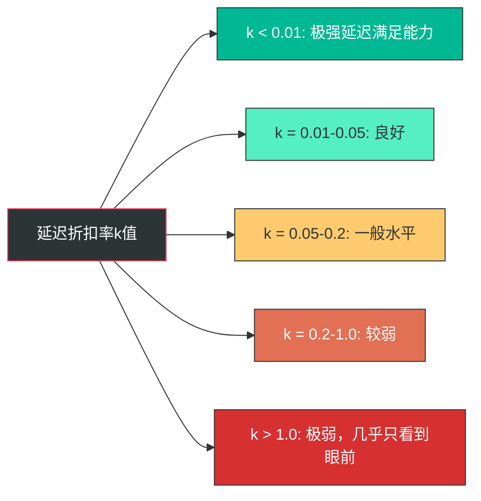
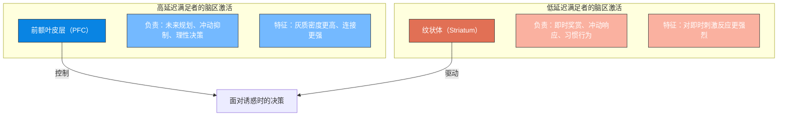
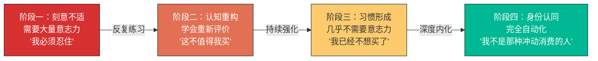

## 五、延迟满足：为什么能等的人最后赢了一切

### 1. 为什么延迟满足是搞钱心理学的核心能力

在所有影响财富积累的心理特质中，延迟满足（Delayed Gratification）的预测力排名第一。

这不是一句鸡汤。杜克大学一项持续30年的纵向研究追踪了1000名儿童从出生到成年的财务状况，发现：4岁时延迟满足测试得分最高的那批孩子，到30岁时的净资产是得分最低那批的3.2倍，年收入高出27%，信用卡债务少63%。这些差异在控制了家庭收入、父母教育水平、智商等变量后依然显著。

延迟满足之所以如此重要，是因为财富积累的底层逻辑就是时间的函数——复利需要时间发酵，技能需要时间沉淀，资产需要时间增值。一个无法忍受"现在不花钱"的人，永远无法进入"让钱替你工作"的阶段。

### 2. 科学定义：延迟满足到底是什么

#### 2.1 定义与边界

延迟满足是指**在面对即时奖赏和延迟奖赏的选择时，主动选择更大但需要等待的奖赏的能力**。

这个定义包含三个关键要素：

| 要素 | 说明 | 举例 |
|------|------|------|
| 选择存在 | 必须有两个或以上的选项 | 现在拿100元 vs 一年后拿150元 |
| 即时奖赏较小 | 马上能得到的回报价值较低 | 冲动买一件300元的衣服 |
| 延迟奖赏较大 | 等待后获得的回报价值更高 | 300元投入年化10%的基金，5年后变483元 |

**延迟满足不等于：**
- **压抑欲望**：压抑是被动的痛苦忍耐，延迟满足是主动的价值选择
- **节俭/抠门**：节俭是对所有支出的压缩，延迟满足是对低价值支出的拒绝
- **苦行僧主义**：苦行僧否定物质享受，延迟满足追求更高质量的享受
- **纯粹的耐心**：耐心是等待的能力，延迟满足是在等待中做出理性判断的能力

#### 2.2 延迟折扣：大脑如何给未来"打折"

理解延迟满足的核心障碍，需要先理解一个概念：**延迟折扣（Delay Discounting）**。

延迟折扣是指：当奖赏被延迟时，人们对其主观价值的贬损。通俗地说，"一年后给你100元"在你心里可能只值"现在给你70元"——那30元的差额就是时间给奖赏打的折扣。

延迟折扣率（k值）可以用以下双曲线模型量化：

```text
V = A / (1 + k × D)

V = 奖赏的主观价值
A = 奖赏的实际价值
k = 个体的延迟折扣率（越大越不耐心）
D = 延迟时间
```

**举例说明：**

假设延迟折扣率k=0.1（中等水平）：
- 现在的100元，主观价值 = 100 / (1 + 0.1×0) = **100元**
- 1个月后的100元，主观价值 = 100 / (1 + 0.1×1) = **90.9元**
- 6个月后的100元，主观价值 = 100 / (1 + 0.1×6) = **62.5元**
- 1年后的100元，主观价值 = 100 / (1 + 0.1×12) = **45.5元**
- 5年后的100元，主观价值 = 100 / (1 + 0.1×60) = **14.3元**

这意味着对于k=0.1的人来说，5年后的100元在心理上只值14.3元——这就是为什么大多数人无法坚持长期投资。复利在数学上是指数增长，但在心理上被双曲线折扣压缩成了几乎平坦的线。



#### 2.3 延迟折扣率与财务行为的对应关系

| 延迟折扣率 | 典型财务行为 | 常见人群画像 |
|-----------|------------|------------|
| 极低（k<0.01） | 长期投资、提前还房贷、坚持定投10年以上 | 成熟投资者、高净值人群 |
| 较低（k=0.01-0.05） | 能坚持储蓄、有养老金规划、会做预算 | 财务健康的家庭 |
| 中等（k=0.05-0.2） | 偶尔储蓄、年终奖存不住、信用卡分期 | 大部分工薪阶层 |
| 较高（k=0.2-1.0） | 月光、信用卡透支、发工资三天花完 | 年轻月光族 |
| 极高（k>1.0） | 借高利贷消费、赌博、透支未来 | 财务失控者 |

### 3. 经典实验：从棉花糖到神经科学

#### 3.1 斯坦福棉花糖实验（1968-1972）

1968年，斯坦福大学心理学家沃尔特·米歇尔（Walter Mischel）在宾州幼儿园启动了心理学史上最著名的实验之一。

**实验设计：**
- 被试：4-5岁学龄前儿童，共653名（分批次进行）
- 任务：单独坐在房间里，面前放着一颗棉花糖（或曲奇、薄饼等儿童选择的零食）
- 规则：如果能等15分钟不吃，就能得到两颗；如果想吃，可以按铃叫实验者回来，但只能得到一颗
- 记录：等待时间、自我控制策略

**实验发现：**

第一，等待时间呈双峰分布——约1/3的孩子等满了15分钟，约1/3在30秒内就吃了，其余分布在中间。这说明延迟满足能力存在显著的个体差异。

第二，等待策略比意志力更重要。能等待的孩子不是在"硬忍"，而是使用了**认知重评策略**——有的孩子把棉花糖想象成"白云"（去焦点化），有的闭上眼睛不看（注意力转移），有的自己唱歌分散注意力。米歇尔总结道："**关键不在于抑制冲动，而在于改变对冲动对象的认知表征。**"

第三，也是最重要的——**10年追踪研究（1988年）和30年追踪研究（2011年）发现：**

| 追踪指标 | 能等待的孩子（高延迟组） | 不能等待的孩子（低延迟组） | 差异幅度 |
|---------|---------------------|----------------------|---------|
| SAT总分 | 平均210分高出 | — | +14% |
| 学历水平 | 更高比例获得学士及以上 | — | — |
| BMI指数 | 更低（更健康） | 更高 | — |
| 药物使用率 | 更低 | 更高 | — |
| 应激应对能力 | 更强 | 更弱 | — |
| 2011年fMRI脑扫描 | 前额叶皮层更活跃 | 纹状体更活跃 | — |

#### 3.2 棉花糖实验的争议与修正

2018年，纽约大学泰勒·瓦茨（Tyler Watts）等人在《心理科学》发表了一项重要的重复实验，对原结论提出了重要修正：

**修正一：家庭社会经济地位（SES）的调节作用。** 原始实验的被试主要来自斯坦福大学教职工家庭，SES同质性很高。瓦茨的研究发现，当控制了SES后，棉花糖测试的预测力大幅下降——从原始研究的显著预测降到了"很小但统计上仍显著"的程度。

**修正二：环境信任的影响。** 2020年罗切斯特大学的一项实验将儿童分为"可靠环境组"（实验者先兑现了一个承诺）和"不可靠环境组"（实验者食言），结果：可靠组的平均等待时间是不可靠组的4倍。这说明延迟满足能力部分反映了儿童对环境的信任程度——如果过往经验告诉你"等待会被骗"，不等才是理性选择。

**综合解读：**

| 因素 | 对延迟满足的影响 | 重要程度 |
|------|----------------|---------|
| 先天气质（多巴胺系统敏感度） | 决定基线水平 | ★★★★ |
| 家庭SES | 提供等待的"安全垫" | ★★★★ |
| 环境信任度 | 决定等待是否有意义 | ★★★★ |
| 认知策略训练 | 可显著提升 | ★★★ |
| 自我效能感 | 信念影响行为 | ★★★ |
| 文化背景 | 影响对"等待"的价值判断 | ★★ |

这意味着：**延迟满足能力不是固定的先天特质，而是可以通过训练、环境设计和认知策略来显著提升的。** 这一点对我们的搞钱实操至关重要。

#### 3.3 神经科学视角：延迟满足的大脑机制

2011年，凯西等人使用fMRI对原棉花糖实验的参与者进行了脑扫描，发现了两个截然不同的脑区激活模式：



**关键发现：**

- **前额叶皮层（Prefrontal Cortex, PFC）**是延迟满足的"执行官"。它负责抑制冲动、评估长期后果、做出理性规划。PFC的发育从青少年期持续到25岁左右才完全成熟——这解释了为什么年轻人的延迟满足能力普遍较弱。

- **纹状体（Striatum）**是即时奖赏的"发动机"。当面对诱惑时，纹状体释放多巴胺，驱动"想要"的冲动。多巴胺系统的个体差异部分解释了延迟满足能力的先天差异。

- **两者的竞争关系**：面对即时诱惑时，PFC和纹状体像拔河一样争夺控制权。PFC越强（通过训练可以增强），延迟满足能力越好；纹状体反应越剧烈（面对更大的诱惑或压力时），越难延迟满足。

- **好消息——神经可塑性**：2014年密歇根大学的研究发现，经过8周的冥想训练后，被试的PFC灰质密度显著增加，延迟折扣率下降了约15%。这意味着**大脑是可以被训练的**。

### 4. 延迟折扣的七大影响因素

理解什么在影响你的延迟折扣率，才能有针对性地进行干预。

#### 4.1 即时奖赏的"可获得性"

奖赏越"近在咫尺"，延迟折扣率越高。这在消费场景中表现为：

- **线上购物比线下更冲动**：因为下单只需一个点击，奖赏的即时性被技术放大了
- **信用卡比现金更难控制**：信用卡将"支付的痛苦"延迟到了下个月，降低了消费的心理阻力
- **花呗/白条等分期工具**：将大额支出拆成"每天只要X元"的小额即时体验，本质上是在利用延迟折扣心理

**实操启示**：增加消费的摩擦力（删除保存的支付方式、关闭免密支付）可以有效降低冲动消费。

#### 4.2 奖赏的确定性

人们对不确定的延迟奖赏打折更狠。"一年后给你100元"和"一年后50%概率给你200元"的期望值相同，但大多数人更偏好前者——即使100元比200元少。

这解释了为什么：
- 银行存款（确定）的心理吸引力 > 基金定投（不确定）的心理吸引力
- 月薪制（确定）比提成制（不确定）更容易让人坚持储蓄
- 人们对"稳赚不赔"的项目有非理性偏好

**实操启示**：让储蓄目标尽可能具体、可视化、可预期，降低不确定性带来的折扣效应。

#### 4.3 情绪状态

情绪对延迟满足的破坏力被严重低估。大量研究一致发现：

| 情绪状态 | 对延迟折扣率的影响 | 机制 |
|---------|----------------|------|
| 压力/焦虑 | k值上升50%-100% | 压力激素皮质醇抑制PFC功能 |
| 愤怒 | k值上升30%-80% | 激活"行动导向"模式，偏好即时行动 |
| 悲伤 | k值上升25%-50% | 引发"零售疗法"式的即时补偿需求 |
| 孤独 | k值上升40%-70% | 孤独感激活与饥饿类似的脑区，驱动即时满足 |
| 恐惧 | k值上升20%-40% | 触发"战斗或逃跑"反应，短期化思维 |
| 积极情绪 | k值下降10%-20% | PFC功能增强，更愿意考虑未来 |

**实操启示**：不要在情绪低落时做任何财务决策。建立一条铁律——**心情不好时，关闭所有购物APP**。

#### 4.4 认知负荷

当大脑被其他任务占满时（工作压力大、同时处理多件事），延迟满足能力会显著下降。这被称为**"自我损耗"效应**（Ego Depletion）——虽然这个概念近年来有争议，但核心结论是稳健的：**疲劳时做的财务决策质量更差**。

罗伊·鲍迈斯特（Roy Baumeister）的经典实验发现：让被试先做一个需要自控力的任务（抵制巧克力的诱惑），之后他们在延迟满足测试中的表现显著下降——就像肌肉疲劳一样，自控力也会"用完"。

**实操启示**：
- 重要的财务决策（投资、大宗消费）放在精力充沛的上午做
- 不要在一天工作结束后打开购物APP
- 设置自动化规则（定投、自动转账）代替需要持续消耗意志力的手动操作

#### 4.5 社会比较与同伴效应

当周围的人都在即时消费时，你的延迟折扣率会自动上升。这不仅仅是"面子"问题，而是深层的进化机制——在人类进化史上，"和群体保持一致"是生存策略，偏离群体会引发焦虑。

哈佛大学的研究发现：当被试被告知"你的同伴选择了即时奖赏"时，他们选择延迟奖赏的概率下降了35%。

**实操启示**：有意识地选择社交圈。和有储蓄习惯、投资习惯的人交往，比读100本理财书更有效。

#### 4.6 感知到的"可逆性"

当人们觉得"随时可以反悔"时，延迟折扣率反而更高。这被称为**"可逆性悖论"**——看起来给了你更多自由，实际上削弱了你的自控力。

典型场景：
- "先买了，不合适再退"（网购退货率高达30%以上）
- "先试试，不行就卖掉"（投资中频繁买卖）
- "先办卡，不想去了可以转"（健身房年卡使用率不到20%）

**实操启示**：减少"可逆"的幻想。给自己设置不可逆的承诺机制——比如定期存款锁定期、投资账户的冷静期设置。

#### 4.7 未来自我的连续性

这是近年研究中最令人振奋的发现之一。

2011年，哈尔·赫什菲尔德（Hal Hershfield）在UCLA进行了一项开创性实验：让被试通过VR看到自己变老后的样子（数字化模拟的70岁面容），结果：看到"未来自我"的人，在随后的财务分配任务中多分配了30.2%到退休账户。

赫什菲尔德解释说：**大脑把"未来的自己"当成一个陌生人。你愿意为一个陌生人牺牲当下的享受吗？答案通常是否定的。** 但当你让"未来的自己"变得具体、可感知时，这个"陌生人"就变成了"你认识的人"，甚至"你自己"。

fMRI扫描证实：当人们想到"未来的自己"时，脑区激活模式与想到"陌生人"时高度相似；而想到"当下的自己"时激活模式截然不同。

### 5. 延迟满足与财富积累的数学关系

延迟满足不是鸡汤，是可以用复利公式精确量化的数学事实。

#### 5.1 复利视角：10年延迟的代价

假设两个人，A和B，每月投资1000元，年化收益率10%：

| | A（25岁开始） | B（35岁开始） |
|---|---|---|
| 投资年限 | 40年（到65岁） | 30年（到65岁） |
| 本金投入 | 48万 | 36万 |
| 最终资产 | **6,324,072元** | **2,171,321元** |
| 收益倍数 | 13.2倍 | 6.0倍 |

**A只比B多投了10年，但最终资产是B的2.9倍。** 这10年的延迟代价是415万元。每一天的"以后再说"都在用复利给你记账。

#### 5.2 消费视角：一杯奶茶的蝴蝶效应

每天一杯30元的奶茶，如果你把这笔钱改为每周定投：

| 时间跨度 | 累计定投本金 | 按年化8%计算的终值 |
|---------|-----------|-----------------|
| 1年 | 10,950元 | 11,395元 |
| 5年 | 54,750元 | 66,823元 |
| 10年 | 109,500元 | 167,536元 |
| 20年 | 219,000元 | 524,137元 |
| 30年 | 328,500元 | 1,236,089元 |

每天一杯奶茶，30年的代价是123万元。这不是要你戒掉奶茶，而是要你**看到每一个消费选择的"隐含成本"**。

#### 5.3 行为经济学视角：双曲线折扣与财务陷阱

很多金融产品正是利用了人们的高延迟折扣率：

| 金融产品/消费陷阱 | 利用的心理机制 | 受害者画像 |
|----------------|-------------|----------|
| 信用卡分期 | 将大额支出拆解为"每天只要X元"的即时感知 | 高延迟折扣率者 |
| 花呗/白条 | 延迟支付降低消费痛感 | 年轻消费者 |
| 消费贷 | "先享受后付款"的即时满足框架 | 收入预期过高者 |
| 彩票/赌博 | 极高不确定性但即时开奖 | 延迟折扣率极高者 |
| "0元购"营销 | 消除即时成本的感知 | 冲动消费者 |
| 预售/盲盒 | 即时拥有的快感 + 不确定性刺激 | 寻求即时刺激者 |

### 6. 延迟满足的个体差异与类型学

并非所有人在延迟满足上面临同样的挑战。理解自己的类型，才能对症下药。

#### 6.1 四种延迟满足类型

| 类型 | 特征 | 延迟折扣率 | 核心障碍 | 占比（估计） |
|------|------|-----------|---------|-----------|
| 天生等待者 | 天生对未来奖赏敏感，容易做到延迟满足 | 低 | 可能过度延迟，错过当下享受 | ~15% |
| 规则执行者 | 通过外部规则和系统实现延迟满足 | 中低 | 依赖规则，规则失效时容易崩塌 | ~25% |
| 情绪摇摆者 | 知道应该延迟，但情绪一来就破功 | 中高 | 情绪管理能力不足 | ~40% |
| 即时反应者 | 大脑默认选择即时奖赏 | 高 | 需要系统性的环境改造和训练 | ~20% |

#### 6.2 性别差异

多项研究的元分析显示，延迟满足能力的性别差异很小（Cohen's d < 0.1），但在具体表现上有差异：
- 男性在**投资决策**中延迟折扣率更高（更倾向于频繁交易）
- 女性在**消费决策**中延迟折扣率略高（更倾向于冲动购物）
- 但差异远小于个体差异，不具有预测价值

#### 6.3 年龄曲线

延迟满足能力并非随年龄线性增长，而是呈倒U型曲线：


- **3-7岁**：前额叶皮层快速发育，延迟满足能力从接近零快速提升
- **12-25岁**：多巴胺系统高度活跃，PFC尚未完全成熟，延迟满足能力波动较大——这是冲动消费和"先享受"的高峰期
- **25-50岁**：PFC完全成熟，生活经验积累，延迟满足能力达到峰值
- **50岁以后**：部分认知功能下降，但生活智慧和自律习惯可以补偿

### 7. 延迟满足与相关概念的区分

搞钱心理学中涉及多个与延迟满足相关的概念，厘清它们之间的关系有助于建立完整的认知框架。

#### 7.1 概念矩阵

| 概念 | 核心定义 | 与延迟满足的关系 | 在财务中的体现 |
|------|---------|----------------|-------------|
| 延迟满足 | 选择更大但延迟的奖赏 | — | 坚持定投、延迟消费、储蓄优先 |
| 自我控制 | 抑制冲动行为的能力 | 延迟满足的执行工具 | 控制购物欲、抵制诱惑 |
| 意志力 | 持续抵抗诱惑的心理能量 | 延迟满足的能量来源，但会耗竭 | 不在疲惫时做决策 |
| 自律 | 自动化执行有益行为的习惯 | 延迟满足的高级形态——不再需要"忍" | 自动储蓄、自动定投 |
| 前瞻性思维 | 能够想象和规划未来 | 延迟满足的认知基础 | 财务规划、退休规划 |
| 风险承受力 | 能接受不确定性 | 相关但不等同 | 股票投资、创业 |

**关键区别：** 延迟满足的最终目标不是永远延迟，而是**让自律取代意志力**——当储蓄、投资、理性消费变成不需要"忍"的自动化行为时，延迟满足才算真正内化。

#### 7.2 "过度延迟满足"的陷阱

延迟满足也有过度的可能——这不是假设，而是真实存在的现象：

| 过度延迟的信号 | 表现 | 心理机制 |
|-------------|------|---------|
| 过度节俭 | 为了储蓄牺牲基本生活品质 | 金钱警觉脚本 + 损失厌恶 |
| 投资恐惧 | 有钱只存银行，不敢做任何投资 | 对不确定性的过度规避 |
| 享受愧疚 | 花钱有负罪感，即使金额合理 | 金钱脚本中的"花钱=坏"信念 |
| 目标陷阱 | 永远在为"下一个目标"储蓄，从不消费 | 目标膨胀——目标不断后移 |
| 错失当下 | 过度牺牲当下的幸福换取不确定的未来 | 高估未来、低估当下 |

**健康的延迟满足应该是：** 有选择地延迟低价值的即时消费，同时不吝啬地投资高价值的长期体验和成长。核心公式是——

> 延迟满足 = 减少消耗型即时消费 + 增加投资型延迟消费

### 8. 文化视角：不同文化中的延迟满足

延迟满足能力的文化差异被广泛研究，结论比你想象的更复杂。

#### 8.1 东西方差异

| 维度 | 东亚文化 | 西方文化 |
|------|---------|---------|
| 对储蓄的态度 | 文化鼓励储蓄，"未雨绸缪"是美德 | 消费文化更强，"享受当下"更主流 |
| 延迟满足的自然程度 | 较高（儒家文化强调"先苦后甜"） | 较低（消费主义文化鼓励即时满足） |
| 潜在风险 | 过度节俭、"延迟陷阱"、不懂享受 | 过度消费、缺乏储蓄意识 |
| 对投资的影响 | 偏好确定性高的储蓄，对股票投资保守 | 更愿意承担投资风险 |

#### 8.2 中国语境下的特殊挑战

在中国的搞钱语境下，延迟满足面临三个特殊挑战：

**挑战一：消费主义的急速渗透。** 中国在20年内完成了西方50年的消费升级，消费主义文化对年轻一代的冲击是断崖式的。花呗、白条等消费金融工具的普及，让"超前消费"变得比"延迟满足"更"正常"。

**挑战二：房市的心理扭曲。** 过去20年房价持续上涨的历史，制造了一个扭曲的延迟满足范式——"早买早赚，晚买白干"。这让很多人的延迟折扣率在房产领域变成了负值（即"现在买比以后买更好"），但这种认知会泛化到其他消费领域，导致过度杠杆。

**挑战三：社交媒体的即时比较。** 小红书、抖音上的"晒"文化，每天都在提醒你"别人在享受而你在等待"。这种持续的社会比较会系统性地提高延迟折扣率。

### 9. 延迟满足的常见误区

#### 误区一：延迟满足=抠门/苦行

**真相：** 延迟满足拒绝的是低价值的即时消费，不是所有消费。一个健康的延迟满足者会在学习、旅行、健康上大方花钱，但在冲动购物、攀比消费、情绪消费上保持克制。关键区分：

| 该延迟的 | 不该延迟的 |
|---------|-----------|
| 冲动购物（买完就后悔的东西） | 健康投资（体检、优质食材） |
| 攀比消费（别人有我也要有） | 学习成长（课程、书籍、技能培训） |
| 情绪消费（心情不好就买买买） | 人际关系（与家人朋友的高质量相处） |
| 升级消费（手机必须最新款） | 体验消费（旅行、演出、新体验） |

#### 误区二：延迟满足靠意志力就行

**真相：** 意志力是有限资源，会耗竭。真正有效的延迟满足策略是**环境设计+自动化规则+认知重构**三管齐下，而不是"下次我一定忍住"。小陈案例中最有效的策略——解绑支付APP、设置自动转账、创建"等一等"文件夹——没有一个依赖意志力。

#### 误区三：延迟满足能力是天生的

**真相：** 棉花糖实验的后续研究已经证明，延迟满足能力受先天气质、家庭环境、文化背景、认知策略等多因素影响，且可以通过训练显著提升。密歇根大学的冥想训练研究显示，8周训练可以将延迟折扣率降低15%。另一项研究显示，接受"未来自我"可视化干预的被试，退休储蓄意愿提升了30%。

#### 误区四：年轻人就该及时行乐

**真相：** 这是一个精心包装的营销叙事，本质是消费主义为了让你花钱编造的理由。真正的及时行乐是把钱花在能带来持久幸福感的体验和成长上，而不是花在"买到手就贬值"的物品上。20岁的你如果每月存500元，按年化8%到60岁时将变成约170万元；如果35岁才开始，同样存到60岁只有约45万元。时间是最珍贵的资源，年轻时的每一块钱都是最值钱的一块钱。

#### 误区五：我收入太低，谈延迟满足没意义

**真相：** 延迟满足不是关于金额的，而是关于比例和习惯的。月入3000存300和月入30000存3000，在比例上完全等价，但在建立神经通路上前者可能更有价值——因为它需要更强的认知重构。收入低时建立的延迟满足习惯，会在收入增长时产生复利效应。

### 10. 延迟满足的神经可塑性训练原理

延迟满足能力的提升，在本质上是大脑神经通路的重塑。理解这个原理，才能对训练有信心。

#### 10.1 从"忍耐"到"自动"的四阶段模型



**阶段一（刻意不适）：** 这是最痛苦的阶段。每一次拒绝诱惑都在消耗意志力。你可能会感到焦虑、烦躁、FOMO（害怕错过）。这是正常的——你正在建立新的神经通路，旧通路仍在"反抗"。

**阶段二（认知重构）：** 你开始学会用更大的未来目标来重新定义当前选择。"不是我不能买，而是这个东西不值得我用XX目标去换。"前额叶皮层开始强化其对纹状体的调控连接。

**阶段三（习惯形成）：** 延迟满足开始变成默认模式。你不再需要每次都"做决定"——不买不需要的东西已经像呼吸一样自然。新的神经通路已经固化为默认路径。

**阶段四（身份认同）：** 最终阶段。你不再觉得自己在"延迟满足"，而是认为"我就是这样的人"。身份认同的改变是最深层的改变，它让行为不再依赖任何外部规则或内在意志力。

#### 10.2 训练的核心原理

| 原理 | 说明 | 实操对应 |
|------|------|---------|
| 渐进超负荷 | 像锻炼肌肉一样，从低难度开始逐步增加 | 先延迟24小时→48小时→1周→1个月 |
| 正强化 | 每次成功延迟后给自己积极反馈 | 里程碑奖励、进度可视化 |
| 认知重评 | 改变对诱惑的认知解读 | "未来自我"具象化、成本思维 |
| 环境设计 | 减少需要自控的场景 | 删除购物APP、自动转账、增加消费摩擦 |
| 习惯替代 | 用新的习惯替代旧的习惯 | 想买东西时改为散步/运动 |
| 社会支持 | 在支持性的社交环境中更容易坚持 | 加入储蓄小组、和有储蓄习惯的朋友交往 |

### 11. 本节核心要点总结

| 序号 | 核心要点 | 一句话概括 |
|------|---------|-----------|
| 1 | 延迟满足是财富积累的最强预测因子 | 能等的人在复利游戏中天然领先 |
| 2 | 延迟折扣率可以用数学模型量化 | 大脑给未来打折的方式是双曲线而非指数 |
| 3 | 棉花糖实验的核心是认知策略而非意志力 | 改变看问题的方式比硬忍有效100倍 |
| 4 | 环境信任影响延迟满足的合理性 | 不信任环境时，"及时行乐"反而是理性选择 |
| 5 | 情绪状态是延迟满足的最大敌人 | 压力和焦虑会让延迟折扣率翻倍 |
| 6 | 延迟满足能力可以通过训练提升 | 大脑有神经可塑性，8周冥想可降k值15% |
| 7 | "未来自我"的具象化是核心干预手段 | 让未来的你从"陌生人"变成"认识的人" |
| 8 | 环境设计比意志力可靠100倍 | 自动化规则和消费摩擦力是最佳工具 |
| 9 | 过度延迟满足也是一种问题 | 不要变成守财奴，要区分投资型和消耗型消费 |
| 10 | 延迟满足的终极形态是身份认同 | 从"我在忍"到"我就是这样的人" |

---

> **下一节预告**：理解了延迟满足的理论基础后，核心技巧部分将提供一套完整的"延迟满足能力建设"实操方案——从24小时冷静期规则到自动储蓄系统，从"未来自我"可视化到游戏化储蓄，帮助你把理论转化为行动。
