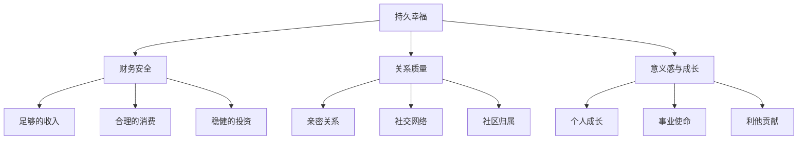

## 六、金钱与幸福的关系

"金钱能买到幸福吗？"——这可能是人类问过最多次的问题之一。答案远比"能"或"不能"复杂得多。过去二十年，积极心理学、行为经济学和神经科学在这个问题上积累了大量研究，揭示了一个令人惊讶的真相：金钱与幸福之间的关系是非线性的、有条件的、可被操纵的。理解这种关系，是搞钱心理学的核心基石——如果你不知道钱到底能在多大程度上让你幸福，你就无法做出正确的财务决策。

### 6.1 经典研究：两条截然不同的曲线

#### 6.1.1 Easterlin 悖论：为什么经济增长没有让人类更幸福？

1974年，美国经济学家理查德·伊斯特林（Richard Easterlin）发表了一篇划时代的论文。他分析了多个国家的调查数据后发现一个令人困惑的现象：在一个国家内部，富人确实比穷人更幸福；但当整个国家的收入水平随时间增长时，国民的平均幸福感并没有相应提升。这就是著名的"Easterlin 悖论"（Easterlin Paradox）。

这个悖论暗示了三件事：
- 绝对收入的增长并不能持续提升幸福
- 相对收入（你比别人赚得多还是少）可能比绝对收入更重要
- 存在一个"幸福天花板"，超过某个收入水平后，更多的钱带来的幸福增量急剧递减

#### 6.1.2 Kahneman & Deaton 的75,000美元门槛

2010年，诺贝尔经济学奖得主丹尼尔·卡尼曼（Daniel Kahneman）和经济学家安格斯·迪顿（Angus Deaton）发表了被引用超过万次的研究。他们对45万美国人的数据进行分析后得出结论：

> 当家庭年收入达到约75,000美元（按购买力折算，约相当于2026年的10万美元）时，日常情绪幸福感（emotional well-being）不再随收入增加而提升。

也就是说：年收入3万到7.5万美元之间，钱越多，每天的负面情绪（焦虑、悲伤、愤怒）越少；但超过7.5万美元之后，更多的钱并不能减少你的日常痛苦。

不过，他们同时发现，**生活评价**（life evaluation，即你对自己人生整体的满意度）会随着收入持续上升，只是上升的速度越来越慢。这说明：钱可以让你觉得"我的人生还不错"，但不一定能让你每天都更开心。

#### 6.1.3 Killingsworth 的反驳：幸福没有天花板？

2021年，宾夕法尼亚大学的马修·基林斯沃思（Matthew Killingsworth）在《美国国家科学院院刊》（PNAS）上发表了一项基于170万人实时情绪采样的研究，得出了不同的结论：幸福感随收入的对数持续线性增长，并没有在75,000美元处出现拐点。换句话说，从5万美元到50万美元，幸福感一直在上升。

这项研究一度让学术界陷入了"幸福有没有天花板"的争论。直到2023年，卡尼曼和基林斯沃思与另一位研究者合作进行了一项"对抗性合作"（adversarial collaboration），最终达成了一致结论：

**对于大多数人（约80%），幸福感确实随收入持续增长；但对于最不幸福的那20%人群（面临离婚、悲伤、临床抑郁等），收入超过10万美元后幸福感不再增加。** 换句话说，钱可以放大幸福，但无法修复深层的痛苦。

#### 6.1.4 关键洞察：钱到底能买到什么样的幸福？

| 幸福维度 | 金钱的作用 | 典型收入阈值 |
|---------|-----------|------------|
| 基础生存保障 | 决定性作用——没有钱就没有幸福 | 贫困线以下 |
| 减少日常烦恼 | 强作用——消除大部分经济焦虑 | 年收入3-7.5万美元 |
| 日常情绪体验 | 中等作用——中高收入区间效果递减 | 年收入7.5-15万美元 |
| 人生整体评价 | 持续正向——对数关系，一直增长 | 无明确天花板 |
| 深层心理痛苦 | 很弱——无法修复抑郁、孤独、创伤 | 收入无法解决 |
| 意义感与目的感 | 几乎无效——需要自我探索 | 与收入无关 |

### 6.2 享乐适应：为什么中彩票的人不会永远开心？

#### 6.2.1 享乐跑步机（Hedonic Treadmill）

1971年，心理学家菲利普·布里克曼（Philip Brickman）和唐纳德·坎贝尔（Donald Campbell）提出了"享乐适应"（Hedonic Adaptation）理论，也称为"享乐跑步机"（Hedonic Treadmill）。这个理论指出：人类有一个心理"基线幸福水平"（hedonic set point），无论发生好事还是坏事，我们的幸福感最终都会回归到这个基线。

经典研究案例：
- **彩票中奖者**：中奖一年后，他们的幸福感与未中奖的对照组没有显著差异
- **截瘫患者**：事故发生一年后，他们的幸福感虽然低于正常人，但远高于事故发生时的预期
- **加薪**：研究表明，加薪带来的幸福感提升平均只持续3-6个月

享乐适应的神经机制在于大脑的多巴胺系统。当你获得额外收入时，多巴胺会短暂激增，产生愉悦感；但大脑很快会对新的收入水平产生"耐受"，需要更多的钱才能产生同等程度的快感——这与药物成瘾的机制惊人地相似。

#### 6.2.2 享乐适应的四大驱动因素

| 驱动因素 | 机制描述 | 对搞钱者的启示 |
|---------|---------|--------------|
| 期望升级 | 收入增加后，消费期望同步提升 | 主动控制生活方式膨胀 |
| 社比较转变 | 加薪后进入新的社交圈，比较基准提高 | 警惕"朋友圈效应" |
| 注意力转移 | 新收入带来的快乐很快被日常琐事覆盖 | 将注意力放在持续性体验上 |
| 标准化归因 | 习惯化后将高收入视为"正常" | 定期感恩练习，重置心理基准 |

#### 6.2.3 如何对抗享乐适应？

享乐适应并非不可对抗。研究发现以下策略可以延缓适应过程：

**1. 体验式消费优于物质消费**
康奈尔大学的托马斯·吉洛维奇（Thomas Gilovich）教授进行了长达20年的研究，发现：购买体验（旅行、音乐会、学习新技能）带来的幸福感比购买物质商品更持久。原因是：
- 体验具有独特性，不容易被标准化和适应
- 体验融入自我认同（"我是一个去过冰岛的人"）
- 体验更容易进行积极的社会比较（和别人聊旅行比聊物品更愉快）
- 体验在回忆中会被"美化"（记忆的玫瑰色滤镜）

**2. 分散消费而非集中消费**
多次小额的快乐体验比一次大额消费更能对抗享乐适应。每周一次小确幸比一年一次大采购更持久地提升幸福。这背后的心理学原理是：频繁的变化防止了适应的发生。

**3. 延迟消费**
等待本身会增强快乐。研究发现，提前计划旅行的人在计划期间的幸福感甚至高于旅行期间。利用"期待效应"（savoring），让消费的快乐从购买前就开始。

**4. 减少比较**
频繁的社会比较是享乐适应的最大加速器。当你看到邻居买了新车，你对自家车的满意度会立刻下降。主动减少社交媒体浏览、避免炫耀性消费环境，可以有效延缓适应。

### 6.3 购买幸福的科学：怎么花钱才更快乐？

#### 6.3.1 Elizabeth Dunn 的 HAPPY 框架

不列颠哥伦比亚大学心理学教授伊丽莎白·邓恩（Elizabeth Dunn）在其著作《花钱的艺术》（Happy Money）中，基于大量实验研究，总结出了五种"买到更多幸福"的消费原则：

**H — Buy Experiences（购买体验）**
如前所述，体验消费的幸福回报远高于物质消费。具体实践：
- 将消费预算的30-40%分配给体验类消费
- 优先选择社交性体验（和朋友一起做的事情）
- 选择可以"讲故事"的独特体验

**A — Make It a Treat（把好东西变成"限量版"）**
当你把喜欢的东西从"日常"变成"偶尔"，它的快乐感会大幅提升。每天喝星巴克会变成习惯，但每周五的"犒劳咖啡"会成为期待。实践方法：
- 列出你最享受的3-5种消费
- 降低它们的频率，从每天变为每周或每月
- 为这些消费设定仪式感（特定时间、地点、方式）

**A — Buy Time（购买时间）**
用钱换取时间，是被严重低估的幸福策略。研究发现，花钱请人做自己不喜欢的家务（如清洁、做饭、通勤），比买奢侈品更能提升幸福感。关键原则：
- 计算你的"时间价值"——如果时薪200元，花100元请人做2小时的家务就是划算的
- 优先外包你最讨厌的任务
- 把省下的时间用于高幸福回报活动（社交、运动、学习）

**P — Pay First, Consume Later（先付钱，后享受）**
预付款（如提前购买旅行、预订餐厅）会创造期待感，而期待本身就是快乐的来源。同时，将付款与消费分离，可以减少"付钱的痛苦"对消费体验的干扰。实践方法：
- 提前1-3个月购买体验类消费
- 使用预付费而非即时消费模式
- 善用"等待期"来增强savoring（品味期待）

**Y — Invest in Others（投资于他人）**
邓恩的跨文化研究（包括加拿大、乌干达、印度、南非等）一致表明：为他人花钱比为自己花钱更能提升幸福感。这包括：
- 慈善捐赠（金额不必大，"五块钱效应"——捐5元和捐500元的幸福感差异远小于你的想象）
- 为朋友买小礼物
- 请客吃饭
- 赞助有实际需求的人

神经科学研究也证实了这一点：fMRI扫描显示，当人们把钱捐给慈善机构时，大脑的"奖赏中枢"（中脑边缘系统）的激活程度比自己收到同等金额时更强烈。

#### 6.3.2 幸福消费决策矩阵

当你面临消费决策时，可以用以下矩阵快速评估其幸福回报：

以下是常见消费类型的幸福回报对比：

| 消费类型 | 适应速度 | 社交性 | 幸福回报 | 说明 |
|---------|---------|--------|---------|------|
| 旅行体验 | 慢（记忆持久） | 高 | ★★★★★ | 独特体验+社交+回忆三重收益 |
| 和朋友聚餐 | 中 | 很高 | ★★★★☆ | 社交连接是幸福的核心来源 |
| 学习新技能 | 慢（持续成长） | 中 | ★★★★★ | 自我提升带来的成就感持久 |
| 演唱会/音乐会 | 慢（独特体验） | 高 | ★★★★☆ | 不可复制的体验，回忆价值高 |
| 高档装修 | 快（习惯化） | 中 | ★★☆☆☆ | 很快变"正常"，快乐消退快 |
| 数码产品 | 很快（代际淘汰） | 低 | ★★☆☆☆ | 新款一出，旧款快乐归零 |
| 豪华汽车 | 很快 | 低 | ★★☆☆☆ | 第一个月兴奋，之后就是代步工具 |
| 名牌包 | 快 | 低 | ★★☆☆☆ | 身份象征效应很快适应 |

### 6.4 金钱焦虑的心理学根源

#### 6.4.1 为什么"有钱"的人也会焦虑？

研究发现，即使是高收入人群中，也有相当比例的人存在严重的金钱焦虑。这种焦虑并非来自客观的财务状况，而是来自深层的心理机制：

**匮乏恐惧（Scarcity Mindset）**
哈佛大学教授塞德希尔·穆来纳森（Sendhil Mullainathan）在《稀缺》（Scarcity）一书中指出：稀缺感会占据人的认知带宽，导致智力下降（相当于少睡一整夜）和决策质量降低。这种稀缺心态一旦形成，即使客观条件改善，也会持续存在。

典型表现：
- 收入已经很高，但仍然害怕"不够"
- 不敢花钱，即使财务状况允许
- 总是在做最坏的财务假设
- 过度储蓄导致生活品质严重受损

**安全阈值漂移**
每个人的"安全线"会随收入上升而不断上移。月薪1万时觉得月薪3万就安全了，月薪3万时觉得月薪10万才安全。这种"目标蠕变"（goal creep）使得人们永远无法达到"足够"的状态。

**代际创伤传递**
如果父母经历过经济困难（如三年自然灾害、下岗潮），这种匮乏记忆会通过行为示范和情绪传递影响子女，即使子女的客观经济条件已经远好于父母。识别并处理这种代际传递，是解决深层金钱焦虑的关键。

#### 6.4.2 金钱焦虑的自测清单

以下表现中，如果你符合3项以上，说明可能存在需要处理的金钱焦虑：

- [ ] 每天查看银行账户或投资账户超过3次
- [ ] 收到意外账单时产生强烈的生理反应（心跳加速、胃部不适）
- [ ] 即使财务充裕，仍然不敢进行非必要消费
- [ ] 经常做关于金钱的噩梦或焦虑性联想
- [ ] 因为金钱问题影响睡眠质量
- [ ] 对伴侣或家人的消费行为过度控制
- [ ] 将自己的价值与银行余额紧密挂钩
- [ ] 频繁地与他人进行财务比较
- [ ] 回避查看账单、信用卡明细等财务信息
- [ ] "有钱才有安全感"是你最核心的信念之一

#### 6.4.3 从金钱焦虑到金钱安宁：四步法

**第一步：觉察（Awareness）**
记录你的"金钱情绪日记"——每当你对金钱产生强烈情绪（无论正面还是负面），记录下来：发生了什么？你的感受是什么？你的身体反应是什么？你的想法是什么？坚持记录2-4周，你就能识别出自己的金钱情绪模式。

**第二步：追溯（Tracing）**
将当前的金钱情绪与过去的经验联系起来。问自己：这种感受最早出现在什么时候？谁教给我这种关于金钱的信念？这个信念在当时可能是适应性的（帮助我度过了困难时期），但现在还适用吗？

**第三步：区分（Discrimination）**
区分"事实"和"恐惧"。"我的储蓄只够6个月的生活"是事实；"我会变成流浪汉"是恐惧。训练自己在金钱思维中识别事实与想象的区别，可以使用认知行为疗法（CBT）中的"证据检验法"：支持这个恐惧的证据是什么？反对的证据是什么？

**第四步：行动（Action）**
用具体的财务行动取代抽象的焦虑：
- 建立3-6个月的应急基金——有了它，大部分焦虑会自然消退
- 制定简单的月度预算——不确定性是焦虑的主要来源
- 设定自动化储蓄和投资——减少日常决策疲劳
- 定期进行"财务体检"——每月花30分钟审视财务状况

### 6.5 财务自由与幸福：重新定义"足够"

#### 6.5.1 "足够"的三个层次

| 层次 | 定义 | 量化标准（参考值） | 幸福特征 |
|------|------|-----------------|---------|
| 安全足够 | 基本需求得到满足，不再恐惧生存问题 | 应急基金覆盖6个月支出 | 焦虑显著降低，但可能仍有不满足感 |
| 自由足够 | 可以对不喜欢的事情说"不" | 被动收入覆盖基本支出的50%以上 | 自主权大幅提升，幸福感显著增加 |
| 丰盛足够 | 财务目标已经达成，赚钱成为选择而非必须 | 被动收入覆盖全部支出的100%以上 | 最大的幸福来源转向意义感和贡献感 |

关键洞察：大多数人在达到"安全足够"后，仍然在追求更多，因为他们没有明确自己的"足够"标准。设定一个具体的、个性化的"足够"数字，是走向金钱安宁的最重要一步。

#### 6.5.2 财务独立的幸福悖论

很多实现了财务独立（Financial Independence）的人报告说，真正退休后的幸福感并没有想象中那么高。原因包括：

- **身份认同危机**：工作不仅是收入来源，也是身份和社会关系的来源
- **结构缺失**：失去工作日程后，生活容易变得散漫和缺乏目的感
- **社交萎缩**：工作场所是主要社交场景，退休后社交网络缩窄
- **意义感真空**：如果没有找到新的"人生项目"，空虚感会迅速侵蚀幸福

因此，搞钱的最终目标不应该是"不用工作"，而是"可以自由选择做什么工作"。研究表明，自愿工作（voluntary work）的人比完全不工作的人更幸福——关键在于"自愿"和"选择权"。

#### 6.5.3 高效幸福财务规划框架

基于以上研究，以下是一个以幸福为导向的财务规划框架：

```mermaid
flowchart TD
    A[明确你的"足够"数字] --> B[建立安全垫]
    B --> C[消除金钱焦虑的根源]
    C --> D[优化消费结构]
    D --> E[增加体验消费比例]
    D --> F[购买时间——外包厌恶任务]
    D --> G[增加利他消费]
    E --> H[对抗享乐适应]
    F --> H
    G --> H
    H --> I[建立持续的幸福来源]
    I --> J[培养内在满足感]
    I --> K[投资社交关系]
    I --> L[追求意义感与成长]
    J --> M[金钱安宁状态]
    K --> M
    L --> M
```

### 6.6 不同收入阶段的幸福策略

#### 6.6.1 低收入阶段（月入<8000元）

这个阶段，提升收入确实是提升幸福的最有效手段。每一分钱都直接关系到生存质量和安全感。

核心策略：
- **优先消除生存焦虑**：建立最低3个月的应急基金，哪怕是每月存100元
- **投资自己**：将收入的5-10%用于提升赚钱能力（课程、证书、技能培训）
- **避免比较陷阱**：在社交媒体时代，低收入群体面临的比较压力最大。主动控制社交媒体使用
- **利用免费资源**：公园、图书馆、社区活动、免费线上课程——这些零成本活动也能提供社交和成长体验
- **避免有毒的省钱方式**：过度节省（如不看病、不吃好）会导致健康恶化，长期来看反而增加成本

#### 6.6.2 中等收入阶段（月入8000-30000元）

这个阶段是"享乐适应"最活跃的区域——收入增加了，但消费期望同步升级，幸福感可能不升反降。

核心策略：
- **警惕生活方式膨胀**（Lifestyle Inflation）：加薪后，先将增量的50%以上用于储蓄和投资，而非升级消费
- **优化消费结构**：按照HAPPY框架重新分配消费预算
- **建立"时间富裕"**：这个阶段最容易陷入"用时间换钱"的陷阱。有意识地保护休闲和社交时间
- **开始利他行为**：不需要等到有钱才开始帮助他人。即使每月捐赠100元，也能显著提升幸福感
- **设定"足够"上限**：明确告诉自己"月薪X万时，我将减缓对更高收入的追求"

#### 6.6.3 高收入阶段（月入>30000元）

这个阶段，边际幸福收益已经很低。继续追求更高收入的幸福回报远不如优化已有资源的使用方式。

核心策略：
- **从"更多"转向"更好"**：与其追求更多收入，不如提升已有消费的品质和意义
- **大量增加利他消费**：研究表明，高收入者通过利他行为获得的幸福提升最为显著
- **寻找"第二曲线"**：探索工作之外的意义来源——公益、创作、教学、社区建设
- **警惕"成功陷阱"**：高收入往往伴随着高压力、长工时、牺牲健康和关系。定期评估这些隐性成本
- **建立感恩习惯**：每天记录3件感恩的事——这个简单的习惯可以对抗享乐适应，研究显示其效果相当于收入翻倍

### 6.7 关系、意义与金钱的三角关系

#### 6.7.1 哈佛成人发展研究的启示

哈佛大学进行了人类历史上持续时间最长的纵向研究——"成人发展研究"（Harvard Study of Adult Development），跟踪了724人长达85年（1938年至今）。研究的核心发现是：

> **决定人生幸福的最重要因素不是金钱、名声或成就，而是亲密关系的质量。**

研究负责人罗伯特·瓦尔丁格（Robert Waldinger）教授总结道："那些在50岁时对人际关系最满意的人，在80岁时最健康。孤独是与吸烟同等严重的健康威胁。"

这个发现对搞钱者的启示是：如果你为了赚钱而牺牲了亲密关系——忽略家人、减少社交、把所有时间投入工作——那么你赚到的钱很可能不会让你更幸福。

#### 6.7.2 金钱与关系的双刃剑效应

金钱对关系有双向影响：

**正向影响：**
- 经济压力是离婚和关系冲突的首要原因之一。足够的收入可以消除这一主要压力源
- 财务安全让人有更多精力投入到关系维护中
- 共同的消费体验（旅行、美食）可以增进感情

**负向影响：**
- 赚钱的时间成本——每多加班一小时，就是少陪伴家人一小时
- 财务不平等可能导致关系中的权力失衡
- 对金钱的不同态度（脚本差异）是伴侣冲突的常见根源
- 炫耀性消费可能吸引错误的社交关系

#### 6.7.3 幸福的三大支柱平衡模型



真正的幸福来自于三大支柱的平衡。任何一个支柱的过度发展——比如为了财务安全牺牲关系，或者为了意义感忽视财务——都会导致整体幸福感下降。

### 6.8 实操工具箱

#### 6.8.1 幸福导向的月度财务审视模板

每月花30分钟完成以下审视：

**一、生存层检查（5分钟）**
- 应急基金是否覆盖3个月以上支出？
- 本月是否有逾期账单或利息损失？
- 保险保障是否足够？

**二、消费幸福审计（10分钟）**
- 本月最大的3笔支出分别是什么？
- 这些支出带来了持久的快乐还是短暂的快感？
- 有没有"购买时间"的机会被我忽略了？
- 本月有没有为他人花钱的时刻？感受如何？

**三、关系影响评估（10分钟）**
- 本月为了赚钱牺牲了多少小时的社交/家庭时间？
- 这些牺牲是否值得？
- 下个月有没有可以"还回去"的计划？

**四、意义感检查（5分钟）**
- 我目前的工作/赚钱方式让我有成就感吗？
- 有没有什么事情我想做但因为"不够赚钱"而没做？
- 下个月可以做一件什么样的"非功利"事情？

#### 6.8.2 幸福消费追踪表

建议使用以下表格追踪消费的幸福回报：

| 日期 | 消费项目 | 金额 | 类别（体验/物质/时间/利他） | 当时快乐值（1-10） | 一周后快乐值（1-10） | 一月后快乐值（1-10） | 备注 |
|------|---------|------|--------------------------|-------------------|--------------------|--------------------|------|
| 示例 | 周末和朋友爬山 | 150元 | 体验+社交 | 9 | 8 | 7 | 拍了很多照片，回味了好几天 |
| 示例 | 买了一双AJ | 1200元 | 物质 | 8 | 5 | 3 | 已经不怎么穿了 |

通过1-2个月的追踪，你会清楚地看到哪些消费真正提升了幸福，哪些只是一时冲动。

#### 6.8.3 个性化"足够"数字计算

使用以下公式计算你的个人"足够"数字：

**安全足够 = 月固定支出 × 6**（应急基金目标）

**自由足够 = 月固定支出 × 12 × 25**
（基于4%安全提取率的财务独立数字。如果你的月固定支出是8000元，则自由足够 = 8000 × 12 × 25 = 240万元。达到这个数字后，仅靠投资收益就能覆盖基本生活。）

**丰盛足够 = 月全部期望支出 × 12 × 25**
（包含所有想要的生活升级在内的完全财务自由数字。）

计算完成后，将这三个数字写下来，贴在你每天能看到的地方。有了具体的目标，焦虑就会转化为清晰的行动计划。

### 6.9 常见误区与纠正

#### 误区一："等我有了X万就幸福了"

**真相**：幸福不是目的地，而是旅途。研究一再表明，到达财务目标带来的幸福感是短暂的。如果你现在不幸福，更多的钱大概率也不会让你幸福——除非你的不幸福明确来自经济困难。

**纠正**：在追求财务目标的同时，同步投资于关系、健康和个人成长。不要把所有鸡蛋放在"金钱=幸福"这一个篮子里。

#### 误区二："钱多了烦恼就少了"

**真相**：钱多了，旧的烦恼少了，但新的烦恼出现了——如何管理这些钱？如何防止被骗？如何处理借钱请求？如何投资？钱多了，财务决策的复杂度也增加了。

**纠正**：提升财务素养应该与提升收入同步进行。学习基本的投资知识、税务知识和风险管理，避免"高收入穷人"的陷阱。

#### 误区三："别人都那么有钱，我肯定不够"

**真相**：社交媒体严重扭曲了我们对"正常"收入的感知。你看到的是别人精心筛选的高光时刻，看不到的是他们的债务、焦虑和不安。调查显示，高收入群体中对财务状况"不满意"的比例并不比中等收入群体低多少。

**纠正**：减少社交媒体使用，建立自己的"足够"标准，而不是与他人比较。记住：你不需要赚得比别人多，你只需要赚得"够多"。

#### 误区四："节俭就是美德，花钱就是罪恶"

**真相**：过度节俭和过度消费一样有害。过度节俭会导致：错过有价值的人生体验、损害社交关系、产生匮乏心态、甚至影响健康（如省医药费）。

**纠正**：区分"聪明的花钱"和"浪费的花钱"。按照HAPPY框架优化消费结构，而不是简单地减少所有消费。

#### 误区五："财务自由了就什么都不用做了"

**真相**：如前所述，完全不工作的人往往比自愿工作的人更不幸福。人类需要结构、目的感和社会贡献。

**纠正**：将财务自由的目标重新定义为"可以自由选择做什么"，而不是"什么都不做"。

### 6.10 本节核心公式

如果将本章内容浓缩为一个公式：

**持久幸福 = 足够的金钱 × 聪明的花钱方式 ÷ 享乐适应速度 + 高质量的人际关系 + 意义感与成长**

其中：
- "足够的金钱"是可以量化的——计算你的三个"足够"数字
- "聪明的花钱方式"是可以优化的——运用HAPPY框架
- "享乐适应速度"是可以减缓的——体验消费、分散消费、减少比较
- "人际关系"和"意义感"是金钱买不到的——需要主动投资时间和精力

理解了金钱与幸福的真实关系，你就不会陷入两个极端——既不会成为"金钱万能论"的信徒，也不会成为"金钱无用论"的空想家。你会成为一个清醒的搞钱者：知道钱很重要，也知道钱的边界在哪里。

***
