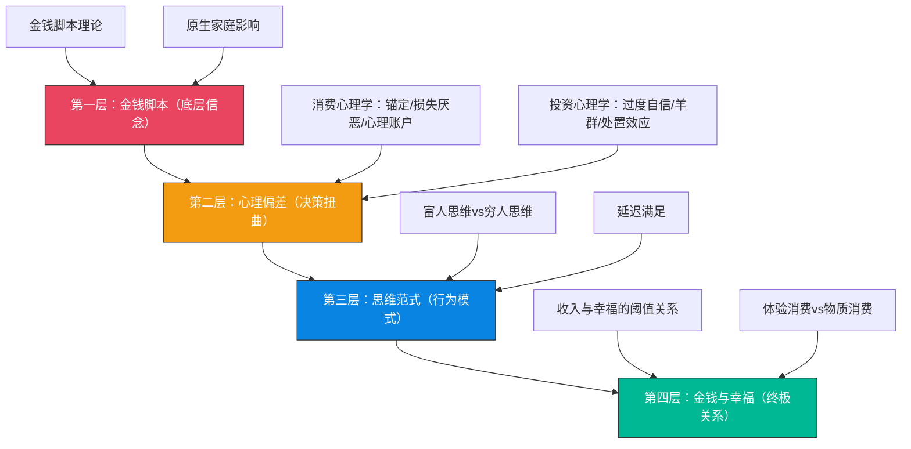

## 本节小结：理论基础全景回顾

本节围绕"搞钱心理学"的六个理论模块展开——从心理偏差全景图、金钱脚本理论、消费心理学、投资心理学，到富人思维与穷人思维的对比、延迟满足机制、以及金钱与幸福的终极关系。以下是对整节内容的系统梳理、核心要点提炼、知识关联分析，以及从理论到实践的行动指引。

---

### 一、六块理论拼图：它们如何构成一个完整体系

搞钱心理学的理论基础不是六个孤立的知识点，而是一个层层递进的因果链条。理解这个链条的结构，比记住每个概念更重要。

**自下而上的因果逻辑**：你的童年经历塑造了金钱脚本（深层信念），这些脚本驱动你产生系统性的心理偏差（决策扭曲），偏差反复累积固化为思维范式（穷人思维或富人思维），思维范式最终决定了你与金钱的关系质量——是焦虑、贪婪、逃避，还是从容、理性、平衡。

**自上而下的干预逻辑**：要改变财务结果，不能只在行为层面"逼自己存钱"或"强迫自己定投"。需要从思维范式入手（意识层面改变），通过识别和校正心理偏差（行为层面干预），最终改写深层的金钱脚本（潜意识层面重塑）。这就是为什么"知道该怎么做却做不到"——因为真正的阻力在最底层。

---

### 二、六大理论模块核心要点

#### 2.1 心理偏差全景图：搞钱路上的隐形敌人

财务决策中的心理偏差不是偶然的失误，而是人类大脑进化留下的系统性"bug"。我们的大脑是在食物匮乏、信息稀缺的远古环境中进化出来的，其默认决策模式在现代金融市场和消费环境中会产生系统性偏差。

**核心认知**：影响财务表现的因素中，心理因素的解释力超过50%，远超专业知识、信息获取能力、甚至市场环境本身。一个掌握了全部投资理论的人，可能因为"处置效应"而反复赢小亏大；一个精通消费心理学的营销专家，可能因为"金钱逃避脚本"而在无意识中破坏自己的财务成功。

**全景图的四层结构**：

| 层级 | 核心问题 | 涉及偏差 | 影响领域 |
|------|---------|---------|---------|
| 底层机制 | 金钱信念从何而来 | 金钱脚本（逃避/崇拜/地位/警觉） | 所有财务行为的底层驱动力 |
| 决策陷阱 | 每次决策如何被扭曲 | 锚定效应、损失厌恶、心理账户、处置效应、确认偏差、过度自信、羊群效应 | 消费、投资、借贷 |
| 思维范式 | 行为模式如何固化 | 富人思维vs穷人思维、延迟满足能力 | 收入模式、财富积累速度 |
| 终极关系 | 金钱与幸福的真实联系 | 收入阈值效应、体验优先原则 | 生活满意度、人生选择 |

#### 2.2 金钱脚本理论：你的金钱观是如何被"编程"的

金钱脚本（Money Script）由美国心理学家布拉德·克朗茨（Brad Klontz）提出，指关于金钱的深层信念和假设，通常在童年时期形成，像程序脚本一样指导一生的财务行为——而当事人往往意识不到它的存在。

**四大脚本类型及其行为后果**：

| 脚本类型 | 核心信念 | 典型表现 | 财务后果 | 觉察线索 |
|---------|---------|---------|---------|---------|
| 金钱逃避 | "钱是坏的/我不配有钱" | 回避看账单、无意识破坏财务成功 | 收入越高花钱越凶，难以积累财富 | 每次存款到一定金额就"莫名其妙"花掉 |
| 金钱崇拜 | "有钱就有一切" | 过度追求金钱、牺牲健康和关系 | 即使很富仍然不满足，可能陷入工作狂 | 永远觉得钱不够，无法停下赚钱的脚步 |
| 金钱地位 | "我的价值=我的财富" | 炫耀性消费、买超出能力的东西 | 过度消费、债务危机 | 买东西时首先考虑"别人会怎么看" |
| 金钱警觉 | "钱要小心看管" | 过度节俭、不敢花钱、财务焦虑 | 可能过度储蓄但无法享受生活 | 即使财务状况良好仍然焦虑不安 |

**脚本形成的三条路径**：

1. **原生家庭影响**——父母的金钱行为（如何赚钱、花钱、存钱、投资）、关于金钱的言语（常说的话、抱怨、争吵）、家庭经济状况（富裕、贫困、稳定、波动）、童年的金钱经历（第一次获得零花钱、第一次被拒绝买东西）
2. **社会文化塑造**——社会对富人和穷人的刻板印象、媒体对财富的呈现方式、同伴群体的消费水平和态度、宗教和文化对金钱的价值判断
3. **关键事件塑造**——家庭经济危机（破产、失业、重大损失）、第一次重大的财务成功或失败、重要他人的财务故事（亲戚的暴富或破产）

**脚本改写的三步法**：

1. **觉察**——识别自己的脚本类型。核心问题：我父母常说的关于金钱的话是什么？我小时候家里经济状况如何？我第一次对金钱有强烈感受是什么时候？我现在关于金钱最深的恐惧是什么？
2. **质疑**——检验脚本的合理性。核心问题：这个信念是事实还是假设？这个信念对我的财务行为有什么影响？这个信念是从哪里来的？它还适用于现在吗？
3. **改写**——建立新的、更健康的金钱信念。例如：将"钱是万恶之源"改为"钱是中性的工具，取决于如何使用"；将"我不配有钱"改为"我值得拥有财务安全和自由"；将"赚钱是最重要的"改为"赚钱是实现人生目标的手段"。

**关键科学支撑**：神经可塑性（Neuroplasticity）理论证实，大脑的结构和功能可以通过经验和训练发生改变。金钱脚本虽然在童年形成，但并非不可改变——通过有意识的训练，可以建立新的神经通路，改写旧的金钱信念。

#### 2.3 消费心理学：为什么你总是忍不住买买买

消费心理学揭示了商家如何利用人类心理的系统性偏差来操控你的消费决策。理解这些机制，是夺回消费自主权的第一步。

**三大核心偏差**：

**锚定效应（Anchoring Effect）**——人们在做决策时过度依赖最先获得的信息（"锚"），即使这个信息与决策无关。消费场景中的典型表现：商品标价1000元打5折卖500元，你感觉很划算，但如果商品本来就只值300元呢？"原价1000元"就是商家设置的锚。餐厅点菜时先看到888元的菜，再看388元的菜就觉得"不贵"。电脑12000元感觉很贵，但分12期每月1000元就觉得"还可以接受"。应对策略：在做购买决策前先独立评估商品的实际价值，关注总价而非月供。

**损失厌恶（Loss Aversion）**——诺贝尔经济学奖得主卡尼曼和特沃斯基的核心发现：人们对损失的痛苦感受是同等收益快乐感受的约2-2.5倍。消费场景中的典型表现：免费试用7天后不想"失去"服务而付费订阅；"限时优惠"让你害怕"损失"优惠机会而冲动购买；花了500元办的健身卡即使不想去也觉得"不用就亏了"。应对策略：区分"真正的损失"和"心理上的损失"，忽略沉没成本只关注未来收益。

**心理账户（Mental Accounting）**——诺贝尔经济学奖得主理查德·塞勒提出：人们在心理上将钱分成不同的"账户"，对不同来源、不同用途的钱有截然不同的态度。典型表现：工资精打细算，年终奖挥金如土；旅游基金花起来很爽快，生活费就斤斤计较；花现金更心疼，刷卡扫码就没那么在意。应对策略：意识到心理账户的存在，对所有消费一视同仁，制定统一的预算和消费规则。

**冲动消费的四重触发机制**：

| 触发维度 | 具体因素 | 作用机制 |
|---------|---------|---------|
| 情绪因素 | 压力、焦虑、空虚、兴奋 | 购物时大脑释放多巴胺产生快感，形成类似成瘾的行为模式 |
| 社交因素 | 朋友都在买、社交媒体种草、直播带货 | 从众心理+社会认同需求 |
| 环境因素 | 商场灯光音乐、电商满减机制、推荐算法 | 环境设计对决策的隐性操控 |
| 生理因素 | 多巴胺奖励回路 | 快感短暂，需要不断购买来维持 |

**消费者剩余与支付意愿**：消费者剩余是你愿意支付的最高价格与实际支付价格之间的差额。支付意愿受参考价格（锚定效应）、稀缺性（"限量版"）、社会认同（"大家都在买"）、情感连接（品牌故事）四个因素影响。理性消费的关键在于区分"需要"（基于实际功能需求）和"想要"（基于心理需求）。

#### 2.4 投资心理学：为什么你总在高点买入低点卖出

投资心理学揭示了散户投资者长期跑输市场的心理根源。研究表明，散户投资者的长期年化收益比市场平均低3-5个百分点，其中大部分差距来自心理偏差而非信息劣势。

**七大投资心理偏差**：

| 偏差名称 | 核心机制 | 典型表现 | 数据警示 |
|---------|---------|---------|---------|
| 过度自信 | 高估自己的知识和判断能力 | 频繁交易、认为自己能预测市场、把运气归因于能力 | 约74%的基金经理认为自己业绩高于平均水平（统计上不可能） |
| 羊群效应 | 跟随大多数人的行为 | 追涨杀跌、FOMO跟投、被KOL推荐左右决策 | 2015年A股暴涨暴跌、2017年比特币泡沫 |
| 处置效应 | 过早卖出盈利资产、过久持有亏损资产 | 赚了一点就跑、亏了很多还扛、组合中充满"僵尸"资产 | 散户普遍"赢小亏大"的主要原因 |
| 沉没成本谬误 | 考虑已投入且无法收回的成本 | "已经亏了这么多不能卖"、不断补仓摊薄成本 | 正确做法：问自己"如果现在手里是现金，还会买这只股票吗？" |
| 确认偏差 | 只关注支持已有信念的信息 | 买入后只看正面消息、对质疑者产生抵触 | 需要主动寻找反对意见来中和 |
| 代表性偏差 | 根据表面特征判断本质 | 连续三年高增长就认为会继续、过去业绩好就认为未来也好 | 忽视基础概率和均值回归 |
| 可得性偏差 | 根据信息可获得性判断概率 | 媒体报道的高估盈利概率、近期大涨低估下跌风险 | 信息的易得性≠事件的概率 |

**投资偏差的叠加效应**：这些偏差很少单独出现。一个典型的投资失败链条可能是：确认偏差让你只看到好消息→过度自信让你加大仓位→羊群效应让你在高点跟风买入→处置效应让你在下跌时死扛不卖→沉没成本让你在亏损时不断补仓→最终深度套牢。理解偏差之间的联动关系，比单独认识每个偏差更重要。

#### 2.5 富人思维vs穷人思维：思维模式如何决定财富上限

这不是指有钱人和没钱人的区别，而是两种截然不同的思维模式。思维模式不等于财富水平——有些身家千万的人仍然用穷人思维做决策，有些收入不高的人已经具备了富人思维。

**核心差异对比**：

| 维度 | 穷人思维 | 富人思维 |
|------|---------|---------|
| 对金钱的基本态度 | 金钱是目的（为了赚钱而赚钱） | 金钱是工具（用钱实现目标） |
| 时间与金钱的关系 | 用时间换钱（打工思维） | 用钱买时间（杠杆思维） |
| 面对风险的反应 | 回避风险、追求安全 | 理解风险、管理风险 |
| 面对机会的反应 | "我买不起" → 停止思考 | "我如何买得起" → 寻找方案 |
| 收入模式 | 单一线性收入（工资） | 多元非线性收入（工资+投资+被动收入） |
| 对失败的态度 | 失败是终点，证明"我不行" | 失败是学费，告诉我"此路不通" |
| 对学习的态度 | 学校毕业=学习结束 | 终身学习是基本生存策略 |
| 对时间的使用 | 消磨时间 | 投资时间 |

**思维模式的可塑性**：富人思维不是天生的，而是可以通过有意识的训练培养的。关键在于觉察——当你发现自己在用"我买不起"关闭思考时，有意识地切换到"我如何买得起"打开思考。这个简单的思维切换，长期来看会产生巨大的复利效应。

#### 2.6 延迟满足：预测长期财务成功的最强单一指标

延迟满足是为了更大的长远利益而放弃眼前的即时满足。斯坦福大学的棉花糖实验是这个概念最著名的验证——能等待的孩子在成年后的收入和财富水平显著更高。

**延迟满足的常见误解**：

- **误解一**：延迟满足=压抑欲望。事实：延迟满足不是不满足，而是选择在什么时候、以什么方式满足。
- **误解二**：延迟满足是天生的性格特质。事实：延迟满足是一种可以通过训练提升的能力。
- **误解三**：延迟满足只需要意志力。事实：环境设计比意志力更可靠——把诱惑移出视线比靠毅力抵抗更有效。

**延迟满足在搞钱中的三个应用场景**：

1. **消费场景**——看到想买的东西，等待24-72小时再决定。研究表明，超过50%的冲动消费欲望会在等待期内自然消退。
2. **投资场景**——坚持定投策略，不因短期波动而改变计划。复利效应需要时间才能显现，频繁操作反而破坏收益。
3. **事业场景**——接受短期内较低的收入，换取长期更高的成长空间。例如选择有学习机会的工作而非仅看起薪。

#### 2.7 金钱与幸福的关系：搞钱的终极目的是什么

搞钱不是目的，幸福才是。理解金钱与幸福的真实关系，才能避免在追求财富的过程中迷失方向。

**幸福的收入阈值**：普林斯顿大学经典研究发现，年收入约7.5万美元（约合人民币50万元）以下时，收入增加会显著提升幸福感；超过这个门槛后效果大幅减弱。2023年沃顿商学院的最新研究则发现，收入超过阈值后幸福感仍然持续提升，但提升速度明显放缓——对数关系而非线性关系。

**这对你意味着什么**：
- 如果你还在阈值以下，提升收入确实是提升幸福感的有效途径
- 如果你已经在阈值附近或以上，继续追求收入的边际收益递减，应该把更多精力放在体验、关系、健康等维度
- 不要用"追求幸福"为借口逃避必要的财务积累——基本的财务安全是幸福的必要条件

**体验优先原则**：行为科学研究一致表明，将钱花在体验（旅行、学习、社交）上比花在物品上更能提升幸福感。原因在于：体验带来的回忆会随时间"增值"（你会不断美化记忆），而物品带来的满足感会随时间"贬值"（适应效应——新车开了三个月就变成了"旧车"）。

---

### 三、理论之间的关键关联

理解单个理论只是第一步，更重要的是看到它们之间的关联——这些关联揭示了财务行为的深层逻辑。

#### 3.1 金钱脚本→心理偏差→思维范式的传导链

金钱脚本是底层"操作系统"，心理偏差是"运行时bug"，思维范式是"用户界面"。举例说明这个传导链：

**传导链案例一：金钱逃避脚本→处置效应→穷人思维**

一个童年时期目睹父母因钱吵架的人，可能形成"钱是坏东西"的金钱逃避脚本。这个脚本导致他在投资中不愿直面亏损（处置效应——死扛亏损股），因为他潜意识里觉得"关注钱"本身是不好的。长期下来，他的投资组合充斥着亏损资产，无法实现财富增长（穷人思维的固化）。

**传导链案例二：金钱地位脚本→锚定效应+损失厌恶→冲动消费**

一个从小被教育"有钱才有面子"的人，可能形成金钱地位脚本。这个脚本让他特别容易被"原价1000现价500"的锚定策略打动（锚定效应），也特别害怕"错过优惠"（损失厌恶），因为他觉得用高价买东西代表"有品位"，而错过打折代表"亏了"。结果是持续的冲动消费和债务累积。

**传导链案例三：金钱警觉脚本→过度自信→错失机会**

一个从小被教育"钱要小心看管"的人，可能形成过度的金钱警觉脚本。这种警觉让他过度自信于自己的"保守判断"，在别人投资时选择观望，在需要承担合理风险时退缩。长期下来，他可能储蓄不少但财富增长缓慢，错失了复利效应带来的长期收益。

#### 3.2 消费心理学与投资心理学的共同底层

消费心理学和投资心理学看似研究不同领域，但底层偏差是相通的：

| 底层偏差 | 在消费中的表现 | 在投资中的表现 |
|---------|--------------|--------------|
| 损失厌恶 | 害怕"损失"优惠而冲动购买 | 不愿确认亏损而死扛亏损股 |
| 锚定效应 | 被"原价"锚定而觉得折扣划算 | 被买入价锚定而影响卖出决策 |
| 过度自信 | 认为自己能识别"真正的好东西" | 认为自己能预测市场走势 |
| 从众心理 | 看到大家都在买就跟风 | 看到股票上涨就跟风追涨 |
| 确认偏差 | 买了之后只看好评 | 买入后只看正面消息 |

这意味着：如果你在消费中容易被锚定效应影响，你在投资中很可能也容易被锚定效应影响。觉察和校正应该在所有财务场景中同时进行，而非只针对某一个领域。

#### 3.3 延迟满足与富人思维的内在统一

延迟满足是富人思维的一个核心组成部分，但两者的关系比表面看起来更深刻：

- **富人思维的"用钱买时间"本质就是延迟满足**——放弃当下的消费享受，把钱投入到能产生长期回报的资产中
- **富人思维的"从失败中学习"也需要延迟满足**——忍受当下失败的痛苦，期待未来从中获得的智慧
- **延迟满足的能力反过来强化富人思维**——每一次成功的延迟满足都会增强"我能做到"的自我效能感，形成正向循环

---

### 四、关键数据与研究发现汇总

| 研究发现 | 来源 | 搞钱启示 |
|---------|------|---------|
| 心理因素解释超过50%的财务表现差异 | 行为金融学综合研究 | 改变搞钱结果，首先要改变搞钱心理 |
| 损失带来的痛苦是同等收益快乐的2-2.5倍 | 卡尼曼&特沃斯基前景理论 | 你对亏损的反应过度是正常的，但需要校正 |
| 散户长期年化收益比市场平均低3-5个百分点 | 行为金融学大数据分析 | 大部分差距来自心理偏差而非信息劣势 |
| 约74%的基金经理认为自己业绩高于平均 | 心理学研究 | 过度自信是人类的默认模式，不是个人缺陷 |
| 幸福感的收入阈值约为年收入50万元人民币 | 普林斯顿大学/沃顿商学院 | 基本财务安全是幸福的必要条件，但不是充分条件 |
| 体验消费比物质消费更能提升幸福感 | 积极心理学综合研究 | 把钱花在经历上比花在物品上更"值" |
| 冲动消费欲望50%以上在24-72小时内自然消退 | 消费行为研究 | "等等再买"是最简单有效的消费控制策略 |
| 棉花糖实验：延迟满足能力强的孩子成年后收入更高 | 斯坦福大学沃尔特·米歇尔 | 延迟满足是预测长期财务成功的最强单一指标之一 |

---

### 五、从理论到实践：行动清单

理论学习的最终目的是改变行为。以下是基于本节六个理论模块提炼的行动清单，按优先级排列。

#### 5.1 立即可以做的（今天就开始）

1. **完成金钱脚本自测**——问自己四个问题：我父母常说的关于金钱的话是什么？我小时候家里经济状况如何？我第一次对金钱有强烈感受是什么时候？我现在关于金钱最深的恐惧是什么？根据回答初步判断自己的主导脚本类型。
2. **记录一次消费决策的心理过程**——下一次消费时（无论金额大小），记录：是什么触发了购买欲望？是情绪、社交、环境还是实际需求？有没有锚定效应、损失厌恶或心理账户在起作用？
3. **设置24小时冷静期规则**——对于非必需品，看到想买的先加入购物车，等待24小时再决定。统计自己有多少比例的欲望在等待期消退。

#### 5.2 一周内完成的

4. **审计自己的心理账户**——列出你对不同来源的钱（工资、奖金、红包、投资收益）的态度差异。评估这些差异是否合理，是否导致了非理性消费。
5. **回顾最近一次投资决策**——用七大偏差清单逐项检查：有没有过度自信？有没有跟风？有没有确认偏差？有没有处置效应？诚实记录。
6. **制作"富人思维vs穷人思维"对照卡**——将本节的对照表打印出来或设为手机壁纸，在每次做财务决策时对照自查。

#### 5.3 持续进行的

7. **每周一次财务心理复盘**——回顾本周的消费和投资决策，识别心理偏差的出现，记录触发因素和应对方式。
8. **练习延迟满足**——从小事开始训练（比如想喝奶茶时等30分钟），逐步提升到更大的财务决策（比如想买电子产品时等一周）。
9. **逐步改写金钱脚本**——识别自己的主导脚本后，有意识地用新信念替代旧信念。这不是一朝一夕的事，需要持续数月甚至数年的有意识练习。

---

### 六、本节知识自测

用以下问题检验自己对理论基础的掌握程度：

| # | 问题 | 答案要点 |
|---|------|---------|
| 1 | 金钱脚本的四大类型分别是什么？各有什么典型表现和财务后果？ | 逃避、崇拜、地位、警觉。参见2.2节表格 |
| 2 | 锚定效应在消费和投资中分别如何表现？ | 消费中被"原价"锚定；投资中被买入价锚定 |
| 3 | 损失厌恶的倍率是多少？它如何影响消费和投资决策？ | 2-2.5倍。消费中害怕"损失"优惠；投资中不愿确认亏损 |
| 4 | 什么是处置效应？它的后果是什么？ | 过早卖出盈利资产、过久持有亏损资产。后果是赢小亏大 |
| 5 | 富人思维和穷人思维的核心区别是什么？ | 对金钱的态度（目的vs工具）、时间与金钱的关系（换钱vs买时间）、面对机会的反应（买不起vs如何买得起） |
| 6 | 延迟满足的三个常见误解是什么？ | ≠压抑欲望、≠天生特质、≠只靠意志力 |
| 7 | 幸福的收入阈值大约是多少？超过后怎么办？ | 约年收入50万元。超过后应把更多精力放在体验、关系、健康上 |
| 8 | 为什么消费心理学和投资心理学的底层偏差是相通的？ | 因为底层认知机制（损失厌恶、锚定、过度自信等）是跨场景的 |

---

### 七、通往下一节的桥梁

理论基础提供了"是什么"和"为什么"的解答——你已经知道了有哪些心理偏差、它们如何运作、为什么会影响你的财务行为。但"知道"和"做到"之间隔着一道巨大的鸿沟。

下一节"核心技巧"将解决"怎么做"的问题：如何识别消费陷阱并破解它？如何校正投资中的心理偏差？如何培养富人思维？如何训练延迟满足能力？如何修复与金钱的心理关系？如何建立理性财务决策框架？

每一个核心技巧都直接对应本节的理论模块——理论是地图，技巧是路线，两者缺一不可。

***

> **一句话总结**：搞钱的底层是心理。你的金钱脚本决定了你与金钱的关系，你的心理偏差扭曲了你的每一个财务决策，你的思维模式设定了你的财富上限。改变搞钱的结果，首先要改变搞钱的心理——而改变的第一步，是看见那些一直藏在暗处、操控着你的无形力量。
