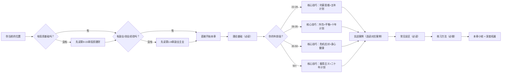

# 第33章：搞钱与人生规划

## 为什么需要这一章？

在前面的32章中，你已经系统学习了从副业开拓、投资理财、创业经商到税务筹划、财富传承、搞钱心理学的完整知识体系。但如果只掌握了"术"而缺乏"道"，你很可能陷入一个常见陷阱：**赚到了钱，却失去了生活；或者有了生活，却发现钱永远不够。**

本章是整本《搞钱指南》的"总控室"——它不教你某个具体的赚钱技巧，而是帮你建立一套**将搞钱嵌入人生全局**的思维框架。具体来说，本章要回答三个根本性问题：

1. **终点在哪？** —— 什么是真正的财务自由？你需要多少钱才算"够"？这个数字因人而异，但计算方法是确定的。
2. **路径怎么走？** —— 从当前位置到财务自由，中间有哪些里程碑？每个阶段应该做什么、不做什么？
3. **代价是什么？** —— 搞钱与健康、关系、兴趣、意义感之间如何平衡？什么时候该加速，什么时候该刹车？

> 💡 **本章的核心立场：** 搞钱是实现人生目标的手段，而非目标本身。最好的搞钱策略，是让你在到达终点时，不仅拥有了足够的财富，还拥有了值得用财富去享受的人生。

***

## 章节知识地图

```mermaid
graph TD
    A["第33章：搞钱与人生规划"] --> B["理论基础"]
    A --> C["核心技巧"]
    A --> D["实战案例"]
    A --> E["常见误区"]
    A --> F["练习方法"]
    A --> G["本章小结"]
    A --> H["深度拓展"]

    B --> B1["人生阶段规划全景图"]
    B --> B2["财务自由的定义与4%法则"]
    B --> B3["复利人生：技能/人脉/知识"]
    B --> B4["时间价值理论"]
    B --> B5["行为经济学与搞钱决策"]
    B --> B6["各年龄段财务规划指南"]
    B --> B7["目标设定的科学方法"]
    B --> B8["常见人生规划误区"]

    C --> C1["人生财务规划实操框架"]
    C --> C2["建立时薪思维"]
    C --> C3["外包策略"]
    C --> C4["财务自由路径规划"]
    C --> C5["人生目标与财务目标平衡"]
    C --> C6["极简主义与搞钱"]
    C --> C7["不同人生阶段的搞钱策略"]
    C --> C8["执行策略与习惯养成"]
    C --> C9["危机应对与财务韧性"]
    C --> C10["搞钱与身心健康"]

    D --> D1["互联网从业者的FIRE之路"]
    D --> D2["自由职业者的极简FIRE"]
    D --> D3["中年转型者的逆袭"]
    D --> D4["夫妻档的协同搞钱"]
    D --> D5["小镇青年的逆袭之路"]
    D --> D6["全职妈妈的财务重建"]
    D --> D7["退休规划实战"]

    style A fill:#2d3748,stroke:#4a5568,color:#fff
    style B fill:#1a365d,stroke:#2a4a7f,color:#fff
    style C fill:#1a365d,stroke:#2a4a7f,color:#fff
    style D fill:#1a365d,stroke:#2a4a7f,color:#fff
    style E fill:#744210,stroke:#975a16,color:#fff
    style F fill:#22543d,stroke:#276749,color:#fff
    style G fill:#2d3748,stroke:#4a5568,color:#fff
    style H fill:#44337a,stroke:#553c9a,color:#fff
```



***

## 核心问题清单

在进入正文之前，先列出本章将系统解答的核心问题。建议你在阅读过程中逐一对照，确保每个问题都得到了令你满意的回答：

| # | 核心问题 | 对应章节 | 为什么重要 |
|---|---------|---------|-----------|
| 1 | 什么是真正的财务自由？我需要多少钱才算"够"？ | 理论基础 | 如果连终点都不清楚，所有努力都可能是南辕北辙 |
| 2 | 4%法则在中国适用吗？需要怎么调整？ | 理论基础 | 直接套用美国数据可能导致严重低估所需资金 |
| 3 | FIRE运动有哪些流派？哪种适合我？ | 理论基础 | 不同流派对应完全不同的生活方式和资金需求 |
| 4 | 复利效应如何在技能、人脉、知识上体现？ | 理论基础 | 理解复利才能做出正确的长期投资决策 |
| 5 | 我的真实时薪是多少？怎么算？ | 核心技巧 | 真实时薪是一切搞钱决策的基准线 |
| 6 | 哪些事情应该外包？判断标准是什么？ | 核心技巧 | 外包不是偷懒，是时间资源的最优配置 |
| 7 | 五年/十年/二十年的财务自由路线图怎么画？ | 核心技巧 | 没有路线图的搞钱就是盲人摸象 |
| 8 | 人生目标和搞钱目标冲突时怎么取舍？ | 核心技巧 | 这是每个搞钱者终将面对的灵魂拷问 |
| 9 | 不同人生阶段应该采取什么搞钱策略？ | 核心技巧 | 25岁和45岁的最优策略截然不同 |
| 10 | 搞钱路上有哪些常见的认知陷阱？ | 常见误区 | 避坑比找路更重要——掉进坑里一切归零 |

***

## 关键概念速览

以下概念贯穿本章始终，先建立基本认知，后文将逐一展开：

| 概念 | 一句话解释 | 深入阅读 |
|------|-----------|---------|
| **4%法则** | 每年从投资组合中提取不超过4%，理论上可以永续使用 | → 理论基础 > 财务自由的定义 |
| **FIRE运动** | Financial Independence, Retire Early——通过高储蓄率实现提前退休 | → 理论基础 > 财务自由的定义 |
| **真实时薪** | 扣除通勤、应酬、减压消费等工作隐性成本后的实际小时收入 | → 核心技巧 > 建立时薪思维 |
| **外包思维** | 把低价值任务外包出去，把时间留给高价值活动 | → 核心技巧 > 外包策略 |
| **技能复利** | 技能之间相互叠加，产生指数级增长效果 | → 理论基础 > 复利人生 |
| **人脉复利** | 优质人脉网络随时间推移带来越来越大的回报 | → 理论基础 > 复利人生 |
| **知识复利** | 知识积累到一定程度后产生质变和跨界整合 | → 理论基础 > 复利人生 |
| **机会成本** | 做一件事A，就放弃了做另一件事B所能带来的收益 | → 理论基础 > 时间价值理论 |
| **储蓄率** | （收入-支出）/ 收入——FIRE运动认为这是最关键的变量 | → 理论基础 > FIRE运动 |
| **财务韧性** | 面对突发危机（失业、疾病、经济下行）时的财务抗打击能力 | → 核心技巧 > 危机应对与财务韧性 |

***

## 本章结构导航

本章按照 **"道 → 法 → 术 → 案例 → 避坑 → 行动 → 回顾 → 深化"** 的逻辑层层递进：

```text
第33章：搞钱与人生规划/
├── 00-章节概览.md          ← 你正在阅读的文件
├── 理论基础/               ← "道"：理解底层逻辑
│   ├── 01-人生阶段规划全景图.md      全生命周期的搞钱地图
│   ├── 02-财务自由的定义.md          4%法则、FIRE运动、储蓄率
│   ├── 03-复利人生.md                技能/人脉/知识三大复利
│   ├── 04-时间价值理论.md            时间的机会成本与最优配置
│   ├── 05-人生阶段搞钱理论框架.md    积累期→增长期→加速期→收获期
│   ├── 06-本节要点回顾.md
│   ├── 07-行为经济学与搞钱决策.md    认知偏差如何影响财务决策
│   ├── 08-各年龄段财务规划指南.md    20s/30s/40s/50s具体方案
│   ├── 09-目标设定的科学方法.md      SMART+OKR在搞钱中的应用
│   └── 10-常见人生规划误区.md
├── 核心技巧/               ← "法"与"术"：可执行的方法
│   ├── 01-人生财务规划实操框架.md    从理论到行动的桥梁
│   ├── 02-建立时薪思维.md            真实时薪计算与决策应用
│   ├── 03-外包策略.md                外包判断矩阵与实操建议
│   ├── 04-财务自由路径规划.md        5年/10年/20年路线图
│   ├── 05-人生目标与财务目标平衡.md  四象限框架与优先级管理
│   ├── 06-极简主义与搞钱.md          少即是多的财富哲学
│   ├── 07-不同人生阶段搞钱策略.md    因时制宜的具体方案
│   ├── 08-本节要点回顾.md
│   ├── 09-执行策略与习惯养成.md      从知道到做到的关键一步
│   ├── 10-危机应对与财务韧性.md      黑天鹅来了怎么办
│   └── 11-搞钱与身心健康.md          身体是1，财富是后面的0
├── 实战案例/               ← "器"：真实场景验证
│   ├── 01-互联网从业者的FIRE之路.md
│   ├── 02-自由职业者的极简FIRE.md
│   ├── 03-中年转型者的逆袭.md
│   ├── 04-夫妻档的协同搞钱.md
│   ├── 05-案例对比总结.md
│   ├── 06-小镇青年的逆袭之路.md
│   ├── 07-全职妈妈的财务重建.md
│   ├── 08-退休规划实战.md
│   └── 09-案例对比总结更新版.md
├── 04-常见误区.md           ← 搞钱路上的认知陷阱
├── 05-练习方法.md           ← 可落地的行动清单
├── 06-本章小结.md           ← 核心要点回顾
└── 07-深度拓展.md           ← 进阶阅读与延伸资源
```

***

## 适读人群与阅读策略

本章的内容适用于所有想要系统化管理财务人生的人，但不同背景的读者应该有不同的阅读策略：

### 初入职场的年轻人（22-28岁）

**你的核心问题：** 收入有限，不知道从哪里开始，容易被消费主义裹挟。

**阅读策略：**
1. **重点精读**：理论基础中的"财务自由定义"和"复利人生"——建立正确的搞钱认知比什么都重要
2. **重点精读**：核心技巧中的"建立时薪思维"——这是你一切决策的基准工具
3. **快速浏览**：核心技巧中的"财务自由路径规划"——先看五年计划部分
4. **选读**：实战案例中的"小镇青年的逆袭之路"和"自由职业者的极简FIRE"

**你最应该记住的一句话：** 20多岁最大的资本不是钱，是时间和学习能力。把80%的资源投资在自己身上。

### 工作3-8年的中坚力量（28-35岁）

**你的核心问题：** 收入开始可观，但支出也在膨胀（房贷、车贷、育儿），感觉钱永远不够用。

**阅读策略：**
1. **重点精读**：核心技巧中的"外包策略"和"人生目标与财务目标平衡"——你的时间最稀缺
2. **重点精读**：核心技巧中的"不同人生阶段搞钱策略"——找到你当前阶段的最优方案
3. **重点精读**：实战案例中的"夫妻档的协同搞钱"——如果有伴侣，这一篇必读
4. **选读**：理论基础中的"行为经济学与搞钱决策"——避免中产陷阱

**你最应该记住的一句话：** 储蓄率比收入更重要。月薪3万存1万的人，比月薪5万存5千的人更快到达财务自由。

### 面临中年转型的人（35-50岁）

**你的核心问题：** 体力下降、行业变化、家庭责任最重，转型的窗口在收窄。

**阅读策略：**
1. **重点精读**：理论基础中的"各年龄段财务规划指南"——了解你当前阶段的核心任务
2. **重点精读**：核心技巧中的"危机应对与财务韧性"——中年最大的风险是意外
3. **重点精读**：实战案例中的"中年转型者的逆袭"——看看别人怎么做的
4. **精读**：核心技巧中的"搞钱与身心健康"——身体是这个阶段最容易被忽视的资产

**你最应该记住的一句话：** 中年转型不是从零开始，而是把前15年积累的经验、人脉、技能重新组合。

### 接近或已退休的人（50岁以上）

**你的核心问题：** 如何让积累的财富支撑余生？如何继续创造价值？

**阅读策略：**
1. **重点精读**：实战案例中的"退休规划实战"——直接对标你的情况
2. **重点精读**：核心技巧中的"财务自由路径规划"中的二十年计划——验证你是否达标
3. **选读**：核心技巧中的"极简主义与搞钱"——降低支出就是提高财务自由度
4. **选读**：理论基础中的"时间价值理论"——重新思考时间的价值

**你最应该记住的一句话：** 财务自由不是终点，而是新生活的起点。关键不是"不工作"，而是"做自己想做的事"。

***

## 本章与其他章节的关系

本章是《搞钱指南》的"集大成"章节，它与前面的章节有密切的知识关联：

| 前序章节 | 与本章的关系 | 阅读建议 |
|---------|-------------|---------|
| 第1-8章（副业与主业） | 本章的"财务自由路径规划"建立在副业/主业收入增长的基础上 | 如果还没读，建议至少浏览第1章 |
| 第9-15章（投资理财） | 4%法则和复利理论直接依赖投资知识 | 必须具备基本投资常识 |
| 第16-22章（创业经商） | 创业是实现财务自由的路径之一，但不是唯一路径 | 选读即可 |
| 第23-29章（被动收入） | 被动收入是财务自由的核心指标 | 强烈建议阅读 |
| 第30章（税务筹划） | 税务优化直接影响你的实际储蓄率和投资回报 | 实操时必读 |
| 第31章（财富传承） | 财务自由的下一步是财富的长期保全 | 可延后阅读 |
| 第32章（搞钱心理学） | 本章的"行为经济学与搞钱决策"与之深度关联 | 建议先读第32章 |

***

## 阅读路线图



***

## 核心框架预览：人生的四阶段搞钱模型

本章理论基础部分将详细展开的"四阶段模型"，这里先给一个概览，帮助你在后续阅读中建立全局感：

| 阶段 | 年龄段 | 核心任务 | 资源分配原则 | 关键指标 |
|------|--------|---------|-------------|---------|
| **积累期** | 22-30岁 | 投资自己，积累技能和人脉 | 70%投资自己，20%储蓄，10%享受 | 技能数量、收入增长率 |
| **增长期** | 30-40岁 | 扩大收入，建立被动收入雏形 | 50%投资自己，30%投资资产，20%享受 | 储蓄率、被动收入占比 |
| **加速期** | 40-50岁 | 让钱生钱，优化收入结构 | 30%投资自己，50%投资资产，20%享受 | 被动收入/生活支出比 |
| **收获期** | 50-60岁 | 稳健收益，逐步退出主动工作 | 20%投资自己，60%稳健资产，20%享受 | 财务自由度（被动收入÷总支出） |

> ⚠️ 这个模型是理想化的参考框架，实际执行时需要根据个人情况灵活调整。有些人在35岁就进入加速期，有些人在45岁还在积累期——这都完全正常，关键是你清楚自己在哪里、要去哪里。

***

## 财务自由的数学本质

在深入正文之前，先建立一个核心认知：**财务自由是一个数学问题，不是一个感觉问题。**

```text
财务自由金额 = 年生活支出 ÷ 提取率

示例（基于4%法则）：
- 年支出20万 → 需要500万投资资产
- 年支出30万 → 需要750万投资资产
- 年支出50万 → 需要1250万投资资产

示例（基于更保守的3.5%提取率，中国适用版）：
- 年支出20万 → 需要571万投资资产
- 年支出30万 → 需要857万投资资产
- 年支出50万 → 需要1429万投资资产
```

**关键洞察：** 降低年支出1万元，相当于少攒25-29万元。这就是为什么"极简主义与搞钱"会成为本章的一个重要技巧——不是让你过苦日子，而是让你识别并消除那些不带来真正幸福感的支出。

***

## 本章的价值承诺

读完本章并完成练习后，你将能够：

1. **精确计算**你个人的财务自由金额，不再模糊地说"我要赚很多钱"
2. **绘制**一份属于你自己的5-20年财务自由路线图，包含具体里程碑和时间节点
3. **运用时薪思维**做出更理性的日常决策——从要不要点外卖到该不该跳槽
4. **识别**搞钱路上最常见的8种认知陷阱，避免前人踩过的坑
5. **建立**一套可持续的执行系统，从"知道"跨越到"做到"
6. **平衡**搞钱与健康、关系、兴趣之间的张力，不至于"赢了金钱，输了人生"

***

## 一句话总结本章

**搞钱的最高境界不是赚最多的钱，而是用最高效的方式，赚到足以支撑你理想生活的钱，然后把时间还给自己。**

***

> 📌 **阅读提示：** 建议先通读理论基础，理解核心框架后，再根据自己的人生阶段重点阅读对应的技巧和案例。最后一定要完成练习方法中的行动清单——否则只是"知道了"，并没有"做到"。知识不落地，等于不知道。
