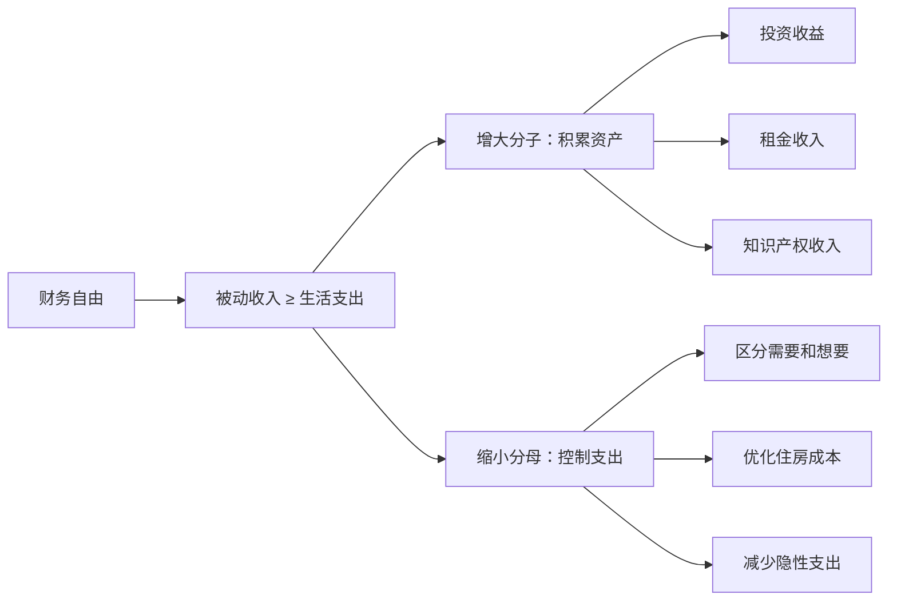
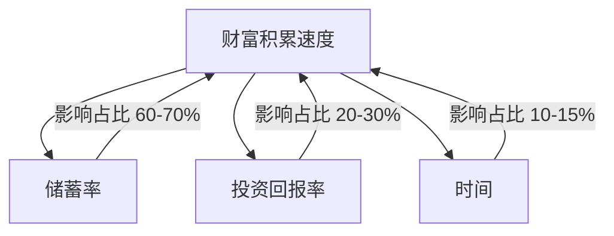
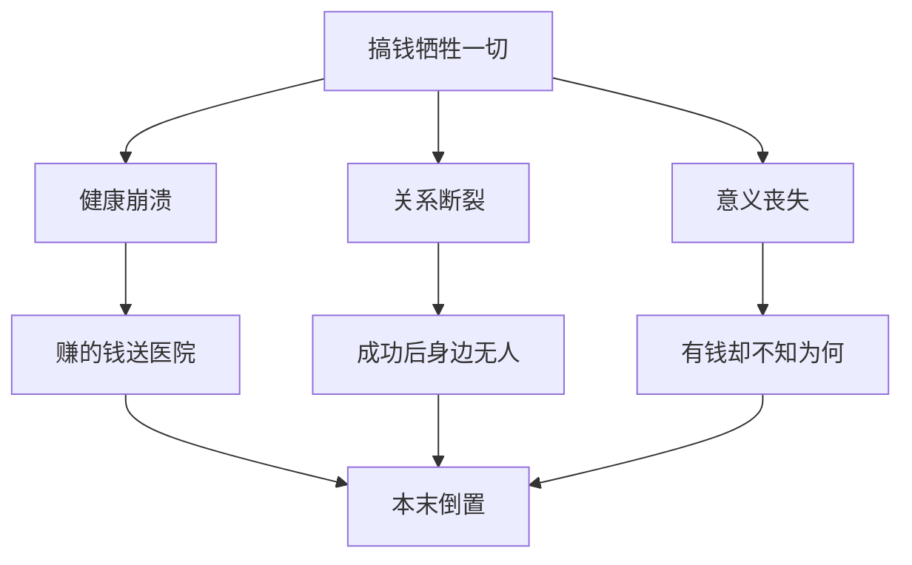
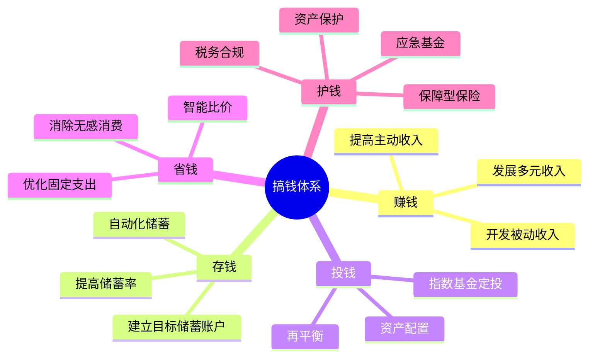
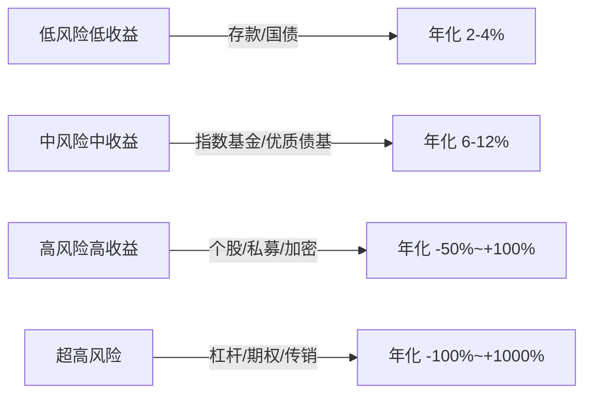
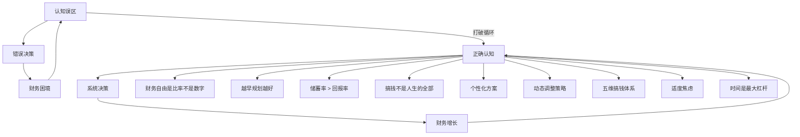

# 第33章：搞钱与人生规划 — 常见误区

搞钱路上，最危险的不是市场波动、行业下行或竞争对手，而是你头脑中那些根深蒂固的认知误区。这些误区往往披着"常识"的外衣，让你在错误的道路上越走越远，甚至越努力越偏离目标。

本章梳理了搞钱与人生规划中最常见的15个认知陷阱。每个误区都从「表现→原理→危害→纠正」四个维度展开，帮你建立一套完整的"免疫系统"。

> 💡 **阅读建议**：不要只看自己"没犯的错"——往往最该警惕的误区，恰恰是你认为"跟自己无关"的那个。

---

## 误区一：财务自由 = 有很多很多钱

### 误区表现

"我需要一个亿才能财务自由。"
"等我有5000万就退休。"
"财务自由是有钱人的事，跟我没关系。"

### 真相：财务自由是一个比率，不是一个数字

财务自由的本质定义极其简洁：

```text
财务自由 = 被动收入 ≥ 生活支出
```

这是一个**比率关系**，而非绝对金额。一个年支出5万元的小镇青年，按4%法则只需要125万投资资产就能实现财务自由；而一个年支出100万的一线城市中产，则需要2500万。

这就意味着**有两条路径可以到达财务自由**：

| 路径 | 策略 | 适用人群 | 难度 |
|------|------|---------|------|
| 增大分子 | 积累更多资产，提高被动收入 | 高收入者、创业者 | ★★★★ |
| 缩小分母 | 降低生活支出，极简生活 | 所有人，尤其早期阶段 | ★★☆☆ |
| 双管齐下 | 同时提高收入、控制支出 | 最优策略 | ★★★☆ |



### 为什么这个误区如此危险

当你把财务自由定义为一个"天文数字"时，会产生三个连锁反应：

1. **心理上放弃**：目标太远，大脑直接判定"不可能"，于是连第一步都不迈
2. **忽视可控变量**：你无法在短期内大幅提高收入，但你可以**今天**就开始优化支出结构
3. **错过"准自由"状态**：很多人其实已经处于"半自由"状态——被动收入覆盖了50%-80%的支出，但因为距离"完全自由"还有距离，所以觉得自己"还没开始"

### 纠正方法

**第一步：计算你的财务自由数字**

```text
你的年度真实支出 × 25 = 你的财务自由目标金额
```

比如你年支出10万，那你的财务自由目标就是250万，而不是"一个亿"。

**第二步：区分"生存线"和"理想线"**

| 层级 | 定义 | 示例（一线城市） |
|------|------|-----------------|
| 生存线 | 维持基本生活的最低支出 | 5-8万/年 |
| 舒适线 | 有品质但不奢侈的生活 | 15-25万/年 |
| 理想线 | 想要的全部生活方式 | 50-100万/年 |

先瞄准生存线和舒适线之间的财务自由数字，而非直接瞄准理想线。当你达到舒适线的财务自由时，你已经有了选择权——可以选择继续工作（因为想做，而不是必须做），也可以选择做任何你真正想做的事。

---

## 误区二：先赚钱，等有钱了再规划

### 误区表现

"我现在工资才5000，规划什么都没用。"
"等我月薪5万了再想这些。"
"先活下来再说，财务规划是有钱人的事。"

### 真相：规划本身就是最高效的赚钱方式

这个误区的根本错误在于把"规划"和"赚钱"当成了两件先后顺序的事，但实际上它们是**同一件事**。

**复利的时间杠杆**：假设你从25岁开始每月投资2000元（年化8%），到60岁时拥有约**536万**。如果从35岁才开始，同样的投入到60岁只有约**220万**。差距不是10年的投入，而是**316万**——这就是10年时间的复利价值。

| 开始年龄 | 每月投入 | 年化收益 | 60岁时总额 | 损失金额 |
|---------|---------|---------|-----------|---------|
| 25岁 | 2000元 | 8% | ~536万 | — |
| 30岁 | 2000元 | 8% | ~359万 | 177万 |
| 35岁 | 2000元 | 8% | ~220万 | 316万 |
| 40岁 | 2000元 | 8% | ~130万 | 406万 |

**习惯的复利效应**：记账、储蓄、投资决策——这些都是需要通过反复练习才能形成肌肉记忆的行为。你在月薪5000时养成的记账习惯，到月薪5万时依然有效；但如果你月薪5万才开始记账，你已经在高收入水平上积累了多年的混乱消费模式，纠正成本极高。

**规划本身就在帮你赚钱**：

1. 当你计算"真实时薪"（扣除通勤、加班、工作相关支出后的时薪），你会发现很多"赚钱"行为实际上是在**赔钱**
2. 当你梳理每月支出时，通常能发现15%-25%的"无感支出"——这些钱花出去你既没获得快乐也没获得成长
3. 当你设定明确的财务目标后，你的消费决策会自动变好——因为每一笔支出都有了一个参照系

### 纠正方法

**今天就开始三件事**（不需要任何收入门槛）：

1. **开始记账**：用最简单的方式——手机备忘录记大额支出，月底整理一次。不需要精确到分，关键是建立"花钱有意识"的习惯
2. **计算你的真实时薪**：

```text
真实时薪 = (月薪 - 工作相关支出) / (工作时间 + 通勤时间 + 加班时间 + 下班后恢复精力的时间)
```

比如月薪8000，扣除五险一金、通勤、工作餐、职业装等后到手约6000。每天工作8小时+通勤2小时+加班1小时+下班恢复1小时=12小时，每月22个工作日。真实时薪 = 6000 / (12×22) ≈ **22.7元/小时**。用这个数字去衡量每一笔消费——一顿200元的饭 = 你将近9小时的生命。

3. **设定"最小财务目标"**：比如"本月存下500元"或"本月找到一个每月能省下300元的支出点"。目标足够小，小到没有借口不去执行。

---

## 误区三：只要投资回报率够高，储蓄率不重要

### 误区表现

"我找到一个年化30%的投资机会，存多少钱无所谓。"
"炒股比存钱快多了。"
"等我找到一个好的投资标的，一切都解决了。"

### 真相：储蓄率是第一杠杆，回报率是第二杠杆

让我们用数学说话。

**场景A：高储蓄率 + 普通回报**
- 月存10000元，年化8%，10年后 ≈ **184万**

**场景B：低储蓄率 + 高回报**
- 月存3000元，年化15%，10年后 ≈ **83万**

储蓄率是你的3.3倍，回报率不到你的60%，但最终结果差距超过2倍。这不是巧合，而是数学必然——在财富积累的早期阶段，**增量投入的影响力远大于存量收益的增幅**。

FIRE运动的核心发现验证了这一点：决定你何时实现财务自由的最大单一变量不是投资回报率，而是**储蓄率**。



| 储蓄率 | 年化8%达到FI年限 | 年化15%达到FI年限 | 差距 |
|--------|----------------|------------------|------|
| 20% | 37年 | 25年 | 12年 |
| 40% | 22年 | 15年 | 7年 |
| 60% | 12.5年 | 8.5年 | 4年 |
| 80% | 5.5年 | 3.5年 | 2年 |

> 注：FI = Financial Independence（财务独立），假设从零开始，生活支出不变。

注意看表格——储蓄率从20%提到40%，省了15年；但回报率从8%提到15%，只省了12年。而且储蓄率的提升是**完全在你掌控之内的**，但高回报率往往伴随着高风险和不确定性。

### 为什么高回报率是个危险的执念

当你过度追求回报率时，会发生以下连锁反应：

1. **忽视风险**：年化30%的承诺在绝大多数情况下要么是骗局，要么隐含了你可能承受不起的风险
2. **忽视基本面**：你把时间花在寻找"神奇投资标的"上，而不是提升收入、降低支出这些可控的事情上
3. **情绪波动加大**：高收益必然伴随高波动，大多数人无法承受50%以上的回撤，最终在最低点割肉

### 纠正方法

**优先级排序**：储蓄率 > 收入提升 > 支出优化 > 投资回报率

1. **先把储蓄率提到30%以上**——这是"搞钱的地基"，地基不牢，上面盖什么都白搭
2. **用指数基金定投作为默认策略**——年化8%-12%的长期回报已经足够，不要追求"打败市场"
3. **只用"闲钱"追求高回报**——如果你确实想尝试高风险投资（如个股、加密货币），只用总可投资资产的5%-10%

---

## 误区四：为了搞钱可以牺牲一切

### 误区表现

"为了搞钱，几年不回家过年也没关系。"
"身体健康等退休了再养。"
"搞钱阶段不需要社交，太浪费时间。"
"婚姻可以晚点考虑，先把事业做起来。"

### 真相：有些东西一旦失去，再多钱也买不回来

这种"苦行僧式搞钱"的底层逻辑是：人生中存在一个"搞钱阶段"，只要熬过去，一切都会好起来。这个逻辑有三个致命漏洞：

**漏洞一：健康是不可逆资产**

你可以在30岁透支健康赚到100万，但你在40岁花100万也买不回30岁的身体。哈佛大学一项持续75年的研究表明，**健康是人生满意度的最强预测因子之一**，其影响力远超收入水平。中国每年有60万人"过劳死"——这不是数字，而是60万个家庭的崩塌。

**漏洞二：关系需要持续投资**

人际关系不是"暂停后可以一键恢复"的服务。你在搞钱阶段忽视的伴侣、朋友、父母，可能在你"成功"后已经不在了——不是去世，而是情感连接已经断裂。宾夕法尼亚大学的研究发现，**孤独感对健康的危害相当于每天抽15支烟**。

**漏洞三：意义感无法追溯补偿**

你无法"先赚够钱再找人生意义"。维克多·弗兰克尔在《活出生命的意义》中指出，**意义感是人类最深层的需求**——比安全需求、社交需求都更根本。一个在赚钱过程中完全丧失意义感的人，赚到钱后大概率会陷入更深的虚无。



### 纠正方法：建立"不可牺牲清单"

**第一步：列出你人生中绝对不能牺牲的5件事**

典型清单：

| 不可牺牲项 | 底线标准 | 检查频率 |
|-----------|---------|---------|
| 身体健康 | 每周运动3次，每晚睡眠7小时 | 每周自检 |
| 核心关系 | 每周至少1次高质量陪伴（伴侣/家人） | 每周自检 |
| 心理健康 | 每月1次独处反思时间，有情绪出口 | 每月自检 |
| 个人成长 | 每月至少读1本书/完成1个学习目标 | 每月自检 |
| 社交连接 | 每月至少1次朋友聚会或深度交流 | 每月自检 |

**第二步：设定搞钱的"硬边界"**

- 工作日最晚几点结束工作？（比如：不超过晚上10点）
- 周末是否至少留一天给自己/家人？
- 每年是否至少安排一次真正的假期（不带电脑）？

**第三步：定期审计**

每季度做一次"人生平衡轮"评估——给健康、关系、事业、财务、成长、娱乐、精神、社区八个维度分别打分（1-10）。如果任何维度低于4分，就是警报。

---

## 误区五：照搬别人的搞钱路径

### 误区表现

"某某靠炒币财务自由了，我也要炒币。"
"某某辞职做自媒体年入百万，我也要辞职。"
"某某30岁就FIRE了，我也要30岁退休。"
"这本书/这个课程说的方法一定有效，我照做就行。"

### 真相：幸存者偏差 + 个体差异 = 照搬必死

**幸存者偏差**是人类认知中最致命的陷阱之一。你看到一个靠炒币赚了1000万的案例，却看不到同期用同样方法亏光积蓄的10000个人。你看到一个辞职做自媒体年入百万的博主，却看不到同期尝试自媒体、年入不足3万、最终被迫回去上班的100000个人。

除了幸存者偏差，**个体差异**也决定了路径不可复制：

| 差异维度 | 影响因素 | 为什么不可照搬 |
|---------|---------|--------------|
| 起点差异 | 家庭背景、教育、存款 | 你的起跑线不同 |
| 资源差异 | 人脉、技能、行业积累 | 你手里的牌不同 |
| 风险承受力 | 年龄、家庭负担、心理素质 | 你能承受的损失不同 |
| 时机差异 | 市场周期、政策环境、技术阶段 | 时代窗口不同 |
| 能力差异 | 认知水平、执行力、学习速度 | 你的能力模型不同 |

### 纠正方法

**学"思维方式"，不学"具体方法"**：

1. **分析底层逻辑**：这个人成功的核心原因是什么？是时机、能力、资源还是运气？哪个因素占主导？
2. **抽象原则而非具体操作**：比如"做自媒体"是具体操作，"建立可复利的内容资产"是底层原则。后者可以应用于自媒体、写作、教学、开源项目等多种形式
3. **小规模验证后再投入**：不要一上来就辞职all in。先用业余时间验证路径是否可行，当副业收入达到主业的50%以上时再考虑转型
4. **建立"反证清单"**：每次看到一个成功案例，主动搜索"同一方法失败的案例"。这不是为了否定，而是为了看到完整的概率分布

---

## 误区六：忽视人生阶段的变化

### 误区表现

"我25岁时的搞钱策略，50岁也一样适用。"
"一个人的时候能存80%的收入，结婚后也应该能。"
"以前敢all in创业，现在也应该敢。"

### 真相：人生是一个动态系统，不是静止画面

每个阶段的约束条件和机会窗口都不同，强行用同一套策略应对所有阶段，就像用夏装过冬——不是衣服不好，是场景不对。

| 阶段 | 年龄区间 | 收入特征 | 支出特征 | 核心策略 | 典型错误 |
|------|---------|---------|---------|---------|---------|
| 探索期 | 22-28 | 低但增长快 | 低，自由度高 | 投资自己、试错、建立储蓄习惯 | 不敢试错，过早安定 |
| 积累期 | 28-35 | 快速增长 | 大幅增加（结婚、买房、生子） | 最大化储蓄率、多元收入 | 生活方式膨胀 |
| 巩固期 | 35-45 | 趋于稳定 | 高位运行（房贷、教育、赡养） | 稳健投资、风险控制 | 过度保守，错失增长机会 |
| 收获期 | 45-55 | 可能下降但被动收入增长 | 开始下降（房贷还完、孩子独立） | 加速被动收入积累 | 被"中年危机"困住 |
| 自由期 | 55+ | 以被动收入为主 | 低且可控 | 保守配置、享受人生 | 过度担心"钱不够" |

### 纠正方法

**每3-5年做一次"搞钱策略全面审计"**：

1. **审视约束条件变化**：结婚了？生子了？父母需要赡养了？健康状况变了？
2. **审视机会窗口变化**：所在行业是上升期还是衰退期？新技能需求出现了？
3. **调整风险偏好**：25岁亏光了可以从头再来，45岁亏光了可能没有第二次机会
4. **预留弹性空间**：永远不要把计划做到"刚好够"——在每个阶段的规划中留出20%-30%的缓冲

---

## 误区七：把"赚钱"等同于"搞钱"

### 误区表现

"搞钱就是赚更多的钱。"
"收入翻倍就财务自由了。"
"我的问题只有一个——赚得太少。"

### 真相：搞钱是一个五维系统，赚钱只是其中一维

把搞钱简化为"赚钱"，就像把健康简化为"不生病"——既不完整，也容易出问题。



**只关注"赚钱"的典型后果**：

| 问题 | 原因 | 结果 |
|------|------|------|
| 赚得多却存不下 | 储蓄率低，生活方式通胀 | "高薪月光族" |
| 存下了却不增长 | 闲置资金没有投资 | 被通胀侵蚀 |
| 有投资却没保护 | 缺乏保险和应急基金 | 一次意外回到原点 |
| 收入高但税负重 | 没有合理税务规划 | 实际到手远低于预期 |

### 纠正方法

**建立完整的搞钱体系，五维并行**：

1. **找到最弱的那个维度**——大多数人的最弱维度是"护钱"（没有保险、没有应急基金）或者"投钱"（钱在银行活期里贬值）
2. **先补短板，再拉长板**——木桶原理在搞钱体系中完全适用
3. **设置"五维仪表盘"**——每个月花10分钟审视每个维度的状态，像看汽车仪表盘一样

---

## 误区八：过度焦虑，把搞钱变成负担

### 误区表现

"我每天都睡不着，想着怎么搞钱。"
"看到别人赚得多就焦虑。"
"记账记到强迫症，每一分钱都要记。"
"每天看好几次账户余额。"
"一花钱就有罪恶感。"

### 真相：焦虑和动力的倒U型关系

心理学中有一个经典模型叫**耶克斯-多德森定律**（Yerkes-Dodson Law）：适度的压力能提升表现，但超过临界点后，压力越大，表现越差。

搞钱焦虑也是如此：


**过度焦虑的四重危害**：

1. **决策质量下降**：焦虑时大脑进入"战斗或逃跑"模式，前额叶皮层（负责理性决策）的功能被抑制，你更容易做出冲动决策——追涨杀跌、盲目跟风、all in投机
2. **健康成本增加**：长期焦虑导致失眠、免疫力下降、消化系统问题——你用来"搞钱"的时间和精力，最终花在了看病上
3. **关系质量下降**：焦虑的人很难维持高质量的人际关系，而好的关系恰恰是搞钱的重要资源（信息、机会、合作）
4. **生活质量下降**：搞钱的终极目的是过上好的生活，如果你因为搞钱而活在焦虑中，那就是目的和手段的彻底颠倒

### 纠正方法

**认知层面**：

1. **接受"够了"的概念**——不是追求最多，而是追求"足够"。足够 = 能支撑你想要的生活方式，而不是"比所有人都多"
2. **区分"过程指标"和"结果指标"**——关注"我这个月储蓄率达标了吗？""我今天学了新东西吗？"而不是"我的总金额到了多少？"。过程指标可控，结果指标受市场影响不可控
3. **建立"参照系"**——不要和社交媒体上的人比，那里的收入水平被严重高估。和一年前的自己比，看看进步了多少

**行为层面**：

1. **限定"财务关注时间"**——每周只在固定时间（比如周日晚上30分钟）查看账户、记账、审视预算。其他时间不看
2. **定期"数字排毒"**——每个月有1-2天完全不看任何财经信息、不刷任何投资相关内容
3. **练习正念**——当搞钱焦虑浮现时，用"标签法"处理：对自己说"我注意到我正在焦虑关于钱的事情"，然后不做任何反应，让焦虑自然消退

---

## 误区九：忽视"时间"这个变量

### 误区表现

"我还年轻，时间有的是。"
"等我忙完这阵子再规划。"
"退休还早着呢，不着急。"
"等市场稳定了再入场。"

### 真相：时间是最强大的杠杆，也是最不可逆的资源

时间在搞钱中有两个不可替代的角色：

**角色一：复利的催化剂**

复利效应在前期几乎不可见，但在后期呈指数爆炸。爱因斯坦（据传）说："复利是世界第八大奇迹。"关键不在于利率高低，而在于**持续时间的长度**。

| 每月投入 | 年化8%、持续10年 | 年化8%、持续20年 | 年化8%、持续30年 |
|---------|----------------|----------------|----------------|
| 1000元 | 18.3万 | 59.3万 | 150万 |
| 3000元 | 54.9万 | 178万 | 449万 |
| 5000元 | 91.5万 | 296万 | 749万 |

注意：30年总额中，后10年增长的金额约等于前20年的总和——这就是指数曲线的威力。你每拖延一年开始，损失的不是"那一年的收益"，而是"那一年在复利链条中的全部未来价值"。

**角色二：试错和学习的必要成本**

没有人第一次投资就能做出完美决策。你25岁亏掉5000元学到的教训，比你45岁亏掉50万学到的教训便宜100倍。早开始 = 早犯错 = 早学习 = 早成熟。

### 纠正方法

1. **今天的行动 > 明天的完美计划**——不要等到"准备好了"再开始，因为"准备好"是一个永远不会到来的状态
2. **从小事开始**——即使每月只能存200元，也比"等有钱了再存"强一万倍。200元存30年（8%年化）= 约30万
3. **设定"截止日期"**——给自己的每个财务决定设定一个deadline。比如"本月31号前开好证券账户"、"本周日前完成第一个月的预算"
4. **利用"心理账户"效应**——把投资设定为每月自动扣款（工资到账第二天），让"开始投资"不再需要一个决策动作

---

## 误区十：把"资产"和"负债"搞混

### 误区表现

"我买了房，所以我有资产了。"
"我买了车，这也是我的资产。"
"我有信用卡额度10万，等于多了10万的资产。"

### 真相：资产是往你口袋里放钱的东西，负债是从你口袋里掏钱的东西

罗伯特·清崎在《富爸爸穷爸爸》中给出了最简洁的定义：

- **资产（Asset）**：能把钱放进你口袋里的东西
- **负债（Liability）**：把钱从你口袋里拿走的东西

用这个标准重新审视你的"资产"：

| 物品 | 传统认知 | 实际分类 | 原因 |
|------|---------|---------|------|
| 自住房产 | 资产 | 负债 | 每月还贷、物业、维修、折旧——钱在流出 |
| 自用车辆 | 资产 | 负债 | 每月油费、保险、保养、折旧——钱在流出 |
| 出租房产 | — | 资产 | 租金收入 > 持有成本——钱在流入 |
| 指数基金 | — | 资产 | 分红 + 资本增值——钱在流入 |
| 消费贷款 | — | 负债 | 利息在持续流出 |
| 信用卡分期 | — | 负债 | 手续费远高于你想象 |
| 技能提升 | 无法衡量 | 资产 | 提高未来赚钱能力——最大的资产 |

> ⚠️ 这里不是说"不应该买房"，而是要认识到：自住房产在财务上是负债而非资产。买房可能有其他价值（安全感、学区、生活质量），但不要自欺欺人地说"买房是投资"。

### 纠正方法

1. **盘点你的真实资产和负债**——列一张清单，把所有"看起来像资产"的东西用"是否能把钱放进口袋"的标准重新分类
2. **优先购买"真资产"**——在满足基本生活需求后，优先把钱投入能产生现金流的资产（基金、优质股票、租金物业、技能提升），而非"看起来像资产的负债"（豪车、名牌、过度装修）
3. **减少"伪装资产的负债"**——审视你的每月固定支出中，有多少是"资产伪装的负债"在持续掏你的口袋

---

## 误区十一：混淆"投资"和"投机"

### 误区表现

"我投资了比特币。"
"我在股市里搞投资。"
"这个理财产品年化30%，我要投资。"

### 真相：投资和投机的区别不是品种，而是逻辑

很多人认为"买股票是投资，赌博是投机"——这是错误的。区别在于**决策逻辑**，而不在于品种：

| 维度 | 投资 | 投机 |
|------|------|------|
| 决策依据 | 价值分析、长期趋势 | 价格波动、短期消息 |
| 持有周期 | 年为单位 | 天/周为单位 |
| 收益来源 | 资产本身创造的价值 | 其他参与者的损失 |
| 风险管理 | 分散、对冲、仓位控制 | 止损/止盈（本质是赌博） |
| 信息优势 | 深入研究基本面 | 追热点、跟消息 |
| 典型行为 | 指数基金定投、长期持有优质企业 | 频繁交易、追涨杀跌、杠杆炒 |

**关键测试**：如果你买入一个标的后，即使明天不能交易（市场关闭一年），你也能安心持有——那是投资。如果你买入后每天要看十次价格，担心明天会不会跌——那是投机。

**用这个标准重新审视**：
- 比特币本身可以是投资也可以是投机——取决于你的买入逻辑和持有策略
- 股票本身可以是投资也可以是投机——巴菲特买可口可乐是投资，散户打板追涨停是投机
- 房产本身可以是投资也可以是投机——买来收租是投资，买来等涨价是投机

### 纠正方法

1. **先建立投资框架**——在投入任何一分钱之前，先花1-2个月学习基本的投资知识（推荐书单：《漫步华尔街》《指数基金投资指南》《聪明的投资者》）
2. **把投资和投机完全分开**——投资账户（长期，不动）和投机账户（玩乐，亏了不心疼）用不同的钱，绝不混用
3. **设定"投机上限"**——投机的钱不超过你总可投资资产的10%。亏完了也不影响你的财务自由计划

---

## 误区十二：忽视"生活方式膨胀"

### 误区表现

"涨工资了，换一个更好的房子/车吧。"
"收入提高了，当然要提高生活品质。"
"我辛苦赚的钱，不应该好好享受吗？"

### 真相：生活方式膨胀是储蓄率最大的隐形杀手

**生活方式膨胀**（Lifestyle Inflation / Lifestyle Creep）是指随着收入增加，生活支出也同步甚至更快地增加的现象。这是绝大多数人"赚得越多，却永远不够花"的根本原因。

举一个具体的例子：

| 状态 | 月收入 | 月支出 | 储蓄率 | 月储蓄 |
|------|-------|-------|--------|-------|
| 刚毕业 | 6000 | 4500 | 25% | 1500 |
| 工作3年 | 12000 | 9000 | 25% | 3000 |
| 工作7年 | 25000 | 22000 | 12% | 3000 |
| 工作10年 | 40000 | 38000 | 5% | 2000 |

收入涨了近7倍，但储蓄率从25%掉到5%，月储蓄额甚至比刚毕业时还低。钱去哪了？去了"更好的"租房、"更好的"餐厅、"更好的"衣服、"更好的"旅行……每笔消费单独看都"合理"，但汇总起来，吞噬了你所有的收入增长。

**更隐蔽的膨胀形式**：

- **社交升级**：同事聚餐从人均50变成了人均200，不好意思不去
- **隐性升级**：手机从2000变成6000，电脑从5000变成15000——"工作需要嘛"
- **期望升级**：以前觉得连锁酒店挺好，现在觉得至少要四星——"对自己好一点"
- **懒惰升级**：以前自己做饭，现在天天外卖——"忙，没时间"

### 纠正方法

**核心策略：收入增长时，先提高储蓄率，再提高生活水平**

1. **"50/50规则"**——每次涨薪后，把增量的50%用于提高储蓄/投资，50%用于改善生活。涨薪5000？2500自动转入投资账户，2500用来改善生活
2. **"延迟升级"**——任何消费升级决定，强制等待30天。30天后还想升级？那就升。大多数情况下，30天后你已经忘了这件事
3. **"反向升级挑战"**——每季度找到一个可以"降级"而生活质量几乎不受影响的支出项。比如从健身房年卡换成户外跑步+居家健身（年省5000+），从品牌咖啡换成自制咖啡（年省6000+）

---

## 误区十三：被动收入 = 不劳而获

### 误区表现

"等我有了被动收入，就不用工作了。"
"被动收入就是睡觉时也在赚钱。"
"我要找一个不需要努力就能赚钱的方法。"

### 真相：被动收入是"前期大量投入，后期持续产出"的收入模式

"被动收入"这个名字本身就容易引起误解——让人以为是"不需要做任何事"的收入。事实上，所有被动收入都需要前期大量的"主动投入"：

| 被动收入类型 | 前期投入 | 持续维护 | 真实案例 |
|-------------|---------|---------|---------|
| 投资收益 | 学习投资知识 + 积累本金 | 定期再平衡、关注宏观 | 指数基金定投10年 |
| 租金收入 | 买房首付 + 装修 + 找租客 | 维修、换租客、收租 | 出租一套小户型 |
| 知识产权 | 写书/做课/开发软件 | 更新、推广、客服 | 一本技术书版税 |
| 自媒体收入 | 持续产出高质量内容 | 保持更新、维护粉丝关系 | 公众号/YouTube |
| 自动化生意 | 搭建系统、建立团队 | 战略决策、系统维护 | SaaS产品 |

**关键认知**：被动收入的"被动"是相对于"你必须在场才能赚钱"而言的，而不是说"不需要做任何事"。前期投入的时间和精力往往比主动收入更多，只是在后期可以减少——因为你已经建好了系统。

### 纠正方法

1. **把"被动收入"重新定义为"系统化收入"**——你需要建一个系统（投资组合、出租物业、内容资产、自动化生意），这个系统在你减少投入后依然能产出
2. **做好"前期不被动"的准备**——在被动收入建立之前，你需要投入比主动工作更多的时间和精力
3. **选一个与你的技能匹配的被动收入方向**——会写作的做内容，懂技术的做产品，有积蓄的做投资，有人脉的做中介。不要追求"最赚钱"的，要追求"你能持续做"的

---

## 误区十四：只看收益率，不看风险

### 误区表现

"这个理财产品年化15%，比银行存款高多了。"
"某某基金去年涨了80%，我也要买。"
"收益越高越好，风险是胆小的人才考虑的。"

### 真相：收益和风险是一枚硬币的两面

在成熟的金融市场中，**不存在"高收益低风险"的产品**。如果有人向你推荐这样的产品，只有两种可能：

1. **他不了解风险**——他自己都不知道风险在哪里
2. **他在骗你**——他知道风险但选择隐瞒

这就是金融学中的**风险-收益对等原则**：



**风险不只是"波动"，还包括**：

| 风险类型 | 说明 | 常见场景 |
|---------|------|---------|
| 市场风险 | 标的价格下跌 | 股市整体下跌 |
| 流动性风险 | 需要用钱时卖不掉 | 房产、封闭期基金 |
| 信用风险 | 对方违约不还钱 | P2P、企业债 |
| 集中风险 | 押注单一标的 | 全仓一只股票 |
| 操作风险 | 人为失误 | 转错账、忘记续保 |
| 政策风险 | 政策变化导致损失 | 教培行业、加密货币 |
| 通胀风险 | 收益跑不赢物价上涨 | 全部存银行活期 |

**一个判断风险的简单方法**：问自己"如果这笔投资明天亏了50%，我的生活会受到实质影响吗？"如果会，说明你投入了超过承受能力的资金。

### 纠正方法

1. **永远先问"最坏情况是什么"**——在任何投资决策之前，先想清楚如果全部亏光，你能否承受
2. **建立"风险预算"**——确定你能承受的最大亏损金额，然后反推你能投入的金额。比如你能承受亏5万，这个标的最大回撤50%，那你最多投10万
3. **分散是唯一的免费午餐**——不要把超过20%的可投资资产放在任何单一标的上
4. **警惕"历史收益"**——过去表现不代表未来收益。去年涨80%的基金，今年可能跌50%

---

## 误区十五：混淆"赚钱"和"价值创造"

### 误区表现

"只要能赚钱就行，管它什么方式。"
"割韭菜也是一种能力。"
"我不在乎过程，只在乎结果。"

### 真相：不创造价值的赚钱方式有天花板且不可持续

所有持久的财富都建立在**价值创造**的基础上：

```text
你的收入 ≈ 你创造的价值 × 可复制性 × 杠杆系数
```

- **创造价值**：解决了什么问题？满足了什么需求？
- **可复制性**：你的时间投入一次，能服务多少人？
- **杠杆系数**：资本、团队、技术、品牌放大了你的产出

**不创造价值的"赚钱"方式**：

| 方式 | 为什么不持久 | 最终后果 |
|------|------------|---------|
| 零和博弈（赌博、内幕交易） | 你的收益 = 他人的损失 | 法律风险、社会关系崩塌 |
| 信息不对称欺诈 | 受害者会学习和传播 | 市场消失、口碑崩塌 |
| 利用规则漏洞 | 漏洞会被修补 | 收入来源断崖式消失 |
| 纯投机 | 没有内在价值支撑 | 均值回归，长期必亏 |

**创造价值的赚钱方式**则相反——越做越值钱：

| 方式 | 价值创造 | 可复制性 | 杠杆 |
|------|---------|---------|------|
| 写一本好书 | 帮助读者解决问题 | 无限复制 | 品牌 + 版税 |
| 开发一款好产品 | 满足用户需求 | SaaS可无限复制 | 技术 + 资本 |
| 教授一门好课程 | 传递知识和技能 | 线上可无限复制 | 品牌 + 平台 |
| 投资优质企业 | 资本支持创新 | 资本可复制 | 复利 + 时间 |

### 纠正方法

1. **每次搞钱前问自己：我创造了什么价值？**——如果答案是"没有"或"赚的是别人亏的"，这个方式不可持续
2. **投资于"越老越值钱"的技能**——写作、教学、编程、设计、咨询——这些技能随时间积累而增值
3. **建立"声誉资产"**——你的声誉是最有价值的长期资产。每一次诚实交易、每一个高质量交付、每一个被帮助的人，都是在往这个账户里存款

---

## 误区自检矩阵

下表汇总了15个误区的核心信号和纠正要点，建议定期（每季度）对照检查：

| # | 误区名称 | 核心信号（你是否这样想/做？） | 核心纠正 |
|---|---------|--------------------------|---------|
| 1 | 财务自由=很多钱 | "我需要X千万才算自由" | 计算你自己的数字 |
| 2 | 先赚钱再规划 | "等有钱了再想" | 今天就开始 |
| 3 | 只看回报率 | "找到高收益就行" | 储蓄率是第一杠杆 |
| 4 | 牺牲一切搞钱 | "其他以后再说" | 建立不可牺牲清单 |
| 5 | 照搬别人路径 | "他行我也行" | 学思维不学方法 |
| 6 | 忽视人生阶段 | "一套策略用到底" | 每3-5年审计一次 |
| 7 | 赚钱=搞钱 | "多赚就解决了" | 五维体系并行 |
| 8 | 过度焦虑 | "每天想着钱的事" | 设定关注时间窗口 |
| 9 | 忽视时间变量 | "还早呢/再等等" | 今天行动 > 明天完美 |
| 10 | 资产负债混淆 | "买了就是资产" | 往口袋放钱的才是资产 |
| 11 | 混淆投资投机 | "我在投资XX" | 问自己能否安心持有1年 |
| 12 | 生活方式膨胀 | "收入高了当然要升级" | 50/50规则 |
| 13 | 被动收入=不劳而获 | "找不用干活的赚钱方法" | 前期大量投入 |
| 14 | 只看收益不看风险 | "收益越高越好" | 先问最坏情况 |
| 15 | 混淆赚钱与价值 | "能赚就行" | 问自己创造了什么价值 |

---

## 心理陷阱的底层机制

为什么这些误区如此普遍且难以克服？因为它们根植于人类大脑的进化本能：

### 损失厌恶

人类对损失的痛感约为等量收益快感的**2-2.5倍**（Kahneman & Tversky, 1979）。这导致：
- 不敢开始投资（害怕损失）
- 在投资亏损时不愿止损（"不卖就不算亏"）
- 害怕错过机会而盲目跟风（FOMO）

### 即时偏好

人类天生偏好"现在的小收益"而非"未来的大收益"——这解释了为什么存钱这么难、消费这么容易。大脑的多巴胺系统对即时满足的反应远强于延迟满足。

### 社会比较

人类天生通过与他人比较来评估自己的状态。社交媒体放大了这种倾向——你看到的都是别人精心包装的"高光时刻"，于是觉得"人人都比我有钱"，产生不必要的焦虑和冲动决策。

### 锚定效应

第一个看到的数字会成为后续判断的"锚"。别人告诉你"你需要1000万才能退休"，你就以1000万为锚来规划——即使你的真实数字可能是200万。

**对抗心理陷阱的方法不是"更理性"**（理性在情绪面前不堪一击），而是**建立系统和规则**：

- 自动化储蓄（绕过即时偏好）
- 设定投资规则并写下来（绕过损失厌恶）
- 定期做"参照系校准"（绕过社会比较）
- 用"25倍法则"计算自己的数字（绕过锚定效应）

---

## 从误区到正确认知：一张全景图



---

> ⚠️ **核心提醒：搞钱路上，最大的敌人往往不是外部环境，而是自己的认知误区。** 认识并克服这些误区，比学会任何具体的搞钱技巧都重要。因为技巧决定了你能走多快，而认知决定了你走的方向是否正确。方向错了，越快越远离目标。
>
> **建议每季度重读一次本节内容**——随着你的经历增加，每个误区会有不同的体感。第一次读可能觉得"说得对"，第三次读可能会拍大腿说"这就是我当年犯的错"。
