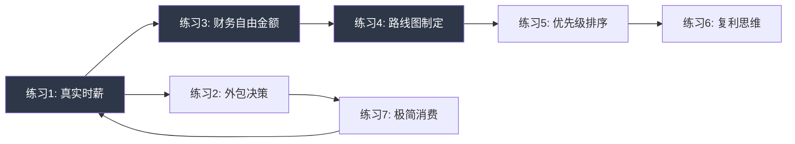

# 第33章：搞钱与人生规划 — 练习方法

## 为什么需要练习

前面几节讲了理论框架、核心技巧、实战案例和常见误区，但知识停留在"知道"层面是毫无价值的。认知科学的研究表明：**信息输入后如果不经过主动加工和实践，一周后的留存率不到10%**（学习金字塔理论，Edgar Dale, 1946）。而主动实践的留存率可以达到75%以上。

本节的七个练习，覆盖了本章所有核心概念。它们不是"看看就好"的填空题，而是一套完整的**认知校准→数据分析→决策优化→行动落地**的闭环系统。



七个练习形成一个循环：从认知自身出发，经过分析、规划、排序，最终回到对消费行为的审视，然后用更新后的认知重新校准时薪——这就是一个持续优化的飞轮。

> **使用建议：** 按顺序完成练习1-4（约6小时），这是基础路径。练习5-7可以在后续一个月内逐步完成。每个练习都附有"常见错误"和"进阶变体"，初学者忽略它们不会影响核心价值，高级读者可以深入探索。

***

## 练习一：计算你的真实时薪

### 为什么这个练习排在第一位

时薪思维是本章所有决策的基准线。如果你不知道自己一小时值多少钱，后面的外包决策、时间分配、财务规划全部是空中楼阁。这个练习的目标不是得到一个精确到分的数字，而是**建立一个足够可靠的估算，让你能用它来做日常决策**。

> **理论依据：** 机会成本（Opportunity Cost）是经济学最基本的概念之一。你做一件事的真实成本不是你花了多少钱，而是你为此放弃了什么。当你花2小时打扫卫生时，你放弃的不是"休息"，而是"用这2小时创造的价值"——这就是你的真实时薪。

### 操作步骤

**第1步：记录两周的时间使用（建议用两周而非一周）**

为什么是两周？因为一周可能有偶然因素（加班、请假、出差），两周的数据更能反映你的真实工作模式。

用手机备忘录或时间记录APP（如Toggl、时间块、Forest），记录每一天与工作相关的时间投入：

```text
周一：
  通勤：1.5小时
  核心工作：6小时
  会议：2小时
  午休（因工作无法自由支配）：1小时
  回工作消息（下班后）：0.5小时
  加班：1小时
  合计：12小时

周二：
  通勤：1.5小时
  核心工作：5小时
  会议：3小时
  午休：1小时
  合计：10.5小时

...（记录10个工作日）
```

**关键细节：** 以下时间是否计入"工作相关时间"？

| 时间类型 | 是否计入 | 理由 |
|---------|---------|------|
| 通勤 | 计入 | 如果不上班就不需要通勤，这是工作的直接成本 |
| 工作午餐 | 计入 | 如果你不能自由支配午餐时间（比如必须在工位吃、被同事/领导占用），这是工作成本 |
| 自由午休 | 不计入 | 如果你有1小时完全自由，可以做自己想做的事 |
| 下班回消息 | 计入 | 这是工作的延伸，你的时间被工作占据了 |
| 工作应酬 | 计入 | 虽然在"吃饭喝酒"，但你在工作 |
| 周末学习工作技能 | 看情况 | 如果是自愿提升不计入；如果是被工作要求的（考证、培训）计入 |

**第2步：计算工作相关支出**

列出过去3个月内所有因工作而产生的月均支出。建议翻看支付宝/微信账单，而不是凭记忆估算——人对支出的记忆偏差通常在30%-50%。

```text
通勤费用（地铁/公交/油费/停车费）：____元/月
职业装束（工装、正装、化妆品）：____元/月
工作应酬（请客吃饭、送礼）：____元/月
减压消费（奶茶、零食、下班后的外卖）：____元/月
因工作忙而外包的家务（保洁、外卖溢价）：____元/月
因工作忙导致的健康支出（按摩、健身、看病）：____元/月
职业培训/考证费用（月均）：____元/月
其他因工作产生的支出：____元/月
──────────────────────────────────
合计：____元/月
```

**第3步：计算真实时薪**

```text
真实时薪 = (月到手收入 - 工作相关支出) ÷ 月工作总时间

示例：
  月到手收入：15,000元
  工作相关支出：3,500元（通勤800 + 装束200 + 应酬500 + 减压600 + 外包家务800 + 健康300 + 其他300）
  月工作总时间：240小时（按两周平均12小时/天 × 22天）
  
  真实时薪 = (15,000 - 3,500) ÷ 240 = 47.9元/小时
```

**第4步：解读你的时薪数字**

得到数字后，不要急着判断"高"或"低"。用以下框架来解读：

```text
你的时薪：____元/小时

对标参考（2024年中国城镇数据）：
  全国城镇私营单位平均时薪：约32元/小时
  全国城镇非私营单位平均时薪：约58元/小时
  一线城市白领平均时薪：约60-80元/小时
  自由职业者平均时薪：差异极大，50-500元/小时

你的真实时薪与名义时薪的差距：____元/小时
（名义时薪 = 月到手收入 ÷ 法定工作时间174小时）

这个差距意味着：你每月有____小时的"隐性工作时间"没有被计入工资。
```

**第5步：行动反思**

```text
1. 你的真实时薪是____元/小时
2. 这个数字比你预期的高还是低？____
3. 你希望6个月后达到多少？____元/小时
4. 提升时薪的3个可行路径：
   a. _______________
   b. _______________
   c. _______________
5. 最快可以启动的一个行动：_______________
```

### 常见错误

| 错误 | 后果 | 纠正方法 |
|------|------|---------|
| 只算工作日8小时 | 严重高估时薪 | 必须包含通勤、加班、应酬等隐性时间 |
| 不算工作相关支出 | 高估20%-40% | 翻账单，不凭记忆 |
| 用"年薪"而非"到手收入" | 高估15%-30% | 必须用税后到手金额 |
| 记录时间太短（3天） | 被偶然因素干扰 | 至少记录完整两周 |
| 和别人比较时薪 | 产生焦虑或自满 | 时薪只和自己的过去比，目标是持续提升 |

### 进阶变体：分领域时薪

如果你在主业之外有副业或投资收入，可以分别计算：

```text
主业时薪 = 主业月收入 ÷ 主业月投入时间
副业时薪 = 副业月收入 ÷ 副业月投入时间
投资时薪 = 投资月收益 ÷ 投资管理月投入时间
综合时薪 = 所有收入 ÷ 所有工作时间

如果副业时薪 > 主业时薪 × 1.5，考虑逐步将时间从主业转移到副业。
如果投资时薪极低（甚至为负），说明你需要学习投资知识，或者干脆用指数基金定投替代主动管理。
```

***

## 练习二：外包决策练习

### 为什么外包是搞钱的核心技能

很多人以为外包是有钱人的专利。但经济学的基本原理告诉我们：**只要你的时薪高于某项任务的外包成本，外包就是理性的选择**。一个月薪1万的人，时薪约48元，请一个保洁阿姨每小时40元，那从纯经济角度看，请保洁就是划算的——前提是你把省下的1小时用来创造超过40元的价值。

外包练习的真正目的不是让你把所有事都交给别人，而是**培养你用"时间价值"而非"金钱成本"来做决策的思维模式**。

### 操作步骤

**第1步：全面盘点你每周的所有任务**

用一周时间，记录你做的每一件事。分为工作任务和生活任务两类：

```text
工作任务：
1. 核心业务工作（直接创造价值的）：____小时/周
2. 会议/沟通：____小时/周
3. 行政事务（报销、审批、报告）：____小时/周
4. 邮件/消息处理：____小时/周
5. 数据整理/表格制作：____小时/周
6. 学习/培训：____小时/周
7. 其他：____小时/周

生活任务：
1. 做饭（含买菜、洗碗）：____小时/周
2. 打扫卫生：____小时/周
3. 洗衣/熨衣：____小时/周
4. 取快递/跑腿：____小时/周
5. 陪孩子/辅导作业：____小时/周
6. 通勤：____小时/周
7. 购物/比价：____小时/周
8. 其他：____小时/周
```

**第2步：评估每项任务的"价值密度"**

"价值密度"指每小时投入对你人生目标的贡献度。用1-10分评估，同时估算外包成本：

| 任务 | 价值评分(1-10) | 耗时(小时/周) | 外包成本(元/小时) | 外包可行性 |
|------|---------------|--------------|-----------------|-----------|
| 核心业务 | 9 | 20 | 150+ | 低（核心能力不外包） |
| 写方案 | 9 | 8 | 100-200 | 低（但可以用AI辅助） |
| 会议 | 5 | 6 | — | 中（减少无效会议） |
| 行政事务 | 3 | 3 | 30-50 | 高（助理/AI工具） |
| 做饭 | 4 | 7 | 25-40 | 高（外卖/预制菜/请人做） |
| 打扫卫生 | 3 | 3 | 30-40 | 高（保洁阿姨） |
| 取快递 | 2 | 1 | 5-10 | 高（快递柜/驿站） |
| 购物比价 | 3 | 2 | 几乎为0 | 高（直接买不比价） |

**第3步：应用外包决策矩阵**

```text
                    外包成本 < 你的真实时薪        外包成本 ≥ 你的真实时薪
价值评分 < 5        → 立即外包                    → 评估是否能消除该任务
价值评分 5-7        → 尝试外包                    → 自己做，但寻找效率提升
价值评分 ≥ 7        → 自己做（除非时间不够）       → 自己做
```

**决策示例：**

```text
你的真实时薪：48元/小时

任务：打扫卫生
  价值评分：3分
  外包成本：35元/小时
  决策：35 < 48，且价值评分 < 5 → 立即外包

任务：写周报
  价值评分：4分
  外包成本：无法直接外包
  决策：用AI工具辅助写作，将1小时缩短到20分钟

任务：陪孩子
  价值评分：10分
  外包成本：50元/小时（家教/保姆）
  决策：核心陪伴自己做，辅导作业可以请家教
```

**第4步：制定本周外包计划**

```text
本周开始外包的第一件事：_______________
预计每周节省的时间：____小时
节省下来的时间用来做：_______________
本月累计外包成本预算：____元
本月预计因外包带来的额外收入/价值：____元
```

### 常见错误

| 错误 | 后果 | 纠正方法 |
|------|------|---------|
| 外包后没有用省下的时间做高价值事 | 省下的时间变成了刷手机 | 外包必须配合明确的时间再分配计划 |
| 把所有家务都外包导致家庭矛盾 | 伴侣觉得你"不做家务" | 和伴侣沟通外包的逻辑，共同决定哪些外包 |
| 只算金钱成本不算心理成本 | 外包后反而更焦虑（不放心别人做） | 从低风险任务开始外包，建立信任 |
| 忽视"消除"选项 | 有些任务既不需要自己做也不需要外包 | 问自己：这件事如果不做会怎样？ |
| 一次性外包太多 | 控制不住成本，产生恐慌 | 每月只新增1-2个外包项目 |

### 进阶变体：数字外包矩阵

在AI时代，外包不一定是"找人做"，也可以是"让工具做"：

| 任务 | 传统外包 | 数字外包（AI/自动化） | 推荐方案 |
|------|---------|---------------------|---------|
| 写邮件/消息 | 秘书 | AI写作助手 | 数字外包 |
| 数据分析 | 实习生 | Python脚本/Excel公式 | 数字外包 |
| 翻译 | 翻译人员 | AI翻译+人工校对 | 混合方案 |
| 做饭 | 钟点工 | 预制菜+空气炸锅 | 混合方案 |
| 记账 | 会计 | 记账APP自动同步 | 数字外包 |
| 设计海报 | 设计师 | Canva/AI绘图 | 看质量要求 |

数字外包的优势是边际成本趋近于零——一个脚本写好后可以无限次运行，一个提示词模板可以反复使用。

***

## 练习三：财务自由金额计算

### 为什么需要一个具体数字

"我想财务自由"是一句空话，"我需要285万实现基本版财务自由"才是一个可执行的目标。这个练习的目的就是**把模糊的愿望转化为精确的数字，然后评估它离你有多远**。

> **理论依据：** 4%法则（The 4% Rule）来自1998年Trinity大学的研究（Cooley, Hubbard & Walz），基于美国1926-1995年的历史数据，得出结论：如果每年从投资组合中提取不超过4%，在绝大多数30年的时间窗口内，资金不会耗尽。考虑到中国市场波动更大、通胀更高的特点，本练习使用3.5%的提取率。

### 操作步骤

**第1步：计算你当前的真实年支出**

打开你的支付宝年度账单、微信年度账单、银行流水，计算过去12个月的真实支出。不要凭记忆——研究表明人们对自身支出的回忆偏差在30%-50%。

```text
住房相关：
  房贷/房租：____元/年
  物业费：____元/年
  水电气暖：____元/年
  维修/家居用品：____元/年
  小计：____元/年

饮食：
  日常饮食（在家+外食）：____元/年
  零食饮料：____元/年
  小计：____元/年

交通：
  通勤费用：____元/年
  私家车（油费+保养+保险+停车）：____元/年
  出行旅游：____元/年
  小计：____元/年

通讯：
  手机话费+宽带：____元/年
  小计：____元/年

教育/学习：
  课程/书籍/培训：____元/年
  小计：____元/年

娱乐/社交：
  社交应酬：____元/年
  娱乐消费：____元/年
  小计：____元/年

医疗/保险：
  商业保险：____元/年
  医疗支出：____元/年
  小计：____元/年

购物/日用：
  服装鞋帽：____元/年
  日用品：____元/年
  数码产品：____元/年
  小计：____元/年

其他：
  人情往来（红包、份子钱）：____元/年
  税费（个税以外的）：____元/年
  未归类支出：____元/年
  小计：____元/年

══════════════════════════════════
真实年支出合计：____元/年
月均支出：____元/月
```

**第2步：设定三个版本的年支出目标**

财务自由后的支出不一定等于当前支出。有些支出会减少（通勤、职业装束），有些会增加（旅游、兴趣爱好），有些会消失（房贷还完后）。

```text
基本版（维持现有生活水平，剔除工作相关支出）：____元/年
舒适版（适度提升生活品质）：____元/年
理想版（你真正想过的生活）：____元/年

参考比例（大多数人）：
  基本版 ≈ 当前支出 × 70%-80%
  舒适版 ≈ 当前支出 × 100%-120%
  理想版 ≈ 当前支出 × 150%-200%
```

**第3步：计算三个版本的财务自由金额**

```text
基本版 = 基本版年支出 ÷ 3.5% = ____元
舒适版 = 舒适版年支出 ÷ 3.5% = ____元
理想版 = 理想版年支出 ÷ 3.5% = ____元
```

**计算示例：**

| 版本 | 年支出 | 财务自由金额 | 换算 |
|------|--------|------------|------|
| 基本版 | 8万 | 228万 | 约等于一套三四线城市房产 |
| 舒适版 | 15万 | 428万 | 约等于一套二线城市房产 |
| 理想版 | 30万 | 857万 | 约等于一套一线城市房产的首付 |

**为什么用3.5%而不是4%？**

中国市场与美国市场的差异：

| 因素 | 美国 | 中国 | 影响 |
|------|------|------|------|
| 通胀率 | 2%-3% | 3%-5%（真实体感更高） | 提取率需要更保守 |
| 股市年化回报 | 8%-10%（标普500） | 6%-8%（沪深300） | 投资收益预期更低 |
| 医疗支出增速 | 较稳定 | 增速较快 | 需要更多缓冲 |
| 社会保障 | 社保+401K | 社保替代率较低 | 需要更多个人储备 |

因此，3.5%是一个更适合中国国情的保守提取率。如果你的投资能力强、资产配置合理，可以用4%；如果你偏向保守，甚至可以用3%。

**第4步：评估你与目标的距离**

```text
你当前的总资产（房产净值+存款+投资+其他资产）：____元
你当前的总负债（房贷+车贷+消费贷+其他）：____元
你的净资产 = 总资产 - 总负债：____元

距离基本版财务自由：差____元（完成度____%）
距离舒适版财务自由：差____元（完成度____%）
距离理想版财务自由：差____元（完成度____%）
```

**第5步：解读你的完成度**

| 完成度 | 含义 | 下一步重点 |
|--------|------|-----------|
| < 10% | 起步期 | 专注提升收入和储蓄率，别急着研究投资 |
| 10%-30% | 积累期 | 建立投资体系，开始让钱生钱 |
| 30%-60% | 加速期 | 复利效应开始显现，保持纪律 |
| 60%-90% | 冲刺期 | 可以适度降低风险，保护已有成果 |
| > 90% | 临门一脚 | 做好最后的风险管理，准备转换生活方式 |

### 常见错误

| 错误 | 后果 | 纠正方法 |
|------|------|---------|
| 用房产市值算净资产 | 虚高，自住房不能产生现金流 | 自住房只算净值（市值-贷款），且不计入能产生被动收入的资产 |
| 忽略通胀 | 以为现在的数字10年后还够用 | 每年用通胀率（3%-5%）调整目标金额 |
| 目标定得太高 | 永远觉得不够，产生焦虑 | 先算基本版，它往往比你想象的低 |
| 不算配偶的资产和收入 | 低估家庭财务状况 | 夫妻应该一起算，但各自保留独立评估能力 |
| 只算金融资产 | 忽略可变现的其他资产 | 包括公积金余额、可变现的收藏品等，但要打折扣 |

### 进阶变体：蒙特卡洛模拟

对于有编程基础的读者，可以用蒙特卡洛模拟来测试你的财务自由计划在不同市场条件下的稳健性：

```python
import numpy as np

# 参数设置
initial_net_worth = 500000      # 当前净资产（元）
annual_savings = 150000          # 年储蓄（元）
annual_expense = 120000          # 年支出（元）
years = 20                       # 规划年限
simulations = 10000              # 模拟次数

# 投资回报假设（正态分布）
mean_return = 0.07               # 年化均值7%
std_return = 0.15                # 标准差15%

results = []
for _ in range(simulations):
    balance = initial_net_worth
    for year in range(years):
        return_rate = np.random.normal(mean_return, std_return)
        balance = balance * (1 + return_rate) + annual_savings
    results.append(balance)

target = annual_expense / 0.035  # 财务自由金额
success_rate = sum(1 for r in results if r >= target) / simulations

print(f"财务自由金额：{target:,.0f}元")
print(f"20年后净资产中位数：{np.median(results):,.0f}元")
print(f"成功率（蒙特卡洛）：{success_rate:.1%}")
print(f"最差情况（5%分位）：{np.percentile(results, 5):,.0f}元")
print(f"最好情况（95%分位）：{np.percentile(results, 95):,.0f}元")
```

如果成功率低于80%，说明计划过于激进，需要调整储蓄率、投资策略或时间框架。

***

## 练习四：制定你的财务自由路线图

### 从数字到行动

练习三给了你一个目标数字，但"我需要428万"和"我怎么到达428万"之间隔着一个路线图。这个练习的目标是**把一个大目标分解为每年、每季度、每月可执行的具体行动**。

> **理论依据：** 目标设定理论（Locke & Latham, 1990）的研究表明，具体且有挑战性的目标比模糊的"尽力而为"能带来25%-35%的绩效提升。而将大目标分解为子目标（Sub-goals）能显著提高目标达成率。

### 操作步骤

**第1步：确定你的时间框架和路径类型**

```text
你的目标财务自由金额（舒适版）：____元
你当前的净资产：____元
差距：____元

选择你的路径类型：
□ 激进路径（10年内）：需要极高的储蓄率或爆发式收入增长
□ 稳健路径（15-20年）：通过稳定的储蓄+投资复利实现
□ 保守路径（25-30年）：低风险、低压力，适合不愿冒险的人

你选择：____路径
时间框架：____年
```

**第2步：倒推每年需要达到的净资产里程碑**

用复利公式反推：

```text
假设投资年化收益：____%
假设年储蓄增长（涨薪）：____%

公式：第N年末净资产 = 上一年净资产 × (1 + 投资收益) + 当年储蓄

第1年末：____万元
第2年末：____万元
第3年末：____万元
第5年末：____万元
第10年末：____万元
第15年末：____万元
第N年末：____万元（= 财务自由金额）
```

**计算示例（稳健路径）：**

| 年份 | 净资产(年初) | 投资收益(7%) | 年储蓄 | 净资产(年末) |
|------|------------|-------------|--------|------------|
| 第1年 | 20万 | 1.4万 | 12万 | 33.4万 |
| 第2年 | 33.4万 | 2.3万 | 13万 | 48.7万 |
| 第3年 | 48.7万 | 3.4万 | 14万 | 66.1万 |
| 第5年 | 107万 | 7.5万 | 16万 | 130.5万 |
| 第10年 | 298万 | 20.9万 | 22万 | 340.9万 |
| 第15年 | 580万 | 40.6万 | 29万 | 649.6万 |
| 第20年 | 980万 | 68.6万 | 37万 | 1,085.6万 |

注意：前5年增长主要靠储蓄，后10年增长主要靠投资复利。这就是为什么耐心如此重要——**复利的威力在后期才会爆发**。

**第3步：评估可行性并找到杠杆点**

```text
当前年收入：____万元
当前年支出：____万元
当前年储蓄：____万元
当前储蓄率：____%

可行性评估：
  第1年净资产目标：____万元
  按当前储蓄率能否达到：是/差____万元

如果差距过大，你的杠杆点按优先级排列：
1. 提高储蓄率（从____%提升到____%）
2. 提升主业收入（目标月薪从____元到____元）
3. 开发副业收入（目标月入____元）
4. 优化投资收益（从____%到____%）
5. 延长时间框架（从____年到____年）
```

**杠杆点的效果对比：**

| 杠杆 | 短期效果 | 长期效果 | 难度 | 风险 |
|------|---------|---------|------|------|
| 提高储蓄率 | ⭐⭐⭐⭐⭐ | ⭐⭐⭐ | 中 | 低 |
| 提升主业收入 | ⭐⭐⭐⭐ | ⭐⭐⭐⭐⭐ | 高 | 低 |
| 开发副业 | ⭐⭐⭐ | ⭐⭐⭐⭐ | 高 | 中 |
| 提高投资收益 | ⭐⭐ | ⭐⭐⭐⭐⭐ | 高 | 高 |
| 延长时间 | ⭐⭐⭐⭐⭐ | ⭐⭐⭐⭐ | 低 | 低 |

**第4步：制定年度关键行动**

```text
今年的3个关键搞钱行动：

行动1：_______________
  目标：_______________
  衡量指标：_______________
  截止日期：_______________
  第一步（本周就能做的）：_______________

行动2：_______________
  目标：_______________
  衡量指标：_______________
  截止日期：_______________
  第一步：_______________

行动3：_______________
  目标：_______________
  衡量指标：_______________
  截止日期：_______________
  第一步：_______________
```

**第5步：建立检查机制**

路线图不是写完就放抽屉的。你需要定期回顾：

```text
回顾频率：
  月度回顾（每月最后一个周末，15分钟）：
    - 本月储蓄率：____%
    - 本月净资产变化：____元
    - 本月关键行动进展：____
    - 需要调整的地方：____

  季度回顾（每季度末，1小时）：
    - 季度净资产增长率：____%
    - 与路线图的偏差：____
    - 路线图是否需要调整：是/否
    - 下季度重点：____

  年度回顾（每年1月，半天）：
    - 年度净资产变化：____元
    - 年化投资收益率：____%
    - 路线图整体进度：____
    - 是否需要调整时间框架或目标金额：____
```

### 常见错误

| 错误 | 后果 | 纠正方法 |
|------|------|---------|
| 假设投资收益每年都是7% | 遇到亏损年份就崩溃 | 用蒙特卡洛模拟测试，接受波动 |
| 年度目标太激进 | 达不到就放弃 | 第一年目标设在"80%概率能完成"的水平 |
| 只看净资产不看现金流 | 资产涨了但现金流断裂 | 确保任何时候都有6个月的应急资金 |
| 不考虑大额支出 | 结婚、买房、生子打乱计划 | 在路线图中标注预计的大额支出年份 |
| 路线图制定后不调整 | 现实变化了，计划还在原地 | 每季度回顾，允许灵活调整 |

***

## 练习五：人生优先级排序

### 为什么搞钱不能排在第一位

这是一个反直觉但至关重要的练习：如果你把搞钱排在人生所有事情的第一位，你很可能会失去那些真正让人生值得过的东西——健康、关系、意义感。

> **理论依据：** 马斯洛需求层次理论告诉我们，安全需求（财务安全属于这一层）只是基础层，之上还有归属、尊重和自我实现。心理学家Edward Deci的自我决定理论（Self-Determination Theory）进一步指出，人类有三个基本心理需求：自主性（Autonomy）、胜任感（Competence）、归属感（Relatedness）。单纯追求金钱而忽视这三个需求，会导致内在动机枯竭和幸福感下降。

### 操作步骤

**第1步：列出你人生中重要的10件事**

不要思考太久，写下第一反应。这10件事应该覆盖生活的各个维度：

```text
参考维度（你不需要按这个写，但可以用它来检查是否遗漏）：
- 健康（身体、心理）
- 关系（伴侣、家人、朋友）
- 事业（主业、副业、创业）
- 财务（储蓄、投资、财务自由）
- 成长（学习、技能、认知）
- 体验（旅行、兴趣、爱好）
- 意义（公益、创作、传承）
- 环境（居住、城市、生活方式）

你的10件事：
1. _______________
2. _______________
3. _______________
4. _______________
5. _______________
6. _______________
7. _______________
8. _______________
9. _______________
10. _______________
```

**第2步：强制排序——从10到5**

这是最痛苦也最有价值的一步。你必须划掉5件，只留下5件。这个过程会逼迫你面对一个真相：**你不可能什么都想要，你必须做出取舍**。

```text
划掉的5件事（以及为什么划掉）：
- _______________（原因：_______________）
- _______________（原因：_______________）
- _______________（原因：_______________）
- _______________（原因：_______________）
- _______________（原因：_______________）

最终的5件事（按重要性排序）：
1. _______________
2. _______________
3. _______________
4. _______________
5. _______________
```

**第3步：给每件事分配时间预算**

你每周清醒时间约112小时（16小时/天 × 7天）。把这些时间分配给你的5件人生大事：

```text
1. ________：____小时/周
2. ________：____小时/周
3. ________：____小时/周
4. ________：____小时/周
5. ________：____小时/周
──────────────────────────
总计：____小时/周

检查：
  - 总计是否 ≤ 112小时？是/否
  - 如果超过，必须砍掉：_______________
  - 是否留出了"空白时间"（处理意外、休息）？建议留10-15小时/周
```

**第4步：记录一周实际时间分配**

用练习一的时间记录方法，记录你一周的实际时间分配，然后与理想分配对比：

```text
优先级        | 理想时间 | 实际时间 | 差距    | 诊断
──────────────|──────────|──────────|─────────|──────
第1优先：____ | ____小时 | ____小时 | ____小时 | 超出/不足
第2优先：____ | ____小时 | ____小时 | ____小时 | 超出/不足
第3优先：____ | ____小时 | ____小时 | ____小时 | 超出/不足
第4优先：____ | ____小时 | ____小时 | ____小时 | 超出/不足
第5优先：____ | ____小时 | ____小时 | ____小时 | 超出/不足
未列入计划     | 0小时    | ____小时 | ____小时 | 这些时间去哪了？
```

**关键洞察：** "未列入计划"的时间通常会暴露你真正的生活方式。如果这个数字很大（比如每周30小时），说明你有大量的时间花在了你认为"不重要"的事情上——刷手机、无效社交、无意义的加班等。

**第5步：下周做出一个具体调整**

不要试图一次性改变所有事。只做一个调整：

```text
本周的调整：_______________
具体执行方式：_______________
预期效果：_______________
```

### 常见错误

| 错误 | 后果 | 纠正方法 |
|------|------|---------|
| 把"搞钱"排在第一位 | 为了赚钱牺牲健康和关系 | 搞钱是支撑其他优先级的手段，不是目的本身 |
| 10件事都很重要 | 无法取舍，等于没有优先级 | 强制排序的痛苦是必要的，它逼你面对真相 |
| 分配了时间但不执行 | 计划停留在纸上 | 设置日历提醒，把优先级变成固定时间块 |
| 优先级永远不变 | 人生阶段变了，优先级不变 | 每半年重新做一次这个练习 |
| 只考虑自己 | 忽视伴侣/家人的优先级 | 和伴侣一起做这个练习，找到交集 |

### 进阶变体：夫妻/家庭优先级对齐

如果你有伴侣，建议各自独立完成这个练习，然后对比：

```text
你的优先级：
1. _______________
2. _______________
3. _______________
4. _______________
5. _______________

伴侣的优先级：
1. _______________
2. _______________
3. _______________
4. _______________
5. _______________

交集（双方都排在前5的）：_______________
冲突（你排高但伴侣排低的）：_______________
妥协方案：_______________
```

很多财务问题的本质是夫妻优先级不一致。一个人想存钱买房，另一个人想花钱旅游——这不是"谁对谁错"的问题，而是需要对话和协商的问题。

***

## 练习六：复利思维应用

### 复利不只是投资概念

大多数人对复利的理解停留在"利滚利"。但复利思维的真正力量在于：**任何可以积累的东西，只要持续投入，都会产生指数级回报**。技能如此，人脉如此，知识如此，甚至健康和习惯也是如此。

> **理论依据：** 安德斯·艾利克森（Anders Ericsson）的"刻意练习"研究发现，专家级能力不是天赋的结果，而是长期刻意练习的积累。马尔科姆·格拉德威尔在《异类》中将其总结为"一万小时定律"（虽然这个说法过度简化了）。核心洞察是：**技能的回报是非线性的——前期投入回报很低，突破临界点后回报急剧增长**。

### 技能复利练习

**第1步：绘制你的技能图谱**

```text
我的核心技能（你最擅长、最值钱的1-3个技能）：
1. _______________（熟练度：初级/中级/高级/专家）
2. _______________（熟练度：初级/中级/高级/专家）
3. _______________（熟练度：初级/中级/高级/专家）

这些技能的市场价值（参考薪资水平）：
1. _______________（月薪范围：____-____元）
2. _______________（月薪范围：____-____元）
3. _______________（月薪范围：____-____元）
```

**第2步：寻找可叠加的技能组合**

技能复利的关键不是"学更多技能"，而是"找到能产生乘法效应的技能组合"。Scott Adams（《呆伯特》漫画作者）提出的"技能堆叠"理论认为：**在两个领域都达到前25%的水平，比在一个领域达到前1%的水平更容易，而且组合后的稀缺性更高**。

```text
技能叠加矩阵：

我的核心技能：_______________
可以与之叠加的技能：
  A. _______________（叠加效果：_______________）
  B. _______________（叠加效果：_______________）
  C. _______________（叠加效果：_______________）

最佳叠加组合：_______________ + _______________
这个组合的稀缺性评估：高/中/低
这个组合的市场需求：高/中/低
```

**叠加效果示例：**

| 核心技能 | 叠加技能 | 组合效果 | 市场稀缺性 |
|---------|---------|---------|-----------|
| 编程 | 金融知识 | 量化工程师 | 高 |
| 编程 | 设计 | 全栈开发者 | 中高 |
| 写作 | 行业知识 | 行业KOL/专栏作家 | 高 |
| 销售 | 技术理解 | 技术销售/解决方案架构师 | 高 |
| 教育 | 自媒体 | 在线教育创业者 | 中 |
| 数据分析 | 商业洞察 | 数据驱动的管理者 | 高 |

**第3步：制定6个月技能提升计划**

```text
我接下来6个月要重点提升的叠加技能：_______________

学习路径：
  第1-2月：_______________（目标：掌握基础概念）
  第3-4月：_______________（目标：完成一个实战项目）
  第5-6月：_______________（目标：产出可展示的成果）

每日投入时间：____分钟
学习资源：_______________
里程碑检查点：
  第2月末：_______________
  第4月末：_______________
  第6月末：_______________

预期效果（收入/职业发展）：_______________
```

### 人脉复利练习

人脉复利的本质不是"认识更多人"，而是**维护一个高质量的、互惠互利的关系网络**。社会学家马克·格兰诺维特（Mark Granovetter）的"弱关系理论"发现，对职业发展最有帮助的往往不是亲密朋友（强关系），而是泛泛之交（弱关系）——因为他们能带来你圈子之外的信息和机会。

**第1步：绘制你的人脉网络地图**

```text
我的人脉网络（按圈层分类）：

核心圈（每月至少联系1次，信任度最高）：
1. _______________（关系：____，能提供的价值：____）
2. _______________（关系：____，能提供的价值：____）
3. _______________（关系：____，能提供的价值：____）

活跃圈（每季度至少联系1次）：
1. _______________（关系：____，能提供的价值：____）
2. _______________（关系：____，能提供的价值：____）
3. _______________（关系：____，能提供的价值：____）
4. _______________（关系：____，能提供的价值：____）
5. _______________（关系：____，能提供的价值：____）

弱关系圈（每年至少联系1次，但可能带来关键机会）：
1. _______________
2. _______________
3. _______________
```

**第2步：评估人脉网络的健康度**

```text
人脉网络健康度检查：

□ 行业多样性：你的人脉是否跨3个以上不同行业？
□ 层级多样性：你是否有比你高2个层级的人脉？
□ 功能多样性：你的人脉是否覆盖"信息源、合作伙伴、导师、支持者"四类角色？
□ 互惠性：你是否也在为他人提供价值，而不只是索取？
□ 活跃度：你最近一个月是否主动联系过5个以上的人？

不健康的信号：
- 所有人脉都是同事（行业单一）
- 只有同级别的人（层级单一）
- 只在需要帮助时才联系人（单向索取）
```

**第3步：制定本月人脉维护计划**

```text
本月要主动联系的人：
1. _______________（方式：____，我能提供的价值：____）
2. _______________（方式：____，我能提供的价值：____）
3. _______________（方式：____，我能提供的价值：____）

本月要拓展的新关系：
  目标领域：_______________
  拓展方式：_______________（行业活动、社群、线上社区等）
  目标：本月认识____个该领域的人
```

### 知识复利练习

知识复利的核心机制是**跨领域的知识迁移和整合**。查理·芒格称之为"多元思维模型"（Latticework of Mental Models）——当你拥有多个学科的核心概念时，你看问题的视角比只懂一个学科的人丰富得多，解决方案也更创新。

**第1步：绘制你的知识地图**

```text
我最近3个月学到的最重要的3个知识/概念：
1. _______________（来源：____）
2. _______________（来源：____）
3. _______________（来源：____）

这3个知识之间的联系：_______________
它们如何与我之前的知识产生新的洞察：_______________
```

**第2步：建立知识管理系统**

```text
我的知识管理方式：
□ 笔记软件（Notion/Obsidian/语雀/其他：____）
□ 卡片笔记法（Zettelkasten）
□ 思维导图
□ 写博客/公众号（输出倒逼输入）
□ 其他：_______________

本月要建立/优化的一个知识管理习惯：_______________
```

**第3步：制定知识复利的长期策略**

```text
我需要掌握的跨学科核心知识（按优先级排序）：
1. _______________（为什么重要：_______________）
2. _______________（为什么重要：_______________）
3. _______________（为什么重要：_______________）

推荐阅读/学习路径：
- _______________
- _______________
- _______________
```

### 常见错误

| 错误 | 后果 | 纠正方法 |
|------|------|---------|
| 学了太多技能但都浅尝辄止 | 什么都会一点，什么都不精通 | 先精通一个核心技能，再叠加 |
| 只维护"有用"的人脉 | 被人觉得功利，关系不长久 | 真诚地为他人提供价值，不求即时回报 |
| 知识只输入不输出 | 学了就忘，无法形成洞察 | 定期写总结、做分享、教别人 |
| 急于求成 | 复利需要时间，3个月看不到效果就放弃 | 设定最低6个月的投入期 |

***

## 练习七：极简消费实验

### 为什么要做消费实验

这个练习的目的不是让你过苦行僧的生活，而是**通过30天的刻意实验，区分你真正"需要"的东西和只是"想要"的东西**。很多人在做完这个实验后发现：他们花了大量金钱买的东西，对幸福感的提升几乎为零。

> **理论依据：** 行为经济学中的"享乐适应"（Hedonic Adaptation）理论表明，人类对物质刺激的快乐感受会迅速消退。你买了新手机的兴奋感通常在2周内就消失了。心理学家丹尼尔·卡尼曼的研究发现，收入超过一定阈值（约年收入7.5万美元，中国约30-50万人民币）后，收入增加对幸福感的提升微乎其微。

### 操作步骤

**第1步：设定实验规则**

```text
30天极简消费挑战规则：

可以买的（必需品）：
□ 食物（食材、基本外食）
□ 交通费用
□ 日用品（用完了才买新的）
□ 医疗/药品
□ 已经承诺的固定支出（房租、水电、保险等）

不可以买的（欲望品）：
□ 任何"想要但不需要"的东西
□ 新衣服/鞋子/配饰（除非旧的已经不能穿）
□ 新电子产品（除非旧的完全坏了）
□ 外卖溢价（比自己做饭贵的部分）
□ 奶茶/咖啡（可以自己冲）
□ 打车（除非公共交通真的不可行）
□ 任何"凑单""满减"的额外购买
□ 任何因为"打折"才买的东西
```

**第2步：每日记录冲动消费**

准备一个随身记录工具（手机备忘录即可），每当产生购买冲动时立即记录：

```text
冲动消费记录表

日期：____
时间：____
触发因素：____（看到广告？朋友推荐？情绪低落？习惯性打开购物APP？）
想买的东西：_______________
价格：____元
24小时后还想买吗：是/否
如果忍住了，忍住的方式：_______________
```

**触发因素分析：**

记录一周后，分析你的冲动消费触发因素：

| 触发因素 | 出现次数 | 占比 | 对策 |
|---------|---------|------|------|
| 情绪驱动（无聊、压力、焦虑） | ___次 | ___% | 找替代活动（运动、阅读、散步） |
| 社交压力（朋友推荐、朋友圈种草） | ___次 | ___% | 设置24小时冷静期 |
| 习惯性行为（睡前刷购物APP） | ___次 | ___% | 删除/隐藏购物APP |
| 价格刺激（打折、满减、限时优惠） | ___次 | ___% | 卸载推送通知，取消关注促销号 |
| 实际需求 | ___次 | ___% | 正常购买 |

**第3步：30天结束后复盘**

```text
30天极简消费实验复盘

基础数据：
  记录的冲动消费总次数：____次
  忍住的次数：____次（忍住率：____%）
  节省的估计金额：____元
  实际消费比上月减少：____元（减少比例：____%）

深度反思：
  1. 幸福感变化：
     □ 明显下降  □ 略有下降  □ 没有变化  □ 略有提升  □ 明显提升
  
  2. 焦虑感变化：
     □ 明显增加  □ 略有增加  □ 没有变化  □ 略有减少  □ 明显减少
  
  3. 发现自己其实不需要的东西：
     - _______________
     - _______________
     - _______________
  
  4. 发现自己真正需要的东西：
     - _______________
     - _______________
     - _______________
  
  5. 这个实验改变了我对消费的认知吗？
     _______________

决定保留的新习惯（最多3个）：
1. _______________
2. _______________
3. _______________
```

### 常见错误

| 错误 | 后果 | 纠正方法 |
|------|------|---------|
| 把实验变成苦行 | 坚持不了，报复性消费 | 允许每周1-2次"合理放纵"，关键是建立意识 |
| 实验结束后报复性消费 | 30天白费 | 实验结束后保留3个新习惯，而不是回到原样 |
| 不记录冲动 | 无法分析模式 | 冲动产生时立刻记录，哪怕只是一个关键词 |
| 和家人一起做但没沟通 | 家庭矛盾 | 和家人商量哪些规则适合一起做，哪些各自遵守 |
| 只关注"省了多少钱" | 忽视更重要的认知改变 | 重点是发现"什么让我真正快乐"，不是省钱本身 |

### 进阶变体：极简消费的长期实践

30天实验结束后，你可以选择性地保留以下习惯：

```text
可持续的极简消费习惯：

□ 24小时规则：任何超过100元的非必需品，等24小时再买
□ 一进一出规则：买一件新东西，必须处理掉一件旧东西
□ 月度预算封顶：每月非必需品消费不超过____元
□ 季度断舍离：每季度清理一次物品，捐赠或卖掉不需要的
□ 年度消费审计：每年1月回顾上一年的消费，找出浪费最多的3个品类
```

***

## 练习执行建议

### 执行优先级总览

| 练习 | 建议频率 | 所需时间 | 优先级 | 依赖关系 |
|------|---------|---------|--------|---------|
| 真实时薪计算 | 首次+每年更新 | 2-3小时 | ⭐⭐⭐⭐⭐ | 无（基础练习） |
| 外包决策 | 每月一次 | 1小时 | ⭐⭐⭐⭐ | 依赖练习一 |
| 财务自由金额 | 首次+每年更新 | 1-2小时 | ⭐⭐⭐⭐⭐ | 依赖练习一 |
| 路线图制定 | 每年一次+季度回顾 | 3小时 | ⭐⭐⭐⭐⭐ | 依赖练习三 |
| 人生优先级 | 每半年一次 | 2小时 | ⭐⭐⭐⭐ | 无 |
| 复利思维 | 每月一次 | 1小时 | ⭐⭐⭐ | 无 |
| 极简消费 | 每年一次(30天) | 每天5分钟 | ⭐⭐⭐ | 无 |

### 30天启动计划

如果你觉得七个练习太多，这里有一个30天的渐进式启动计划：

```text
第1周：认知校准
  Day 1-2：完成练习一（真实时薪计算）
  Day 3-4：完成练习三（财务自由金额计算）
  Day 5-7：消化数据，不急于行动

第2周：规划制定
  Day 8-9：完成练习四（路线图制定）
  Day 10-11：完成练习五（人生优先级排序）
  Day 12-14：制定年度3个关键行动

第3周：优化执行
  Day 15-16：完成练习二（外包决策）
  Day 17-18：执行第一项外包
  Day 19-21：完成练习六（复利思维应用）

第4周：实验验证
  Day 22-30：开始练习七（极简消费实验的第1-9天）
  次月继续完成剩余21天
```

### 习惯养成的关键

行为科学家BJ Fogg的"微习惯"理论指出，习惯养成的关键不是意志力，而是**把行为缩小到不可能失败的程度**：

```text
微习惯示例：

原始目标：每月做一次全面的财务回顾
微习惯：每天晚上花1分钟记录今天的支出

原始目标：每周联系3个人脉
微习惯：每天早上给一个人发一条有价值的信息

原始目标：每天学习1小时新技能
微习惯：每天看5分钟相关的文章/视频

执行公式：在我____（已有习惯）之后，我会____（微习惯）
例如：在我刷完牙之后，我会记录今天的支出
```

***

## 工具推荐

以下工具可以大幅降低练习的执行成本：

| 类别 | 工具 | 用途 | 费用 |
|------|------|------|------|
| 时间记录 | Toggl Track | 记录时间使用 | 免费版够用 |
| 时间记录 | 时间块 | 更适合中文用户 | 免费 |
| 记账 | 随手记 | 手动记账 | 免费 |
| 记账 | 钱迹 | 简洁无广告 | 免费/付费 |
| 记账 | 支付宝/微信账单 | 自动记录消费 | 免费 |
| 财务规划 | Excel/Google Sheets | 自定义财务模型 | 免费 |
| 笔记 | Obsidian | 本地知识管理 | 免费 |
| 笔记 | Notion | 云端知识管理 | 免费版够用 |
| 习惯养成 | Forest | 专注计时 | 付费 |
| 习惯养成 | 滴答清单 | 任务管理 | 免费版够用 |

***

> **最后的提醒：练习的价值在于"做"，而不在于"看"。** 请现在就选择一个练习开始行动。哪怕只完成练习一（计算真实时薪），也比看完全部七个练习但什么都不做强一百倍。研究表明，仅仅做出一个"开始的承诺"（implementation intention），就能将行动概率从22%提升到62%（Gollwitzer, 1999）。
>
> 现在，翻到练习一，开始记录你今天的时间。这就是你的第一步。
