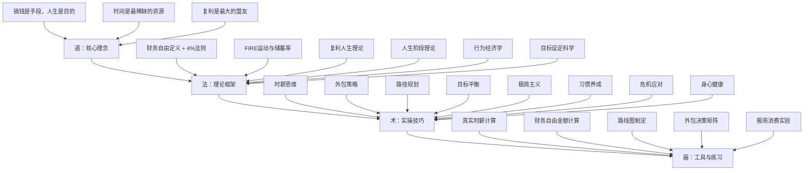

# 第33章：搞钱与人生规划 — 本章小结

## 一、本章核心命题

本章围绕一个核心命题展开：**如何把"搞钱"这件事放到整个人生的坐标系中去规划和执行。**

这个命题的深意在于：大多数人对"搞钱"的理解停留在"赚更多钱"的层面，但实际上，搞钱是一个由**赚钱、存钱、投资、省钱、护钱**五个维度构成的完整系统。而这个系统必须服务于一个更大的目标——你想要过什么样的人生。

> **搞钱的最高境界不是赚最多的钱，而是用最高效的方式赚到足以支撑理想生活的钱，然后把时间还给自己。**

这句话不是心灵鸡汤，而是可以用数学证明的结论：当你把生活支出降到足够低、把被动收入提升到足够高时，财务自由的门槛可以比你想象中低得多。

***

## 二、知识体系全景图

本章构建了从理论到实操的完整知识体系，可以概括为"道法术器"四个层次：



### 各层次之间的关系

| 层次 | 解决的问题 | 核心输出 |
|------|-----------|---------|
| 道 | 为什么要搞钱？搞钱的终极意义是什么？ | 价值判断标准——搞钱服务于人生，而非反过来 |
| 法 | 财务自由的数学原理是什么？有哪些理论支撑？ | 可计算的目标体系——4%法则、储蓄率公式、复利模型 |
| 术 | 具体怎么执行？有哪些可操作的方法？ | 行动框架——时薪思维、外包策略、路径规划、阶段策略 |
| 器 | 用什么工具来落地？怎么量化追踪？ | 实操模板——练习一到七，含具体计算公式和记录表格 |

这四个层次缺一不可：没有"道"，搞钱就失去了方向；没有"法"，行动就缺乏科学依据；没有"术"，理论就无法落地；没有"器"，执行就无法量化和持续优化。

***

## 三、理论基础核心要点

### 3.1 财务自由的精确公式

财务自由不是一个模糊的概念，而是一个可计算的目标：

**财务自由 = 被动收入 ≥ 生活支出**

基于4%法则（William Bengen, 1994），财务自由金额的计算公式为：

| 公式 | 适用场景 | 示例 |
|------|---------|------|
| 年支出 ÷ 4% | 美国市场 | 年支出20万 → 需要500万 |
| 年支出 ÷ 3.5% | 中国市场（更保守） | 年支出20万 → 需要571万 |
| 年支出 × 25 | 快速估算（等价于÷4%） | 年支出20万 → 需要500万 |

**关键认知：降低支出和增加收入同样有效。** 年支出从20万降到10万，财务自由门槛从571万降到285万——几乎减半。这意味着极简主义不是"省钱的苦行"，而是一种加速财务自由的战略选择。

### 3.2 储蓄率：决定财务自由速度的最大变量

FIRE运动最重要的发现是：**决定你何时实现财务自由的最大变量不是投资回报率，而是储蓄率。**

| 储蓄率 | 达到财务自由所需年数（假设5%实际回报率） |
|--------|------------------------------------------|
| 10%    | 约51年                                   |
| 25%    | 约32年                                   |
| 50%    | 约17年                                   |
| 70%    | 约8.5年                                  |
| 80%    | 约5.5年                                  |

为什么储蓄率如此关键？因为它同时做了两件事：**增加可投资本金**和**降低财务自由门槛**（因为年支出更低）。投资回报率只影响前者，而储蓄率同时影响两者，这就是它成为最大杠杆的原因。

**实际对比案例：**

| 场景 | 月储蓄 | 投资年化 | 10年后净资产 |
|------|--------|---------|-------------|
| 高储蓄+普通回报 | 1万 | 8% | 约184万 |
| 低储蓄+高回报 | 3000 | 15% | 约83万 |

即使投资回报率翻倍，储蓄率的差距也无法弥补。这个数据清晰地说明了：先把储蓄率提到40%以上，再去优化投资回报率。

### 3.3 复利人生：超越投资的复利思维

复利不仅适用于投资，更适用于技能、人脉和知识三大领域。这是本章最重要的认知升级之一。

**技能复利的运作机制：**

| 年份 | 新增技能 | 叠加效果 | 综合能力 |
|------|---------|---------|---------|
| 第1年 | Python编程 | 基础工具 | 初级程序员 |
| 第2年 | 数据分析 | Python+数据分析 | 数据分析工程师 |
| 第3年 | 机器学习 | 数据分析+ML | 算法工程师 |
| 第4年 | 行业知识 | ML+行业 | AI+行业复合人才 |
| 第5年 | 产品思维 | 全栈能力 | 技术型产品负责人 |

每多学一项可叠加的技能，之前所有技能的价值都会提升。技能复利的三个关键原则：选择可叠加的技能（不要学一堆毫不相关的技能）、先深后广（先把一项技能学到80分再横向扩展）、注重底层能力（写作、沟通、逻辑思维的复利效应最强）。

**人脉复利的运作机制：** 不是认识很多人，而是建立双向价值的高质量社交网络。10个高质量人脉 > 100个点头之交。很多机会来自于不太熟悉的人——这就是社会学家格兰诺维特（Granovetter）提出的"弱关系的力量"理论。

**知识复利的三个阶段：** 量变阶段（0-3年，大量输入构建框架）→ 质变阶段（3-7年，融会贯通产生跨界洞察）→ 指数阶段（7年以上，快速学习新领域，知识迁移能力极强）。

### 3.4 人生阶段理论

人生不同阶段有不同的约束条件和机会，搞钱策略必须因时制宜：

| 阶段 | 年龄段 | 核心任务 | 资源配置 | 核心矛盾 |
|------|--------|---------|---------|---------|
| 积累期 | 22-30岁 | 投资自己，积累技能和人脉 | 70%投资自己，20%储蓄，10%享受 | 收入低但精力充沛 |
| 增长期 | 30-40岁 | 扩大收入，建立被动收入 | 50%投资自己，30%投资资产，20%享受 | 家庭责任加重 |
| 加速期 | 40-50岁 | 让钱生钱，优化收入结构 | 30%投资自己，50%投资资产，20%享受 | 体力下降但经验丰富 |
| 收获期 | 50-60岁 | 稳健收益，逐步退出主动工作 | 20%投资自己，60%稳健资产，20%享受 | 健康成为核心议题 |

试图用一套策略贯穿整个人生，就像用一把钥匙开所有的锁——注定会失败。每3-5年必须重新审视和调整搞钱策略。

### 3.5 行为经济学与搞钱决策

本章还引入了行为经济学的视角，揭示了人类在财务决策中常见的认知偏差：

| 认知偏差 | 表现 | 对搞钱的影响 | 应对策略 |
|---------|------|-------------|---------|
| 即时满足偏好 | 今天消费的快乐 > 未来储蓄的收益 | 储蓄率低，月光 | 设置自动转账，先存后花 |
| 损失厌恶 | 亏损100元的痛苦 > 赚100元的快乐 | 不敢投资或过早卖出 | 定投策略，减少查看频率 |
| 锚定效应 | 被第一个看到的数字影响判断 | 谈薪时被压低、消费时被引导 | 多方比较，设定自己的基准线 |
| 从众效应 | "大家都在买我也要买" | 盲目跟风投资、冲动消费 | 建立独立决策框架 |
| 心理账户 | 对不同来源的钱有不同的消费态度 | 年终奖/意外收入更容易被挥霍 | 统一管理所有资金 |

理解这些偏差不是为了消灭它们（这不可能），而是为了建立**系统化的防护机制**——比如自动定投、消费冷静期、定期财务体检等。

***

## 四、核心技巧体系

### 4.1 时薪思维：决策的基准线

时薪思维是本章最核心的决策工具。它的本质不是算你赚多少钱，而是建立一个统一的度量标准来衡量一切活动的价值。

**真实时薪的计算公式：**

```text
真实时薪 = (月到手收入 - 工作相关支出) ÷ 月工作总时间
```

其中"工作相关支出"包括通勤费用、职业装束、工作应酬、减压消费、因工作忙而外包的家务费用等；"月工作总时间"包括通勤、加班、下班后回工作消息等所有与工作相关的时间。

**时薪思维的决策应用：**

| 场景 | 传统思维 | 时薪思维（假设时薪100元） |
|------|---------|--------------------------|
| 花2小时比价省30元 | 省了30元 | 30÷2=15元/小时，远低于时薪，不值得 |
| 花500元请人搬家 vs 自己搬3小时 | 500元好贵 | 500÷3≈167元/小时，高于时薪就外包 |
| 花5000元学新技能（耗时40小时） | 5000元好贵 | 如果提升时薪20元，未来2万小时回报=40万 |
| 周末花4小时做家务 | 反正闲着 | 这4小时能不能用来学习或做副业？ |

时薪思维的终极价值不在于省了几块钱，而在于**把有限的时间配置到回报最高的活动上**。

### 4.2 外包策略：时间的重新配置

外包的本质是把低价值任务交给时薪更低的人去做，把时间留给高价值活动。这对双方都有好处：你获得了时间，对方获得了收入，整体社会效率提升。

**外包判断矩阵：**

| | 你擅长 | 你不擅长 |
|--|--------|----------|
| **高价值** | 自己做（核心竞争力） | 学习后自己做或找高手合作 |
| **低价值** | 外包（你的时间更值钱） | 直接外包或消除 |

**外包的三个前提条件：** ①你的真实时薪高于外包成本；②外包不会影响核心质量；③你确实有更高价值的事要做——不是用来刷手机。

**实操建议：** 从小事开始（保洁、取快递等低风险事项）→ 建立标准流程（把重复性工作整理成SOP）→ 善用平台（美团跑腿、58同城、猪八戒网等）→ 培养外包思维（每遇到一件事先问"这件事必须我做吗？"）。

### 4.3 财务自由路径规划

路径规划是把财务自由从一个目标变成一个可执行的计划。本章提供了5年、10年、20年三个时间框架的规划模板。

**五年计划（打地基）——适合积累期：**

| 年份 | 核心目标 | 关键指标 |
|------|---------|---------|
| 第1年 | 财务体检 + 建立记账习惯 | 存下第一个10万 |
| 第2年 | 提升主业收入 + 学习投资 | 收入增长20%，建立紧急备用金 |
| 第3年 | 探索副业 + 投资体系成型 | 净资产达到30万 |
| 第4年 | 副业收入稳定 + 主业晋升 | 净资产达到60万 |
| 第5年 | 收入多元化 + 投资组合优化 | 净资产达到100万 |

**十年计划（建框架）——适合增长期：** 核心目标是建立被动收入体系。分三个阶段：延续五年计划（主业突破年50万、投资资产达到200万）→ 扩展期（被动收入达到年10万、资产达到500万）→ 成熟期（被动收入覆盖基本生活、资产达到1000万）。

**二十年计划（实现自由）——适合长期主义者：** 核心目标是被动收入完全覆盖理想生活。关键里程碑：第5年净资产100万、第10年500万、第15年1200万、第20年2000万+。

> ⚠️ 以上数字仅为示例，实际目标需根据个人生活成本调整。一线城市和三线城市的财务自由金额差异巨大——北京年支出30万需要857万，而三线城市年支出10万只需要285万。

### 4.4 人生目标与财务目标的平衡

很多搞钱路上的人会陷入两个极端：为了搞钱牺牲一切（健康崩溃、关系破裂），或者为了享受生活月光（到老发现没有积蓄）。

**平衡的实操框架：**

1. **设定人生优先级清单**：写下你人生中最重要的5件事。搞钱应该在其中，但不一定是第一位。
2. **给每件事分配时间预算**：工作/搞钱、健康/运动、家庭/关系、学习/成长、休闲/娱乐各占多少小时/周。
3. **定期审视平衡状态**：每个月对比一次理想分配和实际分配，找出差距并调整。

搞钱的正确位置是"重要但不紧急"的第二象限——它需要长期规划和持续投入，而不是临时抱佛脚。

### 4.5 极简主义：降低财务自由门槛的战略选择

极简主义不是"省钱的苦行"，而是一种**加速财务自由的战略选择**。它的核心逻辑是：降低支出和增加收入对实现财务自由同样有效，而且降低支出往往更容易执行。

**极简主义与财务自由的数学关系：**

| 年支出 | 财务自由金额（÷3.5%） | 差距 |
|--------|----------------------|------|
| 20万/年 | 571万 | 基准 |
| 15万/年 | 428万 | 降低143万（-25%） |
| 10万/年 | 285万 | 降低286万（-50%） |
| 8万/年 | 228万 | 降低343万（-60%） |

**极简主义的哲学根基深厚：** 斯多葛哲学（"真正自由的人不是拥有最多的人，而是需要最少的人"）、道家思想（"知足者富"）、佛教的"无执著"教义、梭罗的超验主义实践，以及日本禅宗美学和"断舍离"理念——东西方哲学传统在这一点上高度一致。

### 4.6 危机应对与搞钱的韧性

搞钱路上不可避免会遇到各种危机——失业、疾病、经济衰退、行业变革。危机应对能力是搞钱体系的"韧性"所在。

**财务韧性的四大支柱：**

| 支柱 | 具体措施 | 目标 |
|------|---------|------|
| 紧急备用金 | 3-6个月生活费存放在高流动性账户 | 应对突发失业或意外支出 |
| 保险配置 | 重疾险+医疗险+意外险+定期寿险 | 防止大额支出摧毁财务计划 |
| 收入多元化 | 主业+副业+投资收入 | 单一收入来源断裂时有缓冲 |
| 技能可迁移 | 核心技能跨行业通用 | 行业衰退时能快速转型 |

### 4.7 搞钱与身心健康

这是一个经常被忽视但至关重要的维度。搞钱的目的是过上好的人生，如果搞钱的过程摧毁了身心健康，那就本末倒置了。

**搞钱路上的健康红线：**
- 每周工作不超过60小时（长期超过这个阈值，健康风险指数级上升）
- 每天保证7小时以上睡眠（睡眠不足会导致决策质量下降，直接影响财务决策）
- 每周至少3次运动（运动不仅保护健康，还能提升认知能力和情绪稳定性）
- 定期体检（预防性医疗的投入产出比远高于治疗性医疗）

***

## 五、实战案例核心洞察

本章通过7个不同背景的真实案例，展示了财务自由路径的多样性。以下是跨案例提炼的核心洞察：

### 5.1 案例概览

| 案例 | 背景 | 核心策略 | 关键转折点 |
|------|------|---------|-----------|
| 互联网从业者FIRE之路 | 高收入、高消费 | 高储蓄率+指数基金定投 | 认识到"真实时薪"远低于名义时薪 |
| 自由职业者极简FIRE | 收入不稳定 | 极简生活+技能复利 | 把生活成本降到极低，被动收入门槛大幅降低 |
| 中年转型者逆袭 | 35岁失业 | 技能迁移+副业探索 | 失业反而成为转型的催化剂 |
| 夫妻档协同搞钱 | 双职工家庭 | 分工协作+共同目标 | 建立家庭财务会议制度 |
| 小镇青年逆袭 | 三四线城市 | 低成本生活+远程收入 | 利用城市间成本差异实现"地理套利" |
| 全职妈妈财务重建 | 无收入来源 | 碎片时间变现+家庭财务管理 | 从"管好家里的钱"开始 |
| 退休规划实战 | 50岁+ | 稳健投资+养老金优化 | 提前10年开始规划退休生活 |

### 5.2 跨案例共性规律

从这些差异巨大的案例中，可以提炼出六条共性规律：

1. **起点不重要，方向才重要。** 所有案例的主人公都经历了从"不知道怎么搞钱"到"有清晰的搞钱体系"的认知转变，这个转变比任何具体技巧都重要。
2. **记账是所有搞钱行动的起点。** 每个案例的主人公都是从认真记账开始的——不是为了省钱，而是为了搞清楚钱去了哪里。
3. **储蓄率是第一杠杆。** 无论收入高低，储蓄率的提升都是加速财务自由的核心手段。
4. **副业从"试探"开始，不要"一步到位"。** 成功的副业几乎都是从小规模测试开始，验证可行后再逐步扩大。
5. **搞钱体系需要定期维护。** 每个案例的主人公都建立了定期审视（每月/每季度/每年）的习惯，而不是"设定好就不管了"。
6. **搞钱路上最大的敌人是认知误区。** 照搬别人路径、忽视人生阶段变化、把赚钱等同于搞钱——这些误区比任何外部困难都更致命。

***

## 六、常见误区速查

本章梳理了搞钱路上最常见的9个认知误区。以下是最核心的几个及其纠正方法：

| 误区 | 核心问题 | 正确认知 | 立即行动 |
|------|---------|---------|---------|
| 财务自由=很多钱 | 绝对化思维 | 财务自由是"被动收入≥支出"的相对关系 | 用4%法则计算你的真实财务自由金额 |
| 先赚钱再规划 | 拖延思维 | 复利需要时间，越早开始差距越大 | 今天就开始记账 |
| 只看投资回报率 | 忽视储蓄率 | 储蓄率才是最大杠杆 | 先把储蓄率提到40% |
| 牺牲一切搞钱 | 本末倒置 | 搞钱是为了更好的人生 | 设定搞钱的"不可牺牲清单" |
| 照搬别人路径 | 忽视个体差异 | 学思维方式，不学具体方法 | 根据自己的情况制定个性化方案 |
| 赚钱=搞钱 | 系统缺失 | 搞钱=赚钱+存钱+投资+省钱+护钱 | 找到你最薄弱的环节优先改善 |
| 忽视时间变量 | 拖延行动 | 每拖延一年，财务自由推迟不止一年 | 今天就开始，比明天的完美计划更重要 |

> ⚠️ **核心提醒：搞钱路上，最大的敌人往往不是外部环境，而是自己的认知误区。** 认识并克服这些误区，比学会任何具体的搞钱技巧都重要。

***

## 七、关键数字速查表

搞钱路上有一些关键数字需要牢记，以下汇总了本章涉及的所有核心公式和参考值：

| 公式/数字 | 用途 | 备注 |
|-----------|------|------|
| 财务自由金额 = 年支出 ÷ 3.5% | 计算你需要多少钱 | 中国市场建议用3.5%，美国用4% |
| 真实时薪 = (月收入-工作支出) ÷ 总工作时间 | 决策基准线 | 包括通勤、加班、减压消费等 |
| 72 ÷ 年化收益率 = 资产翻倍年数 | 快速估算复利效果 | 年化8%约9年翻倍，年化12%约6年翻倍 |
| 储蓄率 > 40% | FIRE的基础门槛 | 储蓄率从10%→50%可将自由时间从51年缩短到17年 |
| 紧急备用金 = 3-6个月生活费 | 应对突发事件 | 存放在高流动性账户（货币基金等） |
| 投资回报率参考：年化6%-10% | 长期投资预期 | 指数基金长期年化约8%-10% |
| 每周工作 ≤ 60小时 | 健康红线 | 长期超过此阈值健康风险指数级上升 |
| 每天睡眠 ≥ 7小时 | 认知保障 | 睡眠不足直接影响决策质量 |

***

## 八、本章练习完成检查清单

读完本章后，以下七个练习构成了完整的搞钱体系落地路径。建议按优先级依次完成：

| 优先级 | 练习 | 核心产出 | 建议用时 |
|--------|------|---------|---------|
| ⭐⭐⭐⭐⭐ | 练习一：计算真实时薪 | 你的决策基准线（____元/小时） | 2小时 |
| ⭐⭐⭐⭐⭐ | 练习三：计算财务自由金额 | 你的财务自由目标（____万元） | 1小时 |
| ⭐⭐⭐⭐⭐ | 练习四：制定财务自由路线图 | 年度关键搞钱行动计划 | 3小时 |
| ⭐⭐⭐⭐ | 练习二：外包决策练习 | 可外包事项清单 + 每周节省时间 | 1小时 |
| ⭐⭐⭐⭐ | 练习五：人生优先级排序 | 人生Top5 + 时间预算分配 | 2小时 |
| ⭐⭐⭐ | 练习六：复利思维应用 | 技能/人脉/知识复利计划 | 1小时 |
| ⭐⭐⭐ | 练习七：极简消费实验 | 30天极简消费记录 + 冲动消费分析 | 30天 |

> 💡 **练习的价值在于"做"，而不在于"看"。** 完成前三项练习（真实时薪、财务自由金额、路线图），你就已经超越了90%只看不行动的人。哪怕只完成一个练习，也比看完全部但什么都不做强一百倍。

***

## 九、本章金句

1. "财务自由的门槛可以由你自己定义。"
2. "你的真实时薪是你做决策的基准线。"
3. "储蓄率才是决定财务自由速度的最大变量。"
4. "每多学一项可叠加的技能，之前所有技能的价值都会提升。"
5. "10个高质量人脉 > 100个点头之交。"
6. "搞钱的最高境界是把时间还给自己。"
7. "没有最好的搞钱路径，只有最适合你自己的路径。"
8. "搞钱路上，最大的敌人往往不是外部环境，而是自己的认知误区。"
9. "降低支出和增加收入对实现财务自由同样有效。"
10. "今天就开始，比明天的完美计划更重要。"

***

## 十、下一步行动

读完本章后，请**立即**完成以下三个动作（按顺序）：

1. **计算你的真实时薪**（练习一，耗时2小时）——这是所有搞钱决策的基准线，没有它，你做的每一个"值不值得"的判断都是凭感觉。
2. **计算你的财务自由金额**（练习三，耗时1小时）——把模糊的"财务自由"变成一个具体的数字，你就有了明确的靶心。
3. **制定今年的3个关键搞钱行动**（练习四，耗时3小时）——有了数字之后，最重要的是一步一步去接近它。3个行动足够聚焦，又不至于贪多嚼不烂。

完成这三个动作，你就已经建立了个人搞钱体系的基础框架。之后，根据本章的理论和技巧，持续优化和调整这个框架——**搞钱不是一蹴而就的事，而是一个需要持续迭代的系统工程。**

***

> 📌 **记住：最好的开始时间是十年前，其次是现在。** 你不需要等到"准备好了"才开始——事实上，没有人是"准备好了"才开始的。从今天的一个小行动开始，让复利为你工作。
