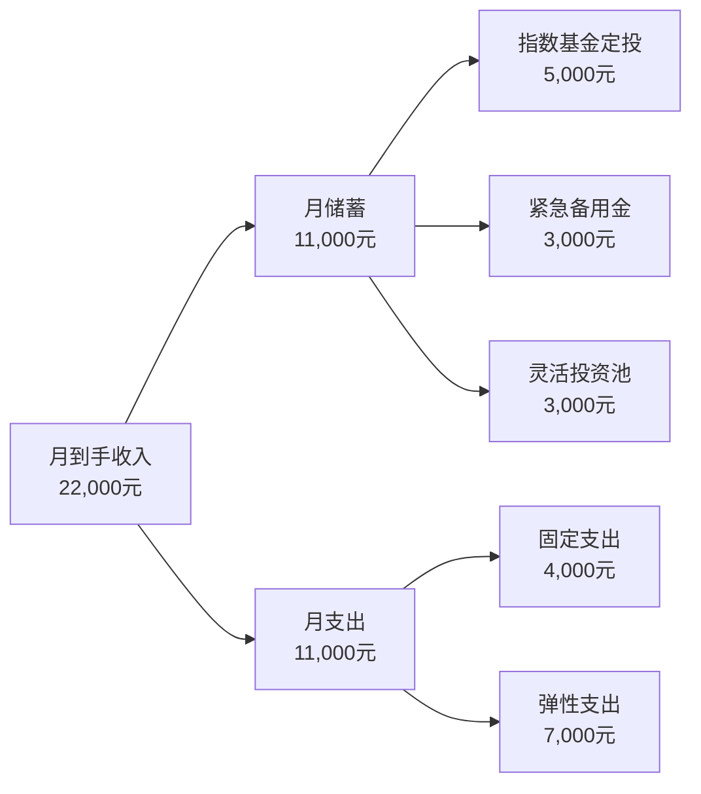
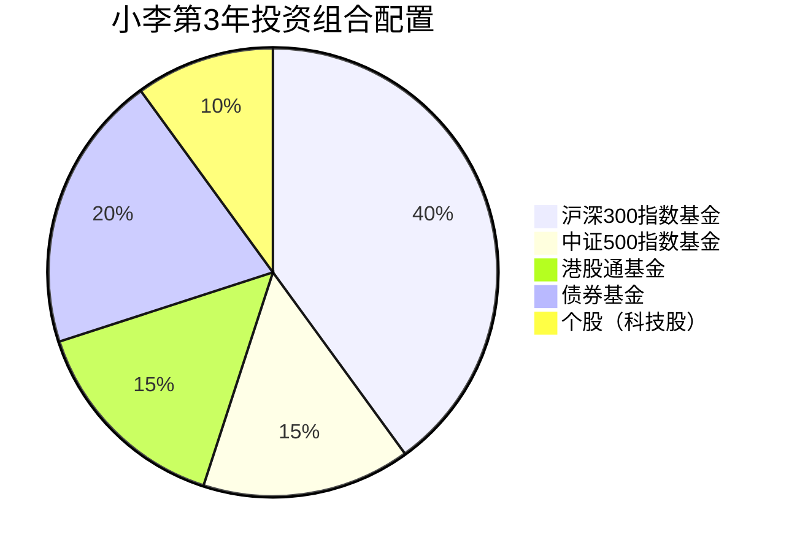
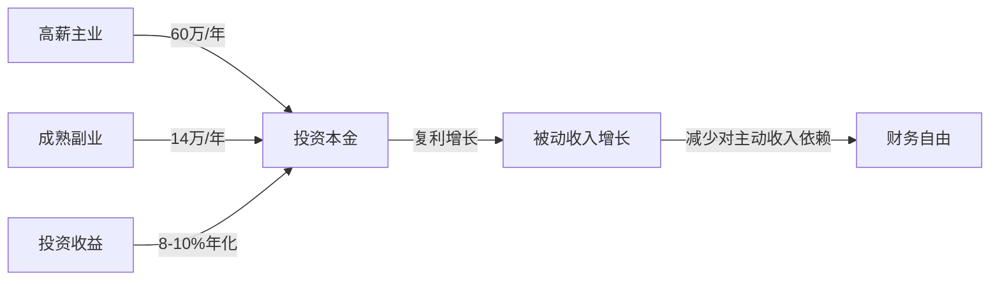

## 案例一：互联网从业者的FIRE之路

### 引言：什么是FIRE

FIRE（Financial Independence, Retire Early）运动起源于1992年Vicki Robin的畅销书《Your Money or Your Life》，核心理念是通过高储蓄率和理性投资，在传统退休年龄之前实现财务自由。这个运动在2008年金融危机后迅速在全球互联网社区传播开来，尤其受到科技行业从业者的追捧——因为他们往往拥有较高的起薪，且习惯用量化思维管理个人财务。

FIRE并非只有一种形态，理解不同变体对于制定个人路线图至关重要：

| FIRE类型 | 核心定义 | 年支出预算 | 适合人群 |
|---------|---------|-----------|---------|
| Lean FIRE | 极简生活，年支出极低 | <10万/年 | 单身、物欲低、有副业能力 |
| Fat FIRE | 保持较高生活水准 | >30万/年 | 高收入者、有家庭负担 |
| Barista FIRE | 半退休，做轻松兼职覆盖日常 | 覆盖部分支出 | 不想完全脱离职场 |
| Coast FIRE | 已有足够本金，只需覆盖当前开支 | 覆盖当前支出 | 想换轻松工作的中高收入者 |

本案例的小李走的是标准FIRE路径，目标是40岁时达到Fat FIRE门槛——年被动收入覆盖20万元支出。

### 人物画像

**基本信息：**

- **姓名**：小李（化名）
- **年龄**：28岁
- **坐标**：杭州余杭区，靠近未来科技城
- **职位**：互联网大厂P6产品经理，工龄5年
- **税前月薪**：30,000元（含基本工资+绩效），到手约22,000元
- **学历**：985本科，计算机相关专业
- **家庭**：单身，无房贷（公司附近租房）
- **FIRE目标**：40岁实现财务独立，年支出20万的FIRE
- **目标金额**：20万 × 25 = 500万（基于4%安全提取率）

**为什么选择FIRE？**

小李并非因为讨厌工作才追求FIRE。相反，他喜欢产品经理这个岗位。但他有两个清醒的认知：第一，互联网行业存在明确的"35岁天花板"，大厂对高龄员工的容忍度逐年下降；第二，他不想把人生的选择权交给公司——哪天被优化了，应该有底气选择继续工作还是做别的事。FIRE对他而言不是"躺平"，而是"拿回选择权"。

### 第一阶段：财务体检与基线建立

任何FIRE计划的第一步都是精确了解自己的财务现状。小李用了一个月时间做了完整的财务体检。

**月度收支明细：**

| 项目 | 金额（元/月） | 占比 | 备注 |
|------|-------------|------|------|
| 到手收入 | 22,000 | 100% | 税后，含公积金个人部分 |
| 房租 | 4,000 | 18.2% | 余杭区一室一厅，公司步行15分钟 |
| 餐饮 | 2,500 | 11.4% | 公司食堂为主，周末外食 |
| 交通 | 500 | 2.3% | 地铁+共享单车，偶尔打车 |
| 日用品+衣物 | 1,000 | 4.5% | 控制冲动消费后 |
| 社交应酬 | 1,000 | 4.5% | 朋友聚餐、同事活动 |
| 娱乐订阅 | 300 | 1.4% | 视频会员+音乐+云存储 |
| 学习投资 | 500 | 2.3% | 书籍、在线课程、行业会议 |
| 其他弹性支出 | 1,200 | 5.5% | 电子产品维护、偶尔旅行分摊 |
| **月总支出** | **11,000** | **50%** | — |
| **月储蓄** | **11,000** | **50%** | — |

**储蓄率计算：**

储蓄率 = 月储蓄 / 月到手收入 = 11,000 / 22,000 = 50%

在FIRE社区中，50%的储蓄率是一个里程碑式的数字。根据Mr. Money Mustache的经典文章《The Shockingly Simple Math Behind Early Retirement》，50%储蓄率意味着大约17年可以实现财务独立（假设年化收益5%）。如果储蓄率能提升到60%，时间缩短到12.5年；70%则只需8.5年。

**资产负债盘点：**

| 资产项目 | 金额（万元） | 说明 |
|---------|------------|------|
| 活期存款 | 2 | 日常流动资金 |
| 货币基金 | 3 | 紧急备用金（约3个月支出） |
| 股票基金 | 0 | 尚未开始投资 |
| 公积金余额 | 8 | 公司+个人，暂不提取 |
| 其他资产 | 0 | 无车无房 |
| **总资产** | **13** | — |
| 负债 | 0 | 无房贷车贷信用卡分期 |
| **净资产** | **13** | — |

**财务健康评分：**

小李按照四个维度给自己打分：

1. **应急能力**（紧急备用金 / 月支出 = 3个月）：及格线3个月，目标6个月→60分
2. **储蓄能力**（储蓄率50%）：FIRE及格线40%，目标60%→80分
3. **投资准备**（投资知识、风险认知）：刚开始学习→40分
4. **负债健康**（无高息负债）：优秀→100分

综合评分：70分。基础不错，但投资能力和应急储备需要加强。

### 第二阶段：五年规划执行详解

#### 第1年（29岁）：打基础——建立系统

**核心任务：建立自动化财务系统**

第1年的关键词是"系统"而非"收益"。小李需要搭建一套能自动运转的财务框架，让储蓄和投资变成无需意志力的例行操作。

**1. 记账系统搭建**

小李测试了多款记账工具后选择了"随手记"，原因很简单：支持账单自动导入（支付宝、微信、银行APP），省去了手动录入的麻烦。但他做了一个关键设置——每周日晚上花15分钟review本周支出，而不是每天盯着数字焦虑。

记账的核心目的不是省钱，而是**消除"钱不知道花到哪里去了"的模糊感**。第一年记账数据最大的价值，是帮小李在第2年精准识别出可以优化的支出项。

**2. 建立紧急备用金**

目标：6个月基本支出 = 11,000 × 6 = 66,000元

策略：每月自动转入货币基金3,000元，加上已有的3万，约12个月完成。货币基金选择余额宝或零钱通，年化约2%-2.5%，流动性为T+0，满足紧急取用需求。

**为什么是6个月而不是3个月？** 互联网行业裁员往往突然且大规模，3个月可能刚好覆盖找工作的时间，但没有缓冲余地。6个月给了小李从容选择的机会——可以拒绝不合适的offer，等待更好的机会。

**3. 指数基金定投启动**

小李选择了沪深300指数基金作为投资起步，原因如下：

- **宽基指数**：覆盖A股市值最大的300家公司，分散风险
- **费率低**：管理费0.5%/年，远低于主动基金的1.5%
- **长期收益**：沪深300过去15年年化收益约8%-10%（含分红再投资）
- **适合新手**：不需要选股能力，买入并持有即可

定投策略：
- 每月定投5,000元，设置自动扣款（每月15日发工资后第二天）
- 选择场外联接基金（如天弘沪深300联接A），门槛低，操作简单
- 不择时，不中断，无论市场涨跌都执行

**4. 投资知识学习计划**

小李给自己列了一个学习书单，每天通勤时间听30分钟音频或读20页：

| 学习阶段 | 书籍/资源 | 核心收获 |
|---------|---------|---------|
| 入门（第1-2月） | 《小狗钱钱》《穷爸爸富爸爸》 | 建立财务思维框架 |
| 基础（第3-4月） | 《指数基金投资指南》（银行螺丝钉） | 理解指数基金原理 |
| 进阶（第5-6月） | 《投资中最简单的事》（邱国鹭） | 理解价值投资逻辑 |
| 深化（第7-12月） | 《漫步华尔街》《聪明的投资者》 | 建立完整投资世界观 |

**第1年财务成果：**

| 指标 | 目标 | 实际 | 备注 |
|------|------|------|------|
| 年储蓄总额 | 132,000 | 128,000 | 年中一次大额医疗支出 |
| 紧急备用金 | 66,000 | 62,000 | 基本达标 |
| 投资账户 | 60,000 | 58,000 | 定投12个月 |
| 投资收益 | — | +3,200 | 约5.5%年化 |
| 总净资产 | ~25万 | ~24万 | 略低于预期 |

**第1年复盘关键教训：**

小李发现"其他弹性支出"比预算多了约5,000元/年，主要是两次同事婚礼的份子钱和一次感冒去私立医院。这让他意识到：预算必须包含一个"不可预见支出"科目，按年收入的3%-5%预留。

#### 第2年（30岁）：提收入——人力资本增值

**核心任务：提升主动收入**

FIRE的数学公式很简单：净资产 = 本金 × (1 + 收益率)^时间。第1年小李在"本金"和"时间"上做了努力，第2年的重点是提高"本金"的流入速度——也就是涨薪。

**1. 争取晋升加薪**

小李的策略不是等年终评估时被动等待，而是主动管理自己的晋升进程：

- **量化工作成果**：把每个项目转化为可衡量的指标（如"主导的用户增长项目使DAU提升15%"）
- **向上管理**：每两周和直属leader做一次15分钟的1v1，同步进展，获取反馈
- **扩展影响力**：主动参与跨部门项目，让总监级领导看到自己的名字

结果：第2年Q3成功晋升P7，月薪从30,000涨到38,000（到手约28,000元），涨幅26.7%。

**2. 建立个人品牌——知乎内容输出**

小李选择知乎作为内容平台，原因有三：产品经理的目标用户天然在知乎；知乎的长尾流量好，一篇文章可以持续获得曝光；知乎的商业变现路径清晰（知+、品牌合作、咨询导流）。

他的内容策略：

- **选题**：写自己亲身经历的项目复盘，而非纸上谈兵的方法论
- **频率**：每周一篇2,000-3,000字的深度分析
- **冷启动**：前10篇不求流量，只求质量，建立作品集
- **数据跟踪**：每篇文章的阅读量、赞同数、收藏数记录在表格中

第2年末，知乎粉丝达到8,000，开始有品牌方私信合作意向。

**3. 储蓄率优化**

加薪后，小李做了一个关键决策：**把涨薪部分的80%直接存入投资账户**。月薪到手从22,000涨到28,000，增加6,000元，其中4,800元直接转入定投。这就是所谓的"生活方式膨胀防火墙"——收入增长时，用自动化手段阻止支出同步增长。

新的月度收支结构：

| 项目 | 金额（元/月） | 变化 |
|------|-------------|------|
| 到手收入 | 28,000 | +6,000 |
| 月支出 | 12,200 | +1,200（适度改善生活） |
| 月储蓄 | 15,800 | +4,800 |
| 储蓄率 | 56.4% | +6.4个百分点 |

**第2年财务成果：**

| 指标 | 第1年末 | 第2年末 | 增长 |
|------|--------|--------|------|
| 投资账户 | 58,000 | 175,000 | +202% |
| 紧急备用金 | 62,000 | 72,000 | +16% |
| 总净资产 | ~24万 | ~38万 | +58% |

#### 第3年（31岁）：开副业——第二收入曲线

**核心任务：将个人品牌变现**

第3年，小李的知乎粉丝突破2万，具备了商业化基础。他的副业路径是**知识付费 + 咨询**，而非接广告。

**1. 副业收入结构**

| 收入来源 | 月均收入 | 投入时间 | 备注 |
|---------|---------|---------|------|
| 1v1职业咨询 | 3,000元 | 每月4次×1小时 | 每次750元，通过知乎咨询入口 |
| 企业内训 | 2,000元 | 每月1-2次×2小时 | 通过人脉介绍，非固定 |
| 知乎付费专栏 | 1,500元 | 被动收入 | 《产品经理成长手册》月销约200份 |
| **月均副业** | **6,500元** | — | 年约7.8万 |

**2. 时间管理策略**

副业最怕影响主业。小李制定了严格的时间边界：

- **工作日**：20:00-21:30用于内容创作和咨询准备，不超过1.5小时
- **周末**：周六上午3小时集中处理咨询和课程更新
- **铁律**：工作日22:00后不处理任何副业事务，保证睡眠

**3. 投资组合升级**

随着投资知识的积累和本金的增长，小李开始优化投资组合：

**配置逻辑说明：**

- **沪深300（40%）**：核心仓位，大盘蓝筹稳健增长
- **中证500（15%）**：中小盘成长股，提高组合弹性
- **港股通基金（15%）**：分散A股单一市场风险，港股估值相对较低
- **债券基金（20%）**：降低整体波动，提供再平衡机会
- **个股（10%）**：用研究能力捕捉超额收益，严格止损

**再平衡规则：** 每季度末检查一次，偏离目标配置超过5个百分点时调仓。

**第3年财务成果：**

| 指标 | 第2年末 | 第3年末 | 增长 |
|------|--------|--------|------|
| 投资账户 | 175,000 | 380,000 | +117% |
| 年副业收入 | 0 | 78,000 | 从0到1 |
| 总净资产 | ~38万 | ~58万 | +53% |

#### 第4年（32岁）：优化结构——收入跃迁

**核心任务：通过跳槽实现收入跨越式增长**

互联网行业的薪资增长往往不是线性的，而是阶梯式的——跳槽就是那个台阶。小李在第4年做出了一个重要决策：跳槽。

**1. 跳槽决策框架**

小李用了一个量化决策模型评估跳槽机会：

| 评估维度 | 权重 | 原公司（评分） | 新公司（评分） | 加权差异 |
|---------|------|-------------|-------------|---------|
| 薪资总包 | 30% | 60万（6分） | 80万（8分） | +0.6 |
| 成长空间 | 25% | 6分 | 8分 | +0.5 |
| 工作强度 | 20% | 9分（较轻松） | 6分（996较多） | -0.6 |
| 行业前景 | 15% | 6分 | 8分 | +0.3 |
| 团队氛围 | 10% | 8分 | 7分 | -0.1 |
| **加权总分** | — | **6.7** | **7.4** | **+0.7** |

新公司在薪资和成长空间上的优势超过了工作强度的劣势，决策成立。

**跳槽谈判要点：**

- 不透露当前薪资，让对方先出价
- 拿到3个offer互相博弈
- 谈判重点放在年包（base+股票+签字费），而非月薪

新薪资结构：月薪45,000 + 年度股票15万 + 年终奖2-4个月 = 年总包约80万。到手月收入约33,000元，加上股票和年终，年到手约60万。

**2. 副业成熟化**

第4年副业收入结构优化：

| 收入来源 | 月均收入 | 变化 |
|---------|---------|------|
| 1v1咨询 | 4,000元 | 涨价至1,000元/次 |
| 企业内训 | 3,000元 | 更稳定的客户来源 |
| 付费专栏+课程 | 5,000元 | 新增视频课程 |
| **月均副业** | **12,000元** | 年约14.4万 |

**3. 投资组合进一步优化**

投资资产突破80万后，小李开始关注资产配置的科学性。他引入了**全球配置**的概念：

- A股宽基指数：35%（沪深300+中证500）
- 港股+美股指数：25%（通过QDII基金）
- 债券基金：25%（纯债+二级债基）
- REITs基金：5%（不动产投资信托）
- 现金类：10%（货币基金+短债基金）

**第4年财务成果：**

| 指标 | 第3年末 | 第4年末 | 增长 |
|------|--------|--------|------|
| 投资账户 | 380,000 | 720,000 | +89% |
| 年总收入（主业+副业） | 约52万 | 约94万 | +81% |
| 年储蓄额 | 约20万 | 约45万 | +125% |
| 总净资产 | ~58万 | ~105万 | +81% |

第4年末，小李正式突破百万净资产。

#### 第5年（33岁）：突破百万——里程碑

**核心任务：巩固成果，建立被动收入意识**

第5年，小李的财务飞轮开始转动：

**这一年小李做了一件重要的事：计算自己的"财务自由进度条"。**

FIRE目标金额 = 年支出 × 25 = 200,000 × 25 = 5,000,000元

当前净资产：约150万

财务自由进度 = 150万 / 500万 = 30%

按当前储蓄+投资增长速度，预计还需5-6年（38-39岁）达成目标。

**第5年关键决策：买车的诱惑**

小李想买一辆30万的车。他用了一个决策工具——**"机会成本计算器"**：

| 选择 | 当前支出 | 10年后（8%年化） | 20年后 |
|------|---------|-----------------|--------|
| 买30万的车 | -30万 | 0（车已贬值到5万） | 0 |
| 不买车，投资30万 | 0 | +64.8万 | +139.8万 |
| 买15万的车，投15万 | -15万 | +32.4万 | +69.9万 |

最终小李选择了第三种方案：买了一辆15万的国产新能源车（通勤代步够用），剩余15万继续投资。这个决策让他在未来10年多出约32万的资产。

**第5年财务成果：**

| 指标 | 金额 |
|------|------|
| 投资账户 | 约95万 |
| 紧急备用金 | 约10万 |
| 其他流动资金 | 约5万 |
| 年总收入 | 约105万 |
| 年储蓄额 | 约50万 |
| 总净资产 | 约150万 |

### 第三阶段：十年展望与FIRE达成路径

从第6年到第10年（34-38岁），小李的FIRE进入加速阶段。以下是保守估计的财务轨迹：

| 年份 | 年龄 | 预计净资产 | 年被动收入 | FIRE进度 |
|------|------|-----------|-----------|---------|
| 第6年 | 34 | 210万 | 8.4万 | 42% |
| 第7年 | 35 | 280万 | 11.2万 | 56% |
| 第8年 | 36 | 360万 | 14.4万 | 72% |
| 第9年 | 37 | 450万 | 18万 | 90% |
| 第10年 | 38 | 550万 | 22万 | **110%** |

**关键假设：**
- 年化投资收益率8%（扣除通胀后约5%）
- 年储蓄额保持40-50万（考虑薪资增长和副业扩大）
- 不发生重大意外支出（重病、家庭变故等）
- 未计入房产增值（小李至今未购房）

第38岁时，小李的年被动收入约22万，超过20万/年的支出目标，正式达成FIRE。

### 风险管理与应急预案

小李的FIRE之路看似顺利，但他清楚地知道几个重大风险：

#### 风险1：互联网行业裁员

**概率评估**：高。互联网行业每年都有大规模裁员潮。

**应对策略：**
- 6个月紧急备用金（而非3个月）
- 副业收入可以在失业期间部分替代主业
- 保持面试能力，每半年参加1-2次面试保持手感
- 投资组合中有足够流动性资产，不被迫在低点卖出

#### 风险2：投资市场大幅下跌

**概率评估**：必然发生。A股历史上多次出现40%以上的回撤。

**应对策略：**
- 股债搭配，债券基金在股市下跌时提供缓冲
- 定投本身就是"下跌时多买份额"的天然策略
- 不使用杠杆，不借钱投资
- 保持"下跌是打折买入机会"的心态（前提是有备用金，不需要被迫卖出）

#### 风险3：重大疾病或意外

**概率评估**：低但后果严重。

**应对策略：**
- 公司补充医疗保险（覆盖门诊和住院）
- 自购百万医疗险（年缴约300元，保额200-400万）
- 重疾险（保额50万，年缴约5,000元，保至60岁）
- 定期寿险（保额100万，年缴约1,000元，保至60岁）

保险总年缴约6,300元，占年收入不到1%，但能覆盖最极端的财务风险。

#### 风险4：生活方式膨胀

**概率评估**：高，且是渐进式的。

**应对策略：**
- 涨薪后80%自动转入投资账户（已执行）
- 每年只允许一次"生活方式升级"（如换更好的房子或更好的手机，不能两者同时）
- 和志同道合的朋友交流，避免在高消费社交圈中被"感染"

#### 风险5：政策变化（房产税、资本利得税等）

**概率评估**：中等。

**应对策略：**
- 关注政策动向，提前做税务规划
- 利用公积金贷款购房（如果政策变化导致持有成本上升，及时调整策略）
- 分散投资渠道，不把所有资产放在一个篮子里

### 关键决策点复盘

回顾小李五年来的三个关键决策，我们可以提炼出通用的决策框架：

#### 决策1：花2万参加产品经理培训（第2年）

**情境**：一个为期3个月的周末产品经理高级培训，学费2万元。

**决策过程：**

用**时薪思维**计算投资回报率：

- 当前月薪：30,000元 ÷ 22个工作日 ÷ 8小时 = 170元/小时
- 培训投入：20,000元 + 周末24小时（约3个月×8小时）
- 预期收益：如果能让月薪涨3,000元，年增收入36,000元
- 投入回报率：36,000 ÷ 20,000 = 180%（第一年就回本并盈利）
- 投入时间回报：36,000 ÷ 24小时 = 1,500元/小时（远高于当前时薪）

**结果**：培训确实帮助小李在半年后获得了晋升加分，间接促成了第2年的涨薪。

**通用原则**：对自身能力的投资，只要预期回报率超过100%且回收期在1年以内，就值得大胆投入。

#### 决策2：拒绝朋友的创业邀请（第3年）

**情境**：一个做SaaS产品的朋友邀请小李以联合创始人身份加入，提供15%股权。

**决策过程：**

小李用**期望值分析**评估了这个机会：

| 场景 | 概率 | 结果 | 期望值 |
|------|------|------|--------|
| 创业成功（被收购或盈利） | 10% | 5年内获得500万 | 50万 |
| 创业小成（勉强盈利） | 20% | 5年内获得100万 | 20万 |
| 创业失败 | 70% | 5年内损失工资差额约60万 | -42万 |
| **期望值** | — | — | **+28万** |

看起来期望值是正的，但小李还考虑了两个因素：

1. **机会成本**：如果创业失败，33岁重新找工作，可能拿不到当前的薪资水平
2. **风险承受力**：当前FIRE进度只有20%，创业失败会让进度倒退2-3年

**结果**：小李婉拒了邀请。那个SaaS项目在两年后确实关闭了。

**通用原则**：高风险决策要看期望值，更要看"最坏情况是否可承受"。当你的FIRE进度低于50%时，保住稳定的高收入比搏一把更重要。

#### 决策3：买车的机会成本计算（第5年）

已在上文详述。**通用原则**：所有大额消费决策都应该计算"10年后的机会成本"——这笔钱如果投资，10年后会变成多少？

### 本案例可复制的核心方法论

小李的FIRE之路之所以值得学习，不是因为他的收入高（很多互联网从业者收入类似），而是因为他构建了一套**可复制的系统**：

**1. 自动化储蓄系统**

工资到账 → 自动转出50%-60%到投资账户 → 剩余才是可支配收入。这个顺序不能反过来。先储蓄后消费，而非先消费后储蓄。

**2. 收入增长防火墙**

每次涨薪，只把增量的20%用于改善生活，80%直接进入投资。这条规则让小李在收入翻倍的情况下，支出只增长了30%。

**3. 内容复利效应**

知乎文章是"一次创作，持续收益"的典范。小李早期写的文章在两年后仍然每月带来数百元的被动收入。内容创作是最适合互联网从业者的副业形式之一。

**4. 量化决策习惯**

无论是跳槽、花钱还是投资，小李都用数据和表格辅助决策，而非凭直觉。这个习惯让他避免了多次潜在的冲动决策。

**5. 渐进式优化**

小李不是一上来就做到完美。他的储蓄率从50%起步，逐步优化到56%；投资组合从单一沪深300，逐步扩展到全球配置。**完美是进步的敌人，开始行动比制定完美计划更重要。**

### 常见误区警示

在FIRE实践中，以下误区最容易让计划偏离轨道：

**误区1：FIRE = 不工作**

真相：FIRE是"有选择工作的自由"，而非"不工作"。小李即使在达成FIRE后，大概率仍会继续做产品经理——只是不再因为需要钱而忍受不喜欢的团队或项目。

**误区2：只关注储蓄率，忽视收入增长**

真相：储蓄率有天花板（不可能超过100%），但收入增长理论上没有上限。小李五年内收入从30万增长到100万，这是FIRE加速的关键引擎。砍开支能让你从30%储蓄率提到50%，但从50%提到70%的生活质量代价极大。相比之下，把精力放在收入增长上，性价比更高。

**误区3：投资越复杂越好**

真相：小李的投资组合看似多元，但核心仍然是指数基金定投。80%的投资收益来自于资产配置（股债比例），而非选股或择时。新手最容易犯的错误是频繁交易、追逐热点、试图"战胜市场"。

**误区4：忽视保险**

真相：一场大病可能让十年的FIRE积累化为乌有。小李每年只花6,300元买保险，却覆盖了数百万的风险敞口。这是FIRE计划中性价比最高的"投资"。

**误区5：FIRE后生活无聊**

真相：这不是误区——这确实是需要提前规划的问题。小李在FIRE路径上就开始培养"退休后可做的事"：写作、投资研究、产品顾问、旅行。FIRE不是人生的终点，而是新阶段的起点。

### 给不同读者的行动建议

**如果你月薪1万以下：** 先聚焦收入增长。FIRE的数学公式中，本金流入速度是最大的变量。提升技能、跳槽涨薪、发展副业，比省吃俭用更有效。

**如果你月薪1-3万：** 建立自动化储蓄系统，开始指数基金定投。同时像小李一样，通过内容输出建立个人品牌，为未来的副业变现打基础。

**如果你月薪3万以上：** 关注资产配置的科学性和税务优化。高收入者最容易犯的错误是"高收入幻觉"——以为高收入等于高净资产，实际上没有系统的话，高收入也可能月光。

**如果你已35岁以上：** FIRE的时间窗口在缩小，但并非不可能。重点是：提高储蓄率到极致（60%+）、选择高确定性的投资标的、发展可长期持续的被动收入来源。Barista FIRE（半退休）也是一个务实的选择。

### 本节要点回顾

1. **FIRE的本质**是"拿回人生选择权"，而非"躺平不工作"
2. **50%储蓄率**是FIRE的里程碑起点，可通过"先储蓄后消费"的自动化系统实现
3. **收入增长**比削减开支更有杠杆效应，互联网从业者应充分利用跳槽和副业两条路径
4. **指数基金定投**是最适合FIRE实践者的投资方式——简单、低费率、长期收益稳定
5. **风险管理**是FIRE计划的基石——保险、备用金、分散投资三者缺一不可
6. **量化决策**（时薪思维、机会成本计算、期望值分析）能帮助你避免冲动消费和高风险决策
7. **渐进式优化**优于完美主义——先开始行动，再逐步调优
