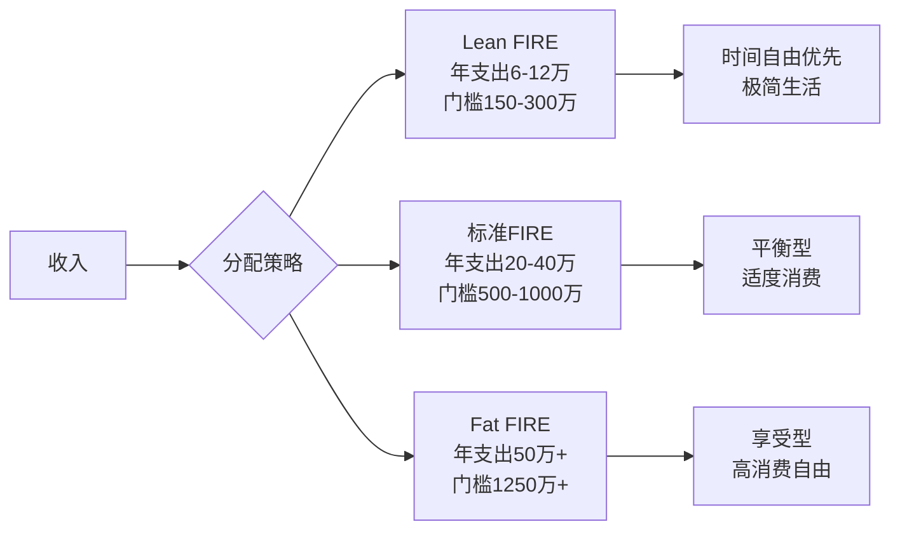
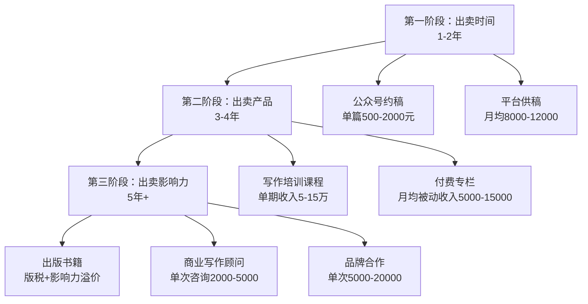

## 案例二：自由职业者的极简FIRE

自由职业者没有稳定的工资流水，没有公司代缴社保，收入像过山车一样起伏不定。在传统认知中，这类人群是离"财务自由"最远的群体。但本案例的主人公小王，用一套极简FIRE策略，仅用9年时间就从月入不稳定的撰稿人变成了财务自由的数字游民。

这个案例的核心价值在于：它证明了FIRE不只属于高薪程序员和金融从业者——收入不高但支出极低、技能可复利增长的自由职业者，同样能走通这条路。

---

### 一、FIRE与极简FIRE：理论基础

#### 1.1 FIRE的核心公式

FIRE（Financial Independence, Retire Early）的核心逻辑极其简单：

```text
财务自由门槛 = 年支出 ÷ 安全提取率
```

安全提取率（Safe Withdrawal Rate, SWR）源自1998年Trinity大学的研究，即著名的"4%法则"：如果每年从投资组合中提取不超过4%，在大多数历史情境下，资金可以支撑30年以上。

| 年支出 | 4%法则门槛 | 3.5%法则门槛（更保守） | 3%法则门槛（极保守） |
|--------|-----------|----------------------|---------------------|
| 6万 | 150万 | 171万 | 200万 |
| 8万 | 200万 | 229万 | 267万 |
| 12万 | 300万 | 343万 | 400万 |
| 20万 | 500万 | 571万 | 667万 |
| 30万 | 750万 | 857万 | 1,000万 |

这张表揭示了一个残酷的真相：**年支出每增加1万，财务自由门槛就增加25-33万**。对于收入不高的自由职业者，控制支出不是"抠门"，而是最高效的财务策略。

#### 1.2 极简FIRE：低收入群体的可行路径

极简FIRE（Lean FIRE）是FIRE运动中的一个分支，核心理念是：

- **年支出控制在6-12万**（单人）或12-20万（家庭）
- **财务自由门槛降至150-350万**
- **牺牲部分物质享受，换取时间和自由的极大化**

极简FIRE与标准FIRE（年支出20-40万）和Fat FIRE（年支出50万以上）的区别：



极简FIRE适合以下人群：
- 收入不高但生活成本可控的二三线城市居民
- 拥有可远程工作的技能（写作、设计、编程、翻译等）
- 天然偏好极简生活方式的人
- 愿意用"少消费"换"早自由"的理性决策者

#### 1.3 自由职业者做FIRE的独特优势与劣势

| 维度 | 优势 | 劣势 |
|------|------|------|
| 收入 | 上限高，可多渠道并行 | 不稳定，有淡旺季 |
| 时间 | 完全自主，可灵活安排 | 容易拖延，自律要求高 |
| 税务 | 可合理利用个体户/工作室节税 | 需自行缴纳社保和个税 |
| 成长 | 技能可复利，边际成本递减 | 需要持续学习，否则被淘汰 |
| 心理 | 成就感强，掌控感高 | 孤独感、焦虑感、缺乏安全感 |

---

### 二、案例主角画像

#### 2.1 基本信息

| 项目 | 详情 |
|------|------|
| 姓名 | 小王（化名） |
| 年龄 | 26岁 |
| 城市 | 成都 |
| 职业 | 自由撰稿人 |
| 月收入 | 不稳定，平均1.2万 |
| 学历 | 本科，中文系 |
| FIRE目标 | 35岁实现极简FIRE |
| 目标年支出 | 8万（月均6,667元） |
| 财务自由门槛 | 200-230万（4%-3.5%提取率） |

#### 2.2 起点财务状况

小王开始执行FIRE计划时的财务状况：

| 资产/负债 | 金额 |
|-----------|------|
| 储蓄 | 3.5万 |
| 投资 | 0 |
| 负债 | 0（无房贷、无车贷、无消费贷） |
| 信用记录 | 良好 |
| 社保 | 自行缴纳灵活就业社保 |
| 净资产 | 3.5万 |

起点不高，但优势在于：**零负债**。负债是FIRE最大的敌人——每一分负债都在增加财务自由的门槛。

#### 2.3 核心SWOT分析

| | 正面 | 负面 |
|--|------|------|
| **内部** | **优势S**：生活成本低（成都）、极简主义天然适配、写作技能可复利、零负债 | **劣势W**：收入不稳定、无雇主社保福利、储蓄基数小、无投资经验 |
| **外部** | **机会O**：内容创作红利期、知识付费市场增长、远程工作普及、成都低生活成本 | **威胁T**：平台政策变化、AI写作冲击、健康风险无保障、通货膨胀 |

---

### 三、关键挑战深度分析

#### 3.1 收入不稳定的现金流难题

自由职业者最大的财务挑战不是"收入低"，而是"收入不可预测"。传统工薪族每月15号固定到账一笔钱，可以精确规划储蓄和投资。自由职业者可能这个月赚2万、下个月赚3千。

这种波动性带来三个具体问题：

**问题一：储蓄节奏被打乱。** 工薪族可以设置"工资到账自动转存"，自由职业者无法这样做。解决方案是建立"收入缓冲池"——所有收入先进入缓冲账户，每月固定金额转入生活账户和投资账户，模拟"发工资"的效果。

**问题二：紧急备用金需求更大。** 工薪族通常建议存3-6个月支出作为紧急备用金，自由职业者需要存6-12个月。因为失业风险更高、收入恢复周期更长。

**问题三：投资时机选择困难。** "有余就投"听起来简单，但实际操作中容易变成"总也不投"——因为总觉得下个月可能收入不好要留钱。需要建立明确的投资规则，比如"缓冲账户超过X万时，超出部分自动投资"。

#### 3.2 社保与保障缺失

自由职业者没有雇主缴纳社保，需要自行解决三个保障问题：

**养老保险**：以灵活就业身份缴纳，成都2025年最低档约每月800-1000元。FIRE后可以继续缴纳至满15年，或者选择停缴（但会影响退休后收入）。

**医疗保险**：这是最重要的保障。灵活就业医保每月约300-500元。如果没有医保，一场大病可能直接摧毁FIRE计划。**绝对不能省这笔钱。**

**商业保险**：建议配置百万医疗险（年费200-500元）和意外险（年费100-300元）。重疾险在预算紧张时可以暂缓，但百万医疗险是底线。

#### 3.3 心理层面的挑战

极简FIRE对心理素质的要求远高于对财务能力的要求：

- **社交压力**：同龄人买名牌、换新车、去网红餐厅，你却在自己做饭、住合租房。需要建立坚定的价值观体系。
- **收入焦虑**：淡季时看着银行余额下降，会本能地想放弃计划去打工。需要足够的缓冲金来应对心理波动。
- **孤独感**：自由职业本身就有社交缺失，极简生活可能进一步减少社交活动。需要刻意维护社交圈。
- **目标倦怠**：9年是一段很长的时间，中间可能无数次想放弃。需要设置阶段性里程碑来保持动力。

---

### 四、策略设计：三位一体的极简FIRE路径

小王的策略可以概括为三条腿走路：**极致压低支出 + 阶梯式提升收入 + 稳健投资**。

#### 4.1 支出端：月支出2000元的极简生活系统

小王的月支出结构：

| 支出项目 | 金额（元/月） | 优化策略 |
|----------|--------------|----------|
| 住房 | 800 | 成都合租房，选择地铁沿线但非核心区域 |
| 饮食 | 600 | 自己做饭为主，周均食材采购，批量备餐 |
| 日用/消费 | 300 | 极简主义：一进一出原则，不买非必需品 |
| 交通 | 100 | 公交/地铁/骑行，不打车 |
| 通讯 | 50 | 互联网套餐，够用就好 |
| 社保 | 400 | 灵活就业医保+养老最低档 |
| 娱乐/社交 | 150 | 免费活动为主，偶尔聚会 |
| 其他 | 100 | 预留弹性 |
| **合计** | **2,500** | — |

**注意**：小王初期的月支出确实是2000元，但随着年龄增长和生活需求变化，后期逐步调整到2500-5000元。这在规划表中也有体现。

**住房优化详解**：成都是新一线城市中生活成本最低的之一。合租房单间价格在600-1200元之间，选择非核心区（如龙泉驿、温江）可以进一步压低。小王选择的是靠近地铁站的老小区合租房，800元/月含水电。

**饮食优化详解**：月均600元意味着日均20元。这个预算在成都完全可行——前提是自己做饭。小王的策略是每周日批量采购食材（菜市场比超市便宜30-50%），一次做3-4天的菜，用保鲜盒分装。早餐粥+鸡蛋（约3元），午餐和晚餐各一荤一素一汤（各约7-8元）。

**极简消费哲学**：小王的300元/月消费预算涵盖衣服、日用品、电子产品等所有非食物、非住房开支。她的原则是"一进一出"——买一件新东西就必须淘汰一件旧东西。这不仅控制了支出，还保持了生活空间的整洁。

#### 4.2 收入端：写作技能的三阶复利增长

小王的收入增长不是靠"更努力地写稿"，而是靠**改变收入模式**。自由职业者的收入增长有三个阶段：



**第一阶段（1-2年）：出卖时间，月均8,000-12,000元**

这是最辛苦的阶段，收入与写作量直接挂钩。小王的策略是：
- 深耕2-3个垂直领域（她选择了个人成长和职场写作）
- 同时维护3-4个稳定供稿渠道（公众号、知乎、头条号、豆瓣）
- 建立作品集和口碑，为后续转型积累素材
- 每天写作4-6小时，产出2000-3000字

这个阶段的关键指标是**单位时间收入**：如果一篇2000字的稿子稿费500元，写作+修改需要4小时，时薪就是125元。要持续提升这个数字。

**第二阶段（3-4年）：出卖产品，月均15,000-25,000元**

这是从"卖时间"到"卖产品"的关键转型。小王做了两件事：

1. **开设写作培训课程**：把过去2年积累的写作方法论整理成系统课程，在知识星球/小鹅通上线。第一期定价199元/人，招了80人，收入约1.6万。后续每期涨价并扩大招生规模。

2. **开设付费专栏**：在公众号和知乎开设年费专栏（定价99-199元/年），持续输出高质量内容。这创造了被动收入——写一次，持续收费。

**第三阶段（5年+）：出卖影响力，月均30,000-50,000元**

到这个阶段，小王已经不是单纯的"写手"，而是"内容创作者+知识IP"。收入来源包括：
- **出版书籍**：版税收入（首印3-5万册，版税率8-12%，单本书收入约5-15万），更重要的是书籍带来的品牌溢价
- **商业写作顾问**：为品牌提供内容策略咨询，单次咨询2000-5000元
- **品牌合作**：公众号/知乎的软文合作，单篇5000-20000元
- **课程迭代**：旧课程持续销售 + 新课程开发

#### 4.3 投资端：自由职业者的投资策略

自由职业者的投资策略需要考虑收入波动性，不能像工薪族那样"每月定投固定金额"。小王采用的是**"蓄水池+阶梯投资"策略**：

**蓄水池机制**：
- 所有收入进入"收入缓冲账户"（货币基金，年化约2%）
- 缓冲账户保持3-6个月支出（即1.5-3万元）作为安全垫
- 超过安全垫的部分，每月固定日期转入投资账户

**投资组合**：

| 资产类别 | 配比 | 具体标的 | 逻辑 |
|----------|------|----------|------|
| 宽基指数基金 | 60% | 沪深300ETF + 中证500ETF | 核心仓位，长期持有 |
| 债券基金 | 20% | 纯债基金 | 降低波动，稳定收益 |
| 货币基金 | 15% | 余额宝/零钱通 | 紧急备用金+缓冲池 |
| 另类投资 | 5% | 黄金ETF | 对冲极端风险 |

**定投规则**：
- 缓冲账户超过4万元时，超出部分在每月15日投入
- 优先投入宽基指数基金（60%比例）
- 市场大幅下跌（跌幅超过15%）时，从债券基金中调仓至指数基金
- 每季度检视一次资产配置比例，偏离超过5%时再平衡

**为什么不用更激进的策略？** 自由职业者的投资必须保守，因为没有稳定的工资收入作为"心理安全网"。如果投资组合波动太大，淡季时可能被迫在低点卖出——这是投资中最大的忌讳。

---

### 五、9年执行规划详解

#### 5.1 阶段一：打地基（第1-2年，26-27岁）

| 指标 | 目标值 |
|------|--------|
| 月均收入 | 8,000-12,000元 |
| 月均支出 | 2,000元 |
| 月储蓄率 | 75-83% |
| 累计净资产目标 | 15-20万 |

**核心任务**：
1. 建立稳定的供稿渠道（至少3个）
2. 确定垂直领域定位
3. 建立紧急备用金（6个月支出 = 1.2万）
4. 开始投资，建立投资习惯
5. 注册灵活就业社保
6. 学习基础投资知识（读完3-5本投资经典）

**里程碑**：第12个月结束时，月收入稳定在1万以上，净资产突破10万。

#### 5.2 阶段二：加速期（第3-4年，28-29岁）

| 指标 | 目标值 |
|------|--------|
| 月均收入 | 15,000-25,000元 |
| 月均支出 | 2,500-3,000元 |
| 月储蓄率 | 80-88% |
| 累计净资产目标 | 50-70万 |

**核心任务**：
1. 上线第一门写作课程
2. 建立付费专栏，创造被动收入
3. 公众号粉丝突破5万
4. 投资组合开始产生可观收益
5. 考虑成立个人工作室（税务优化）

**里程碑**：第4年结束时，被动收入占比超过30%，净资产突破50万。

#### 5.3 阶段三：冲刺期（第5-7年，30-32岁）

| 指标 | 目标值 |
|------|--------|
| 月均收入 | 30,000-50,000元 |
| 月均支出 | 3,000-4,000元 |
| 月储蓄率 | 87-92% |
| 累计净资产目标 | 150-230万 |

**核心任务**：
1. 出版第一本书
2. 课程矩阵成型（2-3门课程持续销售）
3. 建立商业写作顾问业务
4. 投资收益开始复利显现
5. 被动收入占比超过50%

**里程碑**：第7年结束时，净资产突破200万，达到极简FIRE门槛。

#### 5.4 阶段四：自由期（第8-9年，33-35岁）

| 指标 | 目标值 |
|------|--------|
| 月均收入 | 40,000-50,000元（可选） |
| 月均支出 | 4,000-5,000元 |
| 累计净资产目标 | 280-350万 |

**核心任务**：
1. 优化投资组合，降低风险敞口
2. 建立FIRE后的收入结构（被动收入为主）
3. 规划FIRE后的生活方式
4. 完善医疗保障体系
5. 可选择继续工作（但不再是"必须"）

**里程碑**：第9年结束时（35岁），净资产突破300万，年被动收入超过8万，正式实现财务自由。

#### 5.5 完整规划数据表

| 年份 | 年龄 | 月均收入 | 月均支出 | 月储蓄 | 储蓄率 | 累计净资产 | 年投资收益 |
|------|------|---------|---------|--------|--------|-----------|-----------|
| 第1年 | 26 | 10,000 | 2,000 | 8,000 | 80% | ~10万 | ~0.3万 |
| 第2年 | 27 | 12,000 | 2,000 | 10,000 | 83% | ~22万 | ~1.2万 |
| 第3年 | 28 | 20,000 | 2,500 | 17,500 | 88% | ~45万 | ~3万 |
| 第4年 | 29 | 25,000 | 3,000 | 22,000 | 88% | ~72万 | ~5.5万 |
| 第5年 | 30 | 35,000 | 3,000 | 32,000 | 91% | ~115万 | ~9万 |
| 第6年 | 31 | 40,000 | 3,500 | 36,500 | 91% | ~165万 | ~14万 |
| 第7年 | 32 | 45,000 | 4,000 | 41,000 | 91% | ~225万 | ~20万 |
| 第8年 | 33 | 50,000 | 4,500 | 45,500 | 91% | ~290万 | ~27万 |
| 第9年 | 34 | 50,000 | 5,000 | 45,000 | 90% | ~355万 | ~35万 |

**投资收益假设**：年化6%（股债混合），前3年因本金较少收益不明显，第5年起复利效应显著。

---

### 六、FIRE后的生活设计

实现财务自由不是终点，而是新生活的起点。小王规划的FIRE后生活：

#### 6.1 收入结构

FIRE后不再"必须"工作，但会保持部分收入来源以增加安全边际：

| 收入来源 | 月均收入 | 性质 |
|----------|---------|------|
| 投资组合提取（4%） | 6,000-8,000 | 被动收入 |
| 旧课程持续销售 | 3,000-5,000 | 半被动收入 |
| 偶尔商业写作 | 2,000-5,000 | 主动收入（可选） |
| **合计** | **11,000-18,000** | — |

即使不工作，被动收入也足以覆盖年支出8万。额外的主动收入用于提升生活品质和增加安全边际。

#### 6.2 日常生活安排

| 时间段 | 活动 |
|--------|------|
| 7:00-8:00 | 晨练（跑步/瑜伽） |
| 8:00-9:00 | 早餐+阅读 |
| 9:00-12:00 | 自由创作/学习新技能 |
| 12:00-14:00 | 午餐+午休 |
| 14:00-17:00 | 社交/旅行/兴趣爱好 |
| 17:00-19:00 | 晚餐+散步 |
| 19:00-21:00 | 阅读/看电影/写作 |
| 21:00-22:00 | 反思日记+次日规划 |

FIRE后的关键词是**"自主选择"**——不是不工作，而是只做自己想做的事。

#### 6.3 旅行与数字游民

小王计划FIRE后每年花3-6个月在不同城市旅居，利用成都的低房租维持"大本营"，其他时间作为数字游民。预算分析：

- 东南亚旅居：月均3,000-5,000元（含住宿、饮食、交通）
- 国内二三线城市：月均2,000-4,000元
- 年旅行预算：3-5万元（从投资收益中支出）

---

### 七、风险预案与应急机制

极简FIRE的风险比标准FIRE更高，因为安全边际更薄。小王建立了多层防护机制：

#### 7.1 风险矩阵

| 风险类型 | 发生概率 | 影响程度 | 应对策略 |
|----------|---------|---------|----------|
| 重大疾病 | 中 | 极高 | 百万医疗险 + 灵活就业医保 + 10万医疗专项基金 |
| 投资亏损 | 中 | 中 | 股债配比6:4，熊市不卖出，保持2年支出现金 |
| 收入断崖 | 低-中 | 中 | 6-12个月紧急备用金，多渠道收入分散风险 |
| 通胀侵蚀 | 高 | 中 | 投资组合年化目标6-8%，超过3%通胀率 |
| 政策变化 | 低 | 中 | 持续关注社保政策，保持一定主动收入能力 |
| 心理崩溃 | 中 | 高 | 建立支持性社交圈，定期心理咨询，设置"退出机制" |

#### 7.2 紧急备用金分层

```text
第一层：即时可用（货币基金）      → 3个月支出 = 1.5万
第二层：短期可用（银行活期/短期理财） → 3个月支出 = 1.5万
第三层：中期储备（债券基金）        → 6个月支出 = 3万
第四层：医疗专项（专户存储）        → 10万

合计紧急资金：16万（约占总资产的5-7%）
```

#### 7.3 "退出机制"：如果FIRE失败怎么办

小王也考虑了计划失败的场景：

- **场景一：收入增长不及预期。** 应对：延长执行周期1-2年，或者接受更长时间的极简生活。
- **场景二：投资遭遇重大亏损。** 应对：熊市期间增加主动收入，不卖出亏损资产，等待市场恢复。
- **场景三：健康问题导致无法工作。** 应对：医疗保险 + 紧急备用金 + 必要时动用投资本金。
- **场景四：心理上无法承受极简生活。** 应对：适度提高支出标准，接受更晚实现FIRE，生活质量优先。

**重要原则**：FIRE不是"非此即彼"的。即使没有在35岁完全实现，拥有150-200万净资产 + 极简生活能力，也已经获得了极大的生活自由度。

---

### 八、税务优化：自由职业者不可忽视的环节

自由职业者的税务优化直接影响实际到手收入，进而影响FIRE进度。

#### 8.1 个体工商户 vs 劳务报酬

自由撰稿人的收入通常有两种税务处理方式：

| 方式 | 税率 | 适用场景 | 优劣 |
|------|------|----------|------|
| 劳务报酬 | 20-40%预扣，年度汇算 | 单次小额收入 | 简单但税负高 |
| 个体工商户 | 5-35%累进税率 | 持续经营收入 | 可扣除成本，税负更低 |
| 核定征收个体户 | 0.5-1.5%综合税率 | 月收入10万以下 | 税负最低，但政策收紧中 |

**建议**：当月收入稳定在1万以上时，注册个体工商户（成都可在线办理），选择核定征收或查账征收（看哪个更划算），综合税负可降至1-3%。

#### 8.2 可扣除的成本

个体工商户可以扣除与经营相关的成本：
- 办公设备（电脑、打印机等，按年折旧）
- 软件订阅费（写作工具、设计工具等）
- 培训学习费用（课程、书籍等）
- 通讯费（手机话费、网络费）
- 交通费（与业务相关的出行费用）
- 部分房租（如果在家办公，可按比例扣除）

合理利用这些扣除项，可以显著降低应纳税所得额。

---

### 九、关键启示与方法论提炼

这个案例提炼出五条适用于所有低收入自由职业者的FIRE方法论：

#### 9.1 低支出是最强杠杆

年支出8万 vs 年支出20万，财务自由的门槛相差**300万**（按4%法则计算）。对于收入不高的群体，降低支出比提高收入更快见效——降低支出是即时生效的，而提高收入需要时间积累。

但极简不等于苦行。小王的极简生活是**有意识的精简**，不是被迫的匮乏。她把省下来的钱用于旅行和学习，这些体验类消费反而提升了生活品质。

#### 9.2 技能复利是自由职业者的核心武器

写作技能的增长路径：

```text
基础写作（稿费500/篇）→ 专业写作（稿费2000/篇）→ 内容策划（咨询5000/次）
                                                    → 课程教学（单期10万+）
                                                    → 出版书籍（版税10万+）
                                                    → 品牌IP（年收入50万+）
```

同一种底层技能，在不同商业模型下的产出差异可达**100倍**。自由职业者要做的是不断将技能从"时间换钱"的模型迁移到"产品换钱"和"影响力换钱"的模型。

#### 9.3 被动收入占比是FIRE的关键指标

| 被动收入占比 | FIRE状态 | 说明 |
|-------------|----------|------|
| 0-20% | 早期积累 | 完全依赖主动收入 |
| 20-40% | 加速期 | 开始有产品收入 |
| 40-60% | 临界期 | 被动收入接近覆盖基本支出 |
| 60-80% | 安全区 | 即使不工作也能维持较长时间 |
| 80-100% | 完全FIRE | 被动收入完全覆盖支出 |

小王在第7年时被动收入占比达到60%以上，这标志着她已经跨过了"半FIRE"的门槛。

#### 9.4 缓冲机制是自由职业者的安全网

传统工薪族做FIRE可以用"工资到账自动定投"，自由职业者必须建立自己的缓冲机制——收入缓冲池 + 紧急备用金 + 多渠道收入。没有缓冲机制的自由职业者FIRE，就像走钢丝不带安全绳。

#### 9.5 FIRE是马拉松，不是百米冲刺

9年的时间跨度意味着中间会经历无数诱惑和挫折。保持动力的关键是：
- 设置季度里程碑（每3个月检视一次进度）
- 庆祝小胜利（净资产每突破一个50万就奖励自己一次旅行）
- 建立同路人社群（找到同样在做FIRE计划的人互相鼓励）
- 允许弹性（计划可以调整，方向不能变）

---

### 十、常见误区与纠正

#### 误区一：极简FIRE就是省钱抠门

**纠正**：极简FIRE的核心是**优化支出结构**，不是单纯省钱。小王在食物上花600元/月但吃得营养均衡，在学习上投入大量时间和金钱，在旅行上毫不吝啬。极简是去掉不必要的，保留并强化真正重要的。

#### 误区二：自由职业者收入不稳定，做不了FIRE

**纠正**：收入不稳定不等于收入低。通过建立缓冲机制和多渠道收入，自由职业者完全可以实现稳定的储蓄率。小王的平均储蓄率高达85%以上，远超大多数工薪族。

#### 误区三：4%法则在中国不适用

**纠正**：4%法则是基于美国股市历史数据得出的，中国的市场环境不同。建议中国投资者使用3-3.5%的安全提取率，或者在计算门槛时留20-30%的安全边际。小王用3.5%计算门槛（约230万），就是这个逻辑。

#### 误区四：FIRE后就不工作了

**纠正**：FIRE的核心是**财务自由**，不是**不工作**。大多数FIRE实践者在实现财务自由后仍然会工作——但做的是自己想做的事，而不是为了钱必须做的事。小王FIRE后仍然会写作，但只写自己感兴趣的内容。

#### 误区五：只要省钱就能FIRE

**纠正**：支出控制有下限，收入增长无上限。小王的成功不仅靠极简生活，更靠收入从月均1万增长到月均5万。只省钱不增收，只能实现"穷FIRE"——有自由但没有选择。

---

### 十一、可复用的实操工具

#### 11.1 自由职业者FIRE进度跟踪表

每月更新一次，追踪以下关键指标：

| 指标 | 本月 | 上月 | 变化 | 目标 |
|------|------|------|------|------|
| 总收入 | | | | |
| 总支出 | | | | |
| 储蓄率 | | | | >80% |
| 净资产 | | | | |
| 被动收入占比 | | | | 持续提升 |
| 缓冲账户余额 | | | | >3个月支出 |
| 投资组合收益 | | | | |

#### 11.2 收入缓冲池操作流程

```text
1. 所有收入 → 进入缓冲账户（货币基金）
2. 每月1日 → 从缓冲账户转出固定金额至生活账户
3. 每月15日 → 缓冲账户余额超过安全垫部分 → 转入投资账户
4. 每季度 → 检视缓冲账户是否需要调整安全垫金额
```

#### 11.3 自由职业者FIRE必备保险清单

| 保险类型 | 年费（估算） | 优先级 | 说明 |
|----------|-------------|--------|------|
| 灵活就业医保 | 3,600-6,000 | 必须 | 基础医疗保障 |
| 百万医疗险 | 200-500 | 必须 | 大病保障，1万免赔额 |
| 意外险 | 100-300 | 建议 | 意外伤残/身故保障 |
| 定期寿险 | 500-1,000 | 可选 | 有家庭负担时考虑 |
| 重疾险 | 3,000-8,000 | 可选 | 预算紧张时可暂缓 |

---

这个案例证明了一个朴素的道理：**财务自由的门槛不是由收入决定的，而是由收入与支出的差额决定的。** 自由职业者虽然收入不高、不稳定，但通过极致的支出控制、阶梯式的收入增长和稳健的投资策略，完全可以走出一条属于自己的FIRE之路。

关键不在于你赚多少，而在于你能留下多少、以及你让留下的钱如何为你工作。
