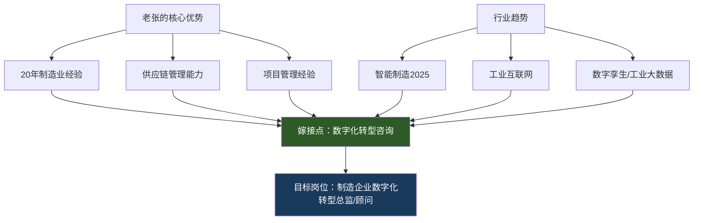
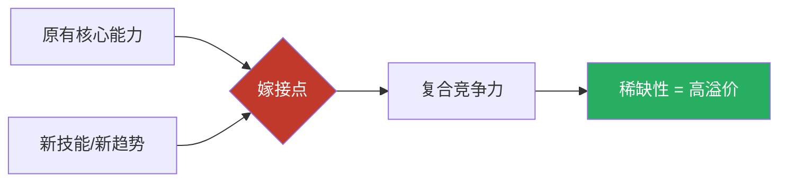

## 案例三：中年转型者的逆袭

> **核心主题**：42岁传统制造业中层如何通过"技能嫁接"实现职业重生和财务跃迁——不从零开始，而是在已有积累上叠加新能力。

中年转型是职场中最艰难的挑战之一。与年轻人相比，中年人背负着房贷、家庭开支、子女教育等刚性支出，试错成本极高；与行业老手相比，学习新技术的速度和精力又处于劣势。老张的案例证明：**中年转型的本质不是"推倒重来"，而是"嫁接升级"**——把二十年行业经验嫁接到新技能上，形成年轻人无法复制的复合竞争力。

### 一、人物画像与初始状态

#### 1.1 基本信息

- **人物**：老张，42岁，北京，传统制造业（汽车零部件）中层管理
- **职位**：生产运营管理经理，带8人团队
- **月薪**：税前2.5万，到手约1.8万
- **家庭**：妻子在私企做财务，收入1万/月；一个孩子上小学三年级
- **资产**：一套自住房（市值400万，贷款余额120万，月供6800元），存款30万（全部在银行活期），一辆开了6年的代步车

#### 1.2 财务全景体检

| 类别 | 项目 | 金额（月） | 占比 |
|------|------|-----------|------|
| **收入** | 老张税后 | 18,000元 | 64% |
| | 妻子税后 | 10,000元 | 36% |
| | **家庭总收入** | **28,000元** | **100%** |
| **固定支出** | 房贷 | 6,800元 | 24% |
| | 学校+补习班 | 3,500元 | 13% |
| | 车贷+油费+停车 | 2,000元 | 7% |
| | 保险（家庭） | 1,200元 | 4% |
| **弹性支出** | 日常生活费 | 4,000元 | 14% |
| | 社交应酬 | 1,500元 | 5% |
| | 购物+娱乐 | 2,000元 | 7% |
| | 其他杂项 | 1,000元 | 4% |
| **合计支出** | | **22,000元** | **79%** |
| **月结余** | | **6,000元** | **21%** |

财务诊断结论：

- **储蓄率仅21%**：低于健康水平（30%+），抗风险能力弱
- **资产配置极度保守**：30万全在活期（年化0.2%），每年贬值约2%（扣除通胀）
- **收入结构单一**：100%依赖工资，没有任何被动收入来源
- **职业风险敞口大**：行业不景气，一旦失业，储蓄仅够维持14个月

#### 1.3 隐性资源盘点

表面上看老张处于困境，但深入分析会发现他有被忽视的隐性资产：

- **行业人脉网络**：20年制造业积累，认识上下游数百人，包括供应商、客户、同行管理者
- **行业认知深度**：对汽车零部件行业的供应链、质量管理、成本结构有深刻理解
- **管理经验**：8人团队管理经验，有项目管理和跨部门协调能力
- **可迁移技能**：流程优化、成本控制、供应商管理——这些在任何行业都有价值
- **时间窗口**：42岁，距离退休还有18年，足够完成一次完整的事业周期

### 二、危机意识觉醒：从"舒适区"到"恐慌区"

#### 2.1 触发事件

老张的转型并非主动选择，而是被现实逼出来的。2021年初，公司宣布产线优化，他所在部门的两个管理岗位要合并为一个。老张虽然保住了位置，但这次经历让他意识到：**在传统制造业，经验不再是护城河，而是即将贬值的资产。**

#### 2.2 心理调适过程

中年转型最大的障碍不是能力，而是心理。老张经历了典型的三个阶段：

**第一阶段：否认（持续约2个月）**
"我在这家公司干了15年，公司不会轻易裁我的。""制造业是实体经济，永远不会消失。"这个阶段的问题是用过去的经验推断未来，忽略了行业正在发生的结构性变化。

**第二阶段：焦虑（持续约3个月）**
开始在网上搜索"中年转型""35岁危机"，越看越焦虑。发现自己的技能树确实单一，简历投出去几乎没有回音。这个阶段虽然痛苦，但焦虑本身是有价值的——它推动了行动。

**第三阶段：行动（从第6个月开始）**
焦虑到极致后反而清醒了："与其等着被淘汰，不如主动出击。"老张开始系统性地规划转型路径。

> **关键认知转变**：老张意识到一个核心问题——他不是"没有能力"，而是"能力没有被正确包装和升级"。二十年的制造业经验不是废物，而是需要嫁接新技术的"砧木"。

### 三、转型策略详解：四步走计划

#### 3.1 第一步：财务急救（第1-3个月）

**目标**：建立财务安全网，为转型期提供缓冲。

**具体操作**：

**（1）全面梳理家庭财务**

老张用了一个周末的时间，和妻子一起做了完整的财务盘点：

- 列出所有资产（房产、存款、车、保险现金价值）
- 列出所有负债（房贷余额、车贷余额、信用卡欠款）
- 统计过去6个月的实际支出（翻银行流水和支付宝账单）
- 计算真实储蓄率和净资产

这一步看似简单，但很多中年家庭从未做过。老张发现，他们每年的实际支出比"感觉"多出约3万——主要是各种零散消费和社交开支。

**（2）建立记账习惯**

使用"随手记"App，设置分类预算。重点不是省吃俭用，而是建立"花钱有意识"的习惯。老张给每个类别设了月度上限：生活费4000、社交1500、购物2000。

**（3）30万存款重新分配**

这是最关键的一步。老张原本的30万全在银行活期（年化0.2%），经过学习和咨询后做了如下分配：

| 资金去向 | 金额 | 用途 | 预期年化收益 |
|---------|------|------|------------|
| 货币基金（紧急备用金） | 5万 | 3个月家庭开支缓冲 | 1.5%-2% |
| 沪深300指数基金 | 10万 | 长期投资，定投方式分批买入 | 8%-10%（长期） |
| 中证500指数基金 | 5万 | 分散投资，覆盖中小盘 | 8%-12%（长期） |
| 学习+创业缓冲资金 | 10万 | 报课、考证、副业启动 | — |

**分配逻辑**：
- 紧急备用金放在货币基金（如余额宝/零钱通），随时可取，覆盖3个月刚性支出
- 指数基金采用"分批建仓"策略，每月定投1万，6-10个月投完，避免一次性买在高点
- 学习资金是"投资自己"，预期回报率远高于任何金融产品

**（4）优化家庭保险配置**

老张请保险经纪人做了一次保单检视，发现两个问题：
- 自己的重疾险保额只有20万，不够覆盖3年家庭开支
- 妻子没有定期寿险

调整方案：老张增加一份30万保额的定期寿险（年缴约1500元），妻子补充一份20万重疾险。总保费增加约4000元/年，但保障覆盖了家庭主要风险。

#### 3.2 第二步：技能升级（第3-12个月）

**目标**：在原有制造业经验基础上，嫁接数字化技能，形成复合竞争力。

**（1）选择嫁接方向**

老张花了两周时间做行业调研，最终锁定了"制造业+数字化"这个交叉领域。选择逻辑如下：



**为什么选择这个方向**：纯粹做数据分析或编程，老张拼不过25岁的年轻人。但"懂制造业的数字化人才"极度稀缺——年轻的IT人才不懂车间现场，老一辈的制造业人不懂数字化。**交叉地带就是最大的机会。**

**（2）学习路径设计**

老张没有盲目报班，而是设计了一个分层学习计划：

| 阶段 | 时间 | 学习内容 | 目标 | 投入 |
|------|------|---------|------|------|
| 基础层 | 第3-6个月 | Python基础 + Pandas数据处理 | 能用代码处理Excel数据 | 每天1.5小时，周末4小时 |
| 应用层 | 第6-9个月 | 数据可视化（Matplotlib/Tableau）+ SQL基础 | 能做数据分析报告 | 每天1小时，周末3小时 |
| 进阶层 | 第9-12个月 | 工业数据分析 + 基础机器学习概念 | 能理解智能制造方案 | 每天1小时，周末2小时 |

**学习资源选择**：
- Python基础：《Python编程：从入门到实践》+ B站免费教程
- 数据分析：《利用Python进行数据分析》+ Kaggle入门数据集练习
- 工业应用：中国大学MOOC上的"智能制造"系列课程（免费）
- 总投入：约5000元（书籍+部分付费课程）

**（3）内部项目实战**

学习到第5个月时，老张在公司主动申请参与了一个"生产数据可视化"项目。这个项目原本是IT部门主导的，但老张凭借对生产流程的深度理解，成为了业务侧的核心对接人。

**关键行动**：
- 主动写了一份《生产运营数字化现状分析报告》，梳理了现有数据系统的痛点
- 用Python+Pandas对过去3年的生产数据做了分析，发现了两个之前没人注意到的效率瓶颈
- 把分析结果做成可视化报告，向VP做了汇报

**结果**：这份报告让老张在公司内部获得了"既懂业务又懂数据"的标签，VP开始把他当作数字化转型的核心骨干培养。

**（4）个人品牌建设**

从第6个月开始，老张在LinkedIn和脉脉上同步更新个人资料，重点突出"制造业+数字化"的复合背景。每周发1-2条行业观察，内容包括：
- 某工厂数字化改造案例分析
- 制造业数据分析的心得体会
- 对行业趋势的思考

这些内容虽然阅读量不大（每条50-200次浏览），但精准触达了制造业和数字化转型的圈层，为后续的人脉拓展打下了基础。

#### 3.3 第三步：副业探索（第6-18个月）

**目标**：将"制造业+数字化"的复合知识变现，建立第二收入来源。

**（1）内容变现路径**

老张选择了"写行业分析文章"作为副业起步，原因有三：
- 写作可以倒逼学习（输出驱动输入）
- 文章是长期资产，一篇好文章可以持续带来流量和机会
- 不需要额外投入金钱，只需要时间

**具体执行**：
- 在知乎开设专栏"老张聊智造"，每周更新1篇
- 文章类型：工厂数字化转型案例分析（40%）、制造业数据分析方法（30%）、行业趋势解读（30%）
- 前3个月几乎没有阅读量（平均每篇50-100次），老张坚持了下来

**转折点**：第4个月，一篇《一个传统工厂的数字化改造实录：从Excel到MES系统》获得了知乎推荐，单篇阅读量突破5万，带来了2000+关注者。这篇文章之所以能爆，是因为老张用的是真实工厂案例，有具体的数字和流程，而不是泛泛而谈的概念。

**（2）咨询业务起步**

文章带来的关注者中，有几位是制造业的老板或高管。他们主动联系老张，询问数字化转型的具体方案。

老张的第一个咨询项目：帮一家年营收5000万的五金工厂做"生产数据基础梳理"，收费8000元，工作量约40小时（利用周末和晚上）。

**定价策略**：老张没有按"小时收费"，而是按"项目成果"收费。这样做的好处是：客户关注的是结果而不是工时，老张可以用自己的行业经验快速交付，实际时薪远高于按小时计费。

**项目执行流程**：
1. 远程了解客户工厂的基本情况（1小时电话）
2. 到工厂现场调研2天（利用年假）
3. 出具《数字化现状评估报告》+《改进方案建议书》
4. 1次远程汇报+答疑

这个项目让老张意识到：**行业经验+数字化能力的组合，市场价值远超预期**。很多中小制造企业知道要做数字化转型，但不知道从哪里开始，更不知道怎么评估方案——而老张恰好能填补这个缺口。

**（3）副业收入增长曲线**

| 时间段 | 副业形式 | 月均收入 | 备注 |
|--------|---------|---------|------|
| 第6-9个月 | 知乎文章（致知计划） | 500-1000元 | 前期积累期 |
| 第10-12个月 | 文章+1个小咨询项目 | 3000-5000元 | 开始有咨询客户 |
| 第13-15个月 | 文章+咨询+企业内训 | 8000-12000元 | 收入稳定增长 |
| 第16-18个月 | 咨询为主+内容为辅 | 10000-15000元 | 形成稳定客户群 |

#### 3.4 第四步：职业转型（第18-36个月）

**目标**：从传统制造企业跳槽到智能制造公司，实现收入跃迁。

**（1）跳槽时机选择**

老张没有在学习完就立刻跳槽，而是等到具备了三个条件：
- 有拿得出手的内部数字化项目成果
- 有知乎专栏和咨询案例作为能力背书
- 有足够的人脉推荐渠道

**（2）猎头与内推并行**

老张的跳槽主要通过两个渠道：
- **内推**（占比70%）：通过行业人脉，认识了两家智能制造公司的高管，内推了3个岗位
- **猎头**（占比30%）：在脉脉上标注"开放机会"后，有猎头主动联系

**关键优势**：老张在面试中最大的竞争力不是Python编程能力（这方面他比不过年轻人），而是**"我能用数字化方法解决制造业的实际问题"**——他能准确描述工厂的痛点，能评估方案的可行性，能推动跨部门协作。这些能力需要10年以上的行业积累，年轻人短期内无法复制。

**（3）最终去向**

老张入职了一家智能制造解决方案公司，担任"行业解决方案总监"：
- **年薪50万**（基本工资40万+绩效奖金10万）
- 工作内容：帮助制造客户规划和实施数字化转型方案
- 团队规模：带12人，比原来更大
- 工作强度：比原来高，但有成就感

**（4）为什么不选择创业**

很多人问老张："你有行业经验、有客户资源、有数字化能力，为什么不自己创业？"

老张的回答很务实：
- 创业需要投入大量资金（至少50万启动），家庭财务刚有起色，承受不起失败
- 制造业解决方案需要完整的技术团队，一个人做不了
- 先在大平台积累资源和案例，未来再考虑独立

这是一个典型的**"先借平台，再建平台"**的策略。很多中年人转型失败，就是因为急于证明自己，跳过了积累阶段。

### 四、三年成果复盘

#### 4.1 财务数据对比

| 指标 | 转型前（2021年初） | 转型后（2023年底） | 变化幅度 |
|------|-------------------|-------------------|---------|
| 家庭年收入 | 约40万（工资33万+配偶12万-税） | 约75万（工资50万+副业15万+配偶12万-税） | +87.5% |
| 年储蓄 | 约10万 | 约25万 | +150% |
| 储蓄率 | 21% | 33% | +12个百分点 |
| 投资资产 | 30万（全活期） | 约80万（指数基金+货基） | +167% |
| 被动收入 | 0 | 约2万/年（基金分红+文章长尾收益） | 从0到有 |
| 副业收入 | 0 | 15万/年 | 从0到有 |
| 职业焦虑 | 极高（担心被裁） | 大幅降低（有选择权） | — |

#### 4.2 投资收益复盘

老张从2021年4月开始定投指数基金，到2023年底（约2年8个月）：

- 累计投入：约20万（每月定投5000-8000元）
- 账户市值：约22万（期间经历了2022年的市场下跌）
- 年化收益率：约4%（跑赢了活期，但低于预期）

**老张的投资感悟**：市场短期波动不可预测，但长期定投确实有效。2022年市场大跌时他一度想停止定投，但最终坚持了下来——因为指数基金定投的核心逻辑就是"下跌时买到更多份额"。到2023年底市场回暖后，前期低位买入的份额带来了不错的收益。

### 五、关键决策点深度分析

中年转型过程中，老张面临了几个关键决策点，每个决策点的选择都直接影响了最终结果。

#### 5.1 决策一：花2万报Python培训班值不值？

**背景**：第3个月，老张纠结要不要花2万报一个"Python数据分析实战班"。

**分析框架**：用投资回报率（ROI）计算

```text
投入成本 = 20,000元 + 约200小时时间成本
预期收益 = 掌握Python后，内部项目参与机会 → 晋升/跳槽筹码
保守估计 = 如果因此涨薪3000元/月，年回报36,000元
ROI = 36,000 / 20,000 = 180%（第一年就回本）
```

**最终决定**：不报班。老张发现B站和书本上的免费/低价资源已经足够入门，2万的培训班主要卖的是"系统化学习路径"和"社群氛围"，而老张的自驱力足够强。最终他花了约3000元买书和少量付费课程，效果一样。

**启示**：学习投资要用ROI思维评估，但也要考虑个人学习风格。自驱力强的人可以省下培训费，需要外部监督的人则值得投入。

#### 5.2 决策二：要不要接受朋友的创业邀请？

**背景**：第14个月，一个前同事邀请老张合伙开一家"制造业数字化咨询公司"，对方出资60万，老张以技术入股占40%。

**分析框架**：SWOT分析

| 维度 | 分析 |
|------|------|
| **优势（S）** | 老张有行业经验和技术能力，合伙人有资金和客户资源 |
| **劣势（W）** | 老张还没有足够的成功案例，品牌影响力不足 |
| **机会（O）** | 制造业数字化转型是大趋势，市场需求旺盛 |
| **威胁（T）** | 咨询公司启动期现金流紧张，家庭需要稳定收入 |

**最终决定**：婉拒。老张的判断是——"我现在的能力和资源，不足以支撑一家公司从0到1。但再积累2-3年，等我有更多成功案例和客户口碑，创业的成功概率会高很多。"

**启示**：创业时机比创业意愿更重要。过早创业不仅可能失败，还会消耗有限的资源和信心。**先在大平台上验证自己的价值，再带着成熟的资源独立**，是更稳健的路径。

#### 5.3 决策三：跳槽时选50万年薪还是40万+期权？

**背景**：第24个月，老张拿到两个offer：
- Offer A：年薪50万，现金为主，公司是成熟的智能制造企业
- Offer B：年薪40万+2%期权，公司是刚完成A轮的工业互联网创业公司

**分析框架**：

| 维度 | Offer A（成熟企业） | Offer B（创业公司） |
|------|-------------------|-------------------|
| 现金收入 | 50万/年 | 40万/年 |
| 期权价值 | 无 | 2%（如果公司上市可能价值数百万，但概率不确定） |
| 工作稳定性 | 高 | 中低（创业公司失败率高） |
| 学习成长空间 | 中 | 高（接触更多前沿技术） |
| 家庭风险 | 低 | 高（如果公司倒闭，40岁+重新找工作） |

**最终决定**：选择Offer A。老张的核心考量是家庭责任——孩子还在上小学，房贷还有100多万，他承受不起"赌一把"的风险。而且成熟企业提供的平台和客户资源，对他的副业发展更有帮助。

**启示**：中年人的职业选择不能只看"天花板"，更要看"地板"。**先确保底线安全，再追求上限突破**。

### 六、中年转型的核心方法论

老张的案例不是个例，而是可以复制的方法论。总结为以下框架：

#### 6.1 "嫁接"思维模型



**嫁接的三个原则**：

1. **保留主干**：不要放弃20年积累的行业经验，这是你的根基
2. **选择新枝**：选择与原有能力互补的新技能，而不是完全无关的领域
3. **找到交叉点**：最值钱的能力往往在两个领域的交叉地带

**常见的成功嫁接组合**：

| 原有背景 | 嫌接技能 | 复合定位 | 市场价值 |
|---------|---------|---------|---------|
| 制造业管理 | 数据分析/Python | 智能制造解决方案顾问 | 50-80万/年 |
| 财务会计 | SQL/BI工具 | 财务数据分析师 | 40-60万/年 |
| 销售管理 | CRM/Marketing自动化 | 数字化营销总监 | 50-100万/年 |
| 教师 | 在线教育/内容创作 | 教育产品设计专家 | 30-60万/年 |
| 医疗临床 | 医疗信息化/数据科学 | 医疗AI产品经理 | 60-120万/年 |

#### 6.2 中年转型的"三不"原则

**不从零开始**：不要选择与过去经验完全无关的领域。42岁去学编程和25岁的人竞争初级开发岗位，毫无胜算。要找到经验的"杠杆点"。

**不急于求成**：中年人的时间紧、压力大，容易急于看到结果。但转型是一个1-3年的过程，需要耐心。老张从开始学习到跳槽成功，用了整整2年。

**不孤军奋战**：中年人的优势之一是人脉。老张的很多机会（内推、咨询客户、合作伙伴）都来自于行业人脉。转型期间要刻意维护和拓展人脉。

#### 6.3 中年转型的时间管理框架

中年人的时间是最稀缺的资源。老张的时间分配策略：

| 时间段 | 用途 | 每周时长 | 备注 |
|--------|------|---------|------|
| 工作日早起（6:00-7:00） | 学习（Python/数据分析） | 5小时 | 大脑最清醒的时段留给学习 |
| 工作日午休（12:30-13:00） | 阅读行业文章 | 2.5小时 | 碎片时间积累行业认知 |
| 工作日晚上（21:00-22:30） | 写文章/做咨询 | 7.5小时 | 孩子睡后的时间 |
| 周末上午（8:00-12:00） | 深度学习/项目实战 | 8小时 | 大块时间做需要专注的事 |
| **每周总投入** | | **约23小时** | |

**关键原则**：不影响家庭时间和本职工作。老张和妻子约定了"周末下午和晚上是家庭时间"，这个底线从未突破。

### 七、常见误区与避坑指南

#### 误区一：中年转型必须学编程

**真相**：编程只是工具之一，不是必选项。很多成功的中年转型并没有学编程——有人转型做项目管理（PMP认证），有人转型做行业咨询（靠经验和人脉），有人转型做内容创作（靠行业认知输出）。

**正确做法**：先评估自己的核心优势和市场需求的交叉点，再决定需要学习什么新技能。编程适合逻辑思维强、喜欢和数据打交道的人；不适合所有人。

#### 误区二：转型期间要大幅压缩开支

**真相**：过度节俭会消耗心理能量，反而影响转型效率。老张的做法是"有意识地花钱"，而不是"不花钱"。他把每月开支从2.2万优化到2万（减少了不必要的社交开支和冲动消费），但没有影响生活品质。

**正确做法**：砍掉"无意识消费"（不知道花在哪里的钱），保留"有价值消费"（提升能力、维护关系、保持健康的开支）。

#### 误区三：副业会影响主业

**真相**：合理的副业不仅不会影响主业，反而会增强主业竞争力。老张的副业（写文章、做咨询）让他对行业趋势有了更深的理解，这些理解反过来帮助他在公司内部做出了更好的决策。

**正确做法**：副业要与主业形成正向循环，而不是完全割裂的两个方向。如果副业需要占用大量主业时间和精力，说明方向选错了。

#### 误区四：年龄是最大的障碍

**真相**：年龄带来的经验、人脉、行业认知，是年轻人无法在短期内获得的。真正的障碍不是年龄，而是"思维固化"——不愿意学习新东西，不愿意走出舒适区。

**正确做法**：把年龄当作优势而非劣势。42岁的人有20年的行业经验，这是最大的资产。关键是把这笔资产"数字化"——用新的技术手段重新包装和放大。

#### 误区五：一次转型就要到位

**真相**：大多数成功的中年转型都不是一步到位的，而是经历了2-3次迭代。老张的第一步是"内部数字化项目"，第二步是"副业咨询"，第三步才是"跳槽到智能制造公司"。每一步都在验证方向、积累资源。

**正确做法**：把转型看作一个渐进的过程，每3-6个月做一次复盘和调整。不要追求"一步到位"的完美方案，而要追求"持续迭代"的进步节奏。

### 八、给中年转型者的行动清单

如果你正处于中年转型的考虑阶段，以下是按优先级排序的行动清单：

**本周就可以做的（成本为零）**：
1. 花一个周末做家庭财务全景盘点（资产、负债、收入、支出）
2. 评估自己的核心能力——你在什么方面比80%的人强？
3. 调研你所在行业的数字化/新趋势方向
4. 更新LinkedIn和脉脉个人资料

**本月可以做的（低成本）**：
1. 确定"嫁接方向"——你的经验+什么新技能=稀缺复合人才？
2. 找3-5个同行业已完成转型的人，约一次咖啡聊聊
3. 开始学习一门新技能（先从免费资源开始）
4. 在公司内部主动申请一个与新方向相关的项目

**本季度可以做的（适度投入）**：
1. 制定详细的3个月、6个月、12个月学习计划
2. 开始在专业平台上写行业文章（知乎/公众号/LinkedIn）
3. 建立每月复盘机制，追踪进展
4. 考虑是否需要系统化培训（用ROI思维评估）

### 九、延伸思考：中年转型的社会背景

老张的故事不是孤例。根据智联招聘2023年的数据，35-45岁职场人中，有67%表示"有转型意愿"，但只有12%真正采取了行动。差距如此大的核心原因是：

1. **信息不对称**：很多人不知道"制造业+数字化"这类交叉岗位的存在
2. **路径不清晰**：不知道从哪里开始，学什么，怎么验证方向
3. **风险厌恶**：家庭负担重，不敢轻易尝试
4. **心理障碍**：觉得自己"年纪大了学不动"

老张的案例证明，这些障碍都是可以克服的。关键在于：**把大目标拆解成小步骤，每一步都有明确的产出和验证点**。

中年转型的本质不是"推倒重来"，而是"升级迭代"。你不需要变成一个全新的人，你需要的是在已有的基础上叠加新的能力层，形成别人无法复制的竞争优势。

***

> **本案例核心要点**：
> 1. 中年转型的核心策略是"技能嫁接"——在原有经验上叠加新能力，而非从零开始
> 2. 财务安全网是转型的基石——先建立6个月紧急备用金和合理的投资配置
> 3. "行业经验+数字化能力"是当前最有价值的复合技能组合之一
> 4. 副业是转型的"试金石"——先用副业验证方向，再决定是否全职转型
> 5. 人脉是中年人最大的隐性资产——主动维护和拓展行业人脉
> 6. 转型周期通常为1-3年，需要耐心和持续投入
