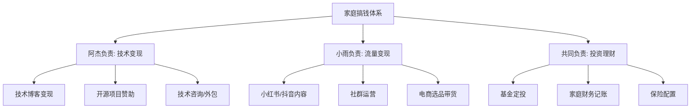

## 案例四：夫妻档的协同搞钱

单打独斗的搞钱方式固然有效，但当两个人形成合力时，产生的效果远不是简单的 1+1=2。夫妻档搞钱的核心优势在于：资源共享、能力互补、风险对冲、以及最重要的——共同目标带来的强大执行力。本案例展示了一对普通夫妻如何通过系统性的协同策略，在五年内将家庭年收入从 25 万提升到 80 万，并建立起多元化的收入结构。

### 基本信息

- **人物**：阿杰（丈夫）& 小雨（妻子），均为 30 岁，成都
- **阿杰**：某科技公司后端开发工程师，月薪税前 1.8 万，到手约 1.4 万
- **小雨**：某电商公司运营专员，月薪税前 8000 元，到手约 6500 元
- **家庭月收入**：到手合计约 2.05 万
- **资产**：一套自住房（市值 150 万，贷款余额 90 万），存款 8 万
- **负债**：房贷月供 5200 元
- **目标**：5 年内家庭年收入突破 80 万，建立被动收入体系

### 夫妻协同搞钱的理论基础

在进入具体案例之前，需要理解为什么夫妻档搞钱比单人更有优势：

**协同效应的三个层次**

| 层次 | 单人模式 | 夫妻协同模式 | 效果倍数 |
|------|----------|------------|---------|
| 资金层 | 单份收入起步 | 双份收入+统一规划 | 2-3x |
| 能力层 | 个人技能局限 | 互补技能组合 | 3-5x |
| 心理层 | 孤独感、易放弃 | 互相支持、共同承担 | 不可量化但极大 |

**核心公式：** 家庭财富增长 = （主收入 + 副收入 + 投资收益）× 协同系数 - 生活成本

其中"协同系数"是夫妻档独有的——当两个人目标一致、分工明确时，这个系数可以达到 1.5-2.0，意味着同样的投入可以多产出 50%-100% 的价值。

### 第一步：家庭财务全面诊断（第 1 个月）

任何搞钱行动的第一步都是搞清楚"现在在哪里"。阿杰和小雨在第一个周末花了一整个下午做了一次彻底的家庭财务体检。

**资产负债表**

| 资产项目 | 金额（万元） | 负债项目 | 金额（万元） |
|---------|------------|---------|------------|
| 房产市值 | 150 | 房贷余额 | 90 |
| 银行存款 | 8 | 信用卡 | 0.3 |
| 公积金余额 | 3.5 | 亲友借款 | 0 |
| 车辆残值 | 5 | | |
| **资产合计** | **166.5** | **负债合计** | **90.3** |
| | | **净资产** | **76.2** |

**月度现金流表**

| 收入项目 | 金额（元） | 支出项目 | 金额（元） |
|---------|-----------|---------|-----------|
| 阿杰工资 | 14,000 | 房贷 | 5,200 |
| 小雨工资 | 6,500 | 生活费 | 3,500 |
| | | 交通+通讯 | 1,200 |
| | | 社交+娱乐 | 1,500 |
| | | 购物+其他 | 2,000 |
| **月收入合计** | **20,500** | **月支出合计** | **13,400** |
| | | **月结余** | **7,100** |
| | | **储蓄率** | **34.6%** |

**诊断结论：**
- 储蓄率 34.6%，处于"及格线"以上，但距离 FIRE 目标（50%+）有明显差距
- 收入结构单一，100% 依赖工资，抗风险能力弱
- 房贷占收入比 25.4%，在合理范围内
- 存款 8 万仅够覆盖 6 个月支出，紧急备用金勉强达标
- 没有任何投资资产，资金全部在银行活期

### 第二步：确立协同分工体系（第 1-2 个月）

这是夫妻档搞钱最关键的一步——明确分工。很多夫妻在搞钱过程中产生矛盾，根源就是分工不清、权责不明。

**能力盘点**

| 维度 | 阿杰 | 小雨 |
|------|------|------|
| 专业技能 | 后端开发（Python/Go/Java） | 电商运营、内容营销 |
| 副业潜力 | 技术博客、开源项目、接外包 | 自媒体、社群运营、选品 |
| 性格特点 | 内向、深度思考型 | 外向、善于社交 |
| 风险偏好 | 中等 | 偏保守 |
| 时间余量 | 工作日晚上 2h + 周末 | 工作日晚上 1.5h + 周末 |
| 学习能力 | 强（技术方向） | 强（商业方向） |

**协同分工方案**

**核心原则：** 各自发挥长板，不做对方擅长的事。阿杰不擅长社交，就不要去拍短视频；小雨不懂代码，就不要去学编程搞副业。把时间花在边际收益最高的事情上。

### 第三步：执行阶段——从 0 到 1（第 2-12 个月）

#### 阿杰的技术变现路径

**第 2-3 个月：建立技术博客**

- 选择平台：掘金 + 知乎 + 个人博客（Hugo 搭建）
- 内容方向：Go 语言实战、微服务架构、数据库优化
- 更新频率：每周 2 篇深度技术文章
- 小雨的配合：帮阿杰做文章排版、配图、发布到多个平台

阿杰每天晚上 9 点到 11 点写作，小雨负责将文章从个人博客同步到掘金和知乎，并优化标题和封面图。这种"内容生产 + 内容分发"的分工让阿杰专注于技术本身，不用操心流量问题。

**第 4-6 个月：技术影响力积累**

- 掘金粉丝从 0 涨到 5000+
- 知乎关注者达到 3000+
- 开始收到技术约稿邀请，稿费 500-1000 元/篇
- 在 GitHub 上开源了一个 Go 语言工具库，获得 200+ Star

**第 7-12 个月：技术变现启动**

- 接技术咨询项目：每月 1-2 个，单价 3000-8000 元
- 技术约稿稳定：每月 2-3 篇，收入 1500-3000 元
- 掘金年度作者评选入围，获得平台流量扶持
- **阿杰副业月均收入：约 6000-10000 元**

#### 小雨的流量变现路径

**第 2-4 个月：小红书账号冷启动**

- 赛道选择：职场穿搭 + 好物推荐（结合电商运营经验）
- 内容形式：图文为主，偶尔短视频
- 更新频率：每天 1 条笔记
- 阿杰的配合：帮小雨做数据表格（Excel/Python 自动化），分析笔记数据

**第 5-8 个月：粉丝增长期**

- 小红书粉丝突破 1 万
- 开始接到品牌合作邀约
- 建立"成都生活好物"微信社群，200+ 人
- 学习直播带货技巧，每周直播 2 次

**第 9-12 个月：变现加速**

- 小红书粉丝达到 3 万，品牌合作月均收入 3000-5000 元
- 社群团购佣金月均 2000-3000 元
- 直播带货佣金月均 1500-2500 元
- **小雨副业月均收入：约 6500-10500 元**

#### 共同投资理财

**第 3 个月开始：基金定投**

- 选择 3 只基金：沪深 300 指数基金（40%）、中证 500 指数基金（30%）、债券基金（30%）
- 每月定投金额：5000 元（从两人工资中划出）
- 定投日：每月发工资后第 2 天自动扣款

**第 6 个月：保险配置**

| 保险类型 | 阿杰 | 小雨 | 年保费合计 |
|---------|------|------|-----------|
| 重疾险 | 50 万保额 | 50 万保额 | 8,400 元 |
| 定期寿险 | 100 万保额 | 80 万保额 | 3,600 元 |
| 医疗险 | 百万医疗 | 百万医疗 | 1,200 元 |
| 意外险 | 100 万保额 | 100 万保额 | 600 元 |
| **合计** | | | **13,800 元/年** |

### 第四步：优化升级——从 1 到 N（第 13-36 个月）

#### 收入结构升级

经过第一年的摸索，阿杰和小雨都找到了各自的"甜蜜点"——边际收益最高的变现方式。

**阿杰的升级路径：从写文章到做课程**

- 第 13 个月：将技术博客内容体系化，开始录制"Go 语言从入门到实战"视频课程
- 第 16 个月：课程在极客时间上线，定价 199 元，首月销售 300+ 份
- 第 18 个月：开设第二门课程"微服务架构设计实战"，定价 299 元
- 第 24 个月：两门课程累计销售 2000+ 份，被动收入月均 8000-12000 元
- 技术咨询升级为"按月付费"模式，服务 3 个长期客户，月均 15000 元

**小雨的升级路径：从做内容到建品牌**

- 第 13 个月：注册个人商标，打造"小雨精选"品牌
- 第 15 个月：与 3 个供应链建立稳定合作，开始自有选品
- 第 18 个月：小红书粉丝突破 10 万，成为腰部 KOL
- 第 20 个月：开设淘宝 C 店，将社群和小红书流量导入
- 第 24 个月：电商店铺月 GMV 突破 10 万，净利润月均 1.5-2 万

#### 协同效应的具体体现

夫妻档搞钱在这个阶段展现出真正的协同价值：

**1. 流量互导**

小雨的小红书账号为阿杰的课程带来了大量精准流量。小雨在推荐"提升职场技能"好物时，自然地推荐阿杰的 Go 语言课程；阿杰在技术文章末尾推荐小雨的"程序员穿搭指南"。这种互导不需要额外成本，却带来了 20%-30% 的增量用户。

**2. 成本分摊**

| 共享资源 | 单人成本 | 夫妻共享成本 | 节省比例 |
|---------|---------|------------|---------|
| 视频录制设备 | 8,000 元 | 8,000 元（共用） | 50% |
| 云服务器 | 200 元/月 | 200 元/月（共用） | 50% |
| 办公空间 | 1,500 元/月 | 1,500 元/月（书房共用） | 50% |
| 设计工具订阅 | 100 元/月 | 100 元/月（共用） | 50% |
| **年节省** | | | **约 1.5 万元** |

**3. 风险对冲**

当阿杰的技术咨询在某个季度收入下降时（客户项目结束），小雨的电商收入通常在同季度上升（换季销售旺季）。两人的收入波动周期不同步，反而形成了天然的对冲效果。

**4. 决策支持**

每个周日晚上，阿杰和小雨会花 1 小时做"家庭搞钱复盘"：
- 回顾本周各自副业的关键数据
- 讨论遇到的问题和下一步计划
- 对齐下个月的重点目标
- 检查家庭财务状况

这个习惯看似简单，却是夫妻档搞钱最重要的"操作系统"。很多副业失败不是因为方向错了，而是因为缺乏定期复盘和调整。

### 第五步：被动收入体系成型（第 37-60 个月）

#### 阿杰的被动收入矩阵

| 收入来源 | 月均收入 | 投入时间 | 性质 |
|---------|---------|---------|------|
| 在线课程（3 门） | 15,000-20,000 元 | 录制后几乎不需维护 | 纯被动 |
| 技术书籍版税 | 3,000-5,000 元 | 写完后几乎不需维护 | 纯被动 |
| 技术咨询（2 个长期客户） | 20,000 元 | 每周 8-10 小时 | 半被动 |
| 开源项目赞助 | 1,000-2,000 元 | 偶尔维护 | 纯被动 |
| **合计** | **39,000-47,000 元** | | |

#### 小雨的被动收入矩阵

| 收入来源 | 月均收入 | 投入时间 | 性质 |
|---------|---------|---------|------|
| 电商店铺（成熟运营） | 20,000-30,000 元 | 每天 2 小时管理 | 半被动 |
| 小红书品牌合作 | 10,000-15,000 元 | 每周 3 条内容 | 主动 |
| 社群团购佣金 | 5,000-8,000 元 | 团长自行运营 | 纯被动 |
| 选品佣金（分销） | 3,000-5,000 元 | 设置后自动运行 | 纯被动 |
| **合计** | **38,000-58,000 元** | | |

#### 投资理财成果

五年定投累计投入 30 万元，按照年化 8% 的保守估算，投资账户市值约 36 万。加上期间追加的投资（副业收入的一部分），投资资产总额达到约 60 万，年投资收益约 4.8 万。

### 五年成果对比

| 指标 | 起步时 | 第 1 年末 | 第 3 年末 | 第 5 年末 |
|------|--------|---------|---------|---------|
| 家庭月收入（到手） | 20,500 元 | 33,000 元 | 52,000 元 | 80,000 元 |
| 副业月收入 | 0 元 | 12,500 元 | 30,000 元 | 55,000 元 |
| 被动收入占比 | 0% | 5% | 25% | 45% |
| 储蓄率 | 34.6% | 48% | 58% | 65% |
| 投资资产 | 0 元 | 6 万 | 25 万 | 60 万 |
| 净资产 | 76.2 万 | 95 万 | 155 万 | 280 万 |

### 关键决策点与复盘

**决策 1：是否辞掉主业全职搞副业（第 18 个月）**

当时阿杰的副业月收入已经接近主业工资（1.4 万 vs 1.2 万），他萌生了辞职全职做副业的想法。两人深入讨论后决定不辞：
- 副业收入尚不稳定，波动幅度大
- 主业提供的社保、公积金是隐性收入（约 4000 元/月）
- 主业积累的人脉和行业认知对副业有持续价值
- 保留主业相当于"保底收入"，降低心理压力

最终决定：主业保持正常表现（不卷也不摆烂），将省下的精力投入到副业中。

**决策 2：是否扩大电商规模（第 24 个月）**

小雨的淘宝店铺月 GMV 突破 10 万后，考虑是否招人扩大规模。两人计算后发现：
- 招一个运营助理月薪 5000 元
- 需要增加库存，资金占用约 5-10 万
- 管理成本和时间成本会显著增加
- 利润率可能从 15% 下降到 10%

最终决定：不盲目扩张，保持"小而美"的模式。用省下的时间和精力开发更高利润率的产品线。

**决策 3：家庭财务的"共同账户"模式**

两人采用"三账户"体系：
- **共同账户**（两人各转入收入的 70%）：房贷、生活费、投资、保险
- **阿杰个人账户**（收入的 30%）：个人发展、技术工具、社交
- **小雨个人账户**（收入的 30%）：个人发展、美容、社交

这种模式既保证了家庭财务的统一管理，又保留了各自的财务自主权，避免了"花钱要报账"的尴尬。

### 夫妻协同搞钱的五大原则

通过五年的实践，阿杰和小雨总结出夫妻档搞钱的核心原则：

**原则一：目标对齐，而非目标相同**

两个人不需要做同样的事情，但必须朝着同一个方向努力。阿杰做技术、小雨做电商，赛道完全不同，但目标一致——5 年内家庭年收入 80 万。

**原则二：尊重专业，互不干涉**

阿杰不评价小雨的选品品味，小雨不干涉阿杰的技术架构选择。在各自的领域内，对方拥有完全的决策权。只有涉及家庭共同资源（时间、资金、空间）的决策才需要共同讨论。

**原则三：透明沟通，定期复盘**

- 每日晚餐时简单同步当日进展（5 分钟）
- 每周日晚上做详细的周复盘（1 小时）
- 每月底做家庭财务报表审查（2 小时）
- 每季度做战略调整讨论（半天）

**原则四：风险共担，收益共享**

副业收入不区分"这是你赚的"还是"那是我赚的"，统一进入家庭共同账户。这样避免了收入不对等带来的心理失衡，也让双方都有动力支持对方的事业发展。

**原则五：保护关系，搞钱第二**

当搞钱影响到夫妻关系时，果断调整。小雨曾在第 14 个月因为直播带货压力大而情绪低落，阿杰主动帮她分担了选品和客服工作，让她休息了两周。搞钱的终极目的是更好的生活，如果关系出了问题，赚再多钱也没有意义。

### 常见误区与应对

| 误区 | 问题描述 | 正确做法 |
|------|---------|---------|
| 一人主导，一人旁观 | 只有一个人在搞副业，另一个不参与 | 即使不做副业，也要参与家庭财务规划和决策 |
| 攀比心态 | 收入低的一方感到自卑或压力 | 用"家庭总收入"衡量成功，不比较个人贡献 |
| 时间冲突 | 两人都忙于副业，没有相处时间 | 设定"无工作日"（如周六），专门用于家庭生活 |
| 决策分歧 | 对投资方向或副业选择意见不同 | 用数据说话，设定"试验期"（如 3 个月），用结果验证 |
| 忽视主业 | 副业收入超过主业后轻视本职工作 | 主业是"保底收入"和"行业认知"的来源，不可放弃 |

### 可复用的工具清单

| 工具类别 | 推荐工具 | 用途 |
|---------|---------|------|
| 记账 | 随手记 / MoneyWiz | 家庭收支记录 |
| 协作 | 飞书 / Notion | 任务管理、文档协作 |
| 数据分析 | Excel / Python | 副业数据追踪 |
| 内容创作 | Canva / 剪映 | 图文、视频制作 |
| 电商管理 | 千牛 / 店小蜜 | 淘宝店铺运营 |
| 投资定投 | 蛋卷基金 / 且慢 | 自动定投管理 |
| 社群运营 | 企业微信 / 微信群 | 社群管理和团购 |

### 对不同阶段夫妻的建议

**新婚夫妻（收入 1-2 万/月）：** 优先建立共同的财务习惯——一起记账、一起做月度预算、一起学习投资知识。副业可以先从一个人开始试水，另一个人做好后勤支持。

**有娃家庭（收入 2-4 万/月）：** 时间更加稀缺，优先选择"边际成本递减"的副业——写课程、做内容、建社群。避免选择需要大量实时在线的副业（如直播、客服）。

**中年夫妻（收入 3-6 万/月）：** 重点是优化已有资产结构，而不是盲目开新副业。将存量资产（存款、房产、技能）转化为持续现金流。同时做好子女教育金和养老金的规划。

***

