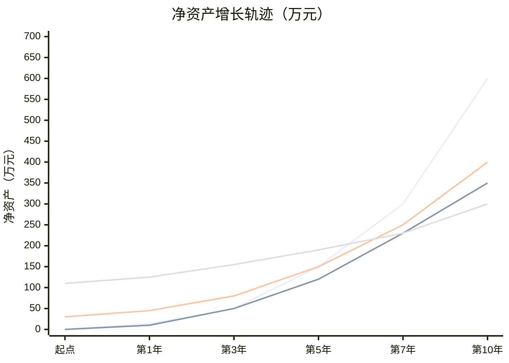

## 案例对比总结

前文展示了四个不同人生阶段、不同背景的真实财务规划案例。本节将这些案例放在一起进行系统化对比分析，从中提炼出可复制的规律和可量化的决策框架，帮助你找到最适合自身情况的搞钱路径。

### 四大案例全景对比

#### 案例画像一览

| 维度 | 案例一：小李 | 案例二：小王 | 案例三：老张 | 案例四：老王夫妇 |
|------|------------|------------|------------|----------------|
| **年龄** | 28岁 | 26岁 | 42岁 | 55/52岁 |
| **城市** | 杭州 | 成都 | 北京 | 二线城市 |
| **职业** | 互联网产品经理 | 自由撰稿人 | 制造业中层管理 | 国企+事业单位 |
| **月收入** | 2.2万（到手） | 1.2万（不稳定） | 1.8万+1万（家庭） | 1.5万+1万 |
| **月支出** | 1.1万 | 2000元 | 约2.3万 | 1.2万 |
| **储蓄率** | 50% | 83% | 约20% | 约55% |
| **初始资产** | 接近零 | 接近零 | 30万存款+房产 | 110万+房产 |
| **财务自由目标** | 20万/年 | 8万/年 | 未明确 | 维持现有生活水平 |
| **目标门槛（4%法则）** | 500万 | 200万 | — | 约300万 |
| **达成时间** | 约10年（38岁） | 约7年（33岁） | 约15年（57岁） | 已基本达成 |
| **核心策略** | 高收入+投资复利 | 极低支出+技能升级 | 职业转型+副业 | 资产配置+保障 |

#### 财务路径对比图


### 六维深度对比分析

#### 维度一：收入结构

不同案例的收入结构差异巨大，直接决定了搞钱的天花板和抗风险能力。

| 案例 | 主业收入占比 | 副业收入占比 | 投资收入占比 | 收入稳定性 | 增长潜力 |
|------|------------|------------|------------|----------|---------|
| 小李 | 70% | 15% | 15% | 高（大厂） | 高 |
| 小王 | 0% | 85% | 15% | 低（自由职业） | 中高 |
| 老张 | 65% | 20% | 15% | 中（转型期） | 中 |
| 老王 | 80% | 0% | 20% | 极高（体制内） | 低 |

**关键发现：**

- **小李**的收入结构最健康——主业提供稳定现金流，副业和投资逐步增长。到第5年，三条收入线并行，任何一条中断都不会造成灾难性后果。这是典型的"三角凳"收入模型，三条腿互相支撑。
- **小王**高度依赖副业收入，这是自由职业者的通病。她的解决方案是把同一技能（写作）在不同平台上变现：公众号、培训课程、出版书籍。这不是"做三份副业"，而是"一份技能的三层变现"。
- **老张**在转型期的收入结构最脆弱——主业面临不确定性，副业刚起步。但他选择了一个关键策略：用主业养副业，在没有辞职风险的前提下试错。这比"裸辞创业"安全得多。
- **老王夫妇**的收入几乎完全依赖工资和社保，投资收入占比低。对于即将退休的家庭来说，需要在退休前把投资收入占比提上去。

**收入多元化的四个层级：**

```text
Level 1：单一工资收入（风险极高）
Level 2：工资 + 投资收入（基础分散）
Level 3：工资 + 副业 + 投资（三角凳模型）
Level 4：被动收入 > 生活支出（财务自由）
```

小李在5年内从Level 1推进到Level 3；小王用9年从Level 1跳到Level 4；老张在3年内从Level 1推进到Level 3。不同起点、不同速度，但方向一致。

#### 维度二：支出管理

支出管理是四个案例中差异最大的维度，也是决定财务自由门槛高低的核心变量。

| 案例 | 月支出 | 年支出 | 支出策略 | 财务自由门槛 | 达成难度 |
|------|-------|-------|---------|------------|---------|
| 小李 | 1.1万 | 13.2万 | 适度消费，不刻意压缩 | 500万 | ★★★★ |
| 小王 | 2000元 | 2.4万 | 极简主义，主动降维 | 200万 | ★★ |
| 老张 | 2.3万 | 27.6万 | 家庭刚需为主 | 690万 | ★★★★★ |
| 老王 | 1.2万 | 14.4万 | 退休适配 | 360万 | ★★★ |

**支出管理的三个层次：**

**第一层：记账（知道钱花在哪了）。** 小李第1年的核心动作就是建立记账习惯。很多人觉得记账没用，其实记账的目的不是省钱，而是建立"金钱意识"——你知道每一笔钱的去向，才能做出理性决策。推荐使用随手记、MoneyWiz等工具，关键是要坚持至少3个月，才能看到消费模式。

**第二层：优化结构（把钱花在刀刃上）。** 小王的月支出2000元听起来很极端，但仔细看她的支出结构：住房800元（合租）、饮食600元（自己做饭）、其他600元。她并没有降低生活品质——合租不代表住得差，自己做饭反而吃得更健康。关键在于区分"必要支出"和"惯性支出"。

**第三层：战略性降维（重新定义生活标准）。** 这是小王的核心策略。她选择成都而不是北上广深，不是因为"混不下去"，而是主动选择生活成本更低的城市。同样的技能和收入水平，在成都的财务自由门槛只有北京的一半。这不是"退而求其次"，而是"换一个坐标系"。

**支出压缩的边际效应：**

| 每月节省金额 | 年节省 | 10年累计（含投资收益8%） | 等效工作时间（月薪2万） |
|-------------|-------|----------------------|---------------------|
| 500元 | 6000元 | 8.7万 | 4.3个月 |
| 1000元 | 1.2万 | 17.4万 | 8.7个月 |
| 2000元 | 2.4万 | 34.8万 | 1.4年 |
| 5000元 | 6万 | 87万 | 3.6年 |
| 10000元 | 12万 | 174万 | 7.3年 |

每月节省2000元，10年后的复利效果相当于多工作1.4年。这就是为什么小王能在7年内实现财务自由——她的低支出策略，让每一个赚到的钱都发挥了最大效用。

#### 维度三：技能策略

四个案例中的技能策略可以归纳为三种模型：

**模型A：纵深深耕型（小李、小王）**

小李在产品经理这条线上持续深耕：从普通产品到高级产品，从执行到战略。他的副业（知乎写作、商业咨询）也是围绕产品能力展开。这意味着他的主业和副业共享同一套核心技能，投入一份学习时间，产出双倍回报。

小王的写作技能同样如此。从写稿赚稿费，到开写作培训课，再到出书——技能内核不变，变现方式升级。这种策略的优势是：技能越深，壁垒越高，竞争对手越少。

**模型B：嫁接复合型（老张）**

老张的策略最值得中年人借鉴。他不是从零开始学编程，而是把"制造业经验"+"数字化知识"组合成稀缺能力。市场上懂技术的人很多，懂制造业的人也不少，但既懂制造业又懂数字化的人极其稀缺。

这种"嫁接"策略的数学逻辑：

```text
单一技能价值 = 基础价值 × 竞争者数量的倒数
复合技能价值 = 技能A价值 × 技能B价值 × 稀缺性系数
```

一个30分的Python技能，加上一个80分的制造业经验，可能比一个80分的Python技能更有市场价值——因为后者有100万人竞争，前者只有1000人。

**模型C：守成优化型（老王夫妇）**

老王夫妇不需要学习新技能，但他们需要学习资产配置和风险管理的技能。从"存银行"到"股债搭配+年金险"，这是一个认知升级的过程。很多即将退休的人卡在这一步——他们有资产，但不会管理。

| 案例 | 技能策略 | 学习投入 | 技能壁垒 | 可迁移性 |
|------|---------|---------|---------|---------|
| 小李 | 纵深深耕（产品） | 中等 | 高 | 中（互联网行业） |
| 小王 | 纵深深耕（写作） | 低 | 中高 | 高（跨行业） |
| 老张 | 嫁接复合（制造+数字） | 高 | 极高 | 中（制造业+） |
| 老王 | 守成优化（投资管理） | 低 | 低 | 高（通用） |

#### 维度四：风险承受与应对

搞钱路上，风险管理往往被忽视，但它决定了你能否"活到"财务自由的那一天。

| 风险类型 | 小李 | 小王 | 老张 | 老王 |
|---------|------|------|------|------|
| **失业风险** | 中（互联网裁员） | 无（自由职业） | 高（行业衰退） | 低（体制内） |
| **收入波动风险** | 低 | 高 | 中 | 极低 |
| **健康风险** | 低（年轻） | 低（年轻） | 中 | 高（年龄） |
| **投资风险** | 中 | 低 | 中 | 中高 |
| **家庭风险** | 低（单身） | 低（单身） | 高（房贷+子女） | 中 |
| **通胀风险** | 低（时间长） | 低 | 中 | 高（退休后） |

**各案例的风险应对策略：**

**小李**的主要风险是互联网行业裁员。他的应对方案是：①保持高储蓄率（50%），即使失业也能撑很久；②副业收入作为缓冲垫；③投资组合分散化（股票+债券+个股）。三重保障让他在面对裁员时不至于恐慌性决策。

**小王**的主要风险是收入不稳定。她的应对方案是：①极低的固定支出（月2000元），即使收入归零也能用存款撑很久；②6个月紧急备用金；③技能多方向变现（写作+培训+出书），一个渠道出问题不影响整体。

**老张**面临的最大风险是"转型失败"——如果新技能学不会、新工作找不到怎么办？他的应对方案是：①在职转型，不裸辞；②用10万"学习资金"控制试错成本；③先在公司内部试水数字化项目，验证市场价值后再跳槽。

**老王夫妇**的最大风险是长寿+通胀。如果活到90岁，需要35年的养老金。应对方案：①年金险锁定终身现金流；②债券基金提供稳定收益；③20万应急基金应对大病。

**风险管理的通用原则：**

1. **紧急备用金永远是第一位的**。无论收入高低，至少保留3-6个月的生活费作为流动性储备。小李有4万，小王有6个月支出，老张有5万，老王有20万——金额不同，但比例一致。
2. **保险是底线保障**。重疾险、医疗险、意外险是搞钱路上的安全网。没有保险的搞钱就像没有安全带的赛车——速度越快，风险越大。
3. **分散化是投资的唯一免费午餐**。不要把所有钱放在一个篮子里，也不要把所有收入来源押在一个渠道上。

#### 维度五：时间杠杆与复利效应

时间是搞钱最大的杠杆。同样的策略，越早开始，复利效应越显著。

**各案例的复利增长曲线：**



**关键观察：**

- **小李的曲线最陡**。高储蓄率+高收入+时间复利，三者叠加产生了指数级增长。前3年增长缓慢（积累期），第5年后开始加速（复利启动期）。
- **小王的曲线平稳上升**。极低支出意味着高储蓄率，但收入基数低限制了绝对增长速度。不过她的财务自由门槛也最低（200万），所以反而比小李更早达成。
- **老张的曲线有一个明显的拐点**。前3年增长缓慢（转型期），第3年后跳槽成功，收入大幅提升，曲线开始变陡。这说明中年转型的回报是"延迟兑现"的。
- **老王的曲线最平缓**。这是因为他们的目标不是"增长"而是"保值+稳定现金流"。对于退休规划来说，平稳本身就是成功。

**复利的数学真相：**

假设年化收益8%，每月投入X元：

| 每月投入 | 5年后 | 10年后 | 15年后 | 20年后 |
|---------|-------|-------|-------|-------|
| 1000元 | 7.3万 | 18.3万 | 34.6万 | 59.3万 |
| 3000元 | 22万 | 54.9万 | 103.8万 | 177.9万 |
| 5000元 | 36.7万 | 91.5万 | 173万 | 296.5万 |
| 10000元 | 73.4万 | 183万 | 346万 | 593万 |

小李每月投入约1.1万（储蓄率50%），10年后投资资产接近500万，完全符合上表的预测。复利不骗人，但前提是你给它足够的时间和足够的本金。

#### 维度六：心态与可持续性

搞钱是一场马拉松，不是百米冲刺。能否持续执行，取决于心态管理。

| 案例 | 核心动力 | 潜在心理风险 | 可持续性评估 |
|------|---------|------------|------------|
| 小李 | 自由感+成就感 | 工作倦怠、消费主义诱惑 | ★★★★ |
| 小王 | 生活方式自由 | 孤独感、收入焦虑 | ★★★ |
| 老张 | 家庭责任感+恐惧感 | 转型焦虑、自我怀疑 | ★★★★ |
| 老王 | 安全感+确定性 | 对子女过度支持 | ★★★★★ |

**心态管理的四个关键点：**

**第一，找到"为什么搞钱"的深层动机。** 小李想要的是"选择的自由"——不想因为钱而被迫做不喜欢的工作。小王想要的是"时间的自由"——不想被朝九晚五束缚。老张想要的是"安全感"——不想在45岁被裁员后束手无策。老王想要的是"确定性"——不想在退休后生活质量大幅下降。

动机越深层，执行力越持久。"想赚更多钱"是表层动机，容易在遇到困难时动摇；"想拥有选择的自由"是深层动机，能在低谷时支撑你继续前行。

**第二，设置里程碑和奖励机制。** 长期目标太远，容易失去动力。把大目标拆成小里程碑：第一个10万、第一个50万、第一个100万。每达成一个里程碑，给自己一个小奖励（注意：奖励不要破坏储蓄计划）。小李在第5年买了一辆15万的车而不是30万的车——既奖励了自己，又没有过度消耗投资本金。

**第三，接受波动和不完美。** 小王的收入不可能每个月都稳定，投资市场也不可能只涨不跌。接受这些波动，不要因为一个月收入低就焦虑，也不要因为市场下跌就恐慌性卖出。建立一个"情绪缓冲区"：只看季度数据，不看每日波动。

**第四，保持社交和生活品质。** 极端省钱容易导致社交萎缩和生活品质下降，长期来看不可持续。小王虽然月支出只有2000元，但她把省下来的钱用于旅行和学习——这让她的生活并不单调。搞钱的目的是更好的生活，而不是成为钱的奴隶。

### 通用规律提炼

通过对比四个案例，可以提炼出以下贯穿所有路径的通用规律：

#### 规律一：储蓄率是第一生产力

无论收入高低，储蓄率都是决定财务自由速度的核心变量。

| 储蓄率 | 理论财务自由年限（假设投资年化8%，当前零资产） |
|-------|------------------------------------------|
| 10% | 51年 |
| 20% | 37年 |
| 30% | 28年 |
| 50% | 17年 |
| 70% | 8.5年 |
| 80% | 5.5年 |

小李的储蓄率50%，对应17年——他通过提高收入加速到10年。小王的储蓄率83%，对应不到5年——但她因为收入基数低，实际用了7年。储蓄率的威力在于它是乘数效应：提高收入是加法，提高储蓄率是乘法。

**提高储蓄率的两种路径：**

- **路径A：保持支出不变，提高收入**。适合收入有增长空间的人（如小李）。月薪从2万涨到4万，储蓄率自动从30%跳到60%。
- **路径B：保持收入不变，降低支出**。适合收入增长有限的人（如小王）。月支出从5000降到2000，储蓄率从40%跳到75%。

最有效的策略是两者并行：同时提高收入和控制支出。老张就是典型——跳槽涨薪的同时，优化家庭支出结构。

#### 规律二：技能复利是收入增长的引擎

四个案例中，收入增长最快的人都有一个共同点：他们的技能在持续升值。

小李的产品能力从"执行层"升级到"战略层"，对应的薪资从3万涨到年薪80万。小王的写作技能从"赚稿费"升级到"卖课程+出书"，单位时间产出翻了5倍。老张的复合能力（制造+数字化）让他从2.5万月薪跳到年薪50万。

技能复利的核心机制：

```text
技能A + 技能B → 稀缺能力 → 更高议价权 → 更高收入
                                    ↓
                            更多学习资源 → 技能C
                                    ↓
                            稀缺能力再次升级 → 收入再增长
```

这是一个正向循环。关键在于：选择哪些技能组合。不是所有技能组合都产生复利，只有"相关性强+市场稀缺"的组合才有杠杆效应。

#### 规律三：财务自由门槛由支出决定，达成速度由收入决定

这是一个简单的数学关系：

```text
财务自由门槛 = 年支出 ÷ 提取率（通常4%）
达成时间 = 门槛 ÷ 年储蓄额 ÷ 复利加速系数
```

小王年支出2.4万，门槛只要60万（按4%算）或200万（按安全提取率算）。小李年支出13.2万，门槛需要330万到500万。门槛差了2.5倍，但小李的收入是小王的2-3倍，所以达成时间差距没那么大。

**这意味着：对于大多数人来说，控制支出比提高收入更容易缩短财务自由时间。** 提高收入需要升职、跳槽、创业，每一步都有不确定性和时间成本。降低支出只需要改变消费习惯，效果立竿见影。

当然，最优解是两者并行。

#### 规律四：年龄越大，"嫁接"比"从零开始"更有效

老张的案例完美诠释了这一点。42岁学编程，和22岁比没有任何优势。但42岁的制造业经验+基础数字化知识，却能形成22岁无法复制的竞争力。

中年人搞钱的核心策略：

1. **盘点已有资产**：不只是钱，还包括技能、人脉、行业认知、管理经验
2. **找到嫁接点**：哪些新技能能和已有能力产生化学反应
3. **低成本试错**：在职期间小规模验证，不要裸辞
4. **利用人脉加速**：中年人最大的优势是人脉，很多机会来自于"认识的人"

#### 规律五：退休规划的核心是现金流而非资产总额

老王夫妇的案例告诉我们：退休后最重要的不是"有多少钱"，而是"每月能稳定拿多少钱"。

一个拥有500万资产但没有稳定现金流的退休者，生活质量可能不如一个资产200万但每月有1.5万稳定收入的退休者。因为前者需要不断做投资决策，承受市场波动的心理压力；后者只需要每月收钱、花钱。

这也是为什么年金险在退休规划中很重要——它把不确定的资产总额转化为确定的月度现金流。

### 不同人群的路径选择指南

#### 如果你是20-30岁的单身青年

**推荐路径：高储蓄率 + 技能深耕 + 投资复利**

参考案例：小李和小王的混合策略

1. **立即开始记账**，搞清楚自己的消费模式
2. **设定储蓄率目标**：至少30%，争取50%以上
3. **选择一个技能方向深耕**，建立个人品牌
4. **开始定投指数基金**，即使每月只有1000元
5. **建立3-6个月紧急备用金**
6. **控制大额消费冲动**：买房买车前先算机会成本

#### 如果你是30-45岁的职场中坚

**推荐路径：收入优化 + 复合技能 + 家庭财务协同**

参考案例：小李的后期策略 + 老张的转型策略

1. **评估当前职业天花板**，是否需要赛道切换
2. **用"嫁接"思维学新技能**，而非从零开始
3. **和配偶统一财务目标**，协同搞钱
4. **优化投资组合**，从单一储蓄转向股债搭配
5. **补充保险保障**，特别是重疾险和定期寿险
6. **开始副业探索**，但不要影响主业

#### 如果你是45-55岁的中年人

**推荐路径：职业护城河 + 资产配置 + 退休预演**

参考案例：老张的策略 + 老王的资产配置

1. **强化不可替代性**，把经验转化为咨询/培训能力
2. **把存款从银行搬到投资组合**：债券基金+年金险+指数基金
3. **补充商业保险**：防癌医疗险+意外险
4. **测算退休金缺口**，提前10年开始弥补
5. **减少不必要的负债**，特别是高利率消费贷
6. **培养低成本的兴趣爱好**，为退休生活做准备

#### 如果你是55岁以上的准退休人群

**推荐路径：现金流管理 + 保障完善 + 代际规划**

参考案例：老王夫妇

1. **测算社保养老金**，明确缺口金额
2. **配置年金险**，锁定终身现金流
3. **优化资产配置**：降低高风险资产比例
4. **完善医疗保障**：防癌险+意外险+长期护理险
5. **建立应急基金**：20万以上，应对大病
6. **和子女沟通财务边界**，避免"啃老"消耗养老储备

### 案例中的关键决策点复盘

搞钱路上的成败，往往取决于几个关键决策。以下是四个案例中最具启发性的决策点：

#### 决策点一：投资自己 vs 存钱（小李第2年）

小李纠结要不要花2万参加产品经理培训。用时薪思维计算：如果培训能让月薪涨3000元，年回报3.6万，投入回报率180%。果断投入。

**通用原则：** 当投资自己的预期回报率 > 投资市场的平均回报率（8-10%）时，优先投资自己。特别是年轻时，人力资本的增长空间远大于金融资本。

#### 决策点二：创业 vs 继续积累（小李第3年）

朋友邀请小李创业。评估后发现：①创业失败概率高（90%以上）；②会影响主业收入和投资节奏；③当时净资产只有50万，抗风险能力不足。决定继续积累。

**通用原则：** 创业的最佳时机不是"有了好点子"，而是"有了足够的安全垫"。当你的被动收入能覆盖基本生活支出时，创业失败的代价才是可承受的。

#### 决策点三：城市选择（小王）

小王选择成都而不是北京上海。同样的写作技能，在成都月支出2000元就能活得很好，在北京至少需要6000元。财务自由门槛直接砍掉2/3。

**通用原则：** 城市选择是最大的"支出杠杆"。如果你的工作不受地理限制（远程工作、自由职业），选择低生活成本城市是最高效的搞钱策略之一。

#### 决策点4：在职转型 vs 裸辞（老张）

老张选择在职转型，利用业余时间学习新技能，先在公司内部申请相关项目，验证市场价值后再跳槽。整个过程没有一天"收入真空期"。

**通用原则：** 除非你有12个月以上的紧急备用金，否则不要裸辞转型。在职转型虽然慢，但安全得多。用"最小可行转型"验证方向——先兼职做、先内部做、先小规模做。

### 常见对比误区

在对比案例时，很多人会陷入以下误区：

#### 误区一："他的条件比我好，所以他的经验不适用"

每个案例的主角都面临不同的挑战。小李收入高但竞争压力大，小王收入低但时间自由，老张年龄大但经验丰富，老王资产多但增长空间小。没有"条件好"的案例，只有"策略对"的案例。

#### 误区二："我只要照搬他的方法就行"

搞钱策略必须个性化。小王的极简生活不适合有家庭的人，老张的转型策略不适合没有学习意愿的人。照搬方法论之前，先评估自己的约束条件和偏好。

#### 误区三："财务自由就是不工作"

四个案例中，没有一个人在实现财务自由后完全不工作。小李说"可以选择继续工作（因为喜欢）"，小王把写作从谋生手段变成了生活方式。财务自由的本质是"选择的自由"——你可以选择工作，也可以选择不工作。

#### 误区四："等我有钱了再开始规划"

规划不需要钱，只需要认知。老张在只有30万存款的时候就开始了系统化规划。越早规划，选择越多，代价越小。等到"有钱了"再规划，往往已经错过了最佳窗口期。

### 从案例到行动：你的对比清单

用以下清单评估自己的搞钱路径，对照案例找到参考坐标：

**基础信息评估：**
- [ ] 我的年龄属于哪个阶段？（参考对应案例）
- [ ] 我的储蓄率是多少？（目标：至少30%）
- [ ] 我的收入结构是几元的？（目标：至少二元）
- [ ] 我有紧急备用金吗？（目标：3-6个月支出）

**技能策略评估：**
- [ ] 我的核心技能是什么？市场价值如何？
- [ ] 我的技能组合是否具有稀缺性？
- [ ] 我的学习投入是否在"高回报"方向上？
- [ ] 我有没有可以"嫁接"的存量能力？

**风险管理评估：**
- [ ] 如果明天失业，我能撑多久？
- [ ] 我的保险覆盖了主要风险吗？
- [ ] 我的投资是否足够分散？
- [ ] 我的家庭财务是否有协同机制？

**行动力评估：**
- [ ] 我知道自己每月花多少钱吗？
- [ ] 我有明确的财务自由目标金额吗？
- [ ] 我有年度/季度财务检查的习惯吗？
- [ ] 我在搞钱路上遇到的最大障碍是什么？

### 本节核心结论

| 结论 | 支撑案例 | 关键数据 |
|------|---------|---------|
| 储蓄率是第一生产力 | 小王（83%储蓄率→7年自由） | 储蓄率每提高10%，自由年限缩短约8年 |
| 技能复利驱动收入增长 | 小李（产品→咨询→课程）、小王（写稿→培训→出书） | 技能升级可带来2-5倍单位时间收入提升 |
| 年龄不是借口，策略才是关键 | 老张（42岁转型，3年见效） | 嫁接策略比从零开始效率高3-5倍 |
| 支出决定门槛，收入决定速度 | 小王（低门槛快速达）vs 小李（高门槛稳步达） | 支出减半 = 门槛减半 ≈ 时间减半 |
| 现金流比资产总额更重要 | 老王（年金险+债券=稳定现金流） | 退休规划核心是月度现金流而非总资产 |
| 风险管理是搞钱的安全带 | 所有案例都有紧急备用金 | 至少3-6个月支出的流动性储备 |

**搞钱没有标准答案，但有通用规律。** 找到适合自己的路径，坚持执行，定期复盘——这是四个案例共同的成功公式。

***
