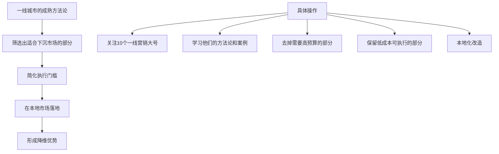
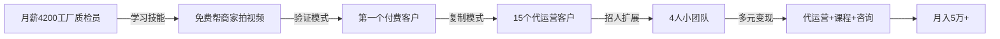

## 案例五：小镇青年的逆袭之路

### 基本信息

- **人物**：阿杰，25岁，湖南某四线县城，大专学历，工厂质检员
- **月薪**：到手4,200元，无年终奖，无五险一金（小作坊）
- **家庭背景**：父母务农，年收入约3万，无法提供任何经济支持
- **起点资产**：银行卡余额1,800元，一台二手笔记本电脑
- **目标**：三年内月入过万，五年内攒够50万启动资金

这个案例的典型意义在于：没有学历优势、没有家庭资源、没有一线城市的平台红利——绝大多数中国小镇青年的真实处境。阿杰的逆袭不是靠运气或天赋，而是一套可复制的"技能变现 + 低成本创业"路径。

---

### 第一阶段：认清现实，盘点资源（第1-2个月）

#### 为什么"认清现实"是第一步

很多小镇青年陷入两个极端：要么觉得"我什么都没有，什么也做不了"，要么觉得"随便搞搞就能赚大钱"。两种心态都会导致行动瘫痪。阿杰的做法是做一次彻底的**个人资源盘点**：

| 盘点维度 | 阿杰的具体情况 | 可利用程度 |
|---------|-------------|----------|
| 硬技能 | Excel基础操作、会用手机剪辑（剪映） | ★★☆☆☆ |
| 软技能 | 做事细心、能吃苦、沟通能力尚可 | ★★★☆☆ |
| 时间资源 | 每天下班后3-4小时，周末全天 | ★★★★☆ |
| 设备资源 | 二手笔记本（4GB内存）、智能手机 | ★★☆☆☆ |
| 人脉资源 | 工厂同事、高中同学群、本地微信群 | ★★☆☆☆ |
| 资金资源 | 可支配约500元/月 | ★☆☆☆☆ |

#### 关键认知：小镇青年的优势和劣势

**劣势（显而易见的）：**
- 信息差：接触不到一线城市的前沿机会
- 资金少：试错成本极低，亏不起
- 人脉窄：周围没有创业成功者可以模仿
- 平台小：本地市场容量有限

**劣势（容易被忽视的）：**
- 缺乏"搞钱思维"：周围人都在打工，没人教你怎么赚钱
- 时间被通勤和加班压缩：工厂工作不像写字楼，弹性很小
- 心理负担重：父母期待你"稳定"，副业被视为不务正业

**优势（大多数人没意识到的）：**
- 生活成本极低：房租300-500元，吃饭500-800元，月支出可控在1,500以内
- 竞争少：小镇里愿意折腾的人少，一旦你做了就是本地稀缺
- 没有"体面包袱"：不需要维持白领人设，什么赚钱干什么
- 熟悉下沉市场：了解三四线消费者的真实需求，这是很多大公司花钱买不到的信息

阿杰的盘点让他明确了：**短期内靠硬技能赚大钱不现实，但时间充裕、成本低、试错空间大，适合走"边学边干"的路线。**

---

### 第二阶段：选择赛道，低成本试错（第3-4个月）

#### 赛道选择的三个标准

阿杰用了一个简单的筛选框架来选择方向：

```text
可行性评分 = (变现速度 × 3) + (学习成本 × 2) + (可扩展性 × 2)

其中：
- 变现速度：多久能赚到第一笔钱（1个月内=5分，3个月=3分，6个月+=1分）
- 学习成本：需要多久才能上手（1周=5分，1个月=3分，3个月+=1分）
- 可扩展性：天花板有多高（纯线性=1分，可杠杆=3分，可规模化=5分）
```

他评估了以下方向：

| 方向 | 变现速度 | 学习成本 | 可扩展性 | 综合得分 | 结论 |
|-----|---------|---------|---------|---------|------|
| 自媒体写作 | 2 | 3 | 4 | 19 | 太慢，放弃 |
| 短视频带货 | 3 | 2 | 4 | 21 | 备选 |
| 闲鱼无货源 | 4 | 4 | 2 | 22 | 备选 |
| 本地商家短视频代运营 | 4 | 3 | 3 | 23 | **首选** |
| 网店（拼多多/1688代发） | 3 | 2 | 3 | 18 | 太卷，放弃 |
| 跑外卖/跑腿 | 5 | 5 | 1 | 26 | 纯体力，天花板低 |

#### 为什么选择"本地商家短视频代运营"

阿杰最终选择了**本地商家短视频代运营**作为突破口，原因如下：

1. **变现速度快**：县城商家有明确需求（生意难做，想学抖音但不会），可以快速签约
2. **学习门槛适中**：剪映 + 抖音运营基础知识，1-2个月可以入门
3. **本地化优势**：阿杰了解本地市场，能面对面沟通，比远程外包更有信任感
4. **成本极低**：一部手机 + 笔记本就能干，不需要租办公室、雇人
5. **可扩展**：从一个人做到团队化，从一个县城做到周边城市

#### 低成本试错的具体做法

阿杰没有辞职，而是在工厂继续上班的同时开始试水：

**第3个月（学习期）：**
- 每天晚上花2小时学习抖音运营：看免费教程（B站、抖音创作者学院），不花钱买课
- 用自己的抖音号练习拍摄和剪辑，每天发一条探店视频（免费帮本地商家拍）
- 拍了30家店，积累了素材库，也摸清了商家的痛点

**第4个月（验证期）：**
- 找了3家愿意"试一试"的商家：一家烧烤店、一家理发店、一家母婴店
- 条件：免费服务一个月，如果效果好再谈收费
- 每家拍3-5条视频，帮他们运营抖音账号
- 结果：烧烤店一条视频播放量破8万，当月到店客流增加约40人；理发店视频效果一般，但老板对内容质量很满意

**关键数据：**
- 3个月学习 + 1个月验证 = 第一笔收入之前投入约160小时
- 资金投入：0元（全靠手机和笔记本）
- 第一笔收入：烧烤店老板主动转了500元"辛苦费"，虽然不多但验证了模式

---

### 第三阶段：规模化收入，建立体系（第5-12个月）

#### 从免费到收费的定价策略

有了第一个成功案例后，阿杰开始正式收费。他的定价策略分三档：

| 服务档位 | 内容 | 月费 | 目标客户 |
|---------|------|------|---------|
| 基础版 | 每月4条短视频 + 账号基础运营 | 800元 | 小店（夫妻店、个体户） |
| 标准版 | 每月8条短视频 + 投流建议 + 数据分析 | 1,500元 | 中型商家（连锁店、培训机构） |
| 高级版 | 每月12条短视频 + 直播策划 + 活动方案 | 3,000元 | 大型商家（商场、酒店、房产） |

**定价逻辑**：
- 基础版800元，对县城商家来说相当于雇一个兼职的零头，决策门槛低
- 服务一个基础版客户每月约耗时8小时（拍摄3小时 + 剪辑3小时 + 沟通2小时）
- 时薪约100元，远高于工厂工资（工厂时薪约25元）

#### 客户获取的四种渠道

阿杰没有花钱打广告，用的是四种零成本获客方式：

**1. 老客户转介绍（占比40%）**
- 每个合作满意的商家，阿杰都会请他们帮忙推荐
- 转介绍成功给100元红包（相当于获客成本100元，极低）
- 话术："张哥，你身边有没有开店的朋友也想做抖音？帮我介绍一个，我给你包个红包"

**2. 地推扫街（占比30%）**
- 每周拿出半天时间，去商业街挨家拜访
- 不推销，只展示案例："这是我们帮XX烧烤店做的视频，8万播放量"
- 带着iPad展示作品集，比任何话术都有说服力

**3. 抖音同城引流（占比20%）**
- 阿杰自己的抖音号发"探店 + 运营技巧"内容
- 定位在本县城，吸引本地商家主动联系
- 粉丝不多（3,000左右），但精准度极高——都是本地生意人

**4. 本地微信群（占比10%）**
- 加入县城的"商家交流群""创业群"
- 不硬推广告，偶尔分享运营干货，建立专业形象

#### 财务数据（第5-12个月）

| 月份 | 付费客户数 | 月收入（主业） | 月收入（副业） | 月总支出 | 月净储蓄 |
|-----|----------|-------------|-------------|---------|---------|
| 第5月 | 3个 | 4,200 | 2,800 | 1,800 | 5,200 |
| 第6月 | 5个 | 4,200 | 5,200 | 1,800 | 7,600 |
| 第7月 | 7个 | 4,200 | 7,500 | 2,000 | 9,700 |
| 第8月 | 9个 | 4,200 | 9,800 | 2,000 | 12,000 |
| 第9月 | 10个 | 4,200 | 11,000 | 2,200 | 13,000 |
| 第10月 | 12个 | 4,200 | 13,500 | 2,200 | 15,500 |
| 第11月 | 13个 | 4,200 | 14,800 | 2,500 | 16,500 |
| 第12月 | 15个 | 4,200 | 16,200 | 2,500 | 17,900 |

> 注：第8个月阿杰从工厂辞职，全职做代运营。第9个月开始缴纳灵活就业社保，支出略增。

**第12个月底的资产状况：**
- 累计储蓄：约10.5万元
- 银行存款：8万元
- 投资账户（余额宝 + 指数基金定投）：2.5万元
- 应急备用金：已建立3个月生活费储备（约7,500元）

---

### 第四阶段：升级模式，突破天花板（第13-24个月）

#### 遇到的瓶颈

做到第13个月，阿杰发现自己遇到了几个问题：

1. **时间天花板**：一个人最多服务15-18个客户，再多了质量保证不了
2. **能力瓶颈**：复杂的商业策略（如投流优化、直播策划）他还做不好
3. **地域限制**：本县城商家就那么多，客户开发越来越难
4. **价格瓶颈**：县城消费水平有限，提价空间不大

#### 突破策略：三条路径同时走

**路径一：招人做团队**
- 招了2个本地年轻人（也是小镇青年），教他们基础拍摄和剪辑
- 工资结构：底薪2,500 + 每服务一个客户提成200元
- 阿杰从"自己干"变成"带团队干"，产能翻倍

**路径二：拓展服务范围**
- 从短视频代运营扩展到"本地商家数字营销全案"
- 新增服务：美团/大众点评店铺装修、朋友圈广告代投、小程序商城搭建
- 客单价从平均1,500元/月提升到3,000元/月

**路径三：知识付费变现**
- 把自己的运营经验整理成课程，放到抖音和微信卖
- 课程定价：99元（入门）、399元（进阶）、1,999元（陪跑训练营）
- 目标受众：其他想做代运营的小镇青年

#### 第13-24个月财务数据

| 指标 | 第13月 | 第15月 | 第18月 | 第21月 | 第24月 |
|-----|-------|-------|-------|-------|-------|
| 代运营客户数 | 18 | 22 | 28 | 30 | 32 |
| 代运营月收入 | 18,000 | 24,000 | 35,000 | 42,000 | 48,000 |
| 课程月收入 | 0 | 2,000 | 5,000 | 8,000 | 12,000 |
| 团队人数 | 1 | 2 | 3 | 4 | 4 |
| 人员成本 | 3,000 | 6,500 | 10,000 | 13,000 | 13,000 |
| 其他运营成本 | 1,000 | 1,500 | 2,000 | 3,000 | 3,500 |
| **月净利润** | **14,000** | **18,000** | **28,000** | **34,000** | **43,500** |
| **累计净资产** | **13万** | **17万** | **28万** | **40万** | **52万** |

> 第24个月，阿杰的净资产突破50万，完成了当初设定的五年目标——提前了三年。

---

### 核心方法论拆解

#### 方法论一：小镇青年的"降维打击"策略

阿杰的成功不是因为他有多厉害，而是他用了一套"降维打击"的思路：



**实例**：阿杰学到一个"抖音同城探店矩阵"玩法（一线城市成熟玩法），在本地没有人在做。他用零成本的方式复制了这个模式——自己拍、自己剪、自己发布，帮商家做到了本地同行做不到的内容质量。

#### 方法论二：从"卖时间"到"卖能力"的三级跳

| 阶段 | 模式 | 收入公式 | 阿杰的对应阶段 |
|-----|------|---------|-------------|
| 第一级 | 卖时间 | 收入 = 时薪 × 工时 | 工厂上班（时薪25元） |
| 第二级 | 卖技能 | 收入 = 单价 × 客户数 | 代运营（时薪100+元） |
| 第三级 | 卖系统 | 收入 = 系统产出 × 杠杆率 | 团队 + 课程（时薪300+元） |

**关键转折点**：从第一级到第二级，需要一项可变现的技能；从第二级到第三级，需要把个人能力产品化和可复制化。

#### 方法论三：小城市的"关系资产"经营

在大城市，客户关系靠平台和品牌；在小城市，客户关系靠**信任和人情**。阿杰的几个做法值得借鉴：

1. **超预期交付**：答应拍4条视频，实际拍5-6条，多出来的算"赠送"
2. **主动反馈数据**：每月底给客户发一份"运营报告"，展示播放量、互动量、到店客流变化
3. **帮客户解决"分外之事"**：有客户不会用手机收银，阿杰顺手帮忙设置好了——这种小事换来的是长期信任
4. **建本地商家社群**：把客户拉到一个微信群，不定期分享运营干货，也促进商家之间互相介绍

---

### 踩过的坑和教训

#### 坑一：免费做太久，差点被白嫖

阿杰前4个月免费帮3家商家做内容，其中一家烧烤店效果很好后，老板说"我们继续免费合作吧，反正你也需要案例"。阿杰差点答应——但意识到这是**典型的白嫖心理**。

**教训**：免费服务最多一个月，作为验证期。超过一个月还不付费的客户，不值得继续投入。"免费"只能用来建立信任，不能用来养懒人。

#### 坑二：同时接太多客户，质量崩盘

第8个月辞职后，阿杰一口气接了15个客户，但只有自己一个人干。结果：
- 视频质量下降，拍摄越来越敷衍
- 有3个客户投诉"视频和之前差距太大"
- 差点流失核心客户

**教训**：**产能上限要提前算好**。一个人每月高质量产出上限约为12-15条视频（对应6-8个客户）。超过这个数字，要么招人，要么涨价减少客户数——不能用降低质量来换数量。

#### 坑三：盲目学"高端玩法"，水土不服

第10个月，阿杰花2,000元买了一个"抖音投放实战课"，学了DOU+投流技巧。但他忽略了：县城商家的抖音投放ROI远低于一线城市——因为本地用户基数小，投流效率很低。

**教训**：**方法论要适配本地市场**。一线城市有效的打法，在下沉市场可能完全不适用。先用零成本方式验证，再考虑付费工具。

#### 坑四：没有签合同，被赖账

第6个月，一个客户做了3个月服务后拒绝付最后一个月的钱（1,500元），理由是"效果没达到预期"。阿杰没有签书面合同，口头约定没有法律效力，只能认亏。

**教训**：**再小的生意也要签合同**。阿杰后来的做法：
- 准备了一份简单的服务协议模板（网上下载后自己改的）
- 每个新客户签约前必须签字
- 付款方式改为"预付制"：每月初付当月费用，不赊账
- 对于犹豫的客户，可以先付50%定金，月底付尾款

#### 坑五：忽略了税收和社保

辞职后阿杰没有缴纳社保，直到有一次生病去医院发现不能报销才意识到问题。另外，收入超过一定额度需要申报个税，阿杰完全不了解。

**教训**：
- 辞职后第一时间办理灵活就业社保（养老+医疗），每月约800-1,200元
- 收入稳定后考虑注册个体工商户，可以开具发票，税负更低
- 记录所有收入和支出，年底做个简单核算

---

### 心态管理：小镇青年最容易被忽视的一关

#### 来自周围人的质疑

阿杰在县城做"短视频代运营"时，几乎所有人都不理解：
- 父母："工厂干得好好的，折腾什么？"
- 同事："拍抖音能赚钱？不靠谱吧？"
- 亲戚："大专毕业不找正经工作，搞这些乱七八糟的"

这种压力在一线城市几乎不存在（因为周围人都在搞副业），但在小城市是真实且强烈的。

**阿杰的应对方式：**
1. **不解释，用结果说话**：不跟任何人争论"这件事能不能赚钱"，默默干到出成绩
2. **找到同行者**：加入线上社群（抖音运营交流群、副业交流群），和志同道合的人互相鼓励
3. **设置"心理止损线"**：给自己定了一个规则——"如果6个月后月入不到5,000，就回去上班"。有了这个底线，心理压力反而小了
4. **记录进步**：每天写简短的工作日志，记录今天做了什么、学了什么、赚了多少。看到数字在增长，信心自然增长

#### 孤独感的处理

小镇青年做副业/创业最大的敌人不是能力不足，而是**孤独**。身边没有人理解你在做什么，没有人可以交流经验，遇到问题只能自己扛。

阿杰的解法：
- 每周和线上社群的同行语音交流一次
- 关注3-5个同类型的博主，看他们的内容获得"陪伴感"
- 每月给自己放一天假，不做任何和工作相关的事

---

### 两年复盘：从月薪4,200到月入5万的方法论



#### 阿杰的关键决策复盘

| 时间点 | 决策 | 后果 | 是否正确 |
|-------|------|-----|---------|
| 第2个月 | 选择代运营而不是写作 | 3个月内有了第一笔收入 | ✅ 正确 |
| 第4个月 | 免费服务一个月后收费 | 验证了模式但也差点被白嫖 | ⚠️ 部分正确 |
| 第8个月 | 辞职全职做 | 收入翻倍但失去稳定保障 | ✅ 正确（在副业收入>主业后） |
| 第10个月 | 花2000元学投放 | 本地市场水土不服 | ❌ 错误 |
| 第13个月 | 招人做团队 | 突破个人产能瓶颈 | ✅ 正确 |
| 第15个月 | 开始做知识付费 | 打开了第二收入曲线 | ✅ 正确 |
| 第18个月 | 注册个体工商户 | 合规经营，税负降低 | ✅ 正确 |

#### 可复制的核心经验

1. **选赛道的标准**：变现快 > 天花板高。小镇青年首先要活着，再谈发展
2. **免费期要短**：1个月验证足够，超过1个月不付费的客户不值得投入
3. **先跑通再优化**：不要在"完美准备"上花太多时间，先干起来再迭代
4. **本地化是核心壁垒**：你在县城做的案例和口碑，是外来竞争者抢不走的
5. **知识付费是第二曲线**：当你做到一定成绩，把经验卖给同行比做服务更赚钱
6. **合规经营**：收入稳定后尽快注册个体户、缴纳社保，不要心存侥幸

---

### 延伸思考：小镇青年搞钱的其他可行路径

阿杰选择了"本地商家代运营"这条路，但这不是唯一选择。以下是经过验证的、适合小镇青年的其他路径：

| 路径 | 适合人群 | 启动成本 | 月收入上限 | 难度 |
|-----|---------|---------|----------|------|
| 闲鱼/转转无货源 | 会淘货、有耐心 | 0-500元 | 5,000-15,000 | ★★☆☆☆ |
| 本地跑腿/代办 | 时间充裕、有电动车 | 0元 | 3,000-8,000 | ★☆☆☆☆ |
| 农产品电商 | 家里有货源 | 1,000-3,000元 | 5,000-30,000 | ★★★☆☆ |
| 短视频本地探店 | 爱吃爱玩、会拍视频 | 0元 | 3,000-10,000 | ★★☆☆☆ |
| 家政/保洁上门服务 | 能吃苦、服务意识强 | 500元 | 5,000-12,000 | ★★☆☆☆ |
| 线上客服/数据标注 | 有电脑、时间灵活 | 0元 | 2,000-5,000 | ★☆☆☆☆ |
| 少儿编程/美术培训 | 有相关技能 | 0-2,000元 | 5,000-20,000 | ★★★☆☆ |

**选择建议**：
- 如果你有明确技能（编程、设计、写作）→ 优先做技能变现
- 如果你没有特殊技能但能吃苦 → 先做体力型副业（跑腿、家政）攒第一桶金，同时学习新技能
- 如果你家里有资源（农产品、手工艺品）→ 做供应链型电商
- 如果你什么都没有但愿意学 → 和阿杰一样，选一个低门槛的方向，边学边干

---

### 总结：小镇青年逆袭的核心公式

```text
逆袭 = 低成本起步 × 快速验证 × 持续迭代 × 规模化复制
```

- **低成本起步**：不要借钱创业，不要辞职创业，用业余时间和现有设备先跑起来
- **快速验证**：3个月内必须看到第一笔收入，否则换方向
- **持续迭代**：每周复盘一次，哪里做得好保持，做得不好改进
- **规模化复制**：当你跑通了一个人的模式，要么招人、要么做课程、要么做加盟——把模式复制出去

阿杰的故事不是传奇，而是一套**可复制的方法论**。小镇青年最大的敌人不是资源匮乏，而是"觉得自己不行"的自我设限。只要你愿意开始、愿意坚持、愿意学习，月入过万并不是遥不可及的目标。
