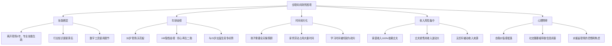
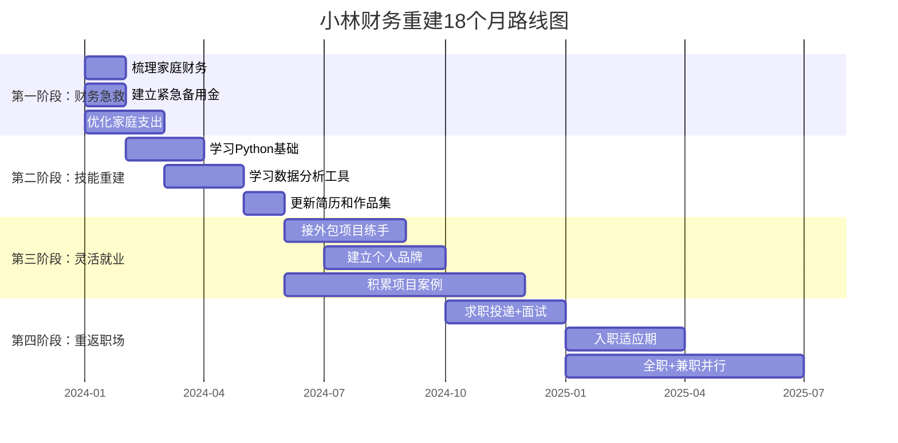
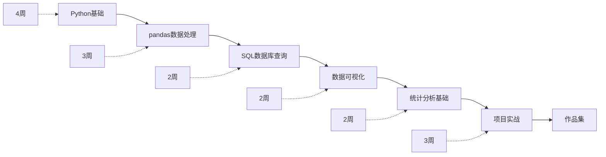
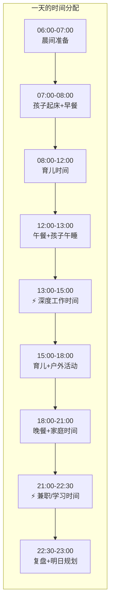
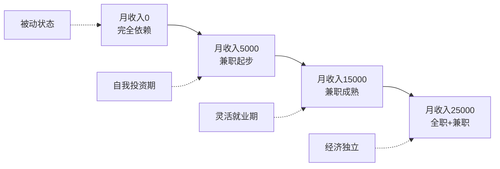

## 案例六：全职妈妈的财务重建

### 引言：被忽视的财务危机

全职妈妈是家庭中最容易被忽视的财务风险节点。她们放弃了职业生涯、社保缴纳、技能积累和社交网络，将全部精力投入家庭——但这种"隐形劳动"在现行经济体系中没有直接定价。一旦婚姻出现变故、家庭遭遇经济冲击，全职妈妈往往处于极度被动的位置。

根据《2024年中国全职妈妈生存状况调研报告》，中国约有3700万全职妈妈，其中68%表示"经济不独立"是最大的焦虑来源，而仅有23%拥有自己的独立储蓄账户。这不是个人问题，而是结构性问题——社会缺乏对家庭劳动的价值认定体系，法律保障（如《民法典》中的家务补偿制度）在实操中落地困难。

小林的故事，是3700万全职妈妈中的一个缩影，也是一个从被动到主动、从依附到独立的财务重建范本。

---

### 人物画像与情境还原

#### 基本信息

| 维度 | 详情 |
|------|------|
| **姓名** | 小林 |
| **年龄** | 35岁 |
| **城市** | 上海 |
| **学历** | 本科，211院校工商管理专业 |
| **原职业** | 外企市场部高级专员 |
| **全职时长** | 3年（孩子0-3岁期间） |
| **丈夫职业** | 某科技公司销售经理，月薪3万（含绩效浮动） |
| **孩子年龄** | 2岁，即将进入托班 |
| **家庭资产** | 自住房一套（市值500万，贷款余额200万）；存款15万 |
| **家庭月支出** | 2.2万（房贷8000 + 生活费8000 + 孩子支出4000 + 其他2000） |
| **月结余** | 约8000元（丈夫收入3万 - 支出2.2万） |

#### 核心困境拆解

小林面临的不是单一问题，而是一个**多重困境叠加**的局面：



**关键认知：** 这些困境不是互相独立的，而是形成了一条"恶性循环链"——技能断层导致信心不足 → 信心不足导致行动拖延 → 行动拖延导致技能差距进一步拉大 → 拉大后更加焦虑。打破这个循环的关键，是找到一个**足够小的切入点**，快速获得第一个正反馈。

---

### 财务诊断：全面摸底

在制定任何策略之前，必须先对家庭财务进行彻底的体检。

#### 家庭资产负债表

| 资产类别 | 金额（万元） | 占比 | 说明 |
|----------|-------------|------|------|
| 房产（市值） | 500 | 94.3% | 自住房，非投资性 |
| 存款 | 15 | 2.8% | 活期+定期混合 |
| 其他（家具、车辆等） | 15 | 2.9% | 折旧后估值 |
| **资产合计** | **530** | **100%** | — |

| 负债类别 | 金额（万元） | 说明 |
|----------|-------------|------|
| 房贷余额 | 200 | 30年期，已还5年 |
| **负债合计** | **200** | — |
| **净资产** | **330** | 资产 - 负债 |

#### 收支现金流分析

| 项目 | 月金额（元） | 占收入比 | 健康评估 |
|------|-------------|----------|----------|
| 丈夫税后收入 | 30,000 | 100% | ⚠️ 单一来源 |
| 房贷月供 | -8,000 | 26.7% | ✅ 在合理范围 |
| 家庭生活费 | -8,000 | 26.7% | ⚠️ 可优化 |
| 孩子相关支出 | -4,000 | 13.3% | ✅ 合理 |
| 其他支出 | -2,000 | 6.7% | ✅ 合理 |
| **月结余** | **8,000** | **26.7%** | ⚠️ 偏低 |

#### 风险评估矩阵

| 风险类型 | 严重程度 | 发生概率 | 应对能力 | 综合评级 |
|----------|---------|---------|---------|---------|
| 丈夫失业/降薪 | 🔴 高 | 中（销售岗波动大） | 🔴 低（无备用方案） | 🔴 **极高** |
| 家庭成员大病 | 🔴 高 | 低 | 🟡 中（有医保） | 🟡 **中高** |
| 婚姻变故 | 🔴 高 | 未知 | 🔴 低（无独立收入） | 🔴 **高** |
| 房产贬值 | 🟡 中 | 中 | 🟡 中 | 🟡 **中** |
| 通货膨胀侵蚀 | 🟡 中 | 高 | 🟡 中 | 🟡 **中** |

**诊断结论：** 这个家庭表面稳定，实则脆弱。最大的风险不是资产不够，而是**收入来源过度集中**——丈夫一人扛起了整个家庭的经济命脉，而小林没有任何经济自主能力。用投资术语说，这个家庭的"仓位"太集中了，需要**分散化**。

---

### 重建策略：四阶段系统方案

#### 整体路线图



---

#### 第一阶段：财务急救（第1-2个月）

**目标：** 盘清家底，建立安全网，释放焦虑。

**Step 1：全面财务梳理**

小林做的第一件事，是用一个周末下午，把家庭所有的财务信息整理到一张表上。这不是什么复杂的操作，但很多家庭从来没做过——就像一个人从没做过体检，不知道自己的血压血脂。

具体操作清单：

- 梳理所有银行账户（活期、定期、理财）
- 汇总所有负债（房贷余额、利率、剩余期限）
- 统计每月固定支出和浮动支出
- 确认家庭成员的保险覆盖情况
- 整理房产证、车辆登记证等资产凭证

**Step 2：重新配置15万存款**

| 配置方向 | 金额 | 用途 | 工具选择 | 预期收益 |
|----------|------|------|---------|---------|
| 紧急备用金 | 5万 | 3个月家庭开支的安全垫 | 货币基金（余额宝/零钱通） | 年化2%左右 |
| 指数基金定投 | 5万 | 中长期资产增值 | 沪深300+中证500组合 | 年化8-12%（长期） |
| 自我投资 | 5万 | 技能学习+职业准备 | 课程、认证、工具、社交 | 无法估量（后面会看到） |

**为什么这样分？** 紧急备用金是"底线思维"——万一丈夫突然失业或家庭遭遇意外，这笔钱能撑3个月不动用其他资产。指数基金定投是"增值思维"——钱不能只躺在银行被通胀吃掉。自我投资是"杠杆思维"——这5万是整个重建计划的核心驱动力。

**Step 3：优化家庭月支出**

通过详细记账，小林发现了一些可以优化的项目：

| 优化项目 | 优化前（月） | 优化后（月） | 节省 | 做法 |
|----------|-------------|-------------|------|------|
| 外卖/餐饮 | 4,500 | 2,800 | 1,700 | 减少外卖频次，每周meal prep |
| 孩子早教班 | 2,000 | 0 | 2,000 | 2岁前早教效果有限，改为亲子互动 |
| 订阅服务 | 300 | 100 | 200 | 取消不用的会员 |
| **合计** | — | — | **3,900** | — |

优化后月结余从8000元提升到约11900元，增幅48%。这笔钱直接用于投资自己。

---

#### 第二阶段：技能重建（第2-6个月）

**目标：** 用4个月时间，建立一套可变现的技能组合。

##### 为什么选择数据分析？

小林没有盲目选择"热门赛道"，而是做了一次系统的职业方向分析：

| 评估维度 | 数据分析 | 新媒体运营 | 产品经理 | 会计/财务 |
|----------|---------|-----------|---------|----------|
| 学习门槛 | 中（需要逻辑思维） | 低 | 高（需要经验） | 中（需要考证） |
| 远程可行性 | ⭐⭐⭐⭐⭐ | ⭐⭐⭐⭐ | ⭐⭐ | ⭐⭐⭐ |
| 全职妈妈友好度 | ⭐⭐⭐⭐⭐ | ⭐⭐⭐ | ⭐⭐ | ⭐⭐⭐ |
| 薪资天花板 | 高 | 中 | 高 | 中 |
| 年龄歧视程度 | 低 | 高 | 中 | 低 |
| 与原职业关联度 | 中 | 中 | 高 | 低 |
| 市场需求增速 | 高 | 中 | 中 | 稳定 |

数据分析的优势：学习路径清晰、远程工作机会多、对年龄相对宽容、且她原职业的商业分析能力可以迁移。

##### 学习路径规划



**每日学习时间安排（针对全职妈妈）：**

| 时间段 | 时长 | 内容 | 说明 |
|--------|------|------|------|
| 孩子午睡（13:00-15:00） | 1.5小时 | 核心课程学习 | 精力最好的学习时间 |
| 孩子晚间入睡后（21:00-22:30） | 1小时 | 练习和作业 | 巩固白天所学 |
| 碎片时间（等公交、排队） | 30分钟 | 刷题/看文章 | 利用手机App |
| **日均学习时长** | **约3小时** | — | 每周约20小时 |

##### 推荐学习资源

| 阶段 | 资源 | 费用 | 时长 | 说明 |
|------|------|------|------|------|
| Python基础 | 廖雪峰Python教程 | 免费 | 4周 | 中文，适合零基础 |
| Python进阶 | DataCamp/扇贝编程 | 200-500元/月 | 3周 | 交互式学习 |
| SQL | LeetCode SQL题库 | 免费 | 2周 | 通过刷题学习 |
| 数据可视化 | Matplotlib/Seaborn官方文档 | 免费 | 2周 | 边学边做 |
| 综合项目 | Kaggle入门竞赛 | 免费 | 3周 | 真实数据集实战 |
| **总投入** | — | **约2000元** | **约4个月** | — |

##### 关键里程碑

| 里程碑 | 完成时间 | 验证标准 |
|--------|---------|---------|
| 写出第一个Python脚本 | 第2周 | 能独立完成数据清洗任务 |
| 完成第一个数据分析项目 | 第6周 | 有完整的分析报告 |
| 能独立写SQL查询 | 第8周 | 能处理多表关联查询 |
| 建立GitHub作品集 | 第12周 | 至少3个完整项目 |
| 获得第一个外包项目 | 第16周 | 有实际收入 |

---

#### 第三阶段：灵活就业（第6-12个月）

**目标：** 通过远程兼职积累实战经验和收入，建立重返职场的跳板。

##### 兼职渠道矩阵

| 渠道 | 适合阶段 | 收入预期 | 优劣势 |
|------|---------|---------|--------|
| 猪八戒网/一品威客 | 初期 | 500-2000元/单 | ✅ 入门快 ❌ 竞争激烈，价格低 |
| Upwork/Fiverr | 初期 | $10-30/小时 | ✅ 国际市场 ❌ 需要英语能力 |
| 数据分析外包群 | 中期 | 2000-8000元/单 | ✅ 质量较高 ❌ 需要人脉 |
| Kaggle竞赛奖金 | 中期 | $500-5000/次 | ✅ 提升技能 ❌ 不稳定 |
| 企业数据代运营 | 后期 | 3000-8000元/月 | ✅ 稳定 ❌ 需要信任基础 |
| 前同事介绍的项目 | 后期 | 5000-15000元/单 | ✅ 靠谱 ❌ 需要维护关系 |

##### 兼职定价策略

小林一开始犯了一个全职妈妈常犯的错误——**定价过低**。她觉得"我只是兼职，不好意思要高价"。后来她意识到，客户买的是结果，不是你的时间。一个数据分析报告如果能帮客户多赚10万，收5000块是非常合理的。

定价参考：

| 服务类型 | 入门价（前3个月） | 进阶价（3-6个月） | 成熟价（6个月后） |
|----------|-----------------|-----------------|-----------------|
| Excel数据整理 | 500元/份 | 800元/份 | 1200元/份 |
| 数据分析报告 | 1500元/份 | 3000元/份 | 5000-8000元/份 |
| Python自动化脚本 | 1000元/个 | 2500元/个 | 5000元/个 |
| 月度数据代运营 | 2000元/月 | 4000元/月 | 6000-8000元/月 |

##### 时间管理：全职妈妈如何平衡兼职与育儿

这是最容易被低估的挑战。很多全职妈妈在重返职场的过程中，因为无法平衡时间而半途而废。小林的方法是**"时间块管理法"**：



**核心原则：** 每天保证2-3小时的"不可打扰"深度工作时间。午睡时间做需要思考的任务（写代码、做分析），晚上做机械性任务（回复客户、整理文档）。

---

#### 第四阶段：重返职场（第12-18个月）

**目标：** 从兼职过渡到全职，实现完全的经济独立。

##### 求职策略

小林没有海投简历，而是采用了**"内推+精准投递"**的组合策略：

| 渠道 | 投递数量 | 面试邀请率 | 说明 |
|------|---------|-----------|------|
| 前同事内推 | 5份 | 80%（4份） | 最高效，信任背书 |
| LinkedIn精准投递 | 20份 | 25%（5份） | 需要优化Profile |
| 招聘网站投递 | 50份 | 8%（4份） | 效率最低，但量大 |
| **合计** | 75份 | 17%（13份） | — |

**简历亮点打造：**

小林的简历没有回避"全职妈妈"这段经历，而是这样呈现：

```text
2021-2024  自由职业/独立数据分析顾问
- 累计完成30+数据分析项目，服务客户涵盖电商、教育、金融等行业
- 建立了完整的数据分析工作流，从数据采集到可视化报告交付
- 某电商客户项目成果：通过用户行为分析，帮助客户提升转化率23%
```

**面试话术：**

面试官最常见的问题是："你这三年都在做什么？"小林的标准回答：

> "这三年我主要在照顾家庭，但我没有停止成长。我利用这段时间系统学习了数据分析技能，完成了30多个实战项目，并建立了自己的客户群。这段经历让我学会了时间管理、自我驱动和独立解决问题——这些能力在任何岗位上都有价值。"

##### 薪资谈判

| 谈判要素 | 小林的策略 | 结果 |
|----------|-----------|------|
| 薪资预期 | 对标同岗位市场价的80-90% | 避免过高吓退雇主 |
| 谈判筹码 | 已有兼职收入作为底牌 | 不会因为急需工作而妥协 |
| 入职方式 | 先兼职3个月再转全职 | 降低双方风险 |
| 最终薪资 | 月薪2万 + 年终奖 | 符合预期 |

---

### 两年后成果复盘

#### 核心指标对比

| 指标 | 重建前 | 重建后 | 变化幅度 |
|------|--------|--------|---------|
| 小林个人月收入 | 0 | 2.5万（全职2万+兼职5000） | +∞ |
| 家庭月收入 | 3万 | 5.5万 | +83% |
| 月储蓄额 | 8,000元 | 20,000元 | +150% |
| 收入来源数 | 1个 | 3个 | +200% |
| 投资资产 | 5万 | 约50万 | +900% |
| 紧急备用金覆盖月数 | 2.3个月 | 6个月 | +161% |
| 经济独立性 | 完全依赖丈夫 | 完全独立 | 质变 |
| 家庭抗风险能力 | 低 | 高 | 质变 |

#### 资产增长路径

| 时间节点 | 投资资产（万元） | 说明 |
|----------|----------------|------|
| 重建启动 | 5 | 初始指数基金定投 |
| 第6个月 | 7 | 兼职收入补充 |
| 第12个月 | 15 | 全职工资+兼职收入+投资收益 |
| 第18个月 | 30 | 收入增长+复利效应 |
| 第24个月 | 50 | 资产加速增长 |



#### 非财务收获

小林自己说："重返职场后，我和老公的关系反而更好了。"这背后的逻辑是：

- **话语权平等：** 当你有独立收入，在家庭决策中自然有更大的话语权
- **共同话题增加：** 重新进入职场后，夫妻有了更多可以交流的话题
- **互相尊重提升：** 丈夫看到了小林的成长和努力，更加尊重她
- **焦虑减少：** 不再担心"如果老公失业了怎么办"，心态更从容

---

### 常见误区与避坑指南

#### 误区一："等孩子大了再考虑"

很多全职妈妈觉得"孩子还小，等上幼儿园再说"。但现实是：

- 孩子上幼儿园后，你会面临"接送时间冲突"的问题
- 脱离职场越久，重返的难度越大
- 35岁和38岁的求职难度完全不同

**正确做法：** 孩子2岁左右就开始准备，利用托班/午睡时间学习。等到孩子3岁上幼儿园时，你已经有了一年的技能积累和兼职经验。

#### 误区二："先考个证再说"

考证是很多人的"拖延借口"。数据分析领域，实战能力远比证书重要。

**正确做法：** 边学边做，用项目证明能力。一个有3个完整项目的GitHub，比3张证书更有说服力。

#### 误区三："兼职太少了不值得做"

有些人觉得"一个月才赚3000块，还不如不干"。但兼职的价值不仅是收入：

- 积累实战经验，更新简历
- 建立客户关系，获取内推机会
- 保持工作状态，降低重返职场的适应成本
- 建立自信，打破"我不行"的心理障碍

#### 误区四："全职妈妈不配要高价"

这是最致命的心理陷阱。你的能力值多少钱，和你是不是全职妈妈无关。

**正确做法：** 按市场价定价，用结果说话。如果你的分析报告帮客户多赚了10万，收5000块是合理的。

#### 误区五："为了省钱不投资自己"

有些人把5万块的自我投资预算省下来存银行。但这5万块的回报率可能是1000%（5万投入 → 每年30万收入增长）。

**正确做法：** 把自我投资视为最高回报的投资，而不是"花钱"。

---

### 进阶策略：从经济独立到财务自由

小林的故事在"经济独立"这一步就结束了，但对有更高追求的读者，可以继续往下走。

#### 第二年目标：副业规模化

| 策略 | 具体做法 | 预期收入 |
|------|---------|---------|
| 开发标准化产品 | 将常见分析模板产品化 | 月均5000-10000元 |
| 录制在线课程 | 在B站/网易云课堂开课 | 月均3000-8000元 |
| 建立个人品牌 | 写公众号/知乎专栏 | 间接带来客户 |
| 培养外包团队 | 接更多项目，分包给其他全职妈妈 | 月均10000-20000元 |

#### 第三年目标：被动收入构建

| 被动收入来源 | 启动成本 | 预期月收入 | 维护时间 |
|-------------|---------|-----------|---------|
| 在线课程（录播） | 前期投入大量时间 | 5000-15000元 | 极少 |
| 数据分析工具/SaaS | 开发成本3-5万 | 10000-30000元 | 中等 |
| 投资收益（50万本金） | 已有 | 3000-5000元 | 零 |
| 写书/版权收入 | 前期投入时间 | 2000-5000元 | 零 |

#### 给不同阶段全职妈妈的建议

| 阶段 | 核心任务 | 时间投入 | 预期回报周期 |
|------|---------|---------|------------|
| 孩子0-1岁 | 心态调整+信息收集 | 1小时/天 | — |
| 孩子1-2岁 | 技能学习（选择方向） | 2-3小时/天 | 6-12个月 |
| 孩子2-3岁 | 兼职实践+收入起步 | 3-4小时/天 | 3-6个月 |
| 孩子3岁+ | 全职/创业/副业规模化 | 正常工作时间 | 即时 |

---

### 法律保障：全职妈妈必须知道的权益

很多全职妈妈不知道自己在法律上有哪些保护。这不是"准备离婚"，而是"了解自己的权益"。

#### 《民法典》相关条款

- **第1088条（家务补偿）：** 夫妻一方因抚育子女、照料老年人、协助另一方工作等负担较多义务的，离婚时有权向另一方请求补偿。
- **第1062条（共同财产）：** 婚姻存续期间的收入属于夫妻共同财产，全职妈妈对家庭财产享有平等权利。
- **第1090条（离婚经济帮助）：** 离婚时，如果一方生活困难，有负担能力的另一方应当给予适当帮助。

#### 实操建议

- 了解家庭全部财产状况（房产、存款、投资、保险）
- 保持自己的银行账户有独立收入流
- 定期查看家庭社保缴纳情况
- 如有需要，咨询专业律师了解具体权益

---

### 案例对比：小林 vs. 其他重建路径

| 对比维度 | 小林（数据分析路线） | 传统路径（会计/行政） | 创业路径（开网店/自媒体） |
|----------|-------------------|--------------------|-----------------------|
| 学习周期 | 4-6个月 | 6-12个月（考证） | 3-6个月（但试错期长） |
| 初始投入 | 约5000元 | 3000-10000元 | 10000-50000元 |
| 远程可行性 | ⭐⭐⭐⭐⭐ | ⭐⭐⭐ | ⭐⭐⭐⭐ |
| 收入天花板 | 高（月入3-5万可期） | 中（月入1-2万） | 不确定（可能很高也可能为零） |
| 风险程度 | 低 | 低 | 高 |
| 年龄友好度 | ⭐⭐⭐⭐ | ⭐⭐⭐ | ⭐⭐⭐⭐⭐ |
| 适合人群 | 逻辑思维强、喜欢学习 | 求稳、不喜欢变化 | 有商业嗅觉、抗风险能力强 |

---

### 核心启示

1. **全职妈妈重返职场，核心是"可迁移技能"。** 数据分析、项目管理、内容创作等技能不受行业限制，且可以通过远程方式积累经验。

2. **灵活就业是最佳过渡方式。** 不要试图一步到位找到全职工作，先从兼职开始，积累经验和信心，降低双方的风险。

3. **经济独立是人格独立的基础。** 小林重返职场后，夫妻关系反而更好了——因为话语权更平等了。

4. **投资自己永远不亏。** 花在学习上的5万元，带来了每年30万的收入增长，回报率600%。

5. **不要等到"准备好了"才行动。** 全职妈妈永远不会有"完美时机"，最好的时机就是现在。

6. **财务重建是一场马拉松，不是百米冲刺。** 小林用了18个月才完成重建，期间经历了无数次想放弃的时刻。坚持下来的人，终将看到曙光。

***

> **编者注：** 本案例中的小林是多个真实案例的综合呈现。数据分析路线只是众多可行路径之一，全职妈妈应根据自身背景、兴趣和资源选择最适合自己的方向。核心原则不变：先投资自己，再创造收入，最终实现经济独立。
