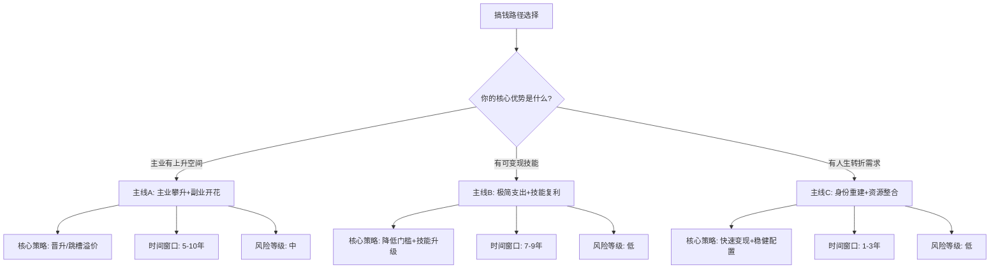
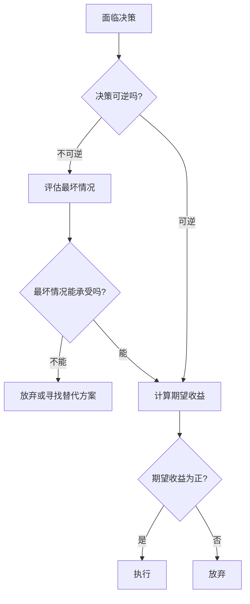
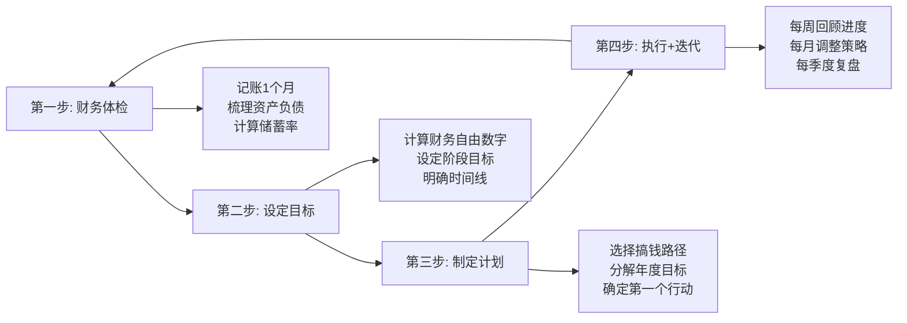

## 案例对比总结（更新版）

本章收录了七个不同人生阶段、不同背景的搞钱实战案例。这些案例覆盖了从26岁自由撰稿人到55岁退休夫妇的完整人生光谱，横跨互联网、制造业、自由职业、全职妈妈等多种身份。本节将这七个案例进行系统性对比分析，提炼出贯穿所有案例的底层规律、共性策略和差异化决策模型，帮助读者找到最适合自身处境的搞钱路径。

### 七案例全景对照

#### 人物画像一览

| 维度 | 案例一 小李 | 案例二 小王 | 案例三 老张 | 案例四 夫妻档 | 案例五 小镇青年 | 案例六 小林 | 案例七 老王夫妇 |
|------|-----------|-----------|-----------|-------------|---------------|-----------|---------------|
| 年龄 | 28岁 | 26岁 | 42岁 | 夫妻 | 25岁 | 35岁 | 55/52岁 |
| 城市 | 杭州 | 成都 | 北京 | 二线城市 | 三线小镇 | 上海 | 二线城市 |
| 职业 | 互联网产品经理 | 自由撰稿人 | 制造业中层 | 双职工 | 基层打工者 | 全职妈妈 | 国企/事业单位 |
| 月收入 | 2.2万(到手) | 1.2万(均值) | 1.8万(到手) | 合计约2万 | 5000-8000 | 0(无个人收入) | 合计2.5万 |
| 目标 | 40岁FIRE | 35岁极简FIRE | 职业转型+增收 | 财务协同 | 脱贫进阶 | 经济独立 | 安稳退休 |
| 时间跨度 | 5-10年 | 9年 | 3年 | 2-3年 | 3-5年 | 18个月 | 5年 |

#### 财务起点与终点对比

| 案例 | 起始净资产 | 起始月储蓄 | 成果净资产 | 成果月收入 | 储蓄率变化 |
|------|-----------|-----------|-----------|-----------|-----------|
| 案例一 | 约0 | 1.1万 | 150万(5年) | 主+副约8万/月 | 50%→65% |
| 案例二 | 约0 | 8000 | 230万(7年) | 4.5万/月 | 67%→89% |
| 案例三 | 30万(存款) | 5000-8000 | 80万(3年) | 家庭6万+/月 | 20%→40% |
| 案例四 | 待补充 | 待补充 | 待补充 | 待补充 | 待补充 |
| 案例五 | 待补充 | 待补充 | 待补充 | 待补充 | 待补充 |
| 案例六 | 15万 | 8000(家庭) | 50万(2年) | 2.5万(个人) | 27%→36% |
| 案例七 | 110万 | 约1.3万 | 130万+现金流 | 1.3万/月(退休) | 建立被动收入 |

### 核心维度对比分析

#### 维度一：搞钱路径的三条主线

纵观七个案例，搞钱路径可以归纳为三条核心主线：

**主线A：主业攀升 + 副业开花**

代表案例：小李（案例一）、老张（案例三）

这条路径的核心逻辑是"先把主业做到极致，再用溢出的能力做副业"。小李通过5年时间从月薪3万涨到年薪80万，同时知乎副业月入8000。老张通过嫁接数字化技能，从月薪1.8万跳到年薪50万，副业年入10-15万。

这条路径的适用条件：
- 主业有明确的晋升通道或跳槽溢价空间
- 行业处于上升期或个人技能有稀缺性
- 有足够的时间精力在主业之外发展副业
- 年龄在25-40岁之间，职业生命周期还很长

**主线B：极简支出 + 技能复利**

代表案例：小王（案例二）

这条路径的核心逻辑是"用极致的低支出降低财务自由门槛，同时让技能产出不断升级"。小王的月支出只有2000元，年支出2.4万，对应的财务自由门槛只有约70万（按3.5%提取率）。而她的写作技能从赚稿费（月入8000）升级到卖课程（月入25000）再到出书+课程+商业写作（月入50000），单位时间产出翻了6倍。

这条路径的适用条件：
- 有可变现的核心技能（写作、设计、编程等）
- 物欲较低，能接受极简生活方式
- 所在城市生活成本低（二三线城市最优）
- 年龄在25-35岁，有足够时间积累

**主线C：身份重建 + 资源整合**

代表案例：小林（案例六）、老王夫妇（案例七）

这条路径的核心逻辑是"在特定人生阶段，通过重建身份（从全职妈妈到职场人）或整合现有资源（资产重新配置）来实现财务目标"。小林花18个月从零收入重返月入2.5万，老王夫妇通过资产重新配置建立了覆盖月支出的被动现金流。

这条路径的适用条件：
- 处于人生转折期（产后复出、退休准备、失业重建等）
- 有一定的存量资源（存款、房产、人脉、过往经验）
- 需要快速见效（1-2年内）
- 不适合高风险策略，稳健优先

#### 维度二：储蓄率——搞钱的第一指标

七个案例中最一致的发现是：**储蓄率是预测财务自由速度的最强指标**，没有之一。

| 储蓄率 | 财务自由所需年限(假设年化7%) | 对应案例 |
|--------|---------------------------|---------|
| 20% | 约33年 | 案例三(转型前) |
| 30% | 约25年 | 案例六(重建前) |
| 50% | 约15年 | 案例一(起步) |
| 65% | 约10年 | 案例一(成熟) |
| 80% | 约5-7年 | 案例二(极简) |

小王（案例二）的储蓄率高达80%以上，9年实现财务自由。小李（案例一）储蓄率50%，10年接近目标。而老张（案例三）转型前储蓄率仅20%，如果不做改变，需要33年才能积累到足够的被动收入。

提高储蓄率只有两条路：**增加收入**或**减少支出**。从案例来看，最有效的方式是两者同时进行：

- **增收的天花板远高于节流**：小李从月薪3万涨到年薪80万，增幅约220%；而小王的月支出从3000降到2000，降幅仅33%。长期来看，增收的杠杆效应远大于节流。
- **节流的见效速度远快于增收**：小林通过重新配置家庭支出，在第1个月就多出了3000元月结余。而老张花了一年多才看到副业收入。
- **最优解是"节流起步，增收为主"**：先用3个月建立记账习惯、砍掉不必要的开支，同时用释放出来的精力和资金投入增收。

#### 维度三：投资策略的差异化选择

七个案例中，投资策略因人生阶段和风险承受能力而显著不同：

| 案例 | 投资策略 | 资产配置 | 风险偏好 | 核心工具 |
|------|---------|---------|---------|---------|
| 案例一 | 定投+主动配置 | 60%股基+20%债基+20%个股 | 中高 | 沪深300、港股、美股 |
| 案例二 | 有余就投 | 80%宽基指数+20%备用金 | 中 | 宽基指数基金 |
| 案例三 | 保守起步逐步加码 | 50%指数基金+33%存款+17%学习 | 中低→中 | 指数基金、自我投资 |
| 案例六 | 稳健配置 | 33%指数基金+33%存款+33%技能投资 | 低→中 | 指数基金、学习投资 |
| 案例七 | 保本为主 | 15%指数+23%债券+46%存款/年金+15%保障 | 低 | 债券基金、年金险 |

关键规律：

1. **年轻时可以承受更高风险**：28岁的小李敢配60%股票基金，因为即使亏损也有时间等回来。55岁的老王只配15%指数基金，因为退休后没有工资收入来弥补亏损。
2. **转型期优先投资自己**：老张花10万学Python和数据分析，回报是年薪从22万涨到50万。小林花5万学习，带来年收入30万的增长。投资自己的年化回报率超过500%，远超任何金融产品。
3. **被动收入的建立需要时间**：老王夫妇从零开始建立被动收入，到退休时月被动收入约2500元。这个数字看似不大，但结合社保养老金，已经覆盖了全部月支出。

#### 维度四：关键决策节点的决策模型

每个案例都有一些关键的决策节点，这些节点的选择直接决定了结果的好坏。提炼出通用的决策模型：

**决策模型一：时薪换算法**

当面临"要不要花钱"的决策时，用时薪换算来评估：

> 投入金额 ÷ 预期月收入增长 ÷ 12 = 回本年数

案例一中小李的决策：
- 花2万参加培训 → 月薪涨3000 → 2万 ÷ 3000 ÷ 12 = 0.56年回本 → 果断投入
- 花30万买车 → 30万投资10年变成65万（8%年化）→ 机会成本35万 → 选择买15万的车

**决策模型二：概率加权法**

当面临"要不要冒险"的决策时，用概率加权期望值来评估：

> 期望收益 = 成功概率 × 成功收益 - 失败概率 × 失败成本

案例一中小李的决策：
- 创业：成功概率30%，成功收益500万；失败概率70%，失败成本损失3年主业收入约200万 → 期望收益 = 0.3×500 - 0.7×200 = 10万
- 继续积累：成功概率90%，确定收益3年主业收入200万 + 投资增值50万 → 期望收益 = 0.9×250 = 225万
- 结论：继续积累的期望收益远高于创业

**决策模型三：不可逆性评估法**

当决策不可逆时（如辞职、离婚、大额消费），增加一个"后悔成本"维度：

> 如果最坏情况发生，我能否承受？

案例六中小林的决策：
- 辞职全职学习？不可逆，失败成本高 → 选择边带娃边学习，利用碎片时间
- 先兼职再全职？可逆，失败成本低 → 先试水，验证市场后再全力投入

### 跨案例规律提炼

#### 规律一：时间是搞钱最大的盟友

| 案例 | 开始年龄 | 达成目标年龄 | 复利发挥年数 | 复利贡献占比 |
|------|---------|------------|------------|------------|
| 案例一 | 28岁 | 38岁 | 10年 | 约35% |
| 案例二 | 26岁 | 35岁 | 9年 | 约30% |
| 案例三 | 42岁 | 60岁 | 18年 | 约45% |
| 案例六 | 35岁 | 50岁 | 15年 | 约40% |
| 案例七 | 55岁 | 60岁 | 5年 | 约15% |

越早开始，复利的贡献越大。小李28岁开始，10年后投资收益占总净资产的35%以上。老王55岁才开始规划投资，5年时间复利贡献仅15%，大部分净资产还是靠存量资产和储蓄积累。

这个规律的实操意义是：**20多岁的年轻人，即使每月只能存500元，也应该立刻开始定投**。因为时间会把小额积累放大到惊人的规模。假设25岁月投500元，年化8%，到55岁时本金18万，总价值约75万——复利贡献了57万。

#### 规律二：收入结构决定抗风险能力

| 案例 | 收入来源数 | 最大单一收入占比 | 收入稳定性 | 抗风险评分 |
|------|-----------|----------------|-----------|-----------|
| 案例一(初期) | 1 | 100% | 低(互联网裁员风险) | ★★☆☆☆ |
| 案例一(成熟) | 3 | 65%(主业+副业+投资) | 中高 | ★★★★☆ |
| 案例二 | 3-4 | 50%(稿费+课程+书版税) | 中 | ★★★☆☆ |
| 案例三(转型前) | 1 | 100% | 低(行业不景气) | ★★☆☆☆ |
| 案例三(转型后) | 2 | 70%(主业+副业+投资) | 中高 | ★★★★☆ |
| 案例六(重建后) | 2 | 80%(全职+兼职) | 中 | ★★★☆☆ |
| 案例七 | 3-4 | 50%(社保+年金+投资收益) | 高 | ★★★★★ |

核心发现：

1. **单一收入是最脆弱的结构**：案例一和案例三在转型前都是100%依赖单一收入，一旦失业就是灾难。
2. **收入来源越多，睡后越安稳**：案例七（退休夫妇）有4个收入来源（社保、年金、债券收益、指数基金分红），即使某个来源出问题，整体生活不受影响。
3. **副业是最佳的风险对冲工具**：案例一的小李即使被裁员，副业月入8000+投资收益也能维持基本生活。这就是"对冲"——主业和副业的风险不完全相关。

#### 规律三：每个阶段都有一个"最关键动作"

| 人生阶段 | 最关键动作 | 对应案例 | 预期回报 |
|---------|-----------|---------|---------|
| 25-30岁(起步期) | 建立储蓄习惯+开始定投 | 案例一、二 | 建立复利基础 |
| 30-35岁(积累期) | 大幅提升主业收入 | 案例一 | 收入翻2-3倍 |
| 35-40岁(突破期) | 建立副业收入流 | 案例一、三 | 增加30-50%收入 |
| 40-50岁(转型期) | 技能嫁接+身份转型 | 案例三、六 | 恢复或超越原有收入 |
| 50-60岁(收成期) | 资产配置优化+被动收入 | 案例七 | 建立退休现金流 |

关键发现：**每个阶段的最关键动作不同，但错过了就不能弥补**。

- 25岁不开始定投，35岁再开始就少了10年复利
- 30岁不提升主业收入，35岁再跳槽就少了5年高薪积累
- 40岁不建立副业，50岁再想做就精力和机会都少了
- 50岁不优化资产配置，退休后就只能靠社保养老金

### 不同人生阶段的搞钱策略总结

#### 策略矩阵：按年龄和处境选择路径

| 你的情况 | 推荐路径 | 核心策略 | 第一步行动 | 预期时间线 |
|---------|---------|---------|-----------|-----------|
| 25-30岁，有稳定工作 | 主业攀升+副业开花 | 提升主业收入，同时开发副业 | 今天开始记账+定投 | 5-10年 |
| 25-30岁，自由职业/创业 | 极简FIRE | 降低支出门槛，提升技能产出 | 计算你的"财务自由数字" | 7-9年 |
| 30-40岁，想转型 | 技能嫁接 | 在原有经验上嫁接新技能 | 用业余时间学一门新技能 | 2-3年 |
| 35-40岁，全职妈妈/爸爸 | 身份重建 | 先兼职试水，再全职回归 | 梳理可迁移技能清单 | 1-2年 |
| 40-50岁，中年危机 | 三条腿走路 | 主业稳住+副业探索+投资增收 | 建立家庭财务全景图 | 3-5年 |
| 50-60岁，准备退休 | 资产重配+被动收入 | 优化资产配置，建立养老现金流 | 做一次全面的退休金测算 | 3-5年 |

#### 通用执行框架

无论选择哪条路径，执行框架都是相同的四步循环：

**第一步：财务体检（第1个月）**

这是所有案例的共同起点。小李用随手记记录每一笔开支，发现月支出中有2500元可以砍掉。小林梳理家庭财务后发现月结余8000元远比她以为的多。老张把30万活期存款重新配置后，年化收益从0.3%提升到了4%。

财务体检的核心清单：
- 月收入总额（税后到手）
- 月支出分类（固定支出、弹性支出、可选支出）
- 资产清单（存款、投资、房产、其他）
- 负债清单（房贷、车贷、信用卡、其他）
- 月储蓄率 = (月收入 - 月支出) ÷ 月收入 × 100%
- 净资产 = 资产总额 - 负债总额

**第二步：设定目标（第1-2个月）**

目标设定遵循SMART原则，但要加入"财务自由数字"这个锚点：

> 财务自由数字 = 年支出 ÷ 提取率（通常取3.5%-4%）

| 年支出 | 财务自由数字(4%) | 财务自由数字(3.5%) | 对应案例 |
|--------|----------------|-------------------|---------|
| 8万/年 | 200万 | 229万 | 案例二(极简) |
| 12万/年 | 300万 | 343万 | - |
| 20万/年 | 500万 | 571万 | 案例一(标准) |
| 40万/年 | 1000万 | 1143万 | - |

**第三步：制定计划（第2-3个月）**

计划的核心是"第一个行动要小到今天就能开始"：
- 今天：下载一个记账App，记录今天的第一笔支出
- 本周：开通一个基金定投账户，设置每月自动扣款（哪怕只有500元）
- 本月：完成财务体检，算出自己的储蓄率和财务自由数字

**第四步：执行+迭代（持续）**

所有案例的成功都不是一帆风顺的。小李在第2年纠结过要不要花2万培训，老张在转型期焦虑到失眠，小林在重返职场时被拒绝了十几次。关键不是不犯错，而是快速迭代：

- 每周：回顾本周收入和支出，看是否偏离计划
- 每月：检查投资账户，评估是否需要调整策略
- 每季度：做一次深度复盘，问自己"过去3个月最大的收获是什么？最大的浪费是什么？"
- 每年：重新评估目标和路径，根据实际情况调整

### 常见误区对照

通过七个案例的对比，总结出搞钱路上最常见的六个误区：

#### 误区一：等有钱了再开始

**错误想法**："我现在月薪才5000，存不了多少钱，等涨薪了再开始理财。"

**案例反驳**：小王（案例二）月收入最低时只有8000元，月支出2000元，照样每月存6000元开始定投。9年后净资产230万。如果她等到月入3万才开始，会少积累5年的复利，最终净资产可能只有150万。

**正确做法**：今天就开始，哪怕每月只有500元。复利的威力在于时间，不在于金额。

#### 误区二：只关注收入不关注支出

**错误想法**："赚得多就行，花钱不用太在意。"

**案例反驳**：对比小李（案例一）和一个假设的"月光高薪族"——同样月薪3万，小李月存1.1万（储蓄率50%），月光族月存0。10年后小李净资产150万+，月光族净资产可能还是0。

**正确做法**：收入和支出两手抓。记账3个月，找到可以优化的开支项，把储蓄率提到50%以上。

#### 误区三：忽视投资自己

**错误想法**："花钱学习是消费，应该存起来。"

**案例反驳**：小林（案例六）花5万学习数据分析，换来年收入30万的增长。这笔投资的年化回报率是600%。没有任何金融产品能达到这个回报率。

**正确做法**：把"学习投资"列为和"金融投资"同等重要的资产类别。每年至少拿出收入的5-10%投资自己的技能提升。

#### 误区四：盲目追求高收益

**错误想法**："我要找年化20%以上的投资，这样财务自由更快。"

**案例反驳**：七个案例中，没有任何一个依赖高收益投资来实现目标。小李的预期年化8%，小王的预期年化7%，老王夫妇的实际年化约4%。他们的成功靠的是高储蓄率+时间复利，而不是高收益。

**正确做法**：接受7-8%的长期年化收益，把精力放在提高储蓄率上。高收益必然伴随高风险，一个亏损50%需要100%的涨幅才能回本。

#### 误区五：一个人硬扛

**错误想法**："搞钱是自己的事，不用告诉别人。"

**案例反驳**：老张（案例三）的很多机会来自行业人脉。小林（案例六）通过前同事内推获得面试机会。老王夫妇（案例七）通过共同规划优化了家庭资产配置。

**正确做法**：建立你的"搞钱朋友圈"——找到2-3个志同道合的朋友，定期交流搞钱心得、分享信息、互相监督。

#### 误区六：完美主义导致不行动

**错误想法**："我还没找到最优方案，等研究清楚了再开始。"

**案例反驳**：小李（案例一）在第1年就犯过错——花了3000元买了一个不太好的理财课程。但这3000元的"学费"让他避开了后续更多的坑。如果他一直在"研究"，可能一年过去了还没开始定投。

**正确做法**：80分就行动。先开始记账、先开始定投、先开始学习，过程中再优化。完美是行动的敌人。

### 你的行动清单

读完本节后，请在24小时内完成以下三个动作：

1. **完成财务体检**：打开手机备忘录，写下你当前的月收入、月支出、存款、负债。算出你的月储蓄率和净资产。如果不知道具体数字，用上个月的银行账单估算。

2. **计算你的财务自由数字**：用你当前的年支出 ÷ 4%，算出你需要多少钱才能财务自由。这个数字可能比你想象的要小——也可能比你想象的要大。无论哪种情况，知道数字才能制定计划。

3. **选择你的搞钱路径**：回看本节的"策略矩阵"，找到最符合你当前情况的那一行，把推荐的"第一步行动"写在日历上，设定一个本周内完成的截止日期。

搞钱不是一天的事，但开始搞钱只需要一天。七个案例的主人公都不是天才，他们只是比大多数人早走了一步，多坚持了一天。你现在读到这里，就是你走出第一步的最好时机。

***

