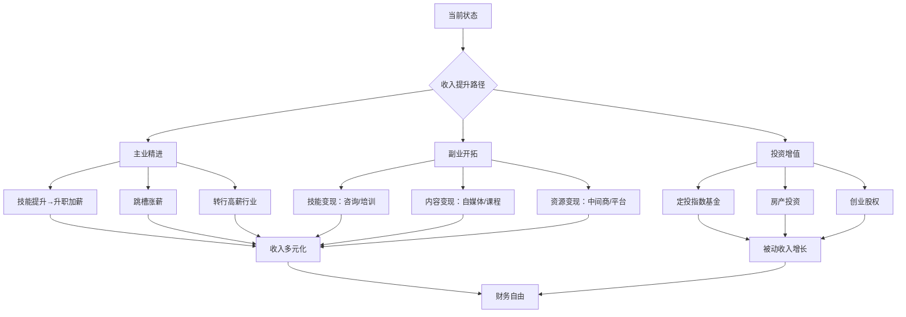

## 零、人生财务规划实操框架

本节是核心技巧篇的总纲。后续的时薪思维、外包策略、路径规划等具体技巧，都嵌套在本框架之中。先建立全局视角，再逐个击破。

### 1. 为什么需要一个实操框架？

大多数人搞钱失败，不是因为不够努力，而是因为没有框架。没有框架的人就像没有地图的旅人——走得很辛苦，但不知道自己在往哪里走。

**没有框架的典型症状：**

- 每个月赚多少花多少，不知道钱去了哪里
- 听说什么赚钱就去做什么，没有主线
- 存了一些钱但不知道怎么让钱生钱
- 觉得"等我有钱了再规划"，但那一天永远不会来
- 焦虑感很强，但行动力很弱，因为不知道该做什么

**有框架的人会怎样：**

- 清楚知道自己当前处于哪个阶段
- 知道下一步该做什么，不会迷茫
- 能区分"看起来紧急"和"真正重要"的事
- 遇到机会能快速判断值不值得投入
- 心态更稳，因为一切都在计划之中

> 💡 框架不是束缚，而是自由。当你知道该做什么的时候，你就自由了——因为你不再被焦虑和迷茫控制。

### 2. 财务规划的核心公式

整个框架可以用一个公式来概括：

```text
财务自由进度 = (被动收入 ÷ 生活支出) × 100%
```

当这个比值达到100%，你就实现了基本的财务自由。超过100%的部分就是你的安全边际。

**拆解这个公式：**

| 变量 | 含义 | 优化方向 |
|------|------|----------|
| 被动收入 | 不需要你亲自劳动就能获得的收入 | 增加：投资收益、租金、版税、股息等 |
| 生活支出 | 维持你想要的生活方式的全部开销 | 降低：砍掉不带来幸福感的支出 |

这两个变量同时优化，财务自由的速度会呈非线性增长。比如：被动收入翻倍 + 支出减半 = 进度提升4倍。

### 3. 四阶段实操框架

#### 3.1 阶段一：财务体检（第1-3个月）

在做任何规划之前，你必须先搞清楚自己的真实财务状况。这就像看病前要先做体检。

**第一步：建立资产负债表**

列出你所有的资产和负债，计算净资产：

| 项目 | 金额（元） | 说明 |
|------|-----------|------|
| **资产** | | |
| 现金及活期存款 | | 随时可动用的钱 |
| 定期存款/理财 | | 有一定锁定期的金融资产 |
| 股票/基金/债券 | | 投资性资产（按当前市值） |
| 房产 | | 自住或投资房产（按当前市价） |
| 车辆 | | 按当前二手市场价 |
| 其他资产 | | 贵金属、收藏品等 |
| **资产合计** | | |
| **负债** | | |
| 房贷余额 | | |
| 车贷余额 | | |
| 信用卡欠款 | | |
| 消费贷/花呗/借呗 | | |
| 其他负债 | | |
| **负债合计** | | |
| **净资产** | | 资产合计 - 负债合计 |

**第二步：建立月度收支表**

连续记账3个月，搞清楚钱从哪里来、到哪里去：

```text
月度收入：
├── 工资/薪金（税后）
├── 副业收入
├── 投资收益
├── 其他收入
└── 月收入合计：____元

月度支出：
├── 固定支出（房贷/房租、保险、通讯）
├── 生活必需（餐饮、交通、水电）
├── 个人发展（学习、书籍、课程）
├── 社交娱乐（聚餐、旅游、爱好）
├── 消费升级（非必需品购物）
├── 其他支出
└── 月支出合计：____元

月结余 = 月收入 - 月支出 = ____元
储蓄率 = 月结余 ÷ 月收入 × 100% = ____%
```

**第三步：计算你的关键指标**

- 净资产 = 资产 - 负债
- 储蓄率 = 月结余 ÷ 月收入
- 财务自由进度 = 被动收入 ÷ 月支出 × 100%
- 负债率 = 总负债 ÷ 总资产 × 100%
- 紧急备用金覆盖率 = 紧急备用金 ÷ 月支出（目标：3-6个月）

**体检结果诊断：**

| 指标 | 危险 | 及格 | 良好 | 优秀 |
|------|------|------|------|------|
| 储蓄率 | <10% | 10-20% | 20-40% | >40% |
| 负债率 | >80% | 50-80% | 20-50% | <20% |
| 紧急备用金 | 0 | 1-2个月 | 3-6个月 | >6个月 |
| 被动收入占比 | 0 | <5% | 5-20% | >20% |

#### 3.2 阶段二：目标设定（第3-6个月）

有了体检数据，就可以设定切实可行的目标。目标必须符合SMART原则：具体（Specific）、可衡量（Measurable）、可实现（Achievable）、相关性（Relevant）、有时限（Time-bound）。

**短期目标（1年内）：**

- 还清高息负债（信用卡、消费贷利率超过8%的）
- 建立3个月紧急备用金
- 储蓄率提升到20%以上
- 开始系统学习投资基础知识
- 记账习惯养成（每天5分钟）

**中期目标（3-5年）：**

- 主业收入提升50%以上（通过升职、跳槽或技能提升）
- 建立至少1个副业收入来源
- 投资资产达到年支出的5倍
- 掌握至少2种投资工具（如指数基金+债券）
- 储蓄率提升到30%以上

**长期目标（10-20年）：**

- 被动收入覆盖基本生活支出
- 净资产达到年支出的25倍（基于4%法则）
- 收入来源不少于3个
- 工作变成选择而非被迫

**目标分解的实操方法：**

以"5年存100万"为例：

```text
目标：5年后净资产达到100万
当前净资产：10万
需要增加：90万
时间：60个月

假设投资年化收益6%：
每月需要存入：约13,500元

拆解路径：
├── 路径A：主业月薪2万，储蓄率67%
├── 路径B：主业月薪1.5万 + 副业月入5000，储蓄率67%
├── 路径C：主业月薪1.2万 + 副业月入8000，储蓄率67%
└── 路径D：主业月薪1万 + 副业月入1.2万 + 投资收益，储蓄率60%

选择哪条路径，取决于你当前的起点和可用资源。
```

#### 3.3 阶段三：执行体系搭建（第6-12个月）

有了目标，需要建立一套自动运转的执行系统，而不是靠意志力。

**（1）自动化财务系统**

```text
发工资当天自动执行：
├── 40% → 定投账户（指数基金/ETF）
├── 10% → 紧急备用金（直到攒够6个月支出）
├── 10% → 自我投资账户（学习、课程、书籍）
├── 30% → 固定支出（房租/房贷、保险、通讯）
└── 10% → 自由支配（社交、娱乐、爱好）
```

这个比例根据个人情况调整，核心原则是"先储蓄后消费"，而不是"花剩下的再存"。

**（2）投资组合入门配置**

| 资产类别 | 配置比例 | 说明 | 适合人群 |
|----------|----------|------|----------|
| 货币基金 | 10-20% | 流动性好，收益低，用于应急 | 所有人 |
| 债券基金 | 20-30% | 收益稳定，波动小 | 保守型 |
| 指数基金（沪深300/中证500） | 30-40% | 长期收益好，波动中等 | 稳健型 |
| 行业基金/个股 | 10-20% | 收益高但风险大 | 进取型 |
| 另类投资（REITs、黄金等） | 5-10% | 分散风险 | 所有人 |

> ⚠️ 以上配置仅为入门参考，实际配置需根据个人风险承受能力和投资经验调整。投资有风险，入市需谨慎。

**（3）关键制度建设**

- **记账制度**：每天花5分钟记录当日收支，月底做一次总结
- **预算制度**：月初设定每个类别的预算上限，超支时有预警
- **复盘制度**：每季度回顾一次财务目标进度，调整策略
- **学习制度**：每月至少读1本理财/投资相关书籍
- **风控制度**：设定投资止损线，不借钱投资，不碰不懂的东西

#### 3.4 阶段四：持续优化与复利加速（第2年起）

当基础系统搭建完成后，重点转向两个方向：提高收入上限和优化投资效率。

**收入增长路径图：**



**复利加速的关键动作：**

1. **技能复利**：选择可叠加的技能组合，而不是孤立地学习。比如编程+数据分析+行业知识，三者叠加的价值远大于三个独立技能
2. **人脉复利**：每月至少认识2个有价值的新朋友，维护10个核心人脉关系
3. **知识复利**：建立个人知识库，定期整理和输出，让知识产生复利
4. **资本复利**：坚持定投，让时间和复利为你工作

### 4. 风险控制体系

搞钱路上最大的风险不是赚不到钱，而是把已有的钱亏掉。

#### 4.1 五层风险防线

| 层级 | 防线 | 目标 | 具体措施 |
|------|------|------|----------|
| 第一层 | 紧急备用金 | 应对突发状况 | 存够6个月生活支出，放在货币基金 |
| 第二层 | 保险保障 | 转移重大风险 | 医保+商业医疗险+意外险+定期寿险 |
| 第三层 | 分散投资 | 降低单一风险 | 不把鸡蛋放在一个篮子里 |
| 第四层 | 投资纪律 | 避免情绪化决策 | 设定止损线，不追涨杀跌 |
| 第五层 | 持续学习 | 避免认知不足的风险 | 投资前先学习，不懂的不碰 |

#### 4.2 绝对不能做的事

- **不借钱投资**：杠杆会放大亏损，一次爆仓可能归零
- **不碰庞氏骗局**：年化收益超过15%且"保本保息"的基本都是骗局
- **不把全部身家押在一件事上**：无论是股票、房产还是创业
- **不忽视保险**：一场大病可能让你多年积蓄化为乌有
- **不做没有退出策略的投资**：买入前就要想好什么时候卖

### 5. 不同人生阶段的框架适配

框架是通用的，但每个人的起点和节奏不同。以下是三种典型情况的适配方案：

#### 5.1 刚毕业（22-25岁）

**核心任务**：建立基础，投资自己

```text
收入分配：
├── 50% → 生活必需
├── 20% → 自我投资（学习、技能提升）
├── 20% → 储蓄和投资
└── 10% → 社交和娱乐

优先级：
1. 养成记账习惯
2. 存下第一个1万（建立信心）
3. 学习投资基础知识
4. 提升主业能力，争取加薪
5. 探索副业可能性
```

**注意事项**：这个阶段投资自己的回报率远高于投资金融市场。花5000元学一门能涨薪的技能，比花5000元买基金划算得多。

#### 5.2 工作3-8年（25-30岁）

**核心任务**：扩大收入，建立投资体系

```text
收入分配：
├── 40% → 生活支出
├── 10% → 持续学习
├── 30% → 投资（指数基金为主）
├── 10% → 紧急备用金
└── 10% → 享受生活

优先级：
1. 主业收入突破月1.5-2万
2. 储蓄率达到30%以上
3. 建立定投习惯
4. 尝试副业，找到适合自己的模式
5. 开始学习资产配置
```

#### 5.3 工作8年以上（30岁+）

**核心任务**：优化资产配置，加速被动收入

```text
收入分配：
├── 30% → 生活支出
├── 5% → 持续学习
├── 45% → 投资（多元化配置）
├── 10% → 保险和风险对冲
└── 10% → 享受生活

优先级：
1. 投资组合优化，降低波动
2. 被动收入目标设定（年支出的20%→50%→100%）
3. 考虑房产、创业等大类资产
4. 子女教育基金规划
5. 退休规划启动
```

### 6. 常见的框架执行陷阱

| 陷阱 | 表现 | 解决方案 |
|------|------|----------|
| 完美主义 | "等我赚到XX万再开始规划" | 现在就开始，哪怕每月只存500元 |
| 急于求成 | 想3年实现财务自由 | 设定合理预期，5-15年是正常周期 |
| 只规划不执行 | 画了漂亮的表格但从不填 | 从最简单的记账开始，养成习惯 |
| 跟风投资 | 别人买什么就买什么 | 建立自己的投资逻辑，不懂不碰 |
| 忽视主业 | 花大量时间搞副业 | 主业是基本盘，副业是锦上添花 |
| 过度节俭 | 为了存钱牺牲所有享受 | 储蓄率40%已经很优秀，不必苦行僧 |

### 7. 框架的动态调整

财务规划不是一成不变的。每年至少做一次全面复盘，根据以下变化调整框架：

- **收入变化**：加薪、跳槽、失业、创业
- **家庭变化**：结婚、生子、离婚、赡养父母
- **市场变化**：牛市、熊市、利率调整、政策变化
- **目标变化**：人生目标随年龄和阅历改变
- **风险偏好变化**：年轻时可以激进，年长时需要稳健

**年度复盘清单：**

1. 回顾年初设定的财务目标，完成了多少？
2. 计算今年的储蓄率、投资收益率、净资产增长率
3. 评估投资组合表现，是否需要再平衡？
4. 检查保险覆盖是否足够？
5. 更新未来3-5年的财务目标
6. 制定下一年的具体行动计划

### 8. 本节核心要点

1. 财务规划的终极公式：财务自由进度 = 被动收入 ÷ 生活支出
2. 四阶段框架：财务体检 → 目标设定 → 执行体系 → 持续优化
3. 先储蓄后消费，自动化是关键——不靠意志力靠系统
4. 五层风险防线：备用金 → 保险 → 分散 → 纪律 → 学习
5. 不同人生阶段适配不同策略，但框架逻辑不变
6. 每年至少复盘一次，动态调整
7. 最大的风险不是慢，而是不动

> 📌 **框架是起点，不是终点。** 读完本节后，请根据自己的实际情况填写上面的表格和模板，然后用后续章节的具体技巧来执行。知道和做到之间，差的就是这一步。
