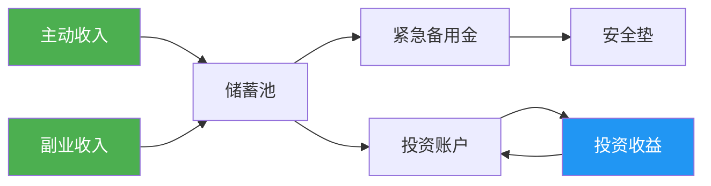
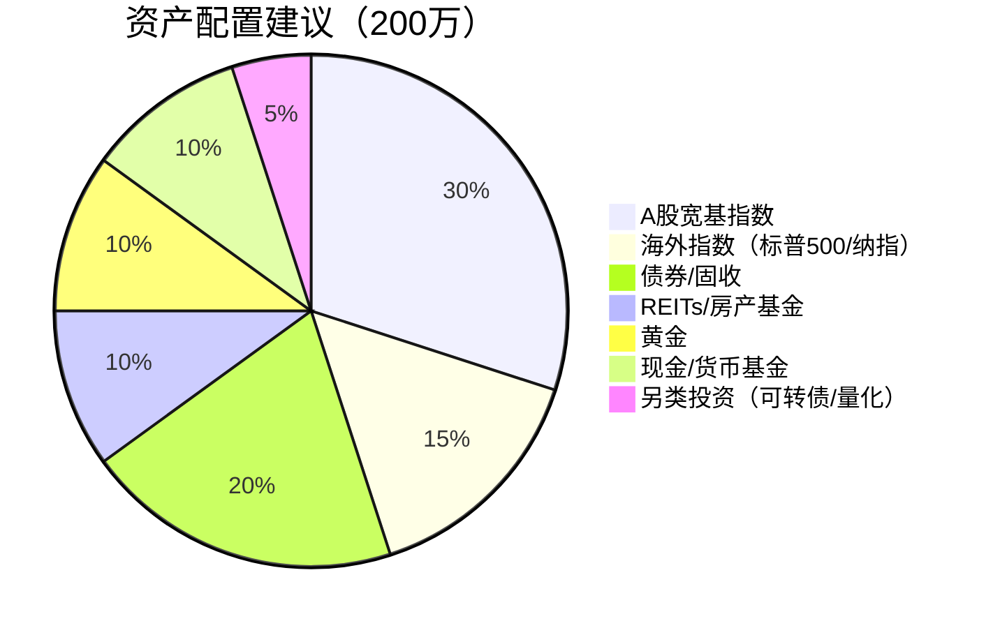
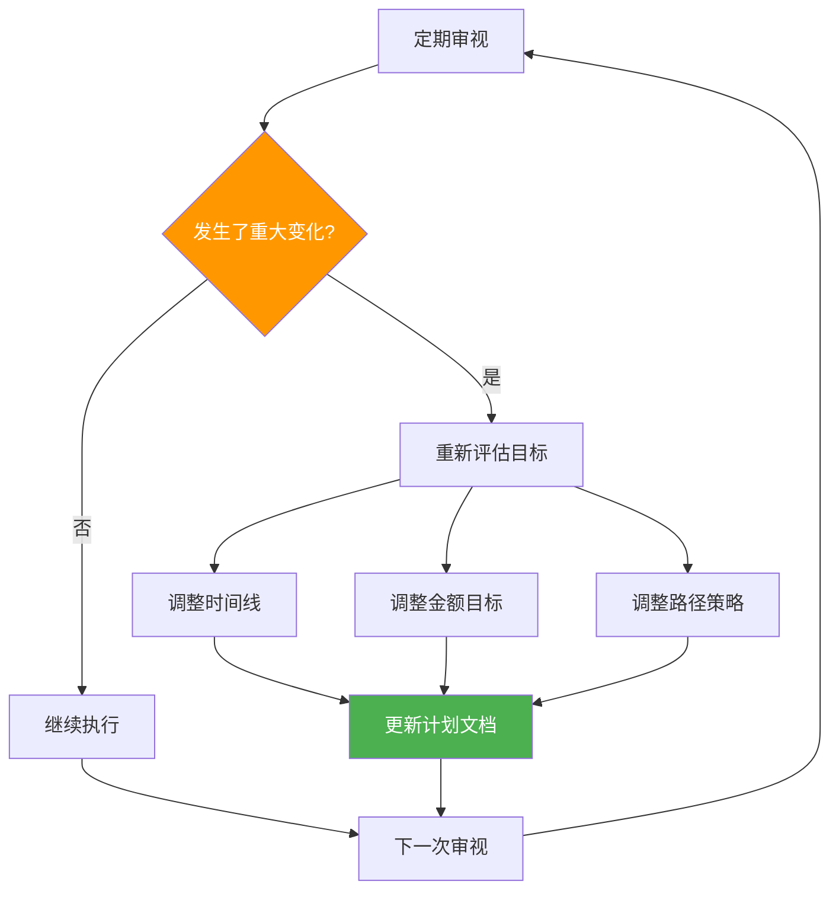

## 技巧三：财务自由路径规划

财务自由不是一夜之间发生的，它是一场需要精确规划、分阶段推进的长期战役。前面的理论基础部分已经定义了财务自由（被动收入≥生活支出）和4%法则的数学基础，本节的核心任务是：**把抽象的财务自由目标拆解成可执行的五年、十年、二十年行动计划**。

很多人失败的原因不是目标太高，而是路径太模糊。"我要财务自由"是一句口号，"我需要在第5年末净资产达到100万，储蓄率从20%提升到40%，同时建立一个年化收益8%的投资组合"——这才是一个可执行的规划。

### 3.1 规划前的自我诊断

在制定任何计划之前，你必须先搞清楚自己站在哪里。盲目制定目标而不了解起点，就像在没有GPS的情况下设定目的地——大概率会走弯路。

#### 3.1.1 财务体检清单

```markdown
## 个人财务体检表

### 收入侧
- 月税后收入：______ 元
- 收入构成：主业______% + 副业______% + 投资______% + 其他______%
- 收入稳定性：稳定/波动较大/季节性
- 收入增长趋势：过去3年年均增长率______%

### 支出侧
- 月均总支出：______ 元
- 固定支出（房租/房贷/保险/教育）：______ 元
- 弹性支出（餐饮/娱乐/购物/旅行）：______ 元
- 隐性支出（冲动消费/社交应酬/情绪消费）：______ 元

### 资产侧
- 现金及活期：______ 元
- 定期存款/货币基金：______ 元
- 投资资产（股票/基金/债券）：______ 元
- 房产净值（市值-贷款余额）：______ 元
- 其他资产：______ 元

### 负债侧
- 房贷余额：______ 元（月供______元，剩余______年）
- 车贷余额：______ 元
- 信用卡/消费贷：______ 元
- 其他负债：______ 元

### 关键指标
- 净资产 = 总资产 - 总负债 = ______ 元
- 储蓄率 = (收入-支出) / 收入 = ______%
- 负债收入比 = 月还款额 / 月收入 = ______%
- 紧急备用金覆盖月数 = 现金储备 / 月支出 = ______ 个月
```

#### 3.1.2 财务健康度评级

| 指标 | 危险 | 警戒 | 健康 | 优秀 |
|------|------|------|------|------|
| 储蓄率 | <10% | 10-20% | 20-40% | >40% |
| 负债收入比 | >50% | 30-50% | 20-30% | <20% |
| 紧急备用金 | <1个月 | 1-3个月 | 3-6个月 | >6个月 |
| 投资占比 | 0% | <10% | 10-30% | >30% |
| 收入来源数 | 1个 | 2个 | 3个 | ≥4个 |

**诊断结果决定了你的起点阶段：**

- **危险区**：先止血。停止一切非必要支出，优先消除高息负债，建立1个月紧急备用金。此时不适合做任何投资，全部精力放在"开源节流"上。
- **警戒区**：打基础。建立完整记账体系，偿还高息负债，把紧急备用金扩展到3-6个月，开始小额学习投资。
- **健康区**：加速期。加大投资力度，探索副业，提升收入天花板。
- **优秀区**：优化期。优化资产配置，构建被动收入体系，向财务自由冲刺。

### 3.2 五年计划：打地基

五年计划适合处于积累期的年轻人（通常22-30岁），核心目标是：**建立搞钱的基础设施**。这五年不是用来暴富的，而是用来搭建"赚钱-存钱-投资"的完整闭环。

#### 3.2.1 五年计划的底层逻辑

五年计划的本质是解决三个根本问题：

1. **钱从哪里来？**——提升主动收入的能力
2. **钱去了哪里？**——建立对支出的掌控力
3. **钱如何增值？**——启动投资体系

这三个问题的优先级是严格的：先解决收入，再控制支出，最后才是投资。很多人反过来了——收入不高就开始研究股票，结果本金太少收益微乎其微，还浪费了大量时间精力。

#### 3.2.2 逐年行动路线图

**第1年：财务觉醒年**

核心任务：看清自己的钱去了哪里，建立财务基线。

| 季度 | 行动项 | 完成标志 |
|------|--------|----------|
| Q1 | 开始记账（用随手记/MoneyWiz等工具） | 连续记账90天不断 |
| Q2 | 分析支出结构，砍掉30%非必要支出 | 月支出下降15%以上 |
| Q3 | 建立"三个账户"体系（日常/储蓄/投资） | 工资到账自动分流 |
| Q4 | 存下第一个紧急备用金（3个月支出） | 账户中有一笔不动的钱 |

"三个账户"体系的具体操作：工资到账当天，自动转账——50%进日常账户（日常开销），30%进储蓄账户（紧急备用金/短期目标），20%进投资账户（长期增值）。比例可以根据实际情况调整，但核心原则是**先存后花，自动化执行**。

**第2年：收入跃升年**

核心任务：通过升职、跳槽或技能变现，把主业收入提升20%以上。

具体行动：

- **能力盘点**：列出自己当前的可市场化的硬技能（编程、设计、写作、数据分析等）和软技能（沟通、项目管理、销售等），评估每项技能的市场价值。
- **薪资调研**：在Boss直聘、脉脉等平台查询同岗位薪资区间，明确自己与市场价的差距。
- **提升路径选择**：
  - **升职路线**：主动承接高可见度项目，向上管理，每季度与leader做一次职业发展对话
  - **跳槽路线**：在现有岗位积累18个月以上经验后，目标薪资涨幅30%以上的offer
  - **技能变现路线**：利用业余时间做自由职业/咨询/培训，验证市场化能力
- **投资入门**：阅读《指数基金投资指南》（银行螺丝钉）或《小狗钱钱》（入门），开设证券账户，用小金额（每月500-1000元）定投沪深300指数基金，体验市场波动。

**第3年：副业探索年**

核心任务：找到第二收入来源，验证"不靠工资也能赚钱"的可能性。

副业选择的评估矩阵：

| 维度 | 权重 | 评估标准 |
|------|------|----------|
| 与主业的协同性 | 30% | 能否复用现有技能和资源 |
| 时间灵活性 | 25% | 能否在主业之余兼顾 |
| 收入天花板 | 20% | 长期能做多大 |
| 启动成本 | 15% | 需要多少前期投入 |
| 护城河潜力 | 10% | 是否容易被复制 |

**高优先级副业方向**（与主业技能强相关）：

- 技术岗：接外包项目、做技术咨询、写技术博客/课程
- 设计岗：UI/UX外包、素材售卖、设计培训
- 运营岗：代运营、自媒体内容创作、社群运营
- 销售岗：代理分销、行业咨询、商务对接

**第4年：体系成型年**

核心任务：副业收入稳定化，投资体系初步成型。

这一年要完成三件事：

1. **副业SOP化**：把副业的工作流程标准化，建立可复制的模板和流程，减少对个人时间的依赖。如果你做自媒体，建立内容日历和选题库；如果你做外包，建立报价模板和项目管理流程。
2. **投资体系搭建**：从"随便买买"升级为系统化投资。建立自己的投资策略文档，包括：
   - 资产配置比例（股债比例、国内/海外比例）
   - 定投纪律（每月几号投、投多少、投什么）
   - 止盈止损规则（收益达到多少减仓、亏损达到多少止损）
   - 再平衡频率（每季度/每半年检查一次）
3. **净资产里程碑**：累计净资产达到50-60万。

**第5年：闭环验证年**

核心任务：验证整个"赚钱-存钱-投资"闭环是否运转良好。



第5年末的验收标准：
- 储蓄率稳定在35%以上
- 投资资产占净资产的40%以上
- 拥有至少2个收入来源
- 净资产达到80-100万
- 有一份完整的投资策略文档
- 紧急备用金覆盖6个月以上支出

#### 3.2.3 五年计划的关键指标追踪

建立月度财务仪表盘，追踪以下核心指标：

| 指标 | 第1年目标 | 第3年目标 | 第5年目标 |
|------|----------|----------|----------|
| 月储蓄率 | ≥20% | ≥30% | ≥35% |
| 收入增长率 | 基线建立 | 年均15% | 年均15%+ |
| 投资品种数 | 1-2种 | 3-4种 | 4-5种 |
| 被动收入占比 | 0% | 2-5% | 5-10% |
| 净资产 | 10万 | 40万 | 100万 |

### 3.3 十年计划：建框架

十年计划适合已完成五年积累的职场人（通常28-38岁），核心目标是：**建立被动收入体系，让钱为你工作**。

如果说五年计划是"用时间换钱"，十年计划就是开始"用钱生钱"的转型期。

#### 3.3.1 十年计划的战略转变

从五年到十年，你需要完成三个关键转变：

| 维度 | 五年计划模式 | 十年计划模式 |
|------|------------|------------|
| 收入结构 | 主业为主（80%+） | 主业+被动收入（60%+20%+20%） |
| 时间分配 | 大量时间投入工作 | 逐步减少工作时间占比 |
| 核心资产 | 技能和人脉 | 投资组合和被动收入流 |
| 风险偏好 | 保守（先保本） | 适度进取（追求增长） |
| 决策逻辑 | 省钱思维 | 资产配置思维 |

#### 3.3.2 分阶段执行策略

**第6-7年：收入突破期**

核心任务：突破收入天花板，投资资产达到200万。

具体行动：

- **主业策略**：此时你已有5-8年经验，是行业中的中坚力量。目标是突破"高级执行者"向"管理者/专家"的跃迁。
  - **管理路线**：争取带团队的机会，管理5-10人团队。管理者的收入天花板通常比纯执行者高50%-100%。
  - **专家路线**：成为细分领域的Top 10%，通过技术影响力获得溢价（技术顾问、独立咨询师）。
  - **创业路线**：如果有合适的时机和团队，可以开始筹备。但注意——创业不是为了逃避打工，而是因为发现了明确的市场机会。
- **副业升级**：把副业从"卖时间"升级为"卖产品/系统"。
  - 写一门课程（放在网易云课堂/知识星球），一次创作持续收益
  - 建立一个付费社群，提供持续价值
  - 开发一个SaaS小工具，自动化解决问题
- **投资进阶**：从定投指数基金扩展到更多资产类别。

**资产配置进阶方案（200万级别）：**



**第8-9年：被动收入成型期**

核心任务：被动收入达到年10万以上，投资资产突破500万。

这个阶段的关键指标是**被动收入/总收入的比值**。目标是从5%提升到20%以上。

被动收入的六大来源及其特征：

| 来源 | 初始投入 | 维护成本 | 稳定性 | 增长潜力 | 适合阶段 |
|------|---------|---------|--------|---------|---------|
| 投资分红/利息 | 高（需大量本金） | 低 | 中 | 中 | 任何时候 |
| 房租收入 | 高（需购房首付） | 中 | 高 | 低 | 有一定积蓄后 |
| 知识产品（课程/书） | 中（时间投入） | 低 | 中 | 高 | 有专业积累后 |
| 数字产品（工具/模板） | 中 | 低 | 中 | 高 | 有技术能力后 |
| 版权/版税 | 中 | 极低 | 低 | 中 | 有创作能力后 |
| 自动化生意 | 高（前期搭建） | 中 | 中 | 高 | 有商业经验后 |

**重点突破方向**：知识产品和数字产品是这个时代性价比最高的被动收入来源。一个录制好的在线课程，可以反复售卖多年；一个好用的Excel模板，可以在闲鱼上持续产生收入。

**第10年：自由临界期**

核心任务：被动收入覆盖基本生活开支，工作变成"选择"。

此时你的财务状态应该是：

- 投资资产：500-800万
- 年被动收入：15-25万（足以覆盖基本生活）
- 年主动收入：50万+（但已不是唯一来源）
- 总净资产：800-1000万

**这个阶段最重要的心态转变**：你不再为钱工作，而是为兴趣、影响力或使命感工作。你可以选择继续做热爱的事业，也可以选择降薪去做更有意义的事情——因为你有了"说不"的底气。

#### 3.3.3 十年计划的关键杠杆

十年计划中，有三个杠杆特别重要：

**杠杆一：投资回报率**

年化8%-12%的长期回报率，可以通过以下组合实现：
- 沪深300指数基金（年化约8-10%，波动大）
- 中证500指数基金（年化约10-12%，波动更大）
- 纯债基金（年化约3-5%，波动小）
- REITs（年化约6-8%，含分红）
- 全球指数基金（分散单一市场风险）

用"核心-卫星"策略：70%配置低费率宽基指数（核心），30%配置行业/主题/另类资产（卫星）。

**杠杆二：复利加速期**

```python
# 复利加速效应演示
# 假设年化收益率10%，每年投入10万
principal = 0
annual_invest = 100000
rate = 0.10

for year in range(1, 21):
    principal = (principal + annual_invest) * (1 + rate)
    interest = principal - annual_invest * year
    print(f"第{year:2d}年 | 总资产: {principal:>12,.0f} | 累计投入: {annual_invest*year:>12,.0f} | 利息收益: {interest:>12,.0f} | 利息占比: {interest/principal*100:.1f}%")
```

输出结果会告诉你：前5年利息收益占比不到20%，到第10年占比约40%，第15年占比超过50%，第20年占比超过60%。**复利的威力在后期才真正爆发，这就是为什么十年计划要坚持到后期才能看到巨大回报。**

**杠杆三：收入阶梯式增长**

十年内的收入增长不是线性的，而是阶梯式的——通过几次关键跃迁实现：

```text
跃迁1：初级→高级（+50-80%，通常在第3-5年）
跃迁2：高级→资深/管理（+40-60%，通常在第6-8年）
跃迁3：资深→专家/高管/创业（+100%+，通常在第9-10年）
```

每次跃迁都需要提前1-2年准备：学习新技能、承担新责任、建立新关系。

### 3.4 二十年计划：实现自由

二十年计划适合想要彻底实现财务自由的人（通常30-50岁），核心目标是：**被动收入完全覆盖理想生活，实现真正的选择自由**。

#### 3.4.1 财务自由的精确计算

前面理论基础部分已经介绍了4%法则和3.5%中国适用版本，这里给出更精确的计算框架：

```python
def calculate_fire_number(annual_expense, withdrawal_rate=0.035, inflation=0.03):
    """
    计算财务自由所需金额
    
    参数：
    - annual_expense: 当前年支出
    - withdrawal_rate: 提取率（中国建议3%-3.5%）
    - inflation: 预期通胀率
    
    返回：财务自由所需金额
    """
    fire_number = annual_expense / withdrawal_rate
    return fire_number

# 不同生活标准下的财务自由金额
scenarios = [
    ("三线城市极简生活", 80000),
    ("二线城市舒适生活", 150000),
    ("一线城市中产生活", 300000),
    ("一线城市高品质生活", 500000),
    ("一线城市富裕生活", 800000),
]

print("=" * 70)
print(f"{'生活标准':<20} {'年支出':>10} {'4%法则':>12} {'3.5%法则':>12}")
print("=" * 70)
for name, expense in scenarios:
    fire_4 = calculate_fire_number(expense, 0.04)
    fire_35 = calculate_fire_number(expense, 0.035)
    print(f"{name:<20} {expense:>10,} {fire_4:>12,.0f} {fire_35:>12,.0f}")
print("=" * 70)
```

**不同城市层级的财务自由参考金额：**

| 生活标准 | 年支出 | 4%法则金额 | 3.5%法则金额 | 月被动收入需求 |
|----------|--------|-----------|-------------|--------------|
| 三线极简 | 8万 | 200万 | 229万 | 6,700元 |
| 二线舒适 | 15万 | 375万 | 429万 | 12,500元 |
| 一线中产 | 30万 | 750万 | 857万 | 25,000元 |
| 一线高品质 | 50万 | 1,250万 | 1,429万 | 41,700元 |
| 一线富裕 | 80万 | 2,000万 | 2,286万 | 66,700元 |

#### 3.4.2 二十年里程碑体系

二十年是一段漫长的旅程，需要设置清晰的里程碑来保持动力和方向感：

| 年份 | 净资产目标 | 被动收入/年 | 储蓄率 | 核心任务 | 心理状态 |
|------|-----------|------------|--------|---------|---------|
| 第1-3年 | 10-30万 | 几乎为零 | 25-35% | 打基础、建体系 | 挣扎期：看不到明显效果 |
| 第4-5年 | 50-100万 | 1-3万 | 35-40% | 投资体系成型 | 信心期：开始看到复利 |
| 第6-8年 | 200-400万 | 8-15万 | 40%+ | 被动收入初现 | 加速期：复利效果显现 |
| 第9-10年 | 500-800万 | 20-30万 | 35-45% | 临界点突破 | 自由期：工作变成选择 |
| 第11-15年 | 1000-1500万 | 40-55万 | 30-40% | 资产优化配置 | 从容期：选择权在手 |
| 第16-20年 | 2000万+ | 70万+ | 25-35% | 财富传承规划 | 自在期：完全自由 |

> **重要提醒**：以上数字基于"每年投入10-20万，年化收益率8-10%"的假设。你的实际情况可能更慢或更快，关键是保持方向正确和持续推进。

#### 3.4.3 二十年中的关键转折点

二十年的旅程中有几个关键转折点，处理得好会加速，处理不好会倒退：

**转折点一：第一个100万（通常在第4-6年）**

这是最难的一个里程碑。从0到100万需要最强的纪律和最大的牺牲。一旦突破这个门槛，复利开始明显发力，后续的每100万都会比上一个更快。

突破策略：
- 严格执行储蓄率目标，不惜降低生活标准
- 主动争取加薪/跳槽，不要"等着被认可"
- 把所有意外收入（年终奖、项目奖金）直接投入投资
- 利用副业加速积累

**转折点二：被动收入首次超过月支出（通常在第8-10年）**

这是一个标志性的心理转折点——你第一次意识到"即使不工作也能活下去"。

此时要做的：
- 重新审视自己的投资组合，确保风险可控
- 开始思考"如果不全职工作，我想做什么"
- 不要冲动辞职——先用业余时间探索新方向

**转折点三：净资产超过1000万（通常在第12-15年）**

千万净资产是一个重要的心理门槛，也是财富管理从"积累"转向"保全"的分水岭。

此时需要关注：
- 资产配置多元化（不再过度集中于单一资产）
- 税务规划（合法节税变得越来越重要）
- 保险配置（大额寿险、高端医疗险）
- 遗产规划初步思考

**转折点四：被动收入超过理想生活支出（通常在第15-20年）**

这是真正的财务自由——不仅覆盖基本生活，还能支撑你理想中的生活方式。

### 3.5 不同起点的路径适配

以上计划模板假设了一个"标准起点"，但现实中每个人的起点不同。以下是几种常见场景的路径调整：

#### 3.5.1 高薪但高消费（月薪2万+，储蓄率<10%）

**核心问题**：赚得多但花得更多，生活方式通胀严重。

**路径调整**：
- 第一步不是加薪，而是降支出。目标：3个月内把储蓄率从10%提升到30%。
- 审视所有"升级消费"：高档健身房→普通健身房+户外跑步，品牌衣服→优衣库+基础款，外卖→自己做饭。
- 不需要一步到位，每月砍掉一项大额非必要支出即可。

#### 3.5.2 低薪但节俭（月薪8000，储蓄率40%）

**核心问题**：储蓄率很高但收入基数太小，积累速度慢。

**路径调整**：
- 储蓄率已经很好，不需要进一步压缩。核心任务是提升收入。
- 投资自己的技能回报率远高于投资金融市场。拿出储蓄的20%用于学习（考证、培训、学历提升）。
- 考虑是否需要换城市/换行业——有时候地理套利（从小城市到大城市）或行业套利（从夕阳行业到朝阳行业）能带来收入翻倍。

#### 3.5.3 有房贷压力（月供占收入40%+）

**核心问题**：大量现金流被房贷锁定，灵活性极低。

**路径调整**：
- 首先评估：房贷利率是否高于5%？如果是，考虑提前还款（减少利息支出）。
- 如果利率较低（3-4%），不建议提前还款——把多余的钱投入长期收益率更高的投资。
- 增加收入是唯一根本解法。在房贷压力下，副业不是可选项而是必选项。
- 考虑出租闲置房间（如果有），用租金对冲部分月供。

#### 3.5.4 家庭负担重（赡养父母/养育子女）

**核心问题**：可自由支配的资金有限，且未来支出有不确定性。

**路径调整**：
- 为家庭刚性支出单独建账，不与个人投资混在一起。
- 给父母和孩子配置基础保险（医疗险、意外险），防止大额意外支出击穿财务计划。
- 接受积累速度会比单身时慢的事实，但不要放弃——时间是最好的朋友。
- 夫妻双方共同制定财务计划，收入合并管理效率更高。

### 3.6 路径规划中的常见陷阱

#### 陷阱一：计划完美主义

很多人花几周时间做了一个精美的Excel表格，每个单元格都有公式，每个年份都有预测——然后因为实际情况偏离计划而放弃。

**正确做法**：计划只需要80%准确，重要的是执行和迭代。每季度回顾一次，根据实际情况调整。计划是指南针，不是铁轨。

#### 陷阱二：忽视风险管理

二十年中一定会遇到：经济衰退、行业变动、家庭变故、健康问题。如果没有应急机制，一次意外就可能让十年积累归零。

**必须配置的安全网**：
- 6个月以上的紧急备用金（放在货币基金中，随时可取）
- 定期寿险（覆盖家庭负债+3-5年生活费）
- 重疾险（保额至少50万）
- 医疗险（百万医疗险，年费几百元）

#### 陷阱三：过早享受"自由"

有些人在被动收入刚覆盖基本生活时就辞职享受，结果几年后通胀侵蚀购买力，投资遇到熊市，又不得不重返职场——但此时技能已过时，处境更被动。

**正确做法**：被动收入要超过生活支出至少50%的安全边际后，才考虑完全不工作。例如：月支出1万，被动收入至少要达到1.5万。

#### 陷阱四：路径依赖

在某个行业/公司待久了，会形成"沉没成本谬误"——因为已经投入了太多，所以不愿意离开。但如果这个行业正在衰退，继续投入只是在浪费时间。

**每3年做一次行业健康度评估**：
- 这个行业的市场规模是在增长还是萎缩？
- 行业的利润率趋势如何？
- 技术变革会不会颠覆这个行业？
- 你在这个行业中的竞争力是在增强还是减弱？

#### 陷阱五：孤军奋战

财务规划不应该是独自完成的事情。无论是伴侣、朋友还是社群，有同行者的旅程更容易坚持。

**建议**：
- 与伴侣定期（至少每月一次）进行财务对话
- 加入1-2个理财社群（如雪球、且慢社区）
- 找到一个财务目标相近的"搭子"，互相监督打卡
- 考虑请一位独立理财规划师做年度审查（不是卖产品的那种）

### 3.7 灵活调整：动态规划的思维

二十年的计划不可能一成不变。每隔3-5年，你需要根据以下变量重新校准：



**触发重新评估的事件**：
- 收入变化超过30%（加薪/降薪/失业/创业）
- 家庭结构变化（结婚/离婚/生子）
- 居住城市变化
- 重大健康事件
- 投资组合亏损超过20%
- 行业发生根本性变化

**调整的原则**：
- 缩短目标时间比降低目标金额更好——说明你比预期更优秀
- 降低目标金额不是失败——说明你更了解自己真正需要多少
- 永远不要因为短期挫折而放弃长期规划

### 3.8 本节核心要点

1. **先诊断后规划**：不了解自己的财务现状，任何计划都是空中楼阁。
2. **五年打基础**：建立记账习惯、提升收入、开始投资，形成"赚钱-存钱-投资"闭环。
3. **十年建框架**：从"用时间换钱"过渡到"用钱生钱"，被动收入占比逐步提升到20%以上。
4. **二十年达自由**：被动收入完全覆盖理想生活，工作变成纯粹的选择。
5. **三个关键杠杆**：储蓄率（最大变量）、投资回报率（复利引擎）、收入增长（加速器）。
6. **动态调整**：计划是指南针不是铁轨，每3-5年根据人生变化重新校准。
7. **安全网必备**：紧急备用金+保险配置，防止意外事件击穿长期计划。
8. **第一个100万最难**：突破后复利开始明显发力，保持耐心和纪律。

***
