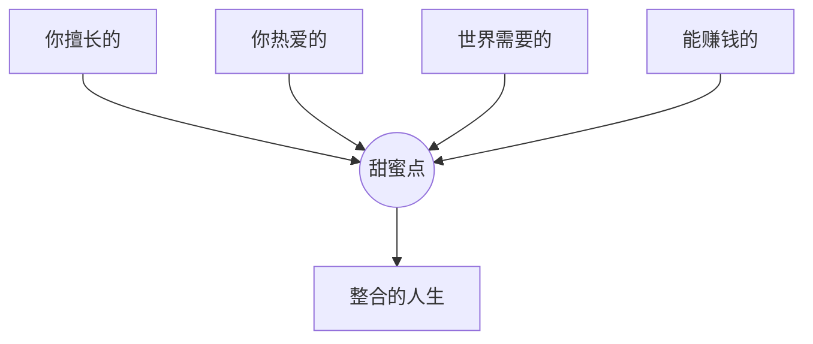

## 技巧四：人生目标与财务目标的平衡

### 为什么需要平衡

大多数人陷入两种极端：一种是"先赚钱再说"，把青春全部押在工作上，等到账户数字达标时才发现身体垮了、关系散了、热情没了；另一种是"人生苦短及时行乐"，把财务规划抛在脑后，到了中年被房贷、教育、养老三座大山压得喘不过气。

这两种极端的本质错误是**把人生目标和财务目标当作二选一的对立关系**。事实上，它们是一枚硬币的两面——财务目标为人生目标提供物质基础，人生目标为财务目标赋予意义和方向。真正的高手不是在两者之间取舍，而是找到**让两者相互促进的耦合点**。

### 4.1 理解"平衡"的本质

#### 4.1.1 平衡不是五五开

很多人把"平衡"理解为各占50%——一半精力搞钱，一半精力生活。这是对平衡最大的误解。

**真正的平衡是动态调整**：在人生的不同阶段，人生目标和财务目标的权重不同。25岁时全力冲事业、70%精力放在财务积累上，这不叫失衡；40岁时把更多时间给孩子和健康，财务进入自动化阶段，这也叫平衡。

平衡的准确定义是：**在当前人生阶段，你分配给财务目标和人生目标的资源（时间、精力、注意力），与你内心真正认同的优先级一致。**

如果一个人嘴上说"家庭最重要"，但每天工作14小时从不陪家人——这就是失衡。如果一个人嘴上说"我想财务自由"，但每个月把工资花光——这也是失衡。**失衡的本质是行为与价值观的错位，而不是某个比例的偏差。**

#### 4.1.2 人生目标的四个维度

人生目标远不止"赚够钱退休"那么简单。一个完整的人生目标体系至少包括四个维度：

| 维度 | 核心问题 | 典型目标举例 | 财务需求 |
|------|---------|------------|---------|
| **事业与成就** | 我想在什么领域留下印记？ | 创业成功、行业专家、作品被认可 | 高（需要启动资金、学习投入） |
| **关系与家庭** | 我想和什么样的人建立深度连接？ | 美满婚姻、亲密亲子关系、深度友谊 | 中（需要时间而非金钱） |
| **健康与活力** | 我想在80岁时还能做什么？ | 无重大疾病、体能保持、心理健康 | 中（健身、饮食、医疗保障） |
| **成长与意义** | 什么让我觉得"活这一辈子值了"？ | 持续学习、帮助他人、精神追求 | 低到中（多数不需要大量金钱） |

**关键洞察**：四个维度之间存在时间竞争关系——你花在加班赚钱上的每一小时，都是从陪伴家人、锻炼身体、自我成长中"借"来的。但同时它们也存在协同关系——健康的体魄让你工作效率更高，良好的家庭关系提供情绪支持让你敢于冒险。

#### 4.1.3 财务目标服务人生目标

财务目标本身不是目的，它是实现人生目标的**工具**。这个认知一旦建立，很多决策就变得清晰：

- "要不要为了高薪去一个我不喜欢的公司？" → 看这笔钱对你当前人生目标的支持程度
- "要不要辞职去追求梦想？" → 看你的财务储备能否支撑到梦想产生收入
- "要不要花5万去旅行？" → 看这次旅行在你人生目标中的价值排序

**做决策时的检验公式**：

```text
这个财务决策 = 花费/收益的经济账 + 对四个维度人生目标的影响评估
```

如果一个决策在经济上划算，但严重损害了健康或家庭关系，那它就是亏的。反过来，如果一个决策"浪费"了一些钱，但极大提升了你的人生体验和成长，那它可能非常值得。

### 4.2 目标冲突的六种典型场景与解法

#### 4.2.1 场景一：高薪但无意义的工作

**冲突本质**：事业成就感 vs 财务安全需求

小王在大厂做后端开发，年薪60万，但每天做的都是重复性的需求迭代，内心极度空虚。他想转行做心理咨询师，但咨询师前期收入极低，可能要3-5年才能达到现在的收入水平。

**解法：桥梁策略**

不要直接跳过去，而是搭一座桥：

1. **在职期间完成转型准备**：利用业余时间考取心理咨询师资格证，完成实习小时数
2. **计算"转型缓冲金"**：预估转型期（2-3年）的收入缺口，提前存够这笔钱。例如，如果转型后第一年收入降到20万，缺口40万，那你需要提前存够40万作为缓冲
3. **渐进式过渡**：先在周末做兼职咨询，验证自己是否真的适合，等兼职收入达到主业的30%-50%时再考虑全职切换
4. **设定止损线**：如果转型2年后收入仍无起色，准备Plan B

**时间规划表**：

```text
阶段1（0-6月）：在职学习 + 存转型缓冲金
阶段2（6-18月）：考证 + 周末兼职 + 建立客户基础
阶段3（18-24月）：兼职收入稳定后，正式辞职转型
阶段4（24-36月）：全职投入，目标收入恢复到之前的50%
```

#### 4.2.2 场景二：创业还是稳定打工

**冲突本质**：事业野心 vs 家庭责任

李哥35岁，有创业想法，但上有老下有小，房贷每月1.5万。老婆反对他辞职创业，觉得风险太大。

**解法：最小风险验证法**

1. **先用MVP验证商业模式**：不辞职，利用晚上和周末做出最小可行产品，看有没有人愿意付钱
2. **设定"创业准入门槛"**：副业月收入达到主业的50%，且连续3个月稳定，才考虑全职
3. **建立家庭安全网**：创业前存够12个月家庭开支 + 房贷，购买充足的保险（重疾险、寿险）
4. **给配偶决策参与权**：让伴侣参与风险评估，而不是单方面通知

#### 4.2.3 场景三：买房还是投资自己

**冲突本质**：长期资产积累 vs 人力资本提升

刚工作3年的小陈存了30万。父母催她买房付首付，但她想用这笔钱去读MBA提升自己。

**解法：量化对比两种选择的长期回报**

用表格对比10年后的预期结果：

| 选项 | 初始投入 | 10年后资产 | 10年后收入 | 风险 |
|------|---------|-----------|-----------|------|
| 买房（二线城市） | 30万首付 | 房产净值约80万 | 不变 | 房价波动 |
| 读MBA | 30万学费+2年机会成本 | 存量较少但收入提升 | 预期提升50-100% | 学成后能否兑现 |

**决策关键**：如果你所在的行业学历和人脉确实能带来阶梯式收入跳跃（如金融、咨询、科技管理），MBA的长期回报可能更高。如果你的行业更看重经验和技能，买房锁定资产可能更稳。

#### 4.2.4 场景四：生孩子的时机

**冲突本质**：家庭目标 vs 事业/财务积累

很多年轻夫妻在"先立业还是先要娃"之间纠结。生孩子意味着至少一方的职业会中断1-3年，同时增加大量开支。

**解法**：

1. **财务准备清单**：
   - 存够生育相关费用（产检+生产+月子中心/月嫂，约3-10万）
   - 存够一方1-2年不工作的生活费
   - 购买母婴保险
   - 预估孩子第一年开支（约3-6万/年，含奶粉、尿布、医疗）

2. **职业准备**：
   - 在怀孕前完成关键晋升或项目，避免在职业关键期中断
   - 提前规划产后复出路径
   - 与公司确认产假政策和弹性工作安排

3. **时间窗口分析**：女性25-35岁是生育黄金期，也是事业上升期。没有完美时机，但有"足够好"的时机——当财务准备清单完成60%以上，就可以考虑。

#### 4.2.5 场景五：赡养父母与自我发展

**冲突本质**：孝道义务 vs 个人财务目标

小林月薪1.5万，每月给父母3000，自己还要还房贷、存钱结婚。感觉永远存不下钱。

**解法：结构化赡养方案**

1. **明确赡养的"底线"和"弹性"**：底线是父母的基本生活保障（衣食住行医），弹性是改善型需求（旅游、娱乐）。底线必须满足，弹性量力而行
2. **建立赡养专项账户**：每月固定存入一定比例（建议收入的10%-15%），专款专用
3. **帮父母配置保险**：医疗险、意外险，用小额保费转移大额医疗风险
4. **提升父母的自生能力**：帮父母学习理财、寻找适合老年人的收入来源，而不是简单给钱

#### 4.2.6 场景六：消费享受与储蓄积累

**冲突本质**：当下生活品质 vs 未来财务安全

"人生苦短，何必亏待自己"和"省下每一分钱"之间，如何找到平衡？

**解法：价值观预算法**

不是简单砍掉所有享受开支，而是**把钱花在你真正看重的地方**：

1. 列出你最看重的5项生活体验（例如：旅行、美食、阅读、运动、社交）
2. 对这5项大方花钱，其他方面极致精简
3. 用"时薪换算法"评估消费：一件500元的衣服 = 你工作X小时，值得吗？

```text
价值观预算分配示例：
  必要开支（房租/房贷、饮食、交通）：50%
  储蓄与投资：30%
  价值观消费（你最看重的体验）：15%
  自由支配（纯粹的"想要"）：5%
```

### 4.3 目标平衡的系统化工具

#### 4.3.1 年度人生平衡轮

每年年初画一个"平衡轮"，评估自己在四个维度的满意度（1-10分）：

**年度人生平衡轮示例**：

| 维度 | 25岁小王 | 35岁李哥 | 45岁张姐 |
|------|---------|---------|---------|
| 事业 | 8 | 7 | 6 |
| 财务 | 3 | 7 | 8 |
| 健康 | 8 | 5 | 4 |
| 家庭 | 6 | 6 | 7 |
| 学习 | 7 | 5 | 5 |
| 社交 | 6 | 4 | 5 |
| 娱乐 | 7 | 3 | 4 |
| 精神 | 5 | 5 | 6 |
| **平均** | **6.3** | **5.3** | **5.6** |

> 小王健康和事业高但财务低——典型年轻人状态；李哥财务起来了但健康和娱乐严重下滑——需要调整；张姐各方面相对均衡但健康开始下降——需要重点关注。

**实操方法**：

1. 画一个圆，分成8份（8个维度更细致：事业、财务、健康、家庭、社交、学习、娱乐、精神）
2. 每个维度打1-10分，从圆心向外画线
3. 连接所有点，形成一个多边形
4. 多边形越接近圆形 = 越平衡；某个方向特别凹陷 = 需要重点关注

**打分标准参考**：

| 分数 | 含义 | 对应状态 |
|------|------|---------|
| 1-3 | 严重不满意 | 已经影响到日常生活和情绪 |
| 4-5 | 有待改善 | 知道问题但还没行动 |
| 6-7 | 基本满意 | 能接受，但有提升空间 |
| 8-9 | 非常满意 | 这方面运作良好 |
| 10 | 理想状态 | 几乎不需要操心 |

#### 4.3.2 季度目标对齐检查

每个季度花1-2小时做一次"目标对齐检查"：

**检查清单**：

```text
□ 本季度我的时间主要花在了哪些方面？（实际数据，不是感受）
□ 这些时间分配与我的人生优先级一致吗？
□ 我的财务目标进展如何？（储蓄率、收入增长、投资回报）
□ 我的非财务目标进展如何？（健康指标、关系质量、学习成长）
□ 有没有哪个维度严重滞后？原因是什么？
□ 下个季度需要调整什么？
```

**时间审计方法**：

记录一周的时间使用情况（可以用手机App如aTimeLogger），然后分类汇总：

| 类别 | 本周用时 | 目标用时 | 差距 |
|------|---------|---------|------|
| 工作 | 55h | 45h | +10h（加班过多） |
| 陪伴家人 | 8h | 15h | -7h（严重不足） |
| 运动 | 1h | 4h | -3h |
| 学习 | 2h | 5h | -3h |
| 社交 | 3h | 3h | 0（达标） |

看到差距后，下一步就是制定调整计划。

#### 4.3.3 目标冲突决策矩阵

当两个目标冲突时，用这个矩阵做决策：

| | 人生目标重要性高 | 人生目标重要性低 |
|---|---|---|
| **财务影响大** | 寻找第三选项（两者兼顾的创新方案） | 优先财务目标 |
| **财务影响小** | 优先人生目标 | 可以忽略，不值得纠结 |

**"第三选项"思维**：大多数目标冲突并非真正的零和博弈。通过创造性思考，往往能找到两者兼顾的方案：

- "加班赚钱" vs "陪孩子" → 提升工作效率，在正常工作时间内完成任务
- "创业" vs "稳定收入" → 先做副业验证，保留主业收入
- "投资自己" vs "存钱" → 选择投入产出比高的学习方式（免费/低成本资源）
- "享受生活" vs "省钱" → 找到低成本但高品质的生活方式

### 4.4 不同人生阶段的平衡策略

#### 4.4.1 20-30岁：侧重财务积累，兼顾探索

**推荐分配**：财务目标70% / 人生目标30%

**为什么侧重财务**：这是你精力最充沛、试错成本最低的阶段。没有房贷、没有孩子、父母尚在壮年，你的"财务自由度"是人生中最高的。利用这段时间建立财务基础，后面的路会宽很多。

**具体策略**：
- 主业全力以赴，追求收入的快速增长
- 用20%的业余时间探索兴趣和副业方向
- 保持运动习惯，这个阶段养成的习惯会影响一生
- 社交不用刻意拓展，但维护好核心关系
- 允许自己"浪费"一些钱在体验上——旅行、尝试新事物

**警惕**：不要因为年轻就忽视健康。20多岁熬夜、不运动的代价，会在35岁以后集中爆发。

#### 4.4.2 30-40岁：逐步向人生目标倾斜

**推荐分配**：财务目标55% / 人生目标45%

**为什么开始倾斜**：这个阶段通常已经成家、有孩子，家庭责任急剧增加。同时，如果你在20-30岁做了正确的积累，财务上已经有了基础，不需要再像之前那样拼命。

**具体策略**：
- 财务进入"自动化"阶段：定投、自动化储蓄、被动收入开始增长
- 把更多时间分配给家庭和健康
- 事业上从"拼体力"转向"拼策略"——用经验和资源赚钱，而不是用时间换钱
- 开始思考人生意义的问题：我到底想要什么样的生活？

**关键转换**：从"用时间换钱"到"用系统赚钱"。建立不再依赖你亲自出力的收入来源。

#### 4.4.3 40-50岁：以人生目标为主导

**推荐分配**：财务目标40% / 人生目标60%

**为什么可以以人生为主**：如果你在前20年做了正确的事，此时被动收入应该已经相当可观。财务不再是主要压力，你可以把更多精力放在真正重要的事情上。

**具体策略**：
- 重新审视人生目标：孩子长大了，你想做什么？
- 关注健康：定期体检、坚持运动、管理压力
- 社交关系质量比数量重要：深度维护5-10个核心关系
- 考虑回馈社会：指导年轻人、参与公益
- 财务上以保全为主，不再追求高风险高回报

#### 4.4.4 50岁以上：人生目标主导

**推荐分配**：财务目标25% / 人生目标75%

**核心任务**：确保退休后的财务安全，把主要精力放在健康、关系、精神追求上。

**具体策略**：
- 财务以稳健为主：降低投资风险，确保现金流稳定
- 制定详细的退休财务计划
- 关注健康成为"全职工作"
- 培养退休后的兴趣和社交圈
- 思考遗产规划和代际财富传承

### 4.5 平衡的敌人：常见的失衡模式

#### 4.5.1 "工作狂"模式

**症状**：每天工作12小时以上，休息日也在想工作，把加班当作勤奋的证明。

**代价**：健康恶化、家庭关系疏远、创造力下降、最终可能因身体原因被迫停下来。

**破解**：
- 设定硬性的下班时间，到点就走
- 区分"真忙"和"假忙"——很多人加班只是因为白天效率低
- 用产出而非工时衡量自己的价值
- 强制安排"不工作"的时间——运动、陪家人、发呆

#### 4.5.2 "及时行乐"模式

**症状**：月光族，觉得存钱没意义，活在当下最重要。

**代价**：中年危机、没有抗风险能力、被迫做不想做的工作。

**破解**：
- 先自动化储蓄，再消费（发工资当天自动转走30%）
- 想象一下60岁的自己，会不会感谢现在的决定
- 不是不让你享受，而是享受的同时也要为未来做准备

#### 4.5.3 "完美主义"模式

**症状**：等到条件完美才行动——"等我存够100万就去旅行""等我退休就学画画"。

**代价**：永远在等，永远没有开始，人生在等待中流逝。

**破解**：
- 接受"不完美的开始"：70%准备好就可以行动
- 把大目标拆成小步骤：不需要等存够100万，今年先存10万，明年去一次短途旅行
- 记住：做了后悔，远好过没做后悔

#### 4.5.4 "比较焦虑"模式

**症状**：看到别人赚得更多、过得更好就焦虑，不断调整自己的目标。

**代价**：永远不满足，忽视自己已经拥有的，做出不理性的决策。

**破解**：
- 关注自己的进步轨迹，而不是与别人横向比较
- 减少社交媒体使用：朋友圈里的生活都是精修过的
- 定期回顾自己一年前的状态，你会发现进步其实很大

### 4.6 建立你的"平衡操作系统"

#### 4.6.1 核心原则

1. **定期审视**：至少每季度做一次人生平衡检查
2. **允许失衡**：短期内的失衡是正常的，关键是知道什么时候该调整
3. **与伴侣/家人同步**：人生目标不是你一个人的事，需要家庭成员的共识
4. **写下来**：模糊的想法不如白纸黑字的计划。把你的年度目标、季度目标写下来，贴在显眼的地方

#### 4.6.2 年度平衡计划模板

```markdown
# 2026年度人生平衡计划

## 人生目标（按优先级排序）
1. 【家庭】每周至少3天在7点前回家陪孩子
2. 【健康】体重维持在70kg以下，每周运动3次
3. 【财务】年储蓄率达到40%，投资收益目标8%
4. 【成长】完成XX课程/认证
5. 【社交】每月至少1次深度社交

## 季度里程碑
Q1：完成XX认证 + 建立运动习惯
Q2：副业收入达到XX + 家庭旅行1次
Q3：投资组合调整 + 孩子暑期活动安排
Q4：年度复盘 + 明年规划

## 不做的事（也很重要）
- 不接超过XX万以下的项目（时薪思维）
- 不在周末处理工作消息
- 不为了省钱而牺牲健康饮食
```

#### 4.6.3 紧急调整信号

当以下信号出现时，说明你的平衡已经严重失衡，需要立即调整：

| 信号 | 可能的失衡方向 | 紧急行动 |
|------|--------------|---------|
| 连续失眠或睡眠质量极差 | 工作压力过大 | 暂停新项目，就医检查 |
| 孩子说"爸爸/妈妈从来不陪我" | 家庭时间严重不足 | 立即调整工作时间 |
| 信用卡账单逐月递增 | 消费失控 | 冻结非必要开支1个月 |
| 连续3个月没运动 | 健康被忽视 | 从每天走路30分钟开始 |
| 和伴侣频繁争吵 | 关系紧张 | 安排一次深度沟通或咨询 |
| 对工作完全提不起兴趣 | 职业倦怠 | 考虑休假或职业调整 |

### 4.7 高阶思考：从平衡到整合

#### 4.7.1 超越平衡——追求整合

"平衡"隐含着一个假设：人生目标和财务目标是需要分配的资源。但更高层次的状态是**整合**——让赚钱本身成为实现人生目标的一部分。

**例子**：
- 热爱写作的人成为自媒体创作者 → 赚钱和表达合一
- 热爱运动的人成为健身教练 → 赚钱和健康合一
- 热爱教育的人创办培训公司 → 赚钱和成长合一
- 热爱旅行的人成为旅行博主 → 赚钱和体验合一

**整合的关键**：找到你的"甜蜜点"——你擅长的、你热爱的、世界需要的、能赚钱的，四者的交集。



#### 4.7.2 财务自由之后的人生

很多人只规划到"财务自由"就停了。但真正到达那一天的人，几乎都会面临一个新问题：**然后呢？**

研究表明，退休后如果没有明确的生活目标，人的健康和认知能力会加速衰退。财务自由不是终点，而是**进入人生下一阶段的起点**。

在追求财务自由的同时，就应该思考：
- 财务自由之后，我每天做什么？
- 我想为这个世界留下什么？
- 什么能让我在80岁时依然觉得人生有意义？

这些问题的答案，才是你所有财务规划的终极指北星。

### 4.8 常见误区与纠正

| 误区 | 真相 | 纠正方法 |
|------|------|---------|
| "等我有钱了再追求人生目标" | 很多人生目标不需要钱，而且永远没有"够了"的那一天 | 从今天开始，在现有条件下行动 |
| "平衡就是每天都很均衡" | 平衡是长期的动态过程，不是每天的精确比例 | 以季度为单位评估，而非每天 |
| "赚钱和人生目标一定冲突" | 很多情况下可以找到两者兼顾的方案 | 培养"第三选项"思维 |
| "别人看起来很平衡，我怎么做不到" | 你看到的只是表面，每个人的平衡方式不同 | 专注于自己的节奏 |
| "一旦失衡就完了" | 短期失衡是正常的，关键是及时觉察和调整 | 建立定期检查机制 |
| "财务自由了就自然平衡了" | 财务自由不能自动解决人生意义问题 | 同步规划财务和人生目标 |
