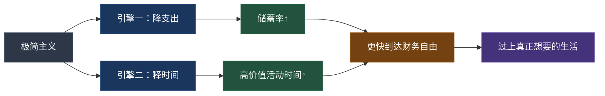
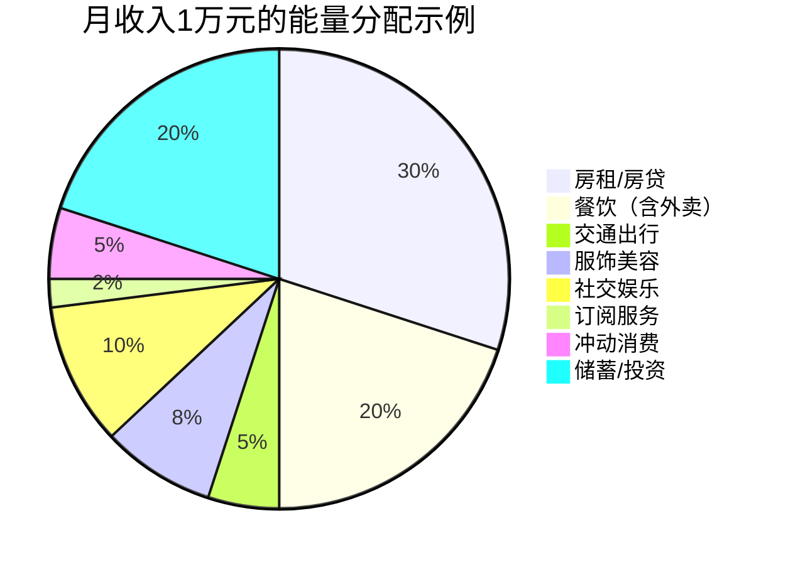
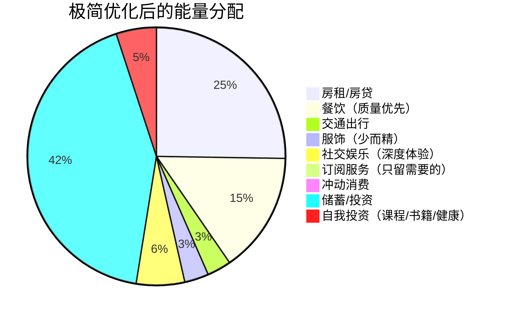

## 技巧五：极简主义与搞钱

> **核心论点：** 极简主义不是"不花钱"，而是"只把钱花在真正重要的地方"。在搞钱的语境下，极简主义是一套双引擎系统——**引擎一**是通过削减无效支出加速储蓄率提升，**引擎二**是通过简化生活释放更多时间和精力用于高价值活动。两者叠加，形成通往财务自由的最短路径。

---

### 1. 为什么极简主义是搞钱的加速器？

#### 1.1 财务自由的数学真相

回顾本章理论基础中的核心公式：

```text
财务自由金额 = 年生活支出 ÷ 提取率
```

基于 4% 法则（中国适用版建议取 3.5%）：

| 年支出 | 4%法则所需资产 | 3.5%法则所需资产 | 差额 |
|--------|---------------|-----------------|------|
| 12万（月均1万） | 300万 | 343万 | 43万 |
| 20万（月均1.67万） | 500万 | 571万 | 71万 |
| 30万（月均2.5万） | 750万 | 857万 | 107万 |
| 50万（月均4.17万） | 1250万 | 1429万 | 179万 |

**关键洞察：** 每减少1万元年支出，你少攒25-29万元就能达到财务自由。这意味着，如果你能把年支出从30万降到20万，你提前到达财务自由的门槛直接降低了250-286万。

这不是理论推演——这是极简主义搞钱的第一性原理。

#### 1.2 储蓄率的杠杆效应

FIRE运动（Financial Independence, Retire Early）的核心发现是：**决定你多久到达财务自由的关键变量不是收入高低，而是储蓄率。**

储蓄率的计算：

```text
储蓄率 = (税后收入 - 支出) ÷ 税后收入 × 100%
```

不同储蓄率下到达财务自由所需年限（假设投资年化回报 7%，通货膨胀 3%，实际回报 4%）：

| 储蓄率 | 到达财务自由所需年限 | 生活方式描述 |
|--------|-------------------|-------------|
| 10% | 约 51 年 | 典型"月光族"水平 |
| 20% | 约 37 年 | 普通储蓄者 |
| 30% | 约 28 年 | 有一定节约意识 |
| 50% | 约 17 年 | 积极极简主义者 |
| 70% | 约 8.5 年 | 激进极简主义者 |
| 80% | 约 5.5 年 | 极端FIRE践行者 |

从 30% 提升到 50%，年限缩短 11 年。从 50% 提升到 70%，再缩短 8.5 年。**储蓄率的边际效用极其惊人。**

而极简主义的核心价值，恰恰就是帮你系统性地提升储蓄率——不是靠压抑欲望，而是靠消除那些"花了钱但没换来幸福感"的支出。

#### 1.3 双引擎模型



**引擎一**的逻辑很直觉：少花钱 → 多存钱 → 更快到达财务自由金额。

**引擎二**的逻辑更深层但同样重要：拥有更少的物品 → 花更少时间打理、维修、整理、决策 → 释放出的时间用于学习、副业、投资、健康 → 收入能力和生活质量双提升。

---

### 2. 极简主义的正确理解：不是省钱，是价值重分配

#### 2.1 极简主义 ≠ 节俭主义

很多人把极简主义等同于"抠门""不消费""过苦行僧生活"。这是最大的误解。

| 维度 | 节俭主义 | 极简主义 |
|------|---------|---------|
| **核心驱动** | 恐惧（怕没钱） | 选择（知道什么重要） |
| **花钱态度** | 能不花就不花 | 只花在真正重要的地方 |
| **物品数量** | 可能囤积便宜货 | 精简到够用的质量好物 |
| **对高价值消费** | 抵触 | 积极投入（教育、健康、体验） |
| **心理状态** | 压抑、焦虑 | 自由、清晰 |
| **长期结果** | 可能省了钱但降低了生活质量 | 提升生活质量的同时存了更多钱 |

极简主义的本质是**价值重新分配**：把资源（钱、时间、注意力）从低价值区域转移到高价值区域。

#### 2.2 价值判断的黄金问题

在做任何消费决策时，问自己以下三个问题：

1. **"如果我已经有这个东西/体验了，我愿意花多少钱来买回它？"** —— 这是"禀赋效应逆向测试"，帮你识别真实价值。
2. **"一年后我会记得这笔消费吗？它会给我带来持续的满足感吗？"** —— 区分即时快感和持久价值。
3. **"这笔钱如果投入指数基金，7年后翻倍，10年后变成3倍，我还会花吗？"** —— 引入机会成本视角。

如果三个问题的答案分别是"不愿意花很多""不会记得""不想花"，那这笔消费大概率是低价值的。

#### 2.3 消费的"能量守恒"模型

把你的税后收入想象成一个固定的"能量池"：



极简主义不改变能量池的大小（不增加收入），而是重新分配流向：



优化后储蓄率从 20% 提升到 42%，同时"自我投资"项从 0 增加到 500 元。**你不仅存了更多钱，还投资了自己的未来赚钱能力。**

---

### 3. 六大支出领域的极简优化实操

#### 3.1 住房：最大的单项支出

住房通常占收入的 25-40%，是极简优化杠杆最大的领域。

**优化策略：**

- **买 vs 租的理性决策**。在中国一线城市，房价租售比普遍在 1:600 到 1:800 之间（即需要 50-67 年租金才能回本），远低于国际通行的 1:200-1:300 健康区间。如果你的工作需要高流动性，或者你所在城市的租售比超过 1:500，租房 + 将差额投资往往比买房更划算。这不是"买不起房"的自我安慰，而是经过数学验证的理性选择。
- **面积够用即可**。人均 25-30 平方米是舒适线，超过这个面积的每一平方米都在增加：房价/租金、物业费、装修费、清洁时间、家具家电投入。一线城市每多 10 平方米，年化多支出 2-5 万元。
- **通勤时间换算成本**。用你的真实时薪（参见"技巧一：建立时薪思维"）计算：每天通勤多 1 小时 × 250 个工作日 × 时薪 100 元 = 年化 2.5 万元的机会成本。住在公司附近多付的租金，可能远低于通勤的时间成本。

**决策公式：**

```text
居住极简值 = 月住房支出 ÷ 月税后收入 × 100%
健康范围：20%-30%
危险线：超过 35%（严重影响储蓄率）
```

#### 3.2 饮食：高频次小金额的累积效应

餐饮是第二大支出项，也是最容易被低估的"温水煮青蛙"式消耗。

**数据对比：**

| 餐饮方式 | 日均花费 | 月均花费 | 年化花费 |
|---------|---------|---------|---------|
| 全部外卖（含奶茶） | 100-150元 | 3000-4500元 | 3.6-5.4万 |
| 工作日外卖+周末自己做 | 60-80元 | 1800-2400元 | 2.2-2.9万 |
| 基本自己做饭+偶尔外食 | 40-60元 | 1200-1800元 | 1.4-2.2万 |

从"全部外卖"切换到"基本自己做饭"，年省 2-3.5 万元。投入的是每晚 30-40 分钟做饭时间，产出的不仅是省钱，还有更健康的饮食。

**极简饮食原则：**

1. **批量备餐**：周末花 2 小时准备 3-5 天的午餐便当，工作日只需加热。
2. **减少决策疲劳**：建立固定的"一周菜单"循环，不用每天想"吃什么"。
3. **戒掉"拿铁因子"**：每天一杯 20 元的奶茶/咖啡，年化 7300 元。改为在家冲泡，成本降至 1000 元以内。
4. **社交餐饮优化**：用"家宴"替代"外食聚餐"——在家请朋友吃饭，成本是餐厅的 1/3-1/5，且社交质量更高。

#### 3.3 物品消费：少而精的消费哲学

**断舍离三步法：**

1. **断（Stop）**：建立"72小时冷静期"规则。任何超过 500 元的非必需消费，放入购物车等待 72 小时。实测数据：约 70% 的冲动消费会在冷静期后被放弃。
2. **舍（Let Go）**：对现有物品进行"一年法则"清理——过去一年没有使用过的物品，大概率未来一年也不会用。将这些物品出售或捐赠。
3. **离（Detach）**：改变购物习惯来源。取关所有带货博主、删除购物App的通知权限、退出"种草群"。信息输入决定了消费欲望的产生频率。

**物品投资矩阵：**

|  | 高使用频率 | 低使用频率 |
|--|----------|----------|
| **高单价** | 值得买好的（如床垫、工作椅、手机） | 考虑租借或购买二手（如相机、露营装备） |
| **低单价** | 买够用的即可（如文具、日用品） | 不买或找替代方案 |

**实践技巧——"一进一出"法则：** 每购入一件新物品，必须淘汰一件旧物品。这不仅防止物品膨胀，还迫使你在购买时思考"我要淘汰哪一件"，从而倒逼消费决策的理性化。

#### 3.4 订阅服务：沉默的消耗者

现代人平均有 8-15 个付费订阅，月均总支出 200-500 元。但实际使用率往往不到 50%。

**审计步骤：**

1. 打开银行/支付宝/微信的自动扣费记录，逐条列出所有订阅项。
2. 对每项过去 30 天的实际使用次数打分：每天用（保留）、每周用（评估）、月用不到 1 次（取消）。
3. 检查是否有功能重叠的订阅（如同时订阅了网易云和QQ音乐）。
4. 对保留项检查是否有更低价的替代方案或年付折扣。

**常见可优化项：**

| 订阅类型 | 常见陷阱 | 优化建议 |
|---------|---------|---------|
| 视频会员 | 同时订了爱奇艺+优酷+B站+腾讯 | 留一个主力，其他按需月订 |
| 云存储 | 订了 200GB 但只用了 30GB | 降级到合适的档位 |
| 健身App | 买了年卡但三个月后就没打开过 | 先月订验证习惯再年订 |
| 工具软件 | 每月付费但免费版功能已够用 | 试用免费替代品（如 LibreOffice 替代 Office 365） |

**预计年省金额：** 普通人审计订阅服务后，通常能砍掉 30-50% 的订阅支出，年省 1000-3000 元。虽然单项金额不大，但这是"零痛苦"的优化——你砍掉的是本来就没在用的东西。

#### 3.5 服饰与个人形象

极简主义在服饰领域的核心理念是**胶囊衣橱**（Capsule Wardrobe）——用有限数量的高品质基础单品，搭配出覆盖所有场景的穿着方案。

**胶囊衣橱构建法：**

1. **色系统一**：选定 2-3 个核心色（如黑、白、灰、藏青），所有单品在此色系内自由搭配。
2. **数量精简**：男性 30-40 件、女性 40-50 件（含鞋、包、配饰），覆盖四季和正式/休闲场景。
3. **品质优先**：用"单次穿着成本"衡量：一件 800 元的高品质大衣穿 200 次 = 4 元/次；一件 200 元的快时尚大衣穿 15 次就起球变形 = 13.3 元/次。便宜的反而更贵。
4. **购买规则**：每添置一件新衣，必须淘汰一件旧衣。用清单购物，不逛商场"随便看看"。

**年化节省估算：** 从"快时尚频繁购买"转向"胶囊衣橱"模式，年省 3000-8000 元，同时穿着质感反而提升。

#### 3.6 数字极简：看不见的财富杀手

数字生活中的隐性消耗往往被严重低估：

- **信息过载导致的注意力税**：每天花 3 小时刷短视频/社交媒体，年化 1095 小时。用你的真实时薪换算（假设 100 元/小时），这是价值 10.95 万元的时间。即使你不能把这些时间全部变现，至少可以把一部分用于副业或学习。
- **算法推荐制造的消费欲望**：短视频平台的"种草→下单"路径越来越短，"3秒心动→一键下单"正在系统性地瓦解你的储蓄计划。
- **碎片化信息降低决策质量**：注意力碎片化 → 意志力损耗 → 更容易冲动消费。

**数字极简实操：**

1. **App 清理**：卸载过去 30 天没有打开过的 App。手机上保留的 App 不超过 2 屏。
2. **通知管理**：只保留通讯类 App 的通知（微信/电话），其他全部关闭推送。
3. **使用时间限制**：设置屏幕使用时间上限（建议社交+娱乐类合计不超过 1.5 小时/天）。
4. **信息源精简**：取关所有"种草"类账号，关注 5-10 个高质量的信息源即可。
5. **消费 App 隔离**：不在手机上安装淘宝/京东/拼多多，只在电脑端有明确需求时打开购买。

---

### 4. 极简主义变现：断舍离的直接收益

极简主义不仅"节流"，还能直接"开源"——通过出售闲置物品获得一笔可观的启动资金。

#### 4.1 闲置物品出售清单

按变现效率排序：

| 物品类别 | 保值率 | 推荐平台 | 注意事项 |
|---------|--------|---------|---------|
| 数码产品（手机、平板、笔记本） | 40-70% | 闲鱼、爱回收、转转 | 越早出手越好，贬值速度最快 |
| 品牌服饰/箱包 | 20-60% | 闲鱼、得物（鉴定后溢价）、红布林 | 有购买凭证和原包装的溢价 30%+ |
| 家具家电 | 20-40% | 闲鱼、58同城 | 大件优先同城面交，省运费 |
| 书籍教材 | 5-15% | 多抓鱼、孔夫子旧书网 | 教材类学期初卖价格最高 |
| 运动/户外装备 | 30-50% | 闲鱼、相关垂直社群 | 保养好的装备保值率惊人 |
| 护肤品/化妆品（全新未拆封） | 60-80% | 闲鱼、小红书 | 有保质期，尽早出手 |

**实操案例：** 一个典型的都市白领做一次全面断舍离，闲置物品出售收入通常在 5000-20000 元。这不是"捡破烂"，而是把你之前错误消费的沉没成本部分回收。

#### 4.2 断舍离的隐性收益

除了直接出售收入，断舍离还有以下隐性收益：

- **空间释放**：少买一件大件家具，可能省下 1-2 平方米的居住空间。在一线城市，这相当于每年省下 1-3 万元的租金/房贷分摊。
- **决策减负**：物品越少，每天花在"找东西""整理""选择穿什么"上的时间越少。研究显示，普通人每天花 15-30 分钟在物品管理上，年化 90-180 小时。
- **清洁成本降低**：物品少→打扫快→或者可以用更小的清洁频率维持整洁。

---

### 5. 极简主义搞钱的进阶策略

#### 5.1 FIRE 运动中的极简流派

FIRE 运动内部有多个流派，其中与极简主义关系最密切的是 **Lean FIRE（精益财务自由）**：

| FIRE流派 | 年支出目标 | 所需资产（3.5%提取率） | 生活方式 |
|---------|----------|---------------------|---------|
| **Lean FIRE** | 12-20万 | 343-571万 | 极简生活，低物欲 |
| **Regular FIRE** | 20-35万 | 571-1000万 | 舒适但不奢侈 |
| **Fat FIRE** | 35万+ | 1000万+ | 维持或提升当前生活水平 |
| **Barista FIRE** | 覆盖大部分支出 | 200-400万 | 半退休，兼职覆盖缺口 |

Lean FIRE 的践行者通常年支出控制在 12-20 万元，通过极简生活方式大幅降低财务自由门槛。在中国的二三线城市，这是一个完全可实现的目标。

**Lean FIRE 的典型生活画像：**

- 住房：自有无贷房产或低成本租房（月 2000-3000 元）
- 餐饮：以自己做饭为主（月 1500-2000 元）
- 交通：公共交通 + 共享单车/电动车（月 200-500 元）
- 娱乐：户外运动、阅读、免费社区活动（月 300-500 元）
- 服饰：胶囊衣橱，按需添置（月均 200-300 元）
- 其他：保险、通讯、杂项（月 500-1000 元）
- **合计：月 5000-8000 元，年 6-9.6 万元**

#### 5.2 极简创业：低成本商业模式

极简主义不仅适用于个人消费，还能指导创业方向——**用最少的投入验证商业模式**。

**极简创业原则：**

1. **最小可行产品（MVP）先行**：不要在产品完善前投入大量资金。用最低成本做出能验证核心假设的产品原型。
2. **零库存/轻资产模式优先**：数字产品（课程、电子书、模板）、服务型业务（咨询、设计、代运营）> 实体产品。
3. **一人企业模式**：在证明需要团队之前，一个人 + AI 工具 + 外包协作就能运营。避免过早雇人带来的固定成本。
4. **复购率 > 客单价**：选择能产生持续收入的商业模式（订阅制、会员制、长期服务），而不是一锤子买卖。

**极简创业 vs 传统创业对比：**

| 维度 | 传统创业 | 极简创业 |
|------|---------|---------|
| 启动资金 | 10-100万+ | 0-2万 |
| 办公场地 | 租写字楼 | 在家/咖啡馆/共享空间 |
| 团队 | 3-10人起步 | 1人 + 按需外包 |
| 产品开发 | 研发 6-12 个月后上线 | 2-4 周 MVP 快速验证 |
| 失败成本 | 可能负债 | 最多浪费几个月时间 |
| 灵活性 | 掉头困难 | 随时调整方向 |

#### 5.3 时间极简：搞钱者最稀缺资源的优化配置

时间是搞钱者最不可再生的资源。极简主义在时间管理上的应用，比在物品管理上更为关键。

**时间审计方法（一周实验）：**

1. 连续 7 天，每 30 分钟记录一次你在做什么（可以用时间追踪 App 如 Toggl、aTimeLogger）。
2. 将所有活动归类为三档：
   - **高价值**：学习新技能、副业工作、投资研究、锻炼身体、高质量社交
   - **维持性**：通勤、家务、必要采购、日常沟通
   - **低价值**：无目的刷手机、无效社交、过度娱乐、纠结决策
3. 计算各档占比。大多数人的结果是：高价值 < 20%，维持性 ~40%，低价值 > 40%。

**优化方向：**

- **低价值时间 → 削减**：设定手机使用时间限制，退出无意义群聊，拒绝"面子社交"。
- **维持性时间 → 压缩/外包**：批量采购（减少购物次数）、自动化（智能家电）、外包（保洁、跑腿）。
- **高价值时间 → 保护**：为高价值活动设置"不可侵犯时间块"，如同保护工作会议一样。

---

### 6. 极简主义搞钱的心理建设

#### 6.1 对抗消费主义的心理防御

消费主义的核心逻辑是：**制造不满足感 → 提供解决方案（购买）→ 短暂满足 → 新的不满足感**。这是一个无限循环的欲望生产线。

**四大心理防御机制：**

1. **需求 vs 想要的分类训练**。每次产生消费冲动时，强制分类：这是"需要"（Need）还是"想要"（Want）？"需要"是维持基本生活和工作效率的，"想要"是被外部刺激激发的欲望。只对"需要"做即时决策，"想要"进入 72 小时冷静期。

2. **社交媒体的"去滤镜"意识**。朋友圈/小红书上展示的是别人生活的"高光片段"，不是全貌。一辆豪车可能背负 50 万贷款，一次高端旅行可能花光三个月积蓄。不拿别人的展示面和自己的日常面比较。

3. **"足够好"心态替代"最优化"心态**。追求"最好的"是一个永远无法满足的目标，因为总有更好的出现。"足够好"是可定义、可到达、可满足的。一双 500 元的运动鞋"足够好"，不必追求 2000 元的限量联名款。

4. **体验 > 物品的价值排序**。心理学研究反复证明：体验性消费（旅行、学习、社交活动）带来的幸福感比物质消费更持久。原因：体验会成为你身份的一部分，而物品只会折旧。

#### 6.2 社交压力与"面子消费"

在中国文化语境下，极简主义面临的最大挑战之一是**社交面子压力**：

- 朋友聚会抢着买单
- 节假日送礼"不能太便宜"
- 看到同龄人买了新车/新房产生焦虑
- 被亲戚问"怎么还租房"时的尴尬

**应对策略：**

1. **找到同频的人**。加入 FIRE 社群、极简主义社群。当你周围的人都在讨论储蓄率而非消费档次时，社交压力自动消解。
2. **坦诚但不解释**。"我在践行极简生活"就够了，不需要向每个人证明这是对的。行动胜于辩论。
3. **将社交活动向低成本高质量方向引导**。提议徒步、骑行、家宴、桌游等低成本高质量的社交方式，替代KTV、高端餐厅。
4. **在真正重要的关系上舍得投入**。极简不是对所有关系一视同仁地"省钱"。对父母、伴侣、挚友的必要花费（健康检查、有意义的礼物、共同体验）该花就花——这些是高价值支出。

#### 6.3 消费降级 vs 生活降级

一个重要的区分：**消费降级不等于生活降级。**

- **消费降级**：把 30 元的外卖换成 15 元的自制便当 → 生活质量可能不变甚至提升（更健康）。
- **生活降级**：为了省钱不吃早餐、取消体检、不维护朋友关系 → 短期省钱但长期代价巨大。

**判断标准：** 如果一项消费削减会导致你的健康受损、核心关系受损、长期赚钱能力受损，那它就不是"极简"，而是"自残"。极简主义削减的是"噪音"，保留的是"信号"。

---

### 7. 极简搞钱的常见误区

#### 误区一：极端节俭就是极简

**表现**：为了追求高储蓄率，吃最差的、穿最旧的、拒绝一切社交消费。

**纠正**：极简主义的目标是**最大化幸福感/支出比**，不是最小化支出。如果你的年支出从 20 万降到 10 万，但幸福感也从 8 分降到 3 分，这是失败的极简。正确的做法是找到"支出-幸福感曲线"的甜蜜点——通常在削减 20-40% 支出时，幸福感不降反升，因为被削减的都是低价值消费。

#### 误区二：极简主义只适合单身/无孩人群

**表现**：认为有家庭、有孩子的人无法践行极简主义。

**纠正**：极简主义在家庭场景下的应用不仅可行，而且收益更大。家庭支出基数更高，优化空间更大。关键调整：
- 家庭共同决策：与伴侣达成共识，避免"一个人极简、另一个人消费"的冲突。
- 孩子的物品管理：用"一进一出"法则管理玩具，用二手平台流转儿童用品（孩子长得快，很多东西用几个月就淘汰了）。
- 教育消费理性化：不盲目报班，聚焦 1-2 个孩子真正有兴趣的领域深耕。

#### 误区三：记账 = 极简

**表现**：每天花 30 分钟详细记账，但消费习惯没有任何改变。

**纠正**：记账是工具，不是目的。记账的真正价值在于**识别优化点**。建议做法：记账 1-2 个月，分析支出结构，找到最大的三个优化点，执行优化，之后只需要每月快速检查一次即可。不要让记账本身变成一种"仪式感消费"（花了时间但没产出）。

#### 误区四：极简主义就是不投资自己

**表现**：为了省钱，拒绝参加付费培训、不买专业书籍、不投入健康。

**纠正**：恰恰相反，极简主义者应该**更舍得在自我投资上花钱**。因为你削减了无效消费，腾出的预算应该优先投入：
- 能提升收入的技能培训（编程、设计、写作、演讲）
- 能保持长期健康的基础投入（体检、运动、优质食材）
- 能扩展认知和人脉的活动（行业会议、高质量社群）

这些是"复利型支出"——今天的投入会在未来产生倍数级回报。

#### 误区五：极简主义是一次性工程

**表现**：做了一次大清理后就认为完成了，此后不再关注。

**纠正**：极简主义是一个**持续的系统**，不是一次性的事件。消费习惯有强大的回归惯性——如果不建立持续的机制，6-12 个月后你的消费水平就会悄悄回到原来的状态。建议：
- 每季度做一次"支出审查"，砍掉新长出来的低价值消费。
- 每半年做一次"物品审查"，清理新积累的闲置物品。
- 每年做一次"订阅审查"，取消不再使用的付费服务。

---

### 8. 极简搞钱执行框架：90天启动计划

将以上内容整合为一个可执行的 90 天行动计划：

#### 第一阶段：认知与审计（第 1-30 天）

**目标：** 建立极简认知基线，完成现状审计。

| 周次 | 行动项 | 预计时间 | 产出 |
|------|-------|---------|------|
| 第 1 周 | 记录所有支出（用 App 或笔记） | 每天 5 分钟 | 完整的支出清单 |
| 第 2 周 | 做时间审计（每 30 分钟记录活动） | 每天 10 分钟 | 时间分配报告 |
| 第 3 周 | 审计订阅服务 + 清理闲置物品 | 集中 3-4 小时 | 取消无效订阅，整理出售清单 |
| 第 4 周 | 计算储蓄率，分析支出结构 | 2 小时 | 财务现状报告 + 优化优先级清单 |

#### 第二阶段：优化与执行（第 31-60 天）

**目标：** 执行高杠杆优化项，建立极简习惯。

| 周次 | 行动项 | 预计节省/收益 |
|------|-------|-------------|
| 第 5 周 | 上架闲置物品出售 + 取消低价值订阅 | 一次性收入 2000-10000元，月省 100-300元 |
| 第 6 周 | 优化餐饮模式（开始批量备餐） | 月省 500-1500元 |
| 第 7 周 | 实施数字极简（App清理、通知管理、使用时间限制） | 释放每天 1-2 小时 |
| 第 8 周 | 整理胶囊衣橱 + 建立"一进一出"规则 | 月省 200-500元（长期） |

#### 第三阶段：巩固与深化（第 61-90 天）

**目标：** 将极简行为固化为自动习惯，开始将节省的资源投入高价值活动。

| 周次 | 行动项 | 预期结果 |
|------|-------|---------|
| 第 9 周 | 将释放的时间分配给一个高价值活动（学习/副业/健身） | 新的高价值习惯建立 |
| 第 10 周 | 将月储蓄增加部分自动转入投资账户 | 储蓄率提升 5-15 个百分点 |
| 第 11 周 | 做第一次季度支出审查 | 识别新的优化点 |
| 第 12 周 | 回顾 90 天数据，制定下季度目标 | 量化的成果报告 |

**90天后的预期成果：**

- 储蓄率提升 10-20 个百分点（从原有基础上）
- 一次性闲置出售收入 3000-15000 元
- 释放每天 1-3 小时的高价值时间
- 减少日常决策疲劳，提升整体生活质量

---

### 9. 工具推荐

| 用途 | 工具 | 说明 |
|------|------|------|
| 记账 | 随手记、MoneyForward、YNAB | 选一个坚持用，不要频繁切换 |
| 闲置出售 | 闲鱼、转转、多抓鱼（书籍） | 拍照+详细描述，定价参考已售价格 |
| 时间追踪 | Toggl Track、aTimeLogger | 做时间审计时使用，平时可关掉 |
| 习惯追踪 | Loop Habit Tracker、Streaks | 追踪极简习惯的执行情况 |
| 订阅管理 | 支付宝/微信自动扣费管理页面 | 每季度检查一次 |
| 投资自动化 | 各券商/基金平台的定投功能 | 将节省的钱自动转入投资 |

---

### 10. 本节核心要点

1. **极简主义是搞钱的双引擎系统**：削减无效支出（提升储蓄率）+ 释放时间（投入高价值活动）。
2. **储蓄率是到达财务自由的关键变量**：从 30% 提升到 50%，到达财务自由的时间缩短 11 年。
3. **极简 ≠ 节俭**：极简是价值重新分配——削减低价值支出，增加高价值投入。
4. **六大支出领域均可优化**：住房（最大杠杆）、餐饮（高频累积）、物品（少而精）、订阅（沉默消耗）、服饰（胶囊衣橱）、数字（注意力保护）。
5. **断舍离能直接变现**：典型闲置出售收入 5000-20000 元。
6. **心理建设是长期工程**：对抗消费主义、社交面子压力、回归惯性，需要持续的意识和机制。
7. **90天启动计划**：审计→优化→巩固，三阶段系统推进。
8. **消费降级 ≠ 生活降级**：削减的是"噪音"（低价值支出），保留的是"信号"（健康、关系、成长）。
