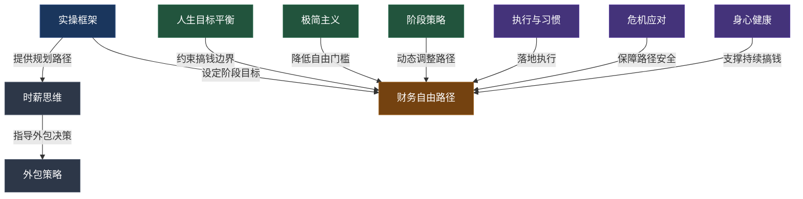

## 本节要点回顾

本节围绕"搞钱与人生规划"展开了九个核心技巧，从思维模式的建立到具体执行的落地，构成了一套完整的人生财务规划方法论。下面逐一回顾每个技巧的核心要点，并梳理它们之间的逻辑关系。

### 1. 实操框架：从宏观到微观的规划路径

人生财务规划不是拍脑袋定个数字，而是一套可执行的系统。实操框架的核心在于三步走：

**第一步：财务体检** —— 搞清楚你现在的财务状况。净资产是多少？每月现金流是正还是负？负债率多少？很多人对自己的财务状况一无所知，就像一个从不体检的人突然被告知身体出了大问题。建议用一张表把资产、负债、收入、支出全部列出来，算出你的"财务健康指数"。

**第二步：目标拆解** —— 把"财务自由"这个大目标拆成5年、10年、20年的阶段性里程碑。每个里程碑都有明确的数字指标：净资产目标、被动收入目标、储蓄率目标。没有数字的目标只是愿望。

**第三步：执行与迭代** —— 制定月度行动计划，每周复盘，每季度深度调整。计划不是写完就放抽屉的，它是一个活的文档，需要根据实际情况不断修正。

### 2. 时薪思维：用"生命能量"衡量一切

时薪思维是搞钱的第一性原理。它的核心观点是：**你花出去的每一分钱，都是用生命能量换来的。**

**计算你的真实时薪：**

```text
真实时薪 = (月薪 - 工作相关支出) ÷ (工作时间 + 通勤时间 + 加班时间 + 下班后处理工作的时间)
```

举个例子：名义月薪15000元，扣除通勤费、应酬费、职业装等支出后实际到手12500元；每天工作10小时加通勤2小时，每月264小时。真实时薪 = 12500 ÷ 264 ≈ 47元。一杯30元的奶茶 = 你工作38分钟的生命。

**时薪思维的三个应用场景：**

1. **消费决策** —— 买一件东西前，换算成你需要工作多少小时。如果一件衣服要你工作8小时，你还想买吗？
2. **外包决策** —— 如果某件事别人做每小时收费30元，而你的真实时薪是100元，那就应该外包出去，把时间花在更高价值的事情上。
3. **时间投资** —— 学习一项新技能、建立一段人脉，本质上是在提高你未来的时薪。

### 3. 外包策略：把低价值时间释放出来

外包不是"偷懒"，而是一种资源优化配置。核心原则是：**只做你时薪高于外包成本的事情。**

**适合外包的事情：**

| 类别 | 具体事项 | 外包成本参考 | 适合人群 |
|------|----------|-------------|---------|
| 家务劳动 | 保洁、做饭、洗衣 | 30-50元/小时 | 时薪>80元的职场人 |
| 行政事务 | 报税、证件办理、跑腿 | 50-100元/次 | 忙碌的创业者 |
| 专业服务 | 法律咨询、财务规划 | 200-500元/小时 | 需要专业支持的人 |
| 技术工作 | 网站建设、设计制图 | 按项目计费 | 有技术需求的个人 |

**外包的注意事项：**

- 先小范围试水，确认质量后再扩大外包范围
- 建立标准化流程文档（SOP），降低沟通成本
- 保留核心能力，不要把关键竞争力外包出去
- 定期评估外包ROI，如果外包后收入增长覆盖不了外包成本，就暂停

### 4. 财务自由路径规划：五年、十年、二十年

这是本节最核心的技巧之一。财务自由不是一夜之间发生的，它需要分阶段、有节奏地推进。

**五年计划（打地基）：**

```text
第1年：财务体检 + 建立记账习惯 + 存下第一个10万
第2年：提升主业收入20% + 学习投资 + 建立3-6个月紧急备用金
第3年：探索副业 + 投资体系初步成型 + 净资产30万
第4年：副业收入稳定 + 主业晋升或跳槽 + 净资产60万
第5年：收入多元化 + 投资组合优化 + 净资产100万
```

**十年计划（建框架）：**

```text
第1-3年：主业收入突破年50万，副业收入达年10万，投资资产达200万
第4-6年：被动收入达年10万，投资资产达500万，考虑创业或合伙
第7-10年：被动收入覆盖基本生活，投资资产达1000万，工作变"选择"
```

**二十年计划（实现自由）：**

核心公式：财务自由金额 = 年支出 ÷ 3.5%（中国适用版，比4%法则更保守）

| 年份 | 净资产目标 | 被动收入/年 | 状态 |
|------|-----------|------------|------|
| 第5年 | 100万 | 3-5万 | 基础建立 |
| 第10年 | 500万 | 15-20万 | 框架成型 |
| 第15年 | 1200万 | 40-50万 | 接近自由 |
| 第20年 | 2000万+ | 70万+ | 财务自由 |

> 以上数字仅为示例，实际目标需根据个人生活成本调整。一线城市和三线城市的财务自由金额差异巨大。

### 5. 人生目标与财务目标的平衡

搞钱不是人生的全部。如果为了赚钱牺牲了健康、家庭、兴趣，那赚到的钱最终会花在弥补这些损失上。

**平衡的四个维度：**

1. **健康账户** —— 每天运动30分钟、定期体检、充足睡眠。健康是1，其他都是后面的0。
2. **关系账户** —— 每周至少一次高质量的家庭时间，维护3-5个核心人脉关系。
3. **成长账户** —— 每年学习一项新技能，每月读2本书，保持认知升级。
4. **意义账户** —— 定期问自己：我做的事情是否有意义？我是否在朝着自己真正想要的方向前进？

**实操建议：**

- 用"人生仪表盘"定期评估四个维度的满意度（1-10分）
- 如果某个维度连续两个月低于5分，立即调整搞钱节奏
- 设定"底线规则"：无论如何不能突破的红线（如每天睡眠不低于6小时、每周至少一天完全休息）

### 6. 极简主义与搞钱

极简主义不是"不花钱"，而是"只花在真正重要的地方"。它与搞钱的关系在于：**降低生活成本 = 降低财务自由的门槛。**

**极简主义的搞钱逻辑：**

- 如果你每月生活开支从2万降到1万，财务自由所需金额直接减半
- 减少不必要的消费 = 减少需要工作的时间 = 更多时间做有意义的事
- 消费降级不等于生活降级，很多高性价比的选择反而提升了生活质量

**实操方法：**

1. **30天冷静期** —— 超过500元的非必需品，等30天再决定是否购买。30天后你还想要，再买。
2. **一进一出原则** —— 买一件新东西，就处理掉一件旧东西。保持物品总量不增长。
3. **体验 > 物质** —— 研究表明，花钱买体验（旅行、学习、社交）比买东西带来更持久的幸福感。
4. **批量采购 + 订阅制** —— 日用品批量购买降低成本，取消不用的订阅服务。

### 7. 不同人生阶段的搞钱策略

搞钱策略不是一成不变的，它需要根据你所处的人生阶段动态调整。

**20-30岁（积累期）：**

- 核心目标：提升人力资本，建立搞钱基础设施
- 关键动作：投资自己（技能学习、学历提升）、建立储蓄习惯、开始小额投资
- 风险承受：高，可以承受较大的投资波动

**30-40岁（增长期）：**

- 核心目标：收入跃升，建立被动收入体系
- 关键动作：主业突破（晋升/跳槽/创业）、多元化收入来源、加大投资力度
- 风险承受：中高，需要平衡家庭责任

**40-50岁（巩固期）：**

- 核心目标：守住财富，加速被动收入积累
- 关键动作：优化资产配置（降低风险）、培养接班人/副业、规划子女教育金
- 风险承受：中等，需要考虑家庭全面保障

**50岁以上（收获期）：**

- 核心目标：财富传承，享受人生
- 关键动作：降低投资风险、规划遗产、发展兴趣爱好、健康管理
- 风险承受：低，以保值为主

### 8. 执行策略与习惯养成

这是从"知道"到"做到"的桥梁。92%的计划失败，不是因为计划不好，而是执行出了问题。

**计划失败的五大原因及对策：**

| 原因 | 表现 | 解决方案 |
|------|------|---------|
| 目标太大 | "今年要存50万"（月入1万） | 把大目标拆成每周可执行的小动作 |
| 缺乏系统 | 只有目标没有行动计划 | 建立每日/每周的习惯系统 |
| 意志力消耗 | 依赖"自律"而非"系统" | 自动化决策，减少意志力消耗 |
| 没有反馈 | 不知道进度如何 | 建立量化追踪机制 |
| 孤军奋战 | 一个人默默执行 | 找到同行者或问责伙伴 |

**自动化决策系统（最关键的实操）：**

- **自动化储蓄**：工资到账当天自动转30%到储蓄/投资账户（先储蓄后消费）
- **自动化投资**：设置每月自动定投指数基金，发工资后第二天执行
- **自动化账单**：房贷、水电、保险设置自动扣款，避免逾期
- **自动化信息**：每日/每周财务新闻推送，避免频繁看盘

**习惯堆叠法**：把新习惯嫁接到已有习惯上。例如：

```text
已有习惯：每月15号发工资
新习惯：发工资当天自动转50%到储蓄账户

已有习惯：每天午饭后散步
新习惯：散步时用记账App记录上午的消费

已有习惯：每周日晚上看电影
新习惯：看完电影后花15分钟复盘本周财务状况
```

**追踪系统：**

- **周度追踪**（每周日15分钟）：本周收入、支出、储蓄、非必要消费占比
- **月度复盘**（每月最后一天30分钟）：储蓄率、投资收益、最大非必要支出、下月调整
- **季度深度复盘**（每季度2小时）：目标进度、策略调整、人生仪表盘评估

### 9. 危机应对与财务韧性

搞钱的路上不可能一帆风顺。真正的财务高手不是从不遇到危机，而是有能力在危机中生存下来。

**财务韧性的三层防线：**

1. **紧急备用金** —— 3-6个月的生活开支，放在货币基金或活期存款中，随时可取。这是你的"财务安全气囊"。
2. **保险配置** —— 重疾险、医疗险、意外险、寿险，用小钱锁定大风险。保险不是投资，是风险管理工具。
3. **收入多元化** —— 不把所有鸡蛋放在一个篮子里。如果主业收入突然中断，副业/投资收入可以撑一段时间。

**危机应对的行动清单：**

- 收入下降20%以上：立即启动"生存模式"，砍掉所有非必要支出
- 失业/收入中断：动用紧急备用金，同时在3个月内找到替代收入来源
- 投资亏损30%以上：不要恐慌抛售，检查投资逻辑是否仍然成立
- 重大疾病/意外：启动保险理赔，调整财务计划

### 10. 搞钱与身心健康

这是最容易被忽视但最重要的一个技巧。没有健康，一切都是零。

**搞钱容易忽视的健康陷阱：**

1. **久坐不动** —— 长期伏案工作导致颈椎、腰椎问题，医疗费用远超运动成本
2. **睡眠不足** —— 为了赚钱熬夜，导致免疫力下降、认知能力降低，反而降低了赚钱效率
3. **压力过大** —— 长期高压导致焦虑、抑郁，需要花钱治疗心理问题
4. **饮食不规律** —— 忙到忘记吃饭或用垃圾食品应付，长期导致慢性病

**健康投资的ROI计算：**

```text
每天运动30分钟的成本：0元（跑步、徒手训练）
每年体检的成本：500-2000元
每晚多睡1小时的机会成本：可能少赚100元

但如果不运动、不体检、睡眠不足：
一次大病的医疗成本：5-50万元
因病误工的收入损失：无法估量
```

**实操建议：**

- 把运动写进日程表，像对待工作会议一样对待它
- 设定"硬性停机时间"：晚上11点后不处理任何工作
- 每年做一次全面体检，40岁以上每半年一次
- 学习基础的心理健康知识，识别压力过大的信号

***

### 九大技巧的逻辑关系



**一句话总结：** 实操框架是骨架，时薪思维是灵魂，外包策略是杠杆，财务自由路径是目标，人生平衡是约束，极简主义是加速器，阶段策略是动态调整，执行习惯是落地保障，危机应对是安全网，身心健康是地基。十个技巧缺一不可，共同构成了"搞钱与人生规划"的完整方法论。

### 自检清单

在进入下一节之前，检查你是否已经完成以下动作：

- [ ] 计算出自己的真实时薪
- [ ] 完成财务体检（净资产、现金流、负债率）
- [ ] 设定5年/10年/20年的财务里程碑
- [ ] 列出可以外包的事项清单
- [ ] 建立自动化储蓄和投资系统
- [ ] 设置每周/每月/每季度的复盘提醒
- [ ] 确保紧急备用金覆盖3-6个月开支
- [ ] 评估自己的健康状态，制定运动计划
- [ ] 用"人生仪表盘"评估四个维度的满意度

如果以上9项中有3项以上未完成，建议先停下来把基础做好，再继续学习后续内容。搞钱是一场马拉松，不是百米冲刺——地基不牢，上面盖得越高，摔得越重。
