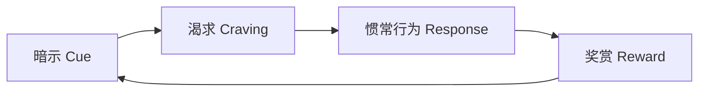
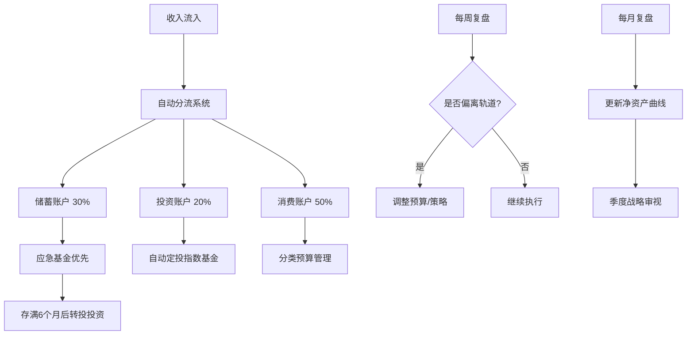

## 技巧七：执行策略与习惯养成

### 本节核心观点

> "我们反复做的事情成就了我们。因此，卓越不是一种行为，而是一种习惯。"——亚里士多德

在搞钱这件事上，**执行力比认知更重要**。你可能知道要储蓄、要投资、要开源，但如果这些知识没有转化为每天的行动，它们就只是头脑中的装饰品。本节将系统讲解如何将财务目标转化为可执行的习惯系统，让搞钱成为一种"自动驾驶"模式。

### 7.1 为什么大多数人计划失败？

哈佛商学院一项为期10年的追踪研究发现：**92%的新年计划最终失败**。更令人震惊的是，其中超过70%的人在2月份之前就已放弃。这个数字在财务目标上更为惨淡——储蓄计划、投资计划、副业计划的放弃率甚至高于健身和学习计划。

失败的原因不是计划本身不好，而是执行系统出了问题。

#### 7.1.1 计划失败的五大根因

| 根因 | 典型表现 | 深层机制 | 解决方案 |
|------|----------|----------|----------|
| **目标过大** | "今年要存50万"（月入1万） | 大目标激活恐惧回路，大脑倾向于逃避 | 目标拆解，设定里程碑 |
| **缺乏系统** | 只有目标没有行动计划 | 目标是终点，系统才是路径 | 建立每日/每周的习惯系统 |
| **意志力消耗** | 依赖"自律"而非"系统" | 意志力是有限资源，决策疲劳会耗尽它 | 自动化决策，减少选择 |
| **没有反馈** | 不知道进度如何 | 大脑需要即时奖励才能维持动力 | 建立量化追踪机制 |
| **孤军奋战** | 一个人默默执行 | 社会承诺效应缺失，退出成本低 | 找到同行者或问责伙伴 |

#### 7.1.2 神经科学视角：为什么"坚持"是个伪命题

传统观点认为成功靠"坚持"和"自律"，但神经科学告诉我们：**意志力是一种有限的神经资源**，就像肌肉一样会疲劳。

前额叶皮层（负责自控和决策）每天只能处理有限次数的"困难选择"。每做一个消耗意志力的决定（"今天要不要存钱？""要不要点外卖？"），都会消耗你的认知资源。到下午或晚上，你的决策质量会显著下降——这就是为什么人们总是在晚上冲动消费。

**正确策略不是增强意志力，而是绕过它**——把好的财务行为变成不需要思考的自动反应。

#### 7.1.3 行为经济学视角：双曲贴现与即时偏好

诺贝尔经济学奖得主理查德·塞勒提出的"双曲贴现"理论解释了为什么人们总是"知道该怎么做但做不到"：

- **即时奖励被过度高估**：今天花200元吃大餐的快感，大脑会认为比30年后多2000元退休金更有价值
- **未来奖励被大幅折扣**：1年后拿到1100元，感觉上只比现在拿到1000元好一点点
- **时间不一致性**：我们总是"现在的自己"替"未来的自己"做决定，而两者利益常常冲突

这就是为什么"先消费后储蓄"永远不会成功——你必须在钱还没到手的时候就把储蓄"截胡"。

### 7.2 习惯养成的科学原理

#### 7.2.1 习惯回路：暗示→惯常行为→奖赏

MIT研究人员发现，所有习惯都遵循同一个神经回路：



- **暗示**：触发行为的信号（如发工资的日子、打开手机、路过奶茶店）
- **渴求**：暗示引发的内在动机（想要即时满足、想要安全感）
- **惯常行为**：你实际做的事情（消费、储蓄、查看账户）
- **奖赏**：行为带来的满足感（物质享受、账户数字增长、焦虑消除）

**搞钱的关键洞察**：你需要重新设计这四个环节，让好的财务行为更容易触发、更令人渴望、更易于执行、更有满足感。

#### 7.2.2 詹姆斯·克利尔的四大行为法则

《原子习惯》作者詹姆斯·克利尔提出的行为改变四大法则，完美适用于财务习惯养成：

| 法则 | 目标 | 搞钱应用场景 |
|------|------|--------------|
| **让它显而易见** | 增加好行为的可见性 | 把记账App放在手机首页，设置消费提醒 |
| **让它有吸引力** | 将好行为与愉悦绑定 | 记账时听喜欢的音乐，储蓄达标后奖励自己 |
| **让它简单易行** | 降低行为启动门槛 | 自动化储蓄，一键记账 |
| **让它令人满足** | 提供即时正反馈 | 每周看一次净资产增长曲线 |

#### 7.2.3 习惯堆叠法：嫁接新习惯到旧习惯

习惯堆叠法（Habit Stacking）是詹姆斯·克利尔提出的核心方法：**把新习惯嫁接到已有的习惯上**，利用旧习惯的神经通路来驱动新习惯。

公式：**在[现有习惯]之后，我会[新习惯]。**

**搞钱习惯堆叠实战示例**：

| 已有习惯（暗示） | 新习惯（行为） | 预期奖赏 |
|------------------|----------------|----------|
| 每天早上刷牙 | 刷牙时听5分钟财经播客 | 获取信息的满足感 |
| 每月15号发工资 | 发工资当天自动转50%到储蓄账户 | 安全感、掌控感 |
| 每天午饭后散步 | 散步时用手机记账App记录上午消费 | 数据完整性的满足 |
| 每周日晚上看电影 | 看完电影后花15分钟复盘本周财务 | 对进度的清晰认知 |
| 每天睡前刷手机 | 睡前花3分钟看一眼投资账户 | 对财富增长的确认 |
| 每天到公司坐下 | 坐下后花5分钟查看是否有新的副业机会 | 发现机会的兴奋 |

**实操要点**：
1. 选择的"已有习惯"必须是你每天/每周一定会做的事情
2. 新习惯的初始版本必须极其简单（2分钟以内）
3. 明确写下堆叠公式，贴在显眼的地方
4. 先坚持2周再考虑增加难度

### 7.3 自动化决策系统：让搞钱变成"自动驾驶"

减少意志力消耗的最好方法是把决策自动化。自动化的核心原则是：**在你清醒、理性的时候做出一次决定，然后让系统替你反复执行**。

#### 7.3.1 自动化储蓄系统

**第一层：工资分流（Pay Yourself First）**

这是最基础也最重要的自动化。设置规则：

1. **工资到账当天**（不是月末，不是"有余钱的时候"），自动转出30%-50%到储蓄/投资账户
2. 使用银行的"自动转账"功能，设定固定日期和金额
3. 转账比例：起步30%，逐步提高到50%
4. **关键原则**：先储蓄，后消费（而非先消费再看剩多少）

**第二层：多账户分离法**

将资金分散到不同账户，物理隔离"可花的钱"和"不能花的钱"：

```text
工资账户（收款）
  ├── 自动转出 → 储蓄账户（30%，不可轻易动用）
  ├── 自动转出 → 投资账户（20%，自动定投）
  ├── 自动转出 → 应急账户（10%，存满6个月生活费后停止）
  └── 剩余 → 消费账户（40%，日常开支）
```

**为什么有效**：行为经济学家塞勒称之为"心理账户"效应——人们对不同账户的钱有不同的心理估值。物理隔离后，"消费账户"里的钱花完就是花完了，你不会去动"储蓄账户"的钱，因为那在心理上属于"另一个钱包"。

#### 7.3.2 自动化投资系统

**定投是普通人最好的投资策略**，因为它消除了"择时"这个最大的决策负担：

1. 选择1-2只宽基指数基金（如沪深300、中证500、标普500 ETF）
2. 设置每月自动扣款，日期选在发工资后第2天
3. 金额固定，不看市场涨跌（涨了买，跌了也买）
4. 每季度审视一次组合，但不做频繁调仓

**为什么定投有效**：它利用了"美元成本平均法"——市场低迷时自动买入更多份额，市场高涨时自动买入较少份额，长期下来平均成本低于市场平均价格。更重要的是，它消除了"什么时候买"这个最大的决策陷阱。

#### 7.3.3 自动化账单与信用管理

| 项目 | 设置方式 | 注意事项 |
|------|----------|----------|
| 房贷/房租 | 自动扣款 | 确保扣款账户余额充足 |
| 水电燃气 | 银行代扣 | 设置余额不足提醒 |
| 信用卡还款 | 全额自动还款 | 永远不要只还最低还款额 |
| 保险费 | 年缴自动扣款 | 年缴比月缴通常便宜5%-10% |
| 定投基金 | 基金平台自动申购 | 设定后不要频繁查看 |

**自动化账单的核心价值**：消除逾期风险（避免罚息和信用损失），释放认知资源（不再惦记"这个月账单还没交"），建立稳定信用记录（为未来贷款买房打基础）。

#### 7.3.4 自动化信息获取

信息过载是现代人搞钱的大敌。你需要的是**精选、定时、有限**的信息输入：

- **每日**：设置1-2个高质量财经资讯的推送（如雪球早报、财新精选），限制在10分钟内阅读
- **每周**：周六上午花30分钟浏览本周市场概况，不需要每天盯盘
- **每月**：阅读1-2篇深度分析文章或行业报告
- **不推荐**：每天刷N次股票行情、追涨杀跌的消息群、碎片化的"理财小技巧"

**关键原则**：信息获取也应自动化——设置好RSS订阅或App推送后，不再主动去"刷"。

### 7.4 财务追踪系统：数据驱动的持续改进

没有追踪就没有改进。财务追踪不是为了制造焦虑，而是为了**让你清楚地看到自己的进度**，并在偏离轨道时及时修正。

#### 7.4.1 日常追踪：2分钟记账法

记账的最大障碍是"太麻烦"。解决方案是**极简记账**：

**方法一：分类预算法**
- 每月初设定各类别的预算上限（餐饮2000、交通500、娱乐1000等）
- 只需要在消费时点开记账App，选分类，输金额，10秒搞定
- 每天睡前花1分钟检查今天有没有遗漏

**方法二：50/30/20口袋法**
- 50%收入用于必要开支（房租、饮食、交通）
- 30%收入用于个人需求（娱乐、购物、社交）
- 20%收入用于储蓄和投资
- 只需要在月初分配一次，日常消费自由支配，不逐笔记账

**推荐工具**：

| 工具 | 特点 | 适合人群 |
|------|------|----------|
| 随手记 | 功能全面，支持多账本 | 喜欢详细记录的人 |
| 钱迹 | 极简设计，快速记账 | 不想花太多时间的人 |
| 银行App自带 | 自动同步交易，无需手动 | 只需要大致了解的人 |
| Excel/Notion | 完全自定义，灵活度高 | 喜欢DIY系统的人 |

#### 7.4.2 周度复盘模板（每周日，15分钟）

```text
【本周财务快照】
日期：____年__月__日 至 __月__日

收入项：
  主业收入：_____元
  副业收入：_____元
  被动收入：_____元
  合计：_____元

支出项：
  必要支出：_____元（目标：＜收入的50%）
  个人需求：_____元（目标：＜收入的30%）
  非必要支出：_____元（需记录明细）
  合计：_____元

本周储蓄率：_____% （目标：≥20%）

【本周高光时刻】
- 做对了什么？

【本周改进空间】
- 有哪些不必要的支出？

【下周行动项】
- 1._____
- 2._____
```

#### 7.4.3 月度深度复盘（每月最后一天，30分钟）

月度复盘比周度更关注趋势和模式：

**财务指标表**：

| 指标 | 本月 | 上月 | 变化 | 目标 |
|------|------|------|------|------|
| 总收入 | _____ | _____ | ↑/↓ __% | _____ |
| 总支出 | _____ | _____ | ↑/↓ __% | _____ |
| 储蓄率 | __% | __% | ↑/↓ __% | ≥40% |
| 投资收益 | _____ | _____ | — | — |
| 净资产 | _____ | _____ | ↑/↓ _____ | — |
| 非必要支出占比 | __% | __% | ↑/↓ __% | ≤20% |

**复盘问题清单**：
1. 本月最大的非必要支出是什么？下月能避免吗？
2. 本月的收入结构是否有改善？副业/被动收入占比是否提升？
3. 投资组合是否需要再平衡？
4. 下月有哪些已知的大额支出需要提前准备？
5. 本月的情绪消费有几次？触发原因是什么？

#### 7.4.4 季度战略复盘（每季度，2小时）

季度复盘跳出日常，审视方向：

1. **净资产趋势**：本季度增长了多少？增长来源是收入还是投资？
2. **收入增长**：相比上季度，收入增长了多少？增长是否可持续？
3. **投资表现**：年化收益率是多少？是否跑赢通胀和基准指数？
4. **目标进度**：年度目标完成了多少%？是否需要调整节奏？
5. **策略调整**：基于过去3个月的经验，有哪些策略需要修正？

#### 7.4.5 年度总结与规划（每年年底，半天时间）

年度总结是对一整年的全面审视：

```text
【____年度财务总结】

核心数据：
  年度总收入：_____元（同比增长_____%）
  年度总支出：_____元
  年度净储蓄：_____元
  年度储蓄率：_____%
  年度投资收益率：_____%
  年度净资产增长：_____元
  当前净资产：_____元

收入结构分析：
  主业收入占比：_____%
  副业收入占比：_____%
  被动收入占比：_____%

支出结构分析：
  必要支出占比：_____%
  个人需求占比：_____%
  非必要支出占比：_____%

年度最大收获：_____
年度最大教训：_____

下一年核心目标：
  1. _____
  2. _____
  3. _____

下一年关键行动：
  1. _____
  2. _____
  3. _____
```

### 7.5 执行力提升的六个实操策略

#### 7.5.1 两分钟规则

任何新习惯的启动版本都应该是**2分钟以内能完成的版本**：

| 目标习惯 | 2分钟版本 |
|----------|-----------|
| 每天记账 | 打开记账App，记一笔今天最大的支出 |
| 每天学习投资 | 读一篇财经新闻的标题 |
| 每周复盘财务 | 看一眼银行App的余额 |
| 每月写投资周报 | 在备忘录用一句话总结本月 |

**原理**：习惯的关键不是"做多少"，而是"持续做"。2分钟版本降低了启动门槛，让行为变成惯性。一旦坐到桌前，你往往会做得比计划更多。

#### 7.5.2 环境设计

你的环境比你的意志力更强大。**设计你的环境，让正确的行为成为最省力的选择**：

- **增加好行为的便利性**：把记账App放在手机第一屏首页，把投资App的Widget放在桌面
- **增加坏行为的难度**：删除购物App（需要时再装），取消信用卡快捷支付，设置消费App的支付密码为随机长字符串
- **物理环境改造**：在书桌上放一个"财务进度看板"，在钱包里放一张写着储蓄目标的卡片

#### 7.5.3 问责机制

独自执行的计划最容易放弃。建立问责机制的方法：

**方法一：问责伙伴**
- 找一个也在搞钱的朋友，每周互相汇报进度
- 约定规则：如果本周没有完成目标，发红包给对方（金额要有痛感）

**方法二：公开承诺**
- 在社交媒体或朋友圈公布你的年度储蓄目标
- 每月更新进度（不需要透露具体数字，可以说"完成度75%"）
- 社会压力会成为强大的执行动力

**方法三：自动化惩罚**
- 使用StickK等承诺合约App，设定目标和罚金
- 如果没有完成，自动捐款给你讨厌的组织
- 损失厌恶比奖励更有效——人们更害怕失去已有的东西

#### 7.5.4 进度可视化

大脑对视觉信息的处理速度是文字的6万倍。**让进度看得见**：

- **进度条**：在Excel或Notion中做一个年度储蓄目标的进度条，每周更新
- **净资产曲线**：用折线图展示每月净资产变化，增长的曲线是最好的激励
- **里程碑标记**：在进度条上标记关键节点（如"第一个10万""应急基金存满"），每到一个节点给自己一个小奖励
- **热力图**：类似GitHub的commit热力图，用颜色标记每天是否执行了财务习惯

#### 7.5.5 奖励机制设计

习惯的持续需要即时奖励，但搞钱的回报往往是延迟的。解决方案是**设计人工即时奖励**：

| 阶段里程碑 | 奖励方式 | 预算 |
|------------|----------|------|
| 连续记账7天 | 买一杯喜欢的咖啡 | 30元 |
| 本月储蓄率≥40% | 买一本想看的书 | 50元 |
| 存满1万应急基金 | 吃一顿好的 | 200元 |
| 投资账户突破10万 | 买一件心仪已久的小物件 | 500元 |
| 实现年度储蓄目标 | 一次旅行 | 2000元 |

**关键原则**：奖励必须是预先设定的、具体的、有仪式感的。不要等到实现目标后才想"该怎么奖励自己"——那时候动力已经消散了。

#### 7.5.6 身份认同重塑

这是最深层也最有效的策略。不要试图改变行为，而是**改变你对自己的定义**：

| 旧身份 | 新身份 | 行为自然转变 |
|--------|--------|--------------|
| "我是月光族" | "我是一个善于管理金钱的人" | 消费前自然会思考 |
| "我不懂投资" | "我是一个终身学习的投资者" | 主动学习投资知识 |
| "我运气不好" | "我通过系统创造运气" | 主动寻找和创造机会 |
| "存钱太难了" | "我享受看着数字增长" | 储蓄变成享受而非痛苦 |

**实操方法**：每次做出符合新身份的财务决策时，对自己说"这就是我这种人会做的事"。这个微小的自我对话，会在潜意识层面重塑你的行为模式。

### 7.6 不同人生阶段的执行策略调整

执行策略不是一成不变的，需要根据人生阶段进行调整：

#### 7.6.1 20-25岁：建立基础习惯

**核心目标**：养成记账和储蓄的习惯，建立财务意识

**执行重点**：
- 储蓄率目标：15%-20%（收入低，不要定太高导致放弃）
- 自动化程度：设置工资到账自动转出15%
- 追踪频率：每周回顾一次
- 工具选择：极简记账App，不追求完美，能坚持就行
- 最大挑战：社交消费诱惑（朋友聚餐、旅行、潮流消费）
- 应对策略：设定社交消费预算上限，超支时用"下次再约"代替冲动参与

#### 7.6.2 26-35岁：系统化与收入增长

**核心目标**：建立完整的自动化系统，重点提升收入

**执行重点**：
- 储蓄率目标：30%-40%（收入增长期，加速积累）
- 自动化程度：全套自动化（储蓄、投资、账单）
- 追踪频率：周度复盘+月度深度复盘
- 工具选择：多账户分离+定投系统
- 最大挑战：房贷压力、育儿支出、职业瓶颈
- 应对策略：在大额支出前预留缓冲期，优先保障储蓄率不跌破25%

#### 7.6.3 36-45岁：优化与加速

**核心目标**：优化投资组合，加速财富积累

**执行重点**：
- 储蓄率目标：40%-50%（收入高峰期，最大化储蓄）
- 自动化程度：全部自动化，精力放在投资策略优化
- 追踪频率：月度复盘+季度战略复盘
- 工具选择：全功能财务管理工具+投资组合分析
- 最大挑战：中年危机、子女教育金、父母赡养
- 应对策略：建立专项基金（教育金、赡养金），与日常财务隔离

#### 7.6.4 46岁以上：守护与传承

**核心目标**：守住财富，规划传承

**执行重点**：
- 储蓄率目标：维持在30%以上
- 追踪频率：季度复盘+年度总结
- 关注重点：资产配置的安全性、保险覆盖、遗产规划
- 最大挑战：健康风险、收入下降、通货膨胀
- 应对策略：逐步降低高风险资产比例，增加保险覆盖

### 7.7 常见执行陷阱与破解方法

#### 陷阱一：完美主义陷阱

**表现**："这个月已经超支了，干脆下个月再开始记账吧。"
**破解**：接受不完美。一次失误不等于系统失败。记住：**偶尔的失误不要变成连续的放弃**。错过一天记账，第二天继续就好。

#### 陷阱二：信息过载陷阱

**表现**：每天花2小时刷财经新闻、看K线图、听投资播客，但实际执行0。
**破解**：设定信息摄入预算。每天财经信息不超过30分钟，把省下的时间用来**实际执行**（记账、调整预算、寻找副业机会）。

#### 陷阱三：比较陷阱

**表现**：看到别人年入百万，觉得自己存的几千块毫无意义。
**破解**：只和昨天的自己比。你的参照系应该是上个月的自己，而不是别人的高光时刻。每个人起点不同，比绝对值没有意义，比进步率才有意义。

#### 陷阱四：过度优化陷阱

**表现**：花大量时间研究"最优储蓄率""最佳投资组合""最省的消费方案"，但始终没有行动。
**破解**：80/20法则。80%的财富积累来自于20%的核心行为（存钱、定投、提升收入）。先把这些基础做到位，再考虑优化细节。**一个70分的执行系统，胜过一个100分的计划**。

#### 陷阱五：情绪消费陷阱

**表现**：心情不好时购物，压力大时暴饮暴食，焦虑时冲动投资。
**破解**：建立"24小时冷静期"规则——任何超过200元的非计划消费，等待24小时再决定。同时找到替代的情绪调节方式（运动、散步、和朋友聊天）。

### 7.8 高级进阶：从习惯到系统

当基础习惯稳固后（通常需要3-6个月），你可以进入更高阶的系统化管理：

#### 7.8.1 构建个人财务操作系统

将所有财务行为整合为一个有机系统：



#### 7.8.2 财务自动化的进阶工具

| 工具类型 | 推荐方案 | 功能 |
|----------|----------|------|
| 自动记账 | 银行App自动同步 | 消费自动分类记录 |
| 预算管理 | YNAB / 随手记 | 分类预算+超支提醒 |
| 投资跟踪 | 蛋卷基金 / 且慢 | 自动定投+组合分析 |
| 净资产追踪 | Portfolio Performance | 综合资产负债表 |
| 账单提醒 | 日历App循环事件 | 固定支出自动提醒 |
| 自动化流程 | IFTTT / 自制脚本 | 跨平台数据同步 |

#### 7.8.3 从个人到家庭的财务系统

如果你有伴侣或家庭，财务系统需要升级为"协同版"：

1. **共同账户vs独立账户**：推荐"联合+独立"模式——共同账户用于家庭开支和储蓄目标，各自保留独立账户用于个人支配
2. **定期财务会议**：每月一次"家庭财务会议"，30分钟，一起看财务数据，讨论下月预算
3. **目标对齐**：确保双方的财务目标一致（买房？教育金？旅行？），避免"一个存一个花"的内耗
4. **分工明确**：一人负责日常记账和预算，一人负责投资管理，但双方都要了解全局

### 7.9 本节核心行动清单

读完本节后，立即执行以下动作（按优先级排序）：

- [ ] **今天就做**：设置工资到账自动转出30%到储蓄账户
- [ ] **今天就做**：下载一个记账App，记录今天的支出
- [ ] **本周内**：设定第一个习惯堆叠公式（选一个你每天一定会做的习惯）
- [ ] **本周内**：设置本月的分类预算上限
- [ ] **本月内**：开通基金定投，设置自动扣款
- [ ] **本月内**：找到一个问责伙伴，约定互相汇报
- [ ] **本季度**：完成第一次季度财务复盘

**记住：完成比完美更重要。先做起来，再优化。**

### 7.10 延伸阅读

| 书籍 | 作者 | 核心价值 |
|------|------|----------|
| 《原子习惯》 | 詹姆斯·克利尔 | 习惯养成的系统方法论 |
| 《掌控习惯》 | 查尔斯·都希格 | 习惯的神经科学原理 |
| 《助推》 | 理查德·塞勒 | 如何设计选择架构引导好行为 |
| 《意志力》 | 罗伊·鲍迈斯特 | 意志力的科学与应用 |
| 《刻意练习》 | 安德斯·艾利克森 | 如何高效提升任何技能 |
| 《财务自由之路》 | 博多·舍费尔 | 德国版搞钱实操手册 |
