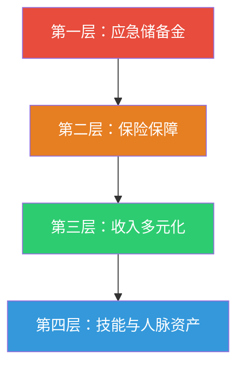

## 技巧八：危机应对与财务韧性

人生不是一条直线——失业、疾病、经济衰退、行业崩塌、家庭变故……任何一次危机都可能让你辛苦积累的财富瞬间归零。真正的财务高手不是"在好日子里赚钱最多的人"，而是"在坏日子里扛得最久的人"。

**财务韧性**（Financial Resilience）是指个人或家庭在面临突发财务冲击时，能够维持基本生活水平、快速恢复财务健康、并在危机中抓住机遇的综合能力。它不是"存了很多钱"这么简单，而是一套涵盖心理建设、制度设计、资源储备、应急执行的完整体系。

### 8.1 为什么危机应对能力是搞钱的核心技能？

#### 8.1.1 数据说话：危机比你想象的更频繁

根据中国人民银行金融稳定报告和国际劳工组织（ILO）的数据：

| 危机类型 | 统计数据 | 影响范围 |
|----------|----------|----------|
| 大规模裁员潮 | 每5-8年一次（2008、2015、2019、2022） | 互联网、教培、地产、金融 |
| 重大疾病 | 人一生中患重大疾病概率约72% | 医疗费用平均20-50万 |
| 婚姻变故 | 离婚率持续在40%以上 | 财产分割+生活水平骤降 |
| 创业失败 | 中小企业3年存活率不足30% | 负债+时间沉没成本 |
| 行业颠覆 | AI替代预计影响3亿岗位 | 整个职业赛道消失 |

**关键认知**：危机不是"会不会来"的问题，而是"什么时候来"的问题。你必须在晴天修屋顶。

#### 8.1.2 财务脆弱性自测

在讨论应对策略之前，先评估你当前的财务脆弱程度：

**财务脆弱性评分表**（每项1分，得分越高越脆弱）

| 序号 | 风险信号 | 是/否 |
|------|----------|-------|
| 1 | 手头现金不够支撑3个月基本生活开销 | |
| 2 | 月收入的50%以上用于偿还贷款/信用卡 | |
| 3 | 收入来源只有一个（单一工资收入） | |
| 4 | 没有任何商业保险（重疾险/医疗险/意外险） | |
| 5 | 所在行业正在经历裁员或下行周期 | |
| 6 | 没有任何被动收入来源 | |
| 7 | 家庭中只有一人有稳定收入 | |
| 8 | 职业技能难以在其他行业迁移使用 | |
| 9 | 负债总额超过年收入的3倍 | |
| 10 | 从未做过任何财务应急预案 | |

**评分解读**：
- **0-2分**：财务韧性良好，但仍需持续加固
- **3-5分**：中度脆弱，建议6个月内补齐短板
- **6-8分**：高度脆弱，需要立即行动，优先解决前3项
- **9-10分**：极度脆弱，任何一次小危机都可能引发财务雪崩

### 8.2 危机应对的四层防御体系

财务韧性的构建不是"多存点钱"就完了，而是一个分层防御体系——就像城堡的护城河、城墙、内城、堡垒四道防线。



#### 8.2.1 第一层：应急储备金——你的财务护城河

**什么是应急储备金？**

应急储备金是一笔随时可以取用、不承担任何投资风险的现金储备，专门用于应对突发状况：失业、疾病、意外维修、家庭紧急事件。

**存多少？**

| 情况 | 建议储备月数 | 说明 |
|------|-------------|------|
| 双收入家庭，工作稳定 | 3-6个月支出 | 公务员、国企等铁饭碗 |
| 单收入家庭 | 6-12个月支出 | 一人收入养全家 |
| 自由职业/创业者 | 12-18个月支出 | 收入波动大，需要更多缓冲 |
| 高风险行业从业者 | 6-12个月支出 | 互联网、教培、地产等周期性行业 |
| 有慢性病/高龄家庭成员 | 在基础值上+3个月 | 医疗支出不可预测 |

**计算公式**：

```text
应急储备金 = 月必要支出 × 风险系数

月必要支出 = 房租/房贷 + 水电物业 + 伙食费 + 交通费 + 保险费 + 基本通讯费
（注意：不含娱乐、外出就餐、购物等非必要支出）

风险系数：
  - 双收入稳定工作 → 6
  - 单收入稳定工作 → 9
  - 自由职业/创业 → 15
```

**示例**：小李月必要支出6000元，单收入在私企工作

```text
应急储备金 = 6000 × 9 = 54,000元
即：至少需要存下5.4万元的应急资金
```

**放在哪里？**

| 工具 | 年化收益 | 流动性 | 推荐指数 |
|------|----------|--------|----------|
| 银行活期 | 0.2% | 即时 | 存够1个月支出即可 |
| 货币基金（余额宝等） | 1.5-2% | T+0 | 存2-4个月支出 |
| 银行大额存单（3个月期） | 1.8-2.2% | 到期取出 | 存3-6个月支出 |
| 国债逆回购 | 1.5-3%（波动） | 1-28天 | 灵活配置 |

**核心原则**：应急资金不追求收益，只追求安全和流动性。绝对不能拿去买基金、股票或任何有波动的产品。

**怎么攒？**

如果你目前没有任何应急储备金，按照以下步骤行动：

1. **立即行动**：今天就在余额宝/零钱通开一个专用账户，转100元进去
2. **设定自动转账**：发工资日自动转月收入的10-20%到应急账户
3. **收入增加优先补充**：涨薪、奖金、副业收入的50%优先补充应急金
4. **出售闲置物品**：把不用的电子产品、衣物挂闲鱼，所得全部进应急账户
5. **到达目标后停止**：达到目标金额后停止存入，将资金转向投资

**时间线参考**（假设月收入1万元，每月存1500元）：

| 时间节点 | 累计金额 | 状态 |
|----------|----------|------|
| 第1个月 | 1,500元 | 刚起步，但已经迈出了第一步 |
| 第3个月 | 4,500元 | 覆盖约1个月基本支出 |
| 第6个月 | 9,000元 | 覆盖约1.5个月，小危机可应对 |
| 第12个月 | 18,000元 | 覆盖约3个月，初步具备韧性 |
| 第24个月 | 36,000元 | 覆盖约6个月，达标最低安全线 |

#### 8.2.2 第二层：保险保障——用小钱转移大风险

应急储备金能应对3-12个月的小危机，但遇到重大疾病、严重意外，几十万的医疗费用会让应急金瞬间见底。保险就是你的"第二层防线"。

**必须配置的四大险种**：

| 险种 | 作用 | 年保费参考 | 优先级 |
|------|------|-----------|--------|
| 医保（社保） | 基础医疗保障 | 工资扣除 | 最优先 |
| 百万医疗险 | 大病住院报销，免赔额1万 | 25-35岁：200-400元/年 | ★★★★★ |
| 重疾险 | 确诊即赔，弥补收入损失 | 25-35岁：3000-6000元/年 | ★★★★☆ |
| 意外险 | 意外伤残/身故赔付 | 100-300元/年 | ★★★★☆ |
| 定期寿险 | 身故赔付，保障家人 | 30-40岁：1000-2000元/年 | ★★★☆☆（有家庭负担时必买） |

**保险配置的常见误区**：

- **误区一**："我还年轻不需要保险"→ 重疾险越年轻保费越低，25岁买比35岁便宜40%
- **误区二**："有医保就够了"→ 医保报销比例有限（通常60-80%），进口药、自费项目不报
- **误区三**："买返还型保险更划算"→ 消费型保险保费低、保额高，把省下的钱拿去投资收益更高
- **误区四**："保险买一份就够了"→ 百万医疗+重疾险互补，前者报销医疗费，后者弥补收入中断
- **误区五**："给孩子和老人先买"→ 家庭经济支柱（挣钱的人）优先配置，他们倒下了全家都受影响

**保险配置的优先顺序**：

```text
1. 先给自己（家庭经济支柱）配齐
2. 再给配偶配齐
3. 然后给孩子买医疗险+意外险
4. 最后给老人买医疗险/防癌险（老人重疾险性价比低）
```

#### 8.2.3 第三层：收入多元化——不要把鸡蛋放在一个篮子里

单一收入来源是最大的财务脆弱性。如果你只有一份工资收入，那么公司裁员的那天就是你的"财务末日"。

**收入多元化矩阵**：

| 收入类型 | 示例 | 启动难度 | 天花板 | 建议优先级 |
|----------|------|----------|--------|-----------|
| 主动收入-主业 | 工资 | 低 | 中 | 基础，先做好 |
| 主动收入-副业 | 兼职咨询、自媒体、电商 | 中 | 中 | 利用主业技能延伸 |
| 被动收入-投资 | 股票分红、基金收益、利息 | 中 | 中 | 有积蓄后启动 |
| 被动收入-资产 | 房租、版权费、课程销售收入 | 高 | 高 | 长期目标 |

**实操建议**：

1. **主业之外，至少建立一个"备用收入管道"**
   - 不需要一开始就能赚很多钱，关键是"通不通"
   - 副业最好是主业技能的延伸（程序员接私活、设计师做模板、运营做自媒体）

2. **投资收入的建立路径**：
   - 第一阶段：货币基金（安全、低收益，熟悉操作）
   - 第二阶段：指数基金定投（中等风险，长期收益6-10%）
   - 第三阶段：股票/债券组合（需要学习，收益潜力更大）

3. **资产性收入的积累**：
   - 数字产品（电子书、课程、模板、工具）—— 一次创作，持续售卖
   - 知识付费（咨询服务、社群、训练营）
   - 知识产权（专利、版权、商标授权）

**危机时刻的快速变现能力**：

当你面临财务危机时，以下资源可以快速变现：

| 变现方式 | 时间 | 预期金额 | 副作用 |
|----------|------|----------|--------|
| 出售闲置物品（闲鱼） | 1-7天 | 数百到数千 | 低 |
| 兼职/零工（外卖、网约车、家教） | 1-3天 | 3000-8000元/月 | 消耗时间和精力 |
| 技能接单（设计、写作、编程） | 3-7天 | 5000-20000元/月 | 需要已有客户渠道 |
| 提取公积金（符合条件时） | 7-15天 | 数万 | 减少购房资金 |
| 保单贷款（有保单前提下） | 1-3天 | 保单现金价值的80% | 需要偿还 |
| 信用卡免息期周转 | 即时 | 临时周转 | 逾期风险极高，慎用 |

#### 8.2.4 第四层：技能与人脉——你的终极护城河

金钱可以被夺走，但能力和社会关系不会。在长期来看，技能和人脉是最抗风险的资产。

**抗危机技能清单**：

| 技能类别 | 具体技能 | 为什么抗危机 |
|----------|----------|-------------|
| 硬技能 | 编程、数据分析、财务分析 | 经济下行时企业更需要效率工具 |
| 硬技能 | 医疗/护理技能 | 无论经济如何，医疗需求恒在 |
| 软技能 | 沟通、谈判、销售 | 任何行业都需要，可迁移性强 |
| 软技能 | 写作、演讲、教学 | 可以变现为内容创作和咨询收入 |
| 元技能 | 快速学习能力 | 能让你在行业崩塌时迅速转型 |
| 元技能 | 问题解决能力 | 越难的时候越值钱 |

**人脉资产的系统化建设**：

人脉不是"认识多少人"，而是"关键时刻能帮你的人有多少"。

**人脉分层管理模型**：

```text
核心圈（5-10人）：
  - 家人、至交好友
  - 特征：你半夜出事会接电话的人
  - 维护：每周联系，主动付出

关键圈（20-50人）：
  - 行业同行、前同事、导师、合作伙伴
  - 特征：能给你介绍工作、提供商业机会的人
  - 维护：每月至少互动一次，节日问候，分享有价值的信息

扩展圈（100-500人）：
  - 社群成员、线上联系人、行业活动认识的人
  - 特征：信息来源和潜在机会池
  - 维护：朋友圈互动，社群活跃，偶尔私聊
```

**危机时的人脉使用原则**：

1. **平时存人情，急时才有的用**——不要等到需要帮忙才联系别人
2. **明确具体的需求**——不要说"帮我找找工作"，要说"我在找XX行业的XX岗位，薪资范围XX"
3. **主动提供价值**——先问"我能帮你什么"，再说"我需要什么"
4. **降低对方的帮助成本**——准备好简历、作品集，让别人只需要"转发"就够了

### 8.3 危机应对手册：具体场景的具体方案

#### 8.3.1 场景一：突然失业

**第一时间行动清单**（失业当天就要做的事）：

1. **确认离职补偿**：
   - N+1补偿（N为工作年限）是法定最低标准
   - 确认社保、公积金缴纳到哪个月
   - 确认年终奖、未休年假的补偿
   - 不要在情绪激动时签署任何文件

2. **立即启动预算紧缩**：
   - 取消所有非必要订阅（视频会员、健身房、付费App）
   - 外食改为做饭，每天可省50-100元
   - 暂停一切非必要消费（新衣服、电子产品、旅行）
   - 记录每一笔支出，知道钱花在了哪里

3. **申请失业保险**：
   - 缴纳失业保险满1年，非本人意愿中断就业可领取
   - 领取期限：缴费1-5年领12个月，5-10年领18个月，10年以上领24个月
   - 金额：当地最低工资的70-90%
   - 到当地社保局或通过"掌上12333"App办理

4. **激活收入管道**：
   - 立即联系所有"关键圈"人脉，告知你在找工作
   - 更新简历和LinkedIn/脉脉/BOSS直聘等平台资料
   - 同时启动副业变现（技能接单、兼职等）

5. **心理健康维护**：
   - 失业后的焦虑和自我怀疑是正常的
   - 保持规律作息——不要因为失业就昼夜颠倒
   - 每天至少运动30分钟
   - 设定"求职时间表"（如每天9:00-12:00投简历，下午学习新技能）

**失业期间的收入-支出平衡表**：

```text
假设：月支出6000元，应急储备金3万，失业保险金2500元/月

第1个月：失业保险2500 + 副业收入2000 = 4500，缺口1500，从储备金补
第2个月：失业保险2500 + 副业收入3000 = 5500，缺口500，从储备金补
第3个月：失业保险2500 + 副业收入4000 = 6500，收支平衡

储备金消耗：1500+500 = 2000元
剩余储备金：30000-2000 = 28000元
→ 按此节奏，储备金可以支撑14个月以上
```

#### 8.3.2 场景二：突发重大疾病

**费用规划**：

| 疾病类型 | 平均治疗费用 | 医保报销后自费 | 康复期收入损失 |
|----------|-------------|---------------|---------------|
| 心梗/脑梗 | 15-30万 | 5-15万 | 3-12个月工资 |
| 癌症（常见类型） | 20-80万 | 10-40万 | 6-24个月工资 |
| 器官移植 | 30-100万 | 15-50万 | 12-36个月工资 |
| 严重意外伤残 | 10-50万 | 5-30万 | 可能永久丧失劳动能力 |

**应对流程**：

```text
1. 就医阶段：
   - 优先使用医保（记得带医保卡/电子医保码）
   - 保留所有发票、诊断证明、费用清单
   - 同步通知保险公司报案（重疾险/百万医疗险）

2. 理赔阶段：
   - 百万医疗险：先自费，出院后凭发票报销（扣除1万免赔额）
   - 重疾险：确诊即赔，不需要发票，可以先拿钱再治病
   - 两者可以叠加使用

3. 财务调度：
   - 第一梯队：医保报销 + 百万医疗险报销（覆盖大部分医疗费）
   - 第二梯队：重疾险赔付金（弥补收入损失、康复费用）
   - 第三梯队：应急储备金（覆盖免赔额和等待期的支出）
   - 第四梯队：向亲友借款（无息，打欠条，约定还款计划）

4. 恢复阶段：
   - 评估是否能恢复原工作，或需要调岗/降薪
   - 利用康复期学习新技能，为可能的职业转型做准备
   - 重新评估保险配置，补充不足的部分
```

#### 8.3.3 场景三：经济下行/行业寒冬

经济下行不像失业那样突然，而是渐进式的——先是裁员新闻，然后是身边的人开始被裁，然后是你自己。

**渐进式应对策略**：

| 信号阶段 | 感知信号 | 应对行动 |
|----------|----------|----------|
| 黄色预警 | 行业新闻出现裁员、公司开始削减预算 | 加班加点提升工作表现；启动副业；检查应急金是否充足 |
| 橙色预警 | 部门开始合并、同事被优化、项目被砍 | 主动更新简历；激活人脉网络；减少所有非必要支出 |
| 红色预警 | 收到约谈/PIP/优化通知 | 确认补偿方案；立刻开始找工作；启动所有变现渠道 |
| 黑色预警 | 整个行业崩塌（如2021年教培行业） | 评估转行可能性；利用积蓄支撑学习期；考虑搬迁到机会更多的城市 |

**行业寒冬中的生存策略**：

1. **保住现有工作**：危机时期，"有工作"比"好工作"更重要。除非有更好的去处，不要裸辞。
2. **做"不可替代的人"：主动承担关键项目，学习公司急需的技能。
3. **降低生活成本**：这是最好的"加薪"方式。月支出从8000降到5000，等于变相涨薪3000。
4. **逆周期投资**：如果你的应急金充足且工作稳定，经济下行反而是投资的好时机——优质资产被低估。

#### 8.3.4 场景四：创业失败

创业失败不只是"没赚到钱"，往往还意味着负债。

**创业失败的财务止损策略**：

1. **设定止损线**：在创业之初就要明确——"最多亏损多少我就收手"。这个数字应该是"亏完这笔钱，我的生活不受根本影响"。
2. **区分个人资产和创业资产**：不要用家庭生活费去填创业的坑。
3. **债务重组**：如果有负债，优先偿还高利率债务（信用卡>网贷>亲友借款>银行贷款）。
4. **善后清单**：
   - 注销公司/个体户（避免持续产生税务和年检成本）
   - 处理库存/设备/办公家具
   - 结清员工工资和供应商款项（避免法律纠纷）
   - 保留核心客户关系——你可能东山再起

**从失败中提取价值**：

创业失败不是"白干了"。你积累了：
- 行业认知和人脉——下次创业不会踩同样的坑
- 管理和运营经验——这些都是打工时学不到的
- 失败的故事——在面试中展示反思能力，反而是加分项

### 8.4 财务韧性的日常维护系统

韧性不是一次性建设的，而是需要持续维护的系统。

#### 8.4.1 季度财务压力测试

每季度花1小时做一次"压力测试"：

```text
财务压力测试清单

1. 如果明天失业：
   - 应急金可以支撑___个月 ✓/✗
   - 失业保险可以领___元/月 ✓/✗
   - 副业渠道是否通畅 ✓/✗
   - 至少有3个可联系的求职渠道 ✓/✗

2. 如果家人突发重疾：
   - 医保是否正常缴纳 ✓/✗
   - 百万医疗险是否在保 ✓/✗
   - 重疾险保额是否足够（≥年收入×3） ✓/✗
   - 应急金可以覆盖免赔额和等待期 ✓/✗

3. 如果经济下行：
   - 月支出是否有压缩空间（至少能降30%） ✓/✗
   - 职业技能是否有行业外的迁移价值 ✓/✗
   - 是否有备用的收入来源 ✓/✗

4. 如果投资大幅亏损：
   - 是否有"急用钱需要割肉"的投资 ✓/✗
   - 投资组合是否过于集中 ✓/✗
   - 是否有足够的非投资类资产 ✓/✗
```

#### 8.4.2 年度韧性评估与升级

每年做一次全面的财务韧性评估：

```text
年度财务韧性升级清单

□ 更新应急储备金金额（基于最新的月支出计算）
□ 检查所有保险的续保状态和保额是否足够
□ 更新简历和人脉网络
□ 评估所在行业的风险等级
□ 学习一项新的可变现技能
□ 清理不再需要的资产，转化为流动资金
□ 与家人讨论应急预案，确保所有人都知道怎么做
```

### 8.5 心理韧性：比钱更重要的东西

所有的物质准备都是"术"的层面，真正的"道"在于心理韧性——在危机中保持理性、快速决策、不被恐惧吞噬的能力。

#### 8.5.1 危机中的心理陷阱

| 心理陷阱 | 表现 | 纠正方法 |
|----------|------|----------|
| 灾难化思维 | "我完了，这辈子都完了" | 问自己：5年后回头看，这件事有多大？ |
| 鸵鸟心态 | 假装问题不存在，不看账单、不看余额 | 每天固定时间面对财务数据，15分钟就好 |
| 过度补偿 | 危机后疯狂消费"犒劳自己" | 消费前强制等24小时 |
| 孤立无援 | 不告诉任何人自己的困境 | 向1-2个信任的人坦诚，你会发现没那么丢人 |
| 冲动决策 | 慌乱中做出重大决定（卖房、辞职、离婚） | 重大决定至少等72小时 |

#### 8.5.2 建立"心理应急包"

在平时就准备好以下"心理弹药"：

1. **过往的成功记录**：写下你曾经克服的3次重大困难。危机时拿出来看——你以前能扛过来，这次也可以。
2. **最坏情况清单**：写下"如果最坏的情况发生了，我具体可以做什么"。你会发现最坏的情况也不是世界末日。
3. **支持网络清单**：列出5个你可以在深夜打电话倾诉的人。
4. **减压工具箱**：运动、冥想、写日记、散步、听音乐——找到你的减压方式，并在危机时坚持使用。

### 8.6 常见误区

| 误区 | 为什么是错的 | 正确做法 |
|------|-------------|----------|
| "存太多应急金浪费收益" | 3-6个月的应急金年收益差距不过几百元，但能在关键时刻救命 | 先保障安全，再追求收益 |
| "有保险就不用存应急金" | 保险理赔需要时间（通常30天以上），这段时间的开支从哪来？ | 保险和应急金互补，缺一不可 |
| "我还年轻不会有危机" | 教培行业30万从业者平均年龄不到30岁，一夜之间行业没了 | 越年轻越要建立韧性，因为你恢复的时间更长 |
| "副业会影响主业" | 合理规划的副业反而提升主业能力（写作、教学、咨询） | 副业应是主业技能的延伸，互相促进 |
| "危机来了再说" | 危机来的时候你没有时间准备。晴天修屋顶，雨天才不怕漏 | 现在就开始建设，哪怕每次只做一步 |
| "把所有钱都投资出去" | 需要用钱时市场可能正好在低点，被迫割肉才是真正的亏损 | 永远保持流动性，投资用的是"闲钱" |

### 8.7 进阶：反脆弱——从危机中获益

塔勒布在《反脆弱》中提出了一个概念：有些事物不仅能抵抗冲击，反而能从冲击中获益。财务韧性的最高境界不是"扛过去"，而是"越打击越强大"。

**反脆弱财务策略**：

1. **杠铃策略**：把资产分为两部分——极度安全的（90%）和极度冒险的（10%）。中间地带（看似安全实则风险不小的投资）最危险。
2. **冗余设计**：看起来"浪费"的冗余（多出来的应急金、多一条收入渠道、多一项技能），在危机时就是救命的缓冲。
3. **小规模试错**：平时用小成本尝试新事物（1000元以内），失败了损失可控，成功了可以放大。
4. **危机嗅觉**：养成关注宏观经济和行业趋势的习惯，提前3-6个月感知风险，比别人早一步行动。

**反思维**：每一次危机都是重新洗牌的机会。2008年金融危机后买房的人、2020年疫情初期转型线上的人、2022年裁员潮中学习AI技能的人——他们都在危机中找到了机会。

你要做的不是避免危机（那不可能），而是让自己成为"危机来了反而能往上走"的人。

***
