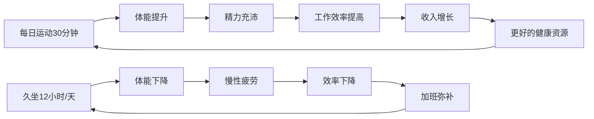
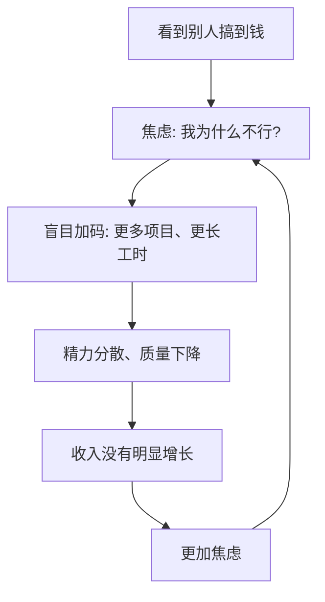
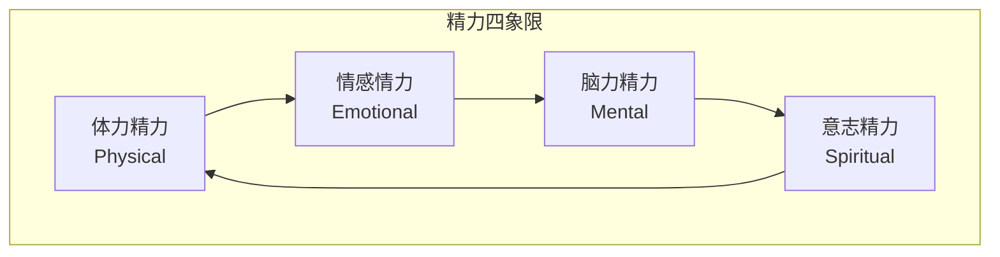

## 技巧九：搞钱与身心健康

> "健康是1，财富是后面的0。没有前面的1，后面再多0都没有意义。"——这句被说烂了的话，大多数人要到身体亮红灯的那一天才真正理解。

搞钱是长跑，不是百米冲刺。那些用命换钱的人，最终往往要用钱换命——而且往往换不回来。本节将系统讲解如何在搞钱的过程中保护身心健康，建立可持续的财富增长模式。

***

### 一、为什么健康是搞钱的"底层资产"？

#### 1.1 健康的经济学本质

从经济学角度看，健康是一种**人力资本的基础设施**。你的所有赚钱能力——体力、脑力、精力、创造力、社交能力——都建立在健康的身体和心理状态之上。

**人力资本模型：**

```text
赚钱能力 = 技能 × 精力 × 时间 × 健康系数

其中：健康系数 ∈ [0, 1]
  - 健康状态良好：0.9 ~ 1.0
  - 亚健康状态：0.6 ~ 0.8
  - 慢性病缠身：0.3 ~ 0.5
  - 重大疾病：0 ~ 0.2
```

当健康系数降到0.5以下时，你可能有再好的技能和再多的时间，也无法有效产出。这就是为什么健康是搞钱的"底层资产"——它决定了你所有其他资产的乘数。

#### 1.2 健康损失的真实成本

很多人在搞钱过程中忽视健康，是因为没有算清楚健康损失的真实成本。让我们用时薪思维来算一笔账：

**案例：一个年收入30万的互联网从业者**

| 健康问题 | 直接成本 | 间接成本 | 总成本 |
|---------|---------|---------|--------|
| 颈椎病（中度） | 治疗费2万/年 | 效率下降30%=9万/年 | 11万/年 |
| 腰椎间盘突出 | 手术费5-8万 | 恢复期3-6个月无收入 | 15-20万 |
| 重度焦虑症 | 心理咨询2万/年 | 决策质量下降、机会损失 | 10万+/年 |
| 心梗（35岁） | 手术+康复20万+ | 职业中断、保险费上涨 | 50万+，可能永久丧失劳动能力 |
| 2型糖尿病 | 药物+监测1万/年 | 并发症风险、精力下降 | 5万+/年，持续终身 |

**关键洞察：** 你以为省下了健身的1小时，实际上可能透支了未来数年的收入能力。这不是道德说教，这是纯粹的经济计算。

#### 1.3 健康复利与健康负债

类似前面讨论的技能复利，健康也有复利效应：

- **健康复利**：每天运动30分钟 → 体能提升 → 精力充沛 → 工作效率提高 → 收入增长 → 有能力购买更好的健康资源 → 身体更好
- **健康负债**：每天久坐12小时 → 体能下降 → 疲劳积累 → 效率下降 → 用更多时间弥补 → 更久坐 → 更差

这两种循环在5-10年的时间尺度上，会产生巨大的差异。



***

### 二、搞钱人群的典型健康危机

#### 2.1 身体健康危机

**（1）久坐综合征**

久坐被称为"新型吸烟"。世界卫生组织（WHO）2020年的研究表明，久坐时间每天超过8小时且不运动的人，死亡风险与吸烟和肥胖相当。

搞钱人群的久坐场景：
- 办公室工作：每天坐8-10小时
- 副业/自由职业：在家伏案工作更久
- 学习充电：刷课、读书、写笔记
- 通勤：地铁/公交/开车又加1-2小时

**久坐的直接危害：**

| 系统 | 具体危害 | 发生机制 |
|------|---------|---------|
| 骨骼肌肉 | 颈椎病、腰椎间盘突出、肩周炎 | 长期固定姿势导致肌肉失衡、椎间盘压力增大 |
| 心血管 | 静脉血栓、高血压、心脏病 | 血液循环减慢、血管弹性下降 |
| 代谢系统 | 肥胖、胰岛素抵抗、2型糖尿病 | 脂肪代谢降低、血糖调节能力下降 |
| 消化系统 | 胃胀、便秘、痔疮 | 腹部受压、肠道蠕动减慢 |
| 心理 | 焦虑、抑郁风险增加 | 缺乏运动导致内啡肽分泌不足 |

**（2）睡眠剥夺**

搞钱人群是睡眠剥夺的重灾区。常见的错误认知："睡4-6小时就够了，把时间用在搞钱上"。

**睡眠科学的事实：**

- 成年人需要7-9小时睡眠（美国国家睡眠基金会推荐）
- 睡眠不足6小时，连续两周后认知能力下降程度等同于连续48小时不睡
- 长期睡眠不足（<6小时）的人，心血管疾病风险增加48%
- 睡眠期间大脑清除代谢废物（β-淀粉样蛋白），长期睡眠不足与阿尔茨海默症风险相关
- 睡眠不足导致皮质醇（压力激素）升高，促进腹部脂肪堆积

**"我只需要睡5小时"的真相：**

只有约1%的人群携带DEC2基因突变，真正需要的睡眠时间少于6小时。绝大多数声称"我只需要5小时"的人，只是长期适应了睡眠不足的状态，认知能力已经在不知不觉中严重下降——就像醉酒的人觉得自己"还很清醒"一样。

**（3）饮食失衡**

搞钱人群的饮食问题：

- **外卖依赖**：高油高盐高糖，蔬菜摄入不足
- **不规律进食**：忙起来跳过饭点，然后暴饮暴食
- **咖啡因过量**：每天3-5杯咖啡维持精力，导致焦虑、失眠、心悸
- **零食代餐**：用薯片、奶茶、能量棒代替正餐

#### 2.2 心理健康危机

**（1）慢性压力与焦虑**

搞钱过程中的压力来源是多维度的：

- **收入压力**：主业收入不够、副业还没起色
- **比较压力**：看到同龄人买房买车、财务自由
- **时间压力**：觉得时间不够用、错过了最佳窗口期
- **不确定性压力**：不知道方向对不对、市场会怎么变
- **身份压力**：害怕被人看不起、想证明自己

**压力的生理机制：**

当压力持续存在时，身体会进入"战斗或逃跑"模式：
- 皮质醇持续升高 → 免疫力下降、记忆力减退
- 交感神经持续兴奋 → 血压升高、心率加快
- 消化系统被抑制 → 胃痛、食欲异常
- 前额叶皮层功能下降 → 决策质量降低、冲动决策增多

**讽刺的是：压力越大，搞钱能力越差。** 因为最好的搞钱决策需要冷静、理性、有创造力的大脑——这些恰恰是慢性压力破坏的。

**（2）职业倦怠（Burnout）**

世界卫生组织（WHO）在2019年将职业倦怠列入《国际疾病分类》（ICD-11），定义为：

> 由长期工作压力未能成功管理而导致的综合征，表现为三个维度：
> 1. 精力耗竭感
> 2. 对工作的心理距离增加（消极/愤世嫉俗）
> 3. 专业效能降低

**职业倦怠的五个阶段：**

| 阶段 | 表现 | 搞钱人群的典型症状 |
|------|------|------------------|
| 蜜月期 | 高热情、高投入 | 刚开始搞副业/创业，充满激情 |
| 压力期 | 开始出现疲劳和焦虑 | 发现搞钱比想象的难，开始焦虑 |
| 慢性压力期 | 持续疲惫、效率下降 | 周末也在想工作，但产出越来越低 |
| 倦怠期 | 情绪崩溃、身体症状出现 | 失眠、暴躁、想放弃一切 |
| 习惯性倦怠 | 对一切都失去兴趣 | "躺平"不是因为想通了，而是因为燃尽了 |

**（3）搞钱焦虑的恶性循环**



这个循环是很多搞钱人的"内耗陷阱"。打破它的关键不是更努力，而是**停下来重新审视方向和方法**。

#### 2.3 关系健康危机

搞钱对人际关系的冲击往往被低估：

- **亲密关系**：没有时间陪伴伴侣，沟通减少，矛盾增多
- **亲子关系**：错过孩子成长的关键期，无法弥补
- **友谊**：社交圈越来越"功利化"，真正的友情被边缘化
- **家庭**：父母老去而你总是"忙"，某天发现为时已晚

**关系健康与搞钱的关系：** 优质的人际关系是搞钱的加速器（人脉复利），而破裂的关系是搞钱的减速器（情绪消耗、法律纠纷、分心）。投资关系不是搞钱的对立面，而是搞钱的一部分。

***

### 三、科学健康管理框架

#### 3.1 身体健康管理

**（1）运动：最高效的精力投资**

运动不是浪费搞钱时间，而是提高搞钱效率的杠杆。哈佛医学院的研究显示：每天30分钟中等强度运动，可以将工作效率提高15%-20%，创造力提高60%。

**搞钱人群的最小可行运动方案（每天21分钟）：**

| 项目 | 时间 | 说明 |
|------|------|------|
| 晨起拉伸 | 5分钟 | 唤醒身体，激活关节 |
| 午间步行 | 10分钟 | 饭后步行促进消化、防止午后困倦 |
| 工间微运动 | 6分钟（每小时1分钟） | 站立、深蹲、颈部环绕，打断久坐 |

**进阶运动方案（每周3-5次，每次30-60分钟）：**

| 目标 | 推荐运动 | 每周频率 | 说明 |
|------|---------|---------|------|
| 心肺功能 | 跑步/游泳/骑行 | 3次 | 提升大脑供氧，增强耐力 |
| 力量训练 | 深蹲/硬拉/卧推 | 2-3次 | 提高基础代谢，预防肌肉流失 |
| 柔韧性 | 瑜伽/拉伸 | 2次 | 预防颈椎腰椎问题 |
| 神经调节 | 冥想/太极 | 每天5-10分钟 | 降低皮质醇，提升专注力 |

**运动习惯养成的关键策略：**

- **绑定已有习惯**：把运动绑定在已有的固定行为之后（如：刷牙后做5分钟拉伸）
- **降低启动成本**：运动服提前摆好，不需要任何心理准备就能开始
- **从微小开始**：第一个目标不是"每天跑步30分钟"，而是"穿上跑鞋出门"
- **使用习惯追踪**：用手机日历或Habitica等APP记录连续天数，利用"不想中断链条"的心理

**（2）睡眠：精力的充电站**

**睡眠优化方案：**

| 策略 | 具体做法 | 原理 |
|------|---------|------|
| 固定作息 | 每天同一时间上床和起床（误差≤30分钟） | 稳定生物钟，提高睡眠质量 |
| 睡前90分钟 | 停止接触蓝光屏幕，改为阅读纸质书 | 蓝光抑制褪黑素分泌 |
| 睡眠环境 | 室温18-22°C，完全遮光，安静或白噪音 | 最优睡眠环境条件 |
| 咖啡因截止 | 下午2点后不摄入咖啡因 | 咖啡因半衰期5-6小时，影响入睡 |
| 酒精回避 | 睡前3小时不饮酒 | 酒精虽助入睡但破坏REM睡眠 |
| 午睡控制 | 午睡不超过20分钟 | 避免进入深度睡眠后醒来的"睡眠惯性" |

**关于"我太忙了没时间睡"的反驳：**

如果每天少睡2小时用于工作，表面上多了2小时产出。但实际上：
- 认知能力下降25%-40%
- 错误率上升
- 创造力几乎归零
- 情绪管理能力崩塌

净效果是：你多花了2小时，但总产出可能反而下降了。高质量的8小时睡眠后5小时高效工作，胜过睡眠不足的7小时低效挣扎。

**（3）营养：大脑的燃料**

**搞钱人群的实用营养原则：**

不需要成为营养学专家，记住以下核心原则即可：

- **蛋白质优先**：每餐确保有优质蛋白（鸡蛋、鸡胸肉、鱼、豆腐），蛋白质稳定血糖、延长饱腹感
- **复合碳水替代精制碳水**：糙米/燕麦代替白米/白面，避免血糖剧烈波动导致的困倦
- **好脂肪不可少**：坚果、牛油果、橄榄油、深海鱼，大脑60%是脂肪
- **蔬菜彩虹法则**：每天至少5种不同颜色的蔬菜，覆盖不同微量营养素
- **喝水提醒**：轻度脱水就会导致注意力下降，每小时喝200ml水

**高效备餐方案（适合忙碌搞钱人）：**

每周日花2小时备餐，覆盖整个工作日：

```text
1. 批量烹饪蛋白质（鸡胸肉、牛肉、鸡蛋）
2. 准备3-4种蔬菜（洗净切好，分装冷藏）
3. 煮好杂粮饭（分装冷冻，微波即可）
4. 准备健康零食（坚果、水果、酸奶）
5. 周三晚上补充一次新鲜蔬菜
```

**（4）久坐对抗方案**

针对每天必须久坐的搞钱人群：

| 每隔X分钟 | 做什么 | 为什么 |
|-----------|--------|--------|
| 每30分钟 | 站起来30秒 | 激活下肢肌肉，促进血液循环 |
| 每60分钟 | 走动2分钟（接水、上厕所） | 打断久坐的代谢损害 |
| 每2小时 | 做5分钟微运动（深蹲10个、俯卧撑10个、拉伸） | 维持肌肉活性和关节灵活 |
| 每半天 | 站立工作30-60分钟 | 使用升降桌或临时垫高笔记本 |

#### 3.2 心理健康管理

**（1）压力管理工具箱**

| 工具 | 适用场景 | 具体做法 | 生效时间 |
|------|---------|---------|---------|
| 4-7-8呼吸法 | 焦虑发作、入睡困难 | 吸气4秒→屏息7秒→呼气8秒，重复4轮 | 2-5分钟 |
| 正念冥想 | 日常减压、提升专注 | 每天10分钟，关注呼吸，杂念来了不评判 | 2-4周 |
| 书写疗愈 | 情绪积压、决策纠结 | 每天写3页意识流日记（晨间笔记法） | 即时 |
| 运动释放 | 急性压力、愤怒 | 高强度间歇训练（HIIT）20分钟 | 即时 |
| 自然暴露 | 长期压力、倦怠初期 | 每周至少2小时户外自然环境 | 1-2周 |

**（2）搞钱焦虑的认知重构**

很多搞钱焦虑来自非理性认知。以下是最常见的认知扭曲和对应的重构：

| 认知扭曲 | 典型想法 | 理性重构 |
|---------|---------|---------|
| 灾难化思维 | "如果这个副业失败了，我就完了" | "失败是数据收集，我还有主业兜底" |
| 全或无思维 | "要么财务自由，要么就是失败者" | "财务自由是一个光谱，每一步进展都有价值" |
| 比较陷阱 | "他比我小5岁已经年入百万了" | "每个人起点不同、赛道不同，我的对手只有昨天的自己" |
| 应该思维 | "我应该同时搞好主业和副业" | "资源有限时，集中精力做最重要的事才是理性选择" |
| 过度概括 | "这次投资亏了，我不适合搞钱" | "一次失败不能定义我的能力，复盘原因比自我否定更有用" |

**（3）正念冥想入门指南**

正念冥想是目前科学证据最充分的心理健康干预之一。Meta分析显示，正念冥想可以：
- 降低焦虑水平 30%-50%
- 改善睡眠质量
- 提升注意力和工作记忆
- 增强情绪调节能力

**5分钟正念冥想入门步骤：**

1. 找一个安静的地方坐下，脊背自然挺直
2. 设定计时器5分钟
3. 闭上眼睛，把注意力放在呼吸上
4. 注意气息进出鼻腔的感觉
5. 杂念出现时（一定会），不要评判，温柔地把注意力拉回呼吸
6. 重复第5步，直到计时器响

**推荐工具：**
- **潮汐APP**：国产冥想APP，中文引导，适合入门
- **小睡眠**：睡眠+冥想+白噪音
- **Headspace**：英文APP，引导课程系统完整
- **Insight Timer**：免费冥想APP，社区功能强

**（4）社交媒体与信息管理**

搞钱焦虑的一个重要来源是社交媒体上的"成功展示"。应对策略：

- **信息断食**：每周至少一天完全不看社交媒体
- **取关策略**：取关所有让你焦虑的"成功学"账号
- **时间限制**：使用手机屏幕时间管理功能，限制社交媒体使用在30分钟/天以内
- **输入质量**：用深度阅读（书籍、长文）替代碎片信息（短视频、朋友圈）

#### 3.3 关系健康管理

**（1）搞钱与亲密关系的平衡**

| 原则 | 具体做法 |
|------|---------|
| 设定无工作时间 | 每天至少2小时完全不看工作消息，陪伴家人 |
| 周末保护 | 至少一个完整周末日不工作 |
| 透明沟通 | 让伴侣了解你的搞钱计划和预期压力，获得支持而非猜疑 |
| 共同参与 | 把伴侣纳入你的搞钱计划（如共同理财），变成团队而非对手 |
| 关系投资 | 定期约会、旅行，把关系维护当作"必做事项"而非"有空再做" |

**（2）搞钱社交的边界**

搞钱过程中，社交圈会自然分化：

- **搞钱圈**：一起交流搞钱经验、分享资源、互相激励
- **情感圈**：提供情感支持、不涉及利益交换的朋友
- **家庭圈**：亲人关系的维护

**关键原则：** 不要让搞钱圈完全取代情感圈。纯粹的利益社交在你失去价值时会瞬间崩塌，而真正的友情和亲情才是人生的"安全网"。

***

### 四、搞钱与健康的可持续模型

#### 4.1 精力管理四象限

精力管理比时间管理更重要。人的精力分为四个维度：



| 精力维度 | 消耗行为 | 恢复行为 |
|---------|---------|---------|
| 体力精力 | 久坐、熬夜、不运动 | 运动、睡眠、营养 |
| 情感精力 | 人际冲突、孤独、比较焦虑 | 亲密关系、友情、正向社交 |
| 脑力精力 | 高强度工作、信息过载、多任务 | 冥想、散步、艺术欣赏、放空 |
| 意志精力 | 目标迷失、价值感缺失、道德困境 | 使命感、利他行为、深度反思 |

**关键洞察：** 四种精力相互影响。体力精力是基础——当你睡眠不足时，情感管理、脑力工作、意志力都会崩塌。这也是为什么很多决策失误发生在深夜或疲惫时。

#### 4.2 可持续搞钱的时间配置

**错误模式：全部投入搞钱**

```text
一天24小时分配：
  工作/搞钱：14小时
  通勤：2小时
  吃饭/洗漱：2小时
  睡眠：5小时
  运动/休息：0小时
  社交/家庭：1小时
```

这种模式在短期内可能产出很高，但6-12个月后必然崩溃。

**正确模式：可持续搞钱**

```text
一天24小时分配：
  深度工作：6-8小时（高效时段，质量 > 数量）
  学习/成长：1-2小时
  运动：0.5-1小时
  睡眠：7-8小时
  吃饭/洗漱：2小时
  通勤：1-2小时
  社交/家庭/休闲：2-3小时
```

**核心理念：把健康活动当作"必须完成的项目"，而不是"有空再做的事"。** 就像你不会跳过一个重要的工作会一样，不要跳过运动和睡眠。

#### 4.3 周期性恢复策略

**微观恢复（每日）：**
- 工作50分钟 → 休息10分钟（番茄钟变体）
- 每2小时做一次"心理换挡"（散步、听音乐、与人闲聊）
- 睡前1小时完全放松

**中观恢复（每周）：**
- 至少1天完全不工作
- 至少1次社交活动（非功利性质）
- 至少1次户外活动

**宏观恢复（每季度/每年）：**
- 每季度至少3天完全断联休假
- 每年至少1周旅行或深度休息
- 每半年做一次全面体检

***

### 五、不同搞钱阶段的健康管理重点

#### 5.1 副业探索期

**阶段特征：** 白天上班，晚上和周末搞副业，时间极度紧张。

**健康管理重点：**
- **保护睡眠底线**：宁可副业少做1小时，也要保证7小时睡眠
- **碎片化运动**：利用通勤时间（提前一站下车走路）、午休时间
- **情绪管理**：副业初期收入为零是常态，不要焦虑
- **设定止损线**：如果副业严重影响健康或主业，果断暂停

#### 5.2 副业成长期

**阶段特征：** 副业开始有收入，但还不稳定，容易过度投入。

**健康管理重点：**
- **拒绝"赚到钱了所以更拼命"的冲动**：建立固定工作时间
- **开始系统运动**：有了副业收入，可以投资健身
- **社交维护**：不要因为忙碌而疏远朋友和家人
- **定期复盘**：每季度评估健康状态，及时调整

#### 5.3 收入稳定期

**阶段特征：** 收入来源多元化且相对稳定，但可能面临"成功焦虑"。

**健康管理重点：**
- **从"拼命搞钱"转向"享受过程"**：把健康维护升级为一等公民
- **全面体检**：每年一次，重点关注心血管、代谢、骨密度
- **心理健康的长期投资**：定期心理咨询（不是有病才去，而是保持心理健康状态）
- **关系深耕**：花更多时间在高质量的人际关系上

#### 5.4 财务自由期

**阶段特征：** 被动收入覆盖支出，时间充裕，但可能面临"意义危机"。

**健康管理重点：**
- **建立新的日常结构**：没有了工作约束，容易作息混乱
- **寻找新的意义来源**：公益、教学、创作、传承
- **身体维护的长期规划**：年龄增长后的健康投资（关节保养、心脑血管保护）
- **社交网络的重建**：脱离工作环境后，需要建立新的社交圈

***

### 六、常见误区与纠正

#### 误区一："等我赚到钱了再保养身体"

**真相：** 身体是有"折旧"的，很多损伤不可逆。20多岁熬的夜、30多岁扛的压力、40多岁就会以疾病的形式"还回来"。而且，搞到钱的过程中保持健康，效率更高、决策更好、持续更久。

**纠正：** 从今天开始，把健康当作第一优先级的搞钱策略来执行。

#### 误区二："我还年轻，身体扛得住"

**真相：** 20多岁的身体确实恢复能力强，但这种能力会以你察觉不到的速度下降。30岁以后，熬夜后的恢复时间从1天变成3天；35岁以后，从3天变成1周。而且，很多慢性病的种子在20多岁就已经种下。

**纠正：** 年轻时建立的健康习惯，是给未来自己最好的投资。

#### 误区三："健身太浪费时间了"

**真相：** 每天运动30分钟，换来的精力提升可以让你在剩余的高效工作时间里产出更多。这是"磨刀不误砍柴工"的最经典应用。无数CEO、顶级运动员、高效能人士都将运动视为日程中不可侵犯的部分。

**纠正：** 把运动时间从"搞钱时间中扣除"改为"搞钱效率的乘数"。

#### 误区四："赚钱了请私人医生就行"

**真相：** 医学有其局限性。很多慢性病（如2型糖尿病、高血压、颈椎病）一旦确诊，只能控制不能治愈。最好的医疗是预防。而且，重大疾病的治疗过程本身就是巨大的时间和精力消耗，会严重拖累搞钱进度。

**纠正：** 预防 > 治疗。每天花在健康上的1小时，可能省下未来数百万的医疗费。

#### 误区五："我压力大是因为钱不够多，钱够了压力就没了"

**真相：** 研究显示，收入超过一定阈值（在中国大约年收入30-50万）后，收入增加对幸福感的提升效果急剧递减。很多高收入人群的压力反而更大——因为他们承担了更多的责任、更高的期望、更复杂的人际关系。

**纠正：** 学会管理压力，而不是期望"赚够了压力就消失"。压力管理是一项终身技能。

***

### 七、实用工具与资源

#### 7.1 健康管理工具推荐

| 类别 | 工具 | 用途 | 费用 |
|------|------|------|------|
| 运动追踪 | Keep | 运动课程+记录 | 免费/会员 |
| 运动追踪 | Apple Watch / 小米手环 | 活动量+心率+睡眠 | 设备费用 |
| 睡眠监测 | Sleep Cycle | 智能闹钟+睡眠质量分析 | 免费/付费 |
| 冥想 | 潮汐 | 冥想引导+白噪音 | 免费/会员 |
| 饮食记录 | 薄荷健康 | 热量+营养素追踪 | 免费/付费 |
| 习惯养成 | Habitica | 游戏化习惯追踪 | 免费 |
| 心理健康 | 简单心理 | 在线心理咨询平台 | 按次付费 |

#### 7.2 每日健康清单模板

```text
【晨间】
□ 固定时间起床（目标时间：____）
□ 喝一杯温水（300ml）
□ 5分钟晨起拉伸
□ 10分钟正念冥想
□ 营养早餐（蛋白质+碳水+蔬果）

【工作日】
□ 每小时站立30秒
□ 每2小时微运动2分钟
□ 午餐后步行10分钟
□ 下午2点后不喝咖啡
□ 喝水≥2000ml

【晚间】
□ 固定时间停止工作（目标时间：____）
□ 30分钟运动（或累计达标）
□ 睡前90分钟停止屏幕
□ 固定时间上床（目标时间：____）
□ 睡眠≥7小时

【每周】
□ 至少1天完全休息
□ 至少1次社交活动
□ 至少1次户外活动
□ 周日备餐
```

#### 7.3 推荐阅读

| 书名 | 作者 | 核心价值 |
|------|------|---------|
| 《精力管理》 | 吉姆·洛尔 | 精力四象限模型，系统性精力管理方法 |
| 《睡眠革命》 | 尼克·利特尔黑尔斯 | R90睡眠方案，科学改善睡眠 |
| 《正念的奇迹》 | 一行禅师 | 正念冥想的入门经典 |
| 《身体从未忘记》 | 范德考克 | 理解身心关系，创伤如何影响身体 |
| 《纳瓦尔宝典》 | 埃里克·乔根森 | 纳瓦尔关于健康、财富、幸福的智慧 |
| 《高效休息法》 | 久贺谷亮 | 脑科学视角的休息与恢复 |

***

### 八、健康搞钱行动清单

**立即行动（今天就开始）：**

1. 计算你当前的真实时薪，把健康损失成本纳入计算
2. 下载一个运动APP，设定每天21分钟的最小可行运动方案
3. 设定今晚的固定上床时间，保证7小时睡眠
4. 在日历上标注每天的"无工作时间"和"运动时间"

**本周完成：**

1. 做一次全面的饮食审视——记录3天吃了什么，识别主要问题
2. 整理你的社交媒体关注列表，取关让你焦虑的账号
3. 与伴侣/家人做一次关于"搞钱与生活平衡"的对话
4. 在日历上标注下一次体检的时间

**本月建立：**

1. 养成每天30分钟运动的习惯（从21分钟开始，逐步增加）
2. 建立稳定的睡眠时间表
3. 开始正念冥想（从每天5分钟开始）
4. 完成一次"精力审计"——评估四种精力维度的状态

**每季度检查：**

1. 做一次健康自评：体力、情感、脑力、意志力各打1-10分
2. 检视搞钱进度与健康状态是否平衡
3. 必要时调整搞钱策略（如果健康分数持续低于6分，必须减负）
4. 体检或健康检查

***

### 九、总结：健康搞钱的核心公式

```text
可持续的财富增长 = (技能 × 精力 × 时间 × 健康系数) × 复利效应

其中：
- 技能：你赚钱的专业能力
- 精力：你的体力+脑力+情感+意志力
- 时间：你能投入的有效时间
- 健康系数：[0, 1]，由身心健康状态决定
- 复利效应：时间越长，前面四个因子的累积效果越大

当健康系数 = 1.0 时，你的财富增长曲线是指数型的。
当健康系数 = 0.3 时，你的财富增长曲线是平坦甚至下降的。
```

**记住：**

- 搞钱是手段，不是目的。健康的身体和心理，才是享受搞钱成果的前提。
- 搞钱是长跑。跑得快不如跑得久。那些跑了几十年还在跑的人，往往不是最拼命的，而是最懂得保护自己的。
- 最高级的搞钱，是不需要用健康去换钱，而是用健康的身体和清醒的大脑，持续创造价值。

> 💡 **本节行动项：** 选择以上任意一个"立即行动"项目，今天就开始执行。不要等到"忙完这一阵"——因为搞钱的路上，永远有下一阵。

***
