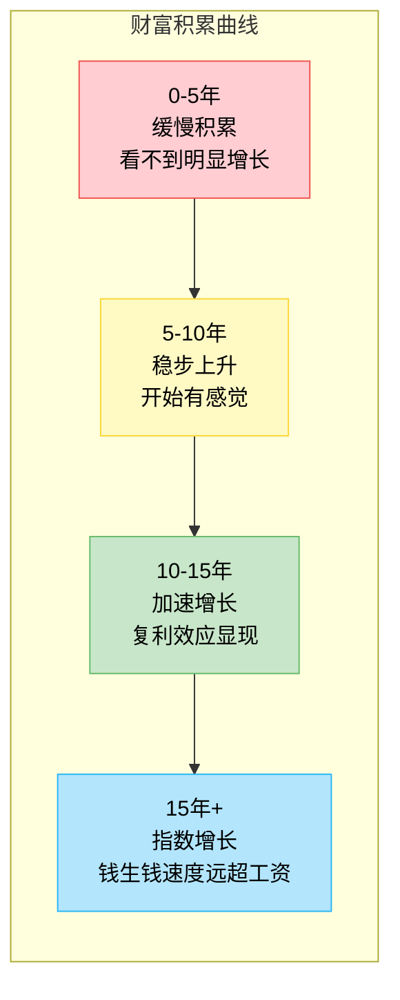
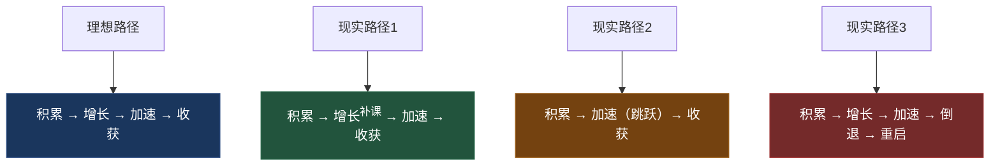
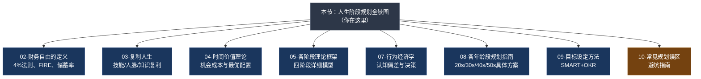

## 零、人生阶段规划全景图

### 0.1 为什么需要一张"全景图"？

想象你要自驾穿越中国——从漠河到三亚，从上海到喀什。你会怎么做？大概率不会上车就踩油门，而是先打开地图，搞清楚三件事：**起点在哪、终点在哪、中间经过哪些关键节点。**

搞钱也是一样。大多数人对自己的财务人生缺乏全局认知：25岁的人不知道35岁该做什么准备，40岁的人后悔30岁没有布局，55岁的人感慨40岁错过了最佳窗口。**问题不是不够努力，而是没有一张贯穿全生命周期的地图。**

本节就是这张地图。它不深入每个阶段的具体策略（那些内容会在后续章节逐一展开），而是帮你建立一个**全局视角**——理解人生不同阶段的财务特征、核心任务、资源配置逻辑和关键转折点。

> 💡 **阅读定位：** 本节是整个"理论基础"部分的总纲。读完本节后，你会对人生财务规划有一个完整的认知框架，后续的"财务自由定义""复利人生""时间价值理论""各阶段理论框架"等章节将在这个框架上逐一填充细节。

***

### 0.2 人生的财务生命周期：四个不可跳过的阶段

人的一生，从财务视角来看，可以划分为四个阶段。这不是按年龄一刀切，而是按**财务状态和核心任务**来划分。每个人进入和退出每个阶段的时间不同，但顺序是固定的——你不能跳过积累期直接进入收获期，就像不能跳过地基直接盖屋顶。

#### 阶段一：积累期（约22-30岁）——投资自己

**财务特征：** 收入低且不稳定，支出相对刚性（房租、通勤、基本生活），储蓄率通常很低甚至为负（负债状态：学贷、信用卡分期等）。资产几乎为零。

**核心任务：** 这个阶段的关键词不是"赚钱"，而是**"投资自己"**。你最大的资产不是银行账户里的数字，而是你的身体、大脑和社交网络。

**资源配置逻辑：**

| 资源类型 | 分配比例 | 说明 |
|----------|---------|------|
| 时间 | 70%自我提升，20%工作产出，10%社交 | 学习效率最高的黄金期 |
| 金钱 | 50%基本生活，30%教育投资，20%应急储蓄 | 技能培训、书籍、优质课程 |
| 精力 | 80%主业精进，20%探索副业可能性 | 先把一件事做到80分再分散 |

**关键指标：**
- 技能增长率：每年新增1-2项可叠加技能
- 收入增长率：年均15%以上（跳槽+加薪+副业）
- 认知升级频率：每季度至少读完2本领域经典

**这个阶段最容易犯的错误：**
1. **过早追求"投资收益"**——手上有5000块钱就开始研究基金股票，收益率10%也就赚500块。同样的时间用来学一项技能，可能带来月薪5000的增长。投入产出比差了100倍。
2. **被消费主义裹挟**——用分期付款买最新款手机、名牌包，用"对自己好一点"合理化非必要消费。这些消费的真实成本是：你用未来的时间换了当下的虚荣。
3. **社交圈层固化**——只和同龄人、同事交往，不主动接触更高层次的人脉。弱关系理论（格兰诺维特，1973）告诉我们，很多关键机会来自不太熟悉的"弱关系"，而非天天见面的"强关系"。

> ⚠️ **一个反直觉的真相：** 积累期看似"没钱"，但如果你把"时间"折算成资本，这个阶段其实是你一生中最富有的时期——你拥有最多的时间和最强的学习能力。把它浪费在低价值的事情上，就是在挥霍你最大的资本。

#### 阶段二：增长期（约30-40岁）——扩大收入

**财务特征：** 收入开始显著增长（尤其是前5-8年积累的技能开始变现），但支出也在同步膨胀——房贷、车贷、结婚、育儿、赡养父母，每一项都是刚性支出。表面看收入不错，实际可支配收入可能比单身时还少。

**核心任务：** 在维持生活品质的前提下，**最大化储蓄率**，同时开始建立被动收入的雏形。

**资源配置逻辑：**

| 资源类型 | 分配比例 | 说明 |
|----------|---------|------|
| 时间 | 50%职业发展，30%家庭，20%副业/投资学习 | 时间最稀缺，要学会外包低价值任务 |
| 金钱 | 40%生活必要支出，30%储蓄投资，20%房贷，10%弹性 | 储蓄率是这个阶段的核心杠杆 |
| 精力 | 60%主业（争取晋升/跳槽涨薪），20%副业，20%投资 | 主业仍然是收入主力 |

**关键指标：**
- 储蓄率：从10%逐步提升到30%以上
- 被动收入占比：从0%开始，目标达到总收入的5%-10%
- 职业天花板突破：从执行层进入管理层，或成为领域专家

**这个阶段的核心矛盾：** 收入增长 vs 支出膨胀。很多人陷入"生活方式通胀"（Lifestyle Inflation）的陷阱——收入涨了50%，支出也涨了50%，储蓄率原地踏步。解决这个矛盾的方法不是"不花钱"，而是**有意识地控制支出增长速度慢于收入增长速度**。

**实操建议：**
- 每次加薪后，先把增量的50%自动转入投资账户，剩余50%才用于提升生活品质
- 建立"三个账户"系统：日常账户（生活支出）、投资账户（长期增值）、弹性账户（旅行、娱乐）
- 开始认真研究至少一种被动收入渠道：指数基金定投、房产出租、知识产品、内容创作等

#### 阶段三：加速期（约40-50岁）——让钱生钱

**财务特征：** 收入达到职业生涯的峰值区间，投资资产经过10-15年的复利积累开始产生可观的收益。但这个阶段也是家庭责任最重的时期——子女教育、父母医疗、职业瓶颈，三重压力同时压来。

**核心任务：** **加速被动收入的增长**，让它逐步接近甚至超过主动收入。同时建立完善的财务安全网（保险、应急基金、法律架构）。

**资源配置逻辑：**

| 资源类型 | 分配比例 | 说明 |
|----------|---------|------|
| 时间 | 30%职业/事业，30%投资管理，20%家庭，20%健康 | 健康投入必须提上日程 |
| 金钱 | 30%生活支出，50%投资资产，10%保险保障，10%弹性 | 投资成为最大支出项 |
| 精力 | 40%钱生钱（投资+被动收入），30%主业，20%家庭，10%健康 | 从"人赚钱"转向"钱赚钱" |

**关键指标：**
- 被动收入/生活支出比：目标从0.3提升到0.7以上
- 投资组合年化收益：稳健配置目标6%-8%
- 财务安全垫：应急基金覆盖12-24个月支出
- 保险覆盖率：重疾、寿险、意外险保额充足

**这个阶段最大的风险：**
1. **职业危机**——行业衰退、公司裁员、体力下降导致的收入中断。中年失业的平均再就业周期为6-12个月。
2. **健康风险**——三高、颈椎腰椎、心血管问题开始集中爆发。一场大病可以清空多年积蓄。
3. **投资失误**——手里有了"大钱"，容易被高收益诱惑，踩坑P2P、非法集资、高杠杆投机。

> 💡 **加速期的核心认知转变：** 从"我必须工作才有收入"转向"我的资产在替我工作"。这个转变不是一夜之间发生的，而是需要在积累期和增长期就开始铺垫。

#### 阶段四：收获期（约50-60岁）——稳健收获

**财务特征：** 投资资产的复利效应充分显现，被动收入可能已经接近或超过生活支出。子女逐步独立，房贷接近还清，刚性支出开始下降。但如果前三个阶段没有做好准备，这个阶段可能面临"退休恐慌"。

**核心任务：** **确保财富的长期可持续性**，同时规划退休后的生活方式——不是"不做事"，而是"做自己想做的事"。

**资源配置逻辑：**

| 资源类型 | 分配比例 | 说明 |
|----------|---------|------|
| 时间 | 20%事业（可选），30%兴趣爱好，30%家庭，20%健康 | 从"必须做"转向"想做" |
| 金钱 | 25%生活支出，60%稳健资产，10%医疗保障，5%弹性 | 资产配置大幅向稳健倾斜 |
| 精力 | 50%享受生活，30%财富管理，20%社会价值创造 | 精力管理优先于时间管理 |

**关键指标：**
- 财务自由度（被动收入 ÷ 总支出）：目标 > 1.0
- 资产配置安全边际：股票占比逐步降至30%-40%
- 医疗保障充足度：重疾险+医疗险+长期护理险
- 遗产规划完成度：遗嘱、信托、资产传承方案到位

**这个阶段最需要警惕的：**
1. **过早消耗本金**——退休后突然有了大量自由时间，容易过度消费（旅游、爱好、补贴子女）。但此时你的"收入再生产能力"已经大幅下降。
2. **被"高收益"收割**——老年人是金融诈骗的重灾区。"年化收益15%""保本保息""养老理财"等话术背后往往是陷阱。
3. **忽视健康管理**——50岁以后的医疗支出会指数级增长。花在健康上的每一分钱，都是在省未来的医疗费。

***

### 0.3 全景总览：四阶段对照表

下表将四个阶段的关键维度进行横向对比，帮你在一分钟内建立全局认知：

| 维度 | 🌱 积累期 (22-30) | 📈 增长期 (30-40) | 🚀 加速期 (40-50) | 🏖️ 收获期 (50-60) |
|------|------------------|------------------|------------------|------------------|
| **收入特征** | 低且不稳定，增长快 | 显著增长，趋于稳定 | 峰值区间 | 开始下降或转为被动 |
| **支出特征** | 低但刚性 | 快速膨胀（房贷、育儿） | 高位运行但增速放缓 | 开始下降 |
| **储蓄率** | 0%-15% | 15%-35% | 30%-50% | 40%-60% |
| **核心资产** | 技能、身体、人脉 | 主业收入、首套房 | 投资组合、被动收入 | 稳健资产、现金流 |
| **最大风险** | 浪费时间、负债消费 | 生活方式通胀 | 职业危机、健康风险 | 投资诈骗、过度消耗 |
| **最大机会** | 复利的起点（时间优势） | 收入跃升、资产积累 | 钱生钱的加速 | 财务自由的兑现 |
| **核心心法** | 投资自己 | 控制支出增速 | 让钱替你工作 | 稳健享受 |
| **投入产出比最高的事** | 学习+建立人脉 | 跳槽/晋升+副业 | 资产配置优化 | 健康管理+传承规划 |

***

### 0.4 财务人生的"复利曲线"

为什么理解人生阶段如此重要？因为**财富积累不是线性的，而是遵循复利曲线**。

**关键洞察：** 大多数人在复利曲线的前5年就放弃了——因为他们看不到明显的增长，以为"这种方法不适合我"。但实际上，前5年的"缓慢"恰恰是在为后面的指数增长打地基。

举一个具体的数字例子：

假设你从25岁开始，每月定投3000元到年化收益8%的投资组合中：

| 年龄 | 累计投入 | 账户总额 | 其中收益部分 |
|------|---------|---------|------------|
| 30岁 | 18万 | 22万 | 4万（22%） |
| 35岁 | 36万 | 55万 | 19万（35%） |
| 40岁 | 54万 | 105万 | 51万（49%） |
| 45岁 | 72万 | 182万 | 110万（60%） |
| 50岁 | 90万 | 300万 | 210万（70%） |
| 55岁 | 108万 | 480万 | 372万（77%） |

注意看"收益部分"的占比变化：30岁时收益只占22%，到55岁时收益占了77%。**后半程的财富增长主要靠"钱生钱"，而不是你的工资。** 这就是为什么越早开始，复利效应越强大。

> ⚠️ **但请注意：** 这个例子假设了每月3000元的持续投入和8%的年化收益。现实中，收入波动、市场波动、突发事件都会打断这个过程。所以后面的章节会详细讨论如何建立"财务韧性"来应对这些不确定性。

***

### 0.5 人生阶段并非线性：三种特殊情况

上面的四阶段模型是一个"理想路径"，但现实中很多人的情况会偏离这个模型。理解这些特殊情况同样重要。

#### 特殊情况一：阶段重叠

有些人在增长期同时还在"补课"积累期的内容——比如30岁转行，需要重新学习新技能。这完全正常，不要焦虑。关键是**在主线任务上推进的同时，用碎片时间补短板**。

#### 特殊情况二：阶段跳跃

少数人因为创业成功、投资暴富或继承等原因，可能在30岁就进入加速期甚至收获期。但统计数据显示，**快速获得的财富如果缺乏对应的认知和能力，往往会快速流失**。这就是为什么很多彩票中奖者、年轻明星在几年后会回到原点甚至更差。阶段可以跳跃，但认知不能跳跃。

#### 特殊情况三：阶段倒退

离婚、重病、创业失败、行业崩塌——这些事件可能让你从增长期甚至加速期倒退回积累期。这不是世界末日，而是需要**重新启动**。好消息是，你之前积累的认知、技能和人脉不会归零，重新积累的速度会比第一次快得多。

> 💡 **核心原则：** 无论你在哪条路径上，最重要的是**清醒地知道自己当前处于哪个阶段，以及这个阶段的核心任务是什么**。模糊的认知导致混乱的行动，清晰的认知带来精准的策略。

***

### 0.6 影响人生财务轨迹的五大变量

同样的起点，不同的人会走出截然不同的财务轨迹。是什么决定了差异？以下是五个最关键的变量：

#### 变量一：储蓄率（影响力：★★★★★）

储蓄率是FIRE运动公认的最重要杠杆。它的影响力远超投资回报率：

| 场景 | 月入1万 存3000 | 月入1万 存5000 | 月入2万 存5000 |
|------|---------------|---------------|---------------|
| 储蓄率 | 30% | 50% | 25% |
| 达到财务自由（假设年支出12万，8%回报） | 约22年 | 约13年 | 约18年 |

注意：月入2万存5000的人（储蓄率25%），比月入1万存5000的人（储蓄率50%）更晚到达财务自由——尽管他们的绝对储蓄金额相同，但支出更高意味着需要更多的资产才能覆盖。

#### 变量二：技能复利速度（影响力：★★★★★）

收入增长的根本驱动力是技能。但不是所有技能都有相同的复利效应：

- **高复利技能：** 编程、写作、演讲、数据分析、项目管理——这些技能可以跨行业、跨场景复用
- **低复利技能：** 某个特定软件的操作、某个行业的潜规则——换一个环境就失效
- **负复利技能：** 那些只让你"更忙"而不是"更值钱"的技能——比如学会了用10种不同的办公软件，但核心工作能力没有提升

#### 变量三：时间起点（影响力：★★★★☆）

25岁开始和35岁开始，差距有多大？同样每月定投3000元、年化8%：

- 25岁开始，55岁时账户约480万
- 35岁开始，55岁时账户约220万
- 差距：260万——晚开始10年，少了260万

这就是为什么本节放在"理论基础"的第一篇——**希望你越早读到越好**。

#### 变量四：消费习惯（影响力：★★★★☆）

消费习惯对财务自由的影响是"双向杠杆"：少花1块钱，不仅多了1块钱的储蓄，还降低了实现财务自由所需的总资产（因为年支出降低了）。

举例：年支出从20万降到15万
- 按4%法则，财务自由金额从500万降到375万——少了125万
- 同时每年多存5万，积累速度也加快了

#### 变量五：风险管理能力（影响力：★★★★☆）

一次重大风险事件（重疾、失业、离婚、投资暴雷）可以清空多年的积累。风险管理不是"不冒险"，而是**用可控的成本对冲不可承受的风险**。

具体措施会在"核心技巧 > 危机应对与财务韧性"中详细展开，这里先建立意识：
- 应急基金：覆盖6-12个月支出
- 保险配置：重疾险、医疗险、意外险、寿险
- 分散投资：不把鸡蛋放在一个篮子里
- 法律保护：婚前财产协议、遗嘱、信托

***

### 0.7 不同人生阶段的"时间-金钱"交换模型

一个帮助你理解人生阶段的底层模型：**你的一生本质上是在不断调整"时间"和"金钱"之间的交换比率。**

年轻时，你用大量时间换少量金钱（低时薪但时间充裕）。随着技能增长，你用更少的时间换更多的金钱（高时薪）。最终目标是**用几乎不花时间的方式获得足够的金钱**（被动收入覆盖支出）。

注意看这个模型的"时间充裕度"：积累期和收获期都"时间充裕"，但含义完全不同——积累期是被迫的（没钱消费所以有时间），收获期是主动的（有钱但选择不工作）。**从"被迫闲"到"主动闲"，就是搞钱的全部意义。**

**每个阶段的"最优交换策略"：**

| 阶段 | 最优策略 | 典型错误 |
|------|---------|---------|
| 积累期 | 用时间换技能（学习），而非用时间换钱（廉价兼职） | 做大量低价值兼职，忽视技能投资 |
| 增长期 | 用技能换高薪（跳槽/晋升），而非用时间换加班费 | 用加班证明努力，而不是提升不可替代性 |
| 加速期 | 用钱换资产（投资），而非用钱换消费品（升级生活方式） | 收入涨了就换车换房，储蓄率原地踏步 |
| 收获期 | 用资产换时间（被动收入），而非用时间换最后的工资 | 60岁还在拼命工作，不敢退休 |

***

### 0.8 本节与后续章节的关系

作为"理论基础"的第一节，本节提供的是**全景认知**。后续章节将在这个框架上深入展开：

**建议阅读顺序：** 本节建立全景认知 → 02理解财务自由的数学本质 → 03理解复利的力量 → 04理解时间的机会成本 → 05深入四阶段理论 → 07-10补充细节。

***

### 0.9 自我定位：你现在在哪个阶段？

读到这里，最重要的一步是**给自己定位**。以下是一个快速自测：

**问题1：你的主要收入来源是什么？**
- A. 工资，且刚工作不久 → 积累期
- B. 工资，且有一定年限，收入在增长 → 增长期
- C. 工资+投资收益+可能的副业收入 → 可能是增长期或加速期
- D. 投资收益为主，工资为辅或已无工资 → 加速期或收获期

**问题2：你的储蓄率大约是多少？**
- A. 低于15%（包括还在还学贷） → 大概率积累期
- B. 15%-30% → 大概率增长期
- C. 30%-50% → 大概率加速期
- D. 50%以上 → 大概率加速期或收获期

**问题3：如果明天失业，你能维持当前生活多久？**
- A. 不超过3个月 → 积累期或增长期早期
- B. 3-12个月 → 增长期
- C. 1-3年 → 加速期
- D. 3年以上或永久 → 收获期

**问题4：你的被动收入占总收入的比例？**
- A. 0% → 积累期
- B. 1%-10% → 增长期
- C. 10%-50% → 加速期
- D. 50%以上 → 收获期

> 💡 **定位结果解读：** 如果四个问题的答案指向不同阶段，说明你处于**过渡期**——这是最常见的状态。取出现频率最高的阶段作为你的主要阶段，然后关注下一个阶段的核心任务，提前布局。

***

### 0.10 本节核心要点

1. **人生财务规划是一场40年的长跑**，不是冲刺。需要全局视角，而非短期思维。
2. **四个阶段的顺序不可跳过**，但每个人的时间线不同——不要和别人比，和自己的过去比。
3. **每个阶段有且只有一个核心任务**：积累期投资自己，增长期扩大收入，加速期让钱生钱，收获期稳健享受。
4. **复利曲线的前5年最难熬**——看不到明显增长，但坚持下去就是指数级回报。
5. **影响财务轨迹的五大变量**：储蓄率、技能复利速度、时间起点、消费习惯、风险管理能力。
6. **你的一生是"时间-金钱"交换比率的不断优化**——最终目标是用几乎不花时间的方式获得足够的金钱。

> 📌 **行动建议：** 读完本节后，花10分钟完成上面的"自我定位"测试，写下你当前所处的阶段和下一个阶段的核心任务。这张纸条会成为你后续阅读本章的"导航仪"。
