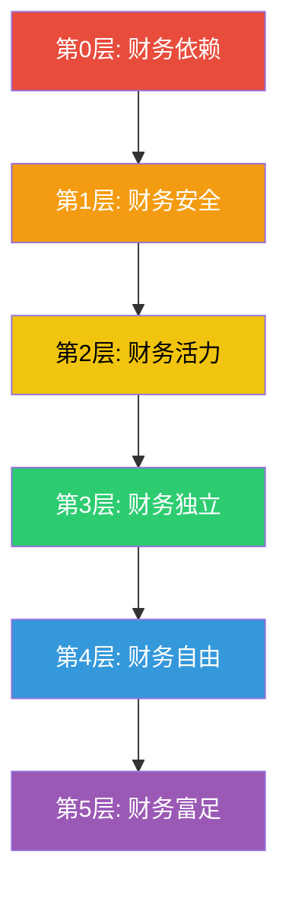
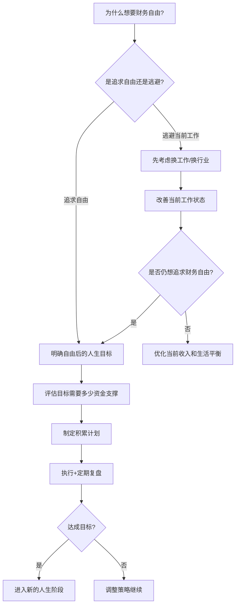

## 一、财务自由的定义

### 1.1 什么是财务自由？

"财务自由"是被滥用最多的概念之一。有人觉得它意味着"有花不完的钱"，有人觉得它是"不用上班"，还有人觉得它是"亿万身家"。这些理解都抓到了某个侧面，但没有触及本质。

**财务自由的精确定义：**

> **财务自由 = 被动收入 ≥ 生活支出**
>
> 即：不依赖主动劳动，仅凭资产产生的持续性现金流，即可覆盖全部生活开销。

这个定义拆开来看有三个关键要素：

| 要素 | 说明 | 常见误解 |
|------|------|----------|
| **被动收入** | 不需要你投入时间就能持续产生的收入（投资收益、租金、版税、股息等） | 把"高薪"当作被动收入；把"兼职收入"误认为被动收入 |
| **≥ 生活支出** | 被动收入至少等于你实际的生活成本 | 只算基本温饱，忽略了医疗、教育、旅行、应急等隐性支出 |
| **不依赖主动劳动** | 核心标准是你"可以选择不工作"而非"一定不工作" | 认为财务自由=完全不工作 |

**为什么这个定义比"有很多钱"更好？**

"有很多钱"是一个静态的、模糊的概念。而"被动收入≥生活支出"是一个动态的、可计算的公式——它把财务自由从一个遥不可及的梦想，变成了一个可以拆解、可以规划、可以逐步实现的目标。

- 年支出10万的人和年支出100万的人，实现财务自由的门槛相差10倍
- 在三线城市拥有300万投资资产的退休老人，可能比在北京年入百万但月光的白领更接近财务自由
- 一个拥有5套无贷款出租房、月租金收入2万的人，如果月支出1.5万，已经实现了财务自由——哪怕他的"身价"在很多人看来并不高

**财务自由的本质是自由，不是财富。** 财富只是手段，自由才是目的。它意味着你拥有了对时间的支配权——人生最稀缺的资源。

### 1.2 财务自由的五个层级

财务自由不是一个"0或1"的开关，而是一个渐进的过程。理解这些层级，有助于你设定阶段性目标：



**第0层：财务依赖（Financial Dependence）**

你的收入不足以覆盖支出，需要依赖他人（父母、伴侣、信用卡、借贷）来维持生活。这是很多年轻人的起点，也是部分"高消费低储蓄"群体的真实状态。特征：月光、负债、无储蓄、无投资。

**第1层：财务安全（Financial Safety）**

你拥有3-6个月的紧急备用金，没有高息负债（信用卡分期、消费贷），基本保险覆盖。你不再为突发意外（失业、生病）而焦虑。这是从"依赖"走向"独立"的第一步。

- 门槛：3-6个月生活支出的现金储备
- 解锁能力：抗风险、不恐慌
- 典型标志：不再因为意外支出而失眠

**第2层：财务活力（Financial Vitality）**

你的资产产生的被动收入可以覆盖基本生存需求——食物、住所、基本交通。即使失去主要收入来源，你不会挨饿受冻，但生活质量会大幅下降。

- 门槛：被动收入 ≥ 基本生存支出（通常为总支出的30%-40%）
- 解锁能力：基本安全感、敢于拒绝明显不合理的工作要求
- 典型标志：即使失业也不至于立刻陷入困境

**第3层：财务独立（Financial Independence）**

你的被动收入可以覆盖当前的全部生活支出。你可以选择不工作，生活品质不会下降。这是通常意义上的"财务自由"。

- 门槛：被动收入 ≥ 当前全部生活支出
- 解锁能力：完全的时间自由、工作成为选择
- 典型标志：可以随时辞职而生活不受影响

**第4层：财务自由（Financial Freedom）**

在财务独立的基础上，你还有足够的余量应对通胀、意外支出、生活方式升级，以及支持家人。你不仅不需要工作，还可以从容地追求高风险高回报的事业（创业、创作、公益等）。

- 门槛：被动收入 ≥ 生活支出 × 1.5-2倍
- 解锁能力：从容、从容、再从容
- 典型标志：敢于投入时间和金钱去做可能没有短期回报的事

**第5层：财务富足（Financial Abundance）**

你的财富远远超过个人和家庭的需求，可以实现大规模的社会影响——慈善、投资、资助他人。这个层级的目标不是"我需要多少"，而是"我能创造什么"。

- 门槛：资产远超个人需求，被动收入数倍于支出
- 解锁能力：社会影响力、代际传承
- 典型标志：思考的不再是如何赚钱，而是如何让钱创造最大价值

**为什么理解层级很重要？**

因为它让你看到：财务自由不是一个遥不可及的终点，而是一段有明确里程碑的旅程。从第0层到第1层（存够3个月备用金），可能只需要半年到一年；而从第3层到第4层，可能需要5-10年。每一层都有独立的价值——你不需要到达第5层才能改善生活。

### 1.3 4%法则：财务自由的数学基础

4%法则（The 4% Rule）是量化财务自由目标最经典的工具。它给了我们一个简洁有力的公式：**你需要的资产 = 年支出 ÷ 4%**（即年支出的25倍）。

**理论来源：**

1994年，美国财务规划师威廉·本根（William Bengen）在《Journal of Financial Planning》上发表论文，通过回测1926-1992年美国市场数据得出结论：一个由50%股票和50%债券组成的投资组合，在任何历史时期（包括大萧条、二战、滞胀等最恶劣的市场环境下），每年提取4%并根据通胀调整，都至少能支撑33年。

2006年，麻省理工学院的三位研究者（Philippe Cooley, Carl Hubbard, Daniel Walz）在"Trinity Study"中进一步验证了这一结论，并扩展到不同资产配置比例：

| 资产配置（股票/债券） | 30年不耗尽的概率 | 40年不耗尽的概率 |
|----------------------|-----------------|-----------------|
| 100% / 0% | 98% | 95% |
| 75% / 25% | 100% | 98% |
| 50% / 50% | 100% | 96% |
| 25% / 75% | 95% | 85% |
| 0% / 100% | 47% | 31% |

**计算示例：**

假设你每月生活开销为1.5万元（年支出18万元）：

- 4%法则：需要资产 = 18万 ÷ 4% = **450万元**
- 3.5%保守法则：需要资产 = 18万 ÷ 3.5% ≈ **514万元**
- 3%极保守法则：需要资产 = 18万 ÷ 3% = **600万元**

**4%法则的核心假设与局限：**

| 假设 | 现实情况 | 影响 |
|------|----------|------|
| 70%美国股票+30%美国债券的回报 | 中国市场结构不同 | 可能高估或低估 |
| 通胀率2%-3% | 中国近年通胀波动较大 | 高通胀期侵蚀购买力 |
| 30年规划周期 | 45岁退休需要40-50年 | 需要更保守的提取率 |
| 每年固定提取+通胀调整 | 实际支出有波动 | 某年大额医疗可能打乱计划 |
| 未考虑税收 | 中国目前无资本利得税（股票），但有房租税 | 部分收入需扣税 |

**在中国的适用性调整：**

1. **提取率下调至3%-3.5%**。中国市场历史数据较短，波动性较大，社保体系的保障力度与美国不同。采用更保守的提取率可以增加安全边际。
2. **单独处理房产**。中国家庭资产中房产占比高达60%-70%（央行2019年调查数据），远高于美国的25%-30%。自住房不产生现金流，应从"可投资资产"中剔除。出租房产则单独计算净租金收益率。
3. **纳入社保因素**。如果你有完善的职工社保（医保+养老），退休后的基本医疗和生活有一定保障，可以适当降低"所需资产"的计算基数。但社保替代率（退休金/退休前工资）通常只有40%-60%，不能完全依赖。
4. **考虑汇率风险**。如果你计划在海外生活或持有大量海外资产，人民币汇率波动也是变量。
5. **分阶段提取**。退休前10年（活跃期）支出较高（旅行、社交、学习），中后期（70岁后）可能降低但医疗支出增加。简单用"年支出×25"一刀切会失真，建议分阶段建模。

**超越4%法则：动态提取策略**

4%法则是一个"固定规则"——无论市场涨跌，每年提取固定比例。但实际操作中，动态策略往往更优：

- **等比策略（Guyton-Klinger Guardrails）**：设定提取率的上下限（比如3%-6%），市场大涨时多提一点，大跌时少提一点。研究表明这种方法可以把安全提取率提高到5%以上。
- **地板-天花板策略**：设定最低支出（地板，即基本生存需求）和最高支出（天花板，即理想生活），在两者之间浮动。
- **按需提取法**：不做固定比例提取，而是根据当年实际支出提取。适合有高度灵活生活方式的人。

### 1.4 被动收入的完整分类体系

理解"被动收入"是理解财务自由的关键。很多人对被动收入的理解过于狭窄，只想到银行利息。实际上，被动收入是一个完整的光谱：

**第一类：金融资产收入**

| 收入类型 | 说明 | 典型年化收益 | 风险等级 | 门槛 |
|----------|------|-------------|----------|------|
| 银行存款利息 | 定期存款、大额存单 | 1.5%-3% | 极低 | 低 |
| 债券利息 | 国债、企业债、债券基金 | 3%-6% | 低-中 | 低-中 |
| 股票分红 | 高股息蓝筹股、红利基金 | 3%-8% | 中-高 | 中 |
| 基金分红 | 指数基金、混合基金分红 | 0%-5% | 中 | 低 |
| 理财产品收益 | 银行理财、信托 | 3%-8% | 中 | 中-高 |

**第二类：不动产收入**

| 收入类型 | 说明 | 典型净收益率 | 注意事项 |
|----------|------|-------------|----------|
| 住宅出租 | 住宅物业出租 | 1.5%-4%（净） | 空置率、维修成本、管理精力 |
| 商铺出租 | 商业物业出租 | 3%-8%（净） | 招商风险、商业周期 |
| REITs | 房地产信托基金 | 4%-8% | 流动性好但有市场波动 |

**第三类：知识产权收入**

| 收入类型 | 说明 | 收益特征 | 建设周期 |
|----------|------|----------|----------|
| 书籍版税 | 出版或自出版图书 | 持续但通常较低 | 6-24个月 |
| 课程/教程 | 在线教育平台课程 | 可规模化 | 3-12个月 |
| 软件/App | 应用内购、SaaS订阅 | 高度可规模化 | 6-36个月 |
| 专利授权 | 技术专利许可费 | 不确定性高 | 1-5年 |
| 内容创作 | YouTube/B站/公众号广告分成 | 依赖流量 | 3-24个月 |

**第四类：业务系统收入**

| 收入类型 | 说明 | 特征 |
|----------|------|------|
| 自动化生意 | 有雇员运营的企业，老板不参与日常经营 | 需要前期大量投入 |
| 加盟/连锁 | 授权品牌和系统给他人运营 | 需要品牌积累 |
| 联盟营销 | 推荐产品获得佣金 | 依赖流量 |

**关于"被动"的真相：**

没有任何收入是100%被动的。所有的"被动收入"都需要前置的主动投入——投入时间、精力、金钱或技能。区别在于：

- **主动收入**：投入时间→获得收入（停止投入→收入归零）
- **被动收入**：前期大量投入→建立系统→系统持续产出（后期投入少量维护时间）

因此，更准确的分类应该是**"收入的主动程度"**，而非"主动/被动"的二元划分。理解这一点，就不会被"躺赚"的幻想所迷惑，也不会因为"需要前期努力"而放弃建设被动收入体系。

### 1.5 FIRE运动：财务自由的实践哲学

FIRE是"Financial Independence, Retire Early"的缩写，中文译为"财务独立，提前退休"。这个运动起源于1992年薇琪·罗宾（Vicki Robin）和乔·多明格斯（Joe Dominguez）合著的《富足人生》（Your Money or Your Life），并在2010年代通过Reddit的r/financialindependence社区和众多博客迅速传播。

FIRE不是一个投资策略，而是一套完整的人生哲学——它从根本上重新定义了人与金钱、人与工作的关系。

#### 1.5.1 FIRE的三个核心理念

**（1）计算你的真实时薪**

你的实际收入远低于工资条上的数字。真实时薪的计算公式：

```text
真实时薪 = (月薪 - 工作相关支出) ÷ (标准工作时间 + 通勤时间 + 加班时间 + 下班后的工作相关时间)
```

示例计算：

| 项目 | 金额/时间 |
|------|----------|
| 名义月薪 | 15,000元 |
| 减：通勤交通费 | -400元 |
| 减：工作午餐（比在家多花的部分） | -600元 |
| 减：职业装/形象支出 | -500元 |
| 减：应酬/团建分摊 | -800元 |
| 减：减压消费（因工作压力的额外消费） | -1,000元 |
| 减：通勤+加班导致的家务外包 | -500元 |
| **实际收入** | **11,200元** |
| | |
| 标准工作时间 | 22天 × 8小时 = 176小时 |
| 加：通勤时间 | 22天 × 2小时 = 44小时 |
| 加：平均加班 | 22天 × 2小时 = 44小时 |
| 加：下班后的邮件/学习等 | 22天 × 0.5小时 = 11小时 |
| **实际投入时间** | **275小时** |
| | |
| **真实时薪** | **11,200 ÷ 275 ≈ 40.7元** |

名义时薪68元，真实时薪40.7元——缩水了40%。当你用这个数字重新审视消费时，一杯30元的奶茶不是"随手一杯"，而是"你工作44分钟的生命能量"。这种认知转变，是FIRE思维的第一步。

**（2）储蓄率决定一切**

大多数人认为，实现财务自由的关键是"赚更多钱"或者"找到更好的投资"。但FIRE运动用数学证明了：**储蓄率才是最大的杠杆变量**。

储蓄率的定义：储蓄率 = (收入 - 支出) ÷ 收入 × 100%

以下是不同储蓄率下实现财务自由所需年数的完整对照表（假设初始净资产为零，投资实际年化回报率5%）：

| 储蓄率 | 所需年数 | 说明 |
|--------|----------|------|
| 5% | 约66年 | 几乎不可能在工作年限内实现 |
| 10% | 约51年 | 退休前可能无法实现 |
| 15% | 约43年 | 需要整个职业生涯 |
| 20% | 约37年 | 标准退休规划 |
| 25% | 约32年 | 积极储蓄者 |
| 30% | 约28年 | 开始有"提前退休"的可能 |
| 40% | 约22年 | 可在50岁前退休 |
| 50% | 约17年 | 可在40岁出头退休 |
| 60% | 约12.5年 | 35岁开始，47-48岁自由 |
| 70% | 约8.5年 | 极端但有效 |
| 80% | 约5.5年 | 极简生活主义者的利器 |
| 90% | 约2.5年 | 极少数人能做到 |

这张表揭示了一个深刻的事实：**从10%储蓄率提升到50%，所需时间从51年缩短到17年——仅靠"少花钱"就能把实现时间缩短34年。** 而试图通过"找到年化20%的投资"来加速，不仅风险极高，而且效果远不如直接提高储蓄率。

为什么储蓄率如此强大？因为它同时做了两件事：减少了未来需要替代的支出金额，增加了当前用于投资的资金。这是一个双杠杆效应。

**（3）跨过临界点后，钱开始自动增长**

在积累初期，你的资产增长主要靠储蓄（你主动存入的钱）。但随着资产规模增大，投资收益的绝对金额开始超过你的年度储蓄。这就是"复利临界点"。


例如：年储蓄10万，投资年化7%
- 第1年末：资产10万，收益7000元（收益/储蓄 = 7%，储蓄为主）
- 第5年末：约57.5万，收益约4万（收益/储蓄 = 40%，开始有感）
- 第10年末：约138万，收益约9.7万（收益/储蓄 ≈ 100%，临界点）
- 第15年末：约251万，收益约17.6万（收益/储蓄 = 176%，收益为主）
- 第20年末：约410万，收益约28.7万（收益远超储蓄，雪球效应显著）

理解这一点的意义在于：**积累期最难熬，但一旦跨过临界点，增长速度会让你惊讶。** 最大的敌人不是回报率，而是在临界点之前放弃。

#### 1.5.2 FIRE的四大流派

FIRE运动内部发展出了多个分支，适合不同风险偏好和生活方式的人群：

**精简FIRE（Lean FIRE）**

核心理念：通过极简生活方式大幅降低年度支出，从而降低财务自由门槛。

- 目标年支出：15万元以下（单人）/ 25万元以下（家庭）
- 所需资产：约375万-625万（按4%计算）
- 适合人群：低物欲、崇尚极简生活、自律性强的人
- 生活方式：自己做饭、骑自行车、少买衣服、住小房子、享受免费娱乐
- 风险：过度节俭可能导致生活质量下降和社会关系疏离
- 代表性博主：Mr. Money Mustache

**肥厚FIRE（Fat FIRE）**

核心理念：在不牺牲生活品质的前提下实现财务自由。

- 目标年支出：50万以上（单人）/ 80万以上（家庭）
- 所需资产：约1250万-2000万以上
- 适合人群：高收入群体、不愿降低生活标准的人
- 生活方式：与现在基本相同，但没有工作压力
- 优势：心理上更容易接受，不需要改变习惯
- 挑战：需要更高的收入或更长的积累时间

**咖啡师FIRE（Barista FIRE）**

核心理念：积累足够的资产覆盖大部分支出，再通过轻松的兼职/兴趣工作补齐缺口。

- 目标资产：覆盖基本支出的70%-80%
- 兼职收入目标：覆盖剩余20%-30%
- 适合人群：不想完全停止工作但想摆脱高压工作的人
- 典型场景：辞掉互联网996工作，做咖啡师/花店/瑜伽教练/自由职业
- 优势：保持社交连接、有目的感、还能享受兼职带来的社保福利
- 风险：兼职收入不稳定、可能慢慢变回全职

**海岸FIRE（Coast FIRE）**

核心理念：已有足够的投资本金，复利会在正常退休年龄时增长到财务自由目标，现在只需覆盖当前开支即可。

- 计算方式：当前资产按预期回报率复利增长，到65岁时是否能达到财务自由目标
- 适合人群：已有一定资产积累，不想再为退休储蓄的人
- 典型场景：30岁积累了200万投资资产，假设7%年化回报，到65岁约2200万——已超过目标。此后只需赚够当前生活费，不再需要为退休存钱。
- 优势：极大减轻心理压力，可以把精力投入到真正感兴趣的事情上

#### 1.5.3 FIRE的中国特色适配

FIRE运动源自美国，直接照搬到中国会有水土不服的问题。以下是关键的适配要点：

| 维度 | 美国FIRE | 中国适配 | 建议 |
|------|----------|----------|------|
| 医疗费用 | 依赖商业保险，保费高 | 有职工医保/居民医保基础保障 | 确保医保不断缴，补充商业重疾险 |
| 住房成本 | 租房文化成熟 | 买房是主流，房贷是最大固定支出 | 考虑是否需要"还完房贷再FIRE" |
| 教育支出 | 公立教育免费 | 教育内卷，课外支出高 | 子女教育单独规划，不纳入FIRE计算 |
| 社保养老 | 401K/IRA自管 | 社保体系不同，替代率偏低 | 不能完全依赖社保，需额外储备 |
| 社会压力 | "提前退休"被接受 | "不上班"会被质疑 | 需要强大的心理建设和价值观支撑 |
| 投资渠道 | 股票市场成熟，指数基金长期回报好 | A股波动大，散户比例高 | 全球化配置，不局限于A股 |
| 父母养老 | 个人独立文化 | 赡养父母是法定义务和文化期望 | 需额外预算父母养老和医疗 |

### 1.6 个人财务自由数字的计算方法

知道了理论，下一步是算出你自己的"财务自由数字"。以下是完整的计算框架：

**第一步：计算年度真实生活支出**

不只是"维持温饱"的开销，而是你期望的、可持续的生活方式对应的真实支出。包括：

- 固定支出：房贷/房租、物业费、保险、车贷
- 日常支出：餐饮、交通、日用品、通讯
- 弹性支出：旅行、娱乐、购物、社交
- 长期支出：子女教育、父母赡养（分摊到每年）
- 医疗/保险：商业保险、自费医疗预算
- 应急预算：年度支出的5%-10%作为缓冲

**示例：一个二线城市的三口之家**

| 支出项目 | 月均（元） | 年均（元） |
|----------|-----------|-----------|
| 房贷（还完后为物业+维修基金） | 5,000 | 60,000 |
| 餐饮（含偶尔外出） | 4,000 | 48,000 |
| 交通（养车/打车） | 2,000 | 24,000 |
| 子女教育 | 3,000 | 36,000 |
| 父母赡养 | 2,000 | 24,000 |
| 保险（商业重疾+意外+医疗） | 1,500 | 18,000 |
| 旅行/娱乐 | 2,000 | 24,000 |
| 日用品/衣物/通讯 | 1,500 | 18,000 |
| 医疗/应急 | 1,000 | 12,000 |
| **合计** | **22,000** | **264,000** |

**第二步：选择安全提取率**

- 激进（不推荐）：5%——仅适用于极低支出或有强大后备方案的人
- 标准：4%——基于美国市场数据，中国适用但有一定风险
- 保守（推荐）：3%-3.5%——更适合中国市场和较长退休周期
- 极保守：2.5%-3%——适合40岁以下退休者或无社保者

**第三步：计算财务自由数字**

```text
财务自由数字 = 年度支出 ÷ 安全提取率
```

以上述家庭为例（年支出26.4万元）：

| 提取率 | 所需资产 | 难度评估 |
|--------|----------|----------|
| 4% | 660万元 | 中高 |
| 3.5% | 754万元 | 高 |
| 3% | 880万元 | 很高 |

**第四步：考虑社保的抵扣效应**

如果你有完善的职工社保，退休后能领取的养老金可以部分替代生活支出。假设退休后社保养老金为每月5000元（年6万），则：

- 调整后年支出 = 26.4万 - 6万 = 20.4万
- 按3.5%提取率计算：20.4万 ÷ 3.5% ≈ 583万元

社保养老金的纳入，可以将所需资产降低约23%。但需要注意：社保养老金通常在法定退休年龄后才能领取，如果你计划45岁退休，中间的15-20年缺口需要自己覆盖。

**第五步：建立个人财务仪表盘**

| 指标 | 计算方式 | 当前值 | 目标值 | 差距 |
|------|----------|--------|--------|------|
| 年度支出 | 记账12个月取平均 | — | 26.4万 | — |
| 当前净资产 | 资产总额 - 负债总额 | — | — | — |
| 年储蓄额 | 年收入 - 年支出 | — | — | — |
| 储蓄率 | 年储蓄 ÷ 年收入 | — | ≥50% | — |
| 财务自由进度 | 净资产 ÷ 财务自由数字 | — | 100% | — |
| 预计达成年份 | 按当前储蓄率+预期回报推算 | — | — | — |

建议每季度更新一次这个仪表盘，它是你"搞钱旅程"的导航仪。

### 1.7 常见误解与认知陷阱

**误解1："财务自由就是不工作"**

真相：财务自由的核心是"选择权"。很多实现财务自由的人仍然在工作，但他们做的是自己热爱的事，而非被迫谋生。研究表明，完全不工作反而容易导致心理健康问题——失去目标感和社会连接。FIRE社区中，越来越多的人把"Retire Early"重新诠释为"Recreational Employment"（娱乐性就业）。

**误解2："等我赚到XXX万就自由了"**

真相：如果你不改变消费习惯和对金钱的认知，收入再高也不会自由。月入5万但月光的人并不比月入1万存5000的人更接近自由。财务自由是一个系统工程，不是单纯的数字游戏。

**误解3："只有高收入才能实现财务自由"**

真相：高收入确实有优势，但储蓄率比绝对收入更重要。月入8000存4000（50%储蓄率）的人，比月入30000存3000（10%储蓄率）的人更早实现自由。关键在于控制欲望和优化支出结构，而非单纯追求收入增长。

**误解4："财务自由之后生活就完美了"**

真相：财务自由解决的是"钱的问题"，但人生中还有很多钱解决不了的问题——健康、关系、意义感、自我认同。一些FIRE实践者在实现自由后反而出现了"空虚综合征"——突然发现不知道该做什么。因此，财务自由需要配合人生目标的规划。

**误解5："投资回报率越高越好"**

真相：高回报必然伴随高风险。追求年化30%的回报率，大概率不是加速财务自由，而是倒退。稳定、可持续的年化7%-10%回报率（长期来看），配合高储蓄率，才是最可靠的路径。

**误解6："财务自由要很多钱，跟我没关系"**

真相：财务自由的门槛完全取决于你的支出水平。年支出10万的人，按4%法则只需要250万资产。这并非遥不可及——10年储蓄+合理投资，对很多工薪阶层是可以企及的。关键在于你愿不愿意为此调整生活方式。

### 1.8 财务自由与人生设计

财务自由不是终点站，而是一张通往更广阔人生的门票。但它本身不提供方向——你需要在到达之前就想好"自由之后做什么"。

**自由之前应该想清楚的三个问题：**

1. **如果不需要为钱工作，我会做什么？** 如果答案是"不知道"，那实现自由后的空虚感可能比上班的压力更难受。建议在积累期就开始探索兴趣和意义感。

2. **我追求的是自由还是逃避？** 如果你只是讨厌当前的工作，解决方案可能是换工作或换行业，而非财务自由。财务自由是一个大工程，如果出发点是逃避，很难坚持。

3. **自由之后，我与家人/伴侣的期望是否一致？** FIRE实践者最大的失败案例之一，就是一个人想极简FIRE，另一个人想维持高消费。财务自由需要家庭层面的共识。



### 1.9 本节要点总结

| 概念 | 核心要点 |
|------|----------|
| 财务自由定义 | 被动收入 ≥ 生活支出，本质是时间的自由 |
| 五个层级 | 依赖→安全→活力→独立→自由→富足，是渐进旅程 |
| 4%法则 | 年支出×25=所需资产，中国建议调整为3%-3.5% |
| 被动收入分类 | 金融资产、不动产、知识产权、业务系统四大类 |
| FIRE核心 | 真实时薪、储蓄率决定一切、复利临界点 |
| FIRE流派 | 精简/肥厚/咖啡师/海岸，适合不同人群 |
| 计算个人数字 | 年支出÷安全提取率-社保抵扣=你的财务自由数字 |
| 关键认知 | 自由不是不工作，储蓄率比回报率重要，钱不解决所有问题 |
