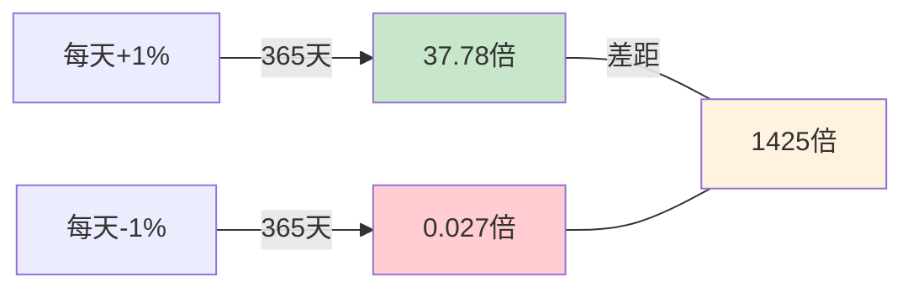
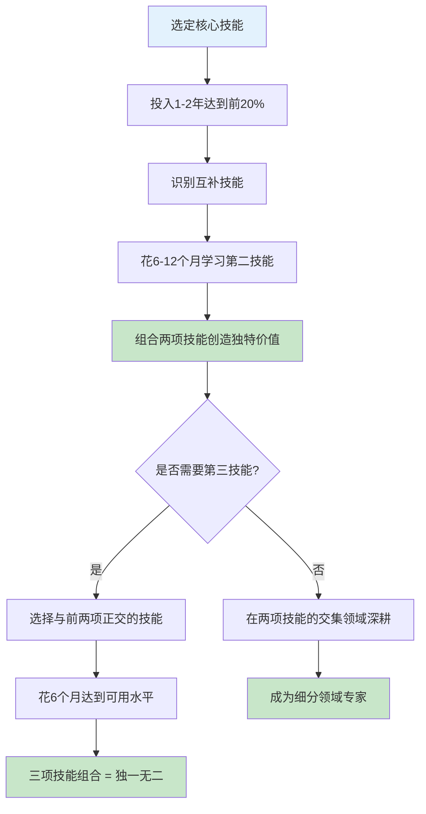
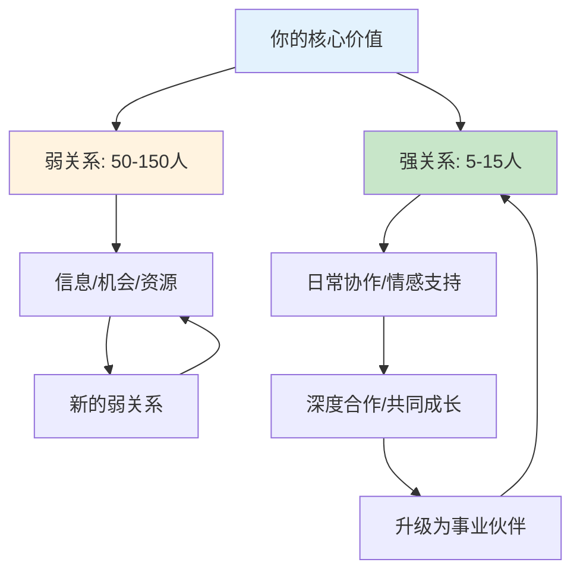
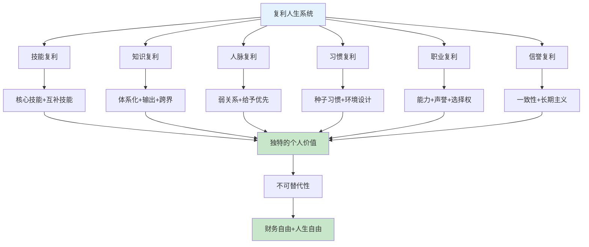

## 二、复利人生：超越投资的复利思维

爱因斯坦曾说："复利是世界第八大奇迹。"（注：这句话的真实性存疑，但复利本身的威力是真实的。）大多数人听到"复利"，第一反应是银行存款、股票投资、基金定投。但复利的本质远不止于此——它是一种关于"持续积累如何产生惊人结果"的底层规律。本节将复利思维从金融领域抽离出来，应用到技能、知识、人脉、习惯、职业等人生各个维度，帮你构建一个全方位的"复利人生"。

### 2.1 复利的数学本质：为什么指数增长反直觉

#### 2.1.1 公式与直觉的冲突

复利的数学公式极其简单：

**FV = PV × (1 + r)^n**

- FV（Future Value）：终值
- PV（Present Value）：现值（初始投入）
- r：每期增长率
- n：期数

这个公式看起来平淡无奇，但它描述的增长模式与人类的直觉完全相反。人类天生擅长理解线性增长（每天多赚10块钱），但对指数增长毫无感觉。

用一个具体例子说明：假设你每天进步1%（r=0.01），持续一年（n=365）：

- 初始值 PV = 1
- 年终值 FV = 1 × (1.01)^365 = **37.78**

也就是说，每天进步1%，一年后你的能力是年初的**37.78倍**。这不是线性叠加的3.65倍（1% × 365天），而是指数级别的增长。

#### 2.1.2 临界点：为什么前期最痛苦

指数增长有一个关键特征：**前期极其缓慢，后期急剧加速**。

用同样每天1%增长的例子，分阶段看：

| 时间段 | 累计增长 | 看起来像什么 |
|--------|----------|-------------|
| 第1-30天 | 1 → 1.35 | 几乎没变化 |
| 第31-100天 | 1.35 → 2.70 | 慢慢在涨 |
| 第101-200天 | 2.70 → 7.32 | 开始有感觉了 |
| 第201-300天 | 7.32 → 19.78 | 加速明显 |
| 第301-365天 | 19.78 → 37.78 | 最后两个月翻了近一倍 |

这就是为什么大多数人放弃：他们在第30天看不到变化就认为"没用"，殊不知再坚持70天就能看到2倍增长，再坚持到年底就是37倍。

**复利的第一课：耐心不是美德，而是数学必然。**

#### 2.1.3 负复利：为什么坏习惯的破坏力更大

复利不只是正向的。负复利同样存在，而且破坏力往往更大。

假设两个投资者，A的年化收益是10%，B的年化收益是-10%：
- 第1年后：A = 1.1，B = 0.9
- 第5年后：A = 1.61，B = 0.59
- 第10年后：A = 2.59，B = 0.35
- 第20年后：A = 6.73，B = 0.12

20年后，A的资产是B的**56倍**。更残酷的是：B亏损50%后，需要上涨100%才能回本。这就是为什么巴菲特说投资的第一条规则是"不要亏损"，第二条规则是"记住第一条"。

应用到人生：一个每天进步1%和一个每天退步1%的人，一年后的差距不是2倍，而是37.78 ÷ 0.0265 = **1425倍**。坏习惯的复利效应同样惊人，只是方向相反。



### 2.2 技能复利：复合型能力的指数效应

#### 2.2.1 什么是技能复利

技能复利是指：当你掌握多项技能时，这些技能不是简单叠加，而是**相乘**。一个会编程的人和一个懂金融的人，各自值100分；但一个既会编程又懂金融的人，不是值200分，而是值1000分甚至更多——因为他能做到别人做不到的事。

这背后的数学原理是：如果你有n项独立技能，每项技能在同领域排名前10%，那么你同时拥有这n项技能的概率是 10%^n。当n=3时，这个概率是千分之一；当n=5时，这个概率是十万分之一。你不需要在任何一项技能上成为顶尖，只需要在多项技能上都达到"不错"的水平，你的独特性就指数级增长了。

#### 2.2.2 Scott Adams的"才华叠加"理论

《呆伯特》漫画作者斯科特·亚当斯（Scott Adams）提出了一个著名的观点：你不需要在某件事上做到最好，你只需要在两三件事上做到前25%，然后把它们组合起来。

他自己的例子：
- 画画能力：不算顶尖，大概前25%
- 幽默感：不错，大概前25%
- 商业知识：有一些，大概前25%

这三项能力单独拿出来，没有一项能让他出类拔萃。但组合在一起——一个懂商业的、会画画的幽默作家——他就成了独一无二的漫画家，创造了年收入数千万美元的《呆伯特》帝国。

#### 2.2.3 可叠加技能的选择原则

不是所有技能都能产生复利效应。选择技能时需要遵循以下原则：

**原则一：底层技能优先**

底层技能是那些无论你做什么行业、什么岗位都用得上的能力：

| 底层技能 | 复利效应 | 适用场景 |
|----------|---------|---------|
| 写作能力 | 所有需要表达的场景 | 邮件、方案、汇报、自媒体 |
| 演讲能力 | 所有需要说服的场景 | 求职、销售、融资、管理 |
| 逻辑思维 | 所有需要决策的场景 | 分析、规划、谈判、解决问题 |
| 英语能力 | 所有国际化的场景 | 技术文档、跨境业务、信息获取 |
| 数据分析 | 所有需要量化的场景 | 运营、产品、投资、个人决策 |

**原则二：选择与核心技能"正交"的能力**

所谓"正交"，是指两项技能的交集很小，因此组合后的稀缺性很高。

举例：
- 程序员 + 艺术设计 = UI/UX工程师（稀缺度极高）
- 医生 + 编程 = 医疗AI专家（供不应求）
- 律师 + 金融科技 = 合规科技专家（高薪领域）
- 教师 + 自媒体 = 知识付费头部创作者（变现能力强）

反面例子：
- 程序员 + 系统管理员 = 技能重叠度高，稀缺性提升有限
- 会计 + 审计 = 本就是相近领域，叠加效应弱

**原则三：先深后广，深度为锚**

先把一项核心技能学到行业前20%，再横向扩展。原因很简单：没有一个"锚点"技能，你的其他技能就没有附着点。

错误路径：学半年Python → 学三个月设计 → 学两个月运营 → 学一个月写作 → 什么都懂一点，什么都不精

正确路径：深耕Python两年达到前20% → 学数据分析（与Python叠加） → 学行业知识（与数据分析叠加） → 学写作/演讲（输出你的专业见解）

#### 2.2.4 技能复利的实操路线图



### 2.3 知识复利：从碎片到体系的质变

#### 2.3.1 知识复利的三个阶段

知识积累不是线性的，而是呈S型曲线：

**阶段一：量变期（0-3年）**

大量输入，感觉学了很多但用不上。这是最痛苦的阶段，因为你学到的知识是孤立的、碎片化的，无法产生协同效应。

特征：
- 学了就忘，需要反复复习
- 知识之间缺乏联系
- 遇到问题时想不到用已学知识解决
- 容易产生"学了有什么用"的怀疑

**阶段二：质变期（3-7年）**

知识开始融会贯通，不同领域的知识开始产生交叉连接。你会发现自己能用A领域的知识解决B领域的问题，能从一个看似无关的案例中提炼出通用规律。

特征：
- 学习速度加快（因为新知识能挂在已有框架上）
- 开始产生"原来如此"的顿悟时刻
- 能看出不同领域之间的共性
- 开始形成自己的方法论

**阶段三：指数期（7年以上）**

知识迁移能力极强，进入任何新领域都能快速上手。因为你的底层认知框架已经足够强大，新知识只需要适配到已有框架上即可。

特征：
- 学习新领域的时间大幅缩短
- 能跨领域创新
- 知识输出能力远超输入速度
- 开始产生原创性见解

#### 2.3.2 加速知识复利的四个方法

**方法一：输出倒逼输入**

费曼学习法的核心：如果你不能把一个概念用简单的话解释清楚，说明你还没真正理解它。

具体做法：
- 每学完一个知识点，写一段200字的总结
- 每周写一篇学习笔记发布到公开平台
- 定期做内部分享或外部演讲
- 建立个人知识库（用Notion、Obsidian等工具）

为什么输出能加速知识复利？因为输出过程会暴露你理解的漏洞，迫使你回去补课。这个"发现漏洞→补课→再输出"的循环本身就是复利过程。

**方法二：建立知识体系而非碎片**

碎片化学习的最大问题是：知识无法产生"利息"。今天学了一个技巧，明天忘了；下周又学了一个类似的，还得从头学。

解决方案：为每个领域建立一个"知识树"。

```text
[领域名称]
├── 基础概念（树根）
│   ├── 核心定义
│   ├── 基本原理
│   └── 关键公式/模型
├── 方法论（树干）
│   ├── 核心方法
│   ├── 常用框架
│   └── 实操流程
├── 应用场景（树枝）
│   ├── 场景A
│   ├── 场景B
│   └── 场景C
└── 前沿进展（树叶）
    ├── 最新研究
    ├── 行业趋势
    └── 未来方向
```

每次学到新知识，问自己：这个知识应该挂在知识树的哪个位置？如果找不到位置，说明你的树需要扩展一个新的分支。

**方法三：跨界学习产生创新**

创新往往发生在两个领域的交叉点。乔布斯在大学旁听的书法课，后来影响了苹果电脑的字体设计。查理·芒格的"多元思维模型"就是刻意从多个学科（物理学、生物学、心理学、经济学等）中提取核心模型，然后交叉应用。

具体做法：
- 每年深入学习一个与本职工作无关的领域
- 阅读该领域的经典教材（而非畅销书）
- 刻意寻找该领域与你核心领域的相似之处
- 尝试用新领域的框架解释你熟悉的问题

**方法四：定期复盘与知识更新**

知识有保质期。技术领域的知识平均3-5年就会过时一半。如果不持续更新，你的知识复利会变成负复利。

复盘节奏建议：
- 每月：回顾本月学到的最重要的3个知识点
- 每季度：检查知识体系中有哪些过时需要更新
- 每年：重新审视整个知识框架，删减过时内容，补充新方向

### 2.4 人脉复利：弱关系的指数回报

#### 2.4.1 人脉复利的运作机制

人脉复利不是"认识很多人"，而是你的社交网络会随着时间推移产生越来越大的价值。其运作机制可以用一个简单的链条说明：

> 你在行业会议上认识了A → A在一年后推荐你参加一个项目 → 项目中你认识了B → B三年后成为某公司高管，给你提供了一个关键机会

这个链条的关键在于：**每一段关系都是下一段关系的种子**。你无法预测哪段关系会在什么时候产生回报，但你可以确保自己的"关系种子"足够多、质量足够高。

#### 2.4.2 弱关系理论：为什么不太熟的人反而最有用

社会学家马克·格兰诺维特（Mark Granovetter）在1973年提出了"弱关系的力量"（The Strength of Weak Ties）理论。他通过研究发现：大多数人找到工作（或获得重要机会）的信息来源，不是亲密的家人朋友（强关系），而是不太熟悉的 acquaintances（弱关系）。

原因很简单：
- **强关系**（家人、好友）和你生活在同一个信息圈子里，你知道的他们也知道
- **弱关系**（前同事、行业会议上认识的人、朋友的朋友）生活在不同的信息圈子里，他们能为你带来全新的信息和机会

这意味着：维护人脉的重点不是天天和好朋友聚餐，而是定期与"弱关系"保持联系。

#### 2.4.3 人脉复利的四个原则

**原则一：先给予，后索取**

人脉的本质是价值交换。如果你想让人脉产生复利，首先要成为别人的"复利来源"——主动为别人提供价值、介绍资源、分享信息。

具体做法：
- 看到对朋友有用的文章/信息，主动转发
- 发现两个可能互相受益的人，主动介绍
- 在自己擅长的领域，主动为他人提供帮助

**原则二：维护"弱关系"的最低成本策略**

不需要频繁联系，但需要定期"刷新存在感"：
- 每季度给重要弱关系发一条简短的消息（不是群发祝福）
- 看到对方的动态/成就，真诚地表示祝贺
- 每年至少参加2-3个行业活动，扩展新的弱关系

**原则三：建立个人品牌，让机会主动找你**

最高效的人脉复利是：别人主动来找你。这需要你在某个领域建立足够的个人品牌。

- 在公开平台持续输出专业内容
- 在行业社群中积极回答问题
- 参与开源项目或行业标准制定

**原则四：质量大于数量**

10个真正信任你、了解你能力的人脉，价值远超100个加了微信但从没聊过天的"好友"。



### 2.5 习惯复利：日常行为的长期回报

#### 2.5.1 习惯复利的数学

习惯是复利效应最直接的载体。每一个微小的日常行为，乘以365天再乘以10年，都会产生巨大的累积效应。

用具体数字说明：

| 习惯 | 日投入 | 10年累计投入 | 10年累计产出（保守估计） |
|------|--------|-------------|----------------------|
| 每天读书30分钟 | 30分钟 | 1825小时 | 约300本书，相当于一个小型图书馆的知识量 |
| 每天写作500字 | 30分钟 | 182.5万字 | 3-5本专业书籍，或一个有影响力的博客 |
| 每天运动30分钟 | 30分钟 | 1825小时 | 健康的身体，减少医疗支出，提升工作效率 |
| 每天存50元 | 0元（延迟消费） | 18.25万元 | 加上投资收益约25-30万元 |
| 每天学习英语30分钟 | 30分钟 | 1825小时 | 流利的英语能力，打开国际化机会 |

#### 2.5.2 詹姆斯·克利尔的"1%法则"

《原子习惯》（Atomic Habits）作者詹姆斯·克利尔提出了一个核心观点：**你不需要做出巨大的改变，只需要每天改善1%**。

他的"习惯复利公式"：

> 每日的成果 = 1 + 1%的改进
> 一年后的成果 = (1 + 1%)^365 = 37.78

但克利尔更强调的是习惯的"身份层面"效应。每个习惯不仅带来行为上的结果，更会改变你对自己的认知：

- 每次去健身房 → 你不再"试图健身的人"，而是"一个健身的人"
- 每次写500字 → 你不再"想写作的人"，而是"一个作家"
- 每次拒绝不必要的消费 → 你不再"省钱的人"，而是"一个有财务纪律的人"

身份的改变是最深层的复利——一旦你认同了"我是一个XX的人"，维持相关行为就不再需要意志力，而是自然而然的事。

#### 2.5.3 习惯复利的实操框架

**第一步：选择一个"种子习惯"**

不要同时改变多个习惯。选择一个对你当前阶段影响最大的习惯，坚持至少66天（研究显示习惯养成的平均时间）。

选择标准：
- 对你的核心目标有直接贡献
- 每天执行时间不超过30分钟
- 能产生可衡量的结果

**第二步：设计环境触发器**

习惯的触发依赖环境线索，而非意志力。

| 习惯 | 环境触发器设计 |
|------|--------------|
| 早起读书 | 把书放在枕头旁边，醒来第一眼就能看到 |
| 每天写作 | 打开电脑后第一个打开写作软件，而非社交媒体 |
| 每天运动 | 运动服前一晚就穿好/放在床边 |
| 每天记账 | 设置每晚9点手机提醒 |

**第三步：追踪与奖励**

使用习惯追踪表（纸质或App如Habitica、Streaks），记录每天的完成情况。连续打卡的天数本身就是一个强大的激励——你不想"断链"。

**第四步：在习惯稳固后叠加第二个**

当第一个习惯已经不需要意志力维持时（通常是66-252天），再叠加第二个习惯。每个新习惯都会借助已有习惯的"惯性"更容易养成。

### 2.6 职业复利：职业发展的非线性增长

#### 2.6.1 职业复利的三个维度

职业发展不是"每年涨薪5%"的线性过程，而是一个复利过程，体现在三个维度：

**维度一：能力复利**

你在工作中积累的能力不是简单叠加的。一个有5年经验的程序员，不是"1年经验重复了5次"，而应该是"5种不同层面的能力叠加"——编码能力 + 架构能力 + 项目管理能力 + 业务理解能力 + 技术视野。

**维度二：声誉复利**

职业声誉的积累遵循复利规律。前期你默默无闻，但当你持续交付高质量的工作、持续帮助同事解决问题、持续在行业内输出专业内容后，声誉会在某个临界点突然爆发——猎头开始主动联系你，同行开始推荐你，机会开始主动找你。

**维度三：选择权复利**

每一段成功的职业经历都会为你打开新的选择。第一份工作可能只有3个offer可选，但5年后你可能有10个选择，10年后你可能有50个选择。选择权的增加本身就是一种复利——你总能在众多选项中找到最好的那个。

#### 2.6.2 职业复利的关键策略

**策略一：选择有复利效应的工作内容**

并非所有工作内容都产生复利。区分两类任务：

| 有复利效应的工作 | 无复利效应的工作 |
|-----------------|-----------------|
| 建立可复用的系统/工具 | 重复性的手动操作 |
| 学习新技能并应用 | 做已经会的事情 |
| 建立行业人脉 | 封闭在小圈子里 |
| 写文档/教程/分享 | 知识留在脑子里不输出 |
| 解决有挑战的问题 | 回避难题只做舒适区内的事 |

**策略二：避免"伪勤奋"**

伪勤奋是指看起来很忙但没有产生复利的行为：
- 加班到深夜但只是在重复低价值工作
- 参加各种培训但从不实践
- 收藏了1000篇文章但从不阅读
- 制定了完美的计划但从不执行

真正产生复利的是"刻意练习"——在你的能力边缘，有针对性地练习薄弱环节，并获得及时反馈。

**策略三：打造职业杠杆**

杠杆是指能放大你努力效果的因素：

| 杠杆类型 | 示例 | 复利效应 |
|----------|------|---------|
| 代码杠杆 | 写一个工具被1000人使用 | 一次投入，持续产出 |
| 内容杠杆 | 写一篇技术文章被广泛传播 | 内容持续带来机会 |
| 团队杠杆 | 带团队放大个人产出 | 团队成果 > 个人努力 |
| 资本杠杆 | 用投资收益再投资 | 钱生钱，加速财富积累 |
| 平台杠杆 | 在大平台/知名品牌工作 | 平台背书提升个人价值 |

### 2.7 信誉复利：信任是最强大的资产

#### 2.7.1 信任的复利公式

沃伦·巴菲特说过："建立声誉需要20年，毁掉它只需要5分钟。"

信任的复利公式可以这样理解：

> 新的信任 = 旧的信任 + 一次一致的行为
> 信任的价值 = f(信任度 × 时间)

每一次你说到做到、每一次你主动承认错误、每一次你优先考虑长期关系而非短期利益，你的信任账户都会增加一笔"利息"。这笔利息会在未来以机会、合作、推荐的形式回报给你。

#### 2.7.2 信任复利的日常维护

信任不是一次性建立的，而是通过无数个微小的"一致性信号"累积的：

- 答应的事情一定做到（如果做不到，提前沟通）
- 准时赴约（或提前说明会迟到）
- 承认不知道（而不是不懂装懂）
- 主动分享功劳（而不是独占）
- 在别人背后说好话（与当面说的一致）

#### 2.7.3 信任复利的反面：一次背叛的代价

信任是典型的非对称资产：建立慢，摧毁快。一次严重的失信行为可能需要10次正面行为才能弥补，而有些背叛是永远无法修复的。

具体案例：
- 一个创业者融了A轮后挥霍资金，之后再创业几乎没有投资人愿意投
- 一个员工在关键项目中掉链子，之后几年都难以获得重要机会
- 一个自媒体博主被发现抄袭，粉丝流失可能是永久性的

### 2.8 综合复利：如何构建你的复利人生系统

#### 2.8.1 复利人生的核心框架

将以上所有维度整合成一个统一的复利人生系统：



#### 2.8.2 个人复利诊断清单

在开始构建复利人生之前，先评估你当前在各个维度的状态：

| 维度 | 自评问题 | 评分标准 |
|------|---------|---------|
| 技能 | 你是否有至少一项技能达到行业前20%？ | 1-5分 |
| 知识 | 你是否有系统化的知识体系？ | 1-5分 |
| 人脉 | 你是否有50个以上会主动推荐你的人？ | 1-5分 |
| 习惯 | 你是否有3个以上持续超过半年的积极习惯？ | 1-5分 |
| 职业 | 你的工作内容有多少比例产生复利效应？ | 1-5分 |
| 信誉 | 你的同事/合作伙伴对你的信任度如何？ | 1-5分 |

如果总分低于18分，说明你的复利人生系统还有很大的优化空间。从得分最低的维度开始改进。

#### 2.8.3 月度复利检查清单

每月花30分钟回答以下问题：

1. **技能**：本月学了什么新技能？已有技能有提升吗？
2. **知识**：本月读了什么书/文章？有新的知识节点加入体系吗？
3. **人脉**：本月认识了什么新朋友？维护了哪些弱关系？
4. **习惯**：本月的习惯执行率如何？有需要调整的吗？
5. **职业**：本月的工作有多少是高复利的？有多少是低价值重复？
6. **信誉**：本月有没有说到做到？有没有什么承诺没有兑现？

### 2.9 常见误区与纠正

#### 误区一：把复利当成"快速致富"

**错误认知**：只要找到一个高收益率的投资，就能快速实现财务自由。

**事实**：复利的威力需要时间来释放。收益率每提高1%，对最终结果的影响远小于多坚持一年。10%的收益坚持30年 = 17.4倍；12%的收益坚持25年 = 17倍。时间比收益率更重要。

#### 误区二：忽略复利的前提条件

**错误认知**：只要坚持就能产生复利。

**事实**：复利的前提是"方向正确"。如果你每天坚持学习一个过时的技术，坚持10年也不会产生正向复利。复利需要在正确的方向上持续投入。

#### 误区三：只关注正向复利，忽略负向复利

**错误认知**：复利就是好的，只要坚持积累就会越来越好。

**事实**：坏习惯、错误决策、负面关系同样会产生复利。每天抽一包烟的复利效应是肺部疾病；每天和消极的人混在一起的复利效应是思维僵化。构建复利人生，首先要做的是停止负向复利。

#### 误区四：过度优化，忽略系统性

**错误认知**：每个维度都要追求极致。

**事实**：复利人生是一个系统，需要各维度之间的平衡。过度追求技能提升而忽略人脉，可能成为"技术很强但没人知道"的人。过度追求人脉而忽略能力，可能成为"认识很多人但没人真正认可"的人。

#### 误区五：等待"完美时机"

**错误认知**：等我准备好了再开始。

**事实**：复利最大的敌人是"不开始"。每一天的延迟都是损失一天的复利。你不需要准备好才开始，你需要开始才能准备好。

### 2.10 本节要点总结

1. **复利是指数增长**：前期缓慢，后期爆发。耐心不是美德，而是数学必然。
2. **技能复利靠叠加**：选择可叠加的、正交的技能组合，先深后广。
3. **知识复利靠体系**：从碎片化学习到系统化知识树，输出倒逼输入。
4. **人脉复利靠弱关系**：不太熟的人反而能带来最多新机会，先给予后索取。
5. **习惯复利靠坚持**：每天1%的进步，一年后是37.78倍。选择种子习惯，设计环境触发器。
6. **职业复利靠杠杆**：代码、内容、团队、资本、平台都是放大器。
7. **信誉复利靠一致性**：信任是最强大的资产，建立慢，摧毁快。
8. **负复利更可怕**：停止坏习惯比养成好习惯更紧迫。
9. **复利需要时间**：不要追求快速回报，要做时间的朋友。

***
