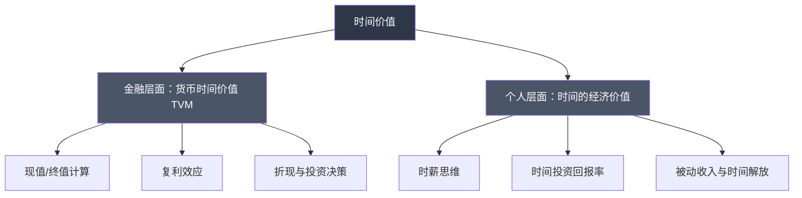
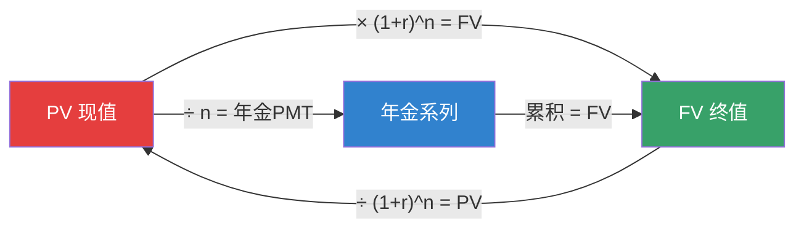
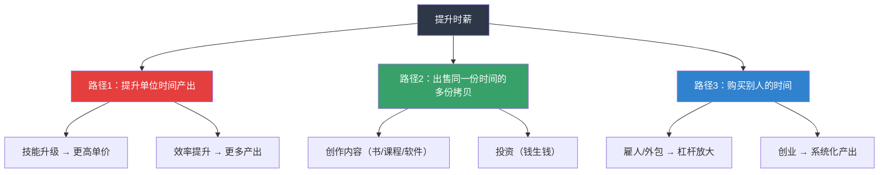
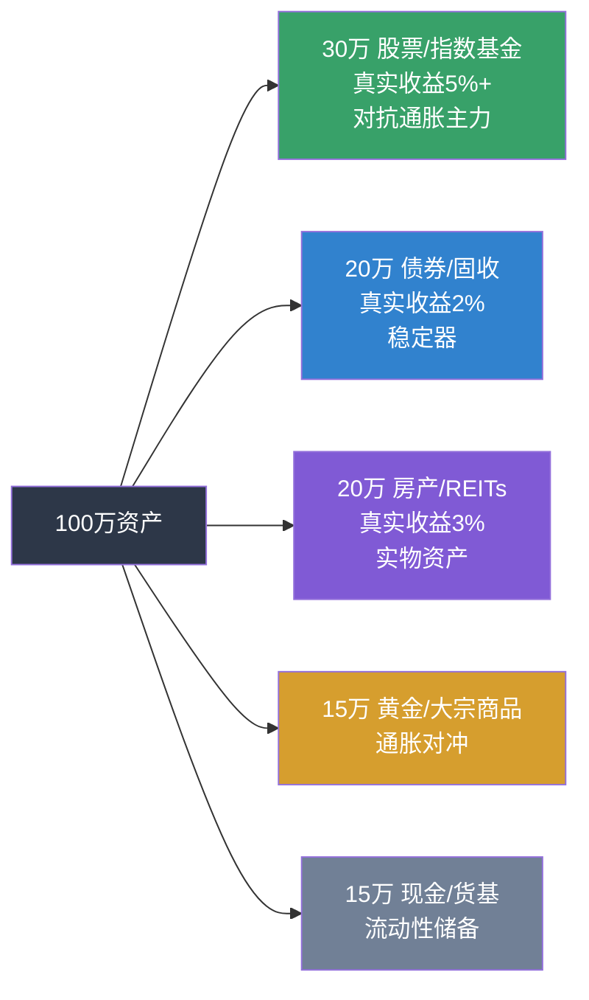
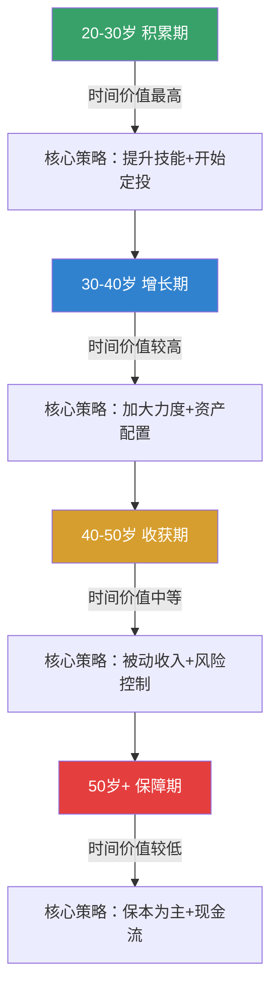

## 三、时间价值理论

> 今天的一块钱比明天的一块钱更值钱——这不是直觉，而是金融学最基础的公理。理解时间价值，是从"用时间换钱"跃迁到"用钱生钱"的认知分水岭。

### 1. 什么是时间价值

#### 1.1 核心定义

**货币的时间价值（Time Value of Money, TVM）** 是指：同一笔资金，在不同时间点上具有不同的经济价值。今天收到的100元，严格大于一年后收到的100元，原因有三：

| 维度 | 解释 |
|------|------|
| **机会成本** | 今天的100元可以立即投资产生收益，而一年后的100元丧失了这段时间的投资机会 |
| **购买力侵蚀** | 通货膨胀使得货币的实际购买力随时间下降，今天的100元能买到的东西比一年后更多 |
| **不确定性** | 未来的现金流存在违约、政策变化等风险，确定到手的钱比不确定的钱更有价值 |

这个原理是几乎所有金融决策的底层逻辑：存贷款利率、债券定价、股票估值、养老金规划、房贷选择——全部建立在TVM之上。

#### 1.2 直觉理解

假设你有两个选择：

- **A**：现在立刻拿到10,000元
- **B**：一年后拿到10,000元

理性人必然选择A。因为你可以把A的10,000元存入银行，假设年利率3%，一年后变成10,300元——比B多出300元。

反过来问：一年后的10,000元，在今天值多少钱？

$$PV = \frac{FV}{(1+r)^n} = \frac{10{,}000}{(1+0.03)^1} = 9{,}708.74 \text{ 元}$$

这9,708.74元就是10,000元的**现值（Present Value）**。折现率r就是你对"时间"的定价。

#### 1.3 "时间价值"的双重含义

在个人搞钱语境中，"时间价值"有两个层面：



本章两个层面都会深入讲解。前者是金融素养的基础，后者是个人财富策略的核心。

---

### 2. 复利：时间价值的引擎

#### 2.1 复利公式

复利是TVM最强大的实际应用。爱因斯坦（据传）称其为"世界第八大奇迹"。

$$FV = PV \times (1 + r)^n$$

其中：
- **FV**（Future Value）：终值，未来的金额
- **PV**（Present Value）：现值，当前的金额
- **r**（Rate）：每期利率（小数形式）
- **n**（Periods）：期数

#### 2.2 复利的指数增长本质

复利之所以强大，在于增长是**指数级**而非线性的。

| 年数 | 本金10万，年化8%（单利） | 本金10万，年化8%（复利） | 复利优势 |
|------|--------------------------|--------------------------|----------|
| 5年 | 140,000 | 146,933 | +6,933 |
| 10年 | 180,000 | 215,892 | +35,892 |
| 20年 | 260,000 | 466,096 | +206,096 |
| 30年 | 340,000 | 1,006,266 | +666,266 |
| 40年 | 420,000 | 2,172,452 | +1,752,452 |

关键观察：
- 第30年时，复利收益是单利的**3倍**
- 第40年时，复利收益是单利的**5倍**
- 本金10万，30年后变成100万——这不是神话，是数学

#### 2.3 72法则：快速估算翻倍时间

**72法则**：用72除以年化收益率，得到资金翻倍所需的大致年数。

| 年化收益率 | 翻倍所需年数（精确值） | 72法则估算 |
|------------|------------------------|------------|
| 3%（银行存款） | 23.4年 | 24年 |
| 6%（债券基金） | 11.9年 | 12年 |
| 8%（指数基金） | 9.0年 | 9年 |
| 12%（优质股票） | 6.1年 | 6年 |
| 24%（高风险投资） | 3.2年 | 3年 |

**实战意义**：如果你25岁开始投资10万元到年化8%的指数基金，不追加一分钱：
- 34岁时变成20万
- 43岁时变成40万
- 52岁时变成80万
- 61岁时变成160万

而如果35岁才开始，到61岁只有60万。**晚起步10年，最终少了100万**——这就是时间价值的残酷现实。

#### 2.4 定期定投的复利放大器

现实中大多数人不是一次性投入，而是每月定投。终值公式变为：

$$FV = PMT \times \frac{(1+r)^n - 1}{r}$$

**案例**：每月定投3,000元，年化8%，不同时间跨度的结果：

| 定投年限 | 总投入 | 终值 | 收益倍数 |
|----------|--------|------|----------|
| 10年 | 360,000 | 548,838 | 1.52x |
| 20年 | 720,000 | 1,764,951 | 2.45x |
| 30年 | 1,080,000 | 4,487,564 | 4.15x |
| 35年 | 1,260,000 | 6,815,376 | 5.41x |

30年定投，投入108万，最终变成449万。其中341万是"时间"送给你的礼物。

---

### 3. 现值与终值的实战计算

#### 3.1 基本计算框架



#### 3.2 终值计算（Future Value）

**问题**：现在有50万元，年化收益率7%，20年后值多少？

$$FV = 500{,}000 \times (1+0.07)^{20} = 500{,}000 \times 3.8697 = 1{,}934{,}842 \text{ 元}$$

Python实现：

```python
def future_value(pv, rate, years):
    """计算复利终值"""
    return pv * (1 + rate) ** years

# 50万，7%，20年
fv = future_value(500000, 0.07, 20)
print(f"终值：{fv:,.2f} 元")  # 终值：1,934,842.23 元
```

#### 3.3 现值计算（Present Value）

**问题**：10年后需要200万买房，假设年化收益率6%，现在需要准备多少钱？

$$PV = \frac{2{,}000{,}000}{(1+0.06)^{10}} = \frac{2{,}000{,}000}{1.7908} = 1{,}116{,}790 \text{ 元}$$

```python
def present_value(fv, rate, years):
    """计算现值"""
    return fv / (1 + rate) ** years

# 200万目标，6%，10年
pv = present_value(2000000, 0.06, 10)
print(f"现在需要：{pv:,.2f} 元")  # 现在需要：1,116,789.58 元
```

**这意味着**：如果你今天有112万并以6%年化增长，10年后自然达到200万目标。现值计算帮你把未来目标"折算"成今天的行动基准。

#### 3.4 年金计算（Annuity）

**问题**：每月定投多少，才能在20年后攒够300万？（年化8%，月复利）

月利率 = 8% / 12 = 0.667%

$$PMT = FV \times \frac{r}{(1+r)^n - 1} = 3{,}000{,}000 \times \frac{0.00667}{(1.00667)^{240} - 1}$$

$$PMT = 3{,}000{,}000 \times \frac{0.00667}{3.9216} = 5{,}103 \text{ 元/月}$$

```python
import math

def monthly_investment(fv_target, annual_rate, years):
    """计算达到目标所需的月投资额"""
    monthly_rate = annual_rate / 12
    months = years * 12
    pmt = fv_target * monthly_rate / ((1 + monthly_rate) ** months - 1)
    return pmt

pmt = monthly_investment(3000000, 0.08, 20)
print(f"每月需投入：{pmt:,.2f} 元")  # 每月需投入：5,103.23 元
```

---

### 4. 折现率：你对时间的定价

#### 4.1 什么是折现率

折现率（Discount Rate）是将未来现金流"折算"回现值的利率。它反映了三个因素的叠加：

$$\text{折现率} = \text{无风险利率} + \text{风险溢价} + \text{通胀补偿}$$

| 组成部分 | 含义 | 当前中国市场参考值 |
|----------|------|---------------------|
| 无风险利率 | 国债收益率，代表纯时间价值 | 2.0%-2.5% |
| 风险溢价 | 承担额外风险要求的补偿 | 3%-8%（视资产类别） |
| 通胀补偿 | 货币购买力下降的补偿 | 2%-3% |

#### 4.2 折现率的实战应用

不同场景使用不同的折现率：

| 决策场景 | 建议折现率 | 理由 |
|----------|------------|------|
| 房贷vs全款决策 | 房贷利率（3.5%-4.5%） | 这是你的实际资金成本 |
| 养老金规划 | 5%-6% | 长期稳健投资的合理预期 |
| 创业投资评估 | 15%-25% | 高风险需要高补偿 |
| 保险产品评估 | 3%-4% | 保险公司实际投资收益 |
| P2P/高收益理财 | 30%+ | 本金损失概率极高 |

**决策案例**：有人承诺5年后给你15万元，你现在最多愿意为此付多少钱？

- 如果你要求6%的回报率：$PV = 150{,}000 / (1.06)^5 = 112{,}089$ 元
- 如果你要求15%的回报率：$PV = 150{,}000 / (1.15)^5 = 74{,}577$ 元

折现率越高，未来钱的现值越低——这解释了为什么高风险投资的估值总是被压得很低。

---

### 5. 时间价值的个人维度：你的时间值多少钱

#### 5.1 计算你的时薪

大多数人不知道自己的真实时薪。计算方法：

$$\text{真实时薪} = \frac{\text{年税后收入}}{\text{年总工作时间（含通勤、加班、焦虑）}}$$

**案例**：月薪15,000元的白领

| 项目 | 时间 |
|------|------|
| 日工作时间 | 9小时（含午休1小时） |
| 加班时间 | 日均2小时 |
| 通勤时间 | 日均2小时 |
| 周末偶尔加班 | 月均4小时 |
| 月总时间 | (9+2+2) × 22 + 4 = 290小时 |
| 年总时间 | 290 × 12 = 3,480小时 |
| 年税后收入 | 15,000 × 12 × 0.85 = 153,000元 |
| **真实时薪** | **44元/小时** |

很多人以为自己时薪85元（15,000÷22÷8），实际只有44元——**几乎腰斩**。

#### 5.2 时薪思维的决策应用

一旦你有了真实的时薪数字，很多决策变得简单：

**场景1：是否购买某项服务**
- 请保洁阿姨打扫2小时，费用120元
- 你的时薪44元，自己打扫的机会成本 = 88元
- 但打扫还需要体力和情绪成本
- **结论**：如果120元 < 你的时薪 × 时间 + 情绪成本，就值得外包

**场景2：是否接受某份兼职**
- 兼职时薪30元，你的本职时薪44元
- **结论**：除非兼职有学习价值或人脉价值，否则亏本

**场景3：是否花3小时比价省50元**
- 3小时的机会成本 = 132元
- 只省了50元
- **结论**：直接买，把时间用在更有价值的事情上

#### 5.3 提升时薪的三条路径



路径1是线性增长（打工逻辑），路径2和3是指数增长（财富自由逻辑）。时间价值理论的终极启示是：**不要用时间换钱，要用时间建立能持续产生现金流的系统**。

---

### 6. 时间价值在投资决策中的应用

#### 6.1 净现值法（NPV）

**净现值（Net Present Value）** 是评估投资项目最科学的方法：

$$NPV = \sum_{t=0}^{n} \frac{CF_t}{(1+r)^t}$$

- NPV > 0：项目值得投资
- NPV < 0：项目不值得投资
- NPV = 0：刚好达到你的预期回报率

**案例**：投资一套小公寓

| 年份 | 现金流 | 说明 |
|------|--------|------|
| 第0年 | -800,000 | 购房首付+税费 |
| 第1-10年 | +60,000/年 | 租金收入（扣除维护后） |
| 第10年 | +1,000,000 | 卖房收入 |

折现率8%：

$$NPV = -800{,}000 + \sum_{t=1}^{10} \frac{60{,}000}{(1.08)^t} + \frac{1{,}000{,}000}{(1.08)^{10}}$$

$$NPV = -800{,}000 + 402{,}605 + 463{,}193 = 65{,}798 \text{ 元}$$

NPV为正，说明这笔投资的回报率超过了8%，值得考虑。

```python
def npv(rate, cashflows):
    """计算净现值
    cashflows: 第0期为负（投入），后续为正（回报）
    """
    return sum(cf / (1 + rate) ** t for t, cf in enumerate(cashflows))

cashflows = [-800000] + [60000] * 10 + [1000000]
# 最后一年既收租金又卖房，修正：
cashflows = [-800000] + [60000] * 9 + [60000 + 1000000]
result = npv(0.08, cashflows)
print(f"NPV = {result:,.2f} 元")  # NPV = 65,798.13 元
```

#### 6.2 内部收益率法（IRR）

**内部收益率（IRR）** 是使NPV等于零的折现率：

$$0 = \sum_{t=0}^{n} \frac{CF_t}{(1+IRR)^t}$$

IRR告诉你：这笔投资的实际年化回报率是多少。

```python
from scipy.optimize import brentq

def irr(cashflows):
    """计算内部收益率"""
    def npv_func(rate):
        return sum(cf / (1 + rate) ** t for t, cf in enumerate(cashflows))
    return brentq(npv_func, -0.5, 10.0)

cashflows = [-800000] + [60000] * 9 + [1060000]
rate = irr(cashflows)
print(f"IRR = {rate:.2%}")  # IRR ≈ 8.92%
```

如果IRR > 你的折现率要求，项目值得投资。

#### 6.3 不同持有期的对比决策

**问题**：你有30万，有两个投资选择，选哪个？

| 选项 | 投入 | 持有期 | 预期回报 | 年化收益率 |
|------|------|--------|----------|------------|
| A：银行理财 | 300,000 | 3年 | 392,432 | 9.39% |
| B：指数基金 | 300,000 | 10年 | 640,000 | 7.93% |

表面上A的年化更高。但需要考虑再投资风险：3年后A到期，你还能找到9.39%的产品吗？

用TVM思维分析：
- 如果A到期后剩余7年只能找到4%的产品：$392{,}432 \times (1.04)^7 = 516{,}070$
- B全程7.93%：$640{,}000$
- **结论**：B虽然年化低，但长期锁定收益，最终回报更高

---

### 7. 通胀：时间价值的隐形杀手

#### 7.1 通胀的复利侵蚀

通胀率2.5%听起来温和，但复利效应同样惊人：

| 年数 | 100万的实际购买力 | 损失比例 |
|------|-------------------|----------|
| 10年 | 781,205 | -21.9% |
| 20年 | 610,271 | -38.9% |
| 30年 | 476,743 | -52.3% |
| 40年 | 372,431 | -62.8% |

30年后，100万只能买到今天47万的东西。**如果你的投资收益率跑不赢通胀，你其实是在变穷**。

#### 7.2 真实收益率

$$\text{真实收益率} \approx \text{名义收益率} - \text{通胀率}$$

更精确的费雪方程：

$$1 + r_{real} = \frac{1 + r_{nominal}}{1 + r_{inflation}}$$

| 投资方式 | 名义收益率 | 通胀率 | 真实收益率 |
|----------|------------|--------|------------|
| 银行活期 | 0.20% | 2.5% | -2.27% |
| 银行定期（3年） | 2.35% | 2.5% | -0.15% |
| 货币基金 | 1.80% | 2.5% | -0.69% |
| 债券基金 | 4.50% | 2.5% | 1.95% |
| 指数基金（长期） | 8.00% | 2.5% | 5.37% |
| 优质房产（含租金） | 6.00% | 2.5% | 3.41% |

银行定期的真实收益率接近零甚至为负——钱存在银行并没有"保值"，只是在缓慢贬值。

#### 7.3 对抗通胀的资产配置



---

### 8. 常见误区与纠正

#### 误区1：只存钱不投资

**错误表现**：把所有钱放在银行活期/定期，认为"至少不会亏"。

**为什么错**：
- 银行活期利率0.2%，通胀2.5%，真实收益率-2.3%
- 100万存银行30年，名义上变成106万，实际购买力只值48万
- 你以为在存钱，实际在亏钱

**纠正方法**：至少将长期不用的资金配置到债券基金或指数基金，目标真实收益率 > 2%。

#### 误区2：忽视时间起点的差异

**错误表现**：认为"等收入高了再开始投资"。

**为什么错**：
- 假设年化8%，每月投3,000元
- 25岁开始，到60岁：总投入126万，终值682万
- 35岁开始，到60岁：总投入90万，终值227万
- 晚10年起步，少赚455万——**36万的投入差距，造成455万的结果差距**

**纠正方法**：金额不重要，习惯最重要。哪怕每月只投500元，也要立刻开始。

#### 误区3：用名义收益率做决策

**错误表现**：看到理财产品收益4%就觉得"跑赢了2.5%的通胀"。

**为什么错**：
- 理财产品收益是名义收益，还需扣除管理费、托管费、申赎费
- 实际到手可能只有3.2%
- 再扣除2.5%通胀，真实收益只有0.7%

**纠正方法**：永远用真实收益率（名义收益 - 通胀 - 费用）做决策。

#### 误区4：忽视隐性时间成本

**错误表现**：计算投资回报时只看资金投入，不计时间投入。

**为什么错**：
- 花20小时研究一只股票，投入10万，赚了8,000元
- 资金收益率8%，但如果加上20小时的时间成本（时薪44元 = 880元），实际收益7,120元
- 如果这20小时用于提升技能，未来时薪提升5元，每年多赚12,000元

**纠正方法**：投资回报必须扣除时间成本。对于小额资金，定投指数基金比自己选股更"划算"。

#### 误区5：过度折现未来

**错误表现**：认为"未来太远了，不如现在享受"，过度消费。

**为什么错**：
- 30岁每月多花2,000元（年化8%），到60岁少积累296万
- 适度享受没问题，但要把"享受"也当作投资来评估回报率

**纠正方法**：建立"时间价值意识"——每一笔非必要支出，都问自己："这笔钱如果投资30年，值多少？"

---

### 9. 进阶概念

#### 9.1 永续年金（Perpetuity）

永续年金是无限期支付的现金流，常见于优先股、永久债券、出租房产：

$$PV = \frac{C}{r}$$

**应用**：你希望每年有12万元被动收入（月均1万），投资回报率6%：

$$PV = \frac{120{,}000}{0.06} = 2{,}000{,}000 \text{ 元}$$

这意味着：如果你有200万以6%年化投资，每年可以稳定取出12万而不减少本金。这就是"财务自由"的数学定义。

#### 9.2 增长型永续年金

如果现金流每年以g的速度增长：

$$PV = \frac{C}{r - g} \quad (r > g)$$

**应用**：某分红股今年每股分红2元，预计股息每年增长3%，你要求10%的回报率：

$$PV = \frac{2}{0.10 - 0.03} = 28.57 \text{ 元}$$

如果股价低于28.57元，说明被低估了。

#### 9.3 连续复利

当复利频率趋向无穷时：

$$FV = PV \times e^{rt}$$

虽然实际投资很少用连续复利，但这个公式在期权定价（Black-Scholes模型）等高级金融中有核心应用。

#### 9.4 时间价值与人生阶段



越早开始，时间价值越大。20岁投入的1万元，以8%年化计算，到60岁值21.7万——**22倍**。40岁投入的1万元，到60岁只有4.7倍。时间是年轻人最大的资本。

---

### 10. 实操清单

#### 10.1 立即行动项

| 优先级 | 行动 | 预计耗时 | 预期效果 |
|--------|------|----------|----------|
| P0 | 计算你的真实时薪 | 30分钟 | 建立时间价值意识 |
| P0 | 开设基金定投账户 | 1小时 | 启动复利引擎 |
| P1 | 建立应急资金（3-6个月支出） | 持续3-6个月 | 消除被迫卖出的风险 |
| P1 | 学习使用NPV/IRR评估投资 | 2小时 | 提升投资决策质量 |
| P2 | 审视所有支出的真实时间成本 | 1小时 | 砍掉低效消费 |
| P2 | 制定10年/20年/30年财务目标 | 2小时 | 用现值法拆解目标 |

#### 10.2 TVM决策检查清单

每次做重大财务决策时，用这个清单：

1. **这笔钱的机会成本是多少？** → 如果不花/不投，能产生多少收益？
2. **真实的收益率是多少？** → 扣除通胀、税费、费用后
3. **时间跨度多长？** → 复利在长期才有威力
4. **风险如何定价？** → 用合理的折现率
5. **有没有隐性时间成本？** → 管理时间、学习时间、焦虑成本

---

### 11. 总结

时间价值理论的核心信息可以用三句话概括：

1. **钱有时间价格**：今天的钱比明天的值钱，因为可以投资、可以消费、确定性更高
2. **复利是最强武器**：时间越长，复利越猛。起步越早，回报越大
3. **你的时间有价**：计算真实时薪，用时薪思维做决策，把时间投资在回报最高的地方

掌握时间价值理论后，你会发现：**财富不是挣出来的，是时间×系统×耐心堆出来的**。建立正确的投资系统，然后让时间为你工作——这是每一个普通人都能做到的搞钱之道。
