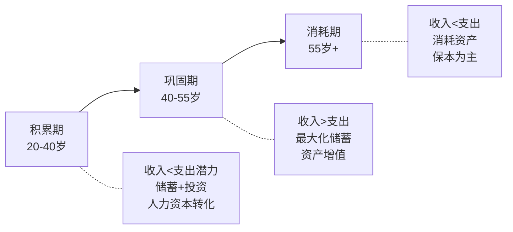
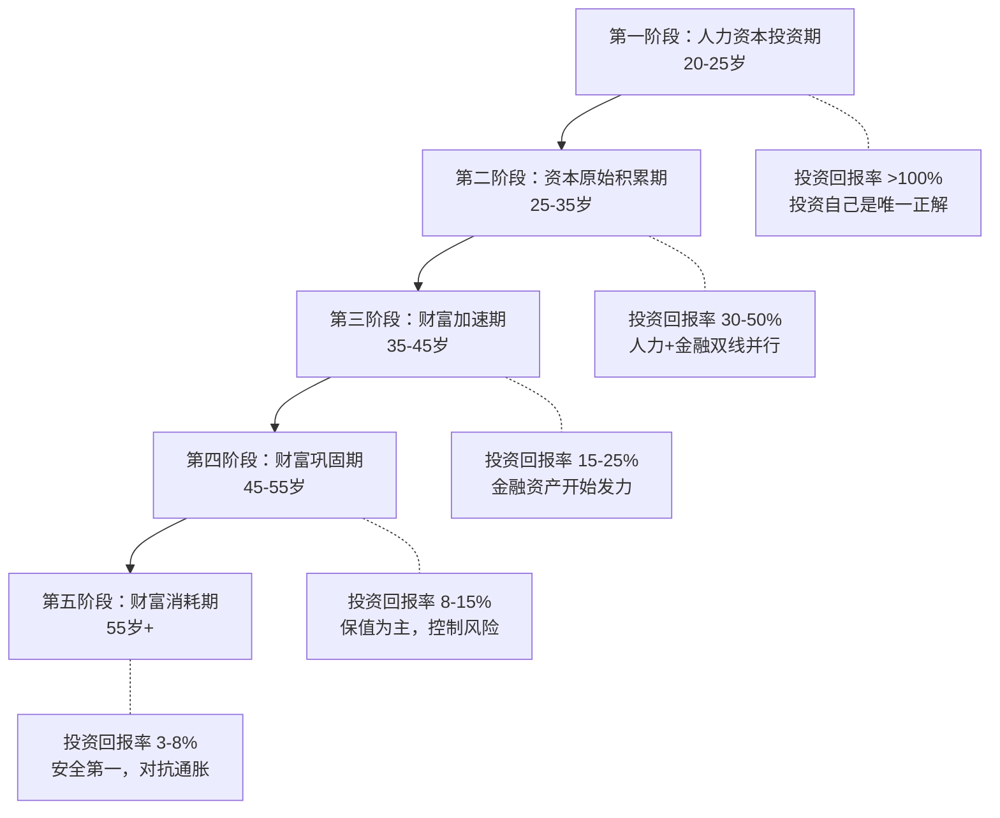

## 四、人生不同阶段的搞钱理论框架

为什么20多岁的人和50多岁的人不能用同一套搞钱策略？这不只是经验差异，背后有严谨的经济学理论支撑。本节从生命周期假说、人力资本理论、生命周期投资理论三大基石出发，构建一个完整的理论框架，帮助你理解"什么年龄该做什么"的底层逻辑。

### 4.1 为什么需要分阶段的搞钱框架？

很多人的搞钱策略是一成不变的——从毕业到退休，永远是"努力工作、存钱、买理财"。这种策略忽略了一个关键事实：**人生不同阶段的资源禀赋、风险承受能力和财务目标截然不同**。

**人生财务的三要素变化**：

| 要素 | 20-30岁 | 30-40岁 | 40-50岁 | 50-60岁 |
|------|---------|---------|---------|---------|
| 人力资本 | 高（未来收入潜力大） | 中高（收入上升期） | 中（收入接近峰值） | 低（退休临近） |
| 金融资本 | 低（刚起步） | 中（开始积累） | 高（财富积累期） | 最高（需要保值） |
| 风险承受力 | 强（时间换空间） | 较强（收入稳定） | 中等（家庭责任重） | 弱（不能承受大亏损） |
| 时间 horizon | 30-40年 | 20-30年 | 10-20年 | 5-15年 |

这四列数据的对比揭示了一个核心规律：**年轻时你最大的资产是时间（人力资本），年老时你最大的资产是积累的财富（金融资本）**。搞钱策略必须随着这两种资本的此消彼长而动态调整。

### 4.2 理论基石一：生命周期假说（Life-Cycle Hypothesis）

#### 4.2.1 理论来源与核心思想

生命周期假说由经济学家弗兰科·莫迪利安尼（Franco Modigliani）和理查德·布伦伯格（Richard Brumberg）于1954年提出，莫迪利安尼因此获得1985年诺贝尔经济学奖。

核心思想：**理性人会在一生中平滑消费，而不是让消费随收入剧烈波动**。人们在收入低时借钱（或少存钱），在收入高时储蓄，目标是维持一生相对稳定的生活水平。

用公式表达：

```text
一生总消费 = 一生总收入
C₁ + C₂ + ... + Cₙ = Y₁ + Y₂ + ... + Yₙ
```

其中 C 是每年消费，Y 是每年收入。关键在于，各年的消费不必等于当年收入，而是通过借贷和储蓄来跨期平滑。

#### 4.2.2 生命周期的财务曲线

生命周期假说将人生分为三个财务阶段：



**积累期（20-40岁）**：

收入快速上升但基数不高，消费欲望强（结婚、买房、育儿），净储蓄率较低甚至为负。这个阶段的核心任务是**将人力资本转化为金融资本**——通过提升技能增加收入，然后把多余收入投入能产生复利的资产。

**巩固期（40-55岁）**：

收入达到职业生涯峰值，房贷等大额支出逐步减少，子女开始独立。这是**储蓄率最高的阶段**，应该最大化投资和储蓄，为退休做准备。

**消耗期（55岁+）**：

收入下降或停止（退休），开始消耗积累的金融资本。核心任务是**确保资产不被过早消耗殆尽**，需要保守的投资策略和合理的提取计划。

#### 4.2.3 理论的实际应用

生命周期假说的实践意义在于：**不要被短期收入波动绑架决策**。

具体应用：

- **年轻时不要过度储蓄**：25岁月薪8000元，存3000元已经很好，不必省吃俭用存5000元。这个阶段投资自己（学习、社交、试错）的回报率远高于投资股票。
- **中年时不要过度消费**：45岁月薪5万，不要觉得"收入高了可以犒劳自己"而把消费比例也拉高。这正是应该最大化储蓄的窗口期。
- **退休前要提前规划**：不要等到55岁才开始想退休的事。根据生命周期假说，退休后的消费需要退休前20-30年的储蓄来支撑。

**案例：两种消费模式的对比**

张三和李四，同样月薪1万起步，工作35年，总收入增长路径相同（年均增长8%）。

| 模式 | 前10年储蓄率 | 中间15年储蓄率 | 后10年储蓄率 | 退休时资产 |
|------|-------------|---------------|-------------|-----------|
| 张三（月光→觉醒→冲刺） | 0% | 20% | 40% | 约280万 |
| 李四（持续平滑） | 20% | 30% | 30% | 约420万 |

李四的最终资产比张三多了50%，不是因为收入更高，而是因为**更早开始复利**。这就是生命周期假说的核心启示：尽早开始，持续积累，不要等"有钱了再说"。

### 4.3 理论基石二：人力资本与金融资本的转化理论

#### 4.3.1 什么是人力资本？

人力资本是你未来所有劳动收入的现值。一个25岁月薪1万、预期年均增长6%、工作35年的人，其人力资本约为：

```text
人力资本 = Σ(年收入 / (1+r)^t)，t从1到35
假设折现率r=5%：
人力资本 ≈ 1万×12 × Σ(1.06/1.05)^t / 1.05^t
≈ 12万 × 27.5 ≈ 330万元
```

也就是说，一个25岁的年轻人，虽然银行卡里可能只有2万块，但他真正的"身价"是330万——只是以未来劳动收入的形式存在。

#### 4.3.2 人力资本 vs 金融资本的转换

**核心观点：年轻时你的主要资产是人力资本（会干活），年老时你的主要资产是金融资本（有钱）。搞钱的本质就是把人力资本逐步转化为金融资本。**

这个转化过程可以通过一个"资产组合"视角来理解：

| 年龄 | 人力资本占比 | 金融资本占比 | 隐含投资含义 |
|------|-------------|-------------|-------------|
| 25岁 | 95% | 5% | 你的"投资组合"已经95%押注在"自己"身上 |
| 35岁 | 75% | 25% | 开始分散，但仍以人力资本为主 |
| 45岁 | 50% | 50% | 转折点，金融资本开始超过人力资本 |
| 55岁 | 25% | 75% | 金融资本为主，应更保守 |
| 65岁（退休） | 0% | 100% | 全部依靠金融资本 |

这个视角有三个重要推论：

**推论一：年轻人应该投资自己而非股市**

25岁的人95%的资产已经是"人力资本"（一种高波动、高回报的资产），再把仅有的5%金融资本也投到高风险股票上，等于100%押注高波动资产。更明智的做法是：把有限的资金用于提升人力资本（学技能、考证、跳槽），因为人力资本每提升1%，相当于金融资产收益33万×1%=3300元/年。

**推论二：中年人需要逐步降低投资风险**

45岁以后，人力资本占比下降，如果金融资本也全部配置在高风险资产上，一旦遭遇大幅亏损，没有足够的时间和人力资本来弥补。这就是为什么年龄越大，投资组合中债券和固收类资产的比例应该越高。

**推论三：行业选择影响人力资本的"风险属性"**

不同行业的人力资本波动性差异巨大：

| 行业类型 | 人力资本波动性 | 典型代表 | 金融资产配置建议 |
|---------|-------------|---------|----------------|
| 高波动行业 | 高（收入大起大落） | 创业者、销售、自媒体 | 偏保守，多配固收 |
| 稳定行业 | 低（收入稳定增长） | 公务员、医生、教师 | 可适当偏进取 |
| 周期行业 | 随经济周期波动 | 房地产、金融、外贸 | 加强应急储备 |

#### 4.3.3 人力资本的投资回报率

投资自己的回报率通常远高于金融市场。具体来看：

**学历提升的回报率**：

- 本科 vs 高中：终身收入差距约200-400万元，假设读研成本30万（含机会成本），回报率约15-25%
- 硕士 vs 本科：终身收入差距约100-200万元，成本20-30万，回报率约10-18%

**技能投资的回报率**：

- 学一门编程语言（Python）：投入时间约200小时，可能带来月薪增加2000-5000元，年化回报率极高
- 考取行业证书（CPA、CFA等）：投入1-2年业余时间，可能带来年薪增加5-20万
- 学英语（达到流利水平）：投入1000+小时，打开外企、远程工作等机会，回报难以量化但巨大

**社交投资的回报率**：

- 参加行业会议：每次投入500-2000元+时间，潜在回报是认识行业人脉、获取信息差
- 维护高质量社交圈：时间投入为主，回报是机会信息、合作伙伴、精神支持

关键原则：**在人力资本回报率远高于金融资本回报率的阶段，优先投资自己**。通常这个阶段是20-35岁。35岁以后，人力资本的边际回报递减（学习能力下降、职业天花板显现），此时应逐步增加金融资本的投资比重。

### 4.4 理论基石三：生命周期投资理论（Life-Cycle Investing）

#### 4.4.1 传统方法：100法则与目标日期基金

最广为人知的生命周期投资法则是"100法则"：

```text
股票配置比例 = 100 - 年龄
```

- 25岁：75%股票 + 25%债券
- 40岁：60%股票 + 40%债券
- 60岁：40%股票 + 60%债券

这个法则简单易记，但过于粗糙。它的改进版本是"110法则"或"120法则"（因为现代人寿命更长，可以承受更高比例的股票配置）。

**目标日期基金（Target Date Fund）** 是这个理论的产品化形态。投资者选择一个目标退休年份（如"2050退休"），基金会自动随时间推移调整股债比例——早期偏股票，后期偏债券。国内的养老目标基金就是这个逻辑。

#### 4.4.2 进阶理论：Ayres & Nalebuff 的生命周期投资

耶鲁大学教授伊恩·艾尔斯（Ian Ayres）和巴里·纳莱巴夫（Barry Nalebuff）在2010年的著作《Lifecycle Investing》中提出了一个更激进的理论：

**核心观点：年轻人应该用杠杆把投资总额拉平到一生的平均水平，而不是在年轻时只用少量资金投资。**

他们的逻辑是这样的：

假设你一生计划总共投资300万到股市中。传统做法是：25岁有5万就投5万，45岁有100万就投100万。问题是，你在25岁时实际承受的风险敞口只有5万，远低于一生平均水平（300万/35年≈8.6万），导致年轻时"浪费"了时间优势。

Ayres的建议是：25岁时用2倍杠杆，把5万变成10万的风险敞口，使你在整个生命周期中对股市的暴露更加均匀。这样做的好处是**降低了终身投资的波动性**，因为你避免了在市场高点（通常是你资金最多的时候）集中投入的风险。

**这个理论的适用条件**：

| 条件 | 要求 |
|------|------|
| 年龄 | 25-40岁（有足够时间等待杠杆回撤） |
| 收入稳定性 | 稳定的工资收入（非自由职业/创业者） |
| 心理承受力 | 能接受账户短期亏损50%+而不恐慌卖出 |
| 杠杆成本 | 借贷利率低于预期股市回报率 |
| 知识水平 | 理解杠杆机制和风险管理 |

**重要警告**：杠杆投资是一把双刃剑。如果你在2008年金融危机时2倍杠杆+恐慌卖出，可能损失惨重。这个理论的前提是**你能在整个周期内坚持持有**，这对绝大多数普通投资者来说是不现实的。因此，对大多数人而言，传统的"年龄决定股债比"方法更加稳妥。

#### 4.4.3 序列风险：退休前后的最大威胁

序列风险（Sequence of Returns Risk）是生命周期投资中一个被严重低估的概念。

**什么是序列风险？**

同样一组年化收益率，如果出现的顺序不同，最终结果可能天差地别。

**案例**：A和B各有100万，都经历10年投资，年收益率都是：+30%、+30%、+30%、-20%、-20%、-20%、+10%、+10%、+10%、+5%。唯一区别是出现顺序不同。

- A的顺序：先涨后跌（+30%, +30%, +30%, -20%, -20%, -20%, +10%, +10%, +10%, +5%）
- B的顺序：先跌后涨（-20%, -20%, -20%, +30%, +30%, +30%, +10%, +10%, +10%, +5%）

如果只是持有不取钱，A和B的最终金额相同（因为年化收益率相同）。但如果每年取10万生活费：

- A（先涨后跌）：最终约剩95万
- B（先跌后涨）：最终约剩130万

同样的收益率，同样的取款计划，最终差距35万——这就是序列风险的威力。

**序列风险对不同人生阶段的影响**：

| 阶段 | 序列风险影响 | 原因 |
|------|-------------|------|
| 积累期（20-40岁） | 极低 | 只存不取，下跌反而是低价买入机会 |
| 巩固期（40-55岁） | 中等 | 可能有大额支出（子女教育、父母医疗） |
| 消耗期（55岁+） | 极高 | 持续取款+早期亏损=加速消耗本金 |

**应对序列风险的策略**：

1. **现金缓冲策略**：退休时预留2-3年生活费在现金或短期理财中，避免在市场低点被迫卖出
2. **动态提取策略**：市场好的年份多取一点，市场差的年份少取一点
3. **逐步降低风险**：退休前5-10年开始逐步降低股票比例，而不是退休那天突然调整
4. **年金化策略**：将一部分资产购买年金险，用确定性收入覆盖基本生活开支

### 4.5 综合框架：五阶段搞钱模型

将上述三大理论整合，构建一个可操作的五阶段框架：



#### 第一阶段：人力资本投资期（20-25岁）

**核心理论依据**：人力资本占比95%，投资自己的边际回报最高。

**搞钱策略**：

- 收入分配：50%生活、30%学习投资、20%储蓄
- 投资重点：100%人力资本（技能、学历、人脉、视野）
- 金融投资：仅限建立习惯（月定投500-1000元指数基金）
- 负债策略：合理负债（助学贷款、技能贷款），避免消费贷

**关键决策点**：

- 要不要考研/出国？——计算人力资本增量是否大于成本
- 要不要去大城市？——大城市人力资本增速通常更快
- 第一份工作选什么？——选学习曲线最陡峭的，而非起薪最高的

#### 第二阶段：资本原始积累期（25-35岁）

**核心理论依据**：人力资本开始向金融资本转化，复利效应启动。

**搞钱策略**：

- 收入分配：40%生活、10%继续投资自己、30%投资、10%保险、10%弹性
- 投资重点：建立投资体系，开始定投，储蓄率目标30%+
- 副业探索：将专业技能变现，建立第二收入来源
- 风险管理：配置基础保险（重疾+医疗+意外+定寿）

**关键指标**：

- 净资产由负转正（还清负债，开始积累）
- 投资账户开始产生可观收益
- 副业收入达到主业的10-20%

#### 第三阶段：财富加速期（35-45岁）

**核心理论依据**：收入峰值期，人力资本回报递减，金融资本应加速增长。

**搞钱策略**：

- 收入分配：35%生活、40%投资、10%保险、10%家庭、5%弹性
- 投资重点：多元化配置，增加被动收入来源
- 事业选择：成为行业专家/管理者，或创业
- 被动收入目标：覆盖基本开支的20-30%

**关键转折**：

- 投资收益开始"可见"——每年投资收益超过年度储蓄额的某个比例
- 被动收入从0开始增长
- 需要为子女教育和父母养老开始专项规划

#### 第四阶段：财富巩固期（45-55岁）

**核心理论依据**：生命周期假说的"最大化储蓄"窗口，序列风险意识需要提升。

**搞钱策略**：

- 收入分配：30%生活、45%投资、10%家庭保障、10%保险、5%弹性
- 投资重点：逐步降低风险，增加固收类比例
- 被动收入目标：覆盖基本开支的50%+
- 开始制定退休计划，测算退休金缺口

**风险控制**：

- 投资组合中股票比例逐步降至50%以下
- 预留3-5年生活费的现金缓冲
- 确保保险保障充足（尤其是医疗险）

#### 第五阶段：财富消耗期（55岁+）

**核心理论依据**：序列风险管理，动态提取策略。

**搞钱策略**：

- 投资重点：保本为主，抗通胀为辅
- 股票比例：不超过30-40%
- 提取策略：4%法则为基准，动态调整
- 医疗准备：确保充足的医疗和护理保障

**4%法则说明**：

退休第一年提取总资产的4%，之后每年按通胀率调整提取金额。例如：退休时总资产300万，第一年提取12万，假设通胀3%，第二年提取12.36万。根据历史数据，这个策略在大多数30年退休期内不会耗尽资产。

### 4.6 理论框架的常见误读与纠偏

#### 误读一："年轻时可以不存钱"

**错误逻辑**：既然年轻时人力资本价值最高，那就把钱全花在自己身上。

**纠偏**：投资自己≠消费。花钱学Python是投资自己，花钱买最新款手机是消费。而且，年轻时养成储蓄习惯本身就是人力资本的一部分——自律能力是一种可迁移的元技能。

**正确做法**：20-25岁至少保持15-20%的储蓄率，同时把"学习预算"单独列出来，确保投资自己和建立财务纪律并行。

#### 误读二："年龄大了就应该全买债券"

**错误逻辑**：60岁的人风险承受力低，应该把所有钱放在银行定期和国债里。

**纠偏**：60岁的人预期寿命还有20-25年。如果全部配置在3-4%收益的固收产品上，长期来看跑不赢通胀，实际购买力在缩水。适当的股票配置（20-30%）是必要的。

**正确做法**：使用"120-年龄"法则作为起点，根据个人风险承受力微调。60岁可以配置30-40%的股票（以高股息蓝筹和宽基指数为主），其余配置债券和固收。

#### 误读三："理论模型可以直接套用"

**错误逻辑**：生命周期假说假设人是完全理性的，可以精确规划一生的消费和储蓄。

**纠偏**：现实中人有行为偏差（参见第五节行为经济学），收入不确定，家庭情况变化，政策环境变化。理论模型是思考框架，不是计算器。

**正确做法**：用理论模型指导大方向（什么时候该激进、什么时候该保守），但具体数字需要根据个人情况调整。每年至少做一次财务回顾和计划调整。

#### 误读四："FIRE只适合高收入人群"

**错误逻辑**：财务自由（FIRE）需要高储蓄率，只有高收入人群才能做到。

**纠偏**：FIRE的核心是"被动收入>生活支出"。这个等式有两个变量——降低支出和增加被动收入。月薪8000、月支出3000的人，比月薪3万、月支出2.8万的人离FIRE更近。

**正确做法**：先算清自己的"自由数字"（年支出×25），然后制定计划。收入不高时重点优化支出结构，收入增长后重点提升投资收益。

### 4.7 理论框架的动态调整机制

理论框架不是一成不变的。以下事件需要重新评估和调整搞钱策略：

| 触发事件 | 影响的理论维度 | 调整方向 |
|---------|-------------|---------|
| 收入大幅增长（>30%） | 人力资本重估 | 保持消费不变，增加投资比例 |
| 收入大幅下降（>30%） | 人力资本缩水 | 削减非必要支出，保护投资计划 |
| 结婚/生子 | 生命周期阶段变化 | 增加保险、教育金规划、提高应急储备 |
| 离婚 | 金融资本大幅变化 | 重新评估退休计划和资产配置 |
| 行业衰退 | 人力资本风险上升 | 增加金融资产配置保守度、发展副业 |
| 继承/大额收入 | 金融资本跳跃增长 | 重新评估资产配置、考虑税务优化 |
| 健康问题 | 人力资本和支出同时变化 | 增加医疗保障、调整退休时间线 |

**调整的频率建议**：

- 每年一次全面财务回顾（对照理论框架检查方向是否正确）
- 每次重大生活事件后立即调整
- 每5年做一次深度评估（人力资本重估、退休计划更新）

### 4.8 小结：理论如何指导实践

本节介绍的三大理论为你提供了理解"人生不同阶段搞钱"的底层逻辑：

1. **生命周期假说**告诉你：消费应该跨期平滑，年轻时不必过度储蓄但要开始，中年时要最大化储蓄，退休前要提前规划。
2. **人力资本理论**告诉你：年轻时最大的资产是自己，投资自己的回报率远超金融市场；随年龄增长要逐步将人力资本转化为金融资本。
3. **生命周期投资理论**告诉你：资产配置应该随年龄动态调整，注意序列风险，退休前后要特别谨慎。

这三者结合形成的五阶段模型（人力资本投资→原始积累→财富加速→财富巩固→财富消耗），就是你制定搞钱策略的理论地图。

理论是地图，不是目的地。下一节我们将探讨行为经济学如何影响你的搞钱决策——因为知道"应该怎么做"和"真正能做到"之间，隔着一道叫做"人性"的鸿沟。

***
