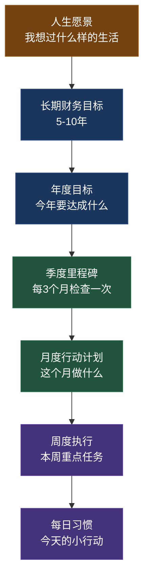

## 本节要点回顾

理论基础是搞钱与人生规划的"地基"——地基不牢，上层建筑（核心技巧、实战案例）再华丽也会坍塌。本节对理论基础板块的8个核心知识模块做系统性回顾，帮你建立一张**可检索、可调用**的知识索引图。

### 回顾导览图

---

### 一、人生阶段规划全景图——你的坐标在哪？

**核心观点**：搞钱不是一张白纸上画饼，而是基于你当前人生阶段的精确诊断后制定的行动方案。不同阶段有不同的收入结构、风险承受力和机会窗口，脱离阶段谈策略就是空谈。

**关键认知**：

| 人生阶段 | 年龄参考 | 核心任务 | 最大资本 |
|----------|---------|---------|---------|
| 职业起步期 | 22-25岁 | 投资自己，建立财务意识 | 时间 |
| 快速成长期 | 25-30岁 | 收入跃迁，开始系统投资 | 学习能力 |
| 黄金积累期 | 30-40岁 | 收入峰值，资产配置优化 | 人脉与经验 |
| 巩固转型期 | 40-50岁 | 被动收入放大，防范中年危机 | 资产存量 |
| 收获期 | 50岁+ | 财富传承，享受复利果实 | 财务自由度 |

**回顾要点**：不要跳阶段。22岁的人去研究信托和家族办公室是浪费时间；45岁的人还在打零工攒第一桶金则说明之前的规划出了大问题。先定位，再行动。

---

### 二、财务自由的定义——搞钱的终局思维

**核心公式**：

> **财务自由 = 被动收入 ≥ 生活支出**

**4%法则（William Bengen, 1994）**：如果每年从投资组合中提取不超过4%用于生活开支，资金大概率可以支撑30年以上甚至永续使用。

**实用计算表**：

| 年生活支出 | 财务自由门槛（÷4%） | 保守门槛（÷3.5%） |
|-----------|-------------------|-------------------|
| 10万 | 250万 | 286万 |
| 15万 | 375万 | 429万 |
| 20万 | 500万 | 571万 |
| 30万 | 750万 | 857万 |
| 50万 | 1250万 | 1429万 |

**回顾要点**：财务自由的门槛不是由收入决定的，而是由**支出**决定的。年支出从20万降到10万，门槛从571万降到286万——支出减半比收入翻倍更现实、更可控。这就是为什么"降低支出"和"增加收入"是等价的搞钱策略，但前者更可控、见效更快。

---

### 三、复利人生——超越投资的复利思维

**核心观点**：复利不只是投资收益率的概念，而是人生所有领域的底层增长机制。技能的复利、人脉的复利、知识的复利，往往比金钱的复利威力更大。

**复利在人生各领域的表现**：

| 领域 | 复利机制 | 案例 |
|------|---------|------|
| 技能 | 每年精进20%，5年后能力翻2.5倍 | 程序员持续学习新技术，5年后成为架构师 |
| 人脉 | 每认识1个人，潜在连接数指数增长 | 行业社群运营3年后成为信息枢纽 |
| 知识 | 跨领域知识产生"化学反应" | 懂编程+懂金融→量化交易专家 |
| 健康 | 每天运动30分钟，10年后体质差距巨大 | 40岁时精力比同龄人强一个量级 |
| 金钱 | 年化8%，30年本金翻10倍 | 每月定投3000元，30年后约370万 |

**复利的两个关键变量**：

1. **时间**：越早开始，复利效果越显著。25岁开始每月投3000元（年化8%），到55岁约370万；35岁才开始，同样条件到55岁只有约150万——晚10年，少赚220万。
2. **持续性**：复利最怕中断。连续投资20年中途取出一次再存回去，损失的不只是取出那段时间的收益，而是整个复利链条的断裂。

**回顾要点**：不要只盯着收益率。把"每天比昨天好一点"的复利思维应用到技能、健康、人脉上，10年后的回报远超任何投资标的。

---

### 四、时间价值理论——搞钱的隐形成本

**核心观点**：时间是最稀缺的资源，也是搞钱最容易忽视的成本。每一笔支出和收入，都应该换算成"时间成本"来衡量。

**真实时薪计算公式**：

> **真实时薪 = (年收入 - 工作相关支出) ÷ (工作时间 + 通勤时间 + 下班后恢复时间)**

**示例对比**：

| 项目 | 表面月薪1万 | 真实情况 |
|------|-----------|---------|
| 名义月薪 | 10,000元 | — |
| 扣除：通勤费 | -300元/月 | |
| 扣除：工作餐 | -600元/月 | |
| 扣除：职业装 | -200元/月 | |
| 扣除：应酬费 | -500元/月 | |
| 净收入 | 8,400元/月 | |
| 工作时间 | 8小时/天 | |
| 通勤时间 | 2小时/天 | |
| 恢复时间 | 1小时/天 | |
| 真实工作时间 | 11小时/天 | |
| **真实时薪** | | **8,400÷22÷11 ≈ 34.7元/小时** |

**时间价值的决策应用**：

- 你的真实时薪是35元/小时，花3小时找优惠券省20元 → 亏损85元时间价值 → 不如直接买
- 你的真实时薪是100元/小时，家务外包每小时50元 → 外包省下的时间用来搞钱或学习，净赚50元/小时
- 你的真实时薪是200元/小时，花2小时比较两款手机 → 亏损400元 → 随便选一个就行

**回顾要点**：所有低于你真实时薪的事情，都应该考虑外包或自动化。时薪思维不是让你变得功利，而是帮你把有限的时间花在回报率最高的事情上。

---

### 五、人生不同阶段的搞钱理论框架

**核心观点**：搞钱策略必须与人生阶段动态匹配，没有一套策略适合所有人所有阶段。

**各阶段搞钱策略对照**：

| 阶段 | 核心策略 | 投资重点 | 风险偏好 | 关键指标 |
|------|---------|---------|---------|---------|
| 起步期(22-25) | 投资自己，能力跃迁 | 学习/证书/人脉 | 可以激进 | 技能增长率 |
| 成长期(25-30) | 收入倍增，建立系统 | 指数基金定投 | 中高风险 | 收入增速 |
| 积累期(30-40) | 资产配置，被动收入 | 多元化组合 | 中等风险 | 储蓄率>40% |
| 巩固期(40-50) | 守住成果，放大被动收入 | 稳健为主 | 中低风险 | 被动收入占比 |
| 收获期(50+) | 财富传承，享受生活 | 低风险保值 | 保守 | 年提取率<4% |

**阶段转换的信号**：

- **应激进时却保守**：25岁把所有钱存银行定期，错过10年复利窗口
- **应保守时却激进**：50岁还把养老钱投入高风险P2P
- **提前切换**：30岁就进入"退休心态"，收入停滞但生活成本还在涨

**回顾要点**：检查自己当前处于哪个阶段，策略是否匹配。最危险的是"阶段错位"——用上一阶段的策略应对当前阶段的挑战。

---

### 六、行为经济学与搞钱决策——理性是稀缺品

**核心观点**：人不是理性的经济人，而是充满认知偏差的感性生物。搞钱最大的敌人往往不是市场，而是自己的大脑。

**影响搞钱的六大认知偏差**：

| 偏差 | 机制 | 搞钱中的表现 | 对治方法 |
|------|------|------------|---------|
| 损失厌恶 | 损失的痛苦是等额收益快乐的2倍 | 不愿止损、不敢投资、过度保守 | 设定自动止损规则，分散投资 |
| 锚定效应 | 过度依赖第一个获得的信息 | "这只股票之前100块，现在50块很便宜" | 用基本面分析替代价格锚定 |
| 从众心理 | 跟随大多数人的决策 | 看到别人赚钱就冲进去，亏了就割肉 | 建立自己的投资体系和纪律 |
| 即时满足偏好 | 偏好眼前的小收益而非未来的大回报 | 月光、冲动消费、不愿定投 | 自动转账、强制储蓄 |
| 过度自信 | 高估自己的判断能力 | "我能预测市场""这次不一样" | 记录预测准确率，定期复盘 |
| 沉没成本谬误 | 因为已经投入而不愿放弃 | 股票亏了不止损，"等回本再卖" | 只看未来收益，忽略已投入成本 |

**实用对策**：

1. **自动化**：定投自动扣款、工资自动分流储蓄，绕过决策环节
2. **清单化**：投资前对照清单逐项检查，减少情绪干扰
3. **冷却期**：大额消费/投资决策强制等待48小时
4. **预承诺**：提前设定规则（如"跌10%必须止损"），写下来贴在电脑旁

**回顾要点**：认识到自己不理性，是变理性的第一步。不要试图消灭偏差（做不到），而是建立**制度和流程**来对冲偏差。

---

### 七、各年龄段财务规划详细指南——照镜子时间

**各年龄段规划核心要素**：

| 年龄段 | 收入特征 | 储蓄率目标 | 投资配置 | 关键动作 |
|--------|---------|-----------|---------|---------|
| 22-25岁 | 月薪5K-10K，可能月光 | 开始记账，争取15% | 货币基金+小额定投 | 学习理财基础，考行业证书 |
| 25-30岁 | 收入快速增长期 | 25-35% | 指数基金为主(60%)+债券(20%)+现金(20%) | 建立3-6个月应急基金 |
| 30-35岁 | 收入进入平台期 | 35-45% | 股票(40%)+基金(30%)+债券(20%)+另类(10%) | 开始考虑房产、教育金 |
| 35-40岁 | 可能面临中年危机 | 40-50% | 逐步降低股票比例 | 建立被动收入流，提升职场不可替代性 |
| 40-50岁 | 收入可能触顶或转型 | 45-55% | 稳健为主(债券+蓝筹+房产) | 被动收入应覆盖30%+生活支出 |
| 50岁+ | 收入下降，被动收入上升 | 维持积累 | 低风险(债券60%+现金20%+股票20%) | 年提取率控制在4%以内 |

**回顾要点**：拿出计算器，对照你的实际年龄和财务状况，找出差距。差距不可怕，可怕的是不知道差距在哪。

---

### 八、目标设定的科学方法——SMART+OKR

**SMART原则在财务规划中的应用**：

| SMART要素 | 财务规划应用 | 反面示例 | 正面示例 |
|----------|-------------|----------|----------|
| Specific（具体） | 明确金额和时间节点 | "我要存钱" | "2026年12月31日前存够30万" |
| Measurable（可衡量） | 可量化的指标 | "我要多赚钱" | "主业年收入提升到40万" |
| Achievable（可实现） | 基于现实条件 | "明年赚1000万"（月薪1万） | "明年收入增长20%" |
| Relevant（相关性） | 与人生大目标一致 | "买一辆豪车"（目标是财务自由） | "投资资产达到100万" |
| Time-bound（有期限） | 明确截止日期 | "以后有钱了再说" | "3年内还清所有消费贷" |

**从目标到行动的转化链**：

**回顾要点**：目标不是写在纸上就完了。每个目标必须能拆解到"今天可以做的一件小事"，否则就是空中楼阁。

---

### 九、常见人生规划误区——前车之鉴

**八大误区对照表**：

| 误区 | 错误逻辑 | 正确做法 |
|------|---------|---------|
| 只关注收入忽视储蓄率 | "等我赚够了再存" | 收入30万储蓄率50% > 收入50万储蓄率20% |
| 过度延迟享受 | "等财务自由了再享受" | 储蓄率40-50%是平衡点，别委屈当下 |
| 没有应急基金就投资 | "存银行不如买基金" | 先存3-6个月生活费再投资 |
| 盲目追求高收益 | "年化15%不难吧" | 8-10%是长期合理预期，超过要警惕风险 |
| 忽视保险 | "保险是骗人的" | 重疾险+医疗险+意外险是基础配置 |
| 投资不做功课 | "朋友推荐的肯定行" | 独立研究、分散投资、持续学习 |
| 负债管理混乱 | "分期免息不用白不用" | 区分好负债(房贷)和坏负债(消费贷) |
| 跟风投资 | "大家都在买" | 建立自己的投资体系，独立判断 |

**回顾要点**：误区的价值在于"提前预警"。每一个误区背后都有真实的血泪教训。对照自己，有则改之，无则加勉。

---

### 综合自测：你的理论基础扎实吗？

用以下5个问题检验你对理论基础的掌握程度：

| # | 自测问题 | 参考标准 |
|---|---------|---------|
| 1 | 你能用一句话解释什么是财务自由吗？ | 被动收入≥生活支出 |
| 2 | 你知道自己的财务自由门槛是多少吗？ | 年支出×25（保守用÷3.5%） |
| 3 | 你知道自己当前处于哪个搞钱阶段吗？ | 对照阶段框架表 |
| 4 | 你能说出3种影响搞钱的认知偏差吗？ | 损失厌恶/锚定效应/从众心理等 |
| 5 | 你的年度财务目标符合SMART原则吗？ | 五个要素逐一检查 |

**评分标准**：

- 全部答对：理论基础扎实，可以进入核心技巧板块
- 答对3-4个：基础尚可，建议回顾薄弱环节后再继续
- 答对1-2个：需要重新通读理论基础板块
- 全部答错：别急着搞钱，先把理论搞明白

---

### 下一步行动

理论基础已经搭建完毕，接下来进入**核心技巧**板块——把理论变成可执行的行动方案：

1. **实操框架**：人生财务规划的完整操作流程
2. **时薪思维**：用经济学视角重新审视每一个决策
3. **外包策略**：把低价值时间释放出来
4. **路径规划**：从当前位置到财务自由的路线图
5. **目标平衡**：搞钱与健康、关系、兴趣的动态平衡

> 💡 **记住理论基础板块的核心结论**：搞钱是手段，人生是目的。先想清楚要过什么样的人生，再反推需要多少钱，最后设计赚钱路径——这个顺序不能反过来。
