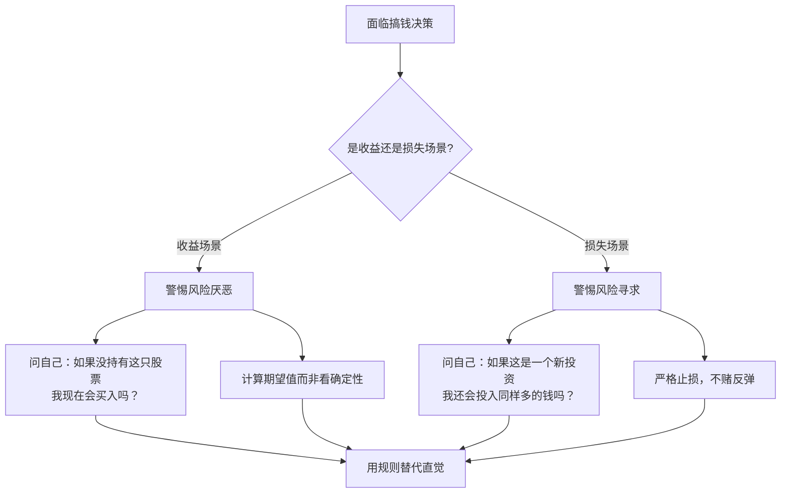

## 五、行为经济学与搞钱决策

### 5.1 为什么理性人假设是错的？

传统经济学的基石是"理性经济人"假设——每个人都会收集完整信息、精确计算得失、做出最优选择。但现实中，你是否经历过这些场景？

- 明知应该存钱，却在双十一清空了购物车
- 股票亏了30%，死活不肯割肉，想着"回本就卖"
- 看到朋友圈都在买基金，忍不住跟风入场
- 工资一到账先消费，月底才想起来没存钱

这些都不是因为你"意志力差"或"不懂理财"，而是因为**人类大脑天生就有一套系统性的判断偏差**。行为经济学正是研究这些偏差的学科——2002年丹尼尔·卡尼曼（Daniel Kahneman）因该领域贡献获得诺贝尔经济学奖，2017年理查德·塞勒（Richard Thaler）再次因行为经济学获奖，标志着这个领域从边缘走向主流。

**行为经济学对搞钱的核心启示**：你不需要变成一个"理性机器"，你需要的是**理解自己的非理性模式，然后设计系统来对抗它们**。

#### 双系统理论：你的大脑里住着两个人

卡尼曼在《思考，快与慢》中提出了著名的双系统理论：

| 维度 | 系统1（快思考） | 系统2（慢思考） |
|------|----------------|----------------|
| 运作方式 | 自动、直觉、无意识 | 刻意、逻辑、需要努力 |
| 速度 | 毫秒级反应 | 需要数秒到数分钟 |
| 能耗 | 低，几乎不费力 | 高，容易疲劳 |
| 典型场景 | 看到打折就想买 | 计算房贷月供 |
| 搞钱影响 | 冲动消费、情绪化交易 | 理性分析、长期规划 |
| 可靠性 | 快但容易出错 | 慢但更准确 |

**关键认知**：大多数搞钱决策失败，不是因为你不会用系统2，而是因为**系统1在你反应过来之前就已经替你做了决定**。行为经济学的全部策略，本质上都是帮助你在关键时刻激活系统2。

### 5.2 前景理论：为什么亏钱比赚钱更痛

卡尼曼和特沃斯基的前景理论（Prospect Theory）是行为经济学最重要的理论框架，它解释了人们在面对风险和不确定性时的真实决策模式，而非经济学教科书中的理想模式。

#### 前景理论的三大核心发现

**第一，损失厌恶：失去的痛苦是得到的快乐的2-2.5倍**

这是影响搞钱决策最严重的认知偏差。实验数据表明：

| 场景 | 金额 | 心理感受强度 |
|------|------|-------------|
| 捡到100元 | +100 | 快乐指数 = 1 |
| 丢掉100元 | -100 | 痛苦指数 = 2.2 |
| 投资赚了1万 | +10,000 | 快乐指数 = 1 |
| 投资亏了1万 | -10,000 | 痛苦指数 = 2.2 |

这意味着：要让一个人接受一个50/50概率的赌局（赢1万或输1万），潜在收益至少需要是潜在损失的2.5倍以上，人们才愿意参与。

**损失厌恶在搞钱中的典型表现**：

1. **不愿止损**：股票亏了20%，想着"等回本了再卖"，结果从-20%变成-50%。本质上你把"卖出亏损股票"等同于"确认损失"，而"持有"则保留了"可能回本"的希望——即使理性分析告诉你换一只更好的股票回本更快。
2. **过早止盈**：股票涨了10%就急着卖掉"锁定利润"，错过后续100%的涨幅。因为你害怕"赚到的钱又没了"，这种恐惧比"可能赚更多"的期待强烈得多。
3. **过度保守**：因为害怕亏损，把所有钱存活期（年化0.2%），眼睁睁看着通胀每年吃掉3%的购买力。10年后，你的钱表面没少，实际购买力缩水了超过25%。
4. **沉没成本陷阱**：在一个明显失败的项目上继续投入，因为"已经花了这么多钱/时间"。你花的那些钱已经回不来了，继续投入只会损失更多。

**第二，参考点依赖：你不是在看绝对值，而是在看变化**

前景理论发现，人们对结果的评估不是基于最终状态，而是基于相对于某个"参考点"的变化。

- 月薪从8000涨到10000：开心
- 月薪从12000降到10000：痛苦——即使10000比8000多

**搞钱启示**：

- **重新设定参考点**：不要把"之前的最高点"当参考点。把"我需要多少钱过满意的生活"当参考点，很多决策会变得更清晰。
- **警惕"心理账户"**：你可能觉得"年终奖是意外之财，可以随便花"，但钱就是钱，不存在"意外的钱"和"辛苦赚的钱"的区别。

**第三，确定性效应：人们过度偏爱确定的结果**

面对以下两个选项，大多数人会选择A：
- A：100%确定获得3000元
- B：80%概率获得4000元（期望值3200元）

但在以下场景中，大多数人会选择D：
- C：100%确定损失3000元
- D：80%概率损失4000元（期望值-3200元）

**模式总结**：
- 面对收益时，人们变得**风险厌恶**——"落袋为安"，哪怕期望值更高
- 面对损失时，人们变得**风险寻求**——"赌一把"，哪怕期望值更差

这解释了为什么赌徒输了钱会加倍下注（风险寻求），而赢了钱会赶紧收手（风险厌恶）。也解释了为什么股市里散户往往"赚小亏大"。

#### 前景理论的实战应对框架



### 5.3 锚定效应：第一个数字绑架了你

锚定效应是指人们在做判断时，会过度依赖第一个接触到的信息（"锚"），即使这个信息完全无关。

#### 经典实验证明

卡尼曼的实验：让两组人估计"联合国中非洲国家的比例"。在回答前，先转一个随机转盘：
- 转到10的那组，平均估计为25%
- 转到65的那组，平均估计为45%

一个完全随机的数字，竟然把估计值拉动了20个百分点。

#### 锚定效应在搞钱中的常见陷阱

| 场景 | 锚 | 正确思考方式 |
|------|-----|-------------|
| "这只股票之前涨到100，现在50很便宜" | 历史最高价 | 看当前基本面估值（PE/PB/现金流），不看历史价格 |
| "原价2000，现在打5折只要1000" | 原价 | 这个东西对你值多少钱？不打折你会买吗？ |
| "别人开价50万，我砍到45万赚了" | 对方开价 | 这个东西/服务的市场价是多少？ |
| "上个月赚了2万，这个月只赚1万" | 上月收入 | 长期平均收入是多少？单月波动无意义 |
| "面试时HR问你期望薪资" | HR给出的范围 | 先调研市场价，自己先开价 |

**应对策略**：

1. **先做功课再决策**：在接触任何"锚"之前，先用自己的信息建立基准。买房前先查同区域成交价，而不是听中介报价后再砍价。
2. **主动设锚**：谈判中先出价的人往往占据优势，因为你的出价会成为对方的锚。
3. **多角度验证**：同一个问题用至少3种不同方法估算，如果结果差异很大，说明某个锚在起作用。

### 5.4 心理账户：你把钱分成了不同的罐子

理查德·塞勒提出的心理账户理论揭示了一个反直觉的事实：**钱是完全可替代的，但人们的大脑不是这样运作的**。

#### 心理账户的典型表现

| 心理账户 | 行为表现 | 为什么有问题 |
|----------|---------|-------------|
| "工资账户" | 花钱精打细算 | — |
| "年终奖账户" | 大手大脚消费 | 同样的钱，花法完全不同 |
| "投资收益账户" | 随意追加高风险投资 | "反正是赚来的钱" |
| "彩票/红包账户" | 轻率花掉 | "意外之财不算钱" |
| "定期存款账户" | 即使信用卡欠债18%利率也不愿取出4%利率的定期 | 为了心理上的"安全感"付出真实代价 |

**最后一行尤其荒谬**：很多人信用卡欠着年化18%的债务，同时银行存着年化2%的定期，因为"定期是不能动的"。从纯数学角度，取出定期还信用卡，每年能省下16%的利息差。

#### 如何利用心理账户帮你搞钱

心理账户不全是坏事，你可以反过来利用它：

1. **建立"未来基金"账户**：单独开一个账户，命名为"5年后的自己"，每月自动转入固定金额。心理账户的"标签效应"会帮你抵制消费冲动。
2. **给每笔收入分配角色**：工资到账后，立即按比例分配到"必要支出/投资/自由消费/学习基金"四个账户。这比"先花再存"有效10倍。
3. **消除有害的心理账户**：年终奖、投资收益、红包——进了你的银行账户就是你的钱，和工资没有区别。用同样的标准去花它。

### 5.5 即时满足偏好：为什么你总是存不下钱

即时满足偏好（也叫"双曲贴现"）是指人们倾向于选择眼前的小收益，而非未来的大收益。

#### 神经科学解释

当面临即时满足时，大脑的边缘系统（尤其是伏隔核）被强烈激活，产生多巴胺冲动。而考虑长期利益时，前额叶皮层需要抑制这种冲动——这是一个消耗能量的过程，而且经常输掉。

#### 棉花糖实验的真正启示

斯坦福大学的经典棉花糖实验表明：能延迟满足的孩子，长大后的收入、健康和幸福程度都显著高于即时满足的孩子。但后续研究（2018年，Watts等人）发现了一个重要补充：**延迟满足能力很大程度上受家庭环境影响**——在可靠环境中长大的孩子更容易延迟满足，因为他们相信"等待是有回报的"。

**搞钱启示**：如果你发现自己很难存钱，不一定是你"意志力差"，可能是你过去的经历让你觉得"存了也没用"或"不如现在享受"。解决方案不是靠意志力硬撑，而是**建立自动化系统绕过意志力**。

#### 即时满足偏好在消费中的具体表现

- **"就这一次"陷阱**：每一次都说"就这一次"，但每个月都有好几次"这一次"
- **"反正也存不了多少"的自我合理化**：月薪8000，觉得存2000没意义。但每月2000，年化8%，10年后是36万，20年后是117万
- **信用卡分期的诱惑**：把未来的钱提前花掉，本质是在用高利率（实际年化13-18%）借钱消费
- **订阅服务的温水煮青蛙**：每个才十几二十块，加起来每月几百块，每年几千块

#### 对抗即时满足的五道防线

| 防线 | 具体做法 | 原理 |
|------|---------|------|
| 第一道：自动化储蓄 | 工资日设置自动转账到投资账户 | 在你看到钱之前就存起来 |
| 第二道：消费冷却期 | 超过200元的非必需消费等48小时 | 让系统2有机会介入 |
| 第三道：物理隔离 | 投资账户不绑快捷支付，取钱需要T+1 | 增加消费的摩擦成本 |
| 第四道：可视化进度 | 在显眼处贴财务目标进度图 | 把未来的收益变得"可见" |
| 第五道：替代满足 | 想买东西时先整理现有物品 | 降低获取新物品的冲动 |

### 5.6 从众心理：为什么你总在最高点买入

从众心理（herd behavior）是指个体在群体压力下改变自己的判断和行为，跟随多数人的选择。在金融市场中，这是泡沫和崩盘的心理基础。

#### 泡沫形成的六阶段模型


#### 中国市场真实案例复盘

**2015年A股杠杆牛市**：
- 2014年底：融资融券余额从5000亿飙升至2.2万亿
- 2015年6月12日：上证指数5178点，全民炒股，"一万点不是梦"
- 2015年6月15日-7月9日：三周内暴跌至3373点，跌幅35%
- 结果：据中国结算数据，当时约5000万股民中，超过85%的散户亏损

**2021年"茅指数"抱团瓦解**：
- 2020年底：机构重仓白酒、新能源，贵州茅台突破2000元
- 散户口号："核心资产永远涨""怕高都是苦命人"
- 2021年2月-3月：茅指数从高点回撤超30%，部分个股腰斩
- 教训："机构抱团"不等于"安全"，一致预期本身就是风险

**2021-2022年加密货币过山车**：
- 2021年11月：比特币6.9万美元，全网喊"10万美元"
- 2022年11月：跌至1.5万美元，跌幅78%
- 无数人在最高点附近入场，血本无归

#### 识别从众陷阱的信号清单

当你发现自己或周围出现以下信号时，大概率已经处于泡沫后期：

1. **出租车司机/理发师都在聊投资**：当最不可能关注投资的人都开始参与，说明增量资金已经枯竭
2. **"这次不一样"的叙事**：每个泡沫都有一个看似合理的"新范式"故事
3. **用杠杆加仓**：借钱投资说明已经把能用的自有资金都用完了
4. **嘲笑保守的人**：当"胆小鬼"成为嘲笑对象，说明风险定价已经扭曲
5. **FOMO情绪主导决策**：你不是因为分析了基本面才买入，而是因为"怕错过"

### 5.7 过度自信：你以为你比大多数人聪明

过度自信是交易者最致命的认知偏差。研究表明，约74%的基金经理认为自己的业绩高于平均水平——数学上这不可能。

#### 过度自信的三种表现

| 类型 | 表现 | 搞钱后果 |
|------|------|---------|
| 预测过度自信 | "这只股票一定会涨" | 重仓单一标的，忽视风险 |
| 精度过度自信 | "我能精确判断买卖时机" | 频繁交易，手续费和滑点侵蚀收益 |
| 优胜偏差 | "我比大多数人投资水平高" | 拒绝学习、拒绝分散、拒绝听取不同意见 |

**数据真相**：
- 散户平均年化收益率比市场指数低3-5个百分点（Barber & Odean, 2000）
- 交易越频繁，收益越差。交易最频繁的20%散户，年化收益比最不活跃的低7个百分点
- 原因：频繁交易产生更多手续费、更多税费、更多情绪化错误

#### 对抗过度自信的方法

1. **交易日志**：记录每一笔交易的买入理由、预期、实际结果。每月复盘，你会发现自己的判断准确率远低于你以为的。
2. **事前验尸法（Pre-mortem）**：在做重大投资决策前，假设这笔投资已经失败了，然后反推"它为什么会失败"。这能帮你提前发现盲点。
3. **对照组思维**：问自己"如果我没有持有这只股票，我现在会买入吗？"如果答案是"不会"，那你持有它只是因为禀赋效应。
4. **设定决策清单**：把你的投资标准写成清单，每笔交易前逐项检查。这能避免"这次情况特殊"的自我欺骗。

### 5.8 禀赋效应与沉没成本：你舍不得放手的真正原因

禀赋效应是指人们对已经拥有的东西赋予更高的价值——仅仅因为它是"我的"。

#### 经典实验

在马克杯实验中：随机给一半学生发马克杯，然后让他们交易。拥有杯子的人平均愿意卖出的最低价格是7.12美元，而没有杯子的人平均愿意出的最高价只有2.87美元。同一个杯子，仅仅因为"归属权"不同，估价差距2.5倍。

#### 禀赋效应在搞钱中的表现

- **死守亏损股票**：这只股票是"我选的"，卖掉等于承认"我错了"。但市场不关心你的自尊心。
- **不愿放弃沉没成本**：花3年学了一个不喜欢的专业，毕业后死活不愿转行。但那3年已经过去了，继续在这个方向上花30年是更大的浪费。
- **高估自己的副业项目**：投入了大量时间精力的副业即使不赚钱也不愿放弃，因为"已经投入这么多了"。

#### 沉没成本的正确处理方式

沉没成本是指已经发生且无法收回的成本。**理性决策只看未来，不看过去**。

```text
错误思维：我已经在这个项目上花了5万，不能放弃
正确思维：如果我现在从零开始，我会选择这个项目吗？
          未来继续投入的预期收益 > 未来继续投入的预期成本吗？
```

**实用决策框架——"重新开始测试"**：

面对任何"要不要继续"的决策时，问自己：
1. 如果我今天才第一次了解到这个机会，我会投入吗？
2. 如果我现有的投入全部归零，我还会选择这个方向吗？
3. 把继续投入的资源用在其他地方，回报会不会更高？

如果三个问题的答案都是"不会/不会/会"，那就果断止损。

### 5.9 框架效应：换一种说法就换了你的决定

框架效应是指同一个问题，用不同的方式表述，会导致截然不同的决策。

#### 经典案例

面对一个手术方案，医生有两种说法：
- **正面框架**："手术后一个月的存活率是90%"——79%的人选择手术
- **负面框架**："手术后一个月的死亡率是10%"——51%的人选择手术

完全相同的数字，只是换了一种表述，选择率差异近30个百分点。

#### 搞钱场景中的框架效应

| 场景 | 正面框架（更可能购买） | 负面框架（更可能拒绝） |
|------|---------------------|---------------------|
| 基金销售 | "过去10年年化收益12%" | "过去10年有3年亏损超过15%" |
| 保险推销 | "每天只需11元就能获得100万保障" | "每年保费4000元" |
| 消费贷款 | "每天只需33元" | "年化利率15.6%" |
| 理财课程 | "学会这套方法，每年多赚10万" | "课程费6999元" |

**应对策略**：

1. **永远把数字换算成同一个维度**：不要看"每天只需33元"，算成年化总成本和利率。
2. **同时看正面和反面**：任何投资机会都同时要求对方展示"最好情况"和"最差情况"。
3. **用自己的框架重新表述**：在做决策前，用自己的话把选项重新描述一遍。

### 5.10 现状偏差与默认选项：你只是因为懒得动

现状偏差（Status Quo Bias）是指人们倾向于维持现状，即使改变明显更好。

#### 为什么存在现状偏差？

1. **选择过载**：选项太多导致决策疲劳，维持现状是最省力的选择
2. **损失厌恶**：任何改变都可能带来损失，而损失的痛苦大于收益的快乐
3. **后悔规避**：主动改变如果失败了会更后悔，"不动"至少不会"犯错"

#### 现状偏差在搞钱中的表现

- **一直用着不划算的手机套餐**：每个月多花50元，但懒得换
- **工资卡里的活期存款放了3年**：转到货币基金能多赚几千块利息
- **从未调整过社保/公积金缴纳比例**：可能多交了没必要多交的钱
- **买了保险后再也没看过条款**：可能有重复保障或已不适用的险种

**应对策略——利用默认选项的正面力量**：

塞勒的"助推"（Nudge）理论发现，改变默认选项可以极大影响行为。你可以主动设计自己的"默认选项"：

1. **默认储蓄**：设置工资到账自动转入理财账户（默认是"存"，而不是"花完再存"）
2. **默认投资**：设置每月定投指数基金（默认是"投资"，而不是"等有闲钱再投"）
3. **默认不买**：把购物APP从手机首屏移除，每次想买东西需要主动搜索打开
4. **默认学习**：每天早上第一件事是看30分钟财经内容，而不是刷短视频

### 5.11 可得性偏差：你以为发生的概率和实际不一样

可得性偏差（Availability Heuristic）是指人们根据信息在记忆中的容易获取程度来判断事件发生的概率。

#### 典型表现

- **高估飞机失事概率**：因为媒体大量报道空难，实际上飞机是最安全的交通工具（事故率约1/1200万次飞行）
- **低估心血管疾病风险**：因为"看不见"，实际上它是中国第一大死因
- **高估炒股暴富概率**：因为媒体只报道暴富案例，从不报道亏损的沉默大多数
- **低估复利的力量**：因为大脑很难直觉理解指数增长，每年8%看似不起眼，20年翻4.66倍

#### 搞钱中的可得性偏差

| 偏差方向 | 具体表现 | 正确做法 |
|----------|---------|---------|
| 高估 | "某某炒股赚了100万" | 查看完整的统计数据：散户盈亏比约1:9 |
| 高估 | "创业成功率很高" | 中国中小企业3年存活率不到30% |
| 低估 | "保险理赔概率很低" | 查看银保监会公布的理赔率（通常>97%） |
| 低估 | "通胀的影响不大" | 3%的通胀率下，24年后购买力减半 |

**应对策略**：养成**查数据**的习惯。任何涉及概率的决策，先去找真实统计数据，而不是凭"感觉"判断。

### 5.12 构建你的行为经济学防御体系

了解了这么多认知偏差后，关键是建立一套系统性的防御机制，而不是靠"记住这些偏差"来对抗——因为系统1的运作速度远快于你的意识。

#### 个人决策防护清单

在做任何重大搞钱决策（超过月收入10%）前，逐项检查：

```markdown
□ 我是否在情绪激动时做这个决策？（等24小时再决定）
□ 我是否因为"别人都在做"才想做？（独立验证基本面）
□ 我的判断是否被某个"锚"影响了？（用3种方法独立估值）
□ 我是否因为"已经投入了"才不愿放弃？（做"重新开始测试"）
□ 我是否把收益和损失放在了不同心理账户？（统一看待所有资金）
□ 我是否过度自信？（查看自己的交易日志准确率）
□ 我是否只看到了容易想到的信息？（主动搜索反面证据）
□ 如果这件事发生在别人身上，我会给他什么建议？（跳出自我视角）
```

#### 日常习惯训练

| 习惯 | 频率 | 目的 |
|------|------|------|
| 记录交易日志 | 每笔交易 | 对抗过度自信，积累真实数据 |
| 复盘决策 | 每周 | 识别重复出现的偏差模式 |
| 阅读反面观点 | 每天 | 对抗确认偏差和可得性偏差 |
| 整理财务全景 | 每月 | 对抗心理账户偏差 |
| 设定并回顾规则 | 每季度 | 用系统2的规则约束系统1的冲动 |

#### 推荐的工具和方法

1. **决策日记**：用Notion或Excel记录每次重大决策的理由、预期和结果。3个月后回看，你会惊讶于自己判断的偏差模式。
2. **自动化系统**：把能自动化的全部自动化——自动定投、自动还贷、自动转入储蓄。减少需要做决策的次数，就是减少犯错的机会。
3. **投资检查清单**：参考阿图·葛文德《清单宣言》的理念，把你的投资标准做成清单。每次投资前必须逐项通过。
4. **"反对派"角色**：找一个信任的朋友，在你做重大决策时专门负责唱反调。如果找不到，至少在纸上写下3个"这笔投资会失败的理由"。

### 5.13 常见误区与纠正

| 误区 | 正确认知 |
|------|---------|
| "我知道这些偏差，所以不会犯" | 知道不等于能避免，系统1的运作在意识之下。需要靠系统和流程，而非意志力 |
| "我要完全消除情绪" | 不可能也不应该。情绪提供快速信号，关键是不让情绪单独做重大决策 |
| "理性投资就是不动" | 过度不作为也是偏差（现状偏差）。定期再平衡、根据生命周期调整配置是必要的 |
| "行为经济学只适用于投资" | 适用一切搞钱场景：消费决策、职业选择、创业判断、谈判定价 |
| "学一次就够了" | 认知偏差会反复出现。持续觉察和系统化应对才是长久之道 |

### 5.14 进阶阅读

- **《思考，快与慢》**（丹尼尔·卡尼曼）：行为经济学的奠基之作，系统讲解双系统理论和各种认知偏差
- **《助推》**（理查德·塞勒）：如何通过设计选择架构改善决策，适用于个人理财和公共政策
- **《怪诞行为学》**（丹·艾瑞里）：用生动实验揭示人类决策的非理性模式
- **《噪声》**（卡尼曼等）：揭示判断中比偏差更隐蔽的"噪声"问题
- **《贫穷的本质》**（班纳吉与迪弗洛）：诺贝尔奖得主研究贫困人群的真实决策模式，对理解"为什么穷人更难存钱"有深刻洞察
