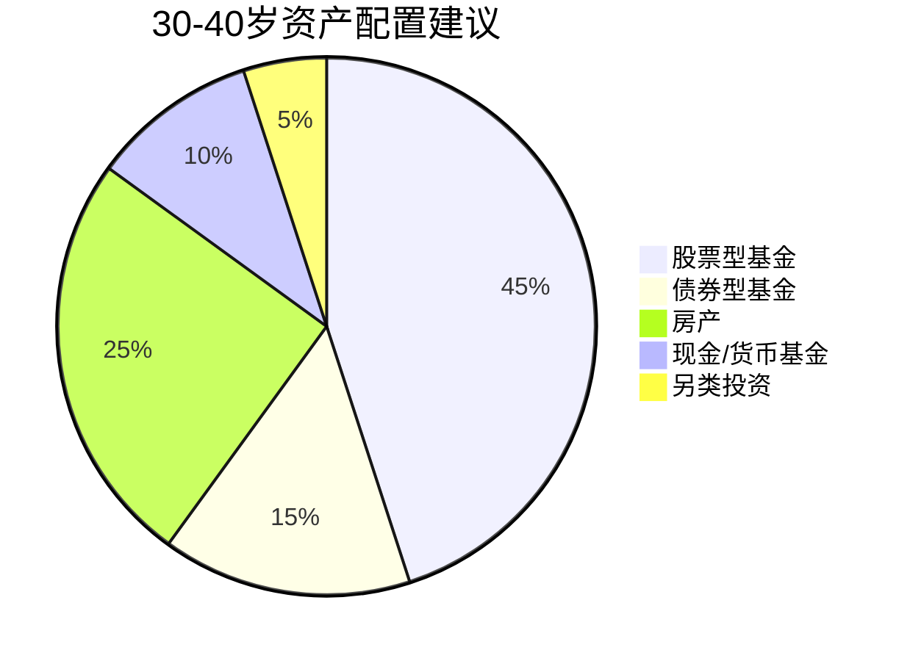
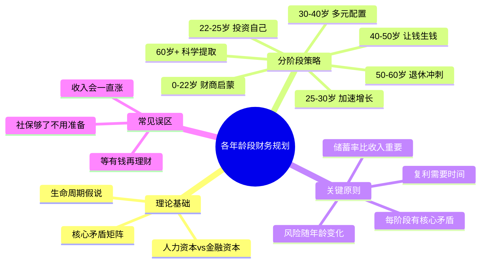

## 六、各年龄段财务规划详细指南

### 6.1 为什么财务规划必须分年龄段？

#### 6.1.1 生命周期假说：理论根基

1985年诺贝尔经济学奖得主弗兰科·莫迪利安尼（Franco Modigliani）提出的**生命周期假说**（Life-Cycle Hypothesis），是年龄分段财务规划的理论基石。该理论的核心观点是：

> 理性人会在一生中平滑消费，而非在收入高时大肆挥霍、收入低时节衣缩风。人们会在工作年份储蓄，在退休后消耗储蓄，目标是**一生的效用最大化**。

这个理论揭示了一个关键事实：**你的财务决策必须放在整个人生的时间轴上看，而不是只看当下的收入和支出。**

#### 6.1.2 人力资本与金融资本的转化

理解年龄与财务的关系，需要掌握两个核心概念：

**人力资本**（Human Capital）：你未来所有劳动收入的现值。22岁时，你最大的资产就是人力资本——几十年的工作收入还没有兑现。

**金融资本**（Financial Capital）：你已经积累的可投资资产（存款、股票、基金、房产等）。

人的一生，本质上是**将人力资本逐步转化为金融资本**的过程：


**关键启示：**
- 年轻时，投资人力资本（学习、技能、人脉）的回报率远高于投资金融资产
- 中年时，两者的边际回报趋于平衡，应双线并进
- 年老时，金融资本成为主要收入来源，保值优先于增值

#### 6.1.3 各年龄段的核心矛盾

每个年龄段都有一对需要平衡的核心矛盾，处理好这对矛盾是该阶段财务规划的关键：

| 年龄段 | 核心矛盾 | 错误倾向A | 错误倾向B |
|--------|---------|----------|----------|
| 22-25岁 | 消费欲望 vs 储蓄习惯 | 及时行乐，月光族 | 过度节俭，错过自我投资 |
| 25-30岁 | 增长速度 vs 风险承受 | 过于保守，错失增长窗口 | 过于激进，背负过高杠杆 |
| 30-40岁 | 家庭责任 vs 个人发展 | 全部为家庭牺牲，失去竞争力 | 忽视家庭，关系破裂 |
| 40-50岁 | 财富增长 vs 风险控制 | 过于保守，被通胀侵蚀 | 中年冒险，一夜归零 |
| 50-60岁 | 退休准备 vs 继续积累 | 提前"躺平"，准备不足 | 拼命工作，错过享受期 |
| 60岁+ | 消费享受 vs 资产传承 | 过度吝啬，委屈自己 | 过度挥霍，晚景凄凉 |

---

### 6.2 0-22岁：财商启蒙与教育奠基期

很多财务规划指南从22岁开始，但真正重要的财务教育从童年就开始了。这个阶段虽然没有独立收入，但决定了一个人未来几十年的财务行为模式。

#### 6.2.1 儿童财商教育路线图（0-12岁）

**为什么这个阶段重要？** 剑桥大学2013年的研究显示，儿童的金钱习惯在7岁左右就已经基本形成。也就是说，在孩子上小学之前，他们对金钱的基本态度已经定型了。

**分龄教育方案：**

| 年龄段 | 教育目标 | 具体方法 | 预期成果 |
|--------|---------|---------|---------|
| 3-5岁 | 理解"钱可以买东西" | 带孩子用现金购物，让他们递钱、找零 | 知道钱是交换媒介 |
| 6-8岁 | 理解"钱需要赚取" | 给零花钱，设置家务赚取额外奖励的机制 | 理解劳动与收入的关系 |
| 9-12岁 | 理解"储蓄和延迟满足" | 开设儿童银行账户，教"三个罐子"法则（花/存/捐） | 具备基本储蓄意识 |

**三个罐子法则详解：**
- **花销罐（50%）**：用于日常小额消费，让孩子自主决定
- **储蓄罐（40%）**：用于攒钱买较贵的东西，训练延迟满足
- **捐赠罐（10%）**：用于慈善或帮助他人，培养社会责任感

#### 6.2.2 青少年财商进阶（13-18岁）

**核心能力培养：**

**（1）理解复利——让时间成为朋友**
用具体例子说明：如果从18岁开始每月存200元，按年化7%计算，到60岁时这笔钱将变成约68万元。而如果从30岁才开始，同样的月存200元到60岁只有约24万元。12年的差距，结果相差近3倍。

**（2）理解通货膨胀——钱会"缩水"**
假设年通胀率3%，今天的100元在10年后只值约74元的购买力。这意味着"把钱放在枕头底下"是最差的"理财"方式。

**（3）模拟投资实践**
- 用模拟炒股App体验市场波动（如雪球模拟组合）
- 记录家庭账本，了解家庭收支结构
- 参与家庭财务讨论（如假期旅行预算制定）

#### 6.2.3 大学阶段的财务实践（18-22岁）

**这个阶段的独特价值：** 这是人生中第一次拥有相对独立的财务决策权，但试错成本极低（没有房贷、没有家庭负担）。

**必做清单：**

1. **开设个人银行账户和证券账户**：熟悉金融基础设施
2. **尝试第一份兼职或实习**：理解赚钱的辛苦，建立"真实时薪"的直觉
3. **管理一笔预算**：无论是生活费还是奖学金，练习在有限金额内做取舍
4. **了解基本金融产品**：余额宝/零钱通是什么？定期存款和活期存款的区别？什么是年化收益率？
5. **避免消费贷陷阱**：花呗、白条、校园贷——理解"借钱消费"的真实成本

**警示数据：** 中国人民银行2024年数据显示，18-24岁群体的消费信贷渗透率已超过40%，其中相当一部分人陷入了"以贷养贷"的恶性循环。大学阶段养成的消费习惯，往往会影响整个职业生涯。

---

### 6.3 22-25岁：职业起步期——播种阶段

#### 6.3.1 财务状况全景

**收入特征：**
- 一线城市：月薪5,000-10,000元（2025年应届生平均起薪约6,500元）
- 二线城市：月薪3,500-7,000元
- 收入增长潜力：这是职业生涯中增速最快的阶段，3年内收入翻倍并不罕见

**支出特征：**
- 房租占收入比例最高（一线30-50%，二线20-35%）
- 社交消费频繁（入职应酬、同事聚餐、同学聚会）
- 刚需消费集中（搬家、购置生活用品、通勤装备）

**资产特征：**
- 净资产接近零或为负（可能有助学贷款）
- 没有投资经验
- 人力资本占比95%以上

#### 6.3.2 这个阶段的核心策略

**策略一：投资自己，而不是投资股市**

这是整个财务规划中最反直觉但最重要的认知——22-25岁，你最好的投资标的是你自己。

为什么？算一笔账：
- 假设你月薪6,000元，每月省下1,000元投资，年化收益10%（已经很高了），一年投资收益约600元
- 但如果花3,000元考一个证书，让你的月薪从6,000涨到8,000，一年增收24,000元
- 投资自己的回报率是投资股市的40倍

**投资自己的具体方向：**

| 投资方向 | 预期回报 | 投入周期 | 示例 |
|---------|---------|---------|------|
| 行业证书 | 薪资提升10-30% | 3-6个月 | CPA、PMP、CFA一级 |
| 英语能力 | 打开外企/出海机会 | 6-12个月 | 雅思7分、商务英语 |
| 编程技能 | 跨行业通用能力 | 3-6个月 | Python、SQL、数据分析 |
| 人脉社交 | 长期复利效应 | 持续进行 | 行业会议、校友网络 |
| 个人品牌 | 可变现的专业影响力 | 6-24个月 | 技术博客、开源贡献 |

**策略二：建立50/30/20预算框架**

50/30/20法则是哈佛大学伊丽莎白·沃伦（Elizabeth Warren）教授提出的经典预算法则：
- **50% 必要支出**：房租、水电、交通、基本饮食
- **30% 个人消费**：社交、娱乐、购物、旅行
- **20% 储蓄投资**：应急基金、定投

**月收入5,000元的一线城市分配示例：**

| 项目 | 金额 | 占比 | 说明 |
|------|------|------|------|
| 房租 | 1,500元 | 30% | 合租单间，控制在收入30%以内 |
| 交通+通讯 | 400元 | 8% | 地铁公交为主，手机套餐选最低档 |
| 饮食 | 1,200元 | 24% | 自炊为主，午餐食堂 |
| 社交娱乐 | 800元 | 16% | 但不是每个月都要花完 |
| 学习投资 | 600元 | 12% | 课程、书籍、考证费用 |
| 储蓄/投资 | 500元 | 10% | 先存后花，哪怕只有500 |

> 💡 注意：5,000元在一线城市的生存线附近，20%的储蓄率可能过于理想化。如果真的存不下来，不要焦虑——这个阶段的首要目标是**建立记账习惯**和**不增加负债**，而不是存多少钱。

**策略三：建立应急基金**

应急基金是财务安全的第一道防线。目标是3-6个月的基本生活费。

- 22-25岁目标：至少存够10,000-20,000元
- 存放位置：货币基金（余额宝、零钱通）或银行活期理财
- 原则：**流动性第一，收益率第二**——这笔钱是"保险"，不是"投资"

**策略四：开始小额定投**

即使每月只能投500元，也要开始。原因不是为了赚多少钱，而是为了：
- 建立投资纪律
- 亲身体验市场波动
- 理解"定投微笑曲线"
- 培养长期主义思维

**推荐起步方案：**
- 每月定投500-1,000元到沪深300指数基金
- 设置自动扣款，发工资第二天执行
- 至少坚持12个月不中断

#### 6.3.3 这个阶段的常见陷阱

1. **"我还年轻，以后再说"**：复利的最大敌人是拖延。25岁开始和35岁开始，最终结果可能相差百万元
2. **"收入太低，存不了钱"**：储蓄率比绝对金额重要。月薪5,000存500（10%）比月薪50,000存2,000（4%）更有价值
3. **"先享受，以后会赚更多"**：消费习惯一旦形成很难改变。用6,000的收入养出10,000的消费习惯，涨薪后你只会花得更多
4. **"投资太复杂，我不懂"**：指数基金定投不需要择时能力，是初学者最优解

---

### 6.4 25-30岁：能力积累期——扎根阶段

#### 6.4.1 财务状况转折点

这个阶段是人生财务的**第一个关键转折期**。很多人在这个阶段经历了从"刚够活"到"开始有余力"的转变，同时也是很多重大人生决策集中发生的时期：

- 第一次大幅加薪或跳槽
- 可能开始恋爱、考虑结婚
- 面临"要不要买房"的第一个重大财务决策
- 开始意识到"只靠工资不够"

**收入特征：**
- 一线城市：月薪8,000-25,000元
- 3年内实现2-3次薪资跳跃是常态（跳槽+升职）
- 副业收入开始萌芽

#### 6.4.2 这个阶段的核心策略

**策略一：加速人力资本变现**

25-30岁是收入增长的黄金窗口期。这个阶段每投入1元在技能提升上，未来可能产生10-100元的回报。

**加速收入增长的三条路径：**

1. **主业深耕**：成为团队中不可替代的人
   - 目标：3年内争取2-3次30%以上的薪资涨幅
   - 方法：主动承担高难度项目、建立跨部门影响力、定期与上级沟通职业发展
   - 关键指标：你的名字是否与某个专业领域绑定？

2. **副业探索**：找到可变现的第二技能
   - 初期目标：月入2,000-5,000元即可
   - 优先选择：能积累作品/客户/技能的副业（写作、设计、咨询、培训）
   - 避免选择：纯时间换钱的副业（代驾、送外卖）——除非你急需现金流

3. **跳槽议价**：合理利用市场定价
   - 在同一公司待2-3年后评估一次市场价值
   - 跳槽涨幅低于30%不值得动（除非有其他重大收益）
   - 每次跳槽前，先拿到至少2个offer再做决定

**策略二：建立系统化投资体系**

从"随便投投"升级为"有体系的投资"：

**投资体系四要素：**

| 要素 | 具体内容 | 25-30岁建议 |
|------|---------|------------|
| 资产配置 | 股票/债券/现金的比例 | 70%股票型基金 + 20%债券基金 + 10%货币基金 |
| 定投纪律 | 固定时间、固定金额 | 发薪日次日自动扣款，金额=收入的20-30% |
| 品种选择 | 选什么标的 | 宽基指数（沪深300+中证500）为主，行业基金为辅 |
| 再平衡 | 多久调整一次 | 每年一次，或偏离目标比例超过10%时调整 |

**策略三：重大财务决策——买房**

"要不要买房"是25-30岁最纠结的财务决策。以下是决策框架：

**买房的条件检查清单：**
- ✅ 首付资金来源明确（不借高利贷、不掏空父母养老钱）
- ✅ 月供不超过家庭月收入的35%
- ✅ 计划在该城市长期居住（至少5年以上）
- ✅ 已有6个月以上的应急基金（扣除首付后）
- ✅ 不是为了"投资升值"，而是为了"居住需求"

**买房 vs 租房的数学对比（以二线城市为例）：**

| 对比维度 | 买房（总价150万） | 租房（月租3,000） |
|---------|-----------------|-----------------|
| 首付 | 45万（30%） | 0 |
| 月供 | 约5,600元（30年期，利率4.0%） | 3,000元 |
| 首付机会成本 | 45万×4%年化=18,000元/年 | 0 |
| 总月度成本 | 5,600+1,500（机会成本）=7,100元 | 3,000元 |
| 差额 | 4,100元/月 | — |
| 如果差额定投30年 | 4,100×12×30=147.6万本金 + 收益 | — |

> 💡 这不是说"租房一定比买房好"，而是告诉你：买房有巨大的机会成本，必须在充分了解代价的基础上做决策。

**策略四：保险配置**

25-30岁是配置保险的黄金窗口——保费最低、核保最容易。

**基础保险配置方案：**

| 险种 | 优先级 | 年缴保费参考（28岁健康男性） | 保额建议 |
|------|--------|--------------------------|---------|
| 医疗险（百万医疗） | ★★★★★ | 200-400元 | 200-400万 |
| 重疾险 | ★★★★ | 3,000-5,000元 | 30-50万 |
| 意外险 | ★★★★ | 100-300元 | 50-100万 |
| 定期寿险 | ★★★ | 500-1,000元 | 100-200万（有房贷/家庭责任时） |

**月收入15,000元的分配示例：**

| 项目 | 金额 | 占比 | 说明 |
|------|------|------|------|
| 房租/房贷 | 4,000元 | 27% | 控制在收入30%以内 |
| 生活费 | 3,000元 | 20% | 含餐饮、交通、通讯 |
| 学习/社交 | 2,000元 | 13% | 继续投资自己 |
| 储蓄/投资 | 4,500元 | 30% | 定投+应急基金补充 |
| 保险 | 800元 | 5% | 四大基础险种 |
| 弹性消费 | 700元 | 5% | 不固定支出的缓冲 |

#### 6.4.3 这个阶段的常见陷阱

1. **"消费升级"陷阱**：收入增长后，支出同步甚至更快增长。涨薪3,000元，房租涨1,000、吃饭涨500、衣服涨500……最后发现"涨了跟没涨一样"
2. **"买房焦虑"陷阱**：被"再不买就买不起了"的情绪驱动，用过高杠杆上车
3. **"伪投资"陷阱**：把钱投到P2P、虚拟币、高收益理财产品中，追求10%以上的"稳定收益"——没有稳定高收益，只有稳定高风险
4. **"保险错配"陷阱**：买了返还型保险（贵且收益低）、万能险（保障不足）、投连险（风险自担），而不是纯保障型产品

---

### 6.5 30-40岁：事业加速期——开花阶段

#### 6.5.1 财务状况特征

30-40岁是人生财务的**最复杂阶段**——收入达到可观水平，但支出也达到峰值。这个阶段被称为"三明治一代"：上有老、下有小、中间有房贷。

**收入特征：**
- 一线城市：月薪20,000-60,000元（中位数约30,000元）
- 副业/投资收入开始占一定比例
- 收入增速放缓，但绝对金额达到人生较高水平

**支出特征：**
- 房贷是最大支出项（月供8,000-20,000元）
- 子女养育成本急剧上升（月均3,000-10,000元）
- 父母赡养开始产生实际支出
- 社交应酬费用维持高位

**资产特征：**
- 房产成为家庭最大资产（但也有最大负债——房贷）
- 投资组合初具规模
- 净资产可能首次突破百万

#### 6.5.2 这个阶段的核心策略

**策略一：收入结构优化**

30岁以后，单纯依赖工资收入是最危险的策略。你需要建立**三条收入线**：

1. **主业收入**：争取成为行业专家或中层管理者
   - 目标：40岁前达到主业收入天花板的80%
   - 方法：从"执行者"转型为"管理者"或"专家"

2. **副业收入**：目标达到主业收入的20-30%
   - 优先选择：利用主业技能延伸（如程序员做技术咨询、设计师接私单）
   - 次优选择：利用兴趣变现（如写作、摄影、教学）

3. **投资收入**：被动收入应开始产生实质贡献
   - 目标：投资组合年度收益能覆盖1-2个月的生活开支
   - 方法：股息收入、基金分红、租金收入

**策略二：子女教育金规划**

子女教育是30-40岁最大的长期财务承诺。以下是真实成本测算：

**从出生到大学毕业的教育成本估算（2025年价格）：**

| 阶段 | 公立路线（元/年） | 私立路线（元/年） | 年限 | 公立总成本 | 私立总成本 |
|------|----------------|----------------|------|----------|----------|
| 0-3岁（早教） | 5,000 | 30,000 | 3 | 15,000 | 90,000 |
| 3-6岁（幼儿园） | 12,000 | 60,000 | 3 | 36,000 | 180,000 |
| 6-12岁（小学） | 15,000 | 80,000 | 6 | 90,000 | 480,000 |
| 12-15岁（初中） | 20,000 | 100,000 | 3 | 60,000 | 300,000 |
| 15-18岁（高中） | 25,000 | 120,000 | 3 | 75,000 | 360,000 |
| 18-22岁（大学） | 30,000 | 150,000（含留学） | 4 | 120,000 | 600,000 |
| **合计** | — | — | **22** | **396,000** | **2,010,000** |

> ⚠️ 以上仅为学费和基本教育支出，不含课外辅导、兴趣班、留学中介费等。实际花费通常是上表的1.5-3倍。

**教育金定投方案：**
- 从孩子出生开始，每月定投1,000-3,000元
- 选择中证500指数基金（18年周期可以承受较高波动）
- 每年投入12,000-36,000元，18年后按年化7%计算，本金+收益约36-108万元

**策略三：养老金规划的黄金期**

30-40岁是养老金规划的**最佳起步期**——时间够长、收入够高、复利效应显著。

**养老金缺口测算公式：**
```text
退休后月支出 = 当前月支出 × 0.7（退休后通常降低30%）
社保替代率 = 40-60%（视缴费基数而定）
月养老金缺口 = 退休后月支出 - 社保养老金
养老金总缺口 = 月养老金缺口 × 12 × 预期退休年数（按25年计算）
```

**示例计算：**
- 当前月支出15,000元，退休后预计月支出10,500元
- 社保养老金预计5,000元/月
- 月缺口 = 10,500 - 5,000 = 5,500元
- 总缺口 = 5,500 × 12 × 25 = 165万元（未考虑通胀）
- 考虑3%通胀，25年后的实际缺口约为345万元

**应对方案：** 从30岁开始，每月定投2,000元到养老目标基金，30年后按年化6%计算，可积累约200万元。加上社保养老金，基本可以覆盖退休生活。

**策略四：资产配置优化**

30-40岁的投资组合应该比25-30岁更加成熟和多元化：

**推荐配置比例：**



| 资产类别 | 配置比例 | 具体标的 | 说明 |
|---------|---------|---------|------|
| 股票型基金 | 45% | 沪深300+中证500+纳指100 | 长期增长引擎 |
| 债券型基金 | 15% | 纯债基金、可转债基金 | 降低组合波动 |
| 房产 | 25% | 自住房产（已扣除贷款净值） | 居住+抗通胀 |
| 现金/货币基金 | 10% | 余额宝、银行活期理财 | 应急+流动性 |
| 另类投资 | 5% | 黄金ETF、REITs | 分散化 |

#### 6.5.3 这个阶段的关键财务事件

**（1）婚前财产规划**
- 婚前各自资产做好记录和证明
- 讨论婚后财务管理模式（AA制/共同账户/混合制）
- 签署婚前协议（不是不信任，是对双方的保护）

**（2）家庭保险升级**
- 夫妻双方各自的重疾险、寿险、医疗险
- 子女的医疗险和意外险
- 家庭总保费控制在年收入的5-8%

**（3）遗嘱和财产传承初步规划**
- 不需要复杂的信托，但应有基本遗嘱
- 明确房产、存款、保险受益人的归属
- 每3-5年更新一次

#### 6.5.4 这个阶段的常见陷阱

1. **"鸡娃"陷阱**：在子女教育上过度投入，每年花10万+在课外辅导上，实际ROI极低。研究表明，家庭氛围和父母陪伴对儿童发展的影响远大于课外班
2. **"中产消费升级"陷阱**：收入30,000时住月租8,000的房子、开月供5,000的车、孩子上月费6,000的幼儿园——月入30,000却月光
3. **"投资焦虑"陷阱**：看到别人炒币赚了100万就跟风，结果高位接盘被套
4. **"忽视健康"陷阱**：用身体换钱，35岁开始出现各种慢性病。一次大病可能消耗掉多年的积蓄

---

### 6.6 40-50岁：财富积累高峰期——收获阶段

#### 6.6.1 财务状况特征

40-50岁是人生财务的**收获期**。经过近20年的积累，这个阶段的人通常拥有：
- 职业生涯最高的收入
- 可观的投资组合
- 房贷可能接近还清
- 子女逐渐长大，养育成本开始下降

**收入特征：**
- 职业收入达到峰值（月薪30,000-100,000元）
- 投资收益开始成为实质性收入来源
- 可能有企业分红、股权收益等

**风险特征：**
- 职业风险上升（中年危机、行业变革）
- 健康风险开始显现
- 家庭责任最重（子女教育、父母养老）

#### 6.6.2 这个阶段的核心策略

**策略一：让钱生钱——被动收入超过主动储蓄**

40岁以后，你的投资收益应该开始超过你每月存入的金额。这是从"用时间换钱"到"用钱生钱"的关键转折。

**计算示例：**
- 假设40岁时投资组合为200万元
- 年化收益率7%
- 年投资收益 = 200万 × 7% = 14万元
- 月均投资收益 = 11,667元
- 如果你每月还能存入10,000元，投资收益已经超过了储蓄金额

**策略二：投资组合逐步稳健化**

随着距离退休越来越近，投资组合的风险承受能力下降。核心原则是"100法则"：

> **股票类资产比例 ≤ 100 - 你的年龄**

| 年龄 | 股票类上限 | 建议配置 |
|------|----------|---------|
| 40岁 | 60% | 55%股票 + 25%债券 + 10%房产 + 10%现金 |
| 45岁 | 55% | 50%股票 + 30%债券 + 10%房产 + 10%现金 |
| 50岁 | 50% | 45%股票 + 35%债券 + 10%房产 + 10%现金 |

**策略三：风险管理升级**

40-50岁最大的风险不是投资亏损，而是**收入中断**。

**风险清单与应对：**

| 风险类型 | 发生概率 | 影响程度 | 应对措施 |
|---------|---------|---------|---------|
| 失业/降薪 | 中 | 高 | 保持6-12个月应急基金；维护行业人脉 |
| 重大疾病 | 低 | 极高 | 重疾险保额≥50万；定期体检 |
| 投资亏损 | 中 | 中 | 资产配置多元化；不借钱投资 |
| 婚姻变故 | 中 | 高 | 保持个人财务独立性；了解共同财产分割规则 |
| 父母大病 | 中 | 高 | 提前为父母购买医疗险；预留赡养资金 |

**策略四：传承规划**

这个阶段应开始认真考虑财富传承：
- **遗嘱**：正式立遗嘱，可以是自书遗嘱（每页签名+日期）
- **保险受益人**：定期检查和更新
- **家族信托**：资产规模超过500万时可以考虑
- **子女财商教育**：教孩子管理金钱，比留钱给他们更重要

#### 6.6.3 这个阶段的常见陷阱

1. **"中年冒险"陷阱**：觉得"再不拼就没机会了"，把大量资金投入高风险项目（创业all in、高杠杆投资、民间借贷）
2. **"过度保守"陷阱**：经历了一次市场暴跌后，把所有钱存银行定期。按3%的存款利率和3%的通胀率计算，实际收益为零
3. **"为子女牺牲"陷阱**：掏空养老钱给孩子买房、创业、留学。记住：你没有义务把自己的退休金搭进去
4. **"忽视配偶"陷阱**：一方掌控全部财务，另一方完全不了解家庭资产状况。万一发生意外，另一方可能陷入被动

---

### 6.7 50-60岁：退休准备期——冲刺阶段

#### 6.7.1 财务状况特征

50-60岁是退休前的**最后冲刺期**。这个阶段的核心任务是：确认退休金是否充足，如果不充足，还有10-15年的时间弥补。

**收入特征：**
- 职业收入可能开始下降或停滞
- 投资收益成为越来越重要的收入来源
- 社保缴费年限逐渐接近满额

**健康特征：**
- 慢性病发病率显著上升
- 医疗支出开始增加
- 体力和精力下降，工作能力可能受影响

#### 6.7.2 这个阶段的核心策略

**策略一：退休金精确测算**

这是50-60岁最紧迫的财务任务。你需要精确回答：退休后，钱够不够花？

**退休金缺口计算五步法：**

**第一步：估算退休后月支出**
```text
退休后月支出 = 当前月支出 × 0.65~0.80
（退休后通常减少的项目：通勤费、职业装、应酬、房贷）
（退休后通常增加的项目：医疗费、旅游、兴趣爱好）
```

**第二步：估算社保养老金**
- 登录"国家社会保险公共服务平台"查询
- 或用公式估算：基础养老金 ≈ 当地社平工资 × (1+缴费指数) ÷ 2 × 缴费年限 × 1%
- 粗略估算：缴费30年、缴费基数为社平工资的人，替代率约45-55%

**第三步：计算缺口**
```text
月养老金缺口 = 退休后月支出 - 社保养老金
```

**第四步：计算所需补充资产**
```text
所需补充资产 = 月养老金缺口 × 12 × 退休年数（建议按25-30年计算）
考虑通胀后：所需补充资产 × 通胀系数（3%通胀20年系数约1.8）
```

**第五步：制定弥补计划**
- 如果缺口在100万以内：调整投资组合，提高收益
- 如果缺口在100-300万：增加储蓄率+延迟退休2-3年
- 如果缺口超过300万：可能需要重大生活方式调整

**策略二：投资组合防御化**

50岁以后，投资的首要目标从"增值"转变为"保值"：

**推荐配置调整：**

| 资产类别 | 50-55岁 | 55-60岁 | 调整原因 |
|---------|---------|---------|---------|
| 股票型基金 | 40% | 30% | 降低波动性 |
| 债券型基金 | 30% | 35% | 提供稳定收益 |
| 银行理财/大额存单 | 15% | 20% | 确定性收益 |
| 现金/货币基金 | 10% | 10% | 应急+流动性 |
| 黄金 | 5% | 5% | 抗通胀+避险 |

**关键调整：**
- 逐步将股票型基金中"小盘+行业"替换为"大盘+红利"
- 增加债券基金和银行理财的比重
- 确保有3-5年的流动性储备（即未来3-5年的生活费不投资于任何可能亏损的产品）

**策略三：健康投资优先级提升**

50岁以后，健康成为最重要的"资产"：
- **每年全面体检**：不要省钱跳过体检，早发现早治疗是最划算的"投资"
- **长期护理险**：50-55岁是投保的最后窗口，之后保费大幅上升或无法投保
- **医疗费用储备**：单独设立一个"健康基金"，目标10-20万元
- **生活方式调整**：规律运动、合理饮食、充足睡眠——这些不花钱的"投资"回报率最高

**策略四：退休生活预演**

不要等到退休那天才开始想"退休后干什么"：
- 用年假模拟退休生活（连续2周不工作，你做什么？）
- 培养2-3个退休后可以持续投入的爱好
- 建立退休后的社交网络（不要只靠同事）
- 与配偶充分讨论退休后的生活方式

#### 6.7.3 这个阶段的常见陷阱

1. **"太晚了"心态**：觉得50岁才开始规划退休太晚了。实际上，50-60岁这10年如果规划得当，仍然可以显著改善退休生活质量
2. **"帮子女带孩子"陷阱**：为了帮子女带孩子提前退休，结果既损失了收入，又牺牲了自己的生活质量
3. **"投资返贫"陷阱**：这个阶段最怕的不是收益低，而是本金损失。远离一切承诺"高收益低风险"的产品
4. **"忽视遗嘱"陷阱**：觉得自己还年轻不需要遗嘱。意外和明天不知道哪个先来

---

### 6.8 60岁以后：退休生活期——享受阶段

#### 6.8.1 财务状况特征

60岁以后，收入来源从"主动+被动"转变为"纯被动"。这个阶段的财务核心是：**让有限的资产支撑尽可能长的退休生活。**

**收入来源：**
- 社保养老金
- 投资收益（股息、利息、基金分红）
- 商业养老保险金（如有）
- 子女赡养（不应作为主要依赖）

**风险特征：**
- 长寿风险：活得越久，钱越可能不够
- 通胀风险：20年后的购买力可能只有现在的一半
- 医疗风险：大病可能一次性消耗大量积蓄
- 认知衰退风险：财务判断力下降，容易被骗

#### 6.8.2 这个阶段的核心策略

**策略一：建立"三层收入结构"**

| 层级 | 来源 | 金额（示例） | 性质 |
|------|------|------------|------|
| 基础层 | 社保养老金 | 5,000元/月 | 确定性收入，终身发放 |
| 补充层 | 投资收益 | 3,000-5,000元/月 | 半确定性，需管理 |
| 弹性层 | 兼职/兴趣变现 | 0-3,000元/月 | 非确定性，可选 |

**策略二：提取策略——避免"人还在，钱没了"**

退休后的资产提取不是简单的"每月花一点"，需要科学的提取策略：

**动态提取法：**
- 第一年提取投资资产的4%
- 之后每年根据通胀调整提取金额
- 如果当年投资亏损超过15%，下一年减少10%的提取金额
- 如果当年投资收益超过20%，可以适当增加提取

**桶形策略（Bucket Strategy）：**
- **短期桶（1-2年生活费）**：银行活期/货币基金，零风险
- **中期桶（3-7年生活费）**：债券基金/银行理财，低风险
- **长期桶（剩余资金）**：股票基金，承受波动以获得长期增长

**策略三：防骗——守住钱袋子**

60岁以上人群是金融诈骗的高发群体。**守住本金比增加收益重要一万倍。**

**高危诈骗类型：**
- "高息理财"：承诺年化10%以上的"保本保息"产品
- "以房养老"骗局：诱导老人抵押房产
- "保健品投资"：买产品送股权/分红
- "冒充公检法"：声称涉嫌犯罪，要求转账到"安全账户"
- "黄昏恋"骗局：通过感情接近，最终骗钱

**防御原则：**
- 任何投资决策，在执行前与子女或信任的专业人士讨论
- 永远不在电话中做出转账决定
- 记住：**没有"保本高收益"这回事**

#### 6.8.3 这个阶段的常见陷阱

1. **"过度节俭"陷阱**：习惯了省吃俭用，退休后有钱也不敢花。记住：钱是工具，不是目的
2. **"溺爱孙辈"陷阱**：把大量积蓄花在孙辈身上，自己的生活质量严重下降
3. **"拒绝医疗"陷阱**：怕花钱而不去看病，小病拖成大病，反而花更多
4. **"遗产纠纷"陷阱**：没有提前做好财产分配安排，去世后子女反目

---

### 6.9 阶段过渡：关键转折点的财务调整

人生不是按计划走的。以下是最常见的"阶段提前/推迟"情况及应对方案：

#### 6.9.1 提前进入下一阶段的情况

| 情况 | 应对策略 |
|------|---------|
| 30岁就实现了高收入 | 不要急着消费升级，先把储蓄率提到50%以上 |
| 35岁遭遇行业衰退 | 立即启动"危机模式"：削减非必要支出，增加应急基金，探索新方向 |
| 45岁被动退休（裁员） | 评估是否需要提前动用退休金，考虑半退休方案（兼职+投资收益） |

#### 6.9.2 延迟停留在当前阶段的情况

| 情况 | 应对策略 |
|------|---------|
| 35岁还在"起步期"收入水平 | 重新评估职业方向，考虑转行或技能升级 |
| 40岁还没有开始投资 | 不要恐慌性投资，从最保守的定投开始 |
| 55岁还在还房贷 | 考虑是否应该卖掉现有房产，换一套更小的 |

#### 6.9.3 阶段过渡检查清单

每次进入新的人生阶段前，做一次完整的财务体检：

```text
□ 收入来源是否稳定？
□ 储蓄率是否达到当前阶段目标？
□ 应急基金是否充足？
□ 保险保障是否匹配当前家庭责任？
□ 投资组合是否需要调整风险等级？
□ 是否有需要更新的法律文件（遗嘱、受益人）？
□ 未来3-5年的重大财务决策是什么？
□ 有没有需要处理的高息负债？
```

---

### 6.10 各年龄段速查表

以下是一张完整的各年龄段财务规划速查表，建议打印出来贴在书桌前：

| 年龄 | 阶段名称 | 核心任务 | 储蓄率目标 | 投资风格 | 关键里程碑 |
|------|---------|---------|----------|---------|----------|
| 22-25 | 播种期 | 投资自己，建立习惯 | 10-20% | 保守（货币基金+小额定投） | 应急基金≥1万；开始记账 |
| 25-30 | 扎根期 | 加速收入，建立体系 | 20-35% | 成长（指数基金定投） | 保险配置完成；定投≥12个月 |
| 30-40 | 开花期 | 扩大收入，优化配置 | 30-40% | 平衡（股债混合） | 被动收入占比≥10%；子女教育金启动 |
| 40-50 | 收获期 | 让钱生钱，风险管理 | 35-50% | 稳健（降低股票比例） | 被动收入覆盖基本生活50% |
| 50-60 | 冲刺期 | 退休测算，组合防御 | 30-40% | 保守（债券+理财为主） | 退休金缺口明确；健康基金到位 |
| 60+ | 享受期 | 科学提取，守住本金 | 提取阶段 | 极保守（三层桶形策略） | 生活费有三层保障；防骗意识到位 |

---

### 6.11 常见误区总结

#### 误区一："等我有钱了再理财"

**真相：** 理财不是有钱人的专利。月薪3,000也可以理财——理财的核心是**管理现金流**，不是**投资赚大钱**。记账、预算、控制支出，这些都是理财，而且从任何收入水平都可以开始。

#### 误区二："年轻时应该激进，年老时应该保守"

**真相：** 这个说法大方向没错，但过于简化。年轻时的"激进"应该是投资自己（提升技能、扩展人脉），而不是炒股加杠杆。年老时的"保守"不应该是全部存银行，而是降低波动性但仍然保持一定的增长性。

#### 误区三："我的收入会一直增长"

**真相：** 大多数人的收入曲线呈倒U型——在40-50岁达到峰值，之后可能下降或停滞。不要用"未来的高收入"来为今天的高消费买单。

#### 误区四："买房是最好的投资"

**真相：** 2020年以前的中国房地产确实给了很多人超额回报，但"过去的表现不代表未来"。在"房住不炒"的大背景下，房产的投资属性正在减弱。自住需求买房没问题，但不要指望靠炒房实现财务自由。

#### 误区五："社保够了，不用额外准备"

**真相：** 社保养老金的替代率（退休后养老金/退休前工资）通常只有40-55%。也就是说，如果你退休前月薪20,000，退休后社保养老金可能只有8,000-11,000。这个缺口需要用个人储蓄和投资来弥补。

#### 误区六："退休后花得少"

**真相：** 退休后的前几年（60-75岁），支出可能不降反升——因为有大把时间去旅游、培养爱好。真正降低支出的是75岁以后体力下降的阶段。规划时不要低估退休后的生活成本。

---

### 6.12 进阶内容：生命周期投资理论

对于有一定金融基础的读者，这里介绍更深层次的理论框架。

#### 6.12.1 人力资本视角下的资产配置

传统资产配置建议（如"100-年龄=股票比例"）忽略了一个关键因素：**你的人力资本也是一种资产，而且它的风险特征会影响你的最优投资组合。**

**举例说明：**
- 张三是公务员，收入稳定但增长缓慢——他的人力资本类似"债券"，因此投资组合中可以增加"股票"比例
- 李四是创业者，收入波动大但增长潜力高——他的人力资本类似"股票"，因此投资组合中应该增加"债券"比例
- 王三是程序员，行业周期性强但基本盘稳——他的人力资本介于两者之间

#### 6.12.2 目标日期基金（Target Date Fund）

目标日期基金是生命周期投资理论的产品化实现：
- 你选择一个"目标退休年份"（如2050）
- 基金自动随时间调整股债比例
- 早期偏股（追求增长），后期偏债（追求稳健）
- 代表产品：先锋目标退休2050基金（Vanguard Target Retirement 2050）

**中国市场的目标日期基金：**
- 华夏养老2040三年持有混合(FOF)
- 中欧预见养老2035三年持有(FOF)
- 南方养老2035三年持有混合(FOF)

#### 6.12.3 动态生命周期策略

更进阶的做法是根据市场估值动态调整生命周期配置：
- 当市场处于低估值区间（如沪深300 PE<12）时，适当增加股票比例
- 当市场处于高估值区间（如沪深300 PE>15）时，适当减少股票比例
- 这种策略需要一定的投资知识和纪律性，不适合初学者

---

### 6.13 本节要点回顾



**核心认知：**

1. **财务规划不是有钱人的专利**——它是每个人从第一天工作就应该开始的习惯
2. **投资自己永远是最高回报的投资**——尤其在22-30岁，技能和人脉的复利远超股市
3. **储蓄率是最关键的变量**——不是收入高就能财务自由，是存得多才能财务自由
4. **风险配置要随年龄调整**——年轻时承受波动，年老时追求确定性
5. **每个阶段都有核心矛盾**——识别并处理好这对矛盾，是该阶段财务规划成功的关键
6. **人生不会按计划走**——保持财务韧性（充足应急基金+适度保险），应对不确定性

> 📌 **行动提示：** 找到你当前的年龄段，对照本节的"关键里程碑"清单，逐项检查你是否达标。未达标的就是你接下来6个月的优先任务。

***
