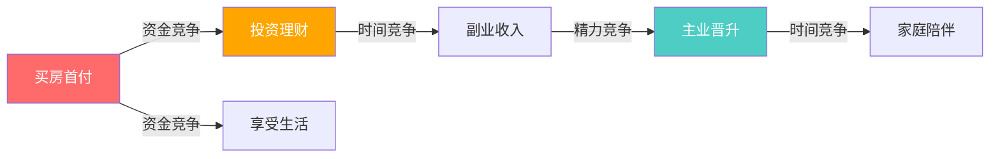
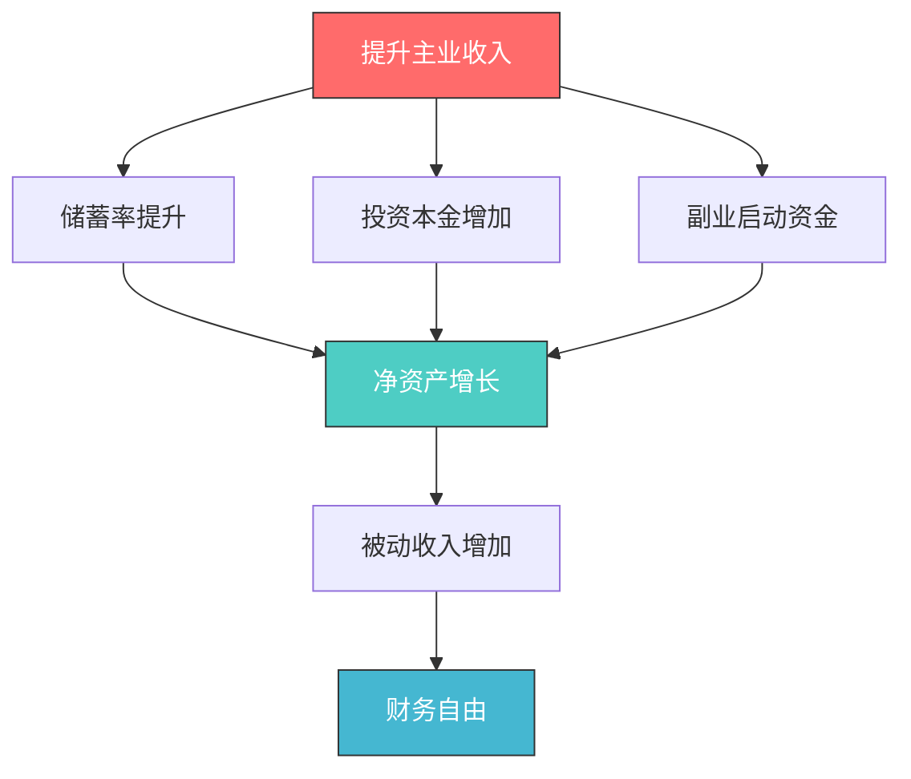

## 七、目标设定的科学方法

目标设定不是"许个愿"那么简单。神经科学研究表明，一个设计得当的目标会在大脑中形成"目标-注意力偏差"（goal-attention bias），让大脑自动过滤无关信息、聚焦于与目标相关的资源和机会。而一个设计粗糙的目标，不仅无法激活这种机制，反而会制造焦虑和自我怀疑。

本节将从心理学原理出发，系统介绍目标设定的科学方法论，帮助你建立一套可执行、可追踪、可迭代的财务目标体系。

---

### 7.1 目标设定的心理学基础

#### 7.1.1 洛克和莱瑟姆的目标设定理论

爱德温·洛克（Edwin Locke）和加里·莱瑟姆（Gary Latham）在1968年至2002年的三十余年研究中，提出了目标设定理论的五大核心发现：

| 发现 | 含义 | 财务应用 |
|------|------|---------|
| 具体目标比模糊目标更有效 | "存10万"比"多存点"提升绩效25% | 每个财务目标必须有精确数字 |
| 困难但可实现的目标表现最佳 | 目标完成率约70-80%为最优区间 | 年收入增长目标设为20-30%，而非500% |
| 目标承诺是关键前提 | 不认同的目标不会被执行 | 目标必须是自己真心想要的，而非别人的期待 |
| 反馈机制提升绩效 | 不知道进度就无法调整 | 建立周/月财务复盘机制 |
| 任务复杂度影响策略选择 | 复杂目标需要学习期 | 新手投资先学3个月，再设收益目标 |

**关键洞察**：洛克发现，目标的难度和绩效之间呈线性关系——目标越难，付出的努力越多。但这个关系在"承诺"缺失时会崩塌。也就是说，如果一个目标不是你真正想要的，设得再科学也没用。

#### 7.1.2 自我决定理论与目标动机

德西和瑞安（Deci & Ryan）的自我决定理论揭示了一个关键区分：**内在动机驱动的目标远比外在动机驱动的目标更持久**。

| 动机类型 | 目标示例 | 持久性 | 满足感 |
|---------|---------|--------|--------|
| 内在动机 | "我想掌握投资技能，因为我对市场运作机制感兴趣" | 高——即使遇到困难也会坚持 | 高——过程本身就是奖励 |
| 认同调节 | "我不太喜欢记账，但我知道这对财务健康很重要" | 中高——理解价值后会执行 | 中——完成后有成就感 |
| 外在动机 | "爸妈让我存钱"、"同事都在投资我也要跟" | 低——一旦外部压力消失就放弃 | 低——完成也没有满足感 |

**实操建议**：在设定财务目标时，花10分钟做"动机审计"——写下你每个目标背后的"为什么"。如果"为什么"里全是别人的期待（父母、社会、同龄人），这个目标的执行率会很低。你需要找到这个目标与自己价值观的连接点。

#### 7.1.3 目标冲突：为什么你总是"三心二意"

当多个目标之间存在冲突时，大脑会陷入决策疲劳，导致所有目标都执行不力。财务领域最常见的目标冲突：



**解决策略——目标分层法**：

1. **保底层**（必须完成）：应急基金、保险、最低储蓄
2. **核心层**（重点投入）：1-2个主要财务目标
3. **探索层**（有余力再做）：新投资渠道、副业尝试

原则：**同一时期，核心层目标不超过2个**。这不是偷懒，而是基于注意力和意志力都是有限资源的科学事实。

---

### 7.2 SMART原则的深度应用

SMART原则是目标设定的基础框架，但在财务规划中需要更精准的落地方式。多数人只知道SMART的五个字母，却不理解每个要素背后的"为什么"。

#### 7.2.1 逐要素拆解

| SMART要素 | 为什么重要 | 财务规划应用 | 反面示例 | 正面示例 |
|----------|-----------|-------------|----------|----------|
| Specific（具体） | 模糊目标无法激活大脑的目标导向注意力系统 | 明确金额、来源、方式 | "我要存钱" | "每月15号工资到账后，自动转账5000元到招商银行定期账户" |
| Measurable（可衡量） | 没有度量就没有管理，无法判断进度 | 设定可量化的指标 | "我要多赚钱" | "主业年收入提升到40万（当前32万，增幅25%）" |
| Achievable（可实现） | 过高目标导致习得性无助，反而降低动力 | 基于历史数据和现实条件 | "明年赚1000万"（月薪1万） | "明年收入增长20%，通过加薪谈判+副业实现" |
| Relevant（相关性） | 不相关的目标会分散资源和注意力 | 与人生大目标对齐 | "买一辆豪车"（目标是财务自由） | "投资资产达到100万，年被动收入4万" |
| Time-bound（有时限） | 没有截止日期的目标永远是"以后的事" | 设定明确的截止日期 | "以后有钱了再说" | "2026年12月31日前还清所有消费贷" |

#### 7.2.2 SMART的进阶用法：分层SMART

大多数人的SMART是单层的，只设一个终态目标。但更有效的方式是**分层SMART**——为同一个目标设定三个层级：

| 层级 | 定义 | 示例（年度储蓄目标） |
|------|------|-------------------|
| 基础线 | 最低可接受结果，低于此值视为失败 | 年存10万 |
| 目标线 | 正常努力可以达到的结果 | 年存15万 |
| 挑战线 | 需要超常发挥才能达到的结果 | 年存20万 |

**为什么分层比单层好**：

- **单层目标的风险**：如果目标设为15万，到了10月只存了10万，大脑会判定"反正完不成了"，直接放弃——这就是"目标崩溃效应"（goal collapse effect）
- **分层目标的保护**：同样的情况，你可以切换到基础线目标继续努力，心理上始终处于"还有机会"的状态

#### 7.2.3 SMART的常见误用

| 误用方式 | 问题 | 正确做法 |
|---------|------|---------|
| 所有维度都设极限值 | 每个SMART都是"最大值"，压力过大 | Achievable维度留20%缓冲 |
| 只设结果目标不设过程目标 | "赚50万"是结果，怎么赚是过程 | 同时设定"每周投入10小时在副业上" |
| SMART一次设定后不变 | 环境变化导致目标脱离现实 | 每季度复盘，允许调整 |
| 忽视Relevant维度 | 目标之间互相矛盾 | 用目标冲突矩阵检查一致性 |

---

### 7.3 OKR在个人财务中的应用

OKR（Objectives and Key Results）最初由英特尔的安迪·格鲁夫发明，后被谷歌发扬光大。它比SMART更强调**方向感**和**可衡量的关键结果**，特别适合需要多维度协调的财务规划。

#### 7.3.1 OKR与SMART的区别

| 维度 | SMART | OKR |
|------|-------|-----|
| 适用场景 | 单一目标 | 多目标协同 |
| 时间跨度 | 通常年度 | 季度为主，年度为辅 |
| 设定方式 | 自上而下 | 自上而下+自下而上 |
| 完成标准 | 100%完成 | 70%完成即为优秀（鼓励挑战） |
| 复盘频率 | 年度 | 季度，甚至月度 |

#### 7.3.2 个人财务OKR的完整写法

**年度Objective（目标）**：构建家庭财务安全体系，实现净资产增长50万

**Key Results（关键结果）**：

| 编号 | 关键结果 | 当前值 | 目标值 | 衡量方式 |
|------|---------|--------|--------|---------|
| KR1 | 主业年收入达到50万 | 35万 | 50万 | 工资单+年终奖 |
| KR2 | 副业年收入达到10万 | 0 | 10万 | 银行流水 |
| KR3 | 投资年化收益率达到8% | 3% | 8% | 投资组合回报率 |
| KR4 | 家庭储蓄率达到45% | 35% | 45% | 月度收支表 |
| KR5 | 全年非必要消费控制在10万以内 | 15万 | 10万 | 记账软件 |

#### 7.3.3 季度拆解示例

**Q1（1-3月）**：建立基础

| 任务 | 对应KR | 具体行动 | 验收标准 |
|------|--------|---------|---------|
| 完成跳槽/加薪谈判 | KR1 | 准备简历→投递→面试→谈薪 | 拿到offer或加薪批复 |
| 建立副业方向 | KR2 | 调研3个副业方向，选择1个启动 | 完成可行性分析报告 |
| 建立投资体系 | KR3 | 读完2本投资书，开设券商账户 | 完成第一笔投资 |
| 优化家庭预算 | KR4 | 记账1个月，识别可削减项 | 制定月度预算方案 |

**Q2（4-6月）**：加速执行

| 任务 | 对应KR | 具体行动 | 验收标准 |
|------|--------|---------|---------|
| 副业产生收入 | KR2 | 稳定产出，获取第一批客户 | 季度副业收入≥2.5万 |
| 投资组合再平衡 | KR3 | 根据市场情况调整配置比例 | 组合回撤控制在10%以内 |
| 储蓄率达标 | KR4 | 执行自动储蓄计划 | 月储蓄率≥45% |

**Q3（7-9月）**：中期复盘

| 任务 | 对应KR | 具体行动 | 验收标准 |
|------|--------|---------|---------|
| 年中复盘 | 全部 | 对比实际vs目标，识别差距 | 完成复盘报告 |
| 调整投资策略 | KR3 | 根据上半年表现优化策略 | 策略调整文档 |
| 副业规模化 | KR2 | 优化流程，提升效率 | 季度副业收入≥3万 |

**Q4（10-12月）**：冲刺收官

| 任务 | 对应KR | 具体行动 | 验收标准 |
|------|--------|---------|---------|
| 年度冲刺 | KR1/KR2 | 争取年终奖、完成副业大单 | 全年收入达标 |
| 年度总结 | 全部 | 全面复盘，制定下一年OKR | 完成年度报告+新OKR |

#### 7.3.4 OKR的"挑战性"原则

谷歌的OKR实践有一个重要原则：**如果所有OKR都100%完成，说明目标设得太保守了**。

| 完成率 | 评价 | 含义 |
|--------|------|------|
| 100% | 可能目标设低了 | 下次提高挑战度 |
| 70-80% | 优秀 | 目标难度恰到好处 |
| 50-60% | 及格 | 需要分析原因，是执行问题还是目标问题 |
| <40% | 需要反思 | 目标可能不现实，或执行力严重不足 |

但注意：这个原则适用于**挑战性目标**，不适用于**承诺性目标**（比如还贷款、交房租）。在财务规划中，你需要区分这两类目标。

---

### 7.4 逆向规划法：从终局倒推到当下

逆向规划法（Backward Planning）源自军事领域的"任务式指挥"（Mission Command），核心思想是：**先定义终局状态，再倒推每个阶段需要达到的里程碑，最后分解到当下的行动**。

#### 7.4.1 逆向规划的四步法

**第一步：明确终极目标**

用"未来日记"技术——假设你已经实现了目标，写一段200字的描述：

> "2046年，我50岁。我和家人住在自己喜欢的城市，没有任何债务。投资账户里有2000万，每年被动收入约80万（年化4%）。我可以选择工作，也可以不工作。孩子已经上了大学，教育基金充足。我和伴侣每年旅行4次，身体健康，有充足的时间做自己感兴趣的事。"

**第二步：倒推各阶段里程碑**

| 年龄 | 净资产目标 | 年储蓄目标 | 年投资收益目标 | 关键动作 |
|------|-----------|-----------|---------------|---------|
| 50岁 | 2000万 | — | — | 享受财务自由 |
| 45岁 | 1200万 | 100万 | 80万 | 优化投资组合，降低风险 |
| 40岁 | 650万 | 80万 | 40万 | 副业规模化，投资多元化 |
| 35岁 | 300万 | 50万 | 15万 | 主业进入管理层，启动副业 |
| 30岁 | 100万 | 30万 | 5万 | 建立投资体系，提升主业收入 |
| 当前 | 20万 | 20万 | 0 | 存钱、学习、建立财务意识 |

**第三步：将里程碑分解为年度目标**

以30岁为例的年度行动计划：

| 维度 | 目标 | 具体行动 | 时间节点 |
|------|------|---------|---------|
| 主业收入 | 35万 | 完成2个核心项目，为加薪谈判积累筹码 | Q1-Q2 |
| 副业收入 | 5万 | 利用周末做技术咨询，每月接2单 | 全年 |
| 投资 | 年化8% | 70%指数基金+20%债券+10%个股 | 持续 |
| 储蓄 | 30万 | 每月自动转账2.5万到投资账户 | 每月15号 |
| 技能 | 完成CFA一级 | 每天学习1小时 | 12月考试 |

**第四步：将年度目标分解为周计划**

```text
本周财务行动清单（示例）：
□ 周一：检查投资组合，记录本周市场动态
□ 周三：完成副业客户的方案交付
□ 周五：更新记账数据，检查本月预算执行情况
□ 周日：学习CFA课程2小时
□ 本月15号：自动转账储蓄
```

#### 7.4.2 逆向规划的数学验证

逆向规划不是拍脑袋，需要数学验证。以下是复利倒推的计算公式：

$$FV = PV \times (1+r)^n + PMT \times \frac{(1+r)^n - 1}{r}$$

其中：
- FV = 终值（目标净资产）
- PV = 现值（当前净资产）
- r = 年投资收益率
- n = 年数
- PMT = 年储蓄额

**验证示例**：假设当前净资产20万，年储蓄30万，年投资收益率8%，20年后：

$$FV = 20万 \times 1.08^{20} + 30万 \times \frac{1.08^{20} - 1}{0.08} \approx 93万 + 1,373万 = 1,466万$$

如果要达到2000万，需要提升储蓄额或收益率。调整为年储蓄40万：

$$FV = 20万 \times 1.08^{20} + 40万 \times \frac{1.08^{20} - 1}{0.08} \approx 93万 + 1,831万 = 1,924万$$

基本接近目标。这意味着30岁时年储蓄30万不够，需要提升到40万左右。

#### 7.4.3 逆向规划的常见陷阱

| 陷阱 | 表现 | 纠正方式 |
|------|------|---------|
| 忽略通胀 | 用今天的金额设20年后的目标 | 所有金额用实际购买力（扣除通胀）计算 |
| 假设线性增长 | 认为收入每年稳定增长 | 引入波动因子，设高低两个场景 |
| 忽略重大支出 | 没有计入买房、结婚、生子等大额支出 | 在里程碑中标注重大支出节点 |
| 收益率假设过高 | 默认年化15%以上 | 保守场景用6%，乐观场景用10% |

---

### 7.5 现代目标设定框架

#### 7.5.1 WOOP：比"积极想象"更有效的方法

WOOP是由纽约大学心理学家加布里埃尔·厄廷根（Gabriele Oettingen）在20年研究基础上开发的目标设定框架，全称是Wish（愿望）、Outcome（结果）、Obstacle（障碍）、Plan（计划）。

与传统"积极想象"不同，WOOP强调**预先识别障碍并制定应对计划**，这被称为"心理对比"（Mental Contrasting）。

| 步骤 | 内容 | 财务目标示例 |
|------|------|------------|
| Wish（愿望） | 你最想实现的财务愿望 | "我希望在3年内存够50万" |
| Outcome（结果） | 实现后最好的结果是什么 | "我可以用这笔钱作为首付，拥有自己的房子，不再交房租" |
| Obstacle（障碍） | 内在障碍是什么（不是外在的） | "我容易冲动消费，看到打折就忍不住买" |
| Plan（计划） | 如果障碍出现，我怎么办 | "如果我想冲动消费，我先等待24小时，并把这笔钱转到储蓄账户" |

**WOOP的计划格式**：使用"如果-那么"（If-Then）执行意图

```text
如果 [情境/冲动出现]，那么 [替代行为]。

示例：
- 如果我想在网上买非必需品，那么我先把它加入购物车，等24小时后再决定。
- 如果我本月储蓄率低于40%，那么下个月减少外出就餐次数。
- 如果我的投资亏损超过10%，那么我检查投资逻辑是否仍然成立，而不是恐慌卖出。
```

**科学证据**：厄廷根的多项研究表明，使用WOOP的人在目标达成率上比单纯使用积极想象的人高出20-30%。原因在于：积极想象会让大脑误以为目标已经实现，从而减少动力；而WOOP通过心理对比，让大脑同时感受到"渴望"和"现实差距"，从而产生更强的行动力。

#### 7.5.2 实施意图：让行动自动化

彼得·戈尔维策（Peter Gollwitzer）提出的"实施意图"（Implementation Intention）是WOOP中"Plan"步骤的扩展。核心思想是：**提前在大脑中编排好"何时、何地、如何"行动的程序，让执行变成自动反应**。

**三要素格式**：

```text
当 [时间/情境] 时，我将在 [地点] 做 [具体行为]。

财务应用示例：
1. 每月15号（工资到账日），我将在手机银行App上自动转账8000元到投资账户。
2. 每周日晚上8点，我将在书桌前花30分钟更新记账数据。
3. 每次收到年终奖/项目奖金时，我将在当天将50%转入定期存款。
4. 每季度最后一个月的第一个周末，我将在书房花2小时做投资组合复盘。
```

**为什么实施意图有效**：戈尔维策的元分析（覆盖94项研究）表明，使用实施意图的人，目标完成率平均提升0.65个标准差。原理是：具体的"情境-行为"链接会在大脑中形成"自动触发"机制，减少了对意志力的依赖。

#### 7.5.3 目标梯度效应

克拉克·赫尔（Clark Hull）的目标梯度效应（Goal Gradient Effect）发现：**越接近目标，动力越强**。

这个效应有两个重要应用：

1. **设置"进度可视化"**：用图表或进度条显示当前完成百分比。当进度达到60-70%时，人会自然加速。例如，制作一个"净资产增长曲线"，每月更新。

2. **拆分大目标为小里程碑**：大目标（如2000万）太远，感受不到进度。拆分为10个100万的里程碑，每达成一个就打勾，让大脑频繁获得"接近目标"的快感。

---

### 7.6 目标追踪与复盘系统

设定目标只是起点，持续追踪和定期复盘才是决定成败的关键。

#### 7.6.1 建立财务仪表盘

**核心指标（每周检查）**：

| 指标 | 计算方式 | 健康范围 | 预警线 |
|------|---------|---------|--------|
| 月储蓄率 | 月储蓄额/月收入 | ≥40% | <25% |
| 投资组合回报率 | 年化收益/投入本金 | 6-12% | <0% |
| 被动收入占比 | 被动收入/总收入 | 目标逐步提升至30%+ | 停滞不前 |
| 负债率 | 月还款额/月收入 | ≤30% | >50% |
| 应急基金覆盖率 | 应急基金/月支出 | ≥6个月 | <3个月 |

**进阶指标（每月检查）**：

| 指标 | 计算方式 | 意义 |
|------|---------|------|
| 净资产增长率 | 本月净资产增长/上月净资产 | 衡量财富积累速度 |
| 投资夏普比率 | (收益率-无风险利率)/波动率 | 衡量投资风险调整后的回报 |
| 收入多元化指数 | 最大收入来源/总收入 | 比例越低越好，说明收入来源分散 |
| 消费通胀率 | 本月非必要支出增长率 | 控制生活方式通胀 |

#### 7.6.2 周复盘模板

```text
═══════════════════════════════════════
     第 __ 周 财务复盘（日期：____）
═══════════════════════════════════════

一、关键数据
  - 本周收入：______元
  - 本周支出：______元
  - 本周储蓄：______元（储蓄率：____%）
  - 投资组合市值：______元（变动：____%）

二、目标进度
  - 年度储蓄目标：已完成 ____/____万（___%）
  - 副业收入目标：已完成 ____/____万（___%）
  - 投资收益目标：已完成 ____/____万（___%）

三、本周亮点
  1. _______________
  2. _______________

四、本周问题
  1. 问题：__________ | 原因：__________ | 下周改进：__________
  2. 问题：__________ | 原因：__________ | 下周改进：__________

五、下周行动
  1. _______________
  2. _______________
  3. _______________
```

#### 7.6.3 季度复盘模板

```text
═══════════════════════════════════════
     Q__ 季度财务复盘（日期：____）
═══════════════════════════════════════

一、KR达成情况
  KR1（主业收入）：目标____万，实际____万，完成率___% → ⬜达成/⬜未达成
  KR2（副业收入）：目标____万，实际____万，完成率___% → ⬜达成/⬜未达成
  KR3（投资收益）：目标___%，实际___%，完成率___% → ⬜达成/⬜未达成
  KR4（储蓄率）：目标___%，实际___%，完成率___% → ⬜达成/⬜未达成
  KR5（消费控制）：目标____万，实际____万 → ⬜达成/⬜未达成

二、季度总结（3句话）
  1. 做得最好的：_________________
  2. 最大教训：_________________
  3. 下季度重点：_________________

三、下季度OKR调整
  - 保持不变的KR：_________________
  - 需要调整的KR：_________________（调整为：__________）
  - 新增的KR：_________________
```

#### 7.6.4 问责机制

研究表明，将目标公开告诉他人或建立问责机制，可以将目标完成率提升33%（美国多米尼克大学研究）。

**可选的问责方式**：

| 方式 | 优点 | 缺点 | 适合人群 |
|------|------|------|---------|
| 记账App自动追踪 | 低门槛，数据精确 | 缺乏主观判断 | 所有人 |
| 财务伴侣/搭档 | 互相监督，情感支持 | 需要找到合适的人 | 有伴侣或密友的人 |
| 定期向自己报告 | 灵活，无社交压力 | 缺乏外部约束 | 独立性强的人 |
| 财务教练/顾问 | 专业指导，客观视角 | 费用较高 | 收入较高的人 |
| 社群打卡 | 群体压力，经验分享 | 信息泄露风险 | 社交活跃的人 |

---

### 7.7 目标设定中的常见误区

#### 7.7.1 误区一：把"愿望"当"目标"

| 愿望（无效） | 目标（有效） |
|-------------|------------|
| "我想财务自由" | "我要在45岁时拥有1000万可投资资产，年被动收入≥40万" |
| "我想多赚点钱" | "我要在12个月内将月收入从1.5万提升到2万" |
| "我想学会投资" | "我要在6个月内完成CFA一级，并用10万实盘跑出正收益" |

**检验标准**：如果你的目标不能用数字衡量、不能在日历上标出截止日期，它就只是一个愿望。

#### 7.7.2 误区二：目标过多导致精力分散

**典型症状**：年初列了15个财务目标，到3月已经记不清有哪些了。

**科学建议**：

| 目标数量 | 执行效果 | 原因 |
|---------|---------|------|
| 1-2个 | 最佳 | 注意力集中，执行到位 |
| 3-5个 | 尚可 | 需要良好的时间管理 |
| 5-10个 | 较差 | 注意力分散，多数目标半途而废 |
| 10个以上 | 极差 | 基本无法执行，产生焦虑 |

**解决方案**：使用"目标金字塔"——1个终极目标、3个年度目标、12个月度里程碑、52个周行动。

#### 7.7.3 误区三：只设结果目标，不设过程目标

| 结果目标 | 过程目标 | 为什么需要过程目标 |
|---------|---------|------------------|
| 年存20万 | 每月15号自动转账1.7万 | 过程可执行，结果不可直接执行 |
| 年投资收益8% | 每周花2小时研究投资组合 | 收益不可控，学习时间可控 |
| 副业年入10万 | 每天投入1小时在副业上 | 收入取决于市场，投入取决于自己 |

**原则**：**结果目标用于衡量，过程目标用于执行**。你需要两者兼备。

#### 7.7.4 误区四：忽视目标的"保质期"

目标不是石头刻的。每季度至少审视一次：

| 审视问题 | 如果答案是"否" | 行动 |
|---------|---------------|------|
| 这个目标还是我真正想要的吗？ | 优先级变了 | 替换为新目标 |
| 这个目标的难度还合适吗？ | 太容易或太难 | 调整数值 |
| 实现路径还有效吗？ | 市场/行业变了 | 调整策略 |
| 我还有足够的资源（时间/精力/资金）吗？ | 资源不足 | 降低目标或砍掉其他目标 |

#### 7.7.5 误区五：用"忙碌感"代替"进度感"

有些人每天很忙——记账、看投资、研究副业——但净资产没有增长。这是因为**活动不等于进展**。

**自检方法**：每周问自己——"这周我做的事情，有没有让我的净资产增加了哪怕1元？"如果没有，说明你在用忙碌逃避真正的难题。

---

### 7.8 不同人生阶段的目标设定策略

目标设定方法不是一成不变的，不同人生阶段需要不同的策略重心。

#### 7.8.1 22-30岁：探索期——重过程轻结果

| 维度 | 策略 | 原因 |
|------|------|------|
| 主业 | 设"能力增长"目标，不设"收入"目标 | 起步期，能力比收入重要 |
| 储蓄 | 设"储蓄率"目标（如30%），不设"金额"目标 | 收入低，金额目标容易打击信心 |
| 投资 | 设"学习时间"目标，不设"收益"目标 | 先学再投，避免交学费 |
| 副业 | 设"探索"目标，不设"收入"目标 | 还不知道什么适合自己 |

#### 7.8.2 30-40岁：积累期——重结果重增长

| 维度 | 策略 | 原因 |
|------|------|------|
| 主业 | 设"收入增长"目标（如年增20%） | 职业上升期，收入增长空间大 |
| 储蓄 | 设"金额"目标（如年存30万） | 收入足够，需要具体数字驱动 |
| 投资 | 设"收益率"目标（如年化8%） | 有了经验和本金，追求回报 |
| 副业 | 设"收入"目标（如年入10万） | 已找到方向，需要规模化 |

#### 7.8.3 40-50岁：加速期——重效率重平衡

| 维度 | 策略 | 原因 |
|------|------|------|
| 主业 | 设"价值输出"目标而非"加班时间"目标 | 需要从体力输出转向智慧输出 |
| 投资 | 设"风险调整后收益"目标（如夏普比率>1） | 资本金大了，风险控制比收益更重要 |
| 家庭 | 设"教育基金"和"养老基金"目标 | 家庭责任高峰期 |
| 健康 | 设"健康投资"目标 | 身体是搞钱的基础 |

#### 7.8.4 50岁以上：收获期——重安全重传承

| 维度 | 策略 | 原因 |
|------|------|------|
| 投资 | 设"波动率上限"目标（如年波动<10%） | 资本保全比增值更重要 |
| 收入 | 设"被动收入覆盖生活支出"目标 | 逐步从主动收入转向被动收入 |
| 遗产 | 设"财富传承"目标 | 税务规划、保险配置、信托设立 |
| 生活 | 设"生活满意度"目标 | 财务最终服务于生活品质 |

---

### 7.9 进阶：目标设定的系统思维

#### 7.9.1 从"线性目标"到"系统目标"

传统的线性目标思维是：**A→B→C→目标**。但现实世界是非线性的——收入可能突然暴涨（抓住机会），也可能突然暴跌（行业裁员）。

**系统目标**的核心思想是：不追求单一路径，而是构建一个**持续产生好结果的系统**。

| 线性目标 | 系统目标 |
|---------|---------|
| "今年赚50万" | "构建一个能持续增长收入的能力体系" |
| "3年存够100万" | "建立自动储蓄+投资的系统，让存钱变成默认行为" |
| "找到一个好的投资标的" | "建立一套投资决策框架，能持续发现好的标的" |

**系统目标的优势**：即使某个具体目标失败了，系统仍然在运转，你仍然在进步。

#### 7.9.2 杠杆目标：找到投入产出比最高的目标

不是所有目标的"性价比"都一样。有些目标是杠杆目标——达成它之后，其他目标会自动变得更简单。

**财务领域的杠杆目标示例**：



**识别杠杆目标的方法**：问自己——"如果这个目标达成了，还有哪些目标会自动变得更简单？"选择那个能带动最多其他目标的目标，优先投入。

#### 7.9.3 反脆弱目标：在不确定性中获益

纳西姆·塔勒布提出的"反脆弱"概念也适用于目标设定。**反脆弱目标**是指：即使失败了，你也不会损失太多；但如果成功了，收益会非常大。

| 目标类型 | 示例 | 失败成本 | 成功收益 | 反脆弱性 |
|---------|------|---------|---------|---------|
| 脆弱目标 | 借钱All in一只股票 | 可能倾家荡产 | 可能翻倍 | 极低 |
| 坚韧目标 | 定期定额买指数基金 | 市场下跌时会亏 | 长期年化7-10% | 中等 |
| 反脆弱目标 | 花10%收入学新技能+小规模试错 | 损失有限的学费和时间 | 可能开辟新的收入来源 | 高 |

**实操原则**：在你的目标组合中，确保至少50%是"反脆弱"或"坚韧"目标，"脆弱"目标不超过10%。

---

### 7.10 本节要点总结

| 核心要点 | 关键行动 |
|---------|---------|
| 目标设定有科学理论支撑 | 理解洛克目标设定理论和自我决定理论 |
| SMART是基础但不够 | 使用分层SMART（基础线/目标线/挑战线） |
| OKR适合多目标协同 | 按季度拆解，70%完成即为优秀 |
| 逆向规划从终局倒推 | 先写"未来日记"，再倒推里程碑，最后用数学验证 |
| WOOP比积极想象更有效 | 识别内在障碍，用"如果-那么"制定应对计划 |
| 实施意图让行动自动化 | "当X时，我将做Y"格式，减少对意志力的依赖 |
| 追踪和复盘是关键 | 建立财务仪表盘，每周/月/季度复盘 |
| 目标数量要克制 | 同时期核心目标不超过2个 |
| 过程目标和结果目标缺一不可 | 结果用于衡量，过程用于执行 |
| 用系统目标替代线性目标 | 构建持续产生好结果的系统，而非追求单一路径 |
| 寻找杠杆目标 | 找到能带动其他目标的目标，优先投入 |
| 保持目标的反脆弱性 | 失败成本有限，成功收益无限 |

记住：**设定目标的目的不是给自己压力，而是给自己的注意力和行动力一个聚焦点**。一个好的目标应该让你感到"有点挑战但可以做到"，而不是"压得喘不过气"或"随便就能做到"。找到那个"甜蜜点"，然后行动起来。
