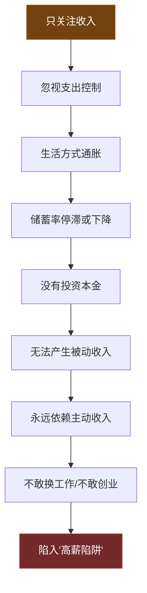
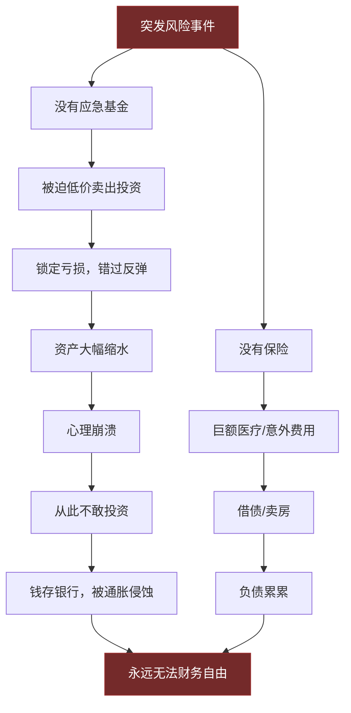
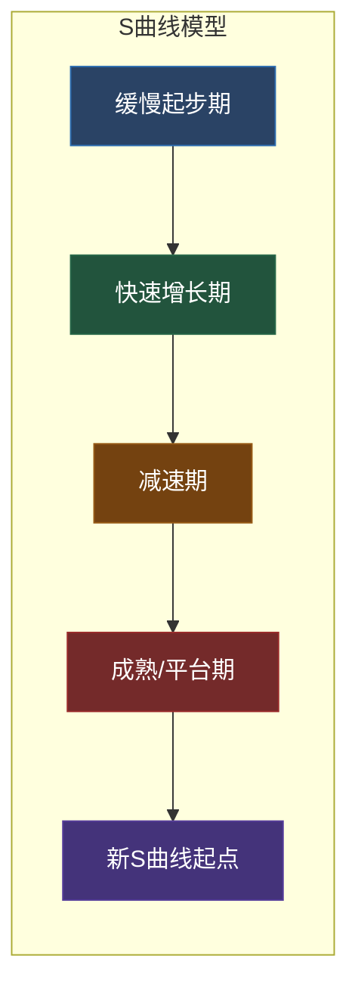
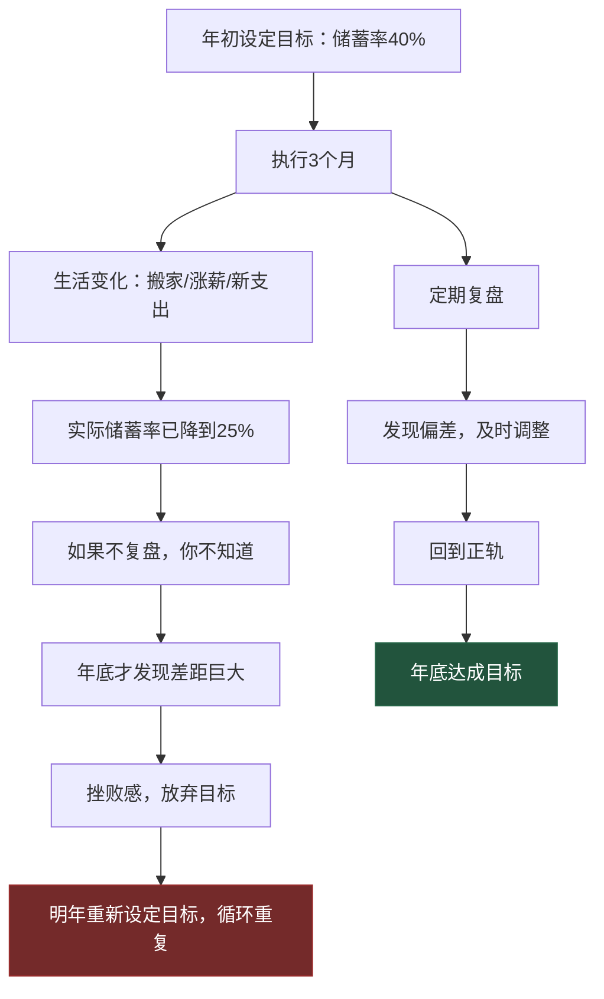
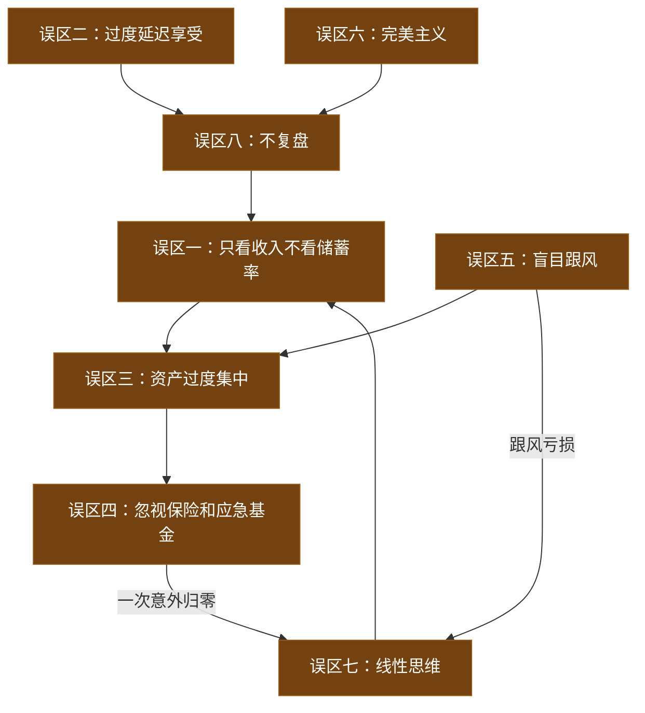
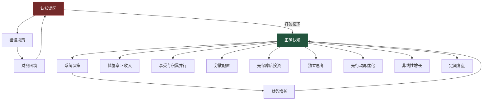

## 八、常见人生规划误区

人生规划是搞钱的"总控台"——方向错了，跑得越快离目标越远。很多人不是不努力，而是在错误的规划框架里拼命努力，最终陷入"越忙越穷、越穷越忙"的死循环。

本节梳理人生规划中最常见的8个认知陷阱，每个陷阱从「表现→底层逻辑→危害→纠正方法」四个维度展开。这些误区不是孤立的，它们往往相互强化，形成一张困住你的认知之网。

> 💡 **阅读建议**：不要只看自己"没犯的错"——往往最该警惕的误区，恰恰是你认为"跟自己无关"的那个。

---

### 误区一：只关注收入，忽视储蓄率

#### 误区表现

"等我月薪5万就能存下钱了。"
"收入翻倍，存款自然翻倍。"
"我赚得少，存不了多少，等赚多了再说。"

#### 底层逻辑：收入与储蓄之间没有必然因果关系

这是一个典型的**线性思维陷阱**——假设收入和储蓄之间是正比关系。但现实中，收入增长的同时，支出往往以同等甚至更快的速度增长，这就是经济学中的**生活方式通胀**（Lifestyle Inflation）。

生活方式通胀的心理机制很简单：每当你获得一次收入提升，你的大脑就会重新定义"正常生活水平"。心理学称之为**享乐适应**（Hedonic Adaptation）——无论收入多高，人们总会在短时间内适应新的消费水平，然后觉得"也就那样"。

#### 数据实证

用两个具体场景说明储蓄率比收入更关键：

| 人物 | 年收入 | 年支出 | 储蓄率 | 年储蓄 | 10年累计（含8%复利） |
|------|--------|--------|--------|--------|-------------------|
| 小张 | 30万 | 15万 | 50% | 15万 | ~232万 |
| 小李 | 50万 | 40万 | 20% | 10万 | ~155万 |
| 差距 | 小李多赚20万 | 小李多花25万 | 小张高30% | 小张多存5万 | **小张多77万** |

小李年收入比小张多20万，但10年后反而少了77万。这不是特例，而是数学必然。

#### 储蓄率与财务自由年限的关系

下表展示了不同储蓄率下实现财务自由所需的时间（假设年化投资回报8%，从零开始）：

| 储蓄率 | 达到财务自由所需年限 | 换算理解 |
|--------|-------------------|---------|
| 10% | 约51年 | 工作一辈子 |
| 20% | 约37年 | 从22岁到59岁 |
| 30% | 约28年 | 从22岁到50岁 |
| 40% | 约22年 | 从22岁到44岁 |
| 50% | 约17年 | 从22岁到39岁 |
| 60% | 约12.5年 | 从22岁到34.5岁 |
| 70% | 约8.5年 | 从22岁到30.5岁 |
| 80% | 约5.5年 | 从22岁到27.5岁 |

储蓄率从20%提升到40%，财务自由年限缩短15年；但从40%提升到60%，再缩短9.5年。边际效果递减但绝对效果惊人。

#### 危害链条



#### 纠正方法

**第一步：从今天开始追踪储蓄率**

```text
储蓄率 = (税后收入 - 总支出) / 税后收入 × 100%
```

不需要精确到分，关键是建立意识。推荐用手机备忘录记录每笔超过100元的支出，月底花15分钟汇总。

**第二步：设定储蓄率目标，而非金额目标**

- 月薪5000时，目标是"储蓄率20%"（存1000），而不是"存5000"
- 月薪2万时，目标是"储蓄率40%"（存8000），而不是"存1万"
- 储蓄率目标随收入增长自动提高绝对金额，且避免了"收入高了就放松"的问题

**第三步：先储蓄后消费（Pay Yourself First）**

工资到账当天，自动转出目标储蓄金额到一个不易取出的账户。剩下的才是可支配收入。这个顺序至关重要——如果先消费后储蓄，你永远存不下钱，因为消费会自动膨胀到填满所有可用资金。

**第四步：利用"50/50规则"对抗生活方式通胀**

每次涨薪，增量的50%自动转入储蓄/投资，50%用于改善生活。涨薪5000？2500进投资账户，2500用来改善生活。这样你既享受了收入增长的成果，又确保储蓄率持续提升。

---

### 误区二：过度延迟享受——把人生过成苦行

#### 误区表现

"等我财务自由了再享受生活。"
"现在每一分钱都要存起来，旅游、美食都是浪费。"
"花钱就是罪恶，存钱才是美德。"
"社交太花钱了，还是一个人待着省钱。"

#### 底层逻辑：混淆了"延迟满足"和"消灭满足"

延迟满足（Delayed Gratification）是搞钱的核心能力之一——但它指的是**为了更大的长期回报而暂时推迟即时满足**，而不是**永久性地消灭所有享受**。

斯坦福棉花糖实验的后续研究发现了一个被忽略的细节：那些成功延迟满足的孩子，并不是靠"忍耐"做到的，而是靠**转移注意力**——他们找到了其他方式来满足当下的情感需求。这意味着：健康的延迟满足，需要在当下保留替代性的满足来源，而非彻底压制所有需求。

#### 过度节省的三重隐性成本

| 隐性成本 | 具体表现 | 真实损失 |
|---------|---------|---------|
| **社交萎缩** | 不敢参加聚会、拒绝人情往来、回避社交场合 | 人脉变窄→信息闭塞→错过机会。人脉是最有价值的"复利资产"，断了很难重建 |
| **能力停滞** | 不舍得花钱学习、不买书、不参加培训、不投资健康 | 技能不增长→收入天花板低→存再多也赶不上通胀 |
| **健康透支** | 熬夜加班省加班费、吃最便宜的食物、不运动不体检 | 省下的钱最终花在医院，而且可能还不够。中国每年60万人过劳死 |
| **心理枯竭** | 长期压抑消费欲望、产生"花钱罪恶感" | 决策疲劳→报复性消费→储蓄计划崩盘。研究表明，过度节俭的人更容易在某个临界点突然失控消费 |

#### 一个真实案例的警示

小王，28岁，互联网程序员，月薪2.5万。为了尽早实现FIRE（财务独立、提前退休），他把储蓄率压到了80%——每月只花5000元。他的生活方式是：住城中村单间（800元/月）、吃最便宜的外卖（15元/餐）、不社交、不旅游、不买新衣服。

结果：
- 两年后，他的朋友圈子从20人缩小到3人，行业信息严重滞后
- 三年后，因为从不参加技术社区活动，错过了两个重要的内推机会
- 四年后，身体出了问题——长期吃便宜外卖导致胃病，治疗花了3万多
- 第五年，他在某个深夜报复性消费了8万元买了根本不需要的电子产品

这不是个例。过度节省的人往往在3-5年内迎来一次"崩溃式消费"，之前省下来的钱在一次冲动中消耗大半。

#### 纠正方法

**第一步：定义你的"快乐预算"**

每月拿出收入的5%-10%作为"快乐预算"——这笔钱花在任何让你真正开心的事情上，不需要有"回报"，不需要"值得"。这不是浪费，这是心理健康的必要投资。

**第二步：区分"投资型消费"和"消耗型消费"**

| 类型 | 定义 | 示例 | 应对策略 |
|------|------|------|---------|
| 投资型消费 | 能带来长期回报的支出 | 买书、培训、健身、优质社交 | 大胆花，这是在投资自己 |
| 消耗型消费 | 带来短暂快感但无长期价值 | 冲动购物、炫耀性消费、无效社交 | 严格控制 |
| 生存型消费 | 维持基本生活的必需支出 | 住房、饮食、交通 | 优化但不削减 |

**第三步：建立"不可削减清单"**

在追求储蓄率的同时，明确列出绝对不能削减的支出：
- 每周至少一次与朋友的深度交流（哪怕只是一顿饭）
- 每月至少一本好书或一个学习课程
- 每年至少一次真正的旅行（不带电脑）
- 每天至少7小时睡眠
- 每周至少3次运动

**第四步：找到储蓄率的"甜蜜点"**

对于大多数人，储蓄率40%-50%是比较健康的区间——既能快速积累财富，又不至于过度委屈自己。如果储蓄率超过60%且持续一年以上感到痛苦，说明你压得太狠了，需要适当放松。

---

### 误区三：把鸡蛋放在一个篮子里——资产过度集中

#### 误区表现

"买房就是最好的投资，我把所有钱都投在房子上。"
"股票收益高，我全仓梭哈。"
"银行存款最安全，我全部存定期。"
"我只相信黄金/比特币/某个资产。"

#### 底层逻辑：集中投资本质上是对冲了"不确定"但保留了"不安全"

人类天生厌恶不确定性，所以倾向于找到一个"确定的答案"然后 all in。但金融学的基本原理告诉我们：**没有任何单一资产在所有市场环境下都表现良好**。集中投资的本质是把"我不确定哪种最好"的焦虑，转化为"我就赌这一种"的虚假安全感。

#### 三种典型集中投资的风险分析

**全仓房产**

| 优势 | 风险 |
|------|------|
| 中国人对房产有天然信任感 | 流动性极差——急需用钱时可能半年卖不掉 |
| 过去20年房价上涨带来了路径依赖 | 政策风险大——限购、限贷、房产税随时可能出台 |
| 杠杆放大收益 | 杠杆同样放大损失——房价下跌20%，你的首付可能亏光 |
| 租金收入相对稳定 | 租售比极低——一线城市租金回报率仅1.5%-2%，不如银行存款 |

**全仓股票**

| 优势 | 风险 |
|------|------|
| 长期回报率高（年化8%-12%） | 短期波动剧烈——一年内跌30%-50%很常见 |
| 流动性好 | 心理承受力要求极高——大多数人扛不住50%回撤 |
| 门槛低 | 个股选择需要专业能力——散户长期跑赢指数的比例不到20% |

**全仓银行存款**

| 优势 | 风险 |
|------|------|
| 安全、确定 | 实际购买力持续下降——通胀3%，存款利率1.5%，每年净亏1.5% |
| 心理舒适 | 30年后100万的实际购买力可能只相当于今天的40万 |
| 随时可用 | 错过复利增长的黄金窗口期 |

#### 科学的资产配置框架

下表给出不同年龄段的参考配置比例（具体比例需根据个人风险承受能力调整）：

| 年龄段 | 权益类（股票/基金） | 固收类（债券/存款） | 另类（房产/黄金等） | 现金/应急 |
|--------|-------------------|-------------------|-------------------|----------|
| 22-30岁 | 50-60% | 20-25% | 10-15% | 5-10% |
| 30-40岁 | 40-50% | 25-30% | 15-20% | 5-10% |
| 40-50岁 | 30-40% | 30-35% | 20-25% | 5-10% |
| 50岁以上 | 20-30% | 35-40% | 20-25% | 10-15% |

> 💡 **核心原则**：年轻时可以承受更多波动（因为时间长，可以等待市场恢复），年长时需要更多稳定性（因为没有时间等待市场恢复）。

#### 纠正方法

**第一步：做一次资产集中度检查**

列出你所有资产及其占比。如果任何单一资产类别占比超过60%，就需要警惕。

**第二步：建立"核心-卫星"配置**

- **核心资产（70%-80%）**：低成本指数基金、优质债券——这部分追求稳健长期回报
- **卫星资产（20%-30%）**：个股、行业基金、另类投资——这部分追求超额收益，但亏损不影响生活

**第三步：定期再平衡**

每半年或一年，检查各资产类别的比例是否偏离目标。如果股票涨太多导致占比过高，卖出一部分买入债券；反之亦然。这不是"择时"，而是纪律性的"卖高买低"。

---

### 误区四：忽视保险和应急基金——裸奔式搞钱

#### 误区表现

"买保险是浪费钱，我身体好得很。"
"应急基金放着不投资太亏了，不如全部买基金。"
"我有社保就够了，不需要商业保险。"
"等我有钱了再买保险。"

#### 底层逻辑：风险管理是搞钱的"地基"，而不是"锦上添花"

搞钱的目的是让生活越来越好，但如果连基本的风险屏障都没有，一次意外就能让所有积累归零。这就像盖房子——你可以选择不打地基直接盖，前期确实更快，但一场地震就全塌了。

保险和应急基金的核心功能是**保护你的投资组合不被迫提前变现**。市场有周期，如果你在市场低点因为急需用钱而被迫卖出投资，你就把"浮亏"变成了"真亏"——这是搞钱路上最惨烈的损失。

#### 没有风险屏障的连锁崩溃



#### 应急基金的科学构建

**第一步：确定应急金额度**

```text
应急金额 = 月必要支出 × 覆盖月数
```

| 人群特征 | 建议覆盖月数 | 理由 |
|---------|------------|------|
| 双薪家庭，收入稳定 | 3个月 | 失业后有缓冲时间找新工作 |
| 单一收入来源 | 6个月 | 失业后完全没有收入 |
| 自由职业/创业初期 | 9-12个月 | 收入波动大，需要更长缓冲 |
| 有慢性病/高龄家庭成员 | 6-12个月 | 医疗支出不可预测 |

**第二步：应急基金的存放方式**

不要把应急基金放在股票、基金等有波动的资产中。推荐方案：

| 存放方式 | 特点 | 适合场景 |
|---------|------|---------|
| 货币基金（如余额宝） | 随取随用，收益1.5%-2% | 日常应急（第1-2个月） |
| 银行活期/通知存款 | 即时可用，收益低 | 紧急备用（第1个月） |
| 短债基金 | 收益2%-3%，T+1到账 | 中期储备（第3-6个月） |

#### 保障型保险的配置优先级

保险的配置顺序非常重要——先保障后理财，先大人后小孩：

| 优先级 | 险种 | 作用 | 参考保费（30岁） | 关键要点 |
|--------|------|------|----------------|---------|
| 1 | 医保 | 基础医疗保障 | 已包含在社保中 | 必须有，但保障有限 |
| 2 | 百万医疗险 | 大病住院报销 | 300-800元/年 | 免赔额1万，报销上限数百万 |
| 3 | 意外险 | 意外伤残/身故 | 100-300元/年 | 杠杆率最高，优先配置 |
| 4 | 重疾险 | 确诊重疾直接赔钱 | 3000-8000元/年 | 弥补收入损失，保额=年收入×3-5 |
| 5 | 定期寿险 | 身故赔偿 | 1000-3000元/年 | 有房贷/有家庭责任的人必备 |

> ⚠️ **绝对不要买的保险**：返还型保险（保费贵3-5倍，收益还不如银行存款）、万能险（保障不够、理财不行）、分红险（分红不确定、保障不足）。买保险就是买保障，不要指望保险"赚钱"。

#### 纠正方法

**第一步：本周就建立应急基金**

即使每月只能存500元，也要开始。把应急基金设为最高优先级——在投资之前、在消费升级之前。

**第二步：本月完成基础保险配置**

百万医疗险+意外险，一年总保费不超过1000元，却能覆盖最致命的风险。在支付宝、慧择等平台可以直接购买。

**第三步：每年做一次保险审计**

检查保障是否足够、是否需要调整保额、是否有重复购买的保险。

---

### 误区五：盲目跟风——用别人的脑袋做自己的决策

#### 误区表现

"听说某某炒股赚了100万，我也要开户。"
"同事都在买基金，我也买点。"
"这个理财产品是朋友推荐的，应该没问题。"
"最近比特币涨疯了，我要不要入场？"

#### 底层逻辑：跟风决策的三个致命假设

盲目跟风的底层逻辑建立在三个隐含假设上，而每一个都是错的：

1. **假设别人的信息和你一样** —— 事实上，推荐你买的人可能已经提前布局，等你入场时他们正好出场
2. **假设别人的承受力和你一样** —— 他能承受50%的回撤，你可能亏20%就睡不着觉
3. **假设别人的目标和你一样** —— 他可能是在用闲钱投机，你可能是在用买房钱投资

#### 跟风投资的数学真相

金融市场是一个**零和博弈**（扣除交易成本后是**负和博弈**）。每一次交易都有买方和卖方，如果所有人都"跟风买入"，那谁在卖？

真相是：**你看到的"别人赚钱"的信息，本身就是交易的一部分**。

- 当你从新闻/社交媒体上看到"某某股票暴涨"时，信息已经被市场消化了
- 当你从朋友口中听到"某某投资很赚钱"时，他可能已经赚完了，正在找接盘侠（无论是否有意）
- 当你从"理财专家"那里得到"买入推荐"时，他可能已经提前买入，等你入场后卖出

#### 历史数据的警示

| 时间 | 跟风对象 | 入场时机 | 后续表现 | 典型损失 |
|------|---------|---------|---------|---------|
| 2007年 | A股牛市 | 6000点入场 | 跌至1664点 | 亏损70%+ |
| 2015年 | 杠杆牛市 | 5000点入场 | 跌至2850点 | 亏损40%+ |
| 2017年 | 比特币 | 2万美元入场 | 跌至3000美元 | 亏损85% |
| 2021年 | 白酒/新能源基金 | 高位买入 | 回撤50%+ | 亏损50%+ |
| 2021年 | 比特币 | 6万美元入场 | 跌至1.6万美元 | 亏损73% |

这些数据不是为了恐吓，而是为了说明：**当你从公开渠道得知一个"赚钱机会"时，大概率你已经是最后一批知道的人了**。

#### 纠正方法

**第一步：建立"信息过滤器"**

收到任何投资信息时，先问自己三个问题：
1. 这个信息的来源是谁？他有什么利益关系？
2. 如果这个机会真的这么好，为什么他要告诉我？
3. 我对这个投资标的了解多少？我能用自己的话解释它为什么值这个价吗？

**第二步：建立自己的投资决策框架**

不需要很复杂，一个简单的框架就足够：
- 我的投资目标是什么？（退休/买房/子女教育）
- 我的投资期限多长？（5年/10年/20年）
- 我能承受多大亏损？（10%/30%/50%）
- 我选择什么投资方式？（定投指数基金/主动选股/混合）

**第三步：用"反证清单"对抗从众心理**

每次想跟风时，主动搜索这个投资的负面信息。不是为了否定，而是为了看到完整的风险面。

---

### 误区六：完美主义陷阱——永远在"准备"从未"开始"

#### 误区表现

"等我学会投资再开始。"
"等我看完这10本书再行动。"
"等市场跌到底再买。"
"等我准备好了再创业/跳槽/转型。"
"等我找到完美的方案再执行。"

#### 底层逻辑：完美主义是恐惧的伪装

完美主义者表面上追求"最好的结果"，实际上是在逃避"可能的失败"。心理学研究表明，完美主义的核心动机不是追求卓越，而是**回避错误**——因为错误意味着"我不够好"，这触发了深层的自我价值焦虑。

在搞钱领域，完美主义表现为一种特殊的拖延：**用"学习"和"准备"来代替"行动"**。你觉得自己在为搞钱做准备，实际上你只是在推迟面对不确定性的恐惧。

#### 行动 vs 准备的复利差异

假设两个人同时想开始投资：

| | 小A（完美主义者） | 小B（行动主义者） |
|---|---|---|
| 第1年 | 学习投资知识，读了20本书 | 开始定投指数基金，边投边学 |
| 第2年 | 继续学习，觉得还不够 | 已经有了1年投资经验，开始优化策略 |
| 第3年 | 终于"准备好"，开始投资 | 本金+收益已经超过小A |
| 第5年 | 刚开始2年 | 已经投资4年，复利效应开始显现 |
| 第10年 | 投资7年 | 投资9年，差距持续扩大 |

复利的核心就是时间。每拖延一年，你损失的不只是那一年的收益，而是那一年的收益在未来所有年份中产生的复利。

#### 纠正方法

**第一步：采用"最小可行行动"（MVA）策略**

不要追求一步到位，而是找到"最简单的第一步"：

| 你想做的事 | 完美主义版本 | 最小可行行动 |
|-----------|------------|------------|
| 开始投资 | 先学完所有投资知识 | 今天开一个基金账户，定投100元指数基金 |
| 开始记账 | 设计完美的记账系统 | 今天开始用手机备忘录记大额支出 |
| 开始副业 | 做完完整市场调研 | 今天发布第一条内容/接第一单 |
| 开始理财规划 | 等收入高了再规划 | 今天算一下你的真实储蓄率 |

**第二步：接受"70分方案"**

一个70分的方案今天执行，永远好过一个100分的方案明天执行。因为在你追求那额外30分的过程中，70分方案已经在产生复利了。

**第三步：设定"行动截止日期"**

给每个规划决定设定一个不可协商的deadline：
- "本周日之前开通证券账户"
- "本月31日之前完成第一笔定投"
- "下周三之前发出第一篇副业内容"

---

### 误区七：线性思维——用静止的眼光看动态的人生

#### 误区表现

"我现在月薪5000，一辈子也就这样了。"
"这个行业不行了，我完了。"
"我都35岁了，来不及转型了。"
"以我现在的收入，永远买不起房。"

#### 底层逻辑：人生不是直线，而是S曲线

大多数人用线性思维预测未来——把当前的趋势无限延伸。但现实世界中，几乎所有重要的变化都遵循**S曲线**（Sigmoid Curve）模式：



- **技能成长**：刚开始学编程很慢（缓慢起步期），突然有一天开窍了（快速增长期），然后遇到瓶颈（减速期），需要学习新技能开始新的S曲线
- **收入增长**：刚毕业收入低，3-5年后快速增长，然后遇到天花板，需要开辟新收入来源
- **行业周期**：每个行业都有启动期、爆发期、成熟期、衰退期，但新的行业会不断出现

#### 线性思维的四大危害

| 危害 | 表现 | 后果 |
|------|------|------|
| **过早放弃** | "反正学不会"、"这个行业没前途" | 错过即将到来的快速增长期 |
| **过度悲观** | "以现在的速度，一辈子也存不到" | 忽略了收入会增长、投资会复利 |
| **错失转型窗口** | "太晚了，来不及了" | 实际上任何年龄转型都来得及，只是方式不同 |
| **忽视非线性机会** | "一次涨薪10%有什么用" | 忽略了跳槽/创业/技能突破带来的阶梯式跃升 |

#### 真实的非线性收入轨迹

大多数人的收入轨迹不是一条直线，而是阶梯式的：

```text
收入
 ↑
 │                              ┌────── 月薪5万（新技能突破）
 │                              │
 │                    ┌─────────┘
 │                    │  月薪3万（跳槽）
 │          ┌─────────┘
 │          │  月薪1.5万（晋升）
 │   ┌──────┘
 │   │  月薪8000（转正）
 │───┘
 │  月薪5000（实习/起步）
 └──────────────────────────────────────→ 时间
   年1    年3      年5      年8     年12
```

每一次跃升都不是线性外推能预测的。你需要的不是"按照当前速度还需要多少年"，而是"下一个跃升点在哪里，我需要做什么准备"。

#### 纠正方法

**第一步：画出你自己的S曲线**

回顾你过去5-10年的收入/技能变化，标记出快速增长期和平台期。这能帮你识别规律——你通常在什么条件下会进入快速增长期？

**第二步：识别"下一个曲线"的起点**

当当前曲线进入平台期时，不要在原地焦虑，而是主动寻找下一个S曲线：
- 学一项新技能
- 进入一个新领域
- 建立一个新的收入来源

**第三步：用"阶梯思维"替代"坡道思维"**

不要问"按照现在的速度，我还需要多少年？"，而是问"我需要做什么，才能跳上下一个台阶？"

---

### 误区八：忽视定期复盘——只管埋头拉车，从不抬头看路

#### 误区表现

"计划做好了，执行就行了，不用回头看。"
"太忙了，没时间复盘。"
"反正计划赶不上变化，复盘有什么用？"
"我做了这么多年，不需要检查方向对不对。"

#### 底层逻辑：没有反馈的系统必然退化

控制论的基本原理是：**任何没有反馈回路的系统都会失控**。你的搞钱计划如果没有定期复盘，就像一艘没有GPS的船——即使出发时方向正确，洋流和风浪也会让你偏离航线。

更关键的是，你的人生约束条件在不断变化：
- 收入变了（涨薪/降薪/失业）
- 支出变了（结婚/生子/买房/父母赡养）
- 市场环境变了（牛市/熊市/行业兴衰）
- 个人目标变了（从追求财富到追求平衡）
- 风险承受力变了（年龄增长/家庭责任增加）

如果你的规划还是三年前的版本，它大概率已经不适用了。

#### 复盘缺失导致的"静默漂移"



#### 复盘框架：五步法

**第一步：数据回顾（每月，15分钟）**

| 检查项 | 数据来源 | 关注指标 |
|--------|---------|---------|
| 收入 | 工资条/收款记录 | 总收入、收入来源构成 |
| 支出 | 记账APP/银行账单 | 总支出、大额支出、异常支出 |
| 储蓄 | 账户余额变化 | 储蓄率、储蓄金额 |
| 投资 | 投资账户 | 收益率、资产配置比例 |
| 保险 | 保单列表 | 保障是否充足、是否需要调整 |

**第二步：目标对标（每季度，30分钟）**

- 年度目标完成了多少？（进度百分比）
- 哪些目标进展顺利？为什么？
- 哪些目标落后了？原因是什么？
- 需要调整目标还是调整策略？

**第三步：策略审计（每半年，1小时）**

- 当前的搞钱策略是否还适合我的人生阶段？
- 有没有新的机会或风险需要关注？
- 投资组合是否需要再平衡？
- 保险配置是否需要更新？

**第四步：人生平衡检查（每季度，30分钟）**

用"人生平衡轮"给以下8个维度打分（1-10分）：

| 维度 | 当前分数 | 目标分数 | 差距 | 行动计划 |
|------|---------|---------|------|---------|
| 财务 | — | — | — | — |
| 事业 | — | — | — | — |
| 健康 | — | — | — | — |
| 关系 | — | — | — | — |
| 成长 | — | — | — | — |
| 娱乐 | — | — | — | — |
| 精神 | — | — | — | — |
| 社区 | — | — | — | — |

任何维度低于4分就是警报——需要立即采取行动。

**第五步：年度大复盘（每年年底，2-3小时）**

- 回顾整年的重大财务决策，哪些是对的？哪些是错的？
- 明年的核心目标是什么？关键里程碑是什么？
- 需要学习什么新知识/技能？
- 人生阶段是否发生了变化？策略是否需要调整？

#### 纠正方法

**第一步：把复盘变成日程**

在日历上设定固定的复盘时间：
- 每月最后一个周日晚上：数据回顾（15分钟）
- 每季度最后一天：目标对标+人生平衡检查（1小时）
- 每年12月31日或1月1日：年度大复盘（2-3小时）

**第二步：找到一个"复盘伙伴"**

和伴侣、朋友或同事组成"复盘搭档"，互相督促。研究表明，有"问责伙伴"的人完成目标的概率比独自行动的人高95%。

**第三步：复盘不是为了自责，而是为了调整**

复盘的核心心态是：**没有"失败"，只有"反馈"**。如果你这个月储蓄率只有15%而不是目标的40%，不要自责——分析原因，调整策略，下个月继续。自责只会让你逃避复盘，而逃避复盘才是真正的失败。

---

## 八大误区的关联与自检

这8个误区不是孤立存在的，它们往往相互强化，形成一个"认知陷阱网络"：



### 误区自检清单

建议每季度花10分钟做一次自检。对每个问题诚实回答"是"或"否"：

| # | 误区 | 自检问题 | 如果回答"是" |
|---|------|---------|------------|
| 1 | 只看收入 | 我是否不清楚自己当前的储蓄率？ | 立刻计算，设定储蓄率目标 |
| 2 | 过度节省 | 我是否超过3个月没有在社交/学习/健康上花过钱？ | 设立"快乐预算"，恢复必要支出 |
| 3 | 资产集中 | 我是否有超过60%的资产集中在同一类别？ | 做一次资产配置检查 |
| 4 | 忽视保障 | 我是否有应急基金和基础保险？ | 本月内完成配置 |
| 5 | 盲目跟风 | 我最近一次投资决策是基于别人的推荐吗？ | 建立自己的决策框架 |
| 6 | 完美主义 | 我是否有超过3个月在"准备"但未开始的行动？ | 用"最小可行行动"立刻开始 |
| 7 | 线性思维 | 我是否在用当前收入线性外推未来？ | 画出你的S曲线，寻找下一个增长点 |
| 8 | 不复盘 | 我是否超过3个月没有回顾过财务计划？ | 设定固定的复盘日程 |

---

## 从误区到正确认知：一张全景图



> ⚠️ **核心提醒**：人生规划中最大的敌人不是外部环境，而是自己的认知误区。认识并克服这些误区，比学会任何具体的搞钱技巧都重要。技巧决定了你能走多快，而认知决定了你走的方向是否正确。方向错了，越快越远离目标。
>
> **建议每季度重读一次本节内容**——随着你的经历增加，每个误区会有不同的体感。第一次读可能觉得"说得对"，第三次读可能会拍大腿说"这就是我当年犯的错"。

***
