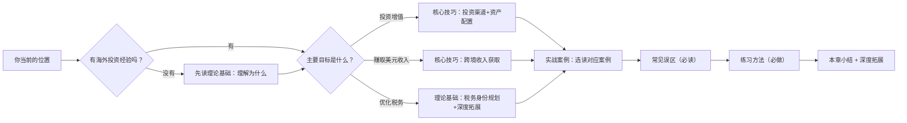

# 第34章：全球化搞钱

## 为什么需要这一章？

在前面的33章中，你已经系统学习了从副业、投资、创业到税务筹划、财富传承、人生规划的完整知识体系。但如果你的所有资产、所有收入来源、所有鸡蛋都放在同一个国家的篮子里——**你其实只做了一半的风险分散。**

一个残酷的现实是：2022年A股沪深300全年下跌21.6%，同期标普500下跌19.4%，但如果你持有日经225指数，全年仅下跌9.4%；如果你持有巴西Bovespa指数，反而上涨了4.7%。同一个年份，不同国家的市场表现天差地别。**真正的风险分散，必须跨越国境线。**

本章要回答的根本问题：

1. **为什么要出去？** —— 单一市场的系统性风险有多大？全球配置能带来什么改善？
2. **怎么出去？** —— 港股、美股、海外基金、跨境电商、远程工作，哪些适合你？
3. **出去之后怎么管？** —— 全球资产配置的框架、再平衡策略、汇率管理
4. **怎么合法合规？** —— 外汇管制、税务申报、CRS信息交换，底线在哪里？

> 💡 **本章的核心立场：** 全球化搞钱不是有钱人的专利，也不是把钱转出去那么简单。它是一种系统性的财富思维方式——让全球的机会为你工作，同时用全球的分散来保护你的财富。

***

## 章节知识地图

```mermaid
graph TD
    A["第34章：全球化搞钱"] --> B["理论基础"]
    A --> C["核心技巧"]
    A --> D["实战案例"]
    A --> E["常见误区"]
    A --> F["练习方法"]
    A --> G["本章小结"]
    A --> H["深度拓展"]

    B --> B1["现代投资组合理论的全球化延伸"]
    B --> B2["经济周期的全球不同步性"]
    B --> B3["货币购买力的长期博弈"]
    B --> B4["全球化搞钱的四大支柱"]
    B --> B5["风险框架与特殊考量"]
    B --> B6["历史演变与未来趋势"]
    B --> B7["心理准备与常见误区"]

    C --> C1["海外投资渠道实操"]
    C --> C2["跨境收入获取技巧"]
    C --> C3["全球资产配置策略"]
    C --> C4["海外银行开户"]
    C --> C5["外汇管理实操"]
    C --> C6["投资环境比较"]
    C --> C7["进阶技巧"]
    C --> C8["行动清单"]

    D --> D1["从A股到全球配置者"]
    D --> D2["程序员的跨境收入之路"]
    D --> D3["跨境电商月销10万美元"]
    D --> D4["数字游民的税务身份规划"]
    D --> D5["全球资产配置长期实践"]
    D --> D6["退休人士全球养老规划"]
    D --> D7["内容创作者全球化变现"]

    style A fill:#2d3748,stroke:#4a5568,color:#fff
    style B fill:#1a365d,stroke:#2a4a7f,color:#fff
    style C fill:#1a365d,stroke:#2a4a7f,color:#fff
    style D fill:#1a365d,stroke:#2a4a7f,color:#fff
    style E fill:#744210,stroke:#975a16,color:#fff
    style F fill:#22543d,stroke:#276749,color:#fff
    style G fill:#2d3748,stroke:#4a5568,color:#fff
    style H fill:#44337a,stroke:#553c9a,color:#fff
```



***

## 核心问题清单

在进入正文之前，先列出本章将系统解答的核心问题。建议你在阅读过程中逐一对照，确保每个问题都得到了令你满意的回答：

| # | 核心问题 | 对应板块 | 为什么重要 |
|---|---------|---------|-----------|
| 1 | 为什么不能只投资国内市场？理论依据是什么？ | 理论基础 | 如果不理解"为什么要出去"，后面所有行动都缺乏动力 |
| 2 | 我只有10万块，也能做全球投资吗？ | 理论基础 + 核心技巧 | 门槛认知错误会让人永远不开始 |
| 3 | 港股和美股分别怎么开户？具体流程是什么？ | 核心技巧 | 从"想做"到"能做"的关键一步 |
| 4 | 港股通、直接开港股账户、互联网券商，我该选哪种？ | 核心技巧 | 不同渠道的门槛、费用、标的不同，选错浪费时间 |
| 5 | QDII基金是什么？和直接买美股有什么区别？ | 核心技巧 | 最简单的海外投资方式，100元就能开始 |
| 6 | 全球资产配置的具体比例怎么定？ | 核心技巧 | 配置比例决定了风险和收益的平衡点 |
| 7 | 核心-卫星配置法是什么？怎么执行？ | 核心技巧 | 最实用的配置框架，直接抄作业 |
| 8 | 我的技能能不能做海外自由职业？怎么开始？ | 核心技巧 | 用技能赚美元是最直接的"全球化搞钱" |
| 9 | 跨境电商需要多少启动资金？风险多大？ | 核心技巧 | 有货源优势的人必须了解的路径 |
| 10 | 每年5万美元换汇额度够用吗？有什么技巧？ | 核心技巧 | 外汇管制是中国投资者的最大实操障碍 |
| 11 | 海外收入需要在国内交税吗？CRS是什么？ | 常见误区 + 深度拓展 | 不懂税务合规可能面临法律风险 |
| 12 | 全球化搞钱有哪些最常见的坑？ | 常见误区 | 避坑比找路更重要——掉进坑里一切归零 |

***

## 关键概念速览

以下概念贯穿本章始终，先建立基本认知，后文将逐一展开：

| 概念 | 一句话解释 | 深入阅读 |
|------|-----------|---------|
| **现代投资组合理论（MPT）** | 通过持有相关性低的资产，在不降低收益的前提下降低风险 | → 理论基础 > 全球资产配置理论延伸 |
| **夏普比率** | 衡量风险调整后收益的指标——每承担1单位风险获得多少超额收益 | → 理论基础 > 全球配置的优势 |
| **AH股溢价** | 同一家公司在A股和H股同时上市，H股通常便宜20%-50% | → 核心技巧 > 港股投资 |
| **QDII基金** | 国内基金公司发行的、投资海外市场的基金产品，100元起投 | → 核心技巧 > 海外基金投资 |
| **核心-卫星配置法** | 60-70%配宽基指数（核心），30-40%配行业/个股/另类（卫星） | → 核心技巧 > 全球资产配置策略 |
| **再平衡** | 定期卖出涨多了的资产、买入跌多了的资产，让配置比例回归目标 | → 核心技巧 > 再平衡策略 |
| **CRS（共同申报准则）** | 100+国家自动交换税务居民的海外金融账户信息 | → 深度拓展 > 全球税务合规框架 |
| **属地征税 vs 全球征税** | 有些国家只对境内收入征税（如香港），有些对全球收入征税（如中国） | → 理论基础 > 税务身份规划 |
| **数字游民签证** | 允许远程工作者在海外长期合法居住的签证类型，50+国家推出 | → 核心技巧 > 税务身份规划 |
| **SWIFT / CIPS** | 全球跨境支付信息网络 / 中国的人民币跨境支付系统 | → 深度拓展 > 跨境支付技术架构 |

***

## 本章结构导航

本章按照 **"道 → 法 → 术 → 案例 → 避坑 → 行动 → 回顾 → 深化"** 的逻辑层层递进：

```text
第34章：全球化搞钱/
├── 00-章节概览.md          ← 你正在阅读的文件
├── 理论基础/               ← "道"：理解底层逻辑
│   ├── 01-全球资产配置战略框架.md    从马科维茨到全球化配置的完整框架
│   ├── 02-为什么要把鸡蛋放在不同国家的篮子里.md  MPT全球化延伸+经济周期不同步
│   ├── 03-全球化搞钱的四大支柱.md    海外投资/跨境收入/资产配置/税务规划
│   ├── 04-全球化搞钱的风险框架.md    六大风险类型+中国投资者特殊考量
│   ├── 05-本节核心要点.md
│   ├── 06-历史演变与未来趋势.md    从大航海时代到数字游民的全球化搞钱史
│   ├── 07-心理准备.md              跨出舒适区的心理建设
│   └── 08-常见误区.md              理论层面的认知纠偏
├── 核心技巧/               ← "法"与"术"：可执行的方法
│   ├── 00-海外投资渠道选择决策图.md  帮你选对投资渠道的决策树
│   ├── 01-海外投资渠道实操.md      港股/美股/海外基金/海外房产四条路径
│   ├── 02-跨境收入获取技巧.md      自由职业/跨境电商/远程工作三条路
│   ├── 03-全球资产配置策略.md      核心-卫星法+具体方案+再平衡
│   ├── 04-海外银行开户与外汇管理.md  开户实操+合法换汇+汇率策略
│   ├── 05-投资环境快速比较.md      美/港/新/日/澳五地横向对比
│   ├── 06-本节核心要点.md
│   ├── 07-进阶技巧.md              高净值人群的高级策略
│   └── 08-行动清单.md              从今天开始的具体步骤
├── 实战案例/               ← "器"：真实场景验证
│   ├── 01-从A股投资者到全球配置者.md  32岁产品经理的两年转型之路
│   ├── 02-程序员的跨境收入之路.md    从月薪2.5万到月入7万的18个月
│   ├── 03-跨境电商从0到月销10万美元.md  义乌夫妇的亚马逊创业
│   ├── 04-数字游民的税务身份规划.md  年入200万自媒体人的合法节税
│   ├── 05-全球资产配置的长期实践.md  45岁高管500万资产的重新配置
│   ├── 06-案例总结与启示.md
│   ├── 07-退休人士的全球养老规划.md  为退休生活做全球布局
│   └── 08-内容创作者的全球化变现.md  用内容赚全球的钱
├── 04-常见误区.md           ← 全球化搞钱路上的8个认知陷阱
├── 05-练习方法.md           ← 7个可落地的实战练习
├── 06-本章小结.md           ← 核心要点回顾+行动指南
└── 07-深度拓展.md           ← 经济学分析/支付技术/税务框架/政治风险/数字货币
```

***

## 适读人群与阅读策略

本章的内容适用于所有想要突破单一市场局限的投资者和创收者，但不同背景的读者应该有不同的阅读策略：

### 刚开始接触投资的新手（资产<50万）

**你的核心问题：** 听说过港股美股，但不知道从哪开始，担心门槛太高。

**阅读策略：**
1. **重点精读**：理论基础中的"为什么要把鸡蛋放在不同国家的篮子里"——理解全球配置的必要性
2. **重点精读**：核心技巧中的"海外投资渠道实操"中的QDII基金部分——100元就能开始
3. **快速浏览**：核心技巧中的"海外银行开户"——先了解，不急着操作
4. **选读**：实战案例中的"从A股投资者到全球配置者"——看看和你类似的人怎么起步

**你最应该记住的一句话：** 100元买QDII标普500指数基金，就是你全球化搞钱的第一步。别等"有钱了"再开始。

### 有投资经验的中级投资者（资产50-200万）

**你的核心问题：** 已经有A股和基金，想知道怎么系统性地配置海外资产。

**阅读策略：**
1. **重点精读**：核心技巧中的"全球资产配置策略"——核心-卫星配置法+具体方案直接抄
2. **重点精读**：核心技巧中的"海外投资渠道实操"中的港股和美股部分——开户+实操全流程
3. **重点精读**：核心技巧中的"再平衡策略"——配置容易，维护难
4. **精读**：实战案例中的"全球资产配置的长期实践"——500万资产的真实调整过程

**你最应该记住的一句话：** 配置比例比选标的更重要。先定好中国/美国/国际/债券/黄金的大框架，再填具体产品。

### 有专业技能的互联网从业者

**你的核心问题：** 除了投资收益，能不能用技能直接赚美元？

**阅读策略：**
1. **重点精读**：核心技巧中的"跨境收入获取技巧"——海外自由职业+远程工作两条路
2. **重点精读**：实战案例中的"程序员的跨境收入之路"——从0到月入7万的完整路径
3. **精读**：实战案例中的"内容创作者的全球化变现"——非技术人员的参考
4. **选读**：核心技巧中的"海外银行开户与外汇管理"——收美元需要什么账户

**你最应该记住的一句话：** 英语能力+专业技能=美元收入。每天1小时练英语，3个月后就能接海外项目。

### 高净值人群（资产>200万）

**你的核心问题：** 资产规模大了，需要考虑税务身份、全球架构、财富保全。

**阅读策略：**
1. **重点精读**：理论基础中的"全球化搞钱的四大支柱"中的税务身份规划部分
2. **重点精读**：核心技巧中的"进阶技巧"——高净值人群的高级策略
3. **重点精读**：实战案例中的"数字游民的税务身份规划"——年入200万的合法节税方案
4. **精读**：深度拓展中的"全球税务合规框架"——CRS、FATCA、AML/KYC全面了解

**你最应该记住的一句话：** 税务规划不是避税，是在合法框架内选择最优的税务结构。专业顾问的钱不能省。

***

## 阅读路线图



***

## 核心框架预览：全球资产配置的四层金字塔

本章核心技巧部分将详细展开的配置框架，这里先给一个概览，帮助你在后续阅读中建立全局感：

```text
                    ┌─────────────────┐
                    │  第四层：税务优化  │  ← 高净值人群（资产>500万）
                    │  税务身份规划     │     投资移民/数字游民签证
                    │  税收协定利用     │     合法降低综合税负
                    ├─────────────────┤
                ┌───│  第三层：跨境收入  │───┐  ← 有技能者
                │   │  海外自由职业     │   │     用时间/技能赚美元
                │   │  跨境电商         │   │     天然货币对冲
                │   │  远程工作         │   │
                │   ├─────────────────┤   │
            ┌───│───│  第二层：主动配置  │───│───┐  ← 有50万+可投资资金
            │   │   │  港股/美股个股     │   │   │     港股通/互联网券商
            │   │   │  行业主题ETF      │   │   │     定期再平衡
            │   │   │  海外房产         │   │   │
            │   │   ├─────────────────┤   │   │
        ┌───│───│───│  第一层：被动配置  │───│───│───┐  ← 所有人（100元起）
        │   │   │   │  QDII基金         │   │   │   │     支付宝/天天基金
        │   │   │   │  全球指数ETF      │   │   │   │     定投即可
        │   │   │   │  核心-卫星框架    │   │   │   │
        └───┴───┴───┴─────────────────┴───┴───┴───┘
```

**每一层的进入门槛和预期效果：**

| 层级 | 最低门槛 | 核心动作 | 预期效果 | 适合人群 |
|------|---------|---------|---------|---------|
| 第一层：被动配置 | 100元 | 买QDII/全球ETF，定投 | 享受全球市场平均收益 | 所有投资者 |
| 第二层：主动配置 | 50万 | 开港股/美股账户，选标的 | 超额收益可能，但需研究能力 | 有经验的投资者 |
| 第三层：跨境收入 | 0元（需技能） | 海外接单/跨境电商/远程工作 | 美元收入，天然货币对冲 | 有专业技能者 |
| 第四层：税务优化 | 200万+ | 税务身份规划+架构设计 | 合法降低综合税负5-10个百分点 | 高净值人群 |

***

## 全球化搞钱的数学基础

在深入正文之前，先建立一个核心认知：**全球配置的风险分散效果是可以量化的。**

```text
核心公式：投资组合风险 = f(各资产权重, 各资产波动率, 资产间相关系数)

关键数据（基于历史回测）：
- 纯A股组合的年化波动率：约25%
- 纯美股组合的年化波动率：约18%
- 全球分散配置的年化波动率：约14%

结论：同样7-8%的年化预期收益：
- 纯A股配置 → 最大回撤可能达40-50%
- 全球分散配置 → 最大回撤通常在20-30%

分散效果 = 最大回撤降低30%-50%
```

**一个更直观的例子：**

假设你在2022年初有100万人民币，分别用两种策略投资：

| 策略 | 2022年底价值 | 最大浮亏 | 睡眠质量 |
|------|------------|---------|---------|
| 100% 沪深300 | 约78万 | -26万 | 😰 |
| 40%沪深300 + 30%标普500 + 15%日经225 + 10%黄金 + 5%债券 | 约88万 | -15万 | 😌 |

同样的100万，全球配置少亏10万，最大浮亏少11万。**这就是"不把所有鸡蛋放在同一个国家篮子里"的数学证明。**

***

## 本章与其他章节的关系

本章是《搞钱指南》的"全球化视角"章节，它与前面的章节有密切的知识关联：

| 前序章节 | 与本章的关系 | 阅读建议 |
|---------|-------------|---------|
| 第9-15章（投资理财） | 全球资产配置建立在基本投资知识之上 | 如果不了解基金/ETF，先补基础 |
| 第16-22章（创业经商） | 跨境电商是创业的全球化延伸 | 有创业经验者可快速跳读 |
| 第23-29章（被动收入） | 海外REITs、全球指数基金是被动收入的全球化版本 | 强烈建议先读 |
| 第30章（税务筹划） | 全球化搞钱涉及跨境税务，是税务筹划的进阶版 | 必读前置章节 |
| 第31章（财富传承） | 全球资产配置影响财富传承的架构设计 | 可延后阅读 |
| 第32章（搞钱心理学） | 全球化搞钱需要克服"本土偏好"心理 | 建议先读第32章 |
| 第33章（搞钱与人生规划） | 税务身份规划影响人生地点选择 | 有海外生活意愿者必读 |

***

## 本章的价值承诺

读完本章并完成练习后，你将能够：

1. **理解**全球化搞钱的理论基础——为什么单一市场配置是不够的
2. **选择**最适合你的海外投资渠道——从100元QDII到直接开美股账户
3. **制定**一份属于你的全球资产配置方案——包含具体标的和比例
4. **识别**获取跨境收入的可行路径——海外自由职业、跨境电商、远程工作
5. **规避**全球化搞钱中最常见的8个认知陷阱
6. **掌握**合法合规的底线——外汇管制、税务申报、CRS信息交换
7. **完成**第一笔海外投资——无论是QDII基金还是港股/美股

***

## 关键数字速查

> 📌 **本章核心数字一览**
>
> | 数字 | 含义 |
> |------|------|
> | 5万美元 | 中国个人年度便利化购汇额度 |
> | 50万人民币 | 港股通开户资金门槛（互联网券商无门槛） |
> | 100元 | QDII基金最低起投金额 |
> | 10% | 美股标普500长期历史年化收益率 |
> | 20%-40% | 全球配置后夏普比率的典型提升幅度 |
> | 30%-50% | 全球配置相比纯A股最大回撤的典型降幅 |
> | 100+ | 参与CRS信息交换的国家和地区数量 |
> | 50+ | 推出数字游民签证的国家数量 |

***

## 一句话总结本章

**全球化搞钱的本质，是用全球的视野选择机会、用全球的分散对抗风险、用全球的规则优化税务——让你的财富不再被一条国境线所限制。**

***

> 📌 **阅读提示：** 建议先通读理论基础，理解"为什么要全球化搞钱"后，根据自己的目标（投资增值 / 赚取美元收入 / 税务优化）重点阅读对应的技巧和案例。最后一定要完成练习方法中的行动清单——全球化搞钱的最大障碍不是资金门槛，而是"等一等再说"的拖延。知识不落地，等于不知道。
