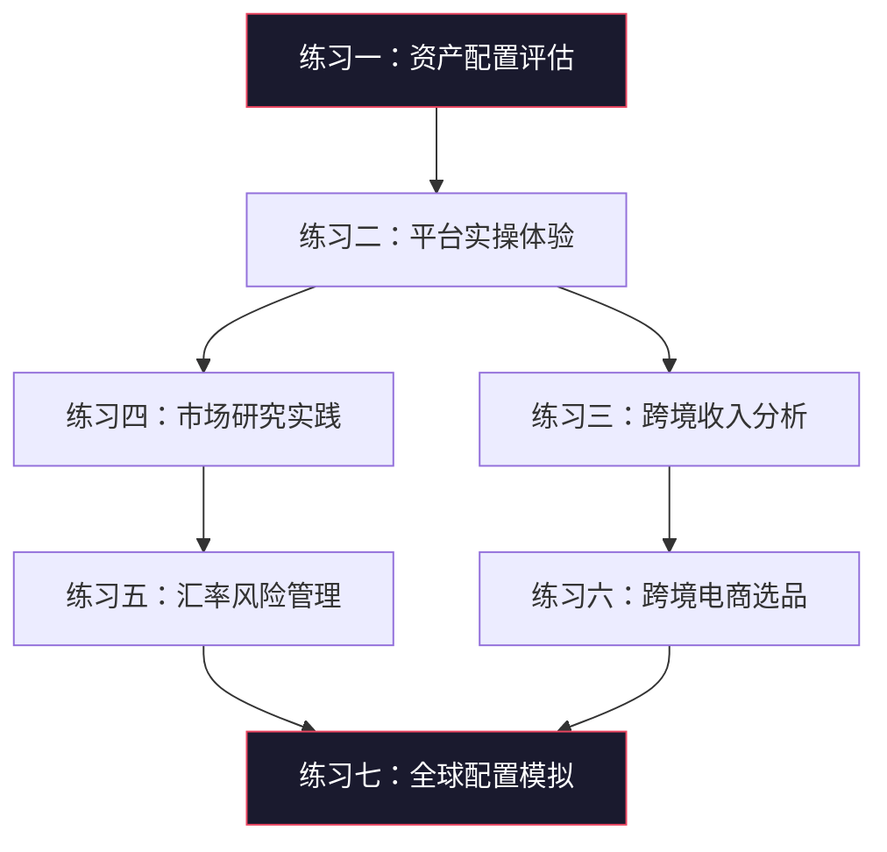

# 全球化搞钱练习方法

## 为什么需要系统化练习

全球化搞钱不是读几篇文章就能掌握的技能。它涉及跨境投资、外汇管理、海外市场开拓、国际税务等多个复杂领域，每个领域都有独特的规则、工具和风险。系统化练习的意义在于：

- **降低试错成本**：在投入真金白银之前，通过模拟和小额实操积累经验，避免因无知造成的损失
- **建立肌肉记忆**：反复操作交易平台、研究工具、收款渠道，让流程变成条件反射
- **培养全球视野**：从只关注A股到同时关注港股、美股、大宗商品、外汇市场，思维方式的转变需要时间
- **发现个人优势**：通过实际尝试不同方向（投资、接单、跨境电商），找到最适合自己的全球化路径

本章设计了七个递进式练习，从自我评估到实操体验，从单一技能到综合模拟，覆盖全球化搞钱的核心能力。每个练习都包含理论背景、详细步骤、真实案例、常见陷阱和检验标准，确保你不仅"做了"，而且"学会了"。



---

## 练习一：全球资产配置自我评估

### 理论背景

资产配置是投资收益的最大决定因素。诺贝尔经济学奖得主威廉·夏普（William Sharpe）的研究表明，投资组合90%以上的收益差异来自资产配置，而非个股选择或择时。全球化资产配置的核心原理是**分散化**——不同国家和地区的经济周期不完全同步，通过跨地域配置可以降低单一市场的系统性风险。

中国大陆投资者的典型问题是**过度集中**：80%以上的资产集中在人民币计价的国内资产，其中房产又占了大头。这种配置在人民币贬值、国内经济下行或房地产调整时会面临巨大风险。

### 详细步骤

**第一步：全面盘点资产**

不仅仅是列出大类，要精确到每一个账户。很多人低估了自己资产集中度的原因是"忘了"某些账户。

| 资产类别 | 具体项目 | 币种 | 金额（万元） | 占比 |
|---------|---------|------|-------------|------|
| 现金/存款 | 银行活期、定期、货币基金（余额宝/零钱通） | CNY | | |
| 固收类 | 银行理财、债券基金、信托 | CNY | | |
| A股 | 个股、ETF、混合基金 | CNY | | |
| 国内房产 | 自住房市值、投资房市值（扣掉贷款余额） | CNY | | |
| 港股/港股通 | 个股、ETF | HKD | | |
| 美股 | 个股、ETF | USD | | |
| 其他海外资产 | 海外基金、REITs、加密资产 | 多币种 | | |
| 黄金/贵金属 | 实物金、黄金ETF、积存金 | CNY | | |
| 保险资产 | 年金、增额终身寿的现金价值 | CNY | | |
| 其他 | 收藏品、知识产权、海外房产等 | 混合 | | |
| **合计** | | | | 100% |

**关键细节**：房产要用"市值减去未还贷款"的净值来算。一套市值500万但还欠300万贷款的房子，资产部分只算200万。

**第二步：诊断配置问题**

完成资产盘点后，用以下标准逐项评估：

**集中度诊断表**

| 诊断维度 | 健康标准 | 警戒线 | 你的数值 | 状态 |
|---------|---------|--------|---------|------|
| 单一货币资产占比 | < 70% | > 85% | | |
| 房产占总资产比 | < 40% | > 60% | | |
| 海外资产占比 | > 15% | < 5% | | |
| 单一市场股票占比 | < 30% | > 50% | | |
| 高流动性资产占比 | > 20% | < 10% | | |
| 资产类别数量 | ≥ 5 类 | ≤ 2 类 | | |

**相关性分析**：很多看似不同的资产其实高度相关。比如A股大盘蓝筹和国内房产都与中国经济高度绑定；银行理财底层很多也是国内债券和贷款。真正的分散化需要配置**相关性低**的资产——比如A股和美股历史相关系数约0.3-0.5，黄金和股票甚至负相关。

**第三步：制定优化方案**

根据诊断结果，制定分阶段的优化计划。关键原则：

1. **不要急于大幅调整**：市场时机很难把握，分批调整更稳妥
2. **先建立框架再填内容**：确定好大类比例，再选具体标的
3. **考虑税收和费用**：换汇成本、跨境转账费、交易佣金都要算进去
4. **留足应急资金**：无论怎么配置，至少保留6个月生活费的高流动性资产

**优化计划模板**

| 阶段 | 时间 | 目标 | 具体行动 | 预计投入 |
|------|------|------|---------|---------|
| 第一阶段 | 第1-3个月 | 开通海外投资渠道 | 开通港股/美股券商账户、完成外汇额度申请 | 时间为主 |
| 第二阶段 | 第4-6个月 | 首批海外配置 | 分批换汇、买入首批海外ETF | 5-10万 |
| 第三阶段 | 第7-12个月 | 完成初步配置 | 达到海外资产占比目标的50% | 10-20万 |
| 第四阶段 | 第2年 | 优化再平衡 | 根据市场变化调整、补充不足的资产类别 | 持续投入 |

### 案例参考

**案例：小王的资产配置诊断**

小王，30岁，互联网从业者，年薪40万。他的资产盘点结果：

| 资产 | 金额 | 占比 |
|------|------|------|
| 银行存款+货基 | 30万 | 15% |
| A股基金 | 20万 | 10% |
| 房产净值 | 140万 | 70% |
| 海外资产 | 0 | 0% |
| 其他 | 10万 | 5% |

诊断结果：房产占比严重超标（70%），完全没有海外资产，单一货币（人民币）占比100%。风险极高——如果房价下跌20%，他的净资产缩水14%。

优化方向：未来12个月逐步将海外资产占比提升到15%（约30万），房产占比通过持续还贷和增加其他资产自然下降到60%以下。

### 常见陷阱

- **只看收益率不看相关性**：很多人觉得"我已经有A股和基金了"，但A股基金和A股高度相关，不算分散
- **忽视隐性资产**：社保、公积金账户余额、公司期权也是资产的一部分
- **一次性大幅调仓**：看到诊断结果后急于"纠正"，可能在错误的时间点大量买入或卖出
- **忽略流动性需求**：海外资产取出通常需要更长时间和更高成本，不要把急用的钱配到海外

### 检验标准

完成本练习后，你应该能够：
- [ ] 清楚列出自己所有资产的币种、市场和比例
- [ ] 识别出自己配置中最大的风险点
- [ ] 制定出一份可执行的12个月优化计划
- [ ] 理解为什么需要全球化配置而不仅仅是"买点美股"

---

## 练习二：海外投资平台实操体验

### 理论背景

海外投资的第一步是选择合适的通道。对大陆投资者来说，主要有以下几种方式：

| 方式 | 门槛 | 优势 | 劣势 |
|------|------|------|------|
| 港股通（沪港通/深港通） | 50万资产 | 合法合规、不占外汇额度 | 标的有限、只能买港股 |
| 互联网券商（富途/老虎/盈透） | 低 | 全球市场、体验好 | 换汇出金有合规风险 |
| QDII基金 | 低 | 专业管理、不需海外账户 | 管理费高、额度有限 |
| 海外银行账户 | 中高 | 安全正规 | 开户门槛高、流程长 |

对于初学者，建议从港股通+互联网券商的组合入手，前者保证合规底线，后者提供更丰富的标的选择。

### 四周实操计划

**第一周：开户与选品准备**

选择券商时的评估维度：

| 评估维度 | 富途证券 | 老虎证券 | 盈透证券（IBKR） |
|---------|---------|---------|-----------------|
| 开户门槛 | 低 | 低 | 中（有最低入金要求） |
| 佣金费率 | 港股0.03%（最低3港元） | 美股$0.005/股 | 美股$0.005/股 |
| 市场覆盖 | 港股、美股 | 港股、美股、新加坡股 | 全球150+市场 |
| 中文支持 | 优秀 | 优秀 | 一般 |
| 研究工具 | 丰富 | 丰富 | 专业级 |
| 融资利率 | 较高 | 较高 | 较低 |
| 适合人群 | 入门用户 | 入门用户 | 进阶用户 |

开户所需材料通常包括：身份证/护照、银行卡（用于入金）、地址证明（水电费单或银行对账单）、税务信息。整个线上流程通常1-3个工作日完成审核。

**第二周：熟悉平台与市场机制**

需要重点了解的内容：

- **交易时间**：港股交易时间为上午9:30-12:00、下午13:00-16:00（北京时间）；美股交易时间为晚上21:30-次日凌晨4:00（夏令时）
- **结算制度**：港股T+2交收，美股T+1交收（2024年5月后）
- **最小交易单位**：港股以"手"为单位（每只股票不同），美股可以买1股
- **税费结构**：港股有印花税0.1%、交易征费等；美股无印花税，但有SEC费
- **汇率影响**：你的盈亏不仅要考虑股价变动，还要考虑港币/美元兑人民币的汇率变动

**实操任务**：登录平台后，分别搜索以下标的并加入自选列表：
- 港股：腾讯(0700)、恒生科技ETF(3032)、盈富基金(2800)
- 美股：SPY（标普500 ETF）、QQQ（纳斯达克100 ETF）、AAPL（苹果）

观察它们的价格波动、成交量、买卖价差，连续观察一周。

**第三周：模拟交易或极小额实盘**

如果平台提供模拟交易功能，先用模拟资金练习以下操作：

1. **市价单**：以当前市场价立即买入/卖出
2. **限价单**：设定一个目标价格，到达后自动成交
3. **止损单**：设定一个止损价，跌破后自动卖出保护本金

**订单类型详解**

| 订单类型 | 适用场景 | 优点 | 缺点 |
|---------|---------|------|------|
| 市价单 | 急需成交、流动性好的标的 | 确保成交 | 价格不确定 |
| 限价单 | 对价格有明确预期 | 价格可控 | 可能无法成交 |
| 止损单 | 保护利润、限制亏损 | 自动执行 | 突破后变成市价单 |
| 止损限价单 | 精确控制止损价格 | 价格和执行都有保障 | 市场剧烈波动时可能无法触发 |

**第四周：实盘小额体验**

入金1000-5000港币（或等值美元），进行真实交易。重点不在于赚钱，而在于体验完整的交易流程：

- 入金流程：从国内银行账户换汇、汇款到券商账户（注意：每人每年5万美元便利化额度）
- 下单流程：搜索标的、输入数量和价格、确认下单
- 持仓管理：查看持仓盈亏、设置价格提醒
- 出金流程：将资金从券商转回银行账户

**交易日志模板**（建议用Excel或Notion记录）：

```text
交易编号：#001
日期时间：2026-06-25 10:30
交易方向：买入
标的代码：SPY
标的名称：标普500 ETF
委托价格：$520.00
成交价格：$520.15
数量：2股
成交金额：$1,040.30
手续费：$1.00
汇率：7.25
人民币成本：¥7,552.18
买入理由：全球配置中的美股核心仓位
预期持有时间：6个月以上
止损位：$490（约-5.8%）
心理感受：第一次买美股，有点紧张但流程很清晰
```

### 常见陷阱

- **入金比想象中麻烦**：银行可能会问你汇款目的，有些银行对"证券投资"目的的汇款会拒绝或限制。建议先小额尝试，找到支持的银行
- **忽视时差影响**：美股交易时间在国内深夜，如果你打算做短线交易，要考虑对生活作息的影响
- **被"打新"吸引**：港股打新听起来很诱人，但新股破发率很高，初学者不建议参与
- **手续费叠加**：佣金、平台费、换汇费、汇款费，小金额交易的成本占比会很高。建议单笔交易金额不低于5000港币

### 检验标准

完成本练习后，你应该能够：
- [ ] 独立完成海外券商开户流程
- [ ] 熟练操作平台的买卖、查询、设置提醒等功能
- [ ] 理解不同订单类型的适用场景
- [ ] 完成至少一次完整的入金-交易-记录流程

---

## 练习三：跨境收入可行性分析

### 理论背景

跨境收入是指你的客户或雇主在海外，你通过提供服务或产品获得外币收入。与跨境投资相比，跨境收入的优势在于：

- **持续性强**：投资收益有波动，但技能变现的收入更稳定
- **本金要求低**：不需要大量启动资金，靠技能和时间就能开始
- **双重收益**：赚到的外币如果人民币贬值，换回人民币还能享受汇率收益
- **能力建设**：在服务海外客户的过程中，你的英语能力、项目管理能力、国际视野都会提升

跨境收入的常见形式包括：自由职业接单（Upwork/Fiverr）、远程工作（为海外公司全职/兼职）、跨境电商品牌出海、内容创作（YouTube/付费Newsletter）、SaaS产品出海等。

### 详细步骤

**第一步：深度技能盘点**

不要笼统地写"会编程"或"会设计"，要精确到具体的技术栈、工具和应用场景：

| 技能领域 | 具体技能 | 经验年限 | 可证明的成果 | 海外市场需求 | 变现难度 |
|---------|---------|---------|-------------|-------------|---------|
| 前端开发 | React/Vue/TypeScript | | GitHub项目、上线网站 | ★★★★★ | 中 |
| 后端开发 | Python/Go/Node.js | | 系统架构、API | ★★★★★ | 中 |
| 数据分析 | SQL/Python/Excel | | 数据报告、看板 | ★★★★ | 低 |
| UI/UX设计 | Figma/Sketch | | 设计作品集 | ★★★★ | 中 |
| 写作/翻译 | 中英翻译、技术写作 | | 发表文章、翻译作品 | ★★★ | 低 |
| 视频剪辑 | Premiere/After Effects | | 视频作品 | ★★★★ | 低 |
| SEO/营销 | 关键词研究、广告投放 | | 成功案例、ROI数据 | ★★★★ | 中 |

**评估要点**：海外市场需求高的技能不等于你能变现——还要看你的英语沟通能力、作品集质量、时薪竞争力。

**第二步：平台调研与竞品分析**

以Upwork为例，进行系统调研：

1. **搜索你的技能关键词**，查看有多少freelancer在竞争
2. **筛选Top Rated freelancers**，分析他们的：
   - Profile描述如何写（关键词、卖点、数据）
   - 成功案例如何展示
   - 时薪/项目报价范围
   - 完成的项目数量和评分
3. **搜索相关Job Postings**，分析客户需求：
   - 常见的项目类型是什么
   - 客户的预算范围是多少
   - 客户最看重什么能力
4. **计算竞争力**：你的技能×英语能力×作品集 vs 竞争对手，你能排在什么位置

**不同平台对比**

| 平台 | 类型 | 抽佣比例 | 结算方式 | 适合人群 |
|------|------|---------|---------|---------|
| Upwork | 综合自由职业 | 5-20% | 银行/Payoneer | 技术、设计、营销 |
| Fiverr | 服务商品化 | 20% | PayPal/Payoneer | 创意、设计、小任务 |
| Toptal | 高端技术 | 不明（客户付） | 银行 | 顶级开发者 |
| 独立站 | 自建品牌 | 0% | Stripe/PayPal | 有品牌意识的长期主义者 |
| Remote OK | 远程全职 | 0（雇主付） | 工资发放 | 想要稳定收入的人 |

**第三步：制定可执行的行动计划**

跨境收入不是"注册账号就能赚钱"，需要系统规划：

**第一阶段（第1-2个月）：基建期**

- 完善LinkedIn英文Profile，突出技能和成果
- 在Upwork/Fiverr注册账号，精心撰写Profile
- 准备3-5个作品案例（即使是个人项目也要包装好）
- 注册Payoneer或Wise账户用于收款
- 申请2-3个与你技能匹配的小项目（可以低报价先积累评价）

**第二阶段（第3-4个月）：冷启动期**

- 保持每周申请5-10个项目的频率
- 专注于获得前5个好评（这是Upwork算法推荐的关键阈值）
- 每个项目结束后主动请客户留评价
- 逐步提升报价（每获得2-3个好评提价10-20%）

**第三阶段（第5-12个月）：增长期**

- 建立回头客关系（完成项目后主动提供后续服务）
- 从按项目报价逐步转向按小时报价
- 建立个人品牌（技术博客、Twitter/X、LinkedIn内容）
- 目标：月收入$500 → $1000 → $2000+

### 案例参考

**案例：前端开发者的跨境接单之路**

小李，26岁，前端开发3年经验，英语四级水平。

- **第1个月**：注册Upwork，完善Profile，写了3个React项目案例。以$15/小时的低价申请了20个项目，获得2个面试，拿下1个$200的小项目。
- **第3个月**：积累了5个好评，评分4.9。时薪提到$25，每月稳定接到3-4个项目，月收入$800-1200。
- **第6个月**：获得Top Rated徽章，时薪提到$40。有2个固定客户每月续单，月收入$2500-3000。
- **第12个月**：时薪$60，主要服务2-3个长期客户，月收入$4000-5000。英语沟通能力大幅提升，开始接到更复杂的项目。

### 常见陷阱

- **Profile写得太泛**："I'm a full-stack developer with 5 years of experience"这种描述毫无竞争力。要写具体的技术栈、成功案例和量化成果
- **一开始就要高价**：没有评价的新账号很难接到高价项目，前期的"低价换评价"是必要投资
- **忽视沟通质量**：很多中国freelancer技术很强但输在沟通上。回复要及时、专业、有条理
- **只在一个平台**：不要把所有鸡蛋放在一个篮子里，建议同时经营2-3个平台
- **忽视税务合规**：跨境收入在国内也需要申报纳税，长期来看要建立合规的收入记录

### 检验标准

完成本练习后，你应该能够：
- [ ] 清楚描述自己的3项核心跨境变现技能
- [ ] 知道在哪些平台、用什么策略推广自己的服务
- [ ] 完成至少一个跨境平台的注册和Profile完善
- [ ] 制定出未来6个月的跨境收入目标和行动计划

---

## 练习四：全球市场研究实践

### 理论背景

全球市场研究能力是全球化搞钱的基础素养。无论你是做跨境投资还是跨境生意，都需要了解全球经济格局、主要市场的运行规律、重大事件的影响机制。

市场研究不是"看新闻"，而是建立一套**信息获取→分析判断→决策执行**的系统。本练习的目标是帮你建立这个系统。

### 信息源体系建设

**第一梯队：每日必看（5-10分钟）**

| 信息源 | 类型 | 语言 | 关注重点 | 获取方式 |
|-------|------|------|---------|---------|
| Bloomberg | 综合财经 | 英文 | 全球市场概览、重大事件 | 网站/App（免费版够用） |
| Reuters | 综合财经 | 英文 | 重大新闻、市场数据 | 网站/App |
| 华尔街见闻 | 综合财经 | 中文 | 全球市场中文解读 | App |
| 财联社 | 快讯 | 中文 | 实时财经快讯 | App |

**第二梯队：每周深读（30-60分钟）**

| 信息源 | 类型 | 适合人群 |
|-------|------|---------|
| The Economist | 深度分析 | 想了解全球经济政治趋势的人 |
| FT中文网 | 深度分析 | 英文一般但想看国际视角的人 |
| 各券商研报 | 行业分析 | 有特定关注行业的投资者 |
| 华尔街日报 | 综合 | 关注美国市场的投资者 |

**第三梯队：每月研究（2-4小时）**

- 重点关注的公司季报/年报
- 重要央行会议纪要（美联储FOMC、欧央行ECB）
- 行业深度报告（可以看Seeking Alpha、Morningstar）
- 全球宏观经济数据（IMF/世界银行报告）

### 每日10分钟练习流程

```text
07:00-07:05  打开Bloomberg/Reuters，快速扫描标题
07:05-07:08  选择1-2条与你持仓或关注领域相关的新闻，仔细阅读
07:08-07:10  在笔记中记录：(1)发生了什么 (2)对市场有什么影响 (3)我需要做什么
```

**记录模板**

```markdown
## 2026-06-25 市场笔记

### 关键事件
- 美联储议息会议维持利率不变，鲍威尔暗示年内可能降息1次
- 英伟达发布新财报，营收超预期15%

### 市场反应
- 美股三大指数小幅上涨，科技股领涨
- 美元指数走弱，离岸人民币升值

### 我的思考
- 降息预期利好成长股和黄金，考虑加仓QQQ
- 英伟达估值偏高但增长确定性强，适合长持

### 待办行动
- [ ] 查看QQQ当前估值是否合理
- [ ] 关注下周非农数据对降息预期的影响
```

### 每周深度分析练习

每周选一个主题进行深入分析。主题选择参考：

**宏观主题**
- 主要央行的货币政策走向
- 全球通胀/通缩趋势
- 地缘政治热点（中东、台海、俄乌）
- 大宗商品价格走势

**行业主题**
- AI产业链（芯片→云计算→应用）
- 新能源（光伏、锂电、电动车）
- 生物医药（GLP-1减肥药、基因治疗）
- 消费电子（苹果产业链、VR/AR）

**分析框架**

对每个主题，按以下框架输出一份500-1000字的研究笔记：

```text
研究主题：美联储2026年降息路径分析
研究日期：2026-06-25

1. 背景（100字）：当前利率水平、通胀数据、就业数据
2. 核心观点（200字）：市场主流预期是什么、分歧在哪里
3. 数据支撑（200字）：关键经济数据、历史对比
4. 对各类资产的影响（200字）：股票/债券/黄金/汇率
5. 我的投资决策（100字）：基于以上分析，我要做什么
6. 风险提示（100字）：如果判断错误会怎样
```

### 案例参考

**案例：通过市场研究发现投资机会**

2024年初，一位持续关注AI产业链的投资者通过日常研究发现：

1. 英伟达财报连续超预期 → 算力需求旺盛
2. 但英伟达估值已经很高（PE>60x）→ 直接买英伟达风险大
3. 研究发现台积电作为上游代工，受益确定但估值更合理（PE~25x）
4. 同时发现电力需求增长 → 美国核电股可能受益

基于这个分析，他在2024年初配置了台积电和几家核电/公用事业公司，在AI行情中获得了不错的收益，且风险比直接买英伟达小得多。

### 常见陷阱

- **信息过载**：不需要看所有新闻，选择2-3个核心信息源，建立固定的信息获取流程
- **只看不思考**：阅读新闻不是目的，形成自己的判断和决策才是目的
- **追热点**：今天看AI明天看加密货币，没有持续跟踪的深度。建议选定2-3个长期关注的领域
- **忽视宏观**：很多人只关注个股，不关注宏观环境。但宏观决定了市场的β（系统性风险），个股只是α（超额收益）
- **确认偏误**：只看支持自己观点的信息，忽视反面证据。养成"寻找反方论据"的习惯

### 检验标准

完成本练习后，你应该能够：
- [ ] 建立固定的信息获取流程（每日10分钟不费力地执行）
- [ ] 能用中英文各阅读至少一个财经信息源
- [ ] 每周输出一份有质量的研究笔记
- [ ] 能够将宏观事件和自己的投资/业务决策联系起来

---

## 练习五：汇率风险管理实践

### 理论背景

汇率风险是全球化搞钱中被最广泛低估的风险。很多人花了大量精力研究买什么股票，却忽略了汇率波动可能吞噬大部分收益甚至造成亏损。

举个例子：2023年如果你买了标普500指数基金，美元计价收益约24%。但如果人民币同期升值5%，你的人民币实际收益只有约18%。反过来，2022年人民币大幅贬值约9%，这意味着即使美股跌了，换回人民币后你的损失可能更小。

**汇率影响的双向性**：
- 你持有的海外资产，汇率变动会影响换回人民币后的价值
- 你赚取的外币收入，汇率变动会影响实际购买力
- 你做跨境贸易，汇率变动会影响成本和利润

### 汇率基础知识

**主要货币对**

| 货币对 | 含义 | 影响因素 | 波动特征 |
|-------|------|---------|---------|
| USD/CNY | 美元兑人民币 | 中美利差、贸易差额、政策 | 日波动0.1-0.3% |
| EUR/USD | 欧元兑美元 | 欧美利差、经济数据 | 日波动0.3-0.8% |
| USD/JPY | 美元兑日元 | 日本央行政策、避险情绪 | 日波动0.3-1.0% |
| GBP/USD | 英镑兑美元 | 英国经济、脱欧影响 | 日波动0.3-0.8% |

**影响汇率的核心因素**

1. **利率差异**：高利率国家的货币倾向于升值（吸引资本流入）
2. **通胀水平**：高通胀侵蚀货币购买力，倾向于贬值
3. **贸易差额**：贸易顺差国的货币有升值压力（出口商需要将外币换成本币）
4. **经济基本面**：GDP增长强劲的国家货币倾向于升值
5. **政治稳定性**：政局不稳或地缘冲突会导致资本外流和货币贬值
6. **央行政策**：直接干预汇率或通过利率工具间接影响

### 分步练习

**第一步：汇率观察（第1-2周）**

每天固定时间记录USD/CNY汇率（可以在银行APP、XE.com或Bloomberg查看）：

```text
日期        | 中间价    | 在岸价(CNY) | 离岸价(CNH) | 你的观察
2026-06-23 | 7.1050  | 7.1120     | 7.1080     | 美元指数走弱，人民币小幅升值
2026-06-24 | 7.1020  | 7.1090     | 7.1050     | 连续两天升值，关注是否突破7.10
2026-06-25 | 7.0980  | 7.1050     | 7.1010     | 突破7.10，可能继续升值
```

**关键概念**：
- **中间价**：央行每天公布，是市场波动的"锚"
- **在岸价(CNY)**：国内市场的实际交易价格
- **离岸价(CNH)**：香港等境外市场的交易价格
- **价差**：CNY和CNH的价差反映了市场情绪和资本流动方向

**第二步：换汇策略对比（第3-4周）**

假设你需要换1万美元用于投资：

**策略A：一次性换汇**
- 在某个时间点一次性兑换1万美元
- 优点：如果汇率正好是低点，成本最低
- 缺点：如果换在高点，全部金额都受影响

**策略B：分批换汇（美元成本平均法）**
- 分4周，每周兑换2500美元
- 优点：平滑汇率波动，降低择时风险
- 缺点：如果汇率持续走高，平均成本比一次性换更高

**策略C：趋势换汇**
- 设定一个目标汇率（比如7.10），低于目标多换，高于目标少换
- 优点：在汇率走势明确时效果好
- 缺点：需要判断趋势，判断错误可能比策略B更差

**实操验证**：用过去一个月的真实汇率数据，分别计算三种策略的平均成本，对比差异。你会发现，对于1万美元的金额，三种策略的成本差异通常在100-300元人民币——了解差异的量级，有助于你不至于过度纠结换汇时点。

**第三步：制定个人换汇策略**

根据你的全球化计划，计算未来12个月的外币需求：

```text
海外投资计划：每月定投2000美元美股ETF → 全年需24000美元
跨境消费计划：海外旅行预算5000美元
跨境服务费：服务器/SaaS订阅约100美元/月 → 全年1200美元
全年外币需求合计：约30200美元
```

**换汇计划模板**

| 月份 | 计划金额 | 触发条件 | 实际汇率 | 实际金额 |
|------|---------|---------|---------|---------|
| 1月 | $2500 | 月初执行 | | |
| 2月 | $2500 | 汇率<7.10则多换$500 | | |
| 3月 | $2500 | 月初执行 | | |
| ... | ... | ... | ... | ... |

### 对冲策略进阶

对于持有较大规模海外资产（50万+人民币等值）的投资者，可以考虑更高级的汇率对冲：

**自然对冲**：如果有外币收入（跨境接单），用外币收入直接投资海外资产，避免换汇环节。

**货币基金对冲**：配置一部分人民币资产的同时，也配置一部分外币货币基金，形成自然的货币分散。

**远期合约**（适合大额资金）：通过银行做远期结汇，锁定未来的汇率。通常需要10万美元以上才有意义。

### 常见陷阱

- **过度关注短期波动**：日汇率波动通常在0.1-0.3%，除非金额很大（>10万美元），否则不值得花精力择时
- **忽略换汇成本**：银行换汇的买入价和卖出价之间有价差（通常0.5-1%），频繁换汇的成本很高
- **只关注USD/CNY**：如果你投资欧洲或日本市场，还要关注EUR/CNY和JPY/CNY
- **把汇率当股票炒**：除非你是专业外汇交易员，否则不要试图预测短期汇率走势
- **忽视在岸/离岸差异**：有些时候在岸和离岸汇率差异较大，选择合适的换汇渠道可以节省成本

### 检验标准

完成本练习后，你应该能够：
- [ ] 理解影响USD/CNY汇率的核心因素
- [ ] 每天不费力地跟踪汇率变化
- [ ] 制定出适合自己的分批换汇策略
- [ ] 能够估算汇率变动对自己海外资产的影响

---

## 练习六：跨境电商选品练习

### 理论背景

跨境电商是将国内供应链优势转化为全球收入的重要路径。中国拥有全球最完善的制造业体系，在很多品类上有显著的成本和品质优势。但跨境电商不是简单的"在国内进货然后在国外卖"——你需要理解目标市场的消费者需求、合规要求、物流体系和竞争格局。

选品是跨境电商成功的最关键环节。一个好的选品需要同时满足：市场需求存在、竞争可进入、利润空间充足、供应链可控、合规风险低。

### 四周选品实战

**第一周：市场嗅觉培养**

浏览以下平台的热销榜，培养对海外消费者需求的直觉：

| 平台 | 关注板块 | 用途 |
|------|---------|------|
| Amazon US Best Sellers | 各品类Top 100 | 了解美国消费者偏好 |
| Amazon Movers & Shakers | 24小时排名变化最快的产品 | 发现趋势性产品 |
| TikTok #TikTokMadeMeBuyIt | 热门产品视频 | 发现社媒爆款 |
| Google Trends | 搜索趋势 | 验证产品需求的持续性 |

**选品记录表**

| 排名 | 产品名称 | 品类 | 价格区间 | 评分 | 评论数 | 卖点 | 你的判断 |
|------|---------|------|---------|------|-------|------|---------|
| 1 | | | | | | | |
| 2 | | | | | | | |
| ... | | | | | | | |

**选品直觉培养要点**：
- 关注评论中的痛点（"I wish this could..."、"The only downside is..."）
- 注意产品是否有明显的季节性
- 观察是否有品牌垄断（如果第一名的品牌占50%以上评论，新人很难进入）
- 留意产品尺寸和重量（直接影响物流成本）

**第二周：竞品深度分析**

选择3-5个你感兴趣的产品，进行深度分析：

**竞品分析框架**

```markdown
产品名称：
Amazon链接：
当前售价：$
评分：★ (条评论)
上架时间：（用Keepa或Jungle Scout查看）

## 产品分析
- 主要功能：
- 差评TOP3问题：
- 好评TOP3优点：
- 产品改进空间：

## 定价分析
- Amazon售价：$
- 估计FBA费用：$
- 估计广告费占比：%
- 预估毛利空间：$

## 竞争格局
- 主要卖家数量：
- 头部卖家占比：
- 新卖家是否有机会：
```

**数据工具推荐**

| 工具 | 功能 | 价格 | 适合阶段 |
|------|------|------|---------|
| Keepa | 价格历史、排名追踪 | €19/月 | 入门 |
| Jungle Scout | 选品数据库、销量预估 | $49/月 | 进阶 |
| Helium 10 | 关键词研究、竞品分析 | $39/月 | 进阶 |
| Google Trends | 搜索趋势验证 | 免费 | 所有阶段 |

**第三周：供应链验证**

在1688、义乌购、中国制造网等平台搜索对应产品：

**供应链评估清单**

| 评估项 | 内容 | 你的评估 |
|-------|------|---------|
| 供应商数量 | 有多少家能生产这个产品？ | |
| 最低起订量(MOQ) | 能否接受小批量试单？ | |
| 单件成本 | 采购价是多少？ | |
| 交期 | 从下单到发货需要多久？ | |
| 定制可能性 | 能否做差异化改进？ | |
| 样品质量 | 实物与图片差距大吗？ | |
| 工厂资质 | 有ISO/BSCI等认证吗？ | |

**利润计算公式**

```text
毛利润 = 售价 - 产品成本 - 头程物流 - FBA费用 - 平台佣金 - 广告费

其中：
- 产品成本：1688采购价 + 包装费
- 头程物流：从中国到Amazon仓库（海运约$2-4/kg，空运约$6-10/kg）
- FBA费用：Amazon代收代发（根据尺寸重量，约$3-8/件）
- 平台佣金：通常15%
- 广告费：通常占售价的10-20%（新品期可能更高）

毛利率目标：至少30%以上才值得做
```

**第四周：输出选品报告**

综合前三周的调研，撰写一份完整的选品报告：

```markdown
# 选品报告

## 一、产品概述
- 产品名称：
- 目标市场：美国/欧洲/日本
- 产品类目：
- Amazon售价区间：$XX - $XX

## 二、市场需求分析
- 市场规模估算（月搜索量/销量）：
- 需求趋势（上升/稳定/下降）：
- 季节性分析：
- 目标用户画像：

## 三、竞争分析
- 主要竞争对手数量：
- 头部卖家市场份额：
- 进入难度评分：1-10
- 差异化机会：

## 四、供应链分析
- 推荐供应商（至少3家）：
- 采购成本：¥XX/件
- 起订量：XX件
- 交期：XX天

## 五、财务测算
| 项目 | 金额 |
|------|------|
| Amazon售价 | $XX |
| 产品成本 | ¥XX（$XX） |
| 头程物流 | $XX |
| FBA费用 | $XX |
| 平台佣金(15%) | $XX |
| 广告费(15%) | $XX |
| 毛利/件 | $XX |
| 毛利率 | XX% |

## 六、风险评估
- 主要风险：
- 合规风险：
- 库存风险：
- 竞争风险：

## 七、建议
- 是否值得进入：是/否/需要进一步验证
- 建议首批订单量：
- 差异化策略：
```

### 案例参考

**案例：一个成功的选品过程**

某卖家在浏览Amazon Best Sellers时发现"便携式搅拌杯"这个品类，评分普遍4.0-4.3，差评集中在"电机噪音大"和"密封不好会漏"。

他在1688上找到3家供应商，其中一家有现成的降噪方案和改进密封设计。采购成本25元/件，Amazon售价$19.99。

关键差异化改进：
1. 加入降噪电机（成本增加3元）
2. 改进密封圈设计（成本增加1元）
3. 增加刻度标识和便携挂绳（成本增加0.5元）

总成本增加4.5元（约$0.6），但因为解决了核心痛点，产品评分稳定在4.5+，月销500+件，单件毛利约$4.5（毛利率约22%，加上规模效应后实际更高）。

### 常见陷阱

- **只看售价不算全成本**：FBA费用、广告费、退货率都会吃掉利润，很多人算毛利时只算了产品成本和运费
- **忽视合规要求**：不同国家对产品有不同的认证要求（如CE、FCC、FDA），某些产品需要特定认证才能上架
- **跟风卖爆款**：等你看到某个产品爆了再去做，往往已经进入红海。要关注的是"正在起势"而不是"已经爆了"的产品
- **低估库存风险**：首批订太多货，如果卖不动就变成了沉没成本。建议首批试单控制在100-300件
- **忽视退货率**：某些品类（如服装）退货率高达30-40%，这在利润计算中必须考虑

### 检验标准

完成本练习后，你应该能够：
- [ ] 独立完成一个品类的市场调研和竞品分析
- [ ] 在1688等平台找到靠谱供应商并完成询价
- [ ] 准确计算一个产品的全链条成本和利润率
- [ ] 输出一份包含市场分析、供应链验证、财务测算的完整选品报告

---

## 练习七：全球资产配置模拟

### 理论背景

全球资产配置的核心理论来自现代投资组合理论（Modern Portfolio Theory, MPT）。哈里·马科维茨（Harry Markowitz）的核心贡献是证明了：通过配置相关性低的资产，可以在不降低预期收益的情况下降低风险，或者在同等风险下获得更高收益。

**经典配置参考**

| 配置类型 | 股票 | 债券 | 另类资产 | 适合人群 |
|---------|------|------|---------|---------|
| 保守型 | 30% | 50% | 20% | 临近退休、风险厌恶 |
| 平衡型 | 50% | 30% | 20% | 中年、稳健增长 |
| 积极型 | 70% | 15% | 15% | 年轻、风险承受力强 |
| 激进型 | 85% | 5% | 10% | 年轻、高风险偏好 |

**全球配置 vs 本地配置的优势**

根据Vanguard的研究，全球配置的股票组合相比纯美股组合，在1970-2023年间：
- 年化收益率差异很小（全球略低约0.5%）
- 但波动率降低了约15-20%
- 最大回撤降低了约10-15%

这意味着全球配置不是为了"赚更多"，而是为了"赚得更稳"。

### 模拟配置实战

**假设条件**
- 可投资资金：100万人民币
- 投资期限：5年
- 风险偏好：中等（能接受最大20%的短期回撤）

**第一步：制定配置方案**

以下是一个参考方案，你可以根据自己的判断调整：

| 资产类别 | 目标比例 | 金额（万） | 具体标的 | 预期年化 | 配置逻辑 |
|---------|---------|-----------|---------|---------|---------|
| A股宽基 | 20% | 20 | 沪深300ETF(510300) | 8% | 国内经济核心资产 |
| 港股 | 10% | 10 | 恒生科技ETF(3032) | 10% | 中国科技龙头+低估值 |
| 美股 | 20% | 20 | VTI（全美股票ETF） | 10% | 全球最大市场 |
| 国际发达市场 | 10% | 10 | VXUS（美国除外全球股票） | 8% | 分散美国集中度 |
| 新兴市场 | 5% | 5 | VWO（新兴市场ETF） | 10% | 高增长潜力 |
| 中国债券 | 15% | 15 | 十年国债ETF/银行理财 | 3% | 降低组合波动 |
| 黄金 | 10% | 10 | 黄金ETF(518880) | 5% | 避险+抗通胀 |
| 现金 | 10% | 10 | 货币基金 | 2% | 流动性+等待机会 |
| **合计** | 100% | 100 | | **加权约7.5%** | |

**第二步：历史回测**

使用Portfolio Visualizer（portfoliovisualizer.com）或类似工具进行回测：

回测需要关注的关键指标：

| 指标 | 含义 | 好的标准 |
|------|------|---------|
| 年化收益率 | 每年的平均回报 | > 7% |
| 年化波动率 | 收益的波动程度 | < 15% |
| 最大回撤 | 最大跌幅 | < 25% |
| 夏普比率 | 每单位风险的超额收益 | > 0.5 |
| 卡玛比率 | 年化收益/最大回撤 | > 0.3 |

**回测分析要点**：
- 不要只看收益率，波动率和最大回撤同样重要
- 对比纯A股配置（如100%沪深300）和全球配置的差异
- 关注极端年份（2008金融危机、2020疫情、2022全球熊市）的回撤表现
- 检查组合中各资产的相关性是否真的足够低

**第三步：情景分析**

| 情景 | 假设 | 预期影响 | 你的应对 |
|------|------|---------|---------|
| 全球经济衰退 | 美欧GDP负增长 | 股票下跌20-30%，黄金上涨，债券上涨 | 债券和黄金起到缓冲作用 |
| 美元大幅贬值 | 美元指数下跌15% | 美股换回人民币后收益缩水，黄金受益 | 本币资产和黄金对冲 |
| 中国经济超预期 | GDP增长超6% | A股和港股大涨，人民币升值 | 国内资产部分贡献大 |
| 地缘冲突升级 | 台海/中东紧张 | 市场恐慌下跌，避险资产上涨 | 黄金和现金发挥避险作用 |
| 全球通胀飙升 | CPI超5% | 债券受损，黄金和实物资产受益 | 黄金配置比例足够 |
| AI技术突破 | 新一轮科技革命 | 科技股大涨，传统行业受冲击 | 港股科技和美股科技受益 |

**情景分析的意义**不是预测哪个情景会发生，而是确保你的配置在任何情景下都不会遭受毁灭性打击。

**第四步：再平衡策略**

资产配置不是"设好就不管了"，需要定期再平衡：

- **定期再平衡**：每季度或每半年检查一次，偏离目标比例超过5%时调整
- **阈值再平衡**：任何资产类别偏离目标超过10%时立即调整
- **事件驱动再平衡**：重大市场事件后评估是否需要调整

**再平衡记录模板**

```text
再平衡日期：
触发原因：□定期 □阈值 □事件

| 资产 | 目标比例 | 当前比例 | 偏差 | 调整操作 | 调整金额 |
|------|---------|---------|------|---------|---------|
| A股 | 20% | 23% | +3% | 不调整（<5%） | - |
| 美股 | 20% | 18% | -2% | 不调整 | - |
| ... | ... | ... | ... | ... | ... |
```

### 常见陷阱

- **过度优化**：回测可以帮你找到"历史上最优"的配置，但过去不代表未来。不要追求精确的数字，保持大致合理即可
- **频繁调仓**：过于频繁的再平衡会产生大量交易成本，每年1-2次就足够了
- **忽视再投资**：股息和利息要及时再投资，否则会拖累长期收益
- **只看收益不看回撤**：年化15%但最大回撤50%的组合，可能不如年化8%但最大回撤15%的组合——因为前者可能让你在回撤时恐慌卖出
- **照搬别人的配置**：配置方案要根据自己的年龄、收入、风险偏好、流动性需求来定制，不存在"万能配置"

### 检验标准

完成本练习后，你应该能够：
- [ ] 制定一份包含全球多资产类别的配置方案
- [ ] 用历史数据回测配置方案并理解关键指标
- [ ] 分析至少4种不同情景对配置的影响
- [ ] 制定再平衡策略并知道何时需要调整

---

## 12周练习计划

| 周次 | 练习内容 | 预计时间 | 核心产出 |
|------|---------|---------|---------|
| 第1周 | 练习一：资产配置自我评估 | 2-3小时 | 资产诊断报告 + 12个月优化计划 |
| 第2周 | 练习二（上）：券商开户与平台熟悉 | 2-3小时 | 完成开户 + 熟悉交易界面 |
| 第3周 | 练习二（下）：模拟交易 + 小额实盘 | 2-3小时 | 完成首笔交易 + 交易日志 |
| 第4周 | 练习三：跨境收入可行性分析 | 2-3小时 | 技能盘点 + 平台Profile + 行动计划 |
| 第5-8周 | 练习四：全球市场研究（持续进行） | 每天10分钟 | 4份周度研究笔记 |
| 第9周 | 练习五：汇率风险管理 | 2小时 | 换汇策略 + 汇率记录习惯 |
| 第10周 | 练习六：跨境电商选品（可选） | 4小时 | 一份完整的选品报告 |
| 第11-12周 | 练习七：全球资产配置模拟 | 4小时 | 配置方案 + 回测报告 + 情景分析 |

**总计投入：约20-25小时（分12周完成，平均每周不到2小时）**

---

## 练习通用注意事项

### 记录习惯是核心

所有练习的共同要求是**记录**。没有记录的练习等于白做。记录的价值在于：

1. **复盘依据**：回头看你当初的判断和实际结果，找出思维盲区
2. **建立数据积累**：汇率记录、交易记录、市场笔记，时间越长越有价值
3. **形成个人知识库**：你的研究笔记就是你的投资知识库，比任何付费课程都有用

**推荐记录工具**

| 工具 | 适合场景 | 优势 |
|------|---------|------|
| Notion | 综合记录 | 灵活的数据库视图、模板丰富 |
| Excel/Google Sheets | 数据记录和计算 | 公式强大、适合财务计算 |
| Obsidian | 笔记和研究 | 双向链接、本地存储、Markdown |
| 手写笔记本 | 思考和反思 | 记忆效果最好、无干扰 |

### 反思框架

每次练习后，花15分钟回答以下问题：

```text
1. 这个练习中我学到了什么新知识？
2. 我原来的哪些认知被纠正了？
3. 实操过程中遇到了什么困难？怎么解决的？
4. 如果重来一次，我会怎么做？
5. 下一步我需要做什么？
```

### 从练习到实战的过渡

练习的最终目的是实战。过渡的信号：

- 你能清晰地解释为什么需要全球化配置
- 你对海外投资的流程和工具有了实操经验
- 你能独立进行市场研究并形成自己的判断
- 你理解汇率风险并有应对策略
- 你对某个跨境收入方向有了清晰的行动计划

当你具备以上5个条件时，就可以从"练习"模式切换到"实战"模式。但记住：实战中的学习不会停止，市场永远在变，你的知识体系也需要持续更新。

---

*练习完成，让我们在本章小结中回顾重点内容。*
