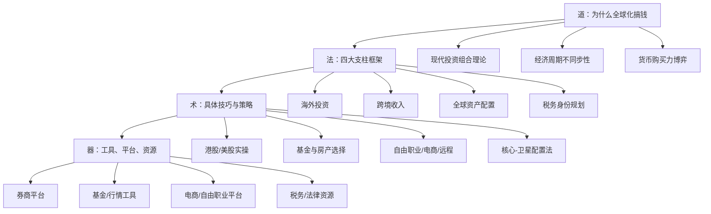
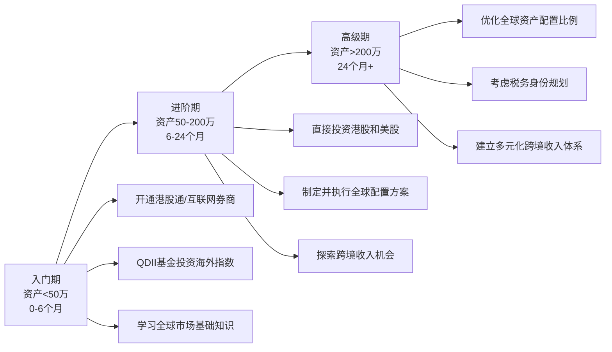
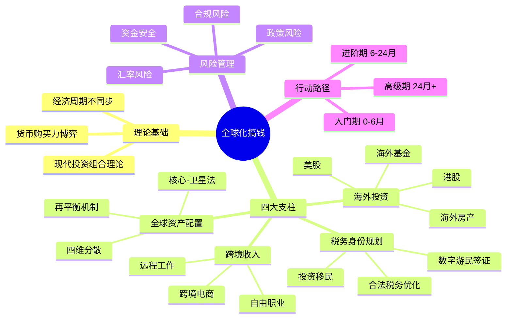

# 第34章 本章小结

> "不要把所有鸡蛋放在同一个国家的篮子里。"——这句话的完整版本应该是："不要把所有鸡蛋放在同一个篮子里，而且这些篮子应该分散在不同的国家、不同的资产类别、不同的货币体系中。"

本章从理论到实操、从入门到进阶，系统性地构建了全球化搞钱的完整知识体系。作为章节的收尾，本小结不是简单地罗列要点，而是帮你把零散的知识点串联成一张可以落地执行的全景图。

***

## 一、全章知识体系回顾

### 1.1 知识架构总览

本章的内容按照"道法术器"四层逻辑展开，每一层都为下一层提供支撑：

### 1.2 各节内容回顾

| 节次 | 主题 | 核心价值 | 字数量级 |
|------|------|----------|----------|
| 理论基础 | 为什么需要全球化搞钱 | 建立认知框架，理解底层逻辑 | 完整理论体系 |
| 核心技巧 | 怎么做、用什么工具 | 从开户到配置的全流程实操 | 详细步骤指南 |
| 实战案例 | 真实场景中怎么落地 | 7个不同背景的完整案例 | 数据+故事 |
| 常见误区 | 哪些坑不能踩 | 8大误区的深度剖析 | 误区→真相→方案 |
| 练习方法 | 如何巩固所学 | 7个渐进式练习，12周计划 | 可执行模板 |
| 深度拓展 | 高阶知识延伸 | 经济学分析、支付架构、税务合规、政治风险、数字货币 | 专业深度内容 |

***

## 二、核心框架速查

### 2.1 四大支柱详解回顾

全球化搞钱的核心框架由四大支柱构成，每个支柱解决不同层面的需求：

**支柱一：海外投资——用钱生钱跨越国界**

这是最直接的全球化搞钱方式。本章详细讲解了四条路径：

- **港股投资**：AH股溢价机会（同公司H股通常比A股便宜20%-50%）、高股息蓝筹（股息率5%-8%）、新经济龙头（腾讯、美团等）、打新中签率高
- **美股投资**：全球最成熟的资本市场，科技巨头（AAPL、MSFT、NVDA等）和指数ETF（SPY、QQQ、VTI）是核心标的，历史年化收益约10%
- **海外基金**：QDII基金（100元起投，支付宝可买）、Vanguard/BlackRock等国际基金公司产品、智能投顾（Betterment等）
- **海外房产**：泰国曼谷（租金回报5%-7%）、日本东京（4%-6%）、葡萄牙（黄金签证优势）等，需关注法律、汇率、管理成本和税务

**支柱二：跨境收入——劳动收入的全球化**

让劳动收入突破地理边界，以美元/欧元计价，天然具有货币对冲效果：

- **海外自由职业**：Upwork（综合，佣金20%→10%→5%）、Fiverr（创意服务）、Toptal（高端技术，无佣金），收入预期$20-200/小时不等
- **跨境电商**：Amazon FBA（启动资金3-5万）、Shopify独立站（1-3万），利用中国供应链优势
- **远程工作**：Remote.co、We Work Remotely等平台，薪资通常高于国内同岗位，主要挑战是时差和语言

**支柱三：全球资产配置——系统化的风险管理**

不是买几只海外股票就叫全球配置，而是一套系统框架：

- **四维分散**：地域分散、资产类别分散、货币分散、时间分散（定投）
- **核心-卫星法**：核心资产（60%-70%，宽基指数+高评级债券）+卫星资产（30%-40%，行业ETF+个股+另类资产）
- **经典配置模型**：保守型（股30债50另10现10）、平衡型（股50债30另15现5）、进取型（股70债15另10现5）
- **地域参考**（进取型）：中国40%、美国30%、其他发达市场15%、新兴市场15%

**支柱四：税务身份规划——合法节税的高级玩法**

全球化搞钱的最高阶阶段，核心概念包括：

- **全球征税 vs 属地征税**：中国、美国对税务居民全球收入征税；新加坡、香港只对境内收入征税
- **三条路径**：投资移民（葡萄牙黄金签证、新加坡GIP）、数字游民签证（50+国家推出）、合法税务优化（利用税收协定避免双重征税）
- **底线**：中国不承认双重国籍，中国公民有义务申报全球收入，逃税是违法行为

### 2.2 理论基础三大支柱

支撑全球化搞钱的经济学理论：

| 理论 | 核心观点 | 对全球化搞钱的意义 |
|------|----------|-------------------|
| 现代投资组合理论（MPT） | 持有低相关性资产可降低风险不降收益 | 全球配置使夏普比率提升20%-40% |
| 经济周期不同步性 | 各国经济周期不同步 | A股跌时美股可能涨，天然对冲 |
| 货币购买力博弈 | 不同货币长期购买力变化差异大 | 多币种配置对冲单一货币风险 |

***

## 三、实战案例核心启示

本章通过7个不同背景的真实案例，覆盖了全球化搞钱的主要场景：

### 3.1 案例全景图

| 案例 | 人物画像 | 核心路径 | 关键成果 |
|------|----------|----------|----------|
| 案例一 | A股投资者 | 从纯A股到全球配置 | 风险分散，收益波动降低 |
| 案例二 | 程序员 | 跨境自由职业 | 美元收入，汇率对冲 |
| 案例三 | 跨境电商卖家 | Amazon FBA从0到月销10万美元 | 供应链优势变现 |
| 案例四 | 数字游民 | 税务身份规划 | 合法节税+生活自由 |
| 案例五 | 长期投资者 | 全球资产配置实践 | 复利增长+风险控制 |
| 案例六 | 退休人士 | 全球养老规划 | 多币种养老现金流 |
| 案例七 | 内容创作者 | 全球化变现 | 多平台多语言收入 |

### 3.2 跨案例共性规律

从7个案例中可以提炼出以下共性规律：

**第一，循序渐进是铁律。** 没有一个成功案例是一步到位的。从A股投资者到全球配置者，从零收入到月销10万美元，每个案例都经历了"小规模试水→验证模式→逐步扩大"的过程。

**第二，信息优势决定回报。** 程序员做跨境自由职业成功，是因为他的技术能力本身就是信息优势。跨境电商卖家成功，是因为他深入了解中国供应链。在自己有信息优势的领域切入，成功率远高于盲目跟风。

**第三，合规是长期生存的基础。** 案例四中的数字游民在做税务规划时，首先确保的是合法合规。任何试图走捷径的做法，在CRS全球信息交换的今天，风险远大于收益。

**第四，风险管理比收益追求更重要。** 案例五中的长期投资者，核心方法论不是"选对标的"，而是"做好配置、控制回撤"。全球配置降低最大回撤约30%-50%，这个数据比追求高收益更有价值。

***

## 四、八大误区速查表

本章详细剖析了8个常见误区，这里提供速查表供日常对照：

| # | 误区 | 核心问题 | 正确理念 | 检查频率 |
|---|------|----------|----------|----------|
| 1 | 海外投资一定比国内好 | 盲目崇拜 | 国内为基础，海外为补充 | 每次投资决策前 |
| 2 | 开户就等于成功 | 重形式轻实质 | 投资决策才是核心 | 开户后立即审视 |
| 3 | 忽视税务合规 | 侥幸心理 | 合规是底线，CRS下信息透明 | 每季度检查 |
| 4 | 过度集中单一市场 | 伪分散 | 真正的地域和资产分散 | 每月检查持仓 |
| 5 | 追求短期暴利 | 急功近利 | 长期视角，以年为单位 | 每次想交易时 |
| 6 | 忽视资金安全 | 贪图便利 | 正规渠道，了解存款保险 | 每次选择平台时 |
| 7 | 盲目追求税务优化 | 过度贪婪 | 合法适度，专业咨询 | 每次规划税务时 |
| 8 | 只适合有钱人 | 自我设限 | QDII基金100元起投 | 想放弃时 |

**误区纠正的核心逻辑：** 全球化搞钱的本质是风险管理，不是收益最大化。所有误区的根源都是把"收益"放在了"安全"前面。

***

## 五、风险控制清单

在进行任何全球化搞钱操作之前，请逐项检查：

### 5.1 合规类风险

- [ ] 了解并遵守中国外汇管理规定（个人年度5万美元购汇额度）
- [ ] 依法申报海外收入和资产（中国税务居民全球征税义务）
- [ ] 了解CRS信息交换机制（100+国家参与，信息自动交换）
- [ ] 保留完整的投资和交易记录（至少保存5-7年）
- [ ] 不使用地下钱庄等非法换汇渠道
- [ ] 涉及复杂税务问题时咨询专业税务顾问

### 5.2 资金安全类风险

- [ ] 资金分散在多个正规持牌机构（不把所有资金放一家）
- [ ] 选择的券商/平台持有正规金融牌照
- [ ] 了解目标国家的存款保险制度和投资者保护机制
- [ ] 不相信异常高收益承诺（年化超过15%就要高度警惕）
- [ ] 设置账户安全措施（两步验证、登录提醒等）

### 5.3 投资类风险

- [ ] 资产分布在多个国家和资产类别（真正的分散）
- [ ] 持有多种货币计价的资产（货币分散）
- [ ] 了解所投资市场的交易规则、费率和税务影响
- [ ] 设定合理的预期收益和可承受的最大回撤
- [ ] 定期检视和再平衡投资组合（至少每季度一次）
- [ ] 有足够的应急资金（不把所有钱都投入投资）

### 5.4 操作类风险

- [ ] 了解资金出入境的合规渠道和限制
- [ ] 保留所有跨境交易的凭证和记录
- [ ] 了解各平台的出入金流程、时间和费用
- [ ] 有应对突发情况的预案（如平台故障、政策变化）

***

## 六、分阶段行动路线图

### 6.1 三阶段路线图

### 6.2 入门阶段（资产<50万，0-6个月）

**核心目标：** 建立全球化投资的认知和基础设施

**第1-2个月：知识储备**
- 阅读《全球资产配置》（Meb Faber），建立理论框架
- 每天花10分钟浏览英文财经网站（Bloomberg、Reuters）
- 了解港股通、QDII基金等合规投资渠道的基本规则
- 完成本章练习一（全球资产配置自我评估）

**第3-4个月：开户与试水**
- 选择一家互联网券商（富途、老虎、盈透三选一），完成开户
- 通过QDII基金买入第一只海外指数基金（如标普500指数基金，100元起投）
- 熟悉平台操作，了解交易规则、费率和汇率
- 完成本章练习二（海外投资平台实操体验）

**第5-6个月：建立习惯**
- 开始每月定投海外指数基金（金额根据自身情况，500元起即可）
- 建立每日10分钟的全球市场关注习惯
- 完成本章练习四（全球市场研究实践）的前几周内容
- 检视第一次换汇和投资的全过程，记录心得

### 6.3 进阶阶段（资产50-200万，6-24个月）

**核心目标：** 构建真正的全球资产配置组合，探索跨境收入

**第7-12个月：扩大投资范围**
- 开通港股通（50万门槛）或通过互联网券商直接投资港股
- 开始投资美股个股（从大盘股如AAPL、MSFT开始）或美股ETF（SPY、VOO）
- 制定正式的全球资产配置方案（参考核心-卫星法）
- 完成本章练习七（全球资产配置模拟）

**第13-18个月：优化配置**
- 根据实际投资经验调整配置比例
- 增加债券类和另类资产（黄金、REITs等）
- 开始关注汇率变化对持仓的影响
- 完成本章练习五（汇率风险管理实践）

**第19-24个月：探索跨境收入**
- 评估自身技能的跨境变现潜力（完成练习三）
- 如有兴趣，开始在Upwork等平台尝试接单
- 如有兴趣，研究跨境电商的可行性（完成练习六）
- 建立完整的投资记录和税务档案

### 6.4 高级阶段（资产>200万，24个月以上）

**核心目标：** 系统化优化全球资产配置，建立多元收入体系

- 全面优化全球资产配置比例，引入更多资产类别（私募、风投、海外房产等）
- 研究税务身份规划的可行性和合规路径
- 建立稳定的跨境收入渠道（自由职业、电商、远程工作中的至少一项）
- 定期聘请专业税务顾问审查合规状况
- 关注数字货币和新兴资产类别的配置机会（控制在总资产5%-10%以内）
- 建立全球银行账户体系（香港、新加坡等金融中心的银行账户）

***

## 七、关键数字速查

以下是本章涉及的核心数字，建议保存为快速参考：

| 项目 | 数字 | 说明 |
|------|------|------|
| 个人年度换汇额度 | 5万美元 | 中国外汇管理局规定，无需审批 |
| 港股通开户门槛 | 50万人民币 | 证券账户+资金账户合计 |
| QDII基金起投 | 100元人民币 | 通过支付宝、天天基金等平台 |
| 互联网券商开户 | 无资金门槛 | 富途、老虎、盈透等 |
| 美股指数历史年化 | 约10% | 标普500长期年化收益 |
| 全球配置降低回撤 | 30%-50% | 相比单一市场，最大回撤降幅 |
| CRS参与国家/地区 | 100+ | 共同申报准则，自动交换税务信息 |
| Amazon FBA启动资金 | 3-5万人民币 | 最低启动成本 |
| Shopify独立站启动 | 1-3万人民币 | 最低启动成本 |
| 自由职业初级时薪 | $20-50/小时 | 初级程序员水平 |
| 自由职业高级时薪 | $80-200/小时 | 高级全栈开发水平 |
| 建议数字货币占比 | 5%-10% | 高风险资产，严格控制比例 |

***

## 八、学习资源体系

### 8.1 书籍推荐

**入门必读：**
- 《全球资产配置》——Meb Faber：全球配置的入门经典，用数据说话
- 《投资最重要的事》——霍华德·马克斯：投资思维的底层框架
- 《穷查理宝典》——查理·芒格：多元思维模型，投资之外的智慧

**进阶阅读：**
- 《漫步华尔街》——伯顿·马尔基尔：指数投资的理论基础
- 《聪明的投资者》——本杰明·格雷厄姆：价值投资的圣经
- 《周期》——霍华德·马克斯：理解经济和市场周期

**专业深入：**
- 《国际税收》——相关教材：理解跨境税务的基本框架
- OECD CRS相关文件：了解全球税务透明化的规则细节

### 8.2 工具与平台

**投资类：**

| 类别 | 平台 | 特点 | 适合人群 |
|------|------|------|----------|
| 港股/美股 | 富途牛牛 | 中文界面，社区活跃 | 入门投资者 |
| 港股/美股 | 老虎证券 | 打新功能强 | 港股打新爱好者 |
| 港股/美股 | 盈透证券（IB） | 费率最低，标的最全 | 进阶/专业投资者 |
| QDII基金 | 天天基金/支付宝 | 100元起投，操作简单 | 完全新手 |
| 全球基金 | Vanguard官网 | 费率极低（0.03%-0.20%） | 长期投资者 |

**跨境收入类：**

| 类别 | 平台 | 特点 | 适合人群 |
|------|------|------|----------|
| 自由职业 | Upwork | 综合性最强，客户质量高 | 各类专业人士 |
| 自由职业 | Fiverr | 创意服务为主 | 设计师、视频创作者 |
| 跨境电商 | Amazon FBA | 流量大，物流成熟 | 有供应链资源的卖家 |
| 跨境电商 | Shopify | 品牌自主性强 | 想建品牌的卖家 |
| 远程工作 | We Work Remotely | 纯远程职位 | 各类远程工作者 |

**信息类：**

| 类别 | 平台 | 用途 |
|------|------|------|
| 行情数据 | 富途牛牛/老虎证券 | 港股美股实时行情 |
| 基金筛选 | 晨星（Morningstar） | 基金评级和筛选 |
| 全球新闻 | Bloomberg/Reuters | 全球市场新闻 |
| 投资社区 | 雪球 | 中文投资讨论 |
| 出海社区 | 即刻 | 出海/远程工作经验分享 |

### 8.3 信息源建设

全球化搞钱需要持续的信息输入，建议建立以下信息获取习惯：

- **每日（10分钟）**：浏览一个英文财经网站，关注你持仓市场的新闻
- **每周（30分钟）**：查看主要指数周度表现，阅读一篇深度分析文章
- **每月（2小时）**：深入研究一个感兴趣的市场或行业，撰写研究笔记
- **每季度（半天）**：全面检视投资组合，评估再平衡需求，审查合规状况

***

## 九、常见问题速答

**Q1：我没有50万，能开始全球化投资吗？**
可以。QDII基金100元起投，互联网券商无资金门槛。50万只是港股通的门槛，不是全球化投资的门槛。

**Q2：我英语不好，能做跨境自由职业吗？**
英语能力是重要加分项但不是绝对门槛。技术类工作（编程、设计）可以用作品说话，翻译类工作本身就是中文优势。建议至少能写清晰的英文邮件。

**Q3：海外投资赚的钱需要在中国交税吗？**
需要。中国税务居民有义务申报全球收入。股息、利息、资本利得等海外投资收益都需要依法申报。CRS机制下，海外金融账户信息会被自动交换给中国税务机关。

**Q4：人民币贬值时我该怎么办？**
这正是全球化搞钱的意义所在。如果你持有美元资产，人民币贬值时你的美元资产换算成人民币会升值。多币种配置本身就是对冲汇率风险的方式。

**Q5：跨境电商现在还有机会吗？**
有机会但竞争加剧。关键是找到差异化的产品和细分市场，而不是盲目跟热销品。利用中国供应链优势，聚焦小众但有真实需求的品类，仍然可以找到利润空间。

**Q6：我应该先投资还是先做跨境收入？**
取决于你的资源禀赋。有闲置资金→先投资（门槛低、被动收入）；有专业技能→先做跨境收入（主动收入、积累经验）；两者都有→同步进行，但要控制总风险。

***

## 十、全局思维导图

将本章所有内容浓缩为一张思维导图，便于回顾和查阅：

***

## 最后的话

全球化搞钱不是一夜暴富的捷径，而是一种长期的财富管理思维方式。回顾全章，我们可以提炼出四条核心原则：

**第一，安全第一，收益第二。** 所有全球化搞钱的行为都必须在合法合规的框架内进行。合规是底线，不是可选项。在CRS全球信息交换的今天，侥幸心理的成本远高于合规的成本。

**第二，分散是免费的午餐。** 全球配置可以降低30%-50%的最大回撤，这个效果不需要额外的成本，只需要你把资金从一个篮子分散到多个篮子里。这是现代投资组合理论给普通投资者最好的礼物。

**第三，从你能做的开始。** 100元可以买QDII基金，0元可以开互联网券商账户，一门技能可以开始跨境接单。不要等"有钱了"再开始，现在就迈出第一步。小规模试水、积累经验、逐步扩大——这是所有成功案例的共同路径。

**第四，持续学习，保持耐心。** 全球市场瞬息万变，今天的最优配置明天可能需要调整。建立每日10分钟的全球市场关注习惯，每季度全面检视一次投资组合，用年为单位衡量投资成果。全球化搞钱是一场马拉松，不是百米冲刺。

在这个全球化的时代，你的财富不应该只局限在一个国家。打开视野，拥抱全球机会，让你的钱在全球范围内为你工作。

***

> 📌 **本章关键数字速览**
> - 个人年度换汇额度：5万美元
> - 港股通开户门槛：50万人民币
> - QDII基金起投：100元人民币
> - 美股指数基金历史年化收益：约10%
> - 全球配置降低最大回撤：约30%-50%
> - CRS信息交换参与国家/地区：100+
> - 互联网券商开户门槛：无资金限制
> - 建议数字货币配置占比：5%-10%

***

*全球化搞钱的旅程，从阅读本章的第一行文字就已经开始了。接下来，是时候把知识变成行动了。*
