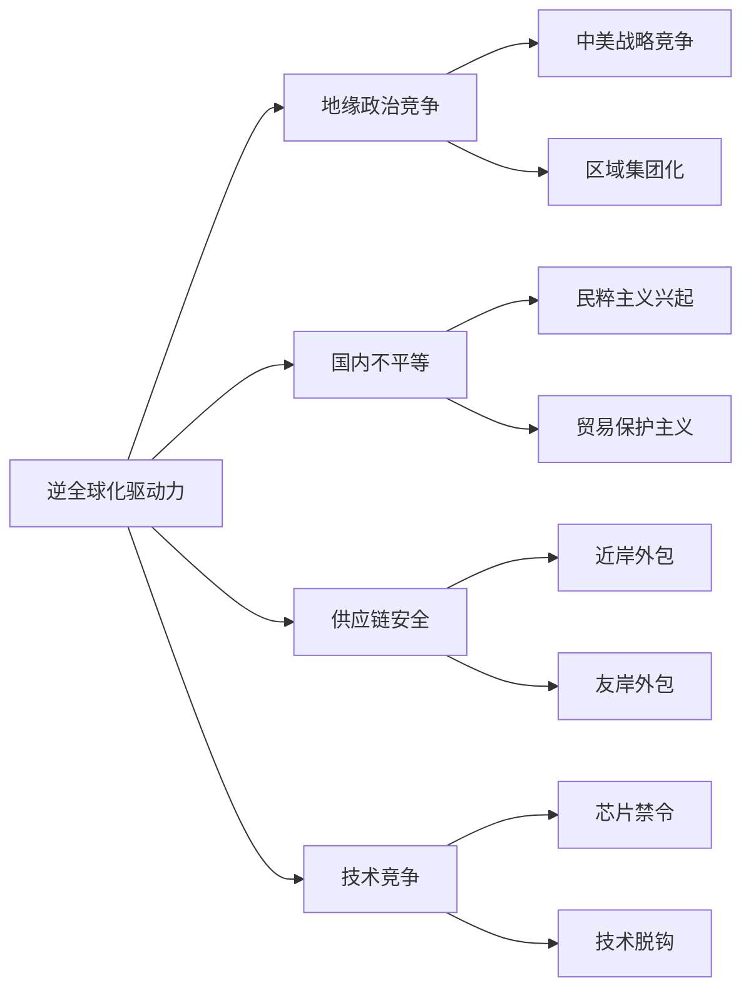
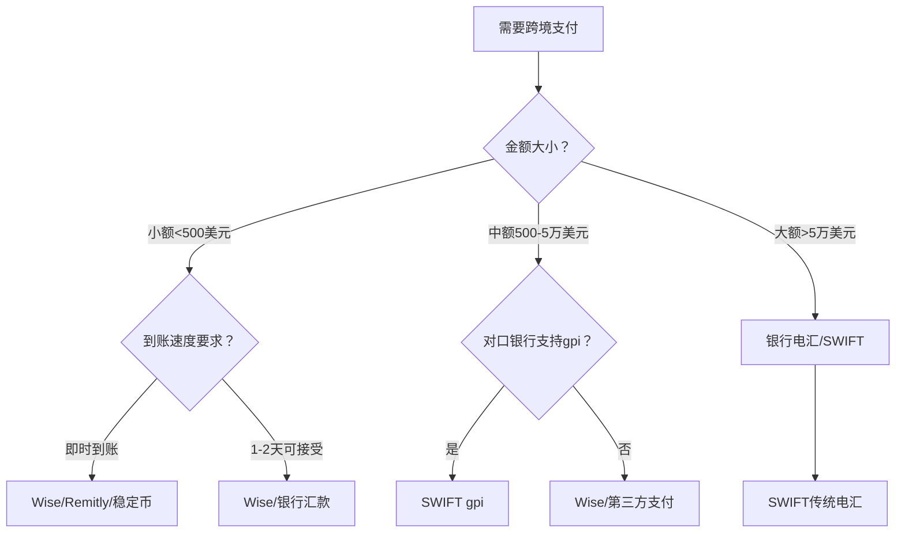
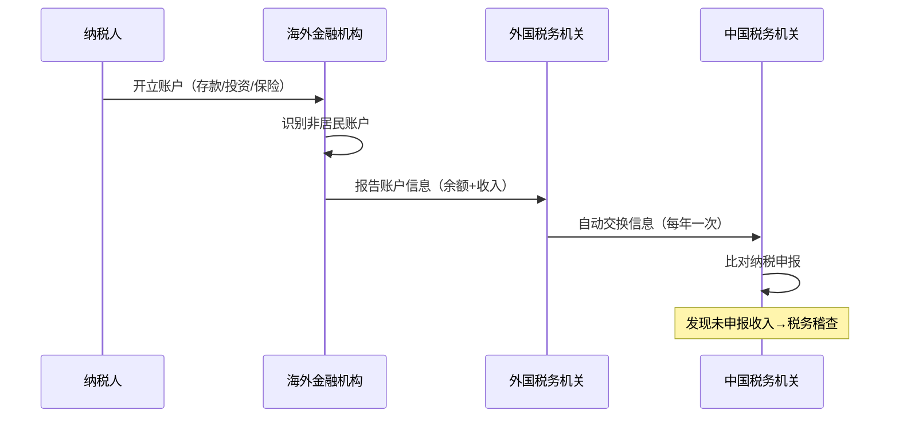
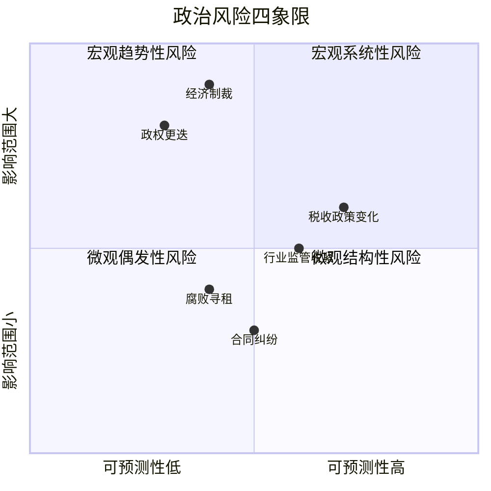
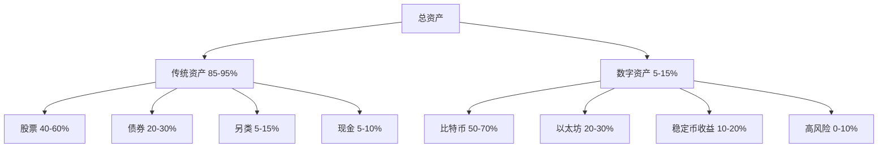

# 全球化搞钱深度拓展

> 本章是整本书中面向高阶读者的延伸内容。如果你已经完成了前面的理论学习和实操练习，这里将带你进入全球化的"深水区"——从经济学原理到技术架构，从税务合规的政治博弈到数字货币的前沿探索，每一个主题都力求做到"知其然，更知其所以然"。

```mermaid
graph TD
    A["深度拓展知识图谱"] --> B["全球化的经济学分析"]
    A --> C["跨境支付的技术架构"]
    A --> D["全球税务合规框架"]
    A --> E["国际投资的政治风险"]
    A --> F["数字货币对全球搞钱的影响"]
    A --> G["国际商业架构设计"]
    A --> H["信息优势与套利策略"]

    B --> B1["比较优势理论"]
    B --> B2["新贸易理论"]
    B --> B3["逆全球化趋势"]

    C --> C1["SWIFT/代理银行"]
    C --> C2["区块链支付网络"]
    C --> C3["CBDC多边桥"]

    D --> D1["CRS全球透明化"]
    D --> D2["FATCA域外执法"]
    D --> D3["反避税架构"]

    E --> E1["政治风险评估"]
    E --> E2["风险对冲工具"]
    E --> E3["地缘政治博弈"]

    F --> F1["稳定币生态"]
    F --> F2["DeFi去中心化金融"]
    F --> F3["Web3与创作者经济"]

    G --> G1["离岸公司架构"]
    G --> G2["信托与基金"]
    G --> G3["知识产权持有"]

    H --> H1["信息套利"]
    H --> H2["跨境套利"]
    H --> H3["税务套利"]
```



***

## 一、全球化的经济学分析

### 1.1 全球化的理论基础

全球化是指商品、服务、资本、信息和人员跨越国界流动日益增加的过程。理解全球化的经济学理论，不是为了考试拿高分，而是为了在投资决策中拥有"看透本质"的能力——当你理解了为什么全球化会发生、什么力量在推动它、什么因素会阻碍它，你就能比大多数人更早地识别机会和风险。

**比较优势理论**

大卫·李嘉图（David Ricardo）在1817年提出的比较优势理论是全球化的理论基石。该理论的核心逻辑是：即使一个国家在所有商品的生产上都不如另一个国家有效率，两国仍然可以通过专业化生产和贸易实现互利。

举一个具体的例子：假设中国生产一件衣服需要2小时，生产一部手机需要10小时；美国生产一件衣服需要1小时，生产一部手机需要5小时。表面上看，美国在两种产品上都有"绝对优势"。但如果中国专门生产衣服（机会成本是1/5部手机），美国专门生产手机（机会成本是5件衣服），然后进行贸易，两国的总产出都会增加。

**对个人搞钱的启示**：比较优势理论告诉我们，不要试图在所有领域都做到最好，而应该找到自己有相对优势的领域，然后通过贸易（服务外包、跨境合作）来获取其他领域的资源。一个中国程序员在编程上可能不如硅谷顶尖工程师，但如果他的时薪只有对方的1/3，那么在中低端开发任务上他就有比较优势。

**要素价格均等化理论**

赫克歇尔-俄林模型（H-O模型）预测，自由贸易将导致各国生产要素（劳动、资本、土地）的价格趋于一致。理论上，全球化应该缩小发达国家和发展中国家之间的工资差距。

现实中的部分验证：中国、印度等国的工资水平在过去几十年中确实有所提升，但要素价格均等化的速度远慢于理论预测。原因包括：

- **劳动力流动性受限**：国际移民壁垒远高于商品和资本的流动壁垒
- **技术扩散不均匀**：核心技术往往被发达国家垄断
- **制度差异**：法治水平、产权保护、金融体系等制度差异影响要素价格
- **路径依赖**：产业集群效应使得生产要素的重新配置需要很长时间

**对个人搞钱的启示**：要素价格均等化的缓慢进程，恰恰为"跨境套利"提供了长期窗口。你可以利用不同国家之间的工资差异、资本成本差异、生活成本差异来获取超额收益——这正是远程工作、跨境电商、全球资产配置的经济学基础。

**新贸易理论**

保罗·克鲁格曼（Paul Krugman）的新贸易理论解释了为什么相似的国家之间贸易量最大的现象（如德国和法国之间的汽车贸易）。该理论强调三个核心机制：

1. **规模经济**：生产规模越大，单位成本越低。全球化扩大了市场规模，使企业能够实现更大的规模经济
2. **产品差异化**：消费者偏好多样化，即使功能相似的产品也有不同的品牌、设计、服务体验
3. **网络效应**：某些产品（如社交平台、操作系统）的价值随着用户数量增加而增加

**对个人搞钱的启示**：新贸易理论揭示了"赢者通吃"的市场逻辑。在全球化市场中，头部产品和服务会获得不成比例的回报。这意味着：如果你要做跨境生意，要么做到细分领域的头部，要么找到一个大玩家忽略的利基市场。

**新兴古典经济学视角**

杨小凯等学者发展的新兴古典经济学从"专业化经济"的角度解释全球化。该理论认为，全球化本质上是专业化分工在全球范围内的扩展。随着交易成本（运输、通信、信任成本）的下降，专业化分工的范围从村庄→城市→国家→全球不断扩展。

这个视角的实操价值在于：**交易成本的下降趋势是不可逆的**。互联网降低了信息获取成本，跨境电商降低了国际贸易门槛，数字货币降低了跨境支付成本。每一次交易成本的下降，都会释放新的专业化机会——而最先抓住这些机会的人，就能获得超额回报。

### 1.2 全球化的利益分配

全球化的利益分配从来不是均匀的，理解这一点对于定位自己的搞钱策略至关重要。

**全球化的赢家与输家分析：**

| 群体 | 为什么赢/输 | 具体表现 | 对个人搞钱的启示 |
|------|------------|---------|-----------------|
| 发展中国家的工人 | 劳动密集型产业转移创造就业 | 中国制造业工人工资30年增长20倍 | 发展中国家的消费升级是投资机会 |
| 跨国企业 | 市场扩大+成本降低 | 苹果70%收入来自美国以外 | 投资全球化程度高的企业 |
| 消费者 | 商品价格降低+选择增加 | 中国制造使全球消费品价格下降30%-50% | 利用价格差异做跨境电商 |
| 投资者 | 投资机会和分散化可能增加 | 全球配置的夏普比率提升20%-40% | 全球资产配置降低风险 |
| 发达国家低技能工人 | 面发展中国家低工资劳动力竞争 | 美国制造业就业人数从1979年1940万降至2023年1280万 | 低技能工作面临长期压缩 |
| 传统制造业社区 | 工厂外迁导致失业和社区衰落 | 美国"铁锈带"城市人口流失 | 关注产业转移目的地的投资机会 |
| 某些发展中国家的环境 | 为吸引外资降低环保标准 | 部分东南亚国家的污染产业转移 | ESG投资的机会与风险 |

**利益分配的核心矛盾**：全球化创造了总蛋糕的增量，但分配极不均匀。理解这个矛盾，你就能理解为什么逆全球化会兴起，为什么某些政策会出台，从而更好地预判政策走向对投资的影响。

### 1.3 逆全球化趋势与结构性机会

近年来，逆全球化（Deglobalization）的趋势明显增强。中美贸易摩擦、英国脱欧、新冠疫情引发的供应链重组等事件，都表明全球化正在经历重大调整。

**逆全球化的四大驱动因素：**



**地缘政治竞争**：大国之间的战略竞争加剧。中美关系从"合作为主"转向"竞争为主"，影响了全球供应链布局、技术合作、资本流动等多个维度。

**国内不平等**：全球化虽然降低了全球不平等（国与国之间），但加剧了部分国家内部的不平等。这种不满情绪催生了民粹主义和贸易保护主义。

**供应链安全**：新冠疫情暴露了过度依赖全球供应链的风险。"Just-in-time"（准时制）库存管理向"Just-in-case"（以防万一）转变，企业开始将供应链多元化甚至回迁。

**技术竞争**：关键技术领域（半导体、AI、量子计算）成为国家安全考量的核心。技术脱钩正在重塑全球科技产业链。

**对个人搞钱的结构性机会：**

逆全球化不是全球化的终结，而是全球化的"重构"。这个重构过程创造了大量新的投资和商业机会：

1. **供应链重组机会**：制造业从中国向东南亚、印度、墨西哥转移，带动了这些地区的基础设施建设、物流、工业园区等投资机会。具体表现为：越南工业园区土地价格2020-2025年上涨了200%-300%；印度制造业FDI（外国直接投资）在2023年达到创纪录的445亿美元。

2. **区域化替代全球化**：RCEP（区域全面经济伙伴关系协定）、CPTPP（全面与进步跨太平洋伙伴关系协定）等区域贸易协定正在重塑贸易格局。投资这些区域内的龙头企业，可以分享区域一体化红利。

3. **数字化绕过物理壁垒**：数字服务（SaaS、内容、教育、咨询）天然具有跨境属性，不受关税和物理壁垒限制。全球数字服务贸易额在2023年达到4.25万亿美元，年增长率约8%。

4. **国产替代浪潮**：技术脱钩催生了中国在半导体、操作系统、数据库、工业软件等领域的国产替代需求。这个领域的投资机会具有政策确定性和市场确定性双重支撑。

5. **近岸/友岸外包**：美国推动"近岸外包"（nearshoring），将供应链从亚洲转移到墨西哥等邻近国家。墨西哥在2023年首次超过中国成为美国最大的贸易伙伴。

***

## 二、跨境支付的技术架构

跨境支付是全球化搞钱的"血管系统"——钱流动的速度、成本和安全性，直接决定了你全球化搞钱的效率。理解跨境支付的技术架构，不仅能帮你选择最优的支付方案，还能帮你发现隐藏的商业机会。

### 2.1 传统跨境支付体系

**SWIFT网络**

SWIFT（环球银行金融电信协会）是全球最主要的跨境支付信息传输网络，连接了全球200多个国家和地区的11,000多家金融机构。SWIFT本身不处理资金转移，而是提供标准化的金融报文传输服务——它就像全球银行之间的"快递系统"，传递的是支付指令而非实际资金。

**SWIFT的核心技术特征：**

- **报文标准**：使用MT（Message Type）报文格式，如MT103（个人汇款）、MT202（银行间汇款）
- **安全机制**：SWIFTNet使用PKI（公钥基础设施）加密，每个机构有唯一识别码（BIC/SWIFT Code）
- **日处理量**：每天处理约4200万条报文，涉及约5万亿美元的资金流动
- **网络架构**：分布式架构，主要数据中心位于荷兰和美国

**代理银行模式**

传统的跨境支付依赖代理银行网络（Correspondent Banking）。当A国的银行需要向B国的银行转账时，通常需要通过一家或多家中间银行进行中转。

```text
[汇款人] → [汇款行A] → [代理行X] → [代理行Y] → [收款行B] → [收款人]
   ↑           ↑            ↑            ↑           ↑
  手续费①    手续费②     手续费③      手续费④     到账金额
```

每经过一家中间银行，都会产生手续费和处理时间。一笔从中国到非洲的汇款，可能经过3-4家银行中转，总费用可能达到汇款金额的7%-10%。

**传统跨境支付的五大痛点：**

| 痛点 | 具体表现 | 量化影响 |
|------|---------|---------|
| 速度慢 | 需要经过多个银行中转，每一步都需要合规审查 | 通常3-5个工作日，复杂路径可达7-10天 |
| 费用高 | 每经过一家银行都要收取手续费和汇率差价 | 平均每笔25-35美元，小额汇款费用占比可达5%-10% |
| 透明度低 | 发送方和接收方难以实时追踪交易状态 | 无法预知确切到账时间和最终到账金额 |
| 合规复杂 | 需要遵守多个司法管辖区的AML/KYC规定 | 合规审查可能导致汇款被退回或冻结 |
| 汇率不透明 | 中间行自行决定汇率，通常比市场汇率差1%-3% | 一笔1万美元的汇款可能损失100-300美元的汇率差 |

### 2.2 新型跨境支付技术

**Ripple（RippleNet）**

Ripple是一个基于区块链技术的跨境支付网络，旨在解决传统跨境支付的效率问题。RippleNet的核心产品包括：

- **xCurrent**：银行间的实时结算解决方案，不使用加密货币
- **On-Demand Liquidity（ODL）**：使用XRP作为桥梁货币，实现近乎实时的跨境支付
- **xVia**：企业和支付提供商的标准化API接口

Ripple的技术优势在于：交易确认时间3-5秒，手续费不到1美分，支持实时端到端追踪。但其局限性也很明显：XRP的价格波动性限制了其作为桥梁货币的可靠性，且Ripple面临美国SEC的监管不确定性。

**SWIFT gpi**

SWIFT推出的gpi（全球支付创新）服务是对传统SWIFT网络的重大升级。gpi的核心改进包括：

- **端到端追踪**：通过唯一的UETR（端到端交易参考号）实现全程追踪
- **速度提升**：gpi支付可以在几分钟到几小时内完成（相比传统3-5天）
- **费用透明**：发送前可以看到所有中间行的费用预估
- **数据完整性**：确保汇款信息完整传递，减少因信息缺失导致的退回

截至2024年，SWIFT gpi已经覆盖了全球89%的跨境支付交易额。对于个人用户来说，如果你的银行支持gpi，你的跨境汇款体验会显著改善。

**中国跨境支付系统（CIPS）**

CIPS（Cross-Border Interbank Payment System）是中国人民银行主导建设的跨境支付系统，旨在为人民币国际化提供支付基础设施。CIPS的核心特点：

- **直接参与者**：截至2024年超过100家，包括中国主要银行和部分外资银行
- **间接参与者**：超过1,400家，覆盖100多个国家和地区
- **运营时间**：5×24小时+4小时，覆盖全球主要时区
- **报文标准**：兼容ISO 20022国际标准

CIPS的战略意义在于：为人民币跨境支付提供了独立于SWIFT的通道，在地缘政治紧张时提供了备选方案。对于个人搞钱的启示是：未来人民币国际化的推进，将为人民币计价的跨境投资和贸易创造更多便利。

**多边央行数字货币桥（mBridge）**

mBridge是国际清算银行（BIS）创新枢纽、中国人民银行、香港金管局、泰国央行和阿联酋央行联合推进的多边CBDC项目。该项目使用定制的区块链平台（mBridge Ledger），实现了多个央行数字货币之间的直接跨境支付。

mBridge的技术突破在于：绕过了代理银行网络，实现了央行数字货币之间的点对点结算。试点结果显示，跨境支付可以在几秒内完成，成本接近于零。如果mBridge大规模推广，将从根本上改变跨境支付的架构。

### 2.3 稳定币与跨境支付

稳定币（Stablecoin）在跨境支付领域展现出巨大潜力，特别是在银行基础设施不发达的地区。

**USDT和USDC的跨境支付应用场景：**

- **新兴市场汇款**：在非洲、东南亚等地区，稳定币被越来越多地用于跨境汇款。尼日利亚、肯尼亚等国的年轻人使用USDT向海外家人汇款，成本比传统汇款低60%-80%。
- **跨境电商结算**：部分跨境电商卖家使用USDT进行国际结算，避免了传统银行结算的延迟和费用。
- **数字游民收款**：部分自由职业者和远程工作者使用USDC接收海外客户的付款，然后通过本地交易所兑换为当地货币。

**稳定币支付的技术流程：**

```text
[付款方钱包] → [区块链网络] → [收款方钱包]
      ↑              ↑              ↑
   发送USDT      链上确认       收到USDT
   (1分钟内)    (3-5个区块)    (可立即使用)
                    ↓
              [本地交易所] → [银行账户/现金]
```

**稳定币跨境支付的风险与局限：**

| 风险类型 | 具体表现 | 应对建议 |
|---------|---------|---------|
| 监管风险 | 各国对稳定币的监管态度差异极大 | 了解所在国的稳定币监管政策 |
| 脱锚风险 | 稳定币可能偏离锚定价格 | 选择高透明度、受监管的稳定币 |
| 操作风险 | 私钥丢失、转错地址等不可逆损失 | 小额测试后再大额转账，做好私钥备份 |
| 合规风险 | 大额稳定币交易可能触发AML审查 | 保留交易记录，配合必要的KYC |
| 技术风险 | 区块链网络拥堵、智能合约漏洞 | 选择成熟稳定的区块链网络 |

### 2.4 跨境支付的实操选择矩阵

面对众多跨境支付方案，如何选择最优方案？以下决策矩阵可以帮你快速判断：



**主流跨境支付工具对比：**

| 工具 | 适用场景 | 费率 | 到账时间 | 优势 | 劣势 |
|------|---------|------|---------|------|------|
| Wise（原TransferWise） | 个人汇款、自由职业收款 | 0.3%-1% | 1-2个工作日 | 汇率透明、费率低、支持多币种账户 | 大额汇款有限制 |
| Remitly | 个人汇款到新兴市场 | 因目的地而异 | 即时-3天 | 到账速度快、支持现金取款 | 主要面向个人汇款 |
| PayPal | 电商支付、自由职业 | 3%-4.5% | 即时（PayPal内） | 买家保护、全球覆盖广 | 费率高、汇率差 |
| Payoneer | 自由职业收款、电商平台 | 1%-2% | 1-2个工作日 | 支持多平台收款、可办万事达卡 | 提现到本地银行有费用 |
| 稳定币 | 新兴市场、数字游民 | 区块链Gas费 | 3-30分钟 | 成本极低、无国界限制 | 监管不确定、需要技术知识 |
| SWIFT gpi | 企业付款、大额汇款 | 银行定价 | 1小时-1天 | 安全可靠、支持大额 | 需要银行账户、费率较高 |

**实操建议：**

1. **小额高频汇款**（如每月给海外家人汇生活费）：使用Wise或Remitly，费率低且操作简便
2. **自由职业收款**：使用Payoneer或Wise商业账户，支持从Upwork、Fiverr等平台直接收款
3. **电商结算**：根据电商平台选择（Amazon用PingPong/Payoneer，Shopify用Shopify Payments）
4. **大额企业付款**：使用SWIFT gpi或银行电汇，安全性和合规性最好
5. **新兴市场汇款**：考虑稳定币方案，特别是在银行基础设施不发达的地区

***

## 三、全球税务合规框架

税务合规是全球化搞钱的"安全底线"。在CRS全球信息自动交换的时代，侥幸心理的成本远高于合规的成本。本节不仅讲解税务合规的框架，更提供实操层面的指导。

### 3.1 CRS：全球税务透明化

共同申报准则（Common Reporting Standard，CRS）是OECD制定的全球税务信息自动交换标准。截至2024年，已有超过100个国家和地区参与CRS。CRS的实施标志着全球税务透明化时代的到来——你的海外金融资产信息，在技术上已经无法隐藏。

**CRS的完整运作机制：**



**CRS覆盖的金融信息详解：**

| 信息类别 | 具体内容 | 报告频率 |
|---------|---------|---------|
| 存款账户 | 账号、余额、利息收入 | 年度 |
| 托管账户 | 账号、资产余额、股息/利息收入、出售所得 | 年度 |
| 保险合同 | 现金价值、年金收入 | 年度 |
| 股权和债权 | 持有的实体权益、收益分配 | 年度 |

**CRS不覆盖的资产类型（重要）：**

- **实物资产**：房产、艺术品、贵金属（非金融形态）
- **直接持有的公司股权**：通过公司持有的金融资产会被报告，但直接持有的公司本身不在报告范围内
- **加密货币**：目前CRS不覆盖加密货币交易所账户（但各国正在讨论将加密资产纳入CRS 2.0）
- **某些信托结构**：取决于信托的类型和设立地

**对中国纳税人的实操影响：**

中国于2018年9月首次进行CRS信息交换。这意味着，中国税务居民在海外的金融账户信息将被自动交换给中国税务机关。具体影响包括：

1. **信息完全透明**：你在香港、新加坡、瑞士等地的银行账户余额和投资收益，中国税务机关都可以获取
2. **追缴风险**：虽然目前税务机关还没有大规模追缴，但数据已经积累多年，随时可能启动稽查
3. **补报窗口**：如果你有未申报的海外收入，现在补报的代价远低于被查出后的代价
4. **合规成本**：需要聘请专业税务顾问帮助申报，但这个成本远低于逃税被罚的成本

### 3.2 FATCA：美国的域外税务执法

美国的《海外账户税收合规法案》（FATCA）是全球税务透明化的先驱，其影响范围比CRS更广、执法力度更强。

**FATCA与CRS的关键差异：**

| 维度 | FATCA | CRS |
|------|-------|-----|
| 发起方 | 美国单方面立法 | OECD多边框架 |
| 互惠性 | 单边（只要求向美国报告） | 双边（参与国之间互换） |
| 执法手段 | 对不配合机构征收30%预提税 | 无直接经济制裁手段 |
| 覆盖范围 | 全球几乎所有金融机构 | 仅参与CRS的国家/地区 |
| 合规要求 | 需要签署IGA（政府间协议）或直接与IRS签约 | 按OECD标准执行 |

**FATCA对非美国纳税人的间接影响：**

虽然FATCA主要针对美国纳税人，但它对所有人都有间接影响：

- **开户门槛提高**：全球银行为了合规FATCA，加强了所有客户的KYC审查
- **信息共享扩大**：FATCA推动了全球税务信息共享的标准化
- **合规成本转嫁**：金融机构将合规成本转嫁给所有客户（更高的账户管理费、更低的利率）

### 3.3 反避税架构（BEPS与ATAD）

OECD的BEPS（税基侵蚀和利润转移）项目和欧盟的ATAD（反避税指令）代表了全球反避税的最新趋势。这些框架对个人搞钱的影响在于：传统的离岸避税架构正在失效。

**BEPS的核心行动计划及其影响：**

1. **行动计划1（数字经济征税）**：数字服务税（DST）正在多个国家推行，影响跨境电商和数字服务提供者
2. **行动计划6（防止协定滥用）**：税收协定的"主要目的测试"（PPT）规则使得纯粹为节税而设立的架构失效
3. **行动计划13（国别报告）**：跨国企业需要向税务机关报告在每个国家的收入、利润和纳税情况

**对个人搞钱的实际影响：**

- **离岸公司架构的门槛提高**：单纯的"避税天堂"公司架构面临越来越多的挑战
- **实质性要求**：税务机关越来越关注公司的"实质性"（是否有真实办公场所、员工、经营活动）
- **受控外国公司（CFC）规则**：中国税务机关可以将离岸公司的未分配利润视同分配给中国居民股东征税

### 3.4 个人税务合规的实操框架

对于有跨境收入和资产的个人，以下是完整的税务合规实操框架：

**第一步：税务居民身份确认**

你的税务居民身份决定了你在哪个国家承担纳税义务。中国税法规定，在中国境内有住所，或者无住所而一个纳税年度内在中国境内居住累计满183天的个人，为中国税务居民。

**确认清单：**
- [ ] 过去3年在中国居住天数统计
- [ ] 是否有"住所"在中国（家庭、经济利益中心）
- [ ] 是否在其他国家构成税务居民
- [ ] 是否适用税收协定的"加权规则"来解决双重税务居民身份

**第二步：全球收入梳理**

| 收入类型 | 来源举例 | 中国税务处理 | 可能的外国税务处理 |
|---------|---------|-------------|-----------------|
| 股息收入 | 美股/港股分红 | 20%个人所得税 | 美国10%（税收协定）/香港0% |
| 利息收入 | 海外银行存款利息 | 20%个人所得税 | 因国家而异 |
| 资本利得 | 美股/港股买卖差价 | 暂免（A股类比）/具体看情况 | 美国0-20%（看持有期）/香港0% |
| 劳务收入 | 海外自由职业收入 | 20%-40%（劳务报酬） | 可能在来源国也被征税 |
| 租金收入 | 海外房产租金 | 20%财产租赁所得 | 在房产所在国通常也要纳税 |
| 特许权使用费 | 专利/版权收入 | 20% | 通常10%（税收协定） |

**第三步：税收协定利用**

中国已与100多个国家签署了避免双重征税的税收协定。合理利用税收协定可以有效降低跨境收入的总体税负。

**关键税收协定条款：**

- **股息条款**：通常将来源国预提税限制在10%（中美协定）或更低
- **利息条款**：通常限制在10%
- **特许权使用费**：通常限制在10%
- **资本利得**：通常在居民国征税（来源国免税）

**第四步：专业顾问选择**

跨境税务问题极其复杂，强烈建议聘请专业的国际税务顾问。选择标准：

- **资质**：注册税务师/注册会计师 + 国际税务经验
- **经验**：有处理中国+你所涉及国家税务问题的经验
- **网络**：有国际合作网络，能协调多国税务申报
- **费用**：通常按小时收费（500-2000元/小时），复杂项目按项目收费

**第五步：记录保存与申报**

- 保留所有跨境交易的详细记录（至少保存5-7年）
- 每年3月1日前完成个人所得税年度汇算清缴
- 如有海外收入，填写《个人所得税年度自行纳税申报表》
- 如有海外金融资产超过一定金额，需填写《个人金融账户信息报告表》

***

## 四、国际投资的政治风险

政治风险是全球化搞钱中最容易被忽视、也最难量化的风险类型。很多投资者在技术分析和基本面研究上投入大量精力，却对政治风险视而不见——直到某天一纸政令让他们的投资化为乌有。

### 4.1 政治风险的系统性框架

**政治风险的四维分类：**



**宏观政治风险（影响整个国家）：**

| 风险类型 | 典型表现 | 历史案例 | 对投资者的影响 |
|---------|---------|---------|--------------|
| 政权更迭 | 革命、政变、极端政党上台 | 2011年阿拉伯之春 | 资产被冻结或没收 |
| 经济制裁 | 国际制裁导致经济封锁 | 俄罗斯2022年被制裁 | 无法撤出资金 |
| 战争/冲突 | 军事冲突、恐怖主义 | 俄乌冲突 | 资产毁灭性损失 |
| 宏观政策剧变 | 外汇管制、国有化 | 阿根廷2001年外汇管制 | 资金无法汇出 |

**微观政治风险（针对特定行业或企业）：**

| 风险类型 | 典型表现 | 应对策略 |
|---------|---------|---------|
| 行业国有化 | 政府强制收购外资企业股权 | 投资保护协定、政治风险保险 |
| 外资限制 | 限制外资持股比例或投资领域 | 本地合资、合规架构设计 |
| 合同不履行 | 政府或国企违反合同 | 国际仲裁条款、信用证 |
| 腐败寻租 | 要求行贿或支付额外费用 | 合规制度、第三方尽调 |
| 知识产权侵犯 | 技术被强制转让或抄袭 | 专利本地注册、技术保护措施 |

### 4.2 政治风险的评估方法与工具

**定量评估工具：**

| 评估工具 | 提供机构 | 更新频率 | 覆盖范围 | 费用 |
|---------|---------|---------|---------|------|
| 世界银行WGI指标 | 世界银行 | 年度 | 200+国家/地区 | 免费 |
| EIU国家风险评级 | 经济学人智库 | 季度 | 130+国家 | 付费（$2,000+/年） |
| 主权信用评级 | 穆迪/标普/惠誉 | 不定期 | 100+国家 | 部分免费 |
| IHS Markit风险地图 | S&P Global | 月度 | 全球 | 付费 |
| PRS集团国家风险 | PRS Group | 月度 | 140个国家 | 付费（$500+/年） |

**免费但实用的评估方法：**

1. **世界银行治理指标（WGI）**：覆盖6个维度——话语权和问责、政治稳定、政府效能、监管质量、法治水平、腐败控制。数据可在 data.worldbank.org 免费获取。
2. **透明国际清廉指数（CPI）**：每年发布180个国家的腐败感知指数，是评估投资目的地腐败风险的重要参考。
3. **CIA World Factbook**：免费提供全球各国的政治、经济、社会基础数据，适合做初步筛查。
4. **Fragile States Index**：和平基金会每年发布，评估各国的脆弱性和冲突风险。

**定性评估框架（CAST框架）：**

| 维度 | 评估内容 | 信息来源 |
|------|---------|---------|
| Context（背景） | 国家历史、民族构成、宗教冲突 | 学术研究、新闻分析 |
| Actors（参与者） | 主要政治力量、利益集团、军方 | 政治分析报告 |
| Structures（结构） | 制度框架、权力分配、法治水平 | 世界银行WGI |
| Trends（趋势） | 经济走势、社会情绪、外部压力 | 经济数据、民调 |

### 4.3 政治风险的管理工具箱

**工具一：分散化投资（最重要）**

政治风险管理的第一原则就是不要把所有资金集中在单一国家。具体做法：

- **地域分散**：资金分布在至少3-5个政治风险相关性低的国家
- **资产类别分散**：在同一个国家内，也要分散到不同的资产类别
- **币种分散**：持有多种货币计价的资产，对冲单一货币的政治风险

**工具二：政治风险保险（PRI）**

| 保险提供方 | 产品特点 | 覆盖风险 | 费率范围 |
|-----------|---------|---------|---------|
| MIGA（世界银行） | 多边机构，信誉最高 | 征收、货币不可兑换、战争、违约 | 0.5%-3%/年 |
| OPIC/DFC（美国） | 美国政府机构 | 类似MIGA | 0.5%-2.5%/年 |
| 私营保险公司 | 安联、丘博等 | 灵活定制 | 1%-5%/年 |
| 中国信保 | 中国政策性保险 | 针对中国企业海外投资 | 因项目而异 |

**工具三：投资保护协定（BIT）**

双边投资保护协定（BIT）为外国投资者提供法律保护。中国已与140多个国家签署了BIT。核心保护条款包括：

- **公平公正待遇**：东道国不得对外国投资者采取歧视性措施
- **征收补偿**：如果东道国征收外国投资，必须给予"迅速、充分、有效"的补偿
- **资金自由转移**：保障投资收益可以自由汇出
- **投资者-国家争端解决（ISDS）**：投资者可以直接对东道国提起国际仲裁

**工具四：本地化策略**

通过深度本地化降低政治风险：

- **与本地合作伙伴合资**：降低"外资"标签带来的敏感性
- **雇用本地员工**：为当地创造就业，增加政治资本
- **参与社区发展**：企业社会责任（CSR）项目可以提升企业形象
- **低调行事**：避免过度高调，减少政治关注度

### 4.4 中国投资者面临的政治风险实战分析

中国企业在"走出去"过程中面临独特的政治风险，这些风险源于中国在全球政治格局中的特殊地位。

**风险一：安全审查加强**

多个国家加强了对中国投资的安全审查：

- **美国CFIUS**：外国投资委员会对涉及国家安全的外国投资进行审查，近年来审查范围不断扩大，涵盖科技、金融、房地产等多个领域
- **欧盟FDI筛查框架**：2020年建立的欧盟外国直接投资筛查框架，要求成员国建立FDI审查机制
- **澳大利亚FIRB**：外国投资审查委员会对外国投资的审查日趋严格

**风险二：合规双重压力**

中国投资者需要同时遵守中国和东道国的法律法规，面临"两难困境"：

- 中国的资本管制限制资金出境
- 东道国的反洗钱要求资金来源透明
- 中国的数据安全法限制数据出境
- 东道国的监管要求信息披露

**风险三：声誉与公关风险**

中国企业在海外可能面临更严格的公众审视，需要特别注意：

- 媒体报道的敏感性（任何负面新闻都可能被放大）
- 当地社区的接受度（文化差异、劳工标准）
- 非政府组织（NGO）的关注（环保、人权议题）

### 4.5 典型案例深度分析

**案例一：委内瑞拉的国有化浪潮**

委内瑞拉在查韦斯和马杜罗政府期间，对石油、电信、银行等多个行业实施了大规模国有化。具体数据：

- 2002-2012年间，超过1,000家企业被国有化
- 中国在委内瑞拉的多个投资项目遭受重大损失，包括石油、矿业和基建项目
- 中国对委内瑞拉贷款超过600亿美元，部分面临无法收回的风险

**教训**：在政治风险极高的国家投资，即使是主权级别的合作也不能完全保护投资。分散化才是最可靠的风险管理手段。

**案例二：印度的追溯征税争议**

印度税务机关在2012年通过追溯立法，对沃达丰2007年的并购交易征收约20亿美元的税款。这一事件的影响：

- 沃达丰最终在国际仲裁中胜诉，印度在2021年撤销了追溯征税条款
- 但这一事件对印度的外商投资环境造成了长达10年的负面影响
- 多家外资企业因此重新评估了在印度的投资策略

**教训**：税收政策的稳定性和可预测性是投资环境的重要指标。选择税收政策透明、稳定的国家投资，可以大幅降低税务风险。

**案例三：非洲的政治不稳定与投资机会并存**

非洲大陆虽然拥有丰富的自然资源和年轻的人口，但投资风险与机会并存：

- **机会**：非洲人口14亿且年龄中位数仅19岁，城市化率快速提升，基础设施需求巨大
- **风险**：政治不稳定、腐败、法治薄弱、外汇管制
- **策略**：选择治理水平相对较好的国家（如卢旺达、加纳、博茨瓦纳），投资与本地需求密切相关的行业（如移动支付、物流、农业），与国际金融机构合作降低风险

***

## 五、数字货币对全球搞钱的影响

数字货币正在从根本上重塑全球金融体系的运作方式。理解数字货币，不是为了投机暴富，而是为了在金融体系变革中不被淘汰。

### 5.1 加密货币的全球监管格局

不同国家对加密货币的态度差异极大，这种监管差异本身创造了套利机会和风险。

**全球加密货币监管热力图：**

| 地区/国家 | 监管态度 | 具体政策 | 对投资者的影响 |
|----------|---------|---------|--------------|
| 萨尔瓦多 | 全面拥抱 | 2021年将比特币作为法定货币 | 可以用比特币消费，但价格波动风险大 |
| 美国 | 严格监管 | 纳入SEC/CFTC监管，需纳税 | 合规成本高，但投资者保护较好 |
| 欧盟 | 制定框架 | MiCA框架2024年全面生效 | 统一监管，合规交易所可信赖 |
| 日本 | 友好监管 | 视为合法支付方式，交易所需持牌 | 监管明确，投资者保护好 |
| 新加坡 | 审慎友好 | 需要MAS牌照，有沙盒机制 | 适合合规加密企业 |
| 中国 | 全面禁止 | 2021年禁止交易和挖矿 | 国内无法合规参与 |
| 阿联酋 | 积极吸引 | 迪拜设立专门监管机构VARA | 适合加密从业者和企业 |

**加密货币的税务处理（重要）：**

| 国家 | 资本利得税 | 持有期优惠 | 特殊规则 |
|------|----------|-----------|---------|
| 美国 | 0-37% | 持有>1年税率较低 | 每次交易都是应税事件 |
| 日本 | 最高55% | 无 | 杂项收入，税率极高 |
| 德国 | 0% | 持有>1年免税 | 免税条件明确 |
| 新加坡 | 0% | 无资本利得税 | 个人交易免税，企业需纳税 |
| 中国 | N/A | N/A | 交易被禁止，税务处理不明确 |

### 5.2 稳定币生态系统

稳定币是连接传统金融和加密世界的桥梁，也是跨境支付和DeFi的基础设施。

**主要稳定币深度比较：**

| 维度 | USDT（Tether） | USDC（Circle） | DAI（MakerDAO） |
|------|---------------|---------------|-----------------|
| 发行方 | Tether Limited | Circle/Coinbase | MakerDAO（去中心化） |
| 锚定资产 | 美元 | 美元 | 多资产超额抵押 |
| 市值（2024） | ~1100亿美元 | ~330亿美元 | ~50亿美元 |
| 透明度 | 季度审计报告（争议） | 月度审计（受监管） | 链上透明 |
| 监管状态 | 注册于英属维尔京群岛 | 受美国NYDFS监管 | 去中心化，无单一监管 |
| 链支持 | 以太坊、Tron、Solana等 | 以太坊、Solana等 | 以太坊 |
| 风险评级 | 中高 | 低 | 中（智能合约风险） |

**稳定币的使用场景选择指南：**

- **大额跨境支付**：USDC（受监管，透明度高，机构信任度高）
- **新兴市场日常使用**：USDT（流动性最大，支持链最多，Tron链Gas费低）
- **DeFi协议交互**：DAI（去中心化，抗审查）
- **合规场景**：USDC（符合美国监管要求，机构友好）

### 5.3 去中心化金融（DeFi）的机会与风险

DeFi（Decentralized Finance）是运行在区块链上的金融协议，无需传统金融中介。DeFi的核心组件包括：

- **去中心化交易所（DEX）**：如Uniswap、dYdX，用户可以直接交易加密资产
- **借贷协议**：如Aave、Compound，用户可以借出或借入加密资产
- **流动性挖矿**：向DEX或借贷协议提供流动性，获取交易手续费和代币奖励
- **收益聚合器**：如Yearn Finance，自动寻找最优收益策略

**DeFi的年化收益率参考（2024年数据）：**

| 策略 | 典型年化收益 | 风险等级 | 适合人群 |
|------|------------|---------|---------|
| 稳定币借贷 | 3%-8% | 中低 | 保守型投资者 |
| 流动性提供（主要交易对） | 5%-20% | 中 | 有经验的投资者 |
| 流动性提供（小币种） | 20%-100%+ | 高 | 高风险偏好者 |
| 杠杆挖矿 | 30%-200%+ | 极高 | 专业交易者 |

**DeFi的五大风险：**

1. **智能合约风险**：代码漏洞可能导致资金损失（如2022年Ronin Bridge被黑客盗取6.25亿美元）
2. **无常损失**：流动性提供者在价格大幅波动时可能遭受损失
3. **协议风险**：协议可能被攻击、跑路或更改规则
4. **监管风险**：各国对DeFi的监管态度尚不明确
5. **操作风险**：私钥丢失、转错地址等不可逆损失

### 5.4 Web3与去中心化经济

Web3代表了互联网的下一代形态，以去中心化、用户数据主权和代币经济为核心特征。

**Web3对搞钱的四大影响：**

**创作者经济2.0**

Web3使创作者可以直接与粉丝建立联系，无需平台中介。核心模式包括：

- **NFT（非同质化代币）**：创作者可以将作品代币化，直接销售给收藏者，获得持续版税收入
- **社交代币**：创作者可以发行自己的代币，粉丝通过持有代币获得独家内容或权益
- **去中心化内容平台**：Mirror（写作）、Audius（音乐）等平台让创作者保留更多收入

**数据经济**

用户可以控制并货币化自己的数据。传统模式下，Google、Facebook等平台免费获取用户数据并从中获利。Web3模式下：

- 用户拥有自己的数据所有权
- 可以选择性地将数据出售给广告商或研究机构
- 通过去中心化身份（DID）系统管理个人数据

**去中心化自治组织（DAO）**

DAO是一种新的协作和治理模式，通过智能合约实现组织的自动化管理。DAO的搞钱机会：

- **投资DAO**：集体投资加密项目或传统资产（如PleasrDAO购买稀有NFT）
- **协议DAO**：参与DeFi协议的治理，获取治理代币奖励
- **服务DAO**：通过DAO形式提供专业服务（如Developer DAO）

**元宇宙经济**

虚拟世界中的资产创造和交易正在成为新的搞钱渠道：

- **虚拟土地**：在Decentraland、The Sandbox等平台购买和开发虚拟土地
- **虚拟商品**：设计和销售虚拟服装、饰品、建筑等数字商品
- **虚拟服务**：在元宇宙中提供教育、娱乐、社交等服务

### 5.5 数字货币投资的风险管理框架

数字货币投资具有高风险、高回报的特点。以下是系统化的风险管理框架：

**仓位管理原则：**



**具体配置建议：**

| 投资者类型 | 数字资产占比 | 比特币占比 | 以太坊占比 | 其他 |
|-----------|------------|----------|----------|------|
| 保守型 | 5% | 70% | 20% | 10%稳定币收益 |
| 平衡型 | 10% | 60% | 25% | 15%（稳定币+DeFi） |
| 进取型 | 15% | 50% | 30% | 20%（含高风险） |

**安全存储方案：**

| 存储方式 | 安全等级 | 便捷性 | 适合金额 | 代表产品 |
|---------|---------|--------|---------|---------|
| 交易所账户 | 低 | 高 | <5,000美元 | Binance/Coinbase |
| 软件钱包 | 中 | 中 | 5,000-50,000美元 | MetaMask/Trust Wallet |
| 硬件钱包 | 高 | 低 | >50,000美元 | Ledger/Trezor |
| 多签钱包 | 极高 | 低 | >100,000美元 | Gnosis Safe |
| 冷存储 | 极高 | 极低 | 长期持有 | 纸钱包/金属备份 |

**安全存储的黄金法则：**

1. **私钥即资产**：谁掌握私钥，谁就掌握资产。永远不要把私钥告诉任何人
2. **分散存储**：不要把所有数字资产放在一个地方
3. **备份冗余**：助记词至少做3份备份，存放在不同的物理位置
4. **定期审计**：每月检查一次所有钱包的安全状态
5. **警惕钓鱼**：永远通过书签访问交易所和钱包，不要点击邮件中的链接

***

## 六、国际商业架构设计

当你的全球化搞钱从个人投资升级到商业运营时，就需要考虑国际商业架构的设计。一个合理的架构可以降低税负、保护资产、提高运营效率。

### 6.1 离岸公司架构

离岸公司是指在注册地以外的国家/地区运营的公司。常见的离岸注册地包括：

**主要离岸注册地比较：**

| 注册地 | 公司税 | 设立成本/年 | 保密性 | 实质性要求 | 适合场景 |
|-------|-------|-----------|--------|-----------|---------|
| 香港 | 8.25%-16.5% | $1,000-2,000 | 中 | 低 | 亚太贸易、跨境电商 |
| 新加坡 | 17%（有优惠） | $2,000-3,000 | 中 | 中 | 科技公司、基金管理 |
| BVI | 0% | $1,500-2,500 | 高 | 低 | 控股公司、SPV |
| 开曼群岛 | 0% | $3,000-5,000 | 高 | 低 | 基金、上市架构 |
| 爱尔兰 | 12.5% | $3,000-5,000 | 中 | 高 | 科技公司欧洲总部 |
| 阿联酋 | 0-9% | $2,000-4,000 | 中 | 中 | 中东业务、加密企业 |

**注意**：随着BEPS和CRS的推进，传统的"避税天堂"架构面临越来越大的挑战。单纯的税务驱动的离岸架构正在失效，你需要确保架构有真实的商业实质。

### 6.2 信托与基金架构

对于高净值个人，信托和基金架构可以实现资产保护、税务优化和传承规划的多重目标。

**信托架构的核心功能：**

- **资产保护**：信托资产与个人资产隔离，可以抵御债权人的追索
- **税务优化**：在某些司法管辖区，信托可以实现税务递延或降低
- **传承规划**：避免遗产认证程序，实现资产的无缝传承
- **隐私保护**：信托的受益人信息通常不需要公开

**常见信托类型：**

| 信托类型 | 设立地 | 特点 | 适合场景 |
|---------|-------|------|---------|
| 全权信托 | 新加坡/香港 | 受托人有最大裁量权 | 资产保护、传承 |
| 固定信托 | BVI/开曼 | 受益人权益固定 | 家族传承 |
| VISTA信托 | BVI | 专门用于持有公司股份 | 控股架构 |
| 慈善信托 | 多地 | 税务优惠+社会责任 | 税务优化+公益 |

**重要提醒**：信托架构的设计极其复杂，涉及多国法律和税务问题。必须聘请有国际经验的律师和税务顾问，不要自行搭建。

### 6.3 知识产权（IP）持有架构

如果你的核心资产是知识产权（如软件、品牌、专利），可以通过IP持有架构优化税务：

**IP架构的基本逻辑：**

```text
[研发实体（中国）] → 许可费 → [IP持有公司（低税区）] → 许可费 → [运营公司（全球）]
```

**关键考量：**

- **转让定价**：IP的许可费必须符合"独立交易原则"，不能随意设定
- **实质性要求**：IP持有公司必须有足够的人员和活动来证明其管理IP的能力
- **受控外国公司（CFC）规则**：中国CFC规则可能将IP持有公司的未分配利润视同分配
- **BEPS行动计划5**：OECD要求IP持有地与"实质性活动"相匹配

***

## 七、信息优势与套利策略

在全球化搞钱中，信息优势是最持久的竞争优势。本节探讨如何构建信息优势，以及如何利用跨境市场中的结构性套利机会。

### 7.1 信息优势的构建

**信息优势的三个层次：**

| 层次 | 描述 | 获取方式 | 持久性 |
|------|------|---------|--------|
| 第一层：信息获取 | 比别人更快地获取信息 | 多语言能力、信息源建设 | 低（信息终会扩散） |
| 第二层：信息解读 | 对同一信息做出更准确的判断 | 深度研究、行业经验 | 中（需要持续积累） |
| 第三层：信息应用 | 将信息转化为可执行的策略 | 投资体系、执行纪律 | 高（系统化优势） |

**构建信息优势的实操方法：**

1. **多语言信息源**：掌握英语可以获取全球80%以上的金融信息。如果你还能阅读日语、韩语或德语，就能获取其他人无法触及的本地市场信息。

2. **行业深度研究**：选择2-3个你有专业背景的行业进行深度研究。行业内部人士对行业的理解，远超任何金融分析师。

3. **本地化信息网络**：如果你在多个国家有业务或投资，建立本地化的信息网络（当地朋友、合作伙伴、专业顾问）可以帮你获取"只可意会"的软信息。

4. **数据驱动决策**：建立自己的数据分析能力，利用公开数据（海关数据、行业报告、卫星图像等）进行独立分析。

### 7.2 跨境套利机会

**价格套利**

同一资产在不同市场的价格差异，是最直观的套利机会：

- **AH股溢价**：同一公司的A股和H股价格差异通常在20%-50%。虽然直接套利受限于资本管制，但可以通过在不同市场配置不同仓位来利用这种差异。
- **ETF溢价/折价**：跨境ETF在二级市场的交易价格可能偏离其净值，创造套利窗口。
- **加密货币价差**：同一加密货币在不同交易所的价格可能有1%-3%的差异（泡菜溢价等）。

**信息套利**

利用信息不对称获取超额收益：

- **新兴市场信息差**：新兴市场的信息透明度较低，深入研究可以发现被低估的投资机会
- **行业信息差**：跨行业的知识可以帮你发现传统金融分析师看不到的机会
- **时间差套利**：利用时区差异，在亚洲市场开盘前获取欧美市场的收盘信息

**税务套利（合法）**

利用不同国家的税制差异优化税负：

- **资本利得税差异**：德国持有加密货币超过1年免税，新加坡无资本利得税
- **股息税差异**：通过税收协定降低跨境股息的预提税
- **转移定价**：在合规框架内，通过合理的转移定价优化集团整体税负

### 7.3 套利的风险与限制

| 套利类型 | 主要风险 | 资本管制限制 | 合规风险 |
|---------|---------|------------|---------|
| AH股价差套利 | 价差长期不收敛 | 港股通有额度限制 | 低 |
| 加密货币价差套利 | 执行风险、交易所风险 | 中国禁止加密交易 | 高 |
| 利率套利（Carry Trade） | 汇率反向波动 | 资本项目管制 | 中 |
| 税务套利 | 反避税规则收紧 | CRS信息透明 | 中高 |

**套利的核心原则：**

1. **合法合规是前提**：任何套利策略都必须在法律框架内进行
2. **风险调整后收益**：不要只看收益，要计算扣除风险和成本后的净收益
3. **可持续性**：好的套利机会应该是可持续的，而非一次性的
4. **规模适应性**：套利策略要与你的资金规模相匹配

***

## 本章小结

全球化搞钱的深度拓展涵盖了从经济学理论到技术架构、从税务合规到政治风险管理、从数字货币到商业架构设计的完整知识体系。以下是本章的核心要点提炼：

**道：理论认知层**

- 比较优势理论和要素价格均等化理论为全球化搞钱提供了经济学基础
- 逆全球化不是全球化的终结，而是"重构"，重构过程创造新的结构性机会
- 全球化的利益分配不均匀，理解这一点有助于预判政策走向

**法：框架方法层**

- 跨境支付正在从SWIFT代理银行模式向区块链和CBDC模式演进，选择合适的支付工具可以大幅降低成本
- CRS和FATCA使全球税务透明化不可逆转，合规是唯一可持续的策略
- 政治风险管理的核心是分散化，辅以保险、BIT和本地化策略

**术：实操技巧层**

- 根据金额和场景选择最优跨境支付方案（Wise/Payoneer/稳定币/银行电汇）
- 利用税收协定降低跨境收入的总体税负
- 通过国际商业架构（离岸公司、信托、IP持有）实现资产保护和税务优化

**器：工具资源层**

- WGI、EIU、透明国际等免费/付费工具用于政治风险评估
- 硬件钱包（Ledger/Trezor）用于数字资产安全存储
- 多语言信息源和行业深度研究构建信息优势

全球化搞钱是一场需要持续学习、不断适应的长期旅程。技术在变，规则在变，机会也在变。但有一条不变的原则：**在合法合规的框架内，用系统化的方法管理风险，用信息优势捕捉机会，用耐心和纪律等待复利的力量。**

***

> **下一节预告**：如果你对全球化搞钱的某个具体话题（如跨境税务、数字资产、离岸架构）有更深入的兴趣，建议阅读本章的实战案例部分，那里有7个不同背景的真实案例，展示了这些理论和工具如何在实际中应用。
