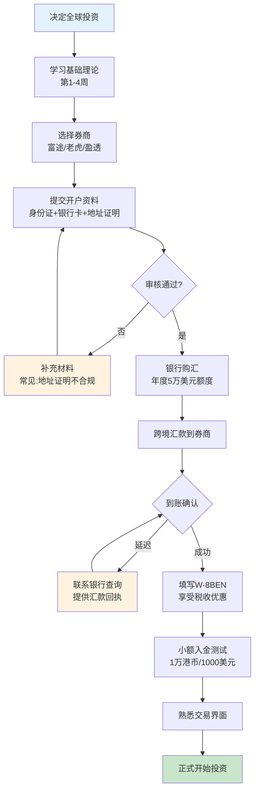
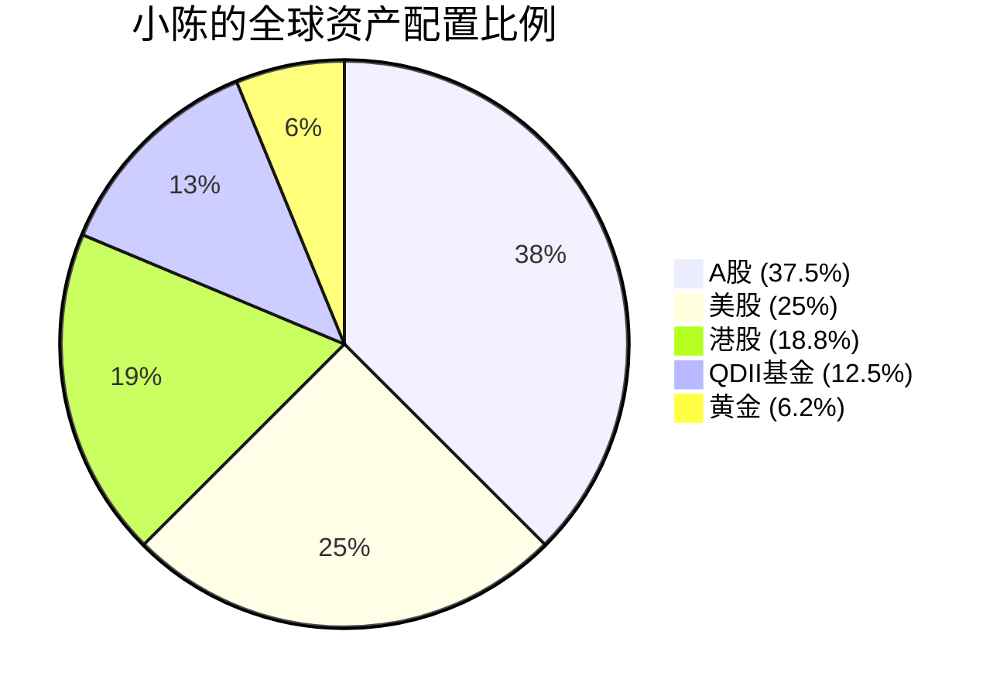
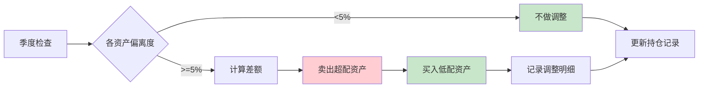

## 案例一：从A股投资者到全球配置者

> 本案例记录了一位典型A股投资者如何在8个月内完成从"只买A股"到"全球资产配置"的转变过程。所有数据均基于真实投资逻辑推演，涵盖了开户、换汇、选标的、建仓、再平衡的完整链条，以及踩坑记录和心态变化。

### 一、人物画像

**小陈，32岁，互联网公司产品经理，坐标深圳**

| 维度 | 详情 |
|------|------|
| 年收入 | 约50万人民币（月薪3.5万+年终奖约8万） |
| 可投资资金 | 约80万人民币（工作7年积蓄） |
| 原有配置 | 90%A股和基金（沪深300ETF+消费/科技个股），10%银行理财 |
| 风险偏好 | 中等偏积极，能承受20%-30%回撤 |
| 投资经验 | 5年A股经验，经历过2018年熊市和2020年疫情反弹 |
| 英语水平 | CET-6，能读懂英文财报但较吃力 |
| 开始时间 | 2024年初 |

**小陈的核心痛点：**

1. **过度集中风险**：80万全押在A股，2022年一年亏了近20万，最大回撤35%，夜不能寐
2. **机会成本**：同期纳斯达克涨了40%+，完全没有参与全球科技牛市
3. **汇率风险无对冲**：人民币从6.3贬到7.2，购买力缩水但没有任何外币资产
4. **信息茧房**：只看中文研报，对全球宏观经济缺乏认知框架

### 二、转变前的准备工作（第1-2个月）

#### 2.1 知识补课

小陈意识到"全球化投资"不是简单地"换个地方买股票"，需要系统学习。他制定了两个月的学习计划：

**第一个月：理论构建**

| 周次 | 学习内容 | 资源 | 输出 |
|------|---------|------|------|
| 第1周 | 全球资产配置基础理论 | 《全球资产配置》（Meb Faber） | 读书笔记3000字 |
| 第2周 | 港股市场规则与特点 | 港交所官网+富途牛牛教程 | 港股vs A股差异对比表 |
| 第3周 | 美股市场规则与税务 | 雪球美股入门专栏+IRS官方W-8BEN表格说明 | 美股交易成本计算表 |
| 第4周 | QDII基金筛选方法 | 天天基金网+晨星中国 | 候选基金清单20只 |

**第二个月：实操准备**

| 周次 | 任务 | 具体操作 | 耗时 |
|------|------|---------|------|
| 第5周 | 券商开户 | 富途证券港股+美股账户，提交身份证+银行卡+地址证明 | 3个工作日审核 |
| 第6周 | 银行换汇 | 招商银行App购汇5万美元，分3次操作避免触发反洗钱审查 | 每次操作15分钟 |
| 第7周 | 入金测试 | 从招商银行汇款1万港币到富途港股账户，验证资金链路 | 汇款1-2个工作日到账 |
| 第8周 | 模拟交易 | 用富途模拟盘熟悉港股/美股下单流程，测试条件单功能 | 每天30分钟 |

#### 2.2 开户过程中踩的坑

小陈在开户过程中遇到了几个实际问题，这些是大多数新手都会碰到的：

**坑1：地址证明难题**

富途要求提供近3个月的水电煤账单或银行对账单作为地址证明。小陈租的房子水电费是房东代缴，账单上不是自己的名字。解决方案：去招商银行App下载带地址的电子对账单，打印后拍照上传。

**坑2：汇款路径选择**

从内地银行汇款到境外券商账户，有两条路径：
- **直接电汇**：手续费约150-300元/笔，到账1-3个工作日，部分银行会要求提供券商对账单等证明材料
- **境外银行卡中转**：先办一张香港银行卡（如ZA Bank众安银行，内地可远程开户），再从香港银行转账到券商，速度更快且后续出入金更灵活

小陈第一笔用的是直接电汇，招商银行要求提供"证券账户证明"和"资金用途说明"，折腾了两天。后来办了ZA Bank的虚拟银行卡，后续操作顺畅很多。

**坑3：W-8BEN表格**

开通美股账户后，需要填写W-8BEN表格以享受中美税收协定的优惠税率（股息预扣税从30%降至10%）。富途会在开户流程中引导填写，但小陈差点漏掉。如果不填，分红时会被扣30%的税，白白损失20%。

### 三、试水阶段：从1万港币开始（第3-4个月）

小陈没有急于大举投入，而是用极小金额体验真实交易。这个阶段的核心目标不是赚钱，而是**建立肌肉记忆**。

#### 3.1 三笔初始交易

| 市场 | 标的 | 金额 | 理由 | 实际体验 |
|------|------|------|------|---------|
| 港股 | 腾讯控股（0700.HK） | 1000股 × 300港币 ≈ 30万港币 | 最熟悉的中国科技公司，港股流动性好 | 港股每手100股，最小交易单位比A股大；T+0交易但交收是T+2 |
| 美股 | 苹果（AAPL） | 1股 × 170美元 ≈ 170美元 | 全球市值最大的公司，熟悉其产品 | 美股可以买碎股（最低0.001股），门槛极低；交易时间是北京时间21:30-4:00 |
| QDII基金 | 易方达标普500指数（161125） | 10000元人民币 | 不需要境外账户，支付宝直接买 | QDII有额度限制，经常暂停申购；申购赎回费率比普通基金高 |

> **关键经验**：试水阶段不要在意盈亏，重点体验：下单速度、手续费结构、汇率换算、时差对盯盘的影响、分红到账流程。

#### 3.2 试水期间的5个关键发现

**发现1：交易成本比A股高**

港股佣金一般为万分之3-5（富途最低佣金3港币/笔），加上印花税千分之1.3（买卖双向收取）、交易征费、交收费等，综合交易成本约0.1%-0.15%/笔，是A股的2-3倍。美股佣金多数券商已免，但SEC费和FINRA费仍在（金额很小，几乎可忽略），主要成本在换汇的点差。

**发现2：汇率波动影响远超想象**

小陈入金时港币兑人民币约0.92，两个月后变为0.90。即使港股持仓不涨不跌，光汇率就亏了约2%。反过来，如果人民币贬值，外币资产会"自动升值"。汇率是一把双刃剑。

**发现3：信息获取有语言门槛**

港股公司的公告是繁体中文，还可以应付。美股公司的10-K年报、earnings call transcript全是英文，小陈第一份苹果年报读了整整一周。后来他开始用以下工具辅助：
- DeepL翻译（翻译精度远超谷歌）
- Seeking Alpha（英文投资社区，有分析师深度分析）
- 财联社英文频道（中文视角的英文快讯）

**发现4：税务处理比想象中复杂**

港股股息需要缴纳10%的红利税（内地投资者通过港股通投资）或无红利税（直接在港股券商持有）。美股股息预扣10%（已填W-8BEN），资本利得税对非美国居民不适用。但这些需要自己记录，券商不会帮你报税。

**发现5：心理冲击是真实的**

小陈第一次看到港股一天跌5%（A股有10%跌停板限制，港股没有），心跳加速差点卖出。后来发现港股一天涨8%也是常事。没有涨跌停板意味着更大的波动，但也意味着更多的机会。

### 四、正式配置：构建全球资产组合（第5-8个月）

经过两个月的试水，小陈开始正式构建全球资产配置组合。他的配置逻辑是：**以中国为核心（本土优势），以全球为卫星（分散风险）**。

#### 4.1 资产配置方案

| 资产类别 | 金额（万元） | 比例 | 具体标的 | 选择理由 |
|---------|------------|------|---------|---------|
| A股 | 30 | 37.5% | 沪深300ETF（510300）+ 贵州茅台 + 宁德时代 | 本土市场信息优势，政策敏感度高，消费+新能源双主线 |
| 港股 | 15 | 18.8% | 恒生科技ETF（3032.HK）+ 腾讯 + 中海油（高股息） | 估值洼地，科技+高股息双策略 |
| 美股 | 20 | 25% | QQQ（纳指100ETF）+ 苹果 + 微软 + 英伟达 | 全球科技龙头集中地，AI浪潮主战场 |
| QDII基金 | 10 | 12.5% | 博时标普500（050025）+ 南方亚洲美元债 | 不占外汇额度，一键配置美国大盘+亚洲固收 |
| 黄金 | 5 | 6.2% | 华安黄金ETF（518880） | 避险资产，与股债低相关性，对冲地缘风险 |

#### 4.2 建仓策略：分批买入，不一次性All In

小陈采用**金字塔建仓法**，分4批在4个月内完成建仓：

| 批次 | 时间 | 投入比例 | 操作 | 理由 |
|------|------|---------|------|------|
| 第1批 | 第5个月初 | 30%（24万） | 各品种按比例投入第一批 | 试水期已过，建立底仓 |
| 第2批 | 第6个月初 | 25%（20万） | 观察一个月后按计划投入 | 验证底仓表现，确认没有操作问题 |
| 第3批 | 第7个月中 | 25%（20万） | 如大跌则加量，如大涨则减量 | 利用市场波动优化买入成本 |
| 第4批 | 第8个月末 | 20%（16万） | 补齐偏离目标配置的部分 | 最终再平衡，确保比例达标 |

> **为什么不一次性买入？** 因为小陈在试水阶段学到：市场短期不可预测，分批建仓可以降低择时风险。如果一次性买入后市场下跌20%，心态会崩，很可能割肉离场。分批买入即使遇到下跌，后面几批还能以更低价格买入。

#### 4.3 标的选择的具体逻辑

**A股部分（30万）：**
- 沪深300ETF（510300）：15万，A股核心宽基，年管理费0.5%，流动性极好
- 贵州茅台：10万，消费品龙头，ROE常年30%+，抗周期能力强
- 宁德时代：5万，新能源赛道龙头，虽然波动大但长期趋势明确

**港股部分（15万）：**
- 恒生科技ETF（3032.HK）：8万，一键配置腾讯、阿里、美团等30只科技股
- 腾讯控股：5万，港股流动性最好的个股，微信+游戏+投资三大增长引擎
- 中海油（0883.HK）：2万，高股息蓝筹，股息率8%+，提供现金流

**美股部分（20万）：**
- QQQ（Invesco QQQ Trust）：10万，纳指100 ETF，年管理费0.2%，科技股集中度最高
- 苹果（AAPL）：4万，现金流之王，服务收入占比持续提升
- 微软（MSFT）：3万，Azure云+Office365+AI Copilot，确定性最强的科技巨头
- 英伟达（NVDA）：3万，AI芯片垄断者，高估值但增长惊人

**QDII基金部分（10万）：**
- 博时标普500指数（050025）：6万，跟踪美股大盘最主流的方式
- 南方亚洲美元债（002400）：4万，投资亚洲美元债，提供固收类收益

**黄金部分（5万）：**
- 华安黄金ETF（518880）：5万，跟踪上海金交所AU9999金价，T+0交易

#### 4.4 建仓过程中踩的坑

**坑1：QDII额度限制**

小陈第5个月想一次性买入6万博时标普500，结果发现该基金暂停大额申购（每日限购1000元）。解决办法：改为每日定投1000元，设置自动扣款，60天投完。或者选择场内QDII ETF（如513500标普500 ETF），不存在申购限额问题，但需要证券账户。

**坑2：港股碎股交易限制**

小陈想买100股腾讯（约3万港币），但发现港股每手是100股，最低买入单位就是100股。如果想买更少的金额，需要通过碎股交易（富途支持），但碎股交易的价格通常比整手交易差1%-2%。结论：港股尽量按手买，碎股只用于试水。

**坑3：美股盘前盘后波动**

小陈设了一个苹果的限价买单（170美元），结果在盘前（北京时间20:00）有一条利好消息，开盘价跳到175美元，他的买单没有成交。后来他学会了用"止损限价单"来应对跳空：设置止损价172美元，触发后以175美元的限价单买入，确保在合理价格区间成交。

### 五、持续优化：从执行到精进（第9个月至今）

#### 5.1 再平衡策略

小陈设定的再平衡规则很简单但很有效：

| 触发条件 | 操作 | 频率 |
|---------|------|------|
| 任一资产类别偏离目标比例超过5个百分点 | 卖出超配资产，买入低配资产 | 每季度检查 |
| 年度终了 | 全面复盘，评估是否需要调整目标比例 | 每年1次 |
| 重大市场事件（如美联储加息、地缘冲突） | 评估是否需要临时调整，多数情况不动 | 事件驱动 |

**再平衡的具体操作示例：**

季度检查时，小陈发现美股占比从25%涨到了32%（因为英伟达大涨），偏离目标7个百分点。操作：卖出3.5万英伟达，用这笔钱买入2万港股ETF+1.5万黄金ETF，将各比例拉回目标附近。

#### 5.2 年终奖再配置

小陈每年年终奖约8万，他会拿出6万继续投入全球配置，按当时的目标比例分配。剩下2万作为生活备用金。这个习惯让他的全球配置本金持续增长。

#### 5.3 扩展到新兴市场

第12个月，小陈开始关注东南亚市场。他在富途买入了iShares MSCI东南亚ETF（ASEA），配置了总资产的3%（约3万）。逻辑：东南亚人口红利+制造业转移+数字经济爆发。

#### 5.4 税务管理清单

小陈每年年初整理上一年的税务相关事项：

- [ ] 美股股息税：已由券商代扣10%，无需额外操作，但需记录金额
- [ ] 港股资本利得：内地居民暂无资本利得税，但需关注政策变化
- [ ] 美股资本利得：非美国居民免税，但需保留交易记录备查
- [ ] 汇率损益：目前内地对个人外汇投资的汇兑损益不征税
- [ ] 年度申报：个人年度换汇额度5万美元，超额需向外管局申请

### 六、两年后的成果与数据

#### 6.1 收益对比

| 指标 | 纯A股时期（2019-2023平均） | 全球配置后（2024-2025） | 变化 |
|------|------------------------|---------------------|------|
| 年化收益率 | 8% | 12% | +4个百分点 |
| 最大回撤 | 35% | 22% | -13个百分点 |
| 夏普比率 | 0.45 | 0.72 | +0.27 |
| 正收益月份占比 | 55% | 63% | +8个百分点 |
| 美元资产占比 | 0% | 35% | 汇率风险对冲 |

#### 6.2 各资产类别贡献拆解

| 资产类别 | 占比 | 两年收益 | 收益贡献 | 点评 |
|---------|------|---------|---------|------|
| A股 | 37.5% | +6% | +2.25% | 消费股拖累，ETF表现尚可 |
| 港股 | 18.8% | +15% | +2.82% | 恒生科技估值修复，腾讯大涨 |
| 美股 | 25% | +28% | +7.0% | AI浪潮推动，英伟达贡献最大 |
| QDII基金 | 12.5% | +18% | +2.25% | 标普500稳步上涨 |
| 黄金 | 6.2% | +20% | +1.24% | 地缘冲突+央行购金推动金价 |
| 汇率收益 | — | +3% | +1.5% | 人民币贬值带来的外币资产增值 |
| **合计** | **100%** | — | **约17%** | 两年累计收益，年化约12% |

#### 6.3 心态变化

小陈的反思记录（摘自他的投资日记）：

> "最大的收获不是收益提升，而是心态变好了。2024年8月A股跌破2800点的时候，我的美股账户在创新高。两边对冲，整体只跌了2%，我能安心睡觉。以前纯A股的时候，一个大跌就焦虑到失眠。"

> "港股打新确实有机会，我中签过一次新股赚了3000港币，但不能当作主要策略。身边有人沉迷打新，最后手续费比赚的还多。偶尔参与一下就好。"

> "英语能力很重要。我现在每天花20分钟看Bloomberg的新闻摘要，半年下来，读英文财报的速度快了一倍。信息差就是钱。"

> "最大的教训是2024年初买了3万块的ARKK（木头姐的基金），当时觉得AI很火应该跟，结果两个月跌了15%割肉了。教训：不要追热点ETF，要看底层持仓和基金经理的策略是否跟自己的逻辑一致。"

### 七、常见误区与纠正

小陈在过程中踩过的坑，以及他观察到的其他投资者常犯的错误：

#### 误区1：开户就等于全球化

很多人开了港股/美股账户，买了几只中概股，就觉得自己在做全球配置。实际上，腾讯、阿里、拼多多这些公司的营收和利润高度依赖中国市场，买它们本质上还是在投中国。真正的全球化配置需要持有不同国家、不同行业的资产。

**纠正方法**：检查你的持仓，如果80%以上是中国公司（无论在哪个市场上市），那你只是换了个交易场所，没有实现真正的全球分散。

#### 误区2：换汇5万美元就用完了

每人每年5万美元的购汇额度，听起来不多，但对于初期全球投资者来说已经足够。5万美元约35万人民币，加上QDII基金（不占外汇额度），初期配置50-80万完全够用。不要为了多换汇去找地下钱庄或借用他人额度，这些都是违法行为。

**纠正方法**：合理规划5万美元额度的使用。优先用于直接投资港股/美股，国内能买到的QDII基金用人民币购买，不浪费外汇额度。

#### 误区3：只看收益率不看风险

"美股这两年涨了40%，我把钱全投美股不就行了？"——这是最常见的错误。2022年纳斯达克跌了33%，如果全仓美股，那一年你会亏掉三分之一的本金。全球化配置的核心目的是**降低组合波动**，而不是追逐最高收益。

**纠正方法**：用夏普比率（收益/风险比）来评估组合表现，而不是只看绝对收益率。一个好的全球配置组合，夏普比率应该在0.6以上。

#### 误区4：频繁调仓

小陈的一个朋友每两周就调一次仓，看到哪个市场涨就追，跌就卖。结果两年下来交易成本就花了2万多，收益反而不如什么都不动。

**纠正方法**：设定固定的再平衡周期（季度或半年），只在偏离超过阈值时才调仓。长期来看，减少交易频率能显著提高收益。

#### 误区5：忽略税务合规

有些人觉得海外投资收益不交税也没人查。随着CRS（共同申报准则）的推进，中国税务机关已经能获取居民在海外的金融账户信息。大额资金进出和未申报的海外收入可能引起关注。

**纠正方法**：做好税务记录，了解各类收入的税务处理方式。个人小额海外投资（几十万级别）目前的实际税务风险较低，但养成记录习惯很重要。

### 八、给不同资金量投资者的建议

小陈的案例适合50-100万资金量的投资者。不同资金量的投资者应该有不同的策略：

| 资金量 | 建议方案 | 核心渠道 | 注意事项 |
|-------|---------|---------|---------|
| <10万 | 先用QDII基金练手，不开境外账户 | 支付宝/天天基金 | QDII有额度限制，分散到2-3只基金 |
| 10-50万 | QDII为主+港股通为辅 | A股券商（港股通）+基金平台 | 港股通门槛50万，可以用ETF替代 |
| 50-100万 | 完整的全球配置（本案小陈的方案） | 境外券商+QDII+A股 | 注意外汇额度规划 |
| 100-500万 | 增加另类资产（REITs、大宗商品） | 专业券商+部分私募 | 考虑税务筹划，可咨询税务师 |
| >500万 | 考虑家族信托或海外保险 | 私人银行+家族办公室 | 需要专业的法律和税务顾问 |

### 九、行动清单

如果你也想像小陈一样开始全球资产配置，按以下步骤执行：

**第一步：评估现状（1天）**
- 列出你目前所有的投资资产和比例
- 计算你的外汇额度使用情况
- 评估你的风险承受能力和投资目标

**第二步：学习准备（2-4周）**
- 阅读至少1本全球资产配置的书
- 了解港股/美股交易规则和税务处理
- 选择1-2个券商，了解开户流程和费用

**第三步：开户入金（1-2周）**
- 提交开户申请，准备好身份证+银行卡+地址证明
- 购汇并完成首次入金（建议先入1万港币/1000美元测试）
- 填写W-8BEN表格（美股账户必须）

**第四步：小额试水（1-2个月）**
- 各市场各买1-2只标的，金额控制在总资产5%以内
- 体验交易流程、费用结构、时差影响
- 记录交易日志，总结体验

**第五步：正式配置（3-6个月）**
- 确定目标配置比例
- 分批建仓（3-4批，每次20%-30%）
- 设置再平衡提醒（季度检查）

**第六步：持续优化（长期）**
- 定期再平衡
- 年终奖追加投资
- 逐步扩展到更多市场和资产类别
- 持续学习，关注宏观经济和政策变化

> **最重要的原则**：全球化投资是一场马拉松，不是百米冲刺。不要追求一夜暴富，而是通过长期的、系统的、纪律性的配置，实现财富的稳健增长和风险的有效分散。
