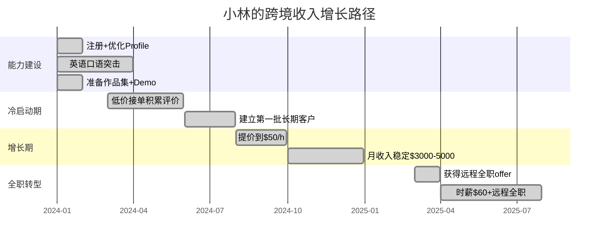

## 案例二：程序员的跨境收入之路

> 一个成都全栈工程师，用18个月时间将月收入从2.5万提升到7万人民币，海外收入占比从0%到85.7%。这不是鸡汤——每一步都有可复制的方法论。

### 一、人物背景与起点分析

**小林，28岁，全栈开发工程师，坐标成都**

| 维度 | 起点状态 | 目标状态 |
|------|---------|---------|
| 月收入 | 2.5万人民币（税后） | 5万+人民币 |
| 技术栈 | React + Node.js + PostgreSQL | 全栈 + DevOps + 系统设计 |
| 英语水平 | CET-6，口语弱，不敢开麦 | 流利视频会议、独立谈判 |
| 工作模式 | 坐班，偶尔加班 | 远程，自主安排时间 |
| 收入币种 | 纯人民币 | 美元为主，人民币为辅 |

**为什么小林选择跨境搞钱？**

小林算过一笔账：国内全栈开发的薪资天花板在一线城市大约是月薪4-5万（税前），而同样的技术能力在海外自由职业市场上可以拿到$50-80/时薪。按每月160个工作小时计算，潜在收入是$8,000-12,800（约5.5-9万人民币），几乎是国内天花板的两倍。更关键的是，海外收入不受国内35岁危机的约束——在Upwork上，40岁、50岁的开发者依然活跃，评价和经验才是硬通货。

### 二、前期准备：从0到1的90天

#### 2.1 平台选择：为什么是Upwork

小林调研了主流海外自由职业平台，做了系统对比：

| 平台 | 核心优势 | 核心劣势 | 抽佣比例 | 小林的判断 |
|------|---------|---------|---------|-----------|
| **Upwork** | 项目最多，类型最全，长期客户多 | 竞争激烈，初期压价严重 | 20%→10%→5%（阶梯递减） | ✅ 首选，生态最成熟 |
| **Fiverr** | 被动获客，客户来找你 | 偏低价市场，难以建立长期关系 | 20% | 可作为补充渠道 |
| **Toptal** | 高端客户，时薪$60-150+ | 通过率仅3%，筛选极严格 | 无（客户付费） | 后期目标，初期够不着 |
| **Freelancer.com** | 项目量大 | 质量参差，容易遇到低价竞标 | 10%或$5 | 不适合长期发展 |
| **直接找客户** | 无抽佣，利润率最高 | 获客难，缺乏平台保障 | 0% | 后期转型方向 |

小林最终选择Upwork作为主战场的原因：项目供给充足、支付有保障（Escrow机制）、支持长期合同（hourly contract），而且Upwork的JSS（Job Success Score）系统让优质freelancer能获得越来越好的曝光，形成正循环。

#### 2.2 打造高转化率的Upwork Profile

Profile是你的"数字简历+销售页面"，决定了客户是否点击"Hire"。小林花了整整两周优化Profile：

**Title（标题）的写法：**

```text
❌ 错误示范：Full Stack Developer
✅ 正确示范：Senior Full Stack Developer | React + Node.js + PostgreSQL | 50+ Web Apps Delivered
```

核心原则：**具体技术栈 + 可量化的成果**。客户搜索时用的是关键词，标题里的技术栈直接影响搜索排名。

**Overview（简介）的结构：**

```text
第一段：你是谁，做什么（2-3句）
→ I'm a senior full-stack developer with 6+ years of experience building scalable web applications. I specialize in React, Node.js, and PostgreSQL, and have delivered 50+ projects for clients across the US, UK, and Australia.

第二段：你能解决什么问题（客户视角）
→ Whether you need a MVP built from scratch, a legacy codebase modernized, or a complex API integration, I deliver clean, well-documented code on time and within budget.

第三段：具体技能列表（关键词优化）
→ Technical Skills: React/Next.js, Node.js/Express, PostgreSQL/MongoDB, AWS/Docker, REST/GraphQL APIs, CI/CD pipelines

第四段：社会证明（数据+客户评价引用）
→ ⭐ 100% Job Success Score | 50+ 5-star reviews | "Lin delivered exceptional work and exceeded our expectations." — John D., CTO at TechStartup Inc.
```

**Portfolio（作品集）的准备：**

小林从GitHub上精选了3个项目，每个项目都写了详细的英文README：
1. **E-commerce Platform** — React + Node.js + Stripe支付集成，展示全栈能力
2. **Real-time Chat App** — WebSocket + React，展示实时通信经验
3. **Admin Dashboard** — 数据可视化 + 权限管理，展示企业级应用能力

每个项目都部署了在线Demo（用Vercel和Railway的免费tier），让客户能直接点击体验。

**Profile Photo：** 用专业的人像照（白衬衫、简洁背景），而非自拍或旅游照。Upwork数据显示，专业头像的profile点击率高出40%。

#### 2.3 英语能力的针对性提升

小林的英语底子是CET-6，阅读和写作尚可，但口语和听力是短板。他制定了一个90天口语突击计划：

**每天1小时的固定安排：**

| 时间段 | 活动 | 工具 | 目标 |
|--------|------|------|------|
| 早起20分钟 | 影子跟读（Shadowing） | YouTube技术演讲 | 纠正发音，培养语感 |
| 午休20分钟 | 自由对话练习 | ChatGPT Voice / Cambly | 练习技术讨论的口语表达 |
| 晚上20分钟 | 写英文Proposal | Grammarly + 模板库 | 提升商务写作能力 |

**关键技术英语的积累：**

小林整理了一份"freelancer高频词汇表"，覆盖了谈判、需求确认、进度汇报、交付等场景：

```text
需求确认类：
- "Could you clarify the requirements for...?"（确认需求）
- "Just to make sure we're on the same page..."（确认理解一致）
- "I'd suggest we scope this down to..."（范围管理）

进度汇报类：
- "Here's a quick update on the progress..."（进度同步）
- "I've completed the [feature], here's a demo link..."（交付展示）
- "I'm running into an issue with [X], I'll need an extra day."（延期沟通）

谈判定价类：
- "Based on the scope, I'd estimate this at X hours / $Y."（报价）
- "I can offer a 10% discount for a long-term engagement."（折扣策略）
- "Given the complexity, I'd recommend an hourly contract."（合同类型建议）
```

### 三、获取第一批客户：低价策略的正确打开方式

#### 3.1 冷启动的核心难题

Upwork新账号面临"鸡生蛋"困境：没有评价 → 没有曝光 → 接不到项目 → 没有评价。破解这个循环需要一套组合拳：

**策略一：精准投标，不撒网**

小林每天只投3-5个精心筛选的项目，而不是海量投50个。筛选标准：

```text
✅ 选择标准：
- 客户评分 > 4.5，有付费历史
- 预算明确且合理（不低于$500的项目）
- 发布时间 < 24小时（先发优势）
- 需求描述清晰（说明客户知道自己要什么）
- 技术栈完全匹配

❌ 避开的项目：
- "I need a website like Facebook"（需求不切实际）
- 预算$50要一个完整App（预算严重不足）
- 客户无评分且无付费历史（收不到钱的风险）
- 项目描述模糊到无法估算工作量
```

**策略二：Proposal（提案）的黄金公式**

小林研究了大量高成功率的Proposal模板，总结出"4段式"结构：

```text
【第一段：破冰+证明你读了需求】（2-3句）
"Hi [Name], I noticed you're building a [具体描述] for [行业/用途].
I've built similar systems — here's a live demo: [链接]"

【第二段：方案概述】（3-4句）
"Based on your requirements, here's my approach:
1. [技术方案要点1]
2. [技术方案要点2]
3. [技术方案要点3]
I'd use [具体技术栈] because [理由]。"

【第三段：为什么选我】（2-3句）
"I've completed [X] similar projects on Upwork with 100% satisfaction.
Here's what [前客户名] said: '[一句话评价]'"

【第四段：报价+行动号召】（2-3句）
"I can deliver this in [时间] for [价格].
Happy to jump on a quick call to discuss further — feel free to send a message!"
```

**Proposal实战示例：**

一个客户发布需求："Need a React developer to build a task management app with drag-and-drop, real-time sync, and user auth."

小林的Proposal（节选）：

```text
Hi Sarah,

I see you're building a task management app with drag-and-drop and real-time
sync — this is right in my wheelhouse. I recently built a similar project
management tool for a UK startup: [live demo link]. It features real-time
collaboration via WebSockets, drag-and-drop boards (using react-beautiful-dnd),
and role-based auth with NextAuth.js.

My approach for your project:
1. Frontend: Next.js 14 + Tailwind CSS + dnd-kit (better than react-beautiful-dnd for accessibility)
2. Backend: Node.js + Prisma + PostgreSQL
3. Real-time: Socket.IO with Redis for horizontal scaling
4. Auth: NextAuth.js with Google/GitHub OAuth + email magic links

I've delivered 15+ React projects on Upwork, all 5-star reviews. Here's what
my last client said: "Lin's code quality is exceptional and he communicates
proactively throughout the project."

I can deliver an MVP in 3 weeks for $2,500 (fixed price) or $45/hour.
Happy to discuss on a call — I'm available this week.

Best,
Lin
```

#### 3.2 前三个项目的复盘

| 项目 | 类型 | 报价 | 市场价 | 工时 | 客户评价 | 关键收获 |
|------|------|------|--------|------|---------|---------|
| #1 WordPress网站 | 简单企业站 | $200 | $500-800 | 15小时 | ⭐⭐⭐⭐⭐ + $50小费 | 第一个5星评价的价值远超$300差价 |
| #2 React前端 | 电商前端重构 | $800 | $1,500-2,000 | 30小时 | ⭐⭐⭐⭐⭐ | 客户主动推荐了2个新客户 |
| #3 全栈Web应用 | SaaS MVP | $2,000 | $5,000+ | 60小时 | ⭐⭐⭐⭐⭐ | 建立了第一个长期合作关系 |

**小林的第一个项目详细过程：**

接到WordPress项目后，小林并没有急着写代码。他先花1小时和客户做了一次视频通话（这是建立信任的关键），详细了解需求。然后用Notion做了一份详细的项目计划书，包含：
- 需求清单（带优先级）
- 技术方案
- 时间线（含里程碑）
- 交付物列表

这个项目虽然报价只有$200，但小林把它当成"广告投资"——每一个细节都做到超出预期。最终客户不仅给了5星评价，还额外打了$50小费，并且在评价里写了一段非常详细的推荐语。这条评价成了小林后续获客的"王牌"。

### 四、从兼职到全职的转型路径

#### 4.1 收入增长的时间线



#### 4.2 提价策略：从$25到$60/小时的三个台阶

**第一台阶：$25/小时（0-6个月）**

目的：积累评价和完成数量。这个阶段的核心KPI不是收入，而是JSS（Job Success Score）和5星评价数量。小林的策略是：接5-8个中小型项目，每个都做到120%满意度。

**第二台阶：$40-50/小时（7-12个月）**

有了10+个5星评价后，小林开始筛选项目。他设置了一个规则：

```text
提价信号（满足3个以上就提价）：
✅ 连续5个项目都是5星评价
✅ JSS保持在95%以上
✅ 最近10个Proposal的回复率 > 30%
✅ 有2个以上客户主动找你（inbound请求）
✅ 当前时薪下，你的日程已经排满
```

提价的正确方式不是直接改Profile时薪，而是：
1. 新项目用新价格报价
2. 给现有长期客户2周缓冲期
3. 用"我最近接的项目都是这个价位"来锚定

**第三台阶：$60+/小时（13个月+）**

这个阶段，小林不再只靠Upwork。他通过Upwork上的一个长期客户获得了远程全职offer，同时保留Upwork上的部分项目作为副收入。$60/小时在美国市场属于中等偏上水平，但对于一个在中国远程工作、生活成本低得多的开发者来说，这是非常可观的收入。

#### 4.3 从Freelancer到Remote Employee的关键转折

小林在Upwork上服务一个美国SaaS初创公司长达8个月，从最初的$3,000固定价格项目，发展到每月$5,000的retainer（保留合同），最终CTO直接问他："Would you be interested in joining us full-time?"

**谈判过程中的关键点：**

1. **合同类型**：签署的是独立承包商合同（Independent Contractor Agreement），而非W-2雇佣合同。这意味着小林不需要在美国报税，但也没有美国的劳动保障。
2. **时薪谈判**：CTO最初报价$50/小时，小林基于市场调研和自己的Upwork记录， counter到$60/小时并获得接受。
3. **工作时间**：每周30-40小时弹性，核心重叠时间是北京时间21:00-24:00（对应美国东部9:00-12:00）。
4. **知识产权**：所有工作产出归公司所有，小林保留个人技术积累的权利。

### 五、收款与税务：钱怎么安全到手

#### 5.1 收款渠道对比

| 渠道 | 手续费 | 到账时间 | 适合场景 | 小林的选择 |
|------|--------|---------|---------|-----------|
| **Upwork Direct to Local Bank** | 最低1% | 3-5个工作日 | Upwork平台内项目 | ✅ Upwork项目用这个 |
| **Payoneer（派安盈）** | 提现1-2% | 1-2个工作日 | 多平台收款、直接客户付款 | ✅ 非Upwork收入的主力 |
| **Wise（前TransferWise）** | 约0.5-1% | 1-2个工作日 | 直接客户银行转账 | 小额交易备选 |
| **PayPal** | 4.4%+$0.30 | 即时 | 小额、临时性收入 | ❌ 费率太高，不推荐主力使用 |
| **电汇（Wire Transfer）** | $15-45/笔 | 1-3个工作日 | 大额单笔付款 | 大额合同偶尔使用 |

**小林的收款架构：**

```text
Upwork项目收入
  → Upwork → Payoneer → 国内银行账户（自动结汇）

直接客户收入
  → 客户付款到Payoneer虚拟账户 → 国内银行账户

美国公司工资
  → 公司打款到Wise → 转到国内银行
```

#### 5.2 税务处理要点

海外收入的税务处理是中国公民最容易忽略但最不能出错的环节：

**核心原则：中国的个人所得税是全球征税的。**

也就是说，无论收入来源在哪里，中国税务居民都需要申报并缴纳个人所得税。海外收入通常按照"劳务报酬所得"计税：

```text
劳务报酬所得税率表（2024年）：
- 每次收入 ≤ 800元：免税
- 800 < 收入 ≤ 4,000元：(收入-800) × 20%
- 收入 > 4,000元：收入 × (1-20%) × 适用税率 - 速算扣除数

年度汇算清缴时，并入综合所得，适用3%-45%累进税率。
```

**小林的税务策略：**

1. **保留完整的收入记录**：每一笔海外收入都截图保存，包括Upwork/Payoneer的交易记录和银行入账记录。
2. **年度汇算清缴**：每年3-6月通过"个人所得税APP"进行汇算清缴，将海外收入如实申报。
3. **咨询专业税务师**：小林花2,000元咨询了一位熟悉跨境收入的税务师，得到了几个关键建议：
   - 海外已缴税款可以抵免（如果有）
   - 保持好所有收入凭证，以备税务局核查
   - 如果收入规模持续增长，可以考虑注册个体工商户或个人独资企业，享受核定征收的优惠税率

**⚠️ 重要提醒：** 切勿心存侥幸不申报海外收入。随着CRS（共同申报准则）的实施，中国税务机关已经能自动获取中国公民在100多个国家的金融账户信息。Payoneer、Wise等平台都在CRS覆盖范围内。合规申报不仅是法律义务，也是保护自己的方式。

### 六、时间管理与生活平衡

#### 6.1 时区管理的实战方案

与美国客户合作意味着需要在北京时间晚间工作。小林摸索出一套可持续的时间安排：

```text
小林的每日时间表（工作日）：

07:00-08:00  起步：运动/早餐/看技术博客
08:00-12:00  深度编程时间（无会议，专注写代码）
12:00-13:30  午餐+午休
13:30-17:00  国内兼职工作/个人项目
17:00-18:30  自由时间（散步/阅读/做饭）
18:30-19:30  英语学习+技术文档阅读
19:30-20:30  晚餐+休息
20:30-23:30  美国客户工作时间（重叠会议+代码Review）
23:30-00:00  今日总结+明日计划
```

**关键原则：**
- 把需要高度专注的编程工作放在上午（大脑最清醒）
- 把沟通类工作（会议、代码Review）放在晚上（与美国时区重叠）
- 保证每天7-8小时睡眠，这是长期可持续的前提
- 周末至少留一天完全不工作，防止burnout

#### 6.2 常见的时间管理陷阱

| 陷阱 | 表现 | 解决方案 |
|------|------|---------|
| 无限返工 | 客户反复改需求，项目拖3个月 | 合同明确修改次数（通常2-3轮），超出部分按时薪计费 |
| 会议过多 | 每天2-3个视频会议，实际写代码时间不到4小时 | 设定"会议日"（如周二、周四），其他时间只接受文字沟通 |
| 多客户并行 | 同时服务5个客户，每个都等你回复 | 同时活跃客户不超过3个，用工具管理优先级 |
| 时差疲劳 | 连续几个月深夜工作导致身体透支 | 每季度安排1周"off-week"，提前通知客户 |

### 七、工具链：跨境开发者的生产力装备

#### 7.1 必备工具清单

**项目管理与沟通：**

| 工具 | 用途 | 费用 | 为什么选它 |
|------|------|------|-----------|
| Slack | 客户沟通 | 免费 | 美国团队标配，比邮件高效 |
| Notion | 项目文档、需求管理 | 免费 | 客户和你都能看到的共享知识库 |
| Loom | 异步视频汇报 | 免费 | 录制5分钟Demo比写500字邮件更高效 |
| Calendly | 会议预约 | 免费 | 自动处理时区转换，避免来回约时间 |
| Toggl Track | 工时记录 | 免费 | Hourly合同必须精确记录工时 |

**开发与协作：**

| 工具 | 用途 | 费用 |
|------|------|------|
| GitHub | 代码托管+CI/CD | 免费 |
| VS Code + Live Share | 远程结对编程 | 免费 |
| Figma | 设计协作 | 免费 |
| Vercel / Railway | 快速部署Demo | 免费tier够用 |
| Postman | API测试与文档 | 免费 |

**财务与收款：**

| 工具 | 用途 | 费用 |
|------|------|------|
| Payoneer | 海外收款 | 1-2%提现费 |
| Wise | 国际转账 | 0.5-1% |
| Wave | 发票管理 | 免费 |
| 个人所得税APP | 年度汇算清缴 | 免费 |

#### 7.2 效率提升的关键习惯

**习惯一：Loom视频汇报**

每周五给客户录一个5分钟的Loom视频，展示本周进度和下周计划。这比文字汇报更高效，客户能直接看到Demo运行效果，减少了大量来回沟通。小林发现，使用Loom后客户满意度平均提升0.3分（5分制）。

**习惯二：模板化一切**

小林建立了一套完整的模板库：
- Proposal模板（5种常见项目类型的变体）
- 合同模板（固定价格 vs 时薪）
- 周报模板（进度+下周计划+风险项）
- 发票模板（Wave自动生成）
- 验收清单模板（避免交付后扯皮）

**习惯三：异步优先**

小林把"能用文字解决的不开会"作为原则。只有在以下情况才安排视频会议：
- 首次和客户沟通（建立信任）
- 需求确认和范围定义
- 出现分歧需要对齐
- 重大里程碑的Demo

### 八、踩过的坑与血泪教训

#### 8.1 坑一：第一个大项目的范围蔓延

**发生了什么：** 小林的第三个项目（$2,000的SaaS MVP）原定4周完成，最终拖了10周。客户不断加需求："能加个通知功能吗？""能支持多语言吗？""能加个管理后台吗？"小林不好意思拒绝，全部免费做了。

**根本原因：** 合同没有明确范围（Scope of Work），也没有变更管理流程。

**正确做法：**

```text
合同中必须包含：
1. 详细的Scope of Work（SOW）——列出每一个功能点
2. 变更条款——"超出SOW的需求，按$XX/小时额外计费"
3. 验收标准——什么算"完成"，由谁确认
4. 付款里程碑——按阶段付款，不按最终交付付款
```

#### 8.2 坑二：被客户拖欠尾款

**发生了什么：** 一个直接客户（非Upwork平台）在项目完成后拖延付款2个月。由于没有使用平台的Escrow机制，小林没有任何保障。

**正确做法：**
- 平台内项目用平台保障（Upwork的Escrow/Fixed-Price Protection）
- 直接客户用"50%预付+50%交付前付清"的模式
- 金额>$5,000的项目签正式合同
- 超过30天未付款，发送正式催款函（可用Wise Business的模板）

#### 8.3 坑三：忽视税务合规差点惹麻烦

**发生了什么：** 小林第一年海外收入约20万人民币，完全没有申报。第二年收到银行的"异常交易"电话询问，虽然最终没有处罚，但被吓出一身冷汗。

**正确做法：** 从第一笔海外收入开始就做好记录，年度汇算清缴如实申报。合规的成本远低于被查后的成本。

#### 8.4 坑四：身体透支导致效率断崖

**发生了什么：** 连续3个月每天工作12小时以上（白天国内工作+晚上美国客户），第4个月出现了严重的失眠和注意力下降，代码质量明显下滑，一个项目出了线上bug。

**正确做法：** 设定每周工作时间上限（小林最终设定为50小时），每季度安排1周完全休息。长期来看，可持续的节奏比短期冲刺更重要。

### 九、收入结构变化与财务分析

| 阶段 | 时间 | 国内收入 | 海外收入 | 月总收入 | 海外占比 | 有效时薪 |
|------|------|---------|---------|---------|---------|---------|
| 起点 | 第0月 | 2.5万 | 0 | 2.5万 | 0% | ~125元 |
| 冷启动 | 第1-3月 | 2.5万 | 0.5万 | 3万 | 17% | ~150元 |
| 增长期 | 第4-6月 | 2.5万 | 1.5万 | 4万 | 37.5% | ~200元 |
| 稳定期 | 第7-12月 | 2.5万 | 3万 | 5.5万 | 54.5% | ~275元 |
| 转型期 | 第13-18月 | 1万（兼职） | 6万 | 7万 | 85.7% | ~350元 |

**关键财务指标分析：**

- **收入增长倍数**：18个月内总收入增长2.8倍
- **有效时薪提升**：从125元提升到350元，增长2.8倍
- **美元资产占比**：从0%到85.7%，自然对冲了人民币贬值风险
- **购买力提升**：成都生活成本不变，但收入翻了近3倍，生活质量显著改善

### 十、核心经验总结

#### 10.1 五条黄金法则

1. **英语能力是真正的护城河**：技术能力决定你能不能接活，英语能力决定你能接多大的活。小林每天1小时的口语练习，3个月后能流利地进行视频会议——这是收入从$25跃升到$50的关键转折点。

2. **作品集比学历重要100倍**：海外客户不关心你是不是985/211，他们关心的是：你做过什么类似的项目？有没有Live Demo？之前的客户怎么评价你？一个有3个高质量项目+在线Demo的GitHub，胜过任何学历证书。

3. **低价是策略，不是常态**：初期低价是为了积累评价和信任，但必须有明确的提价时间表。小林见过太多中国freelancer永远停在$15/小时的陷阱里——因为他们没有设定提价的标准和时间节点。

4. **时间管理决定你能走多远**：跨境工作最大的隐性成本是健康。深夜工作、多客户并行、无限返工，这些都是burnout的导火索。设定工作上限、保护休息时间、定期断联——这不是偷懒，是长期主义。

5. **税务合规是底线，不是可选项**：随着CRS和全球税务信息自动交换的推进，海外收入的隐匿空间越来越小。从第一笔收入开始就做好记录和申报，成本最低、风险最小。

#### 10.2 不同阶段的行动清单

```text
【准备期（第1-2个月）】
□ 注册Upwork账号，完成身份验证
□ 花2周优化Profile（Title、Overview、Portfolio、Photo）
□ 准备3个高质量Portfolio项目+在线Demo
□ 制定英语口语90天突击计划
□ 注册Payoneer账号，绑定国内银行卡
□ 准备5种Proposal模板

【冷启动期（第3-6个月）】
□ 每天投3-5个精选项目
□ 低价接3-5个项目，积累5星评价
□ 建立项目模板库（合同、周报、发票）
□ 学习使用Loom做视频汇报
□ 每月复盘：哪些Proposal转化率高，为什么

【增长期（第7-12个月）】
□ 将时薪提升到$40-50
□ 筛选项目，拒绝低价单
□ 与2-3个优质客户建立长期合作
□ 开始关注Toptal的申请条件
□ 咨询税务师，建立合规的税务记录体系

【转型期（第13个月+）】
□ 评估远程全职机会
□ 时薪目标$60+
□ 建立多个收入来源（平台+直接客户+远程全职）
□ 考虑是否需要注册公司/个体户优化税务
□ 开始积累个人品牌（技术博客、开源项目）
```

### 十一、可复用的资源与模板

#### 11.1 Proposal模板（可直接使用）

```text
Hi [Client Name],

I noticed you're looking for a [技术栈] developer to [具体需求].
[1-2句证明你有相关经验，附Demo链接]

Here's my approach:
1. [技术方案要点1 — 具体到用什么库/框架]
2. [技术方案要点2 — 包含为什么这么选]
3. [技术方案要点3 — 包含时间估算]

About me:
- [X]+ years of experience in [技术栈]
- [Y]+ projects delivered on Upwork with 100% satisfaction
- [一句客户评价引用]

I can deliver this in [时间frame] for [价格].
Let's schedule a quick call to discuss — I'm flexible on timing.

Best,
[Your Name]
```

#### 11.2 常见客户问题的应答模板

| 客户问题 | 推荐回答 |
|---------|---------|
| "Can you do it cheaper?" | "I understand budget is a concern. I can adjust the scope to fit your budget — for example, we could start with [核心功能] and add [其他功能] in phase 2." |
| "How long will it take?" | "Based on the current scope, I estimate [X weeks]. Here's a breakdown: [功能1] = [Y days], [功能2] = [Z days]. I'll send weekly progress updates." |
| "Can you start immediately?" | "I can start the onboarding and planning this week, with active development beginning [date]. This ensures I can give your project my full attention." |
| "Have you done this before?" | "Yes — here's a similar project I completed: [link]. It had comparable requirements around [相似功能]. I'd be happy to share references." |

***

> **案例启示：** 小林的故事不是"天赋异禀"的传奇，而是"方法正确+持续执行"的必然结果。他的核心竞争力不是最顶尖的技术，而是：愿意花时间打磨Profile、愿意用低价换取信任、愿意每天花1小时练英语、愿意在深夜和客户开会。这些都不是门槛很高的事情，但组合在一起，就是大多数人做不到的事情。
