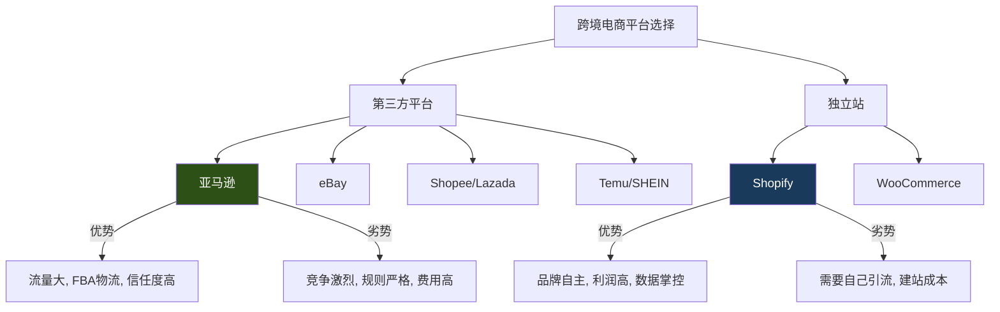
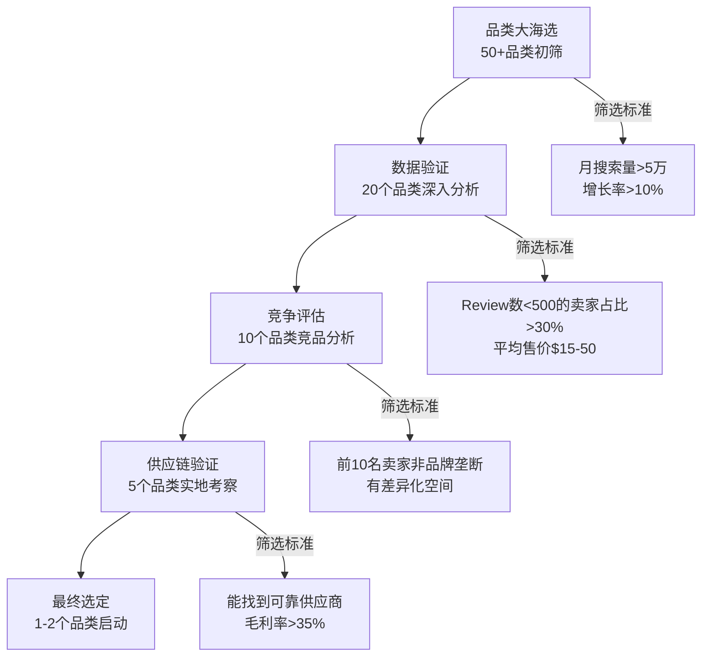
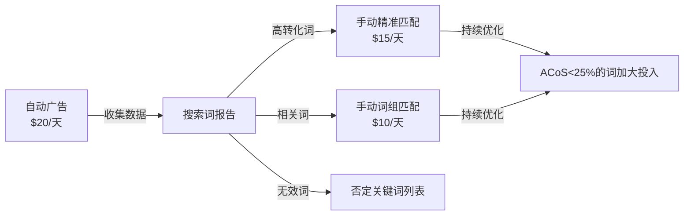
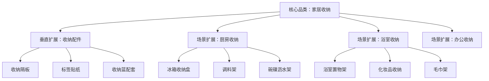

## 案例三：跨境电商从0到月销10万美元

### 案例概述

本案例记录小王夫妇从零开始做跨境电商，12个月内实现月销10万美元的完整历程。这不是一个"一夜暴富"的故事——相反，它展示了一个普通人如何通过系统化的选品、精细化的运营和持续的迭代优化，在竞争激烈的跨境电商赛道中找到自己的位置。

**关键数据一览：**

| 指标 | 初始值 | 12个月后 |
|------|--------|----------|
| 启动资金 | 15万人民币 | — |
| 月销售额 | 0 | $100,000 |
| 月净利润 | — | $20,000 |
| SKU数量 | 3 | 15 |
| 团队规模 | 2人 | 5人 |
| 市场覆盖 | 美国站 | 美国/欧洲/日本+独立站 |

### 人物背景与起点分析

**小王夫妇的基本情况：**

- 小王，30岁，义乌某外贸公司业务员，5年外贸经验，熟悉B2B出口流程，英语六级，有基础的国际物流知识
- 妻子，28岁，公司会计，精通Excel和数据分析，细心且有财务规划能力
- 坐标义乌——全球最大的小商品集散中心，供应链触手可及
- 可投入资金：15万人民币（其中10万存款+5万家庭借款）

**起点优势分析：**

| 优势维度 | 具体内容 | 可利用程度 |
|----------|----------|------------|
| 供应链 | 义乌市场，工厂直供，起订量灵活 | ★★★★★ |
| 语言 | 英语可日常沟通，写Listing需借助工具 | ★★★☆☆ |
| 行业认知 | 了解外贸流程，知道报关、物流基本流程 | ★★★★☆ |
| 数据能力 | 妻子的财务背景，擅长数据分析和成本核算 | ★★★★☆ |
| 资金 | 15万启动，不算充裕但可以小步试错 | ★★★☆☆ |

**为什么选择亚马逊而非其他平台？**

小王在启动前做了详细的平台对比分析：



最终选择亚马逊的原因：
1. **流量现成**：亚马逊美国站日活跃用户超2亿，不需要自己引流
2. **FBA物流**：把货发到亚马逊仓库，由亚马逊负责配送和售后，极大降低运营复杂度
3. **信任体系**：消费者天然信任亚马逊平台，转化率比独立站高3-5倍
4. **学习资源丰富**：亚马逊卖家社区成熟，遇到问题容易找到解决方案

### 第一阶段：市场调研与选品（第1-2个月）

选品是跨境电商成功的基石——70%的成败在选品阶段就已经决定了。小王夫妇在这个阶段投入了整整两个月时间，这在很多新手看来是"浪费时间"，但事实证明这是最值得的投资。

#### 选品方法论：数据驱动的漏斗模型



#### Step 1：品类初筛

使用Jungle Scout和Helium 10进行数据挖掘：

**筛选标准设定：**
- 月搜索量 > 50,000（证明有足够需求）
- 竞品平均Review数 < 500（新卖家有机会）
- 平均售价 $15-50（太低没利润，太高资金压力大）
- 重量 < 2磅（物流成本可控）
- 非季节性产品（全年稳定需求）
- 无明显专利/品牌壁垒

**工具使用详解：**

Jungle Scout的核心功能：
- **Product Database**：按类目、价格、销量等条件筛选产品
- **Opportunity Finder**：发现高需求低竞争的细分市场
- **Keyword Scout**：分析关键词搜索量和竞争度
- **Sales Analytics**：追踪竞品的月销量和收入

Helium 10的核心功能：
- **Black Box**：多维度产品筛选
- **Cerebro**：反查竞品关键词
- **Magnet**：关键词扩展和搜索量分析
- **Xray**：Chrome插件，浏览亚马逊时实时显示产品数据

#### Step 2：数据验证

对初筛出的20个品类逐一分析：

| 分析维度 | 具体指标 | 数据来源 |
|----------|----------|----------|
| 市场容量 | 月搜索量、月销量 | Jungle Scout |
| 竞争程度 | 前10名Review数、品牌占比 | Helium 10 Cerebro |
| 利润空间 | 售价-成本-FBA费用-广告费 | FBA Calculator |
| 增长趋势 | 近12个月搜索量变化 | Google Trends |
| 差评分析 | 竞品1-3星差评内容 | 手动分析 |

**差评分析——选品的秘密武器：**

小王花了整整一周时间，逐条阅读目标品类前20名卖家的差评。这不是浪费时间——差评里藏着金矿：

- 常见差评类型1："尺寸太小/太大" → 机会：做更合理的尺寸
- 常见差评类型2："材质廉价，味道大" → 机会：用更好的材料
- 常见差评类型3："包装简陋，收到时已损坏" → 机会：升级包装
- 常见差评类型4："没有使用说明" → 机会：附赠图文说明书

#### Step 3：最终选定——家居收纳品类

经过两个月的调研，小王最终锁定了**家居收纳产品**，具体原因是：

1. **市场足够大**：美国家居收纳市场规模超$150亿，线上占比持续增长
2. **竞争格局有利**：头部品牌市占率不高，中小卖家有空间
3. **供应链优势明显**：义乌是全球最大的家居收纳产品生产基地
4. **差异化空间大**：竞品差评集中在材质、尺寸、设计上，可以针对性改进
5. **物流友好**：产品轻便，不易碎，FBA仓储费低
6. **复购潜力**：收纳产品有季节性整理需求，且用户会购买成套产品

#### 供应商筛选与谈判

**义乌实地考察流程：**

1. **前期准备**：在1688和义乌购上筛选20家潜在供应商
2. **实地走访**：连续3天走访义乌国际商贸城和周边工厂
3. **样品对比**：每家拿2-3个样品，从材质、做工、包装三个维度评分
4. **深度沟通**：与最终入围的3家供应商深入洽谈

**供应商评估矩阵：**

| 评估维度 | 权重 | 供应商A | 供应商B | 供应商C |
|----------|------|---------|---------|---------|
| 产品质量 | 30% | ★★★★☆ | ★★★★★ | ★★★☆☆ |
| 价格竞争力 | 25% | ★★★★★ | ★★★☆☆ | ★★★★★ |
| 起订量灵活度 | 15% | ★★★★☆ | ★★★☆☆ | ★★★★★ |
| 交期稳定性 | 15% | ★★★★☆ | ★★★★☆ | ★★★☆☆ |
| 配合度/响应速度 | 15% | ★★★★☆ | ★★★★★ | ★★★☆☆ |
| 综合得分 | 100% | 4.15 | 4.10 | 3.85 |

最终选择供应商B——虽然价格不是最低，但产品质量最好且配合度高。小王后来复盘时说："选供应商不能只看价格，质量差的产品会带来无穷无尽的差评和退货，最终成本更高。"

### 第二阶段：产品开发与上架（第3-4个月）

#### 产品差异化策略

小王没有选择简单的"搬运"模式（直接拿现成产品上架），而是走**微创新差异化**路线：

**第一款产品——可折叠收纳盒：**
- 竞品痛点：材质软塌、容易变形
- 改进方案：增加硬质支撑板，折叠后厚度减少40%
- 成本增加：每个+$0.8
- 售价提升：比竞品高$3
- 差异化卖点：更坚固、更省空间

**第二款产品——抽屉分隔收纳：**
- 竞品痛点：尺寸固定，无法适配不同抽屉
- 改进方案：可调节宽度设计（25-40cm自由调节）
- 成本增加：每个+$0.5
- 售价提升：比竞品高$2.5
- 差异化卖点：通用性强，一个产品适配多种抽屉

**第三款产品——悬挂式收纳袋：**
- 竞品痛点：挂钩容易断裂，承重不足
- 改进方案：采用加粗金属挂钩，承重从2kg提升到5kg
- 成本增加：每个+$0.3
- 售价提升：比竞品高$1.5
- 差异化卖点：更耐用，可挂重物

#### Listing优化——从搜索到转化的完整链路

**标题优化公式：**

```text
[品牌名] + [核心关键词] + [产品特性1] + [产品特性2] + [使用场景] + [规格/数量]
```

**标题A/B测试结果：**

| 版本 | 标题 | 点击率 | 转化率 |
|------|------|--------|--------|
| A版（功能导向） | BrandX Foldable Storage Box - Collapsible Organizer Bin for Closet Bedroom | 2.1% | 8.5% |
| B版（场景导向） | BrandX Storage Bins for Closet Organization - Foldable, Sturdy, Save 40% Space | 2.8% | 12.3% |

B版胜出——场景化描述比功能罗列更能打动消费者。

**图片优化要点：**

亚马逊产品图片是转化率的第一驱动力。小王投入$500请专业产品摄影师拍摄：

| 图片位置 | 内容要求 | 尺寸要求 |
|----------|----------|----------|
| 主图 | 纯白背景，产品占画面85%以上 | 2000x2000px |
| 图2 | 产品多角度展示 | 2000x2000px |
| 图3 | 使用场景图（真实家居环境） | 2000x2000px |
| 图4 | 尺寸对比图（与常见物品对比） | 2000x2000px |
| 图5 | 卖点信息图（图文结合） | 2000x2000px |
| 图6 | 细节特写（材质、做工） | 2000x2000px |
| 图7 | 包装清单/套装内容 | 2000x2000px |

**关键词埋词策略：**

```text
标题：放入1-2个核心大词
五点描述（Bullet Points）：每条包含1-2个长尾关键词
产品描述（Description/A+ Content）：自然融入语义相关词
后台Search Terms：放入标题和描述中未出现的补充关键词
```

**A+ Content设计：**

小王为每款产品制作了A+ Content（品牌图文详情页），包含：
- 品牌故事模块：讲述"为了解决家居收纳痛点而创立"的品牌理念
- 产品对比模块：自家产品 vs 普通产品的差异对比
- 使用指南模块：图文展示产品在不同场景下的使用方法
- 套装推荐模块：引导用户购买更多SKU

### 第三阶段：推广与增长（第5-8个月）

#### PPC广告策略——从烧钱到盈利

**初期广告架构（第1-2个月）：**



**广告数据迭代过程：**

| 时间节点 | 日预算 | ACoS | 广告订单占比 | 自然订单占比 |
|----------|--------|------|-------------|-------------|
| 第1个月 | $50 | 45% | 70% | 30% |
| 第2个月 | $80 | 35% | 55% | 45% |
| 第3个月 | $100 | 28% | 40% | 60% |
| 第4个月 | $80 | 20% | 25% | 75% |

ACoS（Advertising Cost of Sales）= 广告花费 / 广告带来的销售额。初期高ACoS是正常的——这是在"花钱买数据"，关键是趋势在下降。

**否定关键词的威力：**

小王每周分析搜索词报告，把不相关的搜索词加入否定列表。一个月后，广告浪费减少了40%：

- 否定"cheap"：搜索cheap的用户期望极低价，转化率极低
- 否定竞品品牌词：转化率低且可能引发品牌纠纷
- 否定不相关品类词：如搜"storage rack"（货架）但卖的是收纳盒

#### 评价获取策略

亚马逊的Review（评价）是转化率的核心驱动力。新品零评价时，转化率通常只有5-8%；有了50+评价后，转化率可以提升到15-20%。

**合规获取评价的方法：**

1. **Request a Review按钮**：亚马逊官方提供的请求评价功能，每个订单都可以点击
2. **Vine计划**：亚马逊官方的早期评论者计划，每个ASIN最多30个Vine评价，费用$200/ASIN
3. **产品插页卡片**：在产品包装内放一张感谢卡，引导用户留评（注意：不能用返现诱导好评，只能说"如果您满意，请留下真实评价"）
4. **售后邮件跟进**：通过亚马逊站内信，在收货后发送感谢和使用提示

**小王的评价增长曲线：**

| 时间 | 评价数量 | 星级评分 | 转化率变化 |
|------|----------|----------|------------|
| 上架第1个月 | 5（Vine） | 4.8 | 6% → 9% |
| 上架第2个月 | 22 | 4.7 | 9% → 13% |
| 上架第3个月 | 58 | 4.6 | 13% → 17% |
| 上架第6个月 | 156 | 4.5 | 17% → 19% |

#### 社交媒体内容营销

除了亚马逊站内广告，小王还在Instagram和TikTok上建立了品牌账号：

**内容策略：**

| 平台 | 内容类型 | 发布频率 | 目标 |
|------|----------|----------|------|
| Instagram | 家居收纳Before/After对比图 | 每天1篇 | 品牌曝光+种草 |
| TikTok | 15秒收纳整理短视频 | 每天2条 | 流量获取+转化 |
| Pinterest | 收纳灵感图片+产品链接 | 每周5篇 | 长尾流量 |

**TikTok爆款视频模板：**

小王发现以下类型的视频最容易爆：
1. "混乱房间 → 整洁房间"的对比视频（平均播放10万+）
2. "30秒收纳挑战"的快节奏视频（平均播放5万+）
3. "收纳前后对比"的定格动画（平均播放8万+）

通过社交媒体引流到亚马逊，每月额外带来$5,000-8,000的销售额。

### 第四阶段：规模化扩张（第9-12个月）

#### 产品线扩展策略

从3个SKU扩展到15个SKU，小王采用了**同心圆扩展**策略：



**新品开发决策流程：**

1. 从现有产品的"经常一起购买"（Frequently Bought Together）中发现需求
2. 分析现有客户画像，推测他们可能需要的其他产品
3. 用Jungle Scout验证新品的市场容量和竞争度
4. 先小批量测试（200-500个），数据好再加大投入

#### 多站点拓展

**欧洲站开通：**

| 准备事项 | 具体内容 | 耗时 |
|----------|----------|------|
| VAT税号注册 | 英国、德国、法国、意大利、西班牙 | 4-6周 |
| CE认证 | 产品需要符合欧盟安全标准 | 2-3周 |
| Listing翻译 | 英/德/法/意/西五种语言 | 1周 |
| 库存调拨 | 通过亚马逊欧洲统一库存（Pan-EU） | 2周 |

**日本站开通：**

- 优势：日本消费者对品质要求高但忠诚度也高，复购率是美国站的1.5倍
- 挑战：需要日语Listing，且日本消费者对包装要求极高
- 策略：先用亚马逊翻译工具做基础翻译，再请日语专业的朋友润色

#### 独立站建设

月销达到$50,000后，小王开始布局Shopify独立站：

**为什么要建独立站？**

1. **品牌沉淀**：亚马逊上的客户属于平台，独立站的客户属于自己
2. **利润更高**：没有亚马逊15%的佣金，利润率提升8-10个百分点
3. **数据掌控**：可以获取客户邮箱，建立私域流量
4. **风险分散**：不把鸡蛋放在一个篮子里

**独立站引流策略：**

| 渠道 | 月预算 | 月销售额 | ROAS |
|------|--------|----------|------|
| Google Shopping广告 | $1,500 | $4,500 | 3.0 |
| Facebook广告 | $1,000 | $3,500 | 3.5 |
| 邮件营销 | $200 | $2,000 | 10.0 |
| SEO自然流量 | $0（时间投入） | $1,000 | ∞ |

### 成本结构与财务分析

#### 15万启动资金分配

| 用途 | 金额（人民币） | 占比 |
|------|----------------|------|
| 首批库存采购（3款产品×500个） | 45,000 | 30% |
| 国际物流（海运到FBA仓库） | 15,000 | 10% |
| 产品摄影和设计 | 8,000 | 5% |
| 亚马逊注册+品牌备案 | 5,000 | 3% |
| PPC广告预算（前3个月） | 30,000 | 20% |
| 样品费+测试费 | 5,000 | 3% |
| Vine评价费 | 2,000 | 1% |
| 工具订阅（Jungle Scout等） | 5,000 | 3% |
| 应急备用金 | 35,000 | 25% |
| **合计** | **150,000** | **100%** |

#### 12个月财务数据详解

| 指标 | 第3个月 | 第6个月 | 第9个月 | 第12个月 |
|------|---------|---------|---------|----------|
| 月销售额 | $2,000 | $15,000 | $55,000 | $100,000 |
| 产品成本（含运费） | $1,200 | $6,000 | $22,000 | $35,000 |
| FBA费用 | $400 | $2,500 | $8,000 | $14,000 |
| 平台佣金（15%） | $300 | $2,250 | $8,250 | $15,000 |
| 广告费 | $600 | $3,000 | $6,000 | $10,000 |
| 其他费用 | $100 | $250 | $750 | $1,000 |
| **月净利润** | **-$600** | **$1,000** | **$10,000** | **$25,000** |
| **毛利率** | **40%** | **60%** | **60%** | **65%** |
| **净利率** | **-30%** | **6.7%** | **18.2%** | **25%** |

**关键财务洞察：**

1. **前3个月是亏损期**：这是正常的"学费期"，广告费高、销量低、还没形成规模效应
2. **第4个月开始盈利**：随着Review积累和广告优化，ACoS下降，自然流量增长
3. **毛利率持续提升**：规模效应带来更低的采购成本和物流成本
4. **净利率从负到25%**：广告占比从30%降到10%是利润率提升的关键

### 合规、税务与风险管理

#### 产品合规

| 目标市场 | 认证/法规 | 适用产品 | 费用 |
|----------|-----------|----------|------|
| 美国 | CPSIA（消费品安全） | 儿童相关产品 | $500-2,000 |
| 美国 | FDA注册 | 食品接触类产品 | $300-1,000 |
| 欧盟 | CE认证 | 所有在欧盟销售的产品 | $300-1,500 |
| 欧盟 | REACH法规 | 化学品相关产品 | $500-2,000 |
| 日本 | PSE认证 | 电子产品 | $1,000-3,000 |

小王的家居收纳产品主要需要关注材料安全（不含甲醛、重金属等有害物质），在上架前送检了SGS检测报告。

#### 税务规划

**美国销售税：**
- 亚马逊代收代缴大部分州的销售税
- 卖家需要在有"实体关联"（Nexus）的州注册销售税许可证
- 使用TaxJar或Avalara等工具自动化税务合规

**中国出口税务：**
- 小规模纳税人：增值税3%（可享受出口免税）
- 一般纳税人：增值税13%，可申请出口退税（退税率13%）
- 小王在年销售额超过$50万后注册了一般纳税人，开始享受出口退税

#### 风险管理清单

| 风险类型 | 具体风险 | 应对措施 |
|----------|----------|----------|
| 库存风险 | 滞销积压 | 首批小批量测试，数据好再加量 |
| 账号风险 | 亚马逊封号 | 严格遵守平台规则，不刷单不违规 |
| 知识产权风险 | 侵权投诉 | 上架前做专利和商标检索 |
| 汇率风险 | 人民币升值 | 使用PingPong/万里汇锁汇 |
| 供应链风险 | 供应商断供 | 至少备2家供应商 |
| 竞争风险 | 价格战 | 持续差异化，建立品牌壁垒 |

### 常见误区与避坑指南

#### 误区一：选品只看数据不看实物

很多新手只看Jungle Scout的数据就决定卖什么，结果收到货才发现质量差、跟图片不符。**一定要亲自拿样品、亲自体验**。

#### 误区二：广告开了就能卖

亚马逊PPC不是"开了就有单"的系统。新手常见的错误：
- 出价太高，ACoS飙到60%以上
- 不做否定关键词，预算被无关搜索词吃掉
- 不分析搜索词报告，无法优化关键词策略

#### 误区三：刷单冲排名

亚马逊的反刷单系统越来越严格，刷单被抓到直接封号。而且刷出来的Review不真实，一旦被删，销量断崖式下跌。**合规运营才是长久之计**。

#### 误区四：只做亚马逊不建品牌

没有品牌备案的卖家，在亚马逊上处处受限：
- 不能使用A+ Content
- 不能参加品牌旗舰店
- 不能使用品牌分析工具
- 容易被跟卖

小王在第二个月就完成了品牌备案（Amazon Brand Registry），这为后续的品牌化运营打下了基础。

#### 误区五：忽视现金流管理

跨境电商的回款周期比想象中长：
- 亚马逊回款周期：14天
- 海运发货到上架：30-45天
- 备货周期：15-30天

这意味着从付钱给供应商到收到亚马逊回款，可能需要60-90天。**一定要预留足够的现金流**，否则会在"明明卖得很好但没钱进货"的尴尬境地。

### 进阶内容：从10万到100万的增长路径

小王目前月销$100,000，下一步目标是月销$1,000,000。他规划了以下增长路径：

1. **品牌化升级**：从"卖货"到"做品牌"，注册美国商标，建立品牌故事
2. **DTC（Direct to Consumer）**：加大独立站投入，目标占比从10%提升到30%
3. **品类扩展**：从家居收纳扩展到家居生活全品类
4. **线下渠道**：探索Target、Walmart等线下零售渠道
5. **团队建设**：从2人扩展到10人，建立专业运营团队

### 可复用的实操模板

#### 选品评估模板

```text
产品名称：_______________
类目：_______________
数据指标：
  - 月搜索量：________（>50,000 ✓/✗）
  - 竞品平均Review数：________（<500 ✓/✗）
  - 平均售价：$________（$15-50 ✓/✗）
  - 估算毛利率：________%（>35% ✓/✗）
差异化机会：
  1. _______________
  2. _______________
  3. _______________
供应链可行性：
  - 能找到供应商：是/否
  - 起订量：________
  - 单位成本：$________
风险评估：
  - 专利风险：高/中/低
  - 合规要求：_______________
  - 季节性：是/否
最终决策：进入/放弃
```

#### 每周运营检查清单

```text
□ 检查搜索词报告，添加否定关键词
□ 分析广告ACoS，调整出价
□ 检查库存水平，提前补货
□ 回复买家消息（24小时内）
□ 监控竞品价格和Listing变化
□ 检查产品排名变化
□ 更新社交媒体内容
□ Review负面评价，制定改进计划
```

### 总结：成功的关键因素

小王夫妇的跨境电商成功，并非靠运气或红利，而是靠以下系统化的方法：

1. **数据驱动选品**：不凭感觉，用数据说话，花两个月时间做充分调研
2. **差异化产品**：不简单搬运，通过微创新解决竞品痛点
3. **精细化运营**：从Listing优化到广告策略，每个环节都持续迭代
4. **合规经营**：不走捷径，不刷单，建立可持续的业务
5. **品牌化思维**：从第一天就有品牌意识，为长期发展布局
6. **现金流意识**：严格控制成本，预留充足备用金
7. **持续学习**：跨境电商变化快，保持学习和适应的能力

这个案例告诉我们：跨境电商不是"一夜暴富"的捷径，但它是普通人可以通过系统化努力实现财务增长的可行路径。关键在于——**用正确的方法，做正确的事，然后坚持足够长的时间**。
