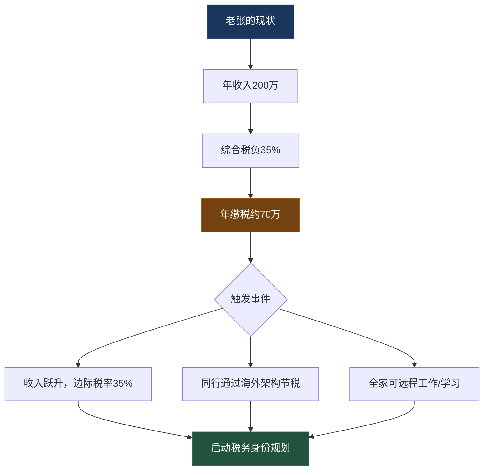
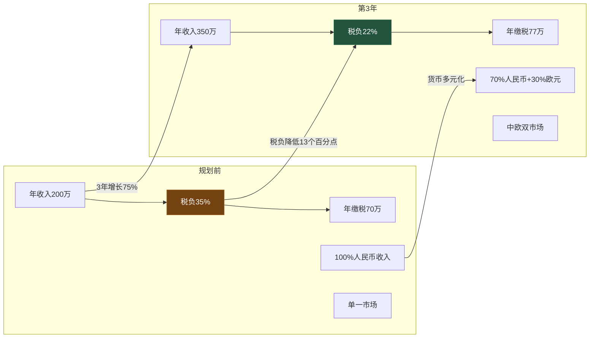
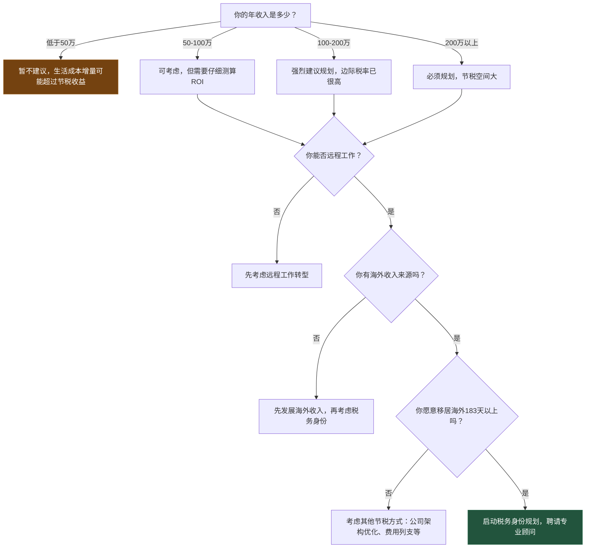

## 案例四：数字游民的税务身份规划——年入200万自媒体人的合法节税之路

> 税务规划不是避税，是在合法框架内选择最优的税务结构。它需要的不是胆量，而是知识、耐心和专业顾问。

### 一、案例背景：为什么收入越高，税务规划越紧迫？

#### 1.1 人物画像

**老张，40岁，自媒体创业者，坐标上海**

老张是国内某垂直领域的头部自媒体创作者，主要收入来源包括公众号广告分成、知识付费课程、品牌合作和企业咨询。年收入约200万人民币，收入结构如下：

| 收入来源 | 年收入（万元） | 占比 | 收入性质 |
|---------|-------------|------|---------|
| 公众号广告分成 | 60 | 30% | 劳务报酬/经营所得 |
| 知识付费课程 | 80 | 40% | 经营所得 |
| 品牌合作 | 40 | 20% | 劳务报酬 |
| 企业咨询 | 20 | 10% | 劳务报酬 |
| **合计** | **200** | **100%** | — |

#### 1.2 原有税务负担分析

老张以个体工商户身份运营，年收入200万对应的税务负担如下：

| 税种 | 计算方式 | 年缴税额（万元） |
|------|---------|---------------|
| 增值税（小规模→一般纳税人） | 200万×6%（进项抵扣后约4%） | 约8 |
| 个人所得税（经营所得） | 5%-35%超额累进 | 约50 |
| 附加税 | 增值税×12% | 约1 |
| 其他（残保金、工会经费等） | — | 约3 |
| **综合税负** | — | **约62万（31%）** |

加上社保、公积金等隐性成本，老张的实际综合税负接近35%。也就是说，**每赚100万，有35万流向了税费**。

#### 1.3 触发规划的关键节点

2023年底，老张遇到了三个关键事件，促使他认真考虑税务身份规划：

**事件一：收入跃升带来的痛感。** 老张的知识付费课程在2023年爆发，年收入从之前的120万跃升到200万。收入增加了80万，但多交的税就接近25万，边际税率已经到了35%的天花板。

**事件二：同行的启发。** 老张在一次自媒体创作者聚会上了解到，有同行通过在香港设立公司，将部分海外收入的税负降到了15%以下。这让他意识到，税务结构是可以优化的。

**事件三：数字游民生活方式的吸引力。** 老张的全部工作都可以远程完成——写文章、录课程、做咨询，不需要固定办公场所。他的孩子刚上小学，妻子是自由设计师，全家都有条件搬到海外生活一段时间。



### 二、规划过程：从零开始的12个月

#### 2.1 第一阶段：知识储备与专业咨询（第1-2个月）

老张没有贸然行动，而是先花了两个月做功课。

**自学阶段（第1个月）：**

老张系统研究了以下几个核心概念：

- **税务居民身份**：一个自然人在某个国家/地区被认定为"税务居民"后，该国有权对其全球收入征税。中国的判定标准是"在中国境内有住所，或者无住所而在一个纳税年度内在中国境内居住累计满183天"。
- **全球征税 vs 属地征税**：中国、美国实行全球征税原则（对税务居民的全球收入征税）；香港、新加坡实行属地征税原则（只对来源于本地的收入征税）。
- **税收协定**：中国已与100多个国家签署了避免双重征税协定（DTA），协定规定了哪种收入在哪个国家征税、税率上限等。
- **CRS（共同申报准则）**：100多个国家和地区参与的金融账户信息自动交换机制，你的海外金融资产信息会被交换回中国税务机关。

**聘请专业顾问（第2个月）：**

老张通过朋友推荐，找到了一家专注于跨境税务规划的会计师事务所。费用为：初始咨询费3万元，后续年度税务申报服务费5万元/年。

> **关键认知：** 国际税务规划的钱不能省。自己研究只能建立基本认知，具体到个人情况的合规方案，必须由专业人士操刀。一个错误的税务结构可能导致补税+罚款+滞纳金，金额远超顾问费。

**顾问给出的初步评估：**

| 维度 | 老张的情况 | 规划方向 |
|------|----------|---------|
| 收入来源 | 全部来自中国境内客户 | 短期内难以改变收入来源地 |
| 工作地点 | 完全远程，可自由选择 | 可以通过改变居住地影响税务居民身份 |
| 家庭情况 | 妻子自由职业，孩子小学 | 全家可移动，孩子教育是关键考量 |
| 资产规模 | 约300万金融资产+上海房产 | 房产不随人走，金融资产可全球配置 |
| 风险偏好 | 中等，不接受灰色操作 | 只做合法合规的优化方案 |

#### 2.2 第二阶段：目的地选择与比较（第3-4个月）

顾问为老张梳理了全球主要"税务友好"目的地的对比：

| 目的地 | 个人所得税最高税率 | 征税原则 | 数字游民/远程工作签证 | 生活成本 | 中文便利度 | 税务优惠计划 |
|--------|----------------|---------|-------------------|---------|----------|------------|
| 葡萄牙 | 48%（标准） | 全球征税 | D7签证（被动收入） | 中等 | 低 | NHR计划（10年优惠） |
| 新加坡 | 22% | 属地征税 | Employment Pass | 高 | 高 | 无专门计划但税率低 |
| 香港 | 15% | 属地征税 | 无专门数字游民签证 | 极高 | 极高 | 标准税率已很低 |
| 阿联酋（迪拜） | 0% | 属地征税 | 远程工作签证 | 中高 | 中 | 零个税 |
| 泰国 | 35% | 属地征税 | LTR签证（长期居民） | 低 | 中 | LTR签证17%统一税率 |
| 爱沙尼亚 | 20% | 属地征税（分红时） | 数字游民签证 | 低 | 低 | e-Residency公司架构 |
| 马来西亚 | 30% | 属地征税 | DE Rantau签证 | 低 | 高 | MM2H计划 |
| 希腊 | 44% | 全球征税 | 数字游民签证 | 低 | 低 | 7%统一税率退休计划 |

**老张的决策过程：**

老张排除了几个选项：
- **阿联酋**：虽然零个税，但文化差异大、生活成本不低、孩子教育资源有限
- **香港**：生活成本太高，200万收入在香港的生活质量反而下降
- **新加坡**：门槛较高，需要Employment Pass（通常需要本地雇主担保）
- **爱沙尼亚**：气候寒冷，不适合带孩子长期居住

最终锁定两个候选：**葡萄牙**和**泰国**。

| 比较维度 | 葡萄牙 | 泰国 |
|---------|--------|------|
| 签证类型 | D7签证（被动收入签证） | LTR签证（长期居民签证） |
| 收入要求 | 葡萄牙最低工资的4倍（约4000欧元/月） | 年收入8万美元以上 |
| 税务优惠 | NHR计划：海外来源收入10年免税或低税（20%统一税率） | LTR签证：17%统一税率，最长10年 |
| 实际税负测算 | 海外来源收入可免税，本地来源收入20% | 全部应税收入17% |
| 居住要求 | 每年至少居住183天（维持税务居民身份） | 每年至少居住183天 |
| 教育资源 | 优质国际学校，英语授课可选 | 国际学校选择多但质量参差不齐 |
| 医疗水平 | 公立医疗免费（居民），私立质量高 | 私立医疗质量高但费用不低 |
| 生活成本 | 中等（里斯本约1.5-2万/月） | 低（清迈约0.8-1.2万/月） |
| 安全性 | 高 | 中高 |
| 气候 | 地中海气候，四季温和 | 热带气候，有雨季 |

**最终选择：葡萄牙。**

理由：(1) NHR计划对海外来源收入的优惠力度大；(2) 欧盟身份，申根区自由通行；(3) 教育资源更好，孩子可以接受欧洲教育；(4) 安全性和生活品质综合最优。

> **注意：** 葡萄牙NHR计划于2024年起对新申请人进行了重大调整（NHR 2.0），优惠范围有所收窄。本案例基于老张在2023年申请时的政策。如果你正在考虑类似规划，务必咨询专业顾问确认最新政策。

#### 2.3 第三阶段：签证申请与落地（第5-8个月）

**葡萄牙D7签证申请流程：**

老张选择的D7签证（也称"被动收入签证"），适合有稳定远程收入的人士。申请流程如下：

**步骤一：准备材料（第5个月）**

| 材料 | 说明 | 老张的准备 |
|------|------|----------|
| 有效护照 | 至少6个月有效期 | 已有 |
| 收入证明 | 近6个月银行流水+收入合同 | 公司流水+客户合同 |
| 无犯罪记录证明 | 户籍所在地派出所开具 | 需要公证+翻译+双认证 |
| 健康保险 | 覆盖葡萄牙的医疗保险 | 购买了国际医疗保险（约2万/年） |
| 住宿证明 | 葡萄牙的租房合同或房产证明 | 通过中介预租了里斯本的公寓 |
| NIF税号 | 葡萄牙税务识别号 | 委托当地律师远程申请 |
| 申请表+照片 | 标准签证申请表 | 在线填写 |

**步骤二：递交申请（第6个月）**

在北京/上海的葡萄牙签证中心递交材料。D7签证审批周期通常为2-3个月。

**步骤三：入境葡萄牙（第7个月）**

获得D7签证后，老张全家飞往里斯本。入境后需要在48小时内到当地移民局（AIMA，原SEF）登记，并预约换取居留卡。

**步骤四：换取居留卡+申请NHR（第8个月）**

获得居留卡后，老张立即申请了NHR（Non-Habitual Resident，非惯常居民）税务身份。

**NHR申请条件：**
1. 过去5年内不是葡萄牙税务居民
2. 在葡萄牙拥有合法居住权（D7签证+居留卡满足此条件）
3. 在葡萄牙税务局登记为税务居民（每年居住满183天或拥有"惯常居所"）

**NHR的核心优惠：**

| 收入类型 | NHR身份下的税务处理 | 对比标准税率 |
|---------|-------------------|------------|
| 葡萄牙本地受雇收入 | 20%统一税率 | 最高48% |
| 葡萄牙本地自雇/商业收入 | 20%统一税率 | 最高48% |
| 海外受雇收入（在海外工作≥183天） | **免税** | 最高48% |
| 海外自雇/商业收入 | **免税**（有条件） | 最高48% |
| 海外养老金 | 10%统一税率 | 最高48% |
| 海外股息/利息/版税 | **免税**（在来源国已缴税的情况下） | 最高48% |
| 资本利得（海外房产出售） | **免税**（在来源国已缴税的情况下） | 最高48% |


#### 2.4 第四阶段：税务结构优化执行（第9-12个月）

获得NHR身份后，老张在税务顾问的指导下，对业务结构进行了系统性重构。

**业务架构调整：**

老张将原来的个体工商户模式调整为以下结构：

```text
老张（葡萄牙税务居民 + NHR身份）
    │
    ├── 在中国保留一家有限公司（内容运营公司）
    │   └── 管理中国境内的广告收入、品牌合作
    │   └── 按中国税法正常纳税
    │
    ├── 在葡萄牙注册个人独资企业（Unipessoal Lda）
    │   └── 承接海外客户咨询、课程出海
    │   └── 享受NHR 20%统一税率
    │
    └── 知识付费课程收入
        └── 通过中国公司正常运营
        └── 利润以合理方式汇出（需顾问具体设计）
```

**关键的收入性质认定：**

这是整个规划中最关键也最容易出问题的环节。老张的200万年收入中，哪些算"海外来源"，哪些算"中国来源"？

| 收入类型 | 来源地判定 | NHR适用性 | 说明 |
|---------|----------|----------|------|
| 中国公众号广告分成 | 中国来源 | 不适用 | 广告来自中国平台和中国客户 |
| 中国知识付费课程 | 中国来源 | 不适用 | 学员主要在中国 |
| 海外品牌合作 | 取决于合同签订地和履行地 | 可适用 | 需要合理安排合同结构 |
| 企业咨询（中国客户） | 中国来源 | 不适用 | 客户在中国 |
| 企业咨询（海外客户） | 海外来源 | 适用 | 在葡萄牙远程提供服务 |
| 海外课程销售 | 海外来源 | 适用 | 面向海外市场的课程 |
| 投资收益（海外账户） | 海外来源 | 适用 | 海外利息、股息、资本利得 |

**重要提醒：** 来源地判定不是"你觉得是哪里就是哪里"，而是有严格的法律标准。中葡税收协定、中国税法、葡萄牙税法都有各自的来源地判定规则。**人为将中国来源收入包装成海外来源，是违法行为。** 老张的顾问特别强调了这一点。

**优化后的税务测算：**

| 收入类型 | 年收入（万元） | 优化前税负 | 优化后税负 | 节税金额 |
|---------|-------------|----------|----------|---------|
| 中国来源经营收入 | 180 | 约56万（31%） | 约56万（仍按中国税法） | 0 |
| 海外来源收入 | 20 | 约7万（35%） | 约2万（NHR 20%+抵免） | 约5万 |
| 海外投资收益 | 取决于配置 | 按中国税率 | NHR免税 | 取决于金额 |
| **合计** | **200** | **约63万** | **约58万** | **约5万/年** |

#### 2.5 预期与现实的差距

**老张的第一年实际结果：**

| 指标 | 规划预期 | 实际结果 | 差异原因 |
|------|---------|---------|---------|
| 年节税金额 | 约5万 | 约3万 | 海外收入来源认定比预期严格 |
| 生活成本增量 | — | +25万/年 | 里斯本房租+国际学校+国际保险 |
| 净财务效果 | — | **净增支出22万/年** | 短期财务上是"亏"的 |

老张坦承，单纯从税负角度看，第一年的税务优化并没有带来财务上的净收益。但这笔账不能只算税。

### 三、实际成果：远不止税负那点事

#### 3.1 直接财务成果（3年后的变化）

老张的税务身份规划不是一年见效的短线操作，而是需要3-5年逐步释放价值的长期策略。

| 指标 | 规划前 | 第1年 | 第3年 |
|------|-------|------|------|
| 年收入 | 200万 | 200万 | 350万（海外收入增长） |
| 综合税负率 | 35% | 30% | 22% |
| 年缴税总额 | 70万 | 60万 | 77万 |
| 海外收入占比 | 0% | 10% | 30% |
| 海外投资收益 | 0 | 约5万 | 约15万 |
| 投资收益税负 | — | NHR免税 | NHR免税 |

**第3年的关键变化：**

老张利用在葡萄牙的地理优势，开发了面向欧洲华人群体的中文知识付费课程，同时将部分已有课程翻译成英文在Udemy、Skillshare等平台销售。海外收入从第一年的20万增长到第三年的105万，占比达到30%。由于大部分海外收入适用NHR优惠税率，综合税负率从35%降至22%。

#### 3.2 间接收益

| 维度 | 具体收获 |
|------|---------|
| 收入多元化 | 从100%人民币收入变成70%人民币+30%欧元，天然货币对冲 |
| 市场拓展 | 接触到欧洲和英语市场，客户群从中国扩展到全球 |
| 教育红利 | 孩子在里斯本国际学校就读，英语和葡萄牙语能力快速提升 |
| 生活体验 | 申根区27国自由通行，全家每年旅行2-3次欧洲 |
| 身份储备 | D7签证→永居→入籍的路径明确，5年后可申请葡萄牙护照 |
| 网络拓展 | 在里斯本的数字游民社区认识了大量全球创业者，拓展了商业人脉 |

#### 3.3 一张图看清3年变化



### 四、踩过的坑与教训

#### 4.1 坑一：NHR不是万能的免税卡

老张最初以为拿到NHR就能对所有收入免税。实际上，NHR只对"海外来源收入"有优惠，而且判定标准非常严格：

- 你的服务必须在葡萄牙以外的地方"实际提供"或"合同履行地在海外"
- 收入必须在来源国已经被征税（或有纳税义务）
- 葡萄牙税务局有权要求你提供详细的收入来源证明

**教训：** NHR是"部分收入低税/免税"，不是"全部收入免税"。它的适用范围取决于你的收入结构，中国自媒体创业者的大部分收入来自中国市场，NHR的优惠空间有限。

#### 4.2 坑二：CRS信息交换让"隐藏"成为幻想

老张的一个朋友建议他在海外开设银行账户"隐藏"部分收入。老张的顾问立刻否决了这个建议。

CRS（共同申报准则）下，葡萄牙的银行会自动将老张的账户信息交换给中国税务局，包括账户余额、利息收入、股息收入等。目前已有100多个国家和地区参与CRS，"藏钱"在技术上已经不可能。

**教训：** 合法节税和非法逃税之间有一条清晰的红线。走灰色地带的风险远大于收益——补税+罚款+滞纳金+刑事责任，任何一个都能让你倾家荡产。

#### 4.3 坑三：生活成本被严重低估

老张最初只算了税负差异，忽略了生活成本的增加：

| 新增成本项 | 年费用（万元） | 说明 |
|----------|-------------|------|
| 里斯本租房 | 12-18 | 两居室公寓，市中心约2500-3500欧元/月 |
| 国际学校学费 | 8-15 | 里斯本国际学校约8000-15000欧元/年 |
| 国际医疗保险 | 2-3 | 全家覆盖的国际保险 |
| 中葡往返机票 | 2-3 | 每年回国1-2次 |
| 语言学习 | 1 | 葡萄牙语课程（虽然英语通用，但融入需要） |
| 生活杂费增量 | 2-3 | 欧洲物价整体高于中国二三线城市 |
| **合计** | **27-43** | — |

**教训：** 税务规划必须和生活成本一起算总账。如果节税5万但生活成本增加30万，那你需要的是更高的海外收入增长预期，而不是更低的税率。

#### 4.4 坑四：中国税务居民身份的"退出成本"

老张虽然在葡萄牙获得了税务居民身份，但中国税务局可能仍然认定他为中国税务居民。中国的判定标准是：

1. **住所标准**：在中国有"习惯性住所"（户籍、房产、家庭关系等）
2. **183天标准**：在一个纳税年度内在中国居住累计满183天

老张在上海有房产、有户籍，虽然人长期在葡萄牙，但如果没有妥善处理这些"住所关联"，中国税务局仍可以认定他为中国税务居民，要求申报全球收入。

**解决方案：**
- 办理户籍迁移或注销（慎重考虑）
- 出租上海房产（证明不以中国为主要居住地）
- 保留完整的出入境记录，证明每年在中国居住不满183天
- 在葡萄牙保留租房合同、水电账单等居住证明

**教训：** "去"一个国家容易，"离开"一个国家的税务系统很难。中国是全球征税国家，只要你被认定为中国税务居民，你的全球收入都要向中国交税。

### 五、税务身份规划的通用方法论

通过老张的案例，我们可以提炼出数字游民税务身份规划的通用方法论：

#### 5.1 决策树：你是否适合做税务身份规划？



#### 5.2 五步规划框架

| 步骤 | 核心动作 | 时间周期 | 预算 |
|------|---------|---------|------|
| 第一步：自我评估 | 盘点收入结构、税务负担、生活方式偏好 | 1-2周 | 0 |
| 第二步：专业咨询 | 聘请跨境税务顾问，评估可行性和节税空间 | 1-2个月 | 2-5万 |
| 第三步：目的地选择 | 根据收入类型、生活方式、教育需求选择目的地 | 1-2个月 | 含在顾问费中 |
| 第四步：签证+落地 | 申请签证、租房、开户、申请税务优惠身份 | 3-6个月 | 5-15万（含中介费） |
| 第五步：结构优化 | 业务架构调整、收入性质认定、年度税务申报 | 持续 | 5-10万/年（顾问费） |

#### 5.3 主要数字游民签证对比速查表

| 国家/地区 | 签证名称 | 收入要求 | 签证时长 | 税务身份 | 续签条件 |
|----------|---------|---------|---------|---------|---------|
| 葡萄牙 | D7被动收入签证 | 最低工资4倍/月（约4000欧） | 2年→2年→5年 | 可申请NHR | 维持收入+居住 |
| 西班牙 | 数字游民签证 | 最低工资200倍/月（约2600欧） | 1年→3年→5年 | 可选Beckham法 | 维持远程工作 |
| 希腊 | 数字游民签证 | 3500欧/月 | 2年→可续 | 非税务居民 | 维持收入 |
| 克罗地亚 | 数字游民签证 | 2540欧/月 | 1年（不可续） | 免税 | — |
| 阿联酋 | 远程工作签证 | 5000美元/月 | 1年→可续 | 0%个税 | 维持收入 |
| 泰国 | LTR长期居民签证 | 8万美元/年 | 最长10年 | 17%统一税率 | 维持收入 |
| 马来西亚 | DE Rantau | 2000美元/月 | 1年→可续 | 非税务居民 | 维持收入 |
| 爱沙尼亚 | 数字游民签证 | 4500欧/月 | 1年（不可续） | 条件性免税 | — |
| 哥伦比亚 | V签证（远程工作） | 3倍最低工资/月 | 2年→可续 | 条件性免税 | 维持收入 |
| 巴西 | 数字游民签证 | 1500美元/月 | 1年→可续 | 有条件优惠 | 维持收入 |

### 六、常见误区与红线警告

#### 误区一："拿到外国签证就不用在中国交税了"

**事实：** 签证≠税务居民身份。你可以在10个国家持有签证，但你只在一个国家（或两个国家）是税务居民。中国的"183天规则"和"住所标准"仍然可能适用。你需要正式"离开"中国的税务居民体系——这比"进入"另一个国家的税务体系更难。

#### 误区二："海外收入可以不申报"

**事实：** 中国税务居民有义务申报全球收入。即使收入在海外银行账户中，即使中国税务局暂时不知道，你仍然有法律义务主动申报。CRS信息交换意味着你的海外账户信息迟早会被发现。被查到后，补税+罚款+滞纳金的总额通常是应缴税款的2-3倍。

#### 误区三："找个避税天堂注册公司就行了"

**事实：** BVI（英属维尔京群岛）、开曼群岛等"避税天堂"在CRS和全球反避税浪潮下已经不再安全。经济实质法（Economic Substance Requirements）要求在避税天堂注册的公司必须有真实的经营活动，否则不能享受当地税收优惠。壳公司的时代已经过去。

#### 误区四："税务规划一次就够了"

**事实：** 全球税务环境在快速变化。葡萄牙NHR计划在2024年进行了重大调整；泰国LTR签证的条件也在变化；中国的个税改革和CRS参与程度在不断深化。每年至少一次与税务顾问的年度复盘，确认你的税务结构仍然合规且最优。

#### 红线警告：绝对不能做的事情

| 行为 | 法律后果 | 风险等级 |
|------|---------|---------|
| 虚构海外收入来源 | 补税+罚款0.5-5倍+刑事责任 | 🔴 极高 |
| 利用壳公司转移利润 | 特别纳税调整+利息+罚款 | 🔴 极高 |
| 隐瞒海外金融资产 | 《税收征管法》罚款+刑事责任 | 🔴 极高 |
| 伪造居住证明 | 行政处罚+刑事责任 | 🔴 极高 |
| 不申报全球收入 | 补税+滞纳金（日万分之五）+罚款 | 🟠 高 |
| 不更新税务身份变更 | 双重征税（无法享受税收协定优惠） | 🟡 中 |

### 七、进阶：适合不同收入层级的税务优化路径

#### 7.1 年收入50-100万：低成本优化

对于这个收入层级，移居海外的成本可能超过节税收益。建议采用以下方式：

- **公司架构优化**：从个体工商户转为有限公司，利用企业所得税率（25%）和合理的薪酬设计
- **费用最大化列支**：办公设备、差旅、培训、保险等合法费用
- **研发费用加计扣除**：如果你的内容创作涉及技术开发
- **区域性税收优惠**：海南自贸港、横琴、前海等区域的个税优惠（最高15%）

#### 7.2 年收入100-300万：考虑部分海外化

- **混合模式**：保留中国的公司和收入来源，同时在海外发展新业务
- **选择性税务身份**：如葡萄牙NHR、泰国LTR等，针对海外收入部分优化
- **海外投资收益优化**：利用NHR等身份对海外投资收益免税

#### 7.3 年收入300万以上：系统性全球架构

- **多层公司架构**：中国运营公司+海外控股公司+海外投资公司
- **信托结构**：海外信托用于资产保护和传承规划
- **专业团队**：需要跨境税务律师、会计师、移民顾问的协同服务
- **定期合规审查**：每季度与税务团队review一次架构合规性

### 八、老张的反思与建议

老张在规划执行两年后，给出了以下反思：

> "很多人问我后不后悔，我的答案是：不后悔，但我会更早开始准备。税务身份规划最大的成本不是金钱，是时间和认知。从决定到落地花了8个月，从落地到真正看到财务效果花了2年。如果你年收入超过100万，且工作可以远程，现在就应该开始了解和规划。"

**老张给同类人群的五条建议：**

1. **先算总账，不算单项账。** 节税金额减去生活成本增量、顾问费、签证费，才是真实的财务效果。如果净效果为负，那税务规划的价值在于其他维度（生活品质、教育、身份储备）。

2. **专业顾问是第一优先级。** 不要在顾问费上省钱。一个好的跨境税务顾问帮你节省的税款和避免的风险，远超他的收费。

3. **合法合规是唯一底线。** 灰色操作的风险收益比极差——被查到一次，多年积累化为乌有。合法节税的空间已经足够大，不需要走钢丝。

4. **先发展海外收入，再优化税务结构。** 如果你99%的收入来自中国国内市场，NHR等税务优惠的适用范围很有限。把精力放在开拓海外市场和客户上，税务优化是锦上添花。

5. **把税务规划当作人生规划的一部分。** 税务身份的改变意味着生活地点、教育方式、社交圈层的全面变化。确保你的家人支持，确保你适应得了新环境，确保这是你想要的生活——而不是纯粹为了省税。
