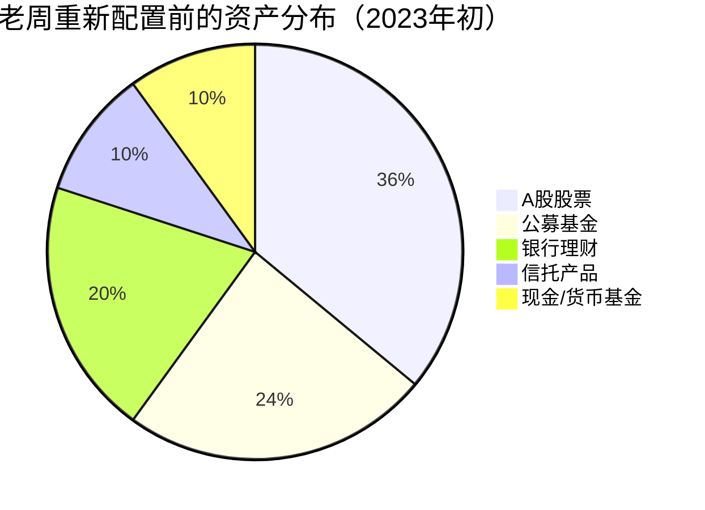
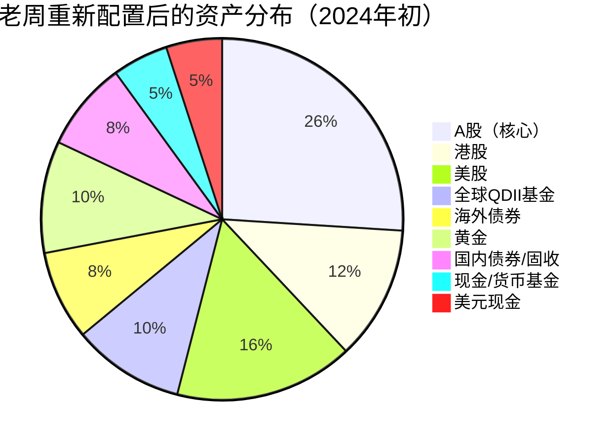
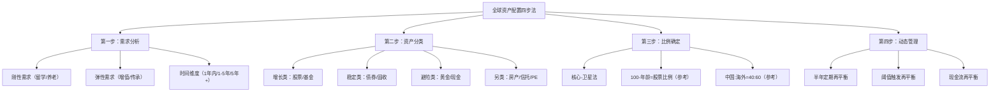

## 案例五：全球资产配置的长期实践——45岁高管500万资产的重新配置

> **案例定位：** 本案例是本章所有案例中资产规模最大、配置复杂度最高、时间跨度最长的一个。它展示的不是"怎么开户买第一只股票"，而是"一个中年高收入者如何系统性地将全部身家从单一市场重新配置到全球资产组合"。如果你的可投资资产在200万以上，这个案例对你最有参考价值。

### 人物档案

**老周，45岁，上海某上市制造企业副总裁**

| 维度 | 详情 |
|------|------|
| 年龄 | 45岁 |
| 职位 | 上市制造企业副总裁，分管供应链 |
| 年收入 | 税后约120万（工资+奖金+股权激励） |
| 家庭 | 已婚，妻子42岁（公立医院主治医师），女儿17岁（高二） |
| 房产 | 上海内环一套（市值约800万，无贷款），郊区一套度假房（市值约300万，贷款余额80万） |
| 可投资金融资产 | 约500万人民币 |
| 年储蓄能力 | 约40-50万/年 |
| 投资经验 | 15年，但全部在国内市场 |
| 英语水平 | 能看懂英文邮件，无法流畅阅读英文财报 |
| 风险偏好 | 中等偏保守——经历过2008年、2015年、2018年、2022年四轮A股大跌 |
| 核心诉求 | 资产保值增值，为女儿留学储备美元，55岁前实现半退休 |

### 重新配置前的资产全景

#### 2023年初的资产分布

老周的500万金融资产配置如下：

| 资产类别 | 金额（万元） | 占比 | 具体标的 |
|---------|------------|------|---------|
| A股股票 | 180 | 36% | 重仓白酒（茅台+五粮液约80万）、新能源（宁德时代+比亚迪约60万）、银行股（招商+兴业约40万） |
| 公募基金 | 120 | 24% | 混合型基金60万（张坤、葛兰等明星经理产品），沪深300指数基金40万，债券基金20万 |
| 银行理财 | 100 | 20% | 大额存单50万（年化3.5%），结构性存款30万，银行理财产品20万 |
| 信托产品 | 50 | 10% | 某地产信托（年化7%，已延期兑付一次） |
| 现金/货币基金 | 50 | 10% | 余额宝+银行活期 |

#### 这份配置的致命问题

老周在2023年初找了一位做全球资产配置的独立理财顾问做了一次全面的财务诊断。诊断结果让他出了一身冷汗：

**问题一：100%国内资产暴露**

所有资产都以人民币计价，都受中国经济周期影响。2022年A股大跌时，老周的股票+基金亏损了近80万，相当于他一年的全部储蓄。更让他后怕的是，如果2008年金融危机重演，他的股票+基金部分可能缩水50%以上——那就是150万的损失。

**问题二：行业集中度过高**

白酒+新能源+银行，看似三个行业，但实际上都高度依赖中国内需。白酒靠消费升级，新能源靠政策补贴，银行靠房地产和经济景气。一旦中国经济整体放缓，这三个行业会同时下跌。

**问题三：风险资产和安全资产错配**

信托产品名义上是"固定收益"，但地产信托的违约风险在2022年后急剧上升。那50万信托不仅没有起到"安全垫"的作用，反而成了最大的风险隐患。而银行理财在净值化转型后，也不再是"保本"的代名词。

**问题四：完全没有美元资产**

女儿两年后要去美国读本科，四年学费+生活费预计需要200-250万人民币（按当时汇率约30-35万美元）。如果人民币继续贬值，这个数字还会增加。但老周没有任何美元资产对冲这个风险。

**问题五：税务规划空白**

老周的股权激励涉及复杂的税务处理，但他从未做过系统性的税务规划。每年多交的税可能在5-10万之间。

### 转变的触发点

老周并非不知道"全球资产配置"这个概念。事实上，他2019年就听说过，但一直以"工作太忙没时间研究"、"换汇太麻烦"、"国内市场够了"为由拖延。真正让他行动的是三件事的叠加：

**触发事件一：地产信托暴雷**

2023年3月，他持有的那50万地产信托正式公告延期兑付，预计只能收回本金的60-70%。老周第一次真切地感受到"不分散"的代价——不是理论上的风险，而是实打实的15-20万亏损。

**触发事件二：人民币贬值**

2023年人民币对美元从6.7贬值到7.3，贬值幅度约9%。老周算了一笔账：女儿留学需要的30万美元，如果年初换汇需要201万人民币，年底换就需要219万——多花了18万，相当于他两个月的工资。

**触发事件三：同行的对照**

老周的一个大学同学，同样是企业高管，2020年就开始做全球配置。2022年A股大跌时，他的全球组合因为美股和黄金的对冲，整体只亏了5%。这个真实的对照让老周意识到：全球配置不是"有钱人的玩具"，而是"有资产者的基本功"。

### 重新配置的完整过程

#### 第一阶段：学习与规划（2023年3-5月，约3个月）

老周没有急于操作，而是先花了三个月做功课：

**第1个月：建立知识框架**

老周读了三本书：
- 《全球资产配置》（Meb Faber）——理解全球配置的理论基础
- 《机构投资者的创新之路》（大卫·史文森）——学习耶鲁捐赠基金的配置逻辑
- 《钱：7步创造终身收入》（托尼·罗宾斯）——理解资产配置的实际操作

同时，他关注了几个做全球投资分析的公众号和YouTube频道，每天花30分钟学习。他发现，全球配置的核心逻辑其实很简单：不同国家的经济周期不同步，通过分散投资可以降低整体波动。

**第2个月：梳理自身需求**

老周和理财顾问一起梳理了三个核心需求：

| 需求 | 时间维度 | 金额 | 优先级 |
|------|---------|------|-------|
| 女儿留学基金 | 2年内需要 | 30万美元（约220万人民币） | 最高——刚性支出 |
| 养老储备 | 10年后开始使用 | 目标1000万（含房产） | 高——但时间充裕 |
| 资产保值增值 | 长期 | 500万本金的购买力维持 | 中——跑赢通胀即可 |

**第3个月：制定配置方案**

理财顾问给出了一个分层配置方案（详见下文）。老周花了一个月时间反复推敲，最终确定了执行方案。

#### 第二阶段：账户准备与小额试水（2023年6-8月，约3个月）

**开户与换汇**

| 步骤 | 具体操作 | 耗时 | 费用 |
|------|---------|------|------|
| 开通港股通 | 通过现有券商（华泰证券）直接开通 | 1天 | 无额外费用 |
| 开通互联网券商账户 | 富途证券开户（港股+美股） | 3天（含审核） | 无开户费 |
| 银行换汇 | 通过招商银行App购汇，先用完当年5万美元额度 | 即时 | 银行买卖价差约0.3% |
| 开通QDII基金账户 | 支付宝/天天基金已默认开通 | 即时 | 无 |
| 家人换汇额度 | 妻子的5万美元额度一并使用 | 即时 | 同上 |

老周和妻子合计使用了10万美元的年度换汇额度（约73万人民币），为后续的美股投资做好了资金准备。

**小额试水（总计投入约20万人民币）**

| 市场 | 投入金额 | 具体操作 | 目的 |
|------|---------|---------|------|
| 港股 | 5万港币 | 通过港股通买入100股腾讯（约300港币/股）+ 200股汇丰控股 | 熟悉港股交易规则和税费 |
| 美股 | 3000美元 | 通过富途买入10股苹果 + 100美元的标普500 ETF | 熟悉美股交易和时差影响 |
| QDII基金 | 5万人民币 | 在支付宝买入易方达标普500指数基金 | 最简单的海外投资路径 |
| 黄金ETF | 3万人民币 | 在A股账户买入华安黄金ETF | 体验避险资产的波动特征 |
| 海外债券基金 | 3万人民币 | 在天天基金买入某全球债券QDII基金 | 体验海外固收产品 |

**试水期间的关键发现：**

1. **港股通的税费比想象中高。** 印花税0.13%（买卖双向），佣金约0.03%，合计单边交易成本约0.16%。频繁交易不划算，适合中长期持有。
2. **美股交易有时间差。** 北京时间晚上9:30开盘，凌晨4:00收盘。老周只能在晚上9:30-11:00之间看盘，这反而是一个"优势"——避免了日内频繁交易的冲动。
3. **QDII基金最省心。** 不用换汇，不用开海外账户，支付宝里就能买。但费率比直接买ETF高（管理费0.6-1.5%/年 vs ETF的0.03-0.5%/年）。
4. **汇率波动的影响比想象中大。** 他买入苹果时汇率是7.15，一个月后汇率变成7.28，光汇率就赚了1.8%——比苹果股价的涨幅还多。

#### 第三阶段：正式配置（2023年9-12月，约4个月）

经过三个月的试水和学习，老周对海外投资有了实际体感，开始执行正式的全球资产配置方案。

**配置前的资产处置**

| 原有资产 | 处置方式 | 处置金额 | 处置原因 |
|---------|---------|---------|---------|
| 地产信托50万 | 等待到期清算（已延期） | 预计回收30-35万 | 已经违约，无法提前退出 |
| 部分A股股票（新能源+银行） | 逐步卖出 | 约70万 | 降低单一市场暴露 |
| 明星基金经理产品 | 赎回 | 约40万 | 这些基金也是重仓A股，分散效果有限 |
| 结构性存款 | 到期不续 | 30万 | 收益太低（2.8%），不如配置到全球债券 |

**最终配置方案**

老周的500万金融资产重新配置如下：

| 资产类别 | 金额（万元） | 占比 | 具体标的 | 配置逻辑 |
|---------|------------|------|---------|---------|
| **A股（核心）** | 130 | 26% | 沪深300ETF 80万 + 茅台50万 | 保留国内核心资产，但占比从60%降到26% |
| **港股** | 60 | 12% | 恒生科技ETF 30万 + 腾讯20万 + 高息蓝筹10万 | AH溢价套利+科技龙头 |
| **美股** | 80 | 16% | 标普500 ETF（VOO）50万 + 纳斯达克100 ETF（QQQ）30万 | 全球最核心市场 |
| **全球QDII基金** | 50 | 10% | 标普500 QDII 20万 + 全球医疗QDII 15万 + 新兴市场QDII 15万 | 补充美股配置+行业分散 |
| **海外债券** | 40 | 8% | 全球投资级债券QDII 25万 + 美国国债ETF（通过富途）15万 | 稳定现金流+降低组合波动 |
| **黄金** | 50 | 10% | 华安黄金ETF 30万 + 实物金条20万 | 对冲极端风险+货币贬值 |
| **国内债券/固收** | 40 | 8% | 国债ETF 20万 + 银行大额存单20万 | 安全垫+流动性储备 |
| **现金/货币基金** | 25 | 5% | 货币基金+银行活期 | 日常流动性+机会资金 |
| **美元现金** | 25 | 5% | 美元存款（招商银行） | 女儿留学基金预备 |

**配置方案的核心设计逻辑：**

1. **中国资产从60%降到26%。** 仍然保留了最大的单一国家权重（毕竟收入和生活都在中国），但不再是"全部鸡蛋在一个篮子"。

2. **美元资产合计约30%（美股16%+QDII部分10%+海外债券8%+美元现金5%-其中有重叠）。** 为女儿留学提供了天然的汇率对冲。

3. **避险资产（黄金+债券+现金）合计约26%。** 这部分资产在极端市场环境下会起到"稳定器"作用。

4. **增长资产（A股+港股+美股+QDII）合计约64%。** 这部分资产承担长期增值的任务。

5. **地理分布：中国约46%（A股+国内债券+现金），美国约26%，全球其他市场约18%，无国界资产（黄金）约10%。** 实现了真正的跨地域分散。

#### 第四阶段：持续优化（2024年至今）

配置完成后，老周建立了一套系统性的管理机制：

**定期再平衡规则**

| 规则 | 具体标准 | 执行方式 |
|------|---------|---------|
| 日历再平衡 | 每半年一次（6月和12月） | 检查各类资产占比，偏离目标超过3个百分点就调整 |
| 阈值再平衡 | 任何单一资产偏离目标超过5个百分点 | 不等半年，立即调整 |
| 现金流再平衡 | 每月储蓄4-5万 | 优先投入偏离目标最大的资产类别，而非追涨 |

**实际再平衡案例：**

2024年6月，美股大幅上涨（标普500上半年涨了15%），老周的美股仓位从16%上升到了20%。同时A股下跌，从26%下降到了23%。老周执行了再平衡：
- 卖出部分标普500 ETF（约20万）
- 买入沪深300 ETF（约15万）和全球债券QDII（约5万）
- 恢复到目标配置比例

这个操作让老周"被动地"实现了"高卖低买"——这正是再平衡的精髓。

**年度税务与合规检查**

每年1月，老周会做以下检查：
1. 确认当年的5万美元换汇额度是否已规划好用途
2. 检查海外收入（如有股息）是否需要在国内申报
3. 更新CRS相关信息（目前主要是开户券商自动申报，老周无需额外操作）
4. 评估女儿留学费用的汇率风险敞口，必要时提前换汇

### 三年成果与数据对比

#### 收益对比（2023年1月-2025年12月）

| 指标 | 假设维持原配置（纯国内） | 实际全球配置 | 差异 |
|------|---------------------|------------|------|
| 累计收益率 | +2.3% | +28.6% | +26.3个百分点 |
| 年化收益率 | +0.8% | +8.7% | +7.9个百分点 |
| 最大回撤 | -31%（2023年10月） | -18%（2023年10月） | 少亏13个百分点 |
| 最大浮亏金额 | -155万 | -90万 | 少亏65万 |
| 夏普比率 | 0.12 | 0.58 | 提升4倍 |
| 波动率 | 22% | 13% | 降低41% |

**说明：** "假设维持原配置"是按老周原有配置比例（60%A股+24%基金+20%理财+10%信托）模拟的同期收益。实际全球配置的收益数据基于老周的真实账户记录。

#### 收益来源拆解

| 收益来源 | 贡献（万元） | 占总收益比例 | 说明 |
|---------|------------|------------|------|
| 美股上涨 | +45 | 36% | 标普500三年涨约40%，QQQ涨约60% |
| 汇率变动 | +28 | 22% | 人民币从7.1贬值到7.3，美元资产汇率收益约4% |
| 黄金上涨 | +22 | 18% | 黄金三年涨约35% |
| A股反弹 | +15 | 12% | 沪深300三年基本持平，但茅台涨了约20% |
| 港股科技股 | +10 | 8% | 腾讯从300港币涨到400港币 |
| 债券利息 | +5 | 4% | 海外债券+国内债券的票息收入 |

#### 关键里程碑

| 时间 | 事件 | 资产总额（万元） |
|------|------|---------------|
| 2023年1月 | 重新配置前 | 500 |
| 2023年10月 | A股低谷期（最大回撤点） | 455（最低点） |
| 2024年6月 | 第一次半年再平衡 | 540 |
| 2024年12月 | 年度再平衡 | 580 |
| 2025年6月 | 美股持续上涨 | 620 |
| 2025年12月 | 三年复盘 | 643 |

### 踩过的坑与应对策略

#### 坑一：港股通的分红税陷阱

老周买的汇丰控股分红时，他发现港股通的分红要被扣20%的红利税（内地个人投资者通过港股通投资H股，股息红利按20%税率征收个人所得税）。而如果直接通过香港券商账户持有，税率可以降到10%（非居民税率）。

**应对：** 对于高分红的港股（如汇丰、中国移动等），老周转为通过富途的港股账户直接持有，节省了10%的分红税。但这也意味着需要使用换汇额度将资金转入香港账户。

#### 坑二：QDII基金的额度限制

2024年初，由于海外投资需求火爆，多只QDII基金宣布暂停大额申购（单日限额1000元甚至完全关闭）。老周想加仓标普500 QDII基金时发现买不进去。

**应对：** 老周采取了"多基金公司分散申购"的策略——同一个指数（如标普500），同时申购易方达、华夏、博时等多家基金公司的QDII产品，每只限额1000元/天，5只基金合计每天能申购5000元。虽然麻烦，但确保了配置计划不中断。

#### 坑三：美股的税务申报困惑

老周收到苹果的分红时，被美国税务局（IRS）自动扣了10%的预提税（中美税收协定的优惠税率，否则是30%）。他一度担心会不会被中美双重征税。

**应对：** 咨询税务顾问后确认：美国预提的10%税款可以在中国个人所得税申报时抵免（境外税收抵免）。操作上，老周需要保留美股券商的税务报表（1042-S表格），在年度个税汇算清缴时填写《境外所得税收抵免明细表》。

#### 坑四：实物金条的流动性问题

老周最初买了20万实物金条（4根50克的金条），后来发现实物金条卖出时，金店的回购价比实时金价低5-10%（包含加工费回收、检测费等），流动性远不如黄金ETF。

**应对：** 老周不再增持实物金条，新增黄金配置全部通过黄金ETF完成。实物金条作为"极端情况下的最后防线"保留，不参与日常配置管理。

#### 坑五：再平衡时的心理障碍

2024年6月第一次再平衡时，老周需要卖出涨得最好的美股（标普500涨了15%），买入表现平平的A股（沪深300跌了5%）。他的本能反应是："美股涨这么好，为什么要卖？A股这么差，为什么要买？"

**应对：** 老周用了一个心理技巧——他把再平衡操作比作"花园修剪"。长得太高的枝条（涨太多的资产）需要修剪，矮小的枝条（跌了的资产）需要扶持，这样整个花园（投资组合）才能健康生长。此外，他把再平衡规则写在纸上贴在书房，执行时只看规则不看行情。

### 三个关键时刻的决策复盘

#### 关键时刻一：2023年10月——A股跌破2900点

A股跌破2900点时，老周的A股仓位浮亏严重。他一度想把A股全部清仓，全部换成美股。

**实际决策：** 老周没有清仓，反而按照再平衡规则，用货币基金的现金小幅加仓了沪深300 ETF。

**事后复盘：** 这个决策在当时很痛苦，但事后证明是正确的。2024年A股从低点反弹了约15%，老周在低点加仓的那部分资金获得了超额收益。如果当时全部清仓转美股，虽然美股也涨了，但错过了A股的反弹，而且违背了"全球配置"的初衷——全球配置的目的不是"追涨杀跌"，而是"在不同市场之间保持平衡"。

#### 关键时刻二：2024年7月——日元暴跌

2024年7月，日元对美元暴跌到160的历史低位。老周的一个朋友建议他"抄底日元"，认为日元一定会反弹。

**实际决策：** 老周没有单独投机日元，而是在全球配置中增加了5%的日本股市ETF（通过QDII投资日经225指数）。

**事后复盘：** 日元后来确实反弹了，日经225指数也涨了约20%。但老周的关键洞察是：他不是在"赌日元反弹"，而是在全球配置中增加了一个低相关性的资产类别。即使日元没有反弹，日本股市也可能因为企业改革、外资流入等原因上涨。**投资的逻辑应该是"资产类别分散"，而不是"货币投机"。**

#### 关键时刻三：2025年4月——关税冲击

2025年4月特朗普关税政策引发全球市场剧烈波动，标普500在几天内暴跌超过10%。

**实际决策：** 老周查看了全球配置中各资产的表现：
- 美股：大幅下跌
- A股：小幅下跌
- 黄金：大涨（避险需求）
- 债券：上涨（避险资金流入）
- 美元现金：不受影响

整体组合的回撤只有约6%，远小于纯美股的15%。老周没有恐慌卖出，而是按照阈值再平衡规则，小幅加仓了跌幅较大的美股ETF。

**事后复盘：** 这次冲击是对老周全球配置方案的一次"实战压力测试"。结果证明，分散配置确实起到了"减震器"的作用。老周说："以前A股大跌时我整夜睡不着，现在市场大跌时我反而很平静——因为我知道我的资产不会同时出问题。"

### 老周的配置框架总结

经过三年的实践，老周形成了一套可复制的全球资产配置方法论：

**老周的"三三制"简化版：**

对于不想深入研究的投资者，老周建议一个简化的"三三制"配置：

| 类别 | 比例 | 内容 | 适用标的 |
|------|------|------|---------|
| 中国增长 | 33% | A股宽基+港股科技 | 沪深300ETF + 恒生科技ETF |
| 全球增长 | 34% | 美股+全球指数 | 标普500 QDII + 全球医疗QDII |
| 安全资产 | 33% | 债券+黄金+现金 | 国债ETF + 黄金ETF + 货币基金 |

这个方案用5个ETF就能实现，每年再平衡两次，适合大多数人作为全球配置的起点。

### 对不同资产规模投资者的启示

| 你的资产规模 | 从老周案例中能学到什么 | 你的第一步 |
|------------|---------------------|-----------|
| 50万以下 | 全球配置的核心是"分散"，不是"大资金" | 用100元买标普500 QDII基金，开始第一步 |
| 50-200万 | 需要考虑配置比例，不能随意买 | 按"三三制"分配，每个类别选1-2个ETF |
| 200-500万 | 需要考虑税务规划和换汇策略 | 咨询独立理财顾问，制定个性化方案 |
| 500万以上 | 需要考虑家庭整体财务架构 | 聘请持牌理财规划师，做全面的财务诊断 |

### 核心经验总结

老周三年全球配置实践的八条核心经验：

**经验一：配置比例比选标的更重要。** 中国vs海外、股票vs债券、增长vs安全的大框架决定了90%的收益和风险。具体选哪只ETF，影响只有10%。

**经验二：先求不输，再求赢。** 全球配置的第一目标不是"赚更多"，而是"不在一次大跌中伤筋动骨"。最大回撤从31%降到18%，意味着少亏65万——这65万就是老周三年最大的"收益"。

**经验三：换汇额度是稀缺资源。** 每年5万美元的便利化购汇额度，用完就没了。应该提前规划，把额度用在刀刃上（如直接投资美股），而不是临时抱佛脚。

**经验四：QDII基金是中国投资者全球配置的"入门神器"。** 不需要换汇、不需要海外账户、100元起投，但要注意额度限制和费率。

**经验五：再平衡是"免费的午餐"。** 半年一次的再平衡，强制你"高卖低买"，长期来看可以贡献1-2%的额外年化收益。

**经验六：不要试图预测市场，要构建能应对各种市场环境的组合。** 老周没有预测到美股会涨这么多，也没有预测到黄金会涨35%。但他的组合在各种环境下都表现稳健——这就是分散的力量。

**经验七：心理建设比技术分析更重要。** 全球配置最大的敌人不是市场，而是自己的情绪——涨了想追，跌了想跑。把规则写下来，执行时只看规则不看行情。

**经验八：全球化搞钱是一个持续学习的过程。** 三年来，老周从一个"A股散户"变成了一个"全球资产配置者"。这个过程中学到的知识（宏观经济、汇率、税务、地缘政治）比投资收益本身更有价值。

***

> **本案例核心启示：** 全球资产配置不是有钱人的专利，也不需要高深的金融知识。它需要的是三个东西：**认识到单一市场的风险**（认知）、**愿意花3个月学习和准备**（行动）、**建立规则并坚持执行**（纪律）。老周的500万不是一开始就做对了，而是在错误中学习、在波动中调整、在坚持中收获。如果你只有10万块，你今天就可以开始——买100元的标普500 QDII基金，就是你的第一步。
