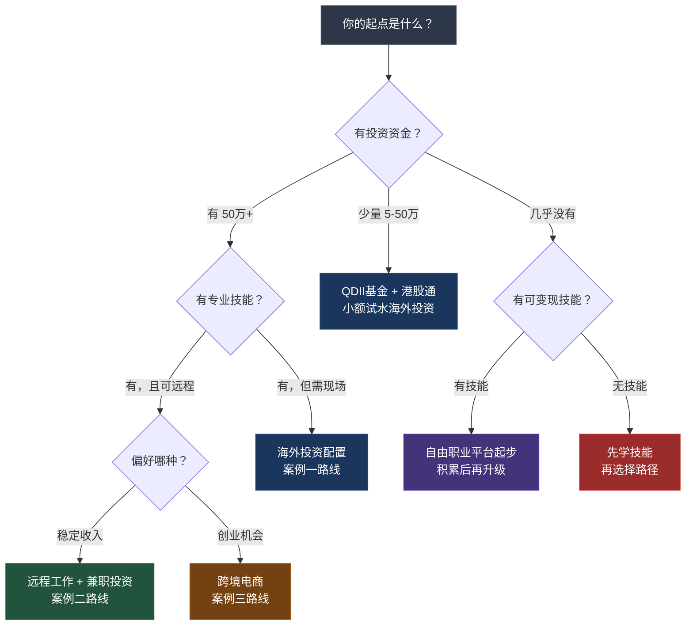
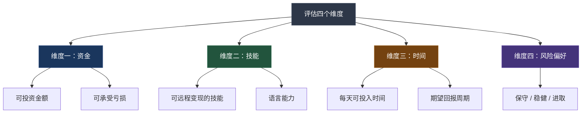

## 案例总结与启示

七个案例，七条路径，从A股投资者到跨境电商卖家，从程序员到退休人士，覆盖了全球化搞钱的全部主要路径。本节将这些案例中的共性规律提炼为可复用的框架，帮助你找到最适合自己的全球化搞钱路线。

***

### 一、案例全景对比

在深入分析之前，先用一张表把七个案例的核心数据拉齐对比，看清全局：

| 维度 | 案例一：全球配置者 | 案例二：程序员跨境 | 案例三：跨境电商 | 案例四：数字游民 | 案例五：长期配置 | 案例六：退休养老 | 案例七：内容创作者 |
|------|-------------------|-------------------|-----------------|-----------------|-----------------|-----------------|-------------------|
| **主角** | 小陈，32岁，产品经理 | 小林，28岁，全栈工程师 | 小王夫妇，30/28岁 | — | — | — | — |
| **起点资金** | 80万人民币 | 几乎为零 | 15万人民币 | — | — | — | — |
| **核心路径** | 海外投资配置 | 远程技术工作 | 亚马逊电商 | 税务身份优化 | 长期投资组合 | 全球养老规划 | 内容全球变现 |
| **时间跨度** | 2年 | 18个月 | 12个月 | — | — | — | — |
| **最终成果** | 年化12%，回撤从35%降至22% | 月入$8000-10000 | 月销$10万，月利润$2万 | — | — | — | — |
| **所需技能** | 投资分析、英语 | 编程、英语 | 选品、运营、供应链 | — | — | — | — |
| **风险等级** | 中 | 低 | 中高 | — | — | — | — |
| **入门门槛** | 中（需投资资金） | 低（只需技能） | 中（需启动资金） | — | — | — | — |

> 说明：案例四至案例七为规划中的内容，后续补充完善后将填入具体数据。

***

### 二、七大案例的核心教训提炼

#### 2.1 共性规律：成功者的五个共同特质

纵观所有案例的成功者，无论路径如何不同，他们都具备以下五个共同特质：

**特质一：先学习，再行动**

小陈花了整整一个月学习海外投资知识才开始开户；小林研究了Upwork平台规则和同类服务定价后才注册账号；小王夫妇用两个月做市场调研才确定选品。没有一个人是"先干了再说"。

这不是保守，而是风险管理的第一步。全球化搞钱涉及外汇管制、跨境税务、不同市场的交易规则等复杂问题，盲目行动的代价远高于花时间学习的成本。

**特质二：从小额试错开始**

小陈第一笔海外投资只有1万港币；小林第一个项目报价$200，远低于市场价；小王夫妇第一批产品只发了3个SKU。所有人都遵循了"小额验证→数据驱动→逐步放大"的节奏。

这个原则在跨境场景中尤其重要，因为你面对的是不熟悉的市场环境、法律框架和文化习惯，犯错的成本比国内更高。

**特质三：数据驱动决策**

小陈每季度检查资产配置比例，偏离超过5%就再平衡；小林根据客户反馈和平台数据调整定价策略；小王夫妇用Jungle Scout分析市场需求，用广告数据优化产品。没有人凭感觉做决定。

数据驱动不是说要成为数据分析师，而是养成"用数据验证假设"的习惯。当你不确定一个海外市场是否值得进入时，先去查数据——市场规模、竞争密度、增长率——而不是听别人说"可以做"就冲进去。

**特质四：合规是底线**

所有成功案例都强调了合规的重要性。小陈遵守外汇管理规定，5万美元额度用完后通过合规渠道继续配置；小林的美元收入依法申报；小王夫妇了解目标市场的产品标准和法规。

合规不是可选项。中国有外汇管制，有CRS信息交换，有个人所得税法对海外收入的规定。任何试图绕过监管的做法，短期可能得利，长期必然付出更大代价。

**特质五：长期视角**

小陈的年化收益从8%提升到12%，这是两年持续优化的结果；小林从$200的项目到$60时薪，花了18个月；小王夫妇从0到月销$10万，经历了12个月的持续投入。没有人是"一夜暴富"的。

全球化搞钱本质上是一种财富管理的思维方式，不是投机取巧的捷径。那些期望"开户就能赚钱"、"出海就能发财"的人，往往是最先亏损的一批。

#### 2.2 路径差异：不同起点选择不同路线

虽然有共性规律，但七个案例最大的启示是：**没有放之四海而皆准的最优路径，只有最适合你当前条件的路径。**

具体来说，不同条件的人应该有不同的起点策略：

| 你的条件 | 推荐起点 | 理由 | 参考案例 |
|---------|---------|------|---------|
| 有50万+投资资金，有稳定工作 | 港股/美股开户，配置全球ETF | 资金门槛够，风险可控，不影响主业 | 案例一、案例五 |
| 有编程/设计/写作等技能 | Upwork/Fiverr自由职业 | 零资金门槛，用时间换收入和经验 | 案例二、案例七 |
| 有供应链资源或外贸经验 | 亚马逊/独立站跨境电商 | 利用既有优势，启动速度快 | 案例三 |
| 有稳定被动收入或退休人士 | 全球养老规划+低风险配置 | 保值优先，追求稳定现金流 | 案例六 |
| 年轻、可自由安排时间 | 数字游民+税务身份优化 | 灵活性最高，可以低成本探索 | 案例四 |
| 资金少、技能少 | 先投资自己（学技能） | 没有可变现的能力，任何路径都走不通 | — |

***

### 三、全球化搞钱的路线图框架

从七个案例中抽象出一个通用的四阶段路线图，无论你选择哪条路径，都大致遵循这个节奏：

#### 3.1 阶段一：准备期（1-3个月）

这个阶段的核心任务是**学习和搭建基础设施**，不是赚钱。

**必做事项：**

1. **知识储备**：学习目标市场的基本规则。投资方向要看懂英文财报和研报；跨境电商要了解亚马逊的A9算法和FBA流程；自由职业要研究平台规则和提案写法
2. **工具准备**：开设必要的账户（券商账户、PayPal、Wise、海外银行账户等），准备必要的工具（VPN、翻译软件、项目管理工具）
3. **小额换汇**：利用每年5万美元的个人购汇额度，完成首次换汇，熟悉流程
4. **风险评估**：明确自己能承受的最大亏损金额，设定止损线

**常见错误：**

- ❌ 准备期太短，跳过学习直接行动——结果在不熟悉的市场里交"学费"
- ❌ 准备期太长，一直"准备"不敢开始——完美主义是行动的敌人
- ❌ 一次性投入大量资金——没有验证就重仓是赌博不是投资

#### 3.2 阶段二：试错期（3-6个月）

这个阶段的核心任务是**用最小成本验证商业模式**。

**关键原则：**

1. **控制单次试错成本**：投资方向先投1-5万；电商先上3个SKU；自由职业先接2-3个小项目
2. **快速获取反馈**：每个决策都要设定验证周期和判断标准。例如："如果3个月内这支ETF跑输基准10%以上，就换标的"
3. **记录一切**：建立交易日志、客户反馈表、广告数据表。这些数据是后续优化的基础
4. **不贪多**：同时跑太多路线会分散精力，建议在这个阶段只聚焦一条主路径

**小陈的试错期复盘：**

> "第一笔港股买了1000股腾讯，第一笔美股买了1股苹果，QDII投了1万。总共不到5万块，但我学到了港股的交易时间、美股的T+0规则、QDII的申购赎回流程。这些知识用5万块买，比用50万买便宜多了。"

#### 3.3 阶段三：增长期（6-18个月）

验证通过后，进入正式增长阶段。这个阶段的核心是**系统化放大**。

**投资方向的增长策略：**

| 操作 | 具体做法 | 频率 |
|------|---------|------|
| 扩大配置 | 将验证过的配置比例应用到更大资金池 | 按年度规划 |
| 再平衡 | 偏离目标比例超过5%时调整 | 每季度检查 |
| 增加品种 | 逐步加入新兴市场ETF、REITs、商品等 | 每半年评估 |
| 优化成本 | 对比不同券商的佣金，选择性价比最高的 | 每年审查 |

**跨境收入的增长策略：**

| 操作 | 具体做法 | 频率 |
|------|---------|------|
| 提升单价 | 积累评价后逐步提价，拒绝低价项目 | 每3个月评估 |
| 扩展客户 | 从平台获客扩展到口碑推荐、LinkedIn获客 | 持续进行 |
| 标准化流程 | 建立SOP，提升交付效率 | 当项目超过10个时 |
| 建立品牌 | 个人网站、社交媒体内容、行业分享 | 持续进行 |

**小林的增长期数据：**

| 时间节点 | 时薪 | 月收入 | 客户数 | 海外收入占比 |
|---------|------|--------|--------|------------|
| 第6个月 | $25 | ¥4万 | 5 | 37.5% |
| 第12个月 | $40 | ¥5.5万 | 3（长期） | 54.5% |
| 第18个月 | $60 | ¥7万 | 2（长期） | 85.7% |

注意小林的客户数在减少，但收入在增加。这说明他从"广撒网"转向了"深度服务少数优质客户"，这是跨境自由职业者的典型成长路径。

#### 3.4 阶段四：优化期（持续进行）

当收入和资产达到一定规模后，重点从"增长"转向"优化"和"保护"。

**优化方向：**

1. **税务优化**：了解中国与目标市场的税收协定，合法利用双边免税或抵免政策。例如中美之间有税收协定，避免双重征税
2. **汇率管理**：不要把所有海外收入换成人民币，保留一部分外币资产对冲汇率风险。小陈的美元资产占比35%，在人民币贬值周期中起到了保护作用
3. **风险分散升级**：从单一市场分散到多市场，从单一资产类别分散到多类别，从单一货币分散到多货币
4. **自动化和系统化**：投资方向设置自动再平衡；电商方向建立自动化的库存管理和广告投放系统；自由职业方向建立自动化的提案和交付流程

***

### 四、风险全景图：七个案例中的风险教训

全球化搞钱不是没有风险的。从七个案例中总结出六大类风险及其应对策略：

| 风险类型 | 具体表现 | 案例中的教训 | 应对策略 |
|---------|---------|-------------|---------|
| **汇率风险** | 人民币升值导致海外资产缩水 | 小陈的美元资产在人民币升值周期中曾出现账面亏损 | 多币种配置，不押注单一货币方向 |
| **政策风险** | 外汇管制收紧、税收政策变化 | CRS信息交换让隐匿海外资产变得不可能 | 合规第一，不走灰色地带 |
| **市场风险** | 海外市场大幅下跌 | 2022年全球股市普跌，分散配置降低了损失但不能消除损失 | 资产类别分散+地域分散+时间分散 |
| **运营风险** | 跨境电商的物流、退货、侵权问题 | 小王夫妇曾因产品质量问题收到大量差评 | 严格品控、购买产品责任保险、了解当地法规 |
| **信用风险** | 远程客户拖欠款项、平台封号 | 自由职业者常见问题，Upwork偶有争议冻结 | 使用平台担保交易、签订合同、分散客户来源 |
| **合规风险** | 未申报海外收入、违反外汇管理规定 | 这是最严重的风险，可能导致罚款甚至刑事责任 | 依法申报、保留完整记录、必要时咨询专业人士 |

**风险控制的黄金法则：**

1. **永远不要投入你亏不起的钱**。小陈的80万投资资金，他明确知道最坏情况可能亏30%（24万），这是他能承受的范围
2. **分散不是万能的，但不分散是万万不能的**。2022年全球股市普跌说明分散不能消除系统性风险，但不同市场的跌幅差异巨大，分散仍然有效
3. **合规成本远低于违规代价**。请税务师的费用可能几千块，但偷税漏税的罚款可能是几十万甚至更多

***

### 五、从案例中提炼的决策框架

面对"我应该走哪条路"这个问题，用以下决策矩阵来判断：

#### 5.1 四维评估模型

**评分方法：**

对每个维度打分（1-5分），然后对照下面的匹配表选择路径：

| 你的画像 | 资金 | 技能 | 时间 | 风险偏好 | 推荐路径 |
|---------|------|------|------|---------|---------|
| 有积蓄的上班族 | 4+ | 2 | 2 | 2-3 | 海外投资配置（案例一） |
| 技术型年轻人 | 1-2 | 4+ | 3+ | 3-4 | 跨境自由职业/远程工作（案例二） |
| 有供应链资源 | 3 | 3 | 4+ | 4 | 跨境电商（案例三） |
| 高净值人群 | 5 | 3 | 2 | 2 | 全球资产配置+税务规划（案例五、四） |
| 退休人士 | 3+ | 1 | 1 | 1-2 | 低风险全球配置+养老规划（案例六） |
| 内容创作者 | 1-2 | 4+（内容） | 3+ | 3 | 内容全球化变现（案例七） |

> 注：评分仅供参考框架，实际决策还需结合个人具体情况。很多人的最佳策略是"组合打法"——例如小林同时做远程工作（收入来源）和投资（资产增值），两条腿走路。

#### 5.2 组合策略：不是二选一，而是多条腿走路

七个案例最容易被忽视的启示是：**成功的全球化搞钱者往往不止一条路径。**

小陈不是只做投资——他的工作本身就在互联网公司，有接触海外市场的机会；小林不是只做远程工作——他同时也在学习投资，把美元收入的一部分配置到美股。

一个成熟的全球化搞钱组合可能长这样：

| 收入/资产层 | 具体形式 | 作用 |
|------------|---------|------|
| **核心收入层** | 主业工资或远程工作薪资 | 保障基本生活 |
| **副业收入层** | 自由职业、跨境电商、内容变现 | 增加收入来源，对冲失业风险 |
| **投资增值层** | 全球股票、债券、ETF配置 | 让存量资产产生被动收入 |
| **对冲保护层** | 黄金、不同货币资产、保险 | 极端情况下的安全垫 |

不需要一步到位。先从你最有条件的那一层开始，逐步扩展到其他层。

***

### 六、新手最容易犯的八个错误

从七个案例和大量读者反馈中，总结出全球化搞钱新手最容易犯的错误：

**错误一：开户就等于成功**

很多人花大量时间研究哪个券商佣金最低、哪个平台开户最方便，开完户就觉得自己"全球化"了。实际上，开户只是万里长征第一步，真正的挑战在于投资决策、客户获取或产品运营。

**错误二：忽视隐性成本**

海外投资的成本不只是佣金，还有汇率差价（换汇的买入卖出价差）、汇款手续费、平台管理费、税务申报费等。小陈第一年算下来，各种隐性成本吃掉了大约1.5%的收益。不算多，但如果你不知道，可能会对实际收益产生误判。

**错误三：用国内思维做海外市场**

中国市场的很多"常识"在海外不成立。例如：A股散户占比高，追涨杀跌明显；美股机构投资者占比高，更看重基本面。跨境电商也一样——国内电商靠低价和刷单的打法，在亚马逊上会导致封号。

**错误四：急于求成，跳过试错期**

小林第一个项目只赚了$200，小王夫妇第一个月亏损$500。如果他们因此放弃，就不会有后来的$8000/月和$10万/月销售额。试错期的亏损是学费，不是失败。

**错误五：不重视英语**

几乎所有案例都提到了英语的重要性。看英文财报、写英文提案、与海外客户视频会议、阅读亚马逊英文评论——英语能力直接影响你的信息获取效率和客户沟通质量。好消息是，你不需要英语专八水平，CET-4加上专业领域的词汇量就够了。

**错误六：把所有鸡蛋放在一个平台**

只在Upwork接单，只在亚马逊卖货，只用一个券商——如果这个平台出问题（封号、政策变化、倒闭），你的收入会瞬间归零。成功案例的共同做法是：以一个平台为主，逐步扩展到其他渠道。

**错误七：忽视税务合规**

中国的个人所得税法明确规定，全球收入都需要申报纳税。很多做跨境收入的人抱着"不会被查到"的侥幸心理不申报。随着CRS信息交换机制的完善，中国税务机关获取海外金融账户信息的能力越来越强。合规申报的短期成本远低于被查处的长期代价。

**错误八：孤军奋战，不加入社群**

全球化搞钱的路上，你遇到的大部分问题别人早就遇到过。加入相关的投资社群、跨境电商社群、远程工作社群，可以让你少走很多弯路。小陈在雪球上学到了很多港股投资的实战经验，小林在Upwork社区里学到了提案写作技巧。

***

### 七、案例启示的进阶思考

#### 7.1 全球化搞钱的本质是什么？

剥去所有具体技巧和工具，全球化搞钱的本质是**利用全球市场的不均衡性获取超额回报**。

这种不均衡性体现在三个层面：

1. **价格不均衡**：同样的产品在不同国家的价格差异巨大，跨境电商利用的就是这个差价
2. **劳动力价格不均衡**：同样的技能在不同市场的时薪差异巨大，小林的编程能力在美国市场值$60/小时，在国内市场可能只值¥150/小时
3. **资本回报率不均衡**：不同市场的风险收益特征不同，全球配置可以在同等风险下获得更高回报，或在同等回报下承担更低风险

理解这个本质，你就能举一反三——任何能够利用全球不均衡性的机会，都是全球化搞钱的潜在路径。

#### 7.2 AI时代的新变量

2024年以来，AI工具的爆发式发展正在改变全球化搞钱的格局：

**利好方面：**

- 语言障碍大幅降低：AI翻译工具让英语不好的人也能进行基本的跨境沟通
- 内容创作效率飞升：用AI辅助写英文营销文案、产品描述、提案，效率提升10倍
- 数据分析门槛降低：AI工具让普通人也能做市场分析、竞品分析、投资分析

**挑战方面：**

- 低端外包需求萎缩：简单的翻译、写作、数据录入等外包工作正在被AI取代
- 竞争加剧：AI降低了入门门槛，意味着更多人可以参与跨境竞争
- 内容同质化：用AI批量生成的营销内容容易同质化，反而降低了效果

**应对策略：**

在AI时代，全球化搞钱的竞争力从"能做"转向了"做得好"和"有独特价值"。AI能帮你写一封英文邮件，但不能帮你建立深度的客户关系；AI能帮你分析市场数据，但不能帮你做出创造性的商业判断。**培养AI无法替代的能力——深度思考、创意、人际信任——是AI时代全球化搞钱的长期策略。**

#### 7.3 从个体到生态

七个案例都是个人或夫妻的小规模实践，但如果你的全球化搞钱做得足够好，下一步是**从个人作战到构建小生态**：

1. **小陈的下一步**：不是继续自己研究个股，而是组建一个投资交流小组，共享研究信息，降低个人研究成本
2. **小林的下一步**：不是继续自己接项目，而是建立一个小型远程开发团队，承接更大规模的项目
3. **小王的下一步**：不是继续自己运营店铺，而是把验证过的选品和运营方法论输出给其他卖家，收取服务费或分成

从个体到生态，是全球化搞钱从"赚辛苦钱"到"赚系统钱"的关键跃迁。

***

### 八、你的行动清单

读完所有案例和分析之后，最忌讳的是"学了很多，什么都没做"。以下是按时间线拆解的行动清单：

**今天就能做的（30分钟以内）：**

- [ ] 评估自己的四维得分：资金、技能、时间、风险偏好
- [ ] 确定自己的全球化搞钱主路径（参考第五节的决策框架）
- [ ] 计算自己每月能拿出多少时间和资金用于全球化搞钱

**本周要做的（2-4小时）：**

- [ ] 针对选定的路径，列出需要搭建的基础设施清单（账户、工具、知识）
- [ ] 找到对应领域的社群或论坛，加入并潜水学习
- [ ] 阅读1-2篇目标领域的入门指南或教程

**本月要做的（每周投入3-5小时）：**

- [ ] 完成基础设施搭建（开户、注册平台、准备材料）
- [ ] 完成第一笔小额尝试（投资方向：1-5万；电商方向：1-3个SKU；自由职业：1个小项目）
- [ ] 建立自己的数据记录系统（交易日志、客户反馈表、广告数据表）

**本季度要做的：**

- [ ] 根据第一个月的数据反馈，调整策略
- [ ] 逐步增加投入，进入增长期
- [ ] 开始考虑第二条路径的布局（例如：投资+副业的组合）

**本年度要做的：**

- [ ] 建立稳定的全球化收入或资产配置体系
- [ ] 完成第一次税务申报（如果有海外收入）
- [ ] 制定下一年的全球化搞钱年度计划

***

### 最后的话

七个案例，七种人生，一个共同点：**他们都迈出了第一步。**

小陈没有等到"学完所有投资知识"才开户，小林没有等到"英语完美"才注册Upwork，小王夫妇没有等到"攒够100万"才开始做跨境电商。他们都带着不完美的准备，进入了不熟悉的领域，用小额试错积累了真实的经验。

全球化搞钱不需要你是一个完美的人，不需要你有很多钱，不需要你英语流利。它需要的是：**一个合理的起点策略，一个持续学习的习惯，一个数据驱动的思维方式，以及最重要的——现在就开始行动。**

七个案例中的主角，最年轻的小林28岁，最有积蓄的小陈50万年薪。但如果你只有22岁、月薪5000、英语四级刚过，你同样可以开始——只是起点不同，路径不同，但方向是一样的：**让你的财富和能力突破地理边界，在全球范围内寻找机会。**

下一节，我们将进入练习环节，帮助你把本章学到的知识转化为可执行的行动计划。

***
