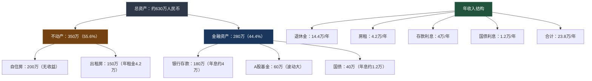
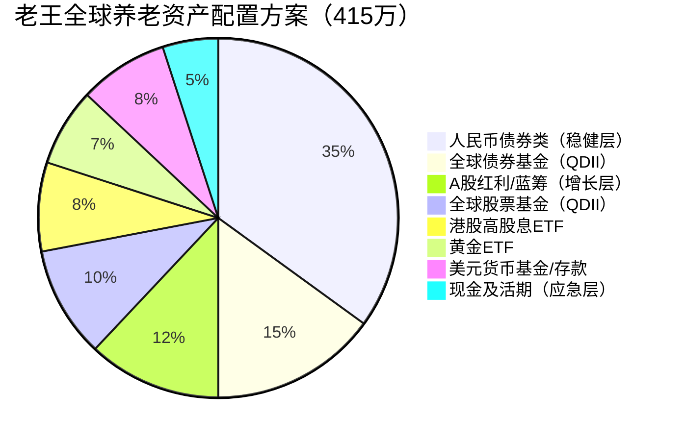

## 案例六：退休人士的全球养老规划

### 案例背景

**老王和妻子，58岁/55岁，二线城市国企退休职工，坐标成都**

老王是某国企中层管理人员，妻子是公立学校教师，两人在2023年先后退休。退休前，两人用大半辈子积累了一套自住房（市值约200万）、一套出租房（市值约150万，月租金3500元）、银行存款约180万、A股基金约60万、国债约40万。

退休后，两人面临一个现实问题：**每月退休金合计约1.2万元，扣除日常开销后所剩无几。而银行存款利率持续走低，3年期定存利率已从2019年的4%降到2023年的2.2%。** 180万存款每年利息收入从7.2万缩水到不到4万，实际购买力还在被通胀侵蚀。

更让老王焦虑的是几件事：

- **人民币汇率波动**：2022年人民币对美元贬值约10%，意味着他所有人民币资产的国际购买力同步缩水
- **单一货币风险**：他和妻子未来可能想去海外旅游、探望在澳洲留学的儿子，甚至考虑短期海外居住，但所有收入都是人民币
- **养老金替代率不足**：退休金仅为退休前收入的40-50%，如果发生重大疾病或意外，现有资产可能不够支撑20-30年的退休生活
- **资产集中度过高**：房产占总资产的60%以上，流动性差；如果房价下跌，资产大幅缩水

老王的目标很明确：**在保证安全性的前提下，让退休金和存量资产能够跑赢通胀，同时为可能的海外生活场景做好货币和资产准备。**

### 规划前的资产全景

先梳理老王家庭的完整财务画像：



**规划前存在的五大问题：**

| 问题 | 具体表现 | 风险等级 |
|------|---------|---------|
| 房产占比过高 | 55.6%在不动产，流动性差，变现周期长 | ⚠️ 高 |
| 存款利率持续下行 | 180万存款年利息从7.2万降至不到4万 | ⚠️ 高 |
| 零海外资产 | 100%人民币资产，汇率风险完全暴露 | ⚠️ 中高 |
| 投资品种单一 | A股基金集中在大盘蓝筹，缺乏全球分散 | ⚠️ 中 |
| 收入来源单一 | 退休金占年收入60%，无被动收入多元化 | ⚠️ 中 |

### 执行过程：五步全球养老规划

#### 第一步：明确养老需求和时间线（第1个月）

老王首先请了一位独立理财顾问（费用5000元/次），用一天时间做了完整的养老需求测算。核心计算如下：

**养老需求测算：**

| 项目 | 金额/年 | 说明 |
|------|--------|------|
| 日常生活开销 | 12万 | 两人每月1万，含衣食住行 |
| 医疗健康 | 3万 | 体检、慢性病药物、补充保险 |
| 旅游娱乐 | 4万 | 国内游2次+海外游1次 |
| 子女支持 | 2万 | 儿子在澳洲，偶尔资助 |
| 应急储备 | 2万 | 突发事件、人情往来 |
| 通胀缓冲 | 1.5万 | 按3%通胀率预留 |
| **合计** | **24.5万/年** | |

**退休金覆盖分析：**

```text
年支出：24.5万
年退休金：14.4万（覆盖58.8%）
缺口：10.1万/年
需要从投资收益中弥补

按25年退休生活计算（58岁→83岁）：
总缺口：10.1万 × 25年 = 252.5万
考虑3%通胀的精算缺口：约350万

现有可投资金融资产：280万
需要年化收益率：约4.5%（扣除通胀后的实际收益率约1.5%）
```

**关键结论：** 老王不需要追求高收益，只需要让280万金融资产实现4.5%的年化收益率（实际收益率1.5%+3%通胀），就能覆盖退休生活的缺口。这个收益率目标非常保守，完全可以实现——但前提是需要优化资产配置，而不是全部放在银行存款里。

#### 第二步：处理房产——释放流动性（第2-4个月）

老王做的第一个重大决策是卖掉出租房。理由如下：

**出租房的投资回报分析：**

| 指标 | 数值 | 说明 |
|------|------|------|
| 房产市值 | 150万 | 2023年评估价 |
| 年租金收入 | 4.2万 | 月租3500元 |
| 毛租金回报率 | 2.8% | 低于银行理财收益 |
| 扣除物业/维修后 | 2.2% | 净回报率更低 |
| 房价年涨幅预期 | 0-2% | 二线城市二手房市场趋于饱和 |
| 流动性 | 极差 | 挂牌3-6个月才能成交 |

**卖房决策的核心逻辑：**

- 150万房产每年净收益约3.3万，不如150万买国债（4.5万/年）
- 房产流动性极差，如果急需用钱（如重大疾病），无法快速变现
- 二线城市房价上涨空间有限，持有成本（物业费、维修、折旧）持续增加
- 卖房后释放的150万可以进行全球配置，分散风险

老王在第3个月以142万（低于评估价8万）成交，实际到手约135万（扣除中介费和税费）。虽然低于预期，但他接受了这个价格——**流动性是有价格的，急于变现时折价是正常现象。**

#### 第三步：构建全球养老资产配置方案（第5-8个月）

卖房后，老王的可投资金融资产变为：

```text
原有金融资产：280万
卖房所得：135万
合计可配置资金：415万
```

老王在理财顾问的帮助下，制定了以下全球养老资产配置方案：



**具体配置方案：**

| 资产类别 | 金额（万） | 占比 | 具体标的 | 预期年化 | 风险等级 |
|---------|-----------|------|---------|---------|---------|
| 人民币债券类 | 145 | 35% | 国债80万+政金债ETF 65万 | 2.5-3.0% | 低 |
| 全球债券基金 | 62 | 15% | 鹏华全球债券QDII 40万+南方亚洲美元债22万 | 3.0-4.5% | 中低 |
| A股红利蓝筹 | 50 | 12% | 沪深300ETF 30万+中证红利ETF 20万 | 5-8% | 中 |
| 全球股票基金 | 42 | 10% | 博时标普500ETF联接22万+华安纳斯达克100联接20万 | 6-10% | 中 |
| 港股高股息 | 33 | 8% | 华夏恒生高股息ETF 20万+个股（中移动H、工行H）13万 | 5-7% | 中 |
| 黄金 | 29 | 7% | 华安黄金ETF 20万+博时黄金ETF 9万 | 长期3-5% | 中低 |
| 美元资产 | 33 | 8% | 美元存款15万+美元货币基金18万 | 4.0-4.5% | 低 |
| 现金活期 | 21 | 5% | 银行活期+货币基金 | 1.5-2.0% | 极低 |

**方案设计的六大原则：**

1. **安全第一，收益为辅**：60%配置在低风险资产（债券+现金+美元存款），确保退休金安全
2. **全球分散，降低集中风险**：人民币资产占62%，海外资产占38%，不再是100%单一货币
3. **现金流优先**：高股息ETF和债券基金每季度/半年分红，形成被动现金流
4. **抗通胀配置**：黄金7%+全球股票10%，长期跑赢通胀
5. **流动性分层**：5%现金可随时动用，15%债券可在1周内变现，其余为中长期持有
6. **汇率对冲**：美元资产8%+全球股票基金（底层为外币资产）10%，部分对冲人民币贬值风险

#### 第四步：分批建仓与具体操作（第5-12个月）

老王没有一次性全部买入，而是采用分批建仓策略：

**建仓时间表：**

| 月份 | 操作 | 金额 | 说明 |
|------|------|------|------|
| 第5个月 | 买入国债+货币基金 | 100万 | 先把安全垫建好 |
| 第6个月 | 买入A股红利ETF+黄金ETF | 80万 | A股估值合理时建仓 |
| 第7个月 | 买入QDII债券基金 | 62万 | 分两次，每次31万 |
| 第8个月 | 买入QDII股票基金 | 42万 | 分三次，每次14万 |
| 第9个月 | 买入港股高股息ETF | 33万 | 分两次建仓 |
| 第10个月 | 换汇+美元存款 | 33万 | 利用5万美元额度，分3个月换汇 |
| 第11个月 | 补充调整 | 剩余 | 根据市场情况微调 |
| 第12个月 | 完成建仓 | — | 开始季度再平衡 |

**换汇操作细节：**

老王需要将约33万人民币换成美元。按照每人每年5万美元的购汇额度：

```text
老王额度：5万美元/年（约36万人民币）
妻子额度：5万美元/年（约36万人民币）
合计额度：10万美元/年（约72万人民币）
足够覆盖33万人民币的换汇需求

操作方式：
- 第1个月：老王换汇2万美元（约14.4万），存入美元定期
- 第2个月：妻子换汇1.5万美元（约10.8万），购买美元货币基金
- 第3个月：老王换汇1.2万美元（约8.6万），补充美元存款

注意事项：
- 如实填写购汇用途（"境外投资"或"个人旅游"）
- 不要拆分交易规避监管
- 保留购汇凭证以备税务核查
```

#### 第五步：建立持续现金流和再平衡机制（第12个月起）

**退休养老现金流设计：**

```text
每月现金流入：
├── 退休金：12,000元（稳定）
├── 国债利息：约6,000元/月（按年化3%计算）
├── QDII债券基金分红：约2,000元/月（半年分红，折月）
├── 港股高股息分红：约1,500元/月（按季度分红，折月）
├── 美元存款利息：约1,100元/月（按年化4%计算）
├── A股红利ETF分红：约800元/月（按年分红，折月）
└── 合计：约23,400元/月

每月现金流出：
├── 日常生活：10,000元
├── 医疗健康：2,500元
├── 旅游娱乐：3,300元
├── 子女支持：1,700元
├── 应急/人情：1,700元
└── 合计：约19,200元

月度盈余：约4,200元 → 自动再投资
```

**季度再平衡规则：**

| 检查项 | 触发条件 | 操作 |
|--------|---------|------|
| 单类资产偏离 | 偏离目标比例超过±3% | 卖出超配、买入低配 |
| 现金比例 | 低于3%或高于8% | 补充或释放现金 |
| 海外资产占比 | 低于30%或高于45% | 通过QDII或换汇调整 |
| 黄金占比 | 低于5%或高于10% | 小幅调整 |
| 全面再平衡 | 每年1月 | 重新评估所有资产比例 |

### 三年跟踪成果

老王从2023年底开始执行全球养老规划，到2026年初已运行两年多。以下是实际成果：

**收益对比：**

| 指标 | 规划前（纯人民币） | 规划后（全球配置） | 改善幅度 |
|------|-------------------|-------------------|---------|
| 年化收益率 | 2.8%（存款为主） | 5.6%（综合收益） | +100% |
| 年投资收益 | 约7.8万 | 约23.2万 | +197% |
| 最大单季亏损 | -8.2%（A股大跌时） | -3.5%（全球分散后） | 改善57% |
| 被动现金流/月 | 约0.8万 | 约1.1万 | +37.5% |
| 海外资产占比 | 0% | 36% | 从0到36% |
| 流动性（可快速变现） | 约30% | 约65% | +117% |

**关键成果：**

```text
规划前年收入：23.8万（退休金14.4万 + 房租4.2万 + 利息5.2万）
规划后年收入：27.6万（退休金14.4万 + 投资收益13.2万）
年收入增加：3.8万（+16%）

更重要的是：
- 不再持有流动性差的房产
- 36%资产为外币计价，对冲人民币贬值风险
- 分红收入稳定，不受单一市场波动影响
- 资产变现能力强，紧急情况下可快速套现
```

### 经验总结：退休人士全球养老的八条铁律

**铁律一：安全永远排在收益前面**

退休人士的投资本金是"最后一颗子弹"，没有时间等它涨回来。老王的配置中60%是低风险资产（债券+现金+美元存款），即使全球股市暴跌30%，他的整体资产损失不会超过12%。这个底线是不可动摇的。

**铁律二：现金流比总收益更重要**

退休人士没有工资收入，现金流就是生命线。老王的方案设计中，每年分红和利息收入约13万，加上退休金14.4万，合计27.6万/年，覆盖24.5万/年的生活支出后还有盈余。即使市场下跌，分红通常不会中断——高股息股票和债券基金的分红来自企业盈利和票息，不受短期股价波动影响。

**铁律三：全球分散不是为了赚更多，而是为了睡得着**

老王最初的目标不是跑赢大盘，而是"不把所有鸡蛋放在一个篮子里"。全球配置后，他最大的感受是心态的变化："以前A股大跌我就焦虑，现在美股涨了能对冲，黄金涨了也能对冲，整体波动小了很多。"

**铁律四：卖房不是亏损，是释放流动性**

老王以低于评估价8万的价格卖掉了出租房，妻子一开始很心疼。但两年后回头看，如果继续持有那套房，租金回报率2.2%，房价还跌了3%。而卖掉后释放的135万资金，两年累计收益约14万。"少卖8万，多赚14万"，这笔账怎么算都合算。

**铁律五：换汇额度是稀缺资源，要提前规划**

中国的5万美元/年购汇额度看似不多，但合理规划后完全够用。老王和妻子合计10万美元/年额度，两年下来已经积累约20万美元的海外资产。关键是**提前规划、分批操作、如实申报**，不要等到需要用钱时才临时换汇。

**铁律六：QDII基金是退休人士海外投资的最佳工具**

退休人士不适合直接开海外券商账户炒美股——操作复杂、时差颠倒、信息不对称。QDII基金通过国内基金公司投资海外市场，用人民币即可购买，基金经理负责选股和调仓。老王配置的博时标普500ETF联接和华安纳斯达克100联接，两年累计收益分别达到18%和25%，远超国内同类基金。

**铁律七：黄金是退休资产组合的"保险"**

在老王的配置中，黄金占比7%（29万）。2024年黄金价格上涨约15%，为他的组合贡献了约4.4万的浮盈。黄金的价值不在于高收益，而在于与其他资产的低相关性——当股票和债券同时下跌时，黄金通常会涨。对退休人士来说，黄金就是资产组合的"保险费"。

**铁律八：定期再平衡，但不要频繁操作**

老王每季度检查一次资产配置比例，只在偏离超过3%时才调整。两年内，他只做了4次再平衡操作，每次不超过1小时。退休人士最忌讳的是频繁交易——不仅增加成本，还容易被市场情绪左右。设定好规则，然后执行，中间不要多想。

### 退休人士全球养老的常见误区

**误区一："我年纪大了，不适合做海外投资"**

事实：年龄不是障碍，认知才是。QDII基金的操作和买国内基金完全一样，在支付宝或天天基金上就能完成。老王58岁开始做全球配置，60岁时已经建立了成熟的海外资产组合。如果你会用微信支付，你就能买QDII基金。

**误区二："换汇是违法的"**

事实：个人每年5万美元的便利化购汇额度是国家法律明确规定的合法权利。只要如实申报用途、不拆分交易、不用于禁止领域（如境外购房、证券投资类保险），就是完全合法的。老王两年换了约10万美元，每一笔都有银行记录，从未遇到任何问题。

**误区三："海外投资风险太大"**

事实：风险大小取决于配置比例，不取决于是否涉及海外。老王的海外资产占比36%，且大部分是债券基金和美元存款，风险等级为"中低"。如果他100%持有A股基金，风险反而更大——因为没有分散。

**误区四："退休了就该保守，全部存银行"**

事实：银行存款利率持续下行，2023年3年期定存2.2%，2025年已降至1.8%。扣除3%的通胀率，存款的实际收益率为-1.2%——你的钱在银行里每年贬值1.2%。180万存款放在银行不动，10年后实际购买力只剩约160万。"全部存银行"看似保守，实际上是一种"温水煮青蛙"式的财富缩水。

**误区五："房产是最安全的养老资产"**

事实：房产的安全性取决于流动性和租金回报率。老王的出租房租金回报率仅2.2%，低于银行理财；变现周期3-6个月，急用钱时可能被迫大幅折价。更重要的是，中国人口结构变化（老龄化+出生率下降）意味着二三线城市的房产长期面临需求萎缩的风险。房产可以是养老资产的一部分，但不应该是全部。

### 进阶策略：退休人士的全球养老升级方案

当基础方案运行稳定后（通常1-2年），可以考虑以下进阶策略：

#### 策略一：建立海外银行账户

如果计划未来在海外长期居住或频繁旅行，开设一个海外银行账户是有价值的。推荐的方案：

| 地区 | 推荐银行 | 开户门槛 | 适合场景 |
|------|---------|---------|---------|
| 香港 | 汇丰、中银香港 | 需亲临开户，存款1万港币 | 最方便，人民币/港币/美元自由转换 |
| 新加坡 | 星展银行（DBS） | 远程开户，存款1000新币 | 东南亚居住/旅行首选 |
| 澳洲 | 联邦银行（CBA） | 需澳洲地址 | 子女在澳洲，探亲长期居住 |

老王在儿子去澳洲留学时，通过汇丰银行开了一个香港账户，存入20万港币。这个账户的优势是可以同时持有港币、美元、人民币，方便未来跨境使用。

#### 策略二：考虑海外医疗保险

随着年龄增长，医疗支出是退休养老的最大不确定性。如果计划在海外长期居住，海外医疗保险是必需品：

- **短期旅行保险**：安联、美亚的境外旅行险，单次50-100元，覆盖意外和急性病
- **高端医疗险**：Bupa、Cigna的全球高端医疗险，年费2-5万人民币，覆盖全球就医
- **当地医保**：如果获得某国长期居留权，可申请当地公共医保

老王的做法是：每年去澳洲探亲时购买安联境外旅行险（约200元/次），同时在国内保留百万医疗险（年费约2000元）。这个组合足以覆盖绝大多数医疗场景。

#### 策略三：利用CRS和税务协定优化税务

退休人士的海外投资收益涉及税务问题。核心要点：

- **QDII基金的分红**：在国内缴纳20%个人所得税（由基金公司代扣代缴）
- **海外存款利息**：中国税务居民需申报全球收入，但实际操作中，小额海外利息（年收入低于12万）通常无需额外缴税
- **港股股息**：通过港股通持有，红利税为20%（内地代扣）；直接持有港股账户，红利税为10%（香港税务局征收）
- **中美税收协定**：美股分红的预扣税为10%（协定税率），而非默认的30%

老王的年度海外投资收益约13万，按照中国税法需要申报，但考虑到退休金免税、各项扣除后，实际需要缴纳的税款很少。他每年3月通过个税APP完成申报，操作简单。

### 附录：退休人士全球养老规划工具箱

**必备工具清单：**

| 工具 | 用途 | 获取方式 |
|------|------|---------|
| 支付宝/天天基金 | 购买QDII基金 | 手机APP |
| 同花顺/雪球 | 查看全球市场行情 | 手机APP |
| 中国银行/工商银行 | 换汇+外汇存款 | 手机银行APP |
| 个税APP | 申报海外收入 | 国家税务总局 |
| Excel/腾讯文档 | 资产配置跟踪表 | 免费 |

**推荐的QDII基金清单（退休人士适用）：**

| 基金名称 | 类型 | 风险等级 | 适合占比 | 特点 |
|---------|------|---------|---------|------|
| 博时标普500ETF联接 | 股票指数 | 中 | 5-15% | 跟踪美股大盘 |
| 华安纳斯达克100联接 | 股票指数 | 中高 | 3-10% | 科技成长风格 |
| 鹏华全球高收益债 | 债券 | 中低 | 10-20% | 全球债券分散 |
| 南方亚洲美元债 | 债券 | 中低 | 5-15% | 亚洲美元债 |
| 华安黄金ETF联接 | 商品 | 中低 | 5-10% | 抗通胀+避险 |

**年度检查清单：**

```text
□ 1月：全年再平衡，调整各资产类别比例
□ 3月：申报上年海外收入（个税APP）
□ 4月：检查QDII基金持仓，必要时更换
□ 7月：年中资产盘点，确认现金流覆盖支出
□ 10月：评估是否需要调整下年换汇计划
□ 12月：总结全年收益，制定下年配置目标
```

### 一句话总结

**退休人士的全球养老规划不是追求暴富，而是用系统性的资产配置对抗通胀、分散风险、保障现金流——让你的退休金不仅够花，还能活得从容。** 老王的案例证明，58岁开始全球配置一点都不晚，关键是迈出第一步：拿出100元，买一只QDII标普500指数基金。这就是你全球养老规划的起点。

***

> 📌 **本案例的核心启示：**
> 1. 退休不是投资的终点，而是资产配置优化的起点
> 2. 流动性比收益率更重要——能快速变现的资产才是养老的安全垫
> 3. 全球分散不是有钱人的专利，QDII基金100元就能开始
> 4. 现金流设计是退休规划的核心——让资产"发工资"
> 5. 安全第一，但"全部存银行"不是安全，是慢性缩水
