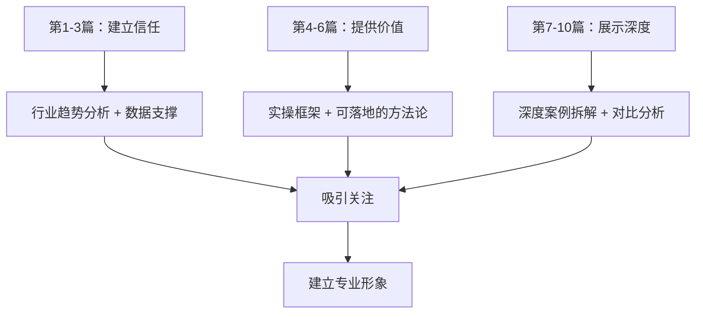
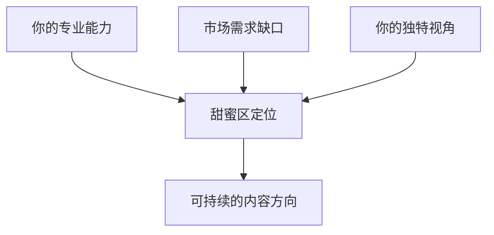
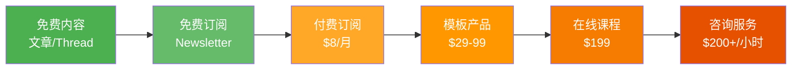
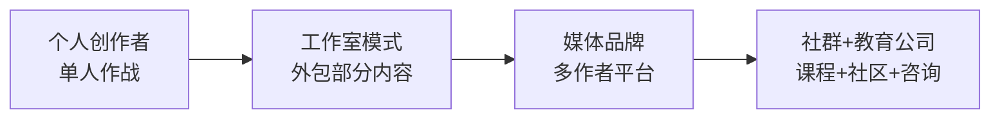

## 案例七：内容创作者的全球化变现

> 内容创作是门槛最低、天花板最高的全球化搞钱方式之一。你不需要几百万启动资金，不需要海外身份，甚至不需要精通英语——你需要的是**持续输出有价值内容的能力**和**将内容转化为收入的商业思维**。

### 案例背景

**小陈，30岁，互联网产品经理，坐标上海**

- 背景：某二线互联网公司产品经理，月薪1.8万人民币，工作5年积累了大量行业经验
- 英语水平：CET-6，日常读写尚可，口语薄弱
- 初始资源：零粉丝、零海外平台经验、零内容创业经历
- 目标：利用专业知识创建全球化内容业务，实现多元化收入
- 时间投入：工作日晚上1-2小时，周末4-5小时

**为什么选择内容创作这条路？**

小陈在选择全球化变现方向时，做了一个系统的对比分析：

| 变现方式 | 启动资金 | 技术门槛 | 天花板 | 被动收入潜力 | 全球化程度 |
|---------|---------|---------|--------|------------|-----------|
| 跨境电商 | 3-5万 | 中 | 高 | 低（需持续运营） | 高 |
| 自由职业 | 低 | 高（需专业技能） | 中 | 低（卖时间） | 高 |
| 海外投资 | 10万+ | 中 | 中 | 高 | 高 |
| 内容创作 | <5000元 | 低 | 极高 | 极高（内容可复利） | 高 |

内容创作的核心优势在于**复利效应**——一篇优质文章可以在发布后持续数年带来流量和收入，而不像自由职业那样"一小时换一小时"。

***

### 第一阶段：定位与冷启动（第1-3个月）

#### 1.1 找到自己的内容定位

小陈没有急于开始写文章，而是花了两周时间做市场调研和个人能力盘点。

**个人能力盘点清单：**

```markdown
我的核心技能：
1. 产品经理方法论（需求分析、用户研究、数据驱动）
2. B2B SaaS 行业知识（5年从业经验）
3. 数据分析能力（SQL、Python基础、BI工具）
4. 中文写作能力（大学时校报编辑）

海外市场需要但我有的：
1. 中国互联网行业的独特洞察（海外用户好奇但信息少）
2. 实操性的产品管理框架（不只是理论）
3. 对比中外互联网差异的视角
```

**竞品分析方法：**

小陈用以下方法调研了英文内容市场：

1. **Substack 搜索**：在 Substack 搜索 "product management" "SaaS" 等关键词，找到头部创作者，分析他们的内容策略、定价模式、更新频率
2. **YouTube 频道研究**：看海外产品经理类 YouTuber 的热门视频，分析标题套路和内容结构
3. **Reddit/Quora 扫描**：在 r/productmanagement、r/SaaS 等社区找高频问题，识别内容缺口
4. **Twitter/X 监测**：关注行业 KOL，了解什么话题容易引发讨论

**定位决策过程：**

经过调研，小陈确定了差异化定位：

```text
差异化定位 = 中国视角 × 产品管理实操 × 数据驱动

不是教"如何做产品经理"（已有大量内容）
而是教"中国互联网的方法论如何应用于全球化产品"
```

具体来说，他的内容定位围绕三个支柱：
- **支柱一**：中国互联网增长黑客方法论的全球化应用（如社交裂变、私域流量等概念在海外的落地）
- **支柱二**：B2B SaaS 产品从0到1的实操指南（基于真实项目经验）
- **支柱三**：数据驱动的产品决策框架（结合中国和海外案例对比）

#### 1.2 选择内容平台组合

小陈没有把所有鸡蛋放在一个篮子里，而是采用了**主平台+分发平台**的策略：

| 平台 | 角色 | 内容形式 | 更新频率 | 选择理由 |
|------|------|---------|---------|---------|
| Substack | 主平台（深度内容） | 长文Newsletter | 每周1篇 | 可直接收费，用户质量高 |
| Medium | 流量入口 | 文章同步发布 | 与Substack同步 | SEO好，自然流量大 |
| Twitter/X | 社交分发 | 短观点+Thread | 每天2-3条 | 建立个人品牌，引流 |
| LinkedIn | 专业分发 | 产品洞察文章 | 每周1篇 | B2B受众集中 |
| YouTube | 视频内容 | 屏幕录制教程 | 每两周1个 | 长尾流量，SEO强 |

**为什么选 Substack 而不是自建博客？**

- Substack 自带订阅功能和支付系统，省去了技术搭建
- 平台有推荐机制，优质内容可以获得更多曝光
- 付费订阅功能让变现路径最短
- 后期如果需要，可以导出邮件列表迁移

#### 1.3 创建第一批内容

小陈的前10篇文章遵循了一个明确的内容策略：



**第一批文章示例及数据表现：**

| 序号 | 标题 | 类型 | Medium阅读量 | Substack订阅增长 |
|------|------|------|------------|----------------|
| 1 | "What Western SaaS Can Learn from WeChat's Super App Strategy" | 趋势分析 | 2,300 | +85 |
| 2 | "A Product Manager's Guide to User Research in China (Lessons for Global Teams)" | 实操指南 | 1,800 | +60 |
| 3 | "Why Chinese Internet Companies Grow Faster: 5 Growth Hacks You Can Steal" | 框架方法 | 4,100 | +150 |
| 4 | "The Complete Framework for Data-Driven Product Decisions (With Real Examples)" | 深度框架 | 3,200 | +120 |

**冷启动的关键发现：**

- 带有"How"和"Why"的标题点击率高出平均40%
- 包含具体数据和框架的文章转发率是纯观点文章的3倍
- 中国视角的内容在海外有独特稀缺性，容易获得关注
- 第一个月只有200个订阅者，但坚持产出是关键

***

### 第二阶段：增长与初步变现（第4-8个月）

#### 2.1 构建增长引擎

经过三个月的稳定输出，小陈的订阅者增长到了约800人。他开始系统化地做增长：

**增长策略矩阵：**

| 策略 | 具体做法 | 效果 | 投入产出比 |
|------|---------|------|-----------|
| SEO优化 | 研究关键词，优化Medium文章标题和结构 | Medium月访问从500提升到3000 | ⭐⭐⭐⭐⭐ |
| 交叉推广 | 与同领域创作者互推，嘉宾写作 | 每次互推带来50-100新订阅 | ⭐⭐⭐⭐ |
| Twitter Thread | 将长文核心观点拆成Thread | 单条Thread最高获5万展示 | ⭐⭐⭐⭐ |
| 社区互动 | Reddit/Quora回答问题并附链接 | 稳定引流，每月约200订阅 | ⭐⭐⭐ |
| Podcast嘉宾 | 接受海外播客采访 | 单次带来100-300订阅 | ⭐⭐⭐⭐ |

**SEO实操细节：**

小陈在Medium上做SEO的核心方法：

1. **关键词研究**：用 Ahrefs 免费工具和 Google Keyword Planner 找搜索量适中（月搜1000-10000）、竞争度低的长尾关键词
2. **标题优化**：标题中必须包含核心关键词，同时保持吸引力
3. **结构化内容**：使用H2/H3标题、项目符号、表格，让搜索引擎更容易理解内容结构
4. **内部链接**：新文章中引用旧文章，建立内容网络
5. **长尾策略**：不追热门词，专攻垂直领域的长尾词

**效果最好的SEO文章案例：**

```text
标题：How to Conduct User Interviews for B2B SaaS Products
关键词：B2B SaaS user interviews（月搜索量2,400）
Medium月均阅读：1,200
Google搜索排名：第3位（6个月后稳定）
转化：每月带来约60个新Substack订阅
```

这篇文章在发布6个月后仍然每天带来稳定流量，体现了内容创作的**复利效应**。

#### 2.2 启动付费订阅

当免费订阅者达到1500人时，小陈推出了付费订阅计划：

**定价策略：**

| 层级 | 价格 | 内容 | 转化率 |
|------|------|------|--------|
| 免费层 | $0 | 每周1篇公开文章 + 基础框架 | - |
| 付费月度 | $8/月 | 深度分析 + 独家模板 + 社区访问 | - |
| 付费年度 | $72/年（$6/月） | 同上，打折激励年付 | - |
| 企业团队 | $30/月（5人） | 团队授权 + 定制内容请求 | - |

**付费内容的价值设计：**

小陈为付费订阅者提供的独有价值包括：

1. **深度行业报告**：每月1份，3000-5000字，附原始数据和分析框架
2. **可复用模板**：PRD模板、用户研究模板、数据分析Dashboard模板等
3. **案例库**：持续更新的中国互联网产品案例拆解
4. **社区Slack频道**：付费用户专属，每周答疑
5. **年度预测**：每年初发布"中国互联网趋势预测"，付费用户独享

**定价决策依据：**

小陈参考了Substack同类创作者的定价：
- 个人成长类：$5-10/月
- 商业分析类：$8-15/月
- 专业垂直类：$10-20/月

考虑到自己的受众主要是海外中小企业的产品经理和创业者，定价$8/月是合理的——既不会吓跑个人用户，又能体现专业价值。

#### 2.3 第一个月的付费数据

```text
付费订阅推出首月数据：
- 免费订阅者：1,520人
- 转化为付费：76人（转化率5%）
- 月收入：76 × $8 = $608（约4,300人民币）
- 年付选择率：40%（锁定长期收入）
- 退款率：2%（1人退款，原因是不需要）
```

**关键发现：** 5%的转化率在Substack生态中属于中上水平（通常在2%-8%之间）。提升转化率的核心在于持续提供**只有付费才能获得的独有价值**，而不是简单地把免费内容锁起来。

***

### 第三阶段：多元化变现与规模化（第9-18个月）

#### 3.1 构建多元收入来源

随着订阅者增长到5000+（免费）和400+（付费），小陈开始拓展变现渠道：

**收入来源矩阵：**

| 收入来源 | 月均收入（美元） | 占比 | 启动时间 | 核心驱动力 |
|---------|----------------|------|---------|-----------|
| Substack付费订阅 | $2,800 | 35% | 第8个月 | 持续高质量内容 |
| 咨询/顾问服务 | $2,000 | 25% | 第10个月 | 个人品牌背书 |
| 在线课程 | $1,500 | 19% | 第12个月 | 系统化知识产品 |
| 赞助/广告 | $800 | 10% | 第14个月 | 流量变现 |
| 模板/工具销售 | $600 | 7% | 第11个月 | 数字产品 |
| 演讲/Workshop | $300 | 4% | 第15个月 | 行业影响力 |
| **合计** | **$8,000** | **100%** | - | - |

$8,000/月 ≈ 56,000人民币/月，远超当初1.8万的工资。

#### 3.2 详解各变现渠道的实操

**（1）付费订阅——基本盘**

付费订阅是收入的基石，需要持续投入：

```text
内容生产节奏：
- 周一：发布免费Newsletter（1500-2500字）
- 周三：发布付费深度分析（3000-5000字）
- 周五：Twitter Thread（从本周内容提炼核心观点）
- 每月第一个周一：发布月度行业报告（付费独享）
- 每季度：更新付费模板库
```

提升订阅转化率的实操技巧：

- **试读策略**：付费文章的前30%对免费用户可见，关键洞察放在付费区
- **限时优惠**：每季度推出一次"年付6折"活动，集中转化犹豫用户
- **推荐激励**：老用户推荐3个新付费用户，免费延长1个月订阅
- **内容预告**：提前透露下期付费内容的亮点，制造期待感

**（2）咨询/顾问服务——高客单价**

当个人品牌建立后，开始有海外客户主动找上门寻求顾问服务：

```text
服务定价：
- 1小时视频咨询：$200/小时
- 产品评审（含报告）：$500/次
- 月度顾问（4次通话+异步支持）：$1,500/月
- 项目顾问（按项目）：$3,000-8,000/项目

客户来源：
- Substack付费订阅者转化（30%）
- LinkedIn主动联系（25%）
- 推荐介绍（25%）
- 其他渠道（20%）
```

**咨询业务的运作要点：**

1. 不要接太多咨询项目，每周不超过3个咨询预约，否则会影响内容生产
2. 每次咨询后整理成案例模板（脱敏），变成新的内容素材
3. 咨询过程中发现的共性问题，转化为付费课程或模板产品
4. 用Calendly做预约管理，Stripe做支付，Zoom做会议

**（3）在线课程——被动收入**

小陈在第12个月推出了第一门在线课程：

```text
课程信息：
- 名称："B2B SaaS Product Management: From 0 to Product-Market Fit"
- 平台：Teachable（抽成5%+支付处理费）
- 定价：$199（早鸟价$149）
- 内容：8个模块，24节课，总时长约6小时
- 配套：模板包、社区访问、季度更新
```

**课程内容结构：**

| 模块 | 主题 | 课时 | 核心价值 |
|------|------|------|---------|
| 1 | B2B SaaS市场分析方法 | 3节 | 系统化的市场评估框架 |
| 2 | 用户研究与需求挖掘 | 4节 | 实操访谈模板和分析方法 |
| 3 | 产品定义与PRD撰写 | 3节 | 中外对比的最佳实践 |
| 4 | MVP构建与验证 | 3节 | 最小成本验证产品假设 |
| 5 | 增长策略与获客 | 4节 | 中国增长黑客方法论的全球化应用 |
| 6 | 数据驱动迭代 | 3节 | 建立数据指标体系和分析流程 |
| 7 | 定价与商业模式 | 2节 | SaaS定价策略和案例分析 |
| 8 | 团队管理与协作 | 2节 | 远程产品团队的管理经验 |

**课程推广策略：**

- 在Substack Newsletter中做3次预告，每次展示课程的一个亮点
- 提供免费的"迷你课程"作为引流产品（3节课的精华摘要）
- 与5个同领域创作者做联盟推广（Affiliate，佣金30%）
- 首月推出限时优惠，制造紧迫感

**课程销售数据：**

```text
上线首月：
- 销量：42份
- 收入：$7,254（含早鸟折扣）
- 退款率：4%（低于行业平均8%）

稳定期（月均）：
- 销量：8-12份
- 收入：$1,500-2,000
- 90%的收入来自"自动销售"，无需额外推广
```

**（4）模板/工具销售——边际成本为零**

基于日常工作积累，小陈创建了一系列可复用的产品管理模板：

```text
模板产品线：
- B2B PRD模板（Notion）：$29
- 用户研究访谈指南+模板包：$39
- 产品数据分析Dashboard模板（Google Sheets）：$49
- 全套产品管理模板包：$99（打包优惠）

销售渠道：Gumroad（抽成10%）
月均销量：15-25份
```

**（5）赞助与广告**

当Newsletter免费订阅者超过5000人后，开始有品牌主动联系赞助：

```text
赞助定价：
- Newsletter插播广告（段落间嵌入）：$300/期
- 专属推荐邮件：$500/期
- Twitter/LinkedIn推广帖子：$200/条

选择赞助商的原则：
1. 只接与受众相关的B2B SaaS工具类广告
2. 每月最多2期含赞助内容
3. 赞助内容必须标注"Sponsored"
4. 自己先试用产品，确认质量后才接
```

#### 3.3 收入增长曲线

```text
内容创作者全球化变现收入增长曲线

月收入(美元)
$8,000 ┤                                              ●
$7,000 ┤                                         ●
$6,000 ┤                                    ●
$5,000 ┤                              ●
$4,000 ┤                         ●
$3,000 ┤                    ●
$2,000 ┤              ●
$1,000 ┤         ●
$500   ┤    ●
$0     ┼───┬───┬───┬───┬───┬───┬───┬───┬───┬───
       M1  M3  M5  M7  M9  M11 M13 M15 M17 M18

关键节点：
M3：Substack上线，免费订阅突破800
M7：付费订阅上线，首月$608
M10：咨询业务启动，月入突破$3,000
M12：课程上线，单月峰值$7,254
M15：多元收入体系稳定，月均$6,000+
M18：订阅者破万，月均稳定$8,000
```

***

### 成果数据

| 指标 | 起步时（M1） | 6个月后（M6） | 12个月后（M12） | 18个月后（M18） |
|------|------------|-------------|---------------|---------------|
| 免费订阅者 | 0 | 1,200 | 5,000 | 10,500 |
| 付费订阅者 | 0 | 0（未推出） | 380 | 620 |
| 月收入 | $0 | $50（零星赞助） | $5,500 | $8,000 |
| 收入来源数 | 0 | 1 | 4 | 6 |
| 内容总量 | 0 | 25篇文章 | 65篇文章+1门课 | 100+文章+1课程+6模板 |
| Twitter关注 | 0 | 800 | 4,200 | 8,500 |
| 咨询客户数 | 0 | 0 | 8 | 15（累计） |

**收入结构对比：**

| 收入来源 | M12月收入 | 占比 | M18月收入 | 占比 | 趋势 |
|---------|----------|------|----------|------|------|
| 付费订阅 | $2,400 | 44% | $2,800 | 35% | 稳步增长，占比下降 |
| 咨询服务 | $1,500 | 27% | $2,000 | 25% | 稳定增长 |
| 在线课程 | $800 | 15% | $1,500 | 19% | 被动收入，持续增长 |
| 赞助广告 | $500 | 9% | $800 | 10% | 随流量增长 |
| 模板销售 | $300 | 5% | $600 | 7% | 被动收入，稳定 |
| 演讲Workshop | $0 | 0% | $300 | 4% | 新增渠道 |

***

### 核心经验与方法论

#### 经验一：内容定位的"三角验证法"

在确定内容定位时，不要拍脑袋决定，用"三角验证法"确保方向正确：



- **你的专业能力**：你在什么领域有真实经验和深度理解？
- **市场需求缺口**：现有内容中，有哪些问题没有被充分解答？
- **你的独特视角**：你和其他创作者的差异在哪里？

小陈的甜蜜区 = 产品管理经验 × 中国互联网视角 × 数据驱动方法论。如果三个条件只满足两个，内容要么缺乏深度，要么缺乏差异化，要么缺乏市场。

#### 经验二：内容创作的"1-3-10法则"

小陈总结了一套内容生产效率框架：

```text
1-3-10法则：
每1篇深度付费文章，衍生出：
├── 3篇免费内容（观点拆解、简化版、案例聚焦）
└── 10条社交媒体内容（数据图表、金句、Thread、Poll等）
```

这个法则让每一份深度研究都被最大化利用，避免"写完就扔"的浪费。例如，一篇5000字的深度分析可以拆解为：
- 1篇完整的付费Newsletter
- 3篇聚焦不同角度的免费文章
- 5条Twitter Thread
- 3条LinkedIn观点帖
- 2个YouTube短视频脚本

#### 经验三：冷启动期的"100天法则"

内容创作最大的敌人是过早放弃。小陈给自己设定了"100天法则"：

```text
100天法则：
- 前100天，不看数据，不纠结表现
- 每天至少产出1条内容（文章、Thread、或视频）
- 100天后做一次全面复盘
- 如果方向正确但数据差，调整策略但不换方向
```

**实际数据验证：**

| 阶段 | 累计内容量 | 免费订阅者 | 关键突破 |
|------|----------|----------|---------|
| 第30天 | 12篇 | 120 | 几乎没有自然增长 |
| 第60天 | 25篇 | 350 | 一篇文章被知名Newsletter转发 |
| 第90天 | 40篇 | 800 | Twitter Thread破万次展示 |
| 第100天 | 45篇 | 1,000 | 跨过心理里程碑 |

前100天的坚持是整个事业的地基。如果在第30天因为"只有120个订阅者"而放弃，后面的一切都不会发生。

#### 经验四：全球化内容的本地化策略

小陈发现，"全球化"不是把中文内容翻译成英文，而是要**用海外读者能理解的框架来表达中国经验**：

**本地化策略对照：**

| 维度 | 错误做法 | 正确做法 |
|------|---------|---------|
| 案例 | 直接用中国App举例，不解释背景 | 先用海外读者熟悉的案例引入，再做中国对比 |
| 术语 | 直接音译中国互联网术语 | 用海外对应概念解释，附加中国术语原文 |
| 数据 | 只有中国数据 | 提供中外对比数据，让读者有参照系 |
| 文化 | 假设读者了解中国 | 考虑读者可能完全不了解中国互联网 |
| 视角 | "中国的做法更好" | "中国的做法有X优势，Y局限，可借鉴Z" |

**示例对比：**

```text
❌ 差的写法：
"私域流量是中国互联网的核心增长策略，通过微信群和企业微信实现。"

✅ 好的写法：
"While Western companies rely on paid ads and email lists,
Chinese companies have pioneered a concept called 'Private Traffic'
(私域流量) — building owned communities on WeChat where you
can reach users for free, anytime. Think of it as combining
your email list, Slack community, and loyalty program into one
super-app. Here's how it works and what you can learn from it..."
```

#### 经验五：从内容到产品的"价值阶梯"

小陈设计了一个清晰的**价值阶梯**，让用户从免费到付费自然过渡：



每一层级都为用户提供递增的价值，同时自然引导到下一个层级。关键是**不要跳级**——一个还没订阅你免费Newsletter的人，不太可能直接买你的$199课程。

#### 经验六：全球化收款与税务处理

**收款基础设施搭建：**

| 服务 | 用途 | 费用 | 备注 |
|------|------|------|------|
| Stripe | Substack/Teachable收款 | 2.9%+$0.30/笔 | 最通用的支付网关 |
| PayPal | 咨询服务收款 | 3.49%+固定费 | 部分客户偏好 |
| Wise | 资金汇入国内 | 0.4%-0.6% | 汇率好，手续费低 |
| Payoneer | 备选收款方案 | 最高2% | 部分平台强制使用 |

**资金回流路径：**

```text
海外收入流向：
Substack/Teachable/Gumroad
    ↓（Stripe/PayPal收款）
Wise/Payoneer 多币种账户
    ↓（合规汇款）
国内银行账户（每人每年5万美元额度内）
```

**税务处理要点：**

1. 海外收入需在中国申报个人所得税
2. 中国与美国有税收协定，已在美国缴纳的税款可以抵扣
3. 建议使用Wise的"工资接收"功能，银行入账时标注为"工资"更顺利
4. 年收入超过一定金额建议咨询专业税务师
5. 保留所有收入凭证和平台账单，以备税务核查

#### 经验七：常见误区与应对

| 误区 | 后果 | 正确做法 |
|------|------|---------|
| 一上来就追求变现 | 内容质量下降，读者流失 | 先免费输出3-6个月建立信任 |
| 同时做太多平台 | 精力分散，每个平台都做不好 | 先做好1个主平台，再逐步扩展 |
| 只写不推广 | 优质内容无人看到 | 花30%时间创作，30%推广，40%互动 |
| 模仿头部创作者 | 失去差异化，没有记忆点 | 学习方法论但保持自己的风格 |
| 忽视邮件列表 | 过度依赖平台算法 | 邮件列表是你唯一完全掌控的渠道 |
| 只做中文内容 | 无法触达全球受众 | 英文是全球化内容的基础语言 |
| 急于推出课程 | 课程质量差，口碑崩塌 | 先验证需求，再投入制作 |

***

### 进阶策略：从创作者到媒体品牌

当个人内容业务达到$5,000+/月后，可以考虑向**媒体品牌**方向进化：

**进化路径：**



**工作室模式的具体操作：**

1. **外包编辑和排版**：在Fiverr上找英文编辑，$20-50/篇，确保语法和表达地道
2. **助理研究员**：找兼职助理做数据收集和竞品分析，$10-15/小时
3. **视频剪辑外包**：YouTube视频的剪辑、字幕、封面，$30-80/个
4. **社交媒体管理**：外包日常发帖和互动，$500-1,000/月

**从个人到品牌的标志：**

- 当你的受众记住的是"你的品牌名"而不只是"你的名字"
- 当其他创作者主动请求在你的平台发表文章
- 当品牌商主动找你谈年度合作而不是单次赞助
- 当你可以连续2周不产出内容，订阅数仍在增长

***

### 本案例的核心启示

1. **内容创作是全球化搞钱的"慢变量"**：前期增长慢，但复利效应惊人。一旦内容资产积累到一定量级，被动收入会超过主动收入
2. **英语不是障碍，是工具**：不需要雅思8分，能清晰表达专业观点即可。很多技术写作用词量远小于日常口语
3. **中国视角是独特优势**：海外受众对中国的互联网创新、商业模式、增长方法论有强烈的好奇心和信息缺口
4. **多元化收入是关键**：不要只依赖单一变现渠道，订阅+课程+咨询+模板的组合才能抵御单一渠道的波动
5. **坚持是最稀缺的能力**：内容创作领域，80%的人在前3个月放弃，15%在前12个月放弃，只有5%能坚持18个月以上
6. **全球化变现的起点是"有价值的内容"**：流量、粉丝、收入都是结果，核心驱动力是持续输出对目标受众有实际帮助的内容

> 💡 **给行动者的建议**：如果你有某个领域的专业知识，今天就开始写第一篇英文文章。不需要完美，不需要等"准备好了"——完成永远比完美重要。选择一个平台（推荐Substack或Medium），写下你对所在行业的第一个独特洞察，然后坚持100天。

***
