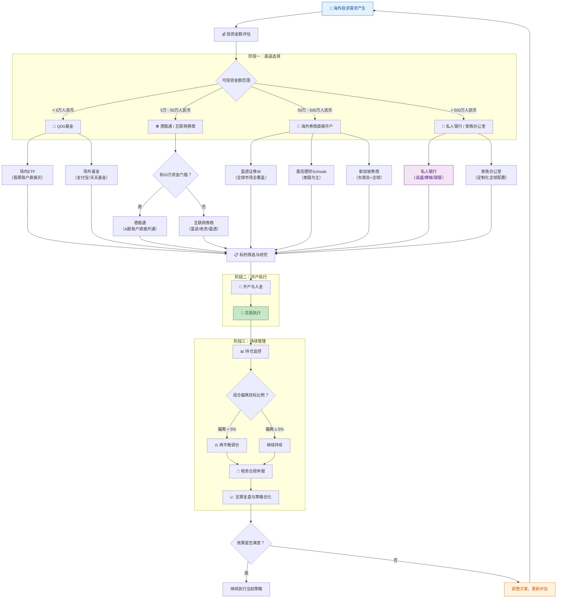
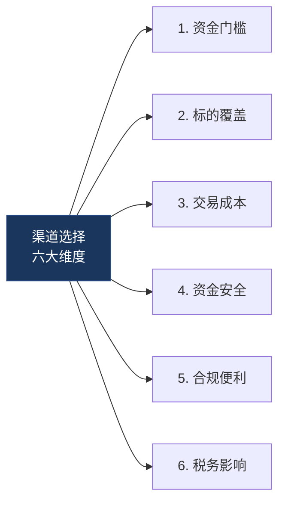
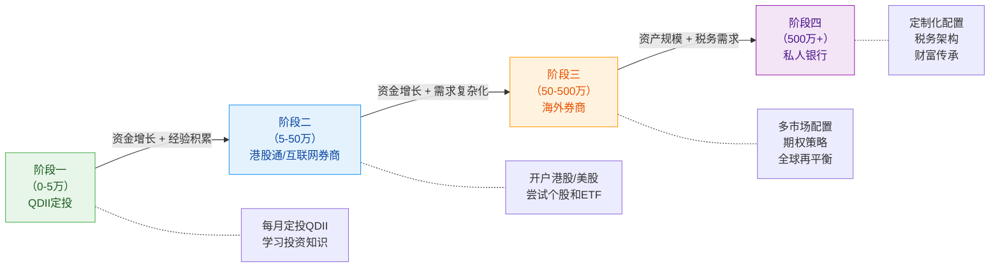

## 零、海外投资渠道选择决策图

在真正动手开户、入金、买标的之前，最重要的一件事不是研究哪只股票好，而是**选对渠道**。渠道选错了，轻则多交手续费、多走弯路，重则资金安全出问题、合规踩红线。

本节提供一套系统化的决策框架，帮你根据自身条件（资金规模、投资经验、风险偏好、税务身份）快速定位最适合你的海外投资路径。读完本节后，你应该能回答三个核心问题：

1. **我该走哪条路？** —— QDII、港股通、互联网券商、还是专业机构？
2. **这条路的门槛和成本是多少？** —— 资金门槛、开户流程、交易费率、汇兑成本
3. **这条路的风险和限制是什么？** —— 标的范围、资金安全、合规要求、退出难度

***

### 一、总览决策流程图

以下决策图覆盖了从"产生海外投资需求"到"完成第一笔交易"再到"持续管理"的完整链路。建议先通览全图，再根据后文展开的细节逐一理解每个决策节点。



***

### 二、决策树详解：四条路径的完整对比

#### 2.1 路径一：QDII基金（适合入门投资者）

**什么是QDII？**

QDII（Qualified Domestic Institutional Investor，合格境内机构投资者）是中国证监会批准的、允许国内基金公司募集资金投资海外市场的机制。简单说，你买QDII基金，基金经理帮你把人民币换成外币去投资海外市场，你不需要自己换汇、不需要开海外账户。

**为什么推荐新手从QDII开始？**

- **门槛极低**：支付宝10元起投，天天基金100元起投
- **操作简单**：和买普通基金一模一样，不需要任何海外账户
- **合规安全**：国内持牌基金公司发行，受证监会监管
- **种类丰富**：覆盖美股、港股、欧洲、日本、黄金、石油等主要市场和资产类别

**QDII基金的主要类型：**

| 类型 | 代表产品 | 跟踪标的 | 管理费率 | 适合场景 |
|------|---------|---------|---------|---------|
| 美股宽基指数 | 博时标普500ETF联接（050025） | 标普500指数 | 0.60%/年 | 长期定投美股大盘 |
| 美股科技 | 国泰纳斯达克100（160213） | 纳斯达克100 | 0.80%/年 | 看好科技赛道 |
| 港股宽基 | 华夏恒生ETF联接（000071） | 恒生指数 | 0.60%/年 | 配置港股蓝筹 |
| 全球债券 | 鹏华全球高收益债（000290） | 全球高收益债 | 0.85%/年 | 降低组合波动 |
| 黄金 | 华安黄金ETF（518880） | 黄金现货 | 0.50%/年 | 避险/抗通胀 |
| 全球REITs | 广发美国房地产（000179） | 美国REITs | 0.80%/年 | 全球房产配置 |

**QDII的局限性：**

- **额度限制**：基金公司有外汇额度上限，热门基金经常暂停申购（如标普500指数基金在2024年多次暂停大额申购）
- **费率偏高**：管理费+托管费通常在0.6%-1.2%，高于直接买ETF
- **时差问题**：美股QDII基金的净值更新有1天延迟，赎回到账通常需要T+7到T+10个工作日
- **标的有限**：只能买到基金公司发行的产品，无法投资个股

**实操建议：**

1. 在支付宝搜索"QDII"或"标普500"，选择规模大于5亿元、费率低于0.8%的基金
2. 设置每周或每月定投，避免择时焦虑
3. 同时配置美股QDII和港股QDII，实现初步的地域分散
4. 关注基金公司的QDII额度公告，额度紧张时及时买入

***

#### 2.2 路径二：港股通（适合有一定资金基础的投资者）

**什么是港股通？**

港股通是沪港通/深港通机制的一部分，允许内地投资者通过A股证券账户直接买卖在香港联交所上市的指定股票。你不需要开香港账户，不需要自己换汇，券商帮你处理跨境结算。

**港股通的准入条件：**

- **资金门槛**：申请开通前20个交易日，证券账户和资金账户内的资产日均不低于50万元人民币
- **账户要求**：已开通A股证券账户
- **知识测试**：通过券商的港股通知识测评（通常是几道选择题，不难）

**港股通的优势：**

- **合规便捷**：用现有A股账户直接交易，无需额外开户
- **资金不出境**：资金在境内券商体系内流转，安全有保障
- **标的精选**：港股通标的经过筛选，通常是市值较大、流动性较好的股票
- **交易时间同步**：港股交易时间为上午9:30-12:00、下午13:00-16:00，与A股高度重叠

**港股通的劣势：**

- **50万门槛**：将大量中小投资者挡在门外
- **标的有限**：只能买港股通名单内的股票（约500只），无法买小盘股和部分新股
- **红利税较高**：通过港股通买港股，红利税为20%（而直接开港股账户为10%）
- **不能申购新股**：港股通不支持打新

**港股通 vs 互联网券商对比：**

| 维度 | 港股通 | 互联网券商（富途/老虎/盈透） |
|------|--------|--------------------------|
| 资金门槛 | 50万人民币 | 无门槛（部分需入金激活） |
| 开户流程 | A股账户直接开通 | 线上提交护照/身份证，1-3天审核 |
| 标的范围 | 约500只港股通标的 | 全部港股 + 美股 + 新加坡等市场 |
| 资金安全 | 境内券商体系，受证监会监管 | 资金需汇出境外，需确认券商牌照 |
| 交易费率 | 佣金万3-万5 + 港股通组合费 | 佣金通常更低，部分平台有免佣活动 |
| 红利税 | 20% | 10%（直接持港股） |
| 打新支持 | 不支持 | 支持港股打新 |
| 换汇方式 | 自动结算，不占用个人换汇额度 | 需自行换汇并汇出（占用5万额度） |

**决策建议：**

- 如果你已有50万资金且不想资金出境 → **港股通**
- 如果你资金不足50万、或想买更多标的/打新 → **互联网券商**
- 如果你两种都满足 → **互联网券商**（费率更低、标的更全、红利税更低）

***

#### 2.3 路径三：海外券商直接开户（适合中高净值投资者）

**为什么选择海外券商？**

当你的投资金额超过50万人民币、且需要投资多个市场的标的时，互联网券商可能在产品丰富度、融资融券、期权交易等方面不够用。这时，直接在海外大型券商开户是更好的选择。

**主流海外券商对比：**

| 券商 | 总部 | 最低入金 | 支持市场 | 交易费率 | 特色 | 适合人群 |
|------|------|---------|---------|---------|------|---------|
| 盈透证券（IBKR） | 美国 | 0美元（但建议2000美元以上） | 全球150+市场 | 美股$0.005/股（最低$1） | 全球市场最全、专业工具强 | 多市场投资者、专业交易者 |
| 嘉信理财（Schwab） | 美国 | 0美元 | 美股为主 | 美股$0佣金 | 研究资源丰富、中文客服 | 纯美股投资者 |
| 新加坡盈立证券 | 新加坡 | 0美元 | 港美股+东南亚 | 佣金较低 | 东南亚市场覆盖好 | 东南亚投资需求 |
| 微牛证券 | 新加坡 | 0美元 | 港美股 | 美股$0佣金 | 界面简洁、碎股交易 | 新手+碎片化投资 |

**盈透证券（IBKR）开户实操流程：**

1. 访问盈透官网（interactivebrokers.com），选择"开立个人账户"
2. 准备材料：护照（必须）、身份证、地址证明（水电账单或银行对账单）
3. 填写个人信息：姓名、地址、职业、收入、投资经验
4. 选择账户类型：现金账户（Cash）或保证金账户（Margin），新手建议选现金账户
5. 提交审核，通常1-3个工作日通过
6. 入金：通过银行电汇至盈透指定的银行账户（支持港币、美元等多币种）
7. 入金到账后即可开始交易

**入金方式与成本：**

| 入金方式 | 到账时间 | 手续费 | 适合场景 |
|---------|---------|--------|---------|
| 银行电汇（SWIFT） | 1-3个工作日 | 国内银行收取80-300元/笔 + 中间行费用 | 大额入金（>1万美元） |
| FPS转数快（港币） | 即时到账 | 免费 | 港币入金（需有香港银行账户） |
| 银证转账 | 即时到账 | 免费 | 部分券商支持的快捷入金 |

**重要提醒：**

- 海外券商的资金安全保障机制与国内不同。盈透受美国SEC和FINRA监管，客户资金享有SIPC保护（最高50万美元），但不等于"保本"
- 入金涉及跨境汇款，会占用个人年度5万美元换汇额度
- 海外券商标注的"0佣金"通常不含交易所费用、监管费等隐性成本，实际交易成本约为交易金额的0.01%-0.05%

***

#### 2.4 路径四：私人银行与家族办公室（适合超高净值人群）

**适用条件：** 可投资资产超过500万人民币（约70万美元），且有全球税务规划、财富传承等复杂需求。

**私人银行服务内容：**

- **专属投资顾问**：一对一的客户经理，根据你的风险偏好定制全球配置方案
- **全品类投资**：股票、债券、基金、私募、对冲基金、PE、房地产、艺术品等
- **税务规划**：结合你的税务身份，设计最优的跨境投资架构
- **信托与传承**：设立海外信托、基金会等财富传承工具
- **家族办公室**：资产超过1亿人民币时，可考虑设立单一家族办公室（SFO），配备专属团队

**主要私人银行机构：**

| 机构 | 门槛 | 特色 | 适合人群 |
|------|------|------|---------|
| 汇丰私人银行 | 100万美元起 | 亚太市场强、中文服务好 | 亚洲投资者 |
| 瑞银（UBS） | 200万美元起 | 全球最大的私人银行 | 超高净值客户 |
| 高盛私人财富管理 | 1000万美元起 | 顶级投行资源 | 超高净值客户 |
| 招银国际 | 100万人民币起 | 中资背景、了解内地客户 | 内地高净值客户 |

**为什么不推荐大多数人走这条路？**

- 门槛高，且服务费通常为管理资产的1%-2%/年
- 信息不对称：部分私人银行会推荐佣金高的产品而非最适合的产品
- 锁定效应：一旦建立关系，切换成本高

只有当你的资产规模确实达到门槛、且有复杂的跨境税务和传承需求时，私人银行才值得考虑。在此之前，前三条路径完全够用。

***

### 三、渠道选择的六个关键维度

选渠道不能只看门槛高低，还需要综合评估以下六个维度：



**维度一：资金门槛**

| 渠道 | 最低门槛 | 建议起步资金 | 备注 |
|------|---------|------------|------|
| QDII基金 | 10元 | 1000元（定投） | 支付宝/天天基金即可 |
| 港股通 | 50万人民币 | 50万人民币 | 20个交易日日均资产 |
| 互联网券商 | 0元 | 2000美元（约1.5万人民币） | 部分券商需最低入金激活 |
| 海外券商 | 0元 | 1万美元（约7万人民币） | 建议金额以覆盖交易成本 |
| 私人银行 | 100万美元 | 100万美元 | 700万+人民币 |

**维度二：标的覆盖**

| 渠道 | A股 | 港股 | 美股 | 欧洲 | 日本 | 新兴市场 | 期货/期权 | 私募 |
|------|-----|------|------|------|------|---------|----------|------|
| QDII基金 | ❌ | ✅ 部分 | ✅ 部分 | ✅ 部分 | ✅ 部分 | ✅ 部分 | ❌ | ❌ |
| 港股通 | ❌ | ✅ 约500只 | ❌ | ❌ | ❌ | ❌ | ❌ | ❌ |
| 互联网券商 | ❌ | ✅ 全部 | ✅ 全部 | 部分 | 部分 | 部分 | 部分 | ❌ |
| 盈透证券 | ✅ | ✅ | ✅ | ✅ | ✅ | ✅ | ✅ | ✅ |
| 私人银行 | ✅ | ✅ | ✅ | ✅ | ✅ | ✅ | ✅ | ✅ |

**维度三：交易成本的完整拆解**

交易成本不只是"佣金"，而是一个由多项费用组成的综合成本：

```text
总交易成本 = 佣金 + 平台费 + 交易所费 + 监管费 + 汇兑成本 + 资金划转费

以买入1万美元美股为例（互联网券商 vs 盈透证券）：

互联网券商（如富途）：
  佣金：$0（免佣活动期间）
  平台费：$0.005/股 × 100股 = $0.50
  交易所费：约$0.01/股 × 100股 = $1.00
  监管费：$0.000008 × $10,000 = $0.08
  汇兑成本：约0.3% × $10,000 = $30
  资金划转费：$0（FPS免费）或$25（电汇）
  ────
  合计：约$31-$56（占交易金额0.31%-0.56%）

盈透证券（IBKR）：
  佣金：$0.005/股 × 100股 = $0.50（最低$1）
  交易所费：约$0.01/股 × 100股 = $1.00
  监管费：$0.000008 × $10,000 = $0.08
  汇兑成本：约0.002% × $10,000 = $0.20
  资金划转费：$0（IBKR内部换汇）
  ────
  合计：约$2-$3（占交易金额0.02%-0.03%）
```

**关键洞察：** 交易成本的差异主要来自**汇兑成本**，而非佣金。盈透证券支持多币种账户，换汇成本极低（仅万分之二），而互联网券商的换汇成本通常在0.2%-0.5%。如果你频繁交易或资金量较大，汇兑成本的差异会非常显著。

**维度四：资金安全**

| 渠道 | 监管机构 | 客户资金保护 | 破产隔离机制 |
|------|---------|------------|------------|
| QDII基金 | 中国证监会 | 基金资产独立于基金公司资产 | 托管银行保管，基金公司破产不影响 |
| 港股通 | 中国证监会 + 香港证监会 | 资金在境内券商体系内 | 受境内证券投资者保护基金覆盖 |
| 互联网券商 | 香港证监会/美国SEC | 需确认是否持牌 | SIPC保护（美国持牌）最高50万美元 |
| 盈透证券 | 美国SEC + FINRA | 客户资金与公司资金严格分离 | SIPC保护最高50万美元 + Lloyd's商业保险额外覆盖 |

**重要提示：** 选择任何海外券商前，务必确认其是否持有当地金融监管机构颁发的正式牌照。香港证监会的持牌人名单可在sfc.hk.hk查询，美国SEC的注册信息可在sec.gov查询。

**维度五：合规便利性**

| 渠道 | 开户耗时 | 换汇需求 | 出入境要求 | 年度额度限制 |
|------|---------|---------|-----------|------------|
| QDII基金 | 即时（已开户） | 不需要 | 不需要 | 基金额度限制 |
| 港股通 | 1天（已开户） | 不需要（自动结算） | 不需要 | 无明确上限 |
| 互联网券商 | 1-3天 | 需要（占用5万额度） | 不需要 | 5万美元/年 |
| 海外券商 | 1-3天 | 需要（占用5万额度） | 不需要 | 5万美元/年 |
| 私人银行 | 1-2周 | 视方案而定 | 可能需要面签 | 视架构而定 |

**维度六：税务影响**

不同渠道的税务处理差异显著，尤其体现在**红利税**和**资本利得税**两个方面：

| 渠道 | 港股红利税 | 美股红利税 | 资本利得税 | 税务申报复杂度 |
|------|-----------|-----------|-----------|--------------|
| QDII基金 | 基金公司代扣（约10%） | 基金公司代扣（约10%） | 中国暂不征收 | 低（基金公司处理） |
| 港股通 | 20%（中国结算代扣） | N/A | 中国暂不征收 | 低 |
| 互联网券商 | 10%（直接持港股） | 10%（中美税收协定） | 需自行申报 | 中 |
| 海外券商 | 10% | 10% | 需自行申报 | 中-高 |

> 💡 **税务要点：** 中国目前不对个人投资者的股票资本利得征税（无论A股还是海外股票），但未来政策可能变化。红利收入方面，通过不同渠道的实际税负差异较大——港股通的红利税（20%）比直接持港股（10%）高出一倍。如果你的投资策略偏重高股息，这个差异值得认真考虑。

***

### 四、快速决策指南：三分钟找到你的路径

如果你不想逐条比较，按以下流程快速定位：

**Step 1：你有多少可投资资金？**

- **< 5万人民币** → 直接跳到 **路径一（QDII基金）**
- **5万 - 50万人民币** → 跳到 **路径二判断**
- **50万人民币以上** → 跳到 **路径三判断**

**Step 2（路径二判断）：你需要买什么？**

- 只买港股通标的（大中盘蓝筹） → **港股通**
- 需要买港股全市场 + 美股 → **互联网券商**

**Step 3（路径三判断）：你有复杂的跨境需求吗？**

- 需要全球150+市场 + 期权期货 + 低成本换汇 → **盈透证券**
- 只买美股且偏好中文服务 → **嘉信理财/富途**
- 资产超500万且需要税务规划/传承 → **私人银行**

**一个实际的决策示例：**

> 小王，28岁程序员，月入3万，存款20万，想开始投资海外市场。
>
> **分析：**
> - 资金：20万 → 介于5万-50万之间 → 进入路径二判断
> - 需求：想买标普500指数 + 少量个股
> - 判断：标普500 → QDII基金可以满足；个股 → 需要券商
>
> **方案：**
> 1. 立即行动：每月定投3000元到QDII标普500指数基金（支付宝操作）
> 2. 三个月内：开通互联网券商账户，入金5000美元
> 3. 长期规划：QDII基金做核心仓位（70%），互联网券商做卫星仓位（30%）
> 4. 未来升级：当总资产超过50万时，考虑将互联网券商升级为盈透证券

***

### 五、渠道选择的常见误区

**误区一："门槛越低的渠道越适合新手"**

QDII基金门槛最低，但不意味着你只需要QDII。QDII基金的费率高、标的有限、赎回到账慢。当你的资金超过5万、且有一定投资经验后，应该同步开通互联网券商，用QDII做底仓、券商做灵活操作。

**误区二："互联网券商不安全，钱放在国内才放心"**

安全性取决于券商是否持牌监管，而非其总部在哪里。盈透证券受美国SEC和FINRA监管，客户资金保护机制比很多国内券商更严格。关键是选择持牌机构，而非盲目信任"国内"。

**误区三："5万美金额度太少，做不了什么事"**

5万美元约35万人民币，对于绝大多数个人投资者的海外配置需求已经足够。而且额度是每年重置的——第一年用不完的部分不会累计，所以不必"攒额度"，每年按需使用即可。

**误区四："开了券商账户就要频繁交易"**

开户不等于交易。很多成熟的投资者开好海外券商账户后，90%的资金放在指数ETF里长期持有，只用10%的资金做择时操作。开户是"有了选择权"，不是"必须频繁操作"。

**误区五："港股通比直接开港股账户好，因为资金不出境"**

港股通的优势是合规便捷，但劣势也很明显：标的有限、红利税高（20% vs 10%）、不能打新。如果你的资金超过50万且有长期投资计划，直接在互联网券商开港股账户通常更划算。

***

### 六、渠道升级路径

投资渠道不是一成不变的，随着你的资金规模增长和投资能力提升，应该逐步升级：



**每个阶段的升级信号：**

| 从 → 到 | 升级信号 | 触发条件 |
|---------|---------|---------|
| QDII → 港股通/券商 | 想买QDII没有的标的 | QDII额度受限 或 想买个股 |
| 港股通 → 互联网券商 | 想买更多港股/美股 | 资金>5万 且 需要打新/更多标的 |
| 互联网券商 → 海外券商 | 需要更低的交易成本/更多市场 | 资金>50万 且 频繁交易 |
| 海外券商 → 私人银行 | 需要定制化服务和税务规划 | 资产>500万 且 有传承需求 |

***

### 七、行动清单

读完本节后，请根据你当前的阶段完成以下动作：

**立即可做（今天）：**

- [ ] 确认自己的可投资资金金额，定位到对应路径
- [ ] 打开支付宝/天天基金，搜索"标普500"或"纳斯达克100"QDII基金，了解产品
- [ ] 如果已有50万资金，确认你的A股券商是否支持港股通

**本周完成：**

- [ ] 如果选择QDII基金：完成第一笔定投设置（金额不重要，先开始）
- [ ] 如果选择互联网券商：下载富途/老虎/盈透App，准备开户材料（护照+身份证）
- [ ] 如果选择港股通：联系券商客服开通港股通权限

**本月完成：**

- [ ] 完成开户并入金第一笔资金
- [ ] 完成第一笔海外投资交易
- [ ] 建立简单的持仓记录表（记录买入价格、数量、日期）

> 📌 **记住：** 选渠道的核心原则是"先开始，再优化"。100元的QDII定投胜过100万的空想。渠道可以随时升级，但第一步必须迈出去。

***

### 八、下一节预告

本节帮你选定了渠道，下一节《海外投资渠道实操》将手把手带你走完港股、美股、海外基金、海外房产四条路径的完整开户和交易流程——从"选好了"到"买完了"。
