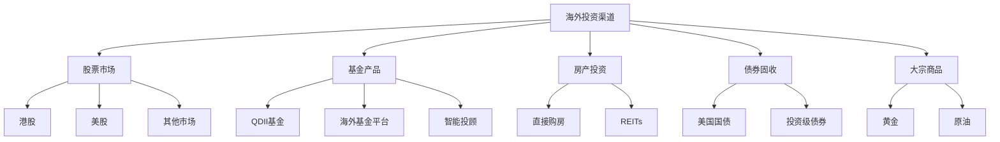
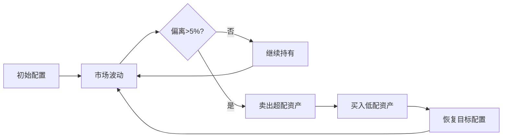

## 一、海外投资渠道实操

全球化投资不是富人的专利，而是每一个想保护和增值财富的人都应该了解的必修课。本章将从港股、美股、海外基金、海外房产、债券与固收、大宗商品六大渠道入手，手把手带你走完从开户到实盘的全流程。



---

### 1.1 港股投资

港股是中国投资者最容易接触的海外市场，具有"背靠祖国、面向全球"的独特优势。港股市场总市值超过35万亿港元，是全球第五大股票市场，汇聚了大量中国优质企业以及国际公司。

#### 1.1.1 港股市场基础认知

**交易规则对比：**

| 规则项 | A股 | 港股 |
|-------|-----|------|
| 交易时间 | 9:30-11:30, 13:00-15:00 | 9:30-12:00, 13:00-16:00 |
| 涨跌幅 | ±10%（创业板±20%） | 无涨跌幅限制 |
| 交收制度 | T+1 | T+0（当天可买卖） |
| 最小单位 | 100股 | 1手（各股不同，可能100/500/1000/2000股） |
| 货币 | 人民币 | 港币 |
| 做空机制 | 融券限制多 | 卖空更灵活 |
| 碎股交易 | 不支持 | 部分券商支持 |

**港股独特的市场结构：**
- **机构主导**：港股70%以上交易量来自机构投资者，散户占比低
- **流动性分化**：蓝筹股日成交数十亿港元，小盘股可能日成交不足百万
- **仙股陷阱**：低于1港元的"仙股"流动性差、波动剧烈，新手应远离
- **老千股**：部分公司通过供股、合股等手段损害小股东利益，需要识别

#### 1.1.2 开户方式详解

| 方式 | 门槛 | 优势 | 劣势 | 适合人群 |
|------|------|------|------|----------|
| 沪港通/深港通 | 50万资金门槛 | 合规便捷，使用A股账户 | 只能买港股通标的（约500只） | 资金充足、求稳的投资者 |
| 香港本地券商 | 无资金门槛 | 全部港股可买，费率低 | 需赴港或线上开户，流程较复杂 | 深度港股投资者 |
| 互联网券商 | 无资金门槛 | 操作便捷，中文界面，开户快 | 资金安全保障需确认 | 新手和中等资金投资者 |
| 银行渠道 | 通常5万起 | 资金安全感强 | 费率高，标的少 | 保守型投资者 |

**互联网券商开户实操流程（以富途为例）：**

1. **下载APP**：在应用商店搜索"富途牛牛"下载
2. **注册账户**：使用手机号或邮箱注册
3. **身份验证**：上传身份证正反面照片，进行人脸识别
4. **填写资料**：职业信息、收入情况、投资经验（如实填写）
5. **选择账户类型**：港股账户（建议同时开通美股账户）
6. **签署协议**：电子签名确认各项协议
7. **审核通过**：通常1-2个工作日，快的话当天通过
8. **入金**：通过银行转账至券商指定的港币账户

**入金方式对比：**

| 入金方式 | 到账时间 | 手续费 | 汇率损失 | 推荐指数 |
|----------|----------|--------|----------|----------|
| 银行电汇 | 1-3个工作日 | 100-300元 | 银行汇率差约0.3%-0.5% | ⭐⭐⭐ |
| FPS转数快 | 即时到账 | 免费 | 需自己换汇 | ⭐⭐⭐⭐⭐ |
| 支付宝/微信 | 即时到账 | 约0.1% | 汇率较好 | ⭐⭐⭐⭐ |
| Wise/Remitly | 1-2个工作日 | 约0.5% | 汇率透明 | ⭐⭐⭐⭐ |

**重要提醒**：入金时务必确认券商的银行账户信息，不要向任何个人账户转账。正规券商的入金账户一定是公司对公账户。

#### 1.1.3 港股的核心投资机会

**（1）AH股溢价策略**

同一家公司同时在A股和H股上市，由于投资者结构、流动性、汇率等因素，H股通常比A股便宜。截至2024年，AH溢价指数长期维持在130-150之间，意味着H股平均比A股便宜30%-50%。

| 典型AH股 | A股价格(元) | H股价格(港元) | 溢价率 |
|----------|------------|--------------|--------|
| 中国平安 | ~45 | ~38 | ~30% |
| 招商银行 | ~33 | ~28 | ~25% |
| 中信证券 | ~20 | ~15 | ~40% |
| 中国神华 | ~35 | ~28 | ~30% |

**实操要点**：
- 溢价率超过50%的股票，H股安全边际更高
- 关注基本面，溢价高不代表值得买，可能是A股被高估
- 汇率波动会影响实际收益，港币与美元挂钩，人民币升值时溢价可能扩大

**（2）高股息蓝筹**

港股蓝筹股息率普遍高于A股，是稳健收益的重要来源：

| 股票 | 股息率(近12个月) | 分红频率 | 行业 |
|------|-----------------|----------|------|
| 汇丰控股 | 5%-7% | 季度分红 | 银行 |
| 中国移动 | 6%-8% | 半年分红 | 电信 |
| 中国海油 | 7%-10% | 半年分红 | 能源 |
| 长江基建 | 5%-6% | 半年分红 | 基建 |
| 港灯-SS | 5%-6% | 每月分红 | 公用事业 |

**高股息策略注意事项**：
- 股息率 = 每股分红 / 股价，股价下跌会导致股息率被动升高，这是陷阱不是机会
- 关注派息比率（分红/净利润），超过80%可能不可持续
- 了解股息税政策：通过港股通持有，H股分红扣10%红利税，非H股扣20%

**（3）新经济龙头**

港股是全球第二大中国科技公司上市地，汇聚了众多新经济龙头：

| 公司 | 代码 | 业务 | 市值级别 |
|------|------|------|----------|
| 腾讯控股 | 0700 | 社交+游戏+云 | 超大型 |
| 美团-W | 3690 | 本地生活 | 大型 |
| 小米集团 | 1810 | 消费电子+IoT | 大型 |
| 快手-W | 1024 | 短视频 | 中大型 |
| 京东集团 | 9618 | 电商+物流 | 大型 |
| 百度集团 | 9888 | 搜索+AI | 中大型 |
| 网易 | 9999 | 游戏+音乐 | 大型 |
| 理想汽车 | 2015 | 新能源汽车 | 中大型 |

**（4）港股打新**

港股打新（IPO认购）是港股市场的独特机会：

- **中签率高**：港股打新采用"红鞋制度"，优先保证散户每人至少中1手
- **平均首日涨幅**：热门新股首日涨幅通常在10%-50%，但也有破发风险
- **资金效率**：使用孖展（融资）打新，1万港元本金可认购10倍以上
- **成本**：认购手续费约50-100港元/手，融资利息按天计算

**打新流程**：
1. 关注新股招股公告（富途APP有专门的IPO中心）
2. 分析招股书：公司基本面、发行估值、保荐人历史表现
3. 在招股期内提交认购申请
4. 公布中签结果（通常招股结束后3-5天）
5. 首日交易：决定持有还是卖出

**避坑指南**：
- 不要盲目打所有新股，破发率约30%-40%
- 关注保荐人历史业绩，顶级投行保荐的新股表现通常更好
- 暗盘交易（上市前一日）可以提前卖出，但流动性有限

---

### 1.2 美股投资

美股是全球最大的资本市场，总市值超过50万亿美元，占全球股市市值的40%以上。美股拥有最丰富的投资标的、最成熟的市场机制、最透明的信息披露，是全球投资者的必争之地。

#### 1.2.1 美股市场基础认知

**美股三大交易所：**

| 交易所 | 特点 | 代表公司 |
|--------|------|----------|
| 纽约证券交易所（NYSE） | 最古老，蓝筹为主 | 伯克希尔、摩根大通、可口可乐 |
| 纳斯达克（NASDAQ） | 科技股集中地 | 苹果、微软、谷歌、亚马逊 |
| 美国证券交易所（AMEX） | 中小盘和ETF为主 | 各类ETF和期权 |

**交易规则：**

| 规则项 | 详情 |
|--------|------|
| 交易时间 | 美东时间9:30-16:00（北京时间21:30-4:00，夏令时22:30-5:00） |
| 盘前盘后 | 盘前4:00-9:30，盘后16:00-20:00（美东时间） |
| 涨跌幅 | 无涨跌幅限制（有熔断机制） |
| 交收制度 | T+0（账户资产≥2.5万美元），否则T+1 |
| 最小单位 | 1股（部分券商支持碎股） |
| 货币 | 美元 |

**PDT规则（Pattern Day Trader）**：
- 如果5个交易日内进行4次以上日内交易，会被标记为"典型日内交易者"
- 被标记后，账户资产必须维持在2.5万美元以上，否则会被限制交易
- 解决方案：保持账户资产≥2.5万美元，或控制日内交易频率

#### 1.2.2 开户流程详解

**券商选择对比：**

| 券商 | 佣金 | 碎股 | 中文服务 | 开户门槛 | 适合人群 |
|------|------|------|----------|----------|----------|
| 盈透证券（IB） | $0（IBKR Lite） | 支持 | 有 | 无 | 专业投资者 |
| 嘉信理财（Schwab） | $0 | 支持 | 有限 | 无 | 综合型投资者 |
| 富途（Futu） | $0 | 支持 | 原生中文 | 无 | 中国投资者首选 |
| 老虎证券（Tiger） | $0 | 支持 | 原生中文 | 无 | 中国投资者 |
| 微牛（Webull） | $0 | 支持 | 有 | 无 | 年轻投资者 |

**开户实操流程（以富途为例）：**

1. **准备材料**：
   - 身份证或护照（二选一）
   - 中国大陆手机号
   - 银行卡（用于入金）

2. **下载APP并注册**：
   - 应用商店搜索"富途牛牛"
   - 使用手机号注册，完成手机验证

3. **提交开户申请**：
   - 进入"我的"→"开户"
   - 选择"美股账户"
   - 上传身份证照片（正反面）
   - 进行人脸识别验证
   - 填写个人信息：职业、收入、投资经验、风险承受能力

4. **签署协议**：
   - 阅读并签署W-8BEN表格（非美国居民税收优惠表格）
   - 签署其他电子协议

5. **等待审核**：
   - 通常1-3个工作日
   - 审核通过后会收到通知

6. **入金**：
   - 方式一：银行电汇（推荐，1-3个工作日到账）
   - 方式二：第三方支付（Wise等，较快但有手续费）
   - 方式三：港股账户资金直接划转（如果已有港股账户）

**入金注意事项**：
- 首次入金建议小额测试（100-500美元）
- 电汇时备注栏填写券商给你的账户编号
- 银行换汇时注意年度5万美元外汇额度限制
- 美元入金后可以直接购买美股，无需再次换汇

#### 1.2.3 美股核心投资标的

**（1）科技巨头组合（Magnificent 7）**

| 公司 | 代码 | 业务 | 市值 | 估值参考 |
|------|------|------|------|----------|
| 苹果 | AAPL | 消费电子+服务 | 3万亿+ | PE 25-30 |
| 微软 | MSFT | 云计算+AI+办公 | 3万亿+ | PE 30-35 |
| 谷歌 | GOOGL | 搜索+广告+云 | 2万亿+ | PE 20-25 |
| 亚马逊 | AMZN | 电商+云+广告 | 2万亿+ | PE 40-50 |
| 英伟达 | NVDA | AI芯片 | 2万亿+ | PE 50-80 |
| Meta | META | 社交+广告+VR | 1万亿+ | PE 20-25 |
| 特斯拉 | TSLA | 电动车+能源 | 5000亿+ | PE 50-100 |

**（2）指数ETF（新手首选）**

| ETF | 跟踪指数 | 费率 | 特点 | 适合场景 |
|-----|----------|------|------|----------|
| SPY | 标普500 | 0.09% | 流动性最强的ETF | 长期持有核心仓位 |
| VOO | 标普500 | 0.03% | 费率更低 | 长期定投首选 |
| QQQ | 纳斯达克100 | 0.20% | 偏重科技股 | 看好科技行业 |
| VTI | 美国全市场 | 0.03% | 最广泛的分散 | 一站式美股配置 |
| VXUS | 全球非美市场 | 0.07% | 国际分散 | 配合美股ETF |
| SCHD | 高股息美股 | 0.06% | 高分红股票 | 追求现金流 |
| ARKK | 颠覆式创新 | 0.75% | 高风险高收益 | 激进型投资者 |

**（3）价值投资标的**

| 公司 | 代码 | 股息率 | 特点 |
|------|------|--------|------|
| 伯克希尔·哈撒韦 | BRK.B | 0%（不分红） | 巴菲特旗舰，长期年化~20% |
| 强生 | JNJ | 3% | 60年连续提高股息 |
| 可口可乐 | KO | 3% | 60年连续提高股息 |
| 宝洁 | PG | 2.5% | 消费品龙头 |
| 麦当劳 | MCD | 2.5% | 50年连续提高股息 |
| 雪佛龙 | CVX | 4% | 能源巨头 |

#### 1.2.4 美股投资核心技巧

**（1）定期定额策略（Dollar-Cost Averaging）**

这是最适合新手的策略，核心逻辑是通过固定时间、固定金额买入，平滑市场波动：

- **执行方式**：每月固定日期（如每月15号）买入固定金额的ETF
- **推荐标的**：VOO或VTI（费率低、分散度高）
- **历史回测**：过去20年，每月定投标普500，年化收益约10%
- **关键纪律**：市场下跌时不停止定投，甚至可以加仓

**定投实操模板**：

```text
每月定投计划：
- 金额：月收入的20%（假设5000元人民币，约700美元）
- 标的：VOO 60% + VXUS 30% + SCHD 10%
- 日期：每月15号（发薪日后3天）
- 工具：券商的"定期定额"功能（富途、老虎都支持自动定投）
```

**（2）财报季投资策略**

美股公司每季度发布财报（Q1: 4月，Q2: 7月，Q3: 10月，Q4: 1-2月），财报前后波动显著：

- **财报前**：隐含波动率升高，期权变贵，不确定性大
- **财报后**：符合预期则股价平稳，超预期则大涨，不及预期则大跌
- **策略建议**：
  - 新手：避免在财报前重仓单只股票
  - 进阶：利用财报后反应进行动量交易
  - 保守：持有ETF，分散单一公司财报风险

**（3）碎股交易技巧**

碎股交易让你用任意金额购买高价股，特别适合资金有限的投资者：

- **支持碎股的券商**：富途、老虎、盈透、嘉信
- **最小交易单位**：通常0.001股起
- **使用场景**：每月定投700美元，可以精确分配到多只股票
- **注意事项**：碎股交易可能有略微不同的价格（流动性略差）

**（4）税务优化**

中美税收协定对美股投资者的税务影响：

| 收入类型 | 预扣税率 | 说明 |
|----------|----------|------|
| 股息 | 10% | 需填写W-8BEN表格才能享受优惠税率 |
| 利息 | 0% | 免税 |
| 资本利得 | 0% | 非美国居民免征联邦资本利得税 |
| 遗产税 | 40% | 超过6万美元部分征收，需注意资产配置 |

**W-8BEN表格**：
- 开户时券商会引导你填写
- 作用：证明你是非美国居民，享受税收协定优惠
- 有效期：3年，到期需要重新填写
- 不填写的话，股息预扣税率会从10%升至30%

**中国税务**：
- 美股收益需要在中国申报个人所得税
- 资本利得：目前实操中个人投资者很少主动申报
- 股息：已经被美国预扣10%，理论上中国还需补缴差额
- 建议：咨询专业税务顾问，了解最新政策

---

### 1.3 海外基金投资

海外基金是最简单的全球化投资方式，适合不想直接操作个股的投资者。通过基金，你可以用极低的门槛实现全球资产配置。

#### 1.3.1 QDII基金（国内购买）

QDII（Qualified Domestic Institutional Investor）基金是国内投资者参与海外市场的最便捷渠道，通过支付宝、天天基金、银行APP等平台即可购买。

**QDII基金分类：**

| 类型 | 代表基金 | 跟踪标的 | 费率 | 适合场景 |
|------|----------|----------|------|----------|
| 美股指数 | 广发纳斯达克100 | 纳斯达克100 | 0.80% | 看好美国科技 |
| 标普500 | 博时标普500ETF | 标普500 | 0.60% | 美股大盘配置 |
| 全球股票 | 华夏全球股票 | 全球精选 | 1.50% | 全球分散 |
| 黄金 | 华安黄金ETF | 黄金价格 | 0.50% | 避险配置 |
| 债券 | 易方达中短期美元债 | 美元债券 | 0.60% | 稳健收益 |
| 房地产 | 广发美国房地产REITs | 美国REITs | 0.80% | 房产投资替代 |

**QDII基金优缺点：**

| 优势 | 劣势 |
|------|------|
| 门槛极低（100元起） | 费率高于直接买ETF（0.6%-1.5% vs 0.03%-0.20%） |
| 无需换汇，人民币直接买 | 额度限制，热门基金经常限购 |
| 自动处理税务 | 跟踪误差可能较大 |
| 申购赎回方便 | T+2确认，资金效率较低 |
| 适合定投 | 汇率波动影响净值 |

**QDII基金选择原则：**
1. **费率优先**：同类基金选费率最低的
2. **规模适中**：2-50亿元最佳，太小有清盘风险，太大可能跟踪误差增大
3. **跟踪误差**：指数基金看跟踪误差，越小越好（<0.5%为优秀）
4. **历史业绩**：参考但不依赖，过去表现不代表未来
5. **额度充足**：查看基金是否限购，限购严重的基金不方便定投

#### 1.3.2 海外基金平台

对于有海外账户的投资者，直接在海外基金平台购买可以获得更低的费率和更丰富的选择。

**主流海外基金平台：**

| 平台 | 特点 | 最低投资 | 适合人群 |
|------|------|----------|----------|
| Vanguard | 自有基金费率最低 | $3000 | 长期指数投资者 |
| Fidelity | 基金种类丰富 | $0（部分基金） | 综合型投资者 |
| Interactive Brokers | 全球市场接入 | $0 | 专业投资者 |
| Charles Schwab | 用户体验好 | $0 | 美国市场投资者 |

**推荐的海外基金组合（核心+卫星策略）：**

```text
核心仓位（70%）：
- VTI（美国全市场）：40%
- VXUS（国际全市场）：20%
- BND（美国债券）：10%

卫星仓位（30%）：
- VWO（新兴市场）：10%
- VNQ（美国房地产REITs）：10%
- GLD（黄金）：10%
```

#### 1.3.3 智能投顾

智能投顾（Robo-Advisor）是算法驱动的资产配置平台，适合完全没有投资经验或没有时间管理投资的人。

**主流智能投顾平台：**

| 平台 | 管理费 | 最低投资 | 特点 |
|------|--------|----------|------|
| Betterment | 0.25%/年 | $0 | 最老牌，税务优化强 |
| Wealthfront | 0.25%/年 | $500 | 直接指数投资，费率低 |
| M1 Finance | 0% | $100 | 免费，自定义组合 |
| 智投（国内） | 0.5%/年 | 1000元 | 中文界面，合规 |

**智能投顾工作原理：**
1. 完成风险评估问卷（10-15个问题）
2. 系统根据风险偏好生成资产配置方案
3. 自动买入对应的ETF组合
4. 定期自动再平衡（通常每季度）
5. 自动税务优化（Tax-Loss Harvesting）

---

### 1.4 海外房产投资

海外房产投资门槛较高，但可以提供稳定的现金流和资产保值。对于高净值人群，海外房产是资产配置的重要组成部分。

#### 1.4.1 热门投资目的地深度分析

| 国家/地区 | 房价水平 | 租金回报 | 政策友好度 | 流动性 | 购房成本 | 持有成本 |
|----------|---------|---------|-----------|--------|----------|----------|
| 泰国曼谷 | 中低（1-3万/㎡） | 5%-7% | 高（外国人可买公寓） | 中 | 印花税1% | 物业费20-40泰铢/㎡/月 |
| 日本东京 | 中（3-6万/㎡） | 4%-6% | 高（无限制） | 高 | 登记税2% | 固定资产税1.4%/年 |
| 美国 | 高（5-15万/㎡） | 3%-5% | 中（需ITIN） | 高 | 交易成本5%-8% | 房产税1%-3%/年 |
| 英国伦敦 | 极高（10-20万/㎡） | 2%-4% | 中 | 高 | 印花税5%-12% | 地租+物业费 |
| 澳大利亚 | 高（5-10万/㎡） | 3%-4% | 低（限购） | 中 | 印花税4%-5% | 物业费+市政费 |
| 葡萄牙 | 中（2-5万/㎡） | 4%-6% | 高（黄金签证） | 中 | 交易税6%-8% | IMI税0.3%-0.8%/年 |

**泰国房产投资实操：**

1. **法律限制**：外国人只能购买公寓（Condo），不能购买土地和别墅
2. **产权**：永久产权（Freehold），外国人持有比例不超过整栋楼的49%
3. **购买流程**：
   - 选房：通过泰国本地中介或开发商直接购买
   - 定金：支付5-10万泰铢定金
   - 合同：签署购房合同，支付10%-30%首付
   - 过户：在土地局办理过户，支付剩余款项
   - 费用：过户费2%、印花税0.5%、特种商业税3.3%（卖方承担）
4. **租金管理**：委托本地物业管理公司，管理费通常为租金的8%-15%
5. **资金出境**：通过正规银行电汇，保留所有资金证明

**日本房产投资实操：**

1. **优势**：无外国人购房限制、永久产权、租金稳定、日元资产可对冲人民币风险
2. **购买流程**：
   - 选定物件：通过Suumo、Homes等网站或中介
   - 重要事项说明：卖方必须提供物件详细说明
   - 签约：支付10%定金，签署买卖合同
   - 决济：支付剩余款项，办理所有权转移登记
   - 费用：登录免许税2%、不动产取得税3%-4%、司法书士费用
3. **贷款**：部分日本银行对外国人提供贷款，通常要求在日有稳定收入
4. **管理**：委托管理会社，管理费为租金的5%-8%

#### 1.4.2 REITs：房产投资的替代方案

如果不想直接购买海外房产，REITs（房地产投资信托基金）是绝佳的替代方案。REITs让你用很少的资金就能投资全球房地产，享受租金收益和资产增值。

**REITs vs 直接购房对比：**

| 对比项 | 直接购房 | REITs |
|--------|----------|-------|
| 门槛 | 50万-500万人民币 | 1000元起 |
| 流动性 | 低（交易周期长） | 高（股票市场实时交易） |
| 分散度 | 单一房产 | 一篮子房产 |
| 管理 | 需自己打理 | 专业团队管理 |
| 杠杆 | 可贷款 | 内部杠杆约50% |
| 税务 | 复杂 | 相对简单 |
| 透明度 | 低 | 高（定期披露） |

**推荐的REITs ETF：**

| ETF | 名称 | 费率 | 投资范围 |
|-----|------|------|----------|
| VNQ | Vanguard美国房地产 | 0.12% | 美国REITs |
| VNQI | Vanguard国际房地产 | 0.12% | 全球非美REITs |
| SCHH | Schwab美国房地产 | 0.07% | 美国REITs |
| RWR | SPDR道琼斯房地产 | 0.25% | 美国REITs |

---

### 1.5 海外债券与固定收益

债券是投资组合的"压舱石"，在股市下跌时提供缓冲。海外债券市场比国内更成熟，选择更多。

#### 1.5.1 美国国债

美国国债被视为全球最安全的投资品种，是各国央行和机构投资者的核心配置。

**美国国债类型：**

| 类型 | 期限 | 特点 | 适合场景 |
|------|------|------|----------|
| T-Bills | 4周-1年 | 无息，折价发行 | 现金管理 |
| T-Notes | 2-10年 | 半年付息 | 核心配置 |
| T-Bonds | 20-30年 | 半年付息 | 长期配置 |
| TIPS | 5-30年 | 跟踪通胀 | 通胀对冲 |
| I-Bonds | 30年 | 跟踪通胀+固定利率 | 通胀保护 |

**购买方式：**
1. **直接购买**：通过TreasuryDirect.gov（美国居民）
2. **ETF方式**：通过券商购买债券ETF

**推荐的债券ETF：**

| ETF | 名称 | 费率 | 久期 | 适合场景 |
|-----|------|------|------|----------|
| BND | Vanguard总债券 | 0.03% | 中等 | 核心债券配置 |
| AGG | iShares总债券 | 0.03% | 中等 | 核心债券配置 |
| SHY | iShares 1-3年国债 | 0.15% | 短期 | 现金替代 |
| IEF | iShares 7-10年国债 | 0.15% | 中期 | 利率下行时配置 |
| TLT | iShares 20年+国债 | 0.15% | 长期 | 利率下行时高弹性 |
| TIP | iShares TIPS | 0.19% | 中期 | 通胀保护 |

#### 1.5.2 公司债券

公司债券提供比国债更高的收益，但需要承担信用风险。

**信用评级与收益关系：**

| 评级 | 典型收益率 | 风险级别 | 代表ETF |
|------|-----------|----------|---------|
| AAA | 4%-5% | 极低 | 微软、苹果公司债 |
| AA | 4.5%-5.5% | 低 | JNJ、PG公司债 |
| A | 5%-6% | 中低 | LQD（投资级公司债） |
| BBB | 5.5%-7% | 中等 | 临界投资级 |
| BB及以下 | 7%-12%+ | 高 | HYG、JNK（高收益债） |

---

### 1.6 大宗商品投资

大宗商品是投资组合的重要分散工具，与股票和债券的相关性低，可以有效降低整体波动。

#### 1.6.1 黄金投资

黄金是全球公认的避险资产，在地缘政治风险、通胀预期升高时表现突出。

**黄金投资方式对比：**

| 方式 | 门槛 | 流动性 | 成本 | 跟踪误差 | 适合场景 |
|------|------|--------|------|----------|----------|
| 实物金条 | 中 | 低 | 高（买卖价差3%-8%） | 无 | 长期持有 |
| 黄金ETF | 低 | 高 | 低（费率0.25%-0.40%） | 小 | 灵活配置 |
| 黄金QDII | 低 | 中 | 中（费率0.5%-1%） | 中 | 国内投资者 |
| 期货 | 高 | 高 | 低 | 无 | 专业投资者 |
| 金矿股 | 低 | 高 | 低 | 大 | 看多黄金+股票 |

**推荐的黄金ETF：**

| ETF | 名称 | 费率 | 持仓方式 |
|-----|------|------|----------|
| GLD | SPDR黄金 | 0.40% | 实物金 |
| IAU | iShares黄金 | 0.25% | 实物金 |
| GLDM | SPDR黄金Mini | 0.10% | 实物金（最低费率） |
| GDX | VanEck金矿 | 0.51% | 金矿股 |

**黄金配置建议**：
- 占投资组合的5%-15%
- 主要功能是对冲风险，不是追求收益
- 在地缘政治紧张、美元走弱时加仓
- 不要追涨杀跌，长期持有

#### 1.6.2 原油投资

原油是全球经济的"血液"，价格波动大，适合有一定经验的投资者。

**原油投资方式：**

| 方式 | 门槛 | 特点 | 风险 |
|------|------|------|------|
| USO（原油ETF） | 低 | 跟踪WTI原油期货 | 期货展期损耗大 |
| XLE（能源板块ETF） | 低 | 投资能源公司股票 | 受公司经营影响 |
| 能源QDII | 低 | 国内购买 | 额度限制 |
| 原油期货 | 高 | 直接交易 | 高杠杆，风险极大 |

**原油投资注意事项**：
- 原油ETF因期货展期损耗，长期表现可能显著落后于油价本身
- 新手建议通过能源板块ETF（XLE）间接参与
- 原油波动极大，仓位控制在5%以内

---

### 1.7 海外投资风险管理

全球化投资带来收益机会的同时，也引入了新的风险维度。有效的风险管理是长期盈利的关键。

#### 1.7.1 汇率风险

汇率波动是海外投资不可忽视的因素，有时甚至会吞噬全部投资收益。

**汇率风险示例**：

假设你用人民币买入美股，一年后美股上涨10%，但人民币对美元升值8%，你的实际收益是多少？

```text
实际收益 = (1 + 10%) × (1 - 8%) - 1 = 1.1 × 0.92 - 1 = 1.2%
```

原本10%的收益被汇率吃掉了大部分，只剩下1.2%。

**汇率风险管理策略**：

| 策略 | 操作 | 成本 | 适合场景 |
|------|------|------|----------|
| 自然对冲 | 收入和资产同币种 | 无 | 有海外收入的人 |
| 分散币种 | 配置多种货币资产 | 低 | 所有投资者 |
| 外汇远期 | 与银行签订远期合约 | 中 | 大额资金 |
| 多币种账户 | 保留外币不换回 | 低 | 长期投资者 |

#### 1.7.2 政治与监管风险

- **政策变化**：如澳大利亚收紧外国人购房政策、中国资本管制加强
- **税收变化**：如遗产税政策调整、预扣税率变化
- **制裁风险**：极端情况下，资产可能被冻结
- **应对策略**：分散投资多个国家，不要把所有资产放在一个国家

#### 1.7.3 流动性风险

- **小盘股**：港股小盘股和美股小市值股票流动性差，大额卖出可能困难
- **房产**：海外房产交易周期长，急需资金时难以快速变现
- **新兴市场**：部分新兴市场资本管制严格，资金进出受限
- **应对策略**：核心仓位配置高流动性资产（大盘股、ETF），卫星仓位配置低流动性资产

#### 1.7.4 信息不对称风险

- **时差**：美股交易时间在国内深夜，无法实时关注
- **语言障碍**：英文财报和新闻可能遗漏重要信息
- **文化差异**：对公司治理、商业模式的理解偏差
- **应对策略**：利用券商的中文研报、设置价格提醒、关注权威中文财经媒体

---

### 1.8 全球化投资组合配置建议

#### 1.8.1 按风险偏好配置

**保守型（年化目标4%-6%）：**

| 资产类别 | 配置比例 | 推荐标的 |
|----------|----------|----------|
| 美国国债 | 40% | BND或SHY |
| 全球股票 | 30% | VTI+VXUS |
| 黄金 | 15% | GLDM |
| 现金 | 15% | 货币基金 |

**平衡型（年化目标6%-10%）：**

| 资产类别 | 配置比例 | 推荐标的 |
|----------|----------|----------|
| 美股 | 40% | VOO |
| 国际股票 | 20% | VXUS |
| 债券 | 20% | BND |
| REITs | 10% | VNQ |
| 黄金 | 10% | GLDM |

**激进型（年化目标10%-15%）：**

| 资产类别 | 配置比例 | 推荐标的 |
|----------|----------|----------|
| 美股科技 | 40% | QQQ |
| 美股成长 | 20% | VOO |
| 新兴市场 | 15% | VWO |
| 个股精选 | 15% | 自选 |
| 加密货币 | 10% | BTC/ETH |

#### 1.8.2 再平衡策略

再平衡是维持投资组合风险收益特征的关键操作：

- **触发条件**：某资产类别偏离目标配置超过5个百分点
- **频率**：每季度检查一次，每年至少再平衡一次
- **操作**：卖出超配的资产，买入低配的资产
- **税费注意**：再平衡可能触发资本利得税，优先通过新增资金调整



---

### 1.9 常见误区与避坑指南

**误区一：只买美股就够了**
- 风险：过度集中于单一市场和单一货币
- 纠正：配置20%-40%的国际资产，分散地域风险

**误区二：追涨热门股票**
- 风险：买在高点，长期套牢
- 纠正：坚持定投策略，不追热点

**误区三：忽略汇率风险**
- 风险：投资收益被汇率波动吞噬
- 纠正：分散币种配置，长期持有减少汇率影响

**误区四：频繁交易**
- 风险：交易成本侵蚀收益，情绪化决策
- 纠正：减少交易频率，以年为单位持有

**误区五：不了解税务规则**
- 风险：被双重征税或面临税务合规问题
- 纠正：开户时填写W-8BEN，了解中美税收协定

**误区六：把所有资金一次性投入**
- 风险：如果市场立刻下跌，心理压力大
- 纠正：分批建仓，6-12个月逐步投入

**误区七：只看收益不看风险**
- 风险：高收益伴随高波动，可能在下跌时恐慌卖出
- 纠正：了解自己的风险承受能力，配置相应资产

**误区八：忽略再平衡**
- 风险：投资组合偏离最初的风险设定
- 纠正：每季度检查，定期再平衡

---

### 1.10 进阶：全球宏观视角下的投资时机

理解全球宏观经济周期，可以帮助你在大方向上做出正确的资产配置决策。

**美林时钟（投资时钟）：**

| 经济阶段 | 经济特征 | 最优资产 | 次优资产 |
|----------|----------|----------|----------|
| 复苏期 | GDP上升，通胀低 | 股票 | 债券 |
| 过热期 | GDP上升，通胀上升 | 大宗商品 | 股票 |
| 滞胀期 | GDP下降，通胀高 | 现金 | 大宗商品 |
| 衰退期 | GDP下降，通胀低 | 债券 | 现金 |

**关键宏观指标监控：**

| 指标 | 数据来源 | 频率 | 影响 |
|------|----------|------|------|
| 美联储利率决议 | Federal Reserve | 6周一次 | 影响全球资产定价 |
| 非农就业数据 | BLS | 每月第一个周五 | 反映美国经济强弱 |
| CPI通胀数据 | BLS | 每月中旬 | 影响美联储决策 |
| PMI制造业指数 | ISM/各国统计局 | 每月初 | 反映经济景气度 |
| 中美贸易数据 | 海关总署/USTR | 每月 | 影响汇率和相关股票 |

**实用建议**：
- 不需要精确预测宏观走势，但需要知道当前处于什么阶段
- 美联储加息周期：减少长久期债券，增加现金和短债
- 美联储降息周期：增加股票和长久期债券
- 地缘政治紧张：增加黄金和防御性资产
- 经济衰退信号：增加债券和高股息股票

---

**本章小结**：海外投资不是简单的"买外国股票"，而是涵盖股票、基金、房产、债券、大宗商品的完整资产配置体系。核心原则是：分散化（地域、币种、资产类别）、低成本（优先选择低费率ETF）、长期持有（以年为单位）、定期再平衡（维持风险收益特征）。从小额定投指数ETF开始，随着经验增长逐步扩展投资范围，是大多数人的最优路径。
