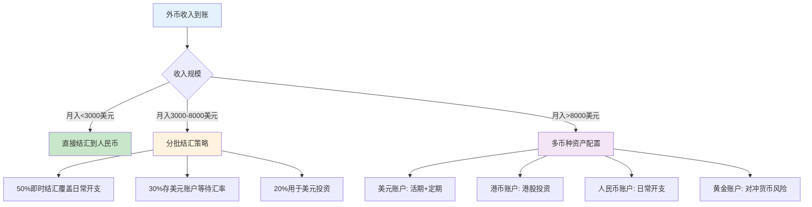

## 二、跨境收入获取技巧

跨境收入的本质是**用你的技能、时间或产品直接赚取外币**，而非通过投资让已有的钱增值。它和海外投资的根本区别在于：投资是"钱生钱"，跨境收入是"人生钱"——你需要投入时间和精力，但获得的回报是天然的货币对冲。

为什么跨境收入在"全球化搞钱"体系中地位特殊？原因有三：

- **天然汇率对冲**：你赚的是美元，人民币贬值时你的收入自动"涨价"，无需任何金融操作
- **零资本门槛**：不需要先有50万才能开始，一个技能+一台电脑就够了
- **可叠加性**：跨境收入和国内收入完全独立，一个不会挤占另一个

本节覆盖五条获取跨境收入的路径：海外自由职业、跨境电商、远程工作、内容创作变现、数字产品与SaaS。每条路径都会从"道"（底层逻辑）到"术"（具体操作）完整展开。

***

### 2.1 海外自由职业

#### 2.1.1 为什么自由职业是跨境收入的最佳起点

自由职业之所以适合入门，是因为它的试错成本极低：你不需要辞职、不需要囤货、不需要投资本金。晚上回家注册个账号，周末写两份提案，下周就可能拿到第一个项目。最坏的结果不过是浪费了几个小时——而这几个小时本身就是学习。

自由职业的核心价值公式：

```text
收入 = 专业能力 × 英语沟通能力 × 平台运营能力
```

三个因子缺一不可。很多人只关注专业能力，忽视了英语和运营，结果在平台上一个月接不到一个单。反过来，英语再好但技术不行，也做不长久。

#### 2.1.2 主流平台深度对比

| 维度 | Upwork | Fiverr | Toptal | 99designs | Contra |
|------|--------|--------|--------|-----------|--------|
| **定位** | 综合自由职业 | 创意服务商城 | 顶级技术人才 | 设计专项 | 无佣金自由职业 |
| **佣金** | 20%→10%→5%（阶梯制） | 20% | 无佣金（客户付） | 40%（含保障） | 0% |
| **适合人群** | 开发/设计/写作/营销 | 创意/设计/视频/音乐 | 高级开发/设计/财务 | 平面/UI/品牌设计 | 各领域 |
| **竞争强度** | 高（全球用户） | 极高 | 中（门槛高） | 中高 | 低（较新） |
| **起步难度** | 中 | 低（先搭Gig） | 高（需通过筛选） | 中 | 低 |
| **收入天花板** | $50-300/小时 | $50-500/Gig | $100-300/小时 | 项目制$500-5000 | $50-200/小时 |
| **付款保障** | 好（托管机制） | 好 | 好 | 好 | 一般 |

**Upwork佣金阶梯详解**：Upwork对同一个客户的累计收入实行阶梯佣金——前$500收20%，$500-$10000收10%，$10000以上收5%。这意味着长期合作的大客户比频繁换新客户划算得多。

**平台选择建议**：
- 如果你是开发者：优先Upwork，备选Toptal（如能力够）
- 如果你是设计师：Upwork + 99designs双开
- 如果你做创意内容（视频/音乐/文案）：Fiverr起步最快
- 如果你不想付佣金：Contra，但客户量较少

#### 2.1.3 从零到第一个项目的完整流程

**第一步：打造专业的个人资料（1-3天）**

资料是你在平台上的"门面"，直接影响客户是否点击"邀请面试"。

关键要素：
- **头像**：专业正装照或清晰的半身照，背景干净。不要用风景照、卡通头像或集体照
- **标题**：一句话说清你能做什么。差的标题："Developer"，好的标题："Full-Stack Developer | React + Node.js + AWS | 50+ Projects Delivered"
- **简介**：用"问题→方案→证据"结构。先说客户有什么痛点，再说你能怎么解决，最后用数据或案例证明
- **时薪定价**：新手建议$15-25/小时起步，有10+个5星评价后逐步提价
- **作品集**：即使是个人项目也要展示，3-5个最佳。每个作品写清楚：问题是什么、你做了什么、结果如何

**第二步：写出让客户回复的提案（Proposal）**

平台上80%的提案被忽略，因为它们是这样的模板：

> "Hi, I am a developer with 5 years of experience. I can do this project. Please check my portfolio."

这种提案在客户眼里等于空气。高效的提案结构是**AIDA模型**：

```text
A - Attention（抓住注意力）：用客户项目中的具体细节证明你认真看了
I - Interest（引发兴趣）：简述你的解决思路
D - Desire（激发欲望）：展示类似项目的成功案例
A - Action（推动行动）：提出下一步具体建议
```

一个真实的高转化提案示例：

> Hi [Client Name],
>
> I noticed you're building a real-time dashboard for your SaaS platform — specifically needing WebSocket integration with React. I built something very similar last quarter for a fintech startup: a live trading dashboard handling 10K concurrent connections with < 100ms latency.
>
> My approach for your project would be:
> 1. Socket.IO for the WebSocket layer (more reliable than raw WebSocket for your use case)
> 2. React + Zustand for state management (lighter than Redux for real-time data)
> 3. Redis pub/sub for message distribution across multiple server instances
>
> I've attached a brief technical spec with my proposed architecture. Happy to jump on a 15-min call to discuss details.
>
> Best,
> [Your Name]

**第三步：获取第一批评价（1-3个月）**

新手期最大的难题是"没有评价→客户不选你→还是没有评价"的死循环。破解方法：

- **策略一：适当低价**。不是打价格战，而是在前3-5个项目主动降低20-30%报价，换取快速成交和好评
- **策略二：从小项目做起**。$100-300的小项目决策周期短、风险低，客户更容易给新手机会
- **策略三：申请固定价格项目**。新手的时薪竞争力不足，但固定价格项目中客户更看重提案质量
- **策略四：完善Upwork的"职业测试"**。通过平台上的技能测试可以增加可信度
- **策略五：使用Connects精准投递**。不要海投，每天精选3-5个高度匹配的项目

#### 2.1.4 进阶：从自由职业者到高收入顾问

当你的评价超过20个、成功率超过90%时，可以开始转型：

- **从执行者到顾问**：不再只写代码，而是帮客户做技术选型、架构设计。时薪可以从$50跳到$150+
- **建立长期客户关系**：一个稳定的大客户（每月$3000-5000）比10个零散小项目更省心
- **产品化你的服务**：把重复性的服务打包成标准化产品，提高效率。比如"WordPress网站搭建$2000，包含5个页面+SEO优化+30天维护"
- **使用专业工具提升效率**：Clockify（时间追踪）、Notion（项目管理）、Calendly（会议预约）、Loom（录制视频提案）

#### 2.1.5 收入预期与成长路径

| 阶段 | 时间 | 月收入预期 | 核心动作 |
|------|------|-----------|---------|
| 新手期 | 第1-3月 | $0-1000 | 积累评价、完善资料、学习提案写作 |
| 成长期 | 第4-8月 | $1000-3000 | 提升时薪、筛选客户、建立口碑 |
| 成熟期 | 第9-18月 | $3000-8000 | 专注高价值领域、建立长期客户 |
| 专家期 | 18月+ | $8000-20000 | 顾问化运营、被动收入（课程/模板） |

***

### 2.2 跨境电商

#### 2.2.1 跨境电商的本质

跨境电商的本质是**利用信息差和供应链优势**——中国有全球最强的消费品供应链，但海外消费者并不知道去哪里找这些产品。你做的事情就是：找到有需求的产品，把中国供应链的优势传递给海外消费者，中间赚取价差。

跨境电商的利润率结构：

```text
售价 $30
- 产品成本（采购+包装）：$5-8
- 头程物流（中国→目的国仓库）：$2-4
- 平台费用（佣金+FBA费用）：$8-12
- 广告费：$3-6
- 其他（退货/保险/工具）：$1-2
─────────────────────
毛利：$5-10（毛利率17%-33%）
```

#### 2.2.2 主要模式深度对比

**（1）平台模式——Amazon FBA**

Amazon FBA（Fulfillment by Amazon）是目前最主流的跨境电商模式。你负责选品和运营，亚马逊负责仓储、配送、客服和退货。

FBA的核心优势：
- **流量巨大**：亚马逊月活用户超过3亿，美国电商市场占有率约40%
- **物流信任**：Prime标志是消费者的信任背书，转化率比自发货高30-50%
- **省心省力**：不需要自己处理物流和客服

FBA的核心劣势：
- **费用高**：佣金（8-15%）+ FBA费用（$3-10/件）+ 仓储费（月度+长期）+ 广告费
- **竞争激烈**：热门品类已经红海，新卖家需要差异化
- **库存风险**：卖不掉的库存会产生长期仓储费（$6.9/立方英尺/月），严重时会被销毁

**FBA完整成本计算示例（以售价$25的蓝牙耳机为例）**：

| 成本项 | 金额 | 说明 |
|--------|------|------|
| 采购成本 | $4.5 | 1688采购价30元人民币 |
| 头程物流 | $1.5 | 海运拼柜到FBA仓库 |
| FBA配送费 | $3.6 | 标准尺寸小件 |
| 平台佣金(15%) | $3.75 | 电子品类15% |
| 月度仓储费 | $0.3 | 按平均库存计算 |
| PPC广告费 | $4.0 | ACoS约30% |
| **总成本** | **$17.65** | |
| **毛利** | **$7.35** | **毛利率29.4%** |

**（2）平台模式——其他平台**

| 平台 | 适合品类 | 市场 | 启动难度 | 月费 |
|------|---------|------|---------|------|
| eBay | 二手/收藏/汽车配件 | 全球 | 低 | 免费（50条listing以内） |
| Shopee | 低价快消品 | 东南亚 | 低 | 免费（前3月） |
| Lazada | 低价快消品 | 东南亚 | 低 | 免费 |
| Temu | 全品类 | 全球 | 中 | 无（但平台控价严） |
| TikTok Shop | 时尚/美妆/创意 | 全球 | 中 | 5%佣金 |

**（3）独立站模式——Shopify**

独立站是你自己的品牌网站，不受平台规则限制，但需要自己引流。

独立站 vs 平台的核心区别：

| 维度 | Amazon FBA | Shopify独立站 |
|------|-----------|--------------|
| 流量来源 | 平台自带 | 需要自己投放广告 |
| 启动成本 | 3-5万（含首批库存） | 1-3万（不含库存可dropship） |
| 利润率 | 15-30% | 30-50%（无平台佣金） |
| 品牌建设 | 弱（消费者认的是亚马逊） | 强（完全自主品牌） |
| 客户数据 | 平台拥有 | 你自己拥有 |
| 适合阶段 | 验证产品阶段 | 品牌化阶段 |

**独立站引流核心渠道**：
- **Facebook/Instagram广告**：最主流的引流方式，CPM（千次展示费用）$5-15，需要持续优化广告素材和受众定向
- **Google搜索广告**：适合有明确搜索意图的产品，CPC（点击费用）$0.5-3
- **TikTok广告**：2024-2026年增长最快的渠道，CPM较低但素材要求高
- **SEO自然流量**：见效慢（3-6个月），但长期免费，需要持续输出内容
- **KOL/KOC合作**：通过网红带货，适合时尚/美妆/生活方式品类

#### 2.2.3 选品方法论

选品是跨境电商成功的关键——选对了产品，运营能力差一点也能赚钱；选错了产品，运营能力再强也是白费。

**选品的核心原则**：

1. **需求真实且稳定**：用Google Trends查看搜索趋势，选择平稳或上升的品类，避免季节性过强的产品
2. **竞争可控**：在亚马逊搜索你的目标关键词，如果前3页全是大品牌和万评listing，说明这个品类你很难切入
3. **利润空间足够**：目标毛利率至少30%以上，低于20%的品类不值得做
4. **不易破损/退货率低**：退货率超过10%的品类会严重侵蚀利润
5. **知识产权风险低**：避免涉及专利、商标、版权的产品，亚马逊对侵权零容忍
6. **体积小、重量轻**：直接影响头程物流费和FBA配送费

**选品工具推荐**：

| 工具 | 功能 | 价格 |
|------|------|------|
| Jungle Scout | 亚马逊选品数据、竞品分析、关键词研究 | $49/月起 |
| Helium 10 | 全能型亚马逊工具套件 | $39/月起 |
| Keepa | 亚马逊价格和排名历史追踪 | $19/月 |
| Google Trends | 搜索趋势分析（免费） | 免费 |
| 1688 | 中国供应商查找 | 免费 |

**选品实操流程**：

```cpp
Step 1: 大方向筛选
  → 在亚马逊Best Sellers中找感兴趣的大品类
  → 用Jungle Scout筛选月销量300-3000、review数<200的产品
  → 列出10-20个候选产品

Step 2: 竞争分析
  → 分析前10名listing的review数量和质量
  → 检查是否有大品牌垄断（如Apple、Samsung）
  → 评估差异化空间（功能/外观/包装/捆绑）

Step 3: 利润计算
  → 联系3-5家1688供应商获取报价
  → 用FBA计算器计算完整成本
  → 目标毛利率>30%才继续

Step 4: 小批量验证
  → 首批订100-300件测试市场反应
  → 不要一次性订1000+件，即使供应商给更大折扣
  → 根据真实销售数据决定是否追加
```

#### 2.2.4 物流与合规

**头程物流方式对比**：

| 方式 | 时效 | 成本 | 适合场景 |
|------|------|------|---------|
| 海运（整柜） | 30-45天 | $2-4/kg | 大批量、非紧急 |
| 海运（拼柜） | 35-50天 | $4-8/kg | 中等批量 |
| 空运 | 5-10天 | $25-40/kg | 紧急补货、小批量 |
| 快递（DHL/FedEx） | 3-7天 | $40-60/kg | 样品、极小批量 |

**产品合规注意事项**：
- **美国**：电子产品需要FCC认证，儿童产品需要CPC认证，食品/化妆品需要FDA注册
- **欧盟**：CE认证是基本要求，电子产品还需RoHS，REACH法规对化学品有限制
- **英国**：脱欧后需要UKCA认证（部分品类仍接受CE）
- **日本**：PSE认证（电气产品），JLMA认证（玩具）

忽视合规的代价：轻则listing被下架，重则库存被销毁并面临罚款。

#### 2.2.5 跨境电商启动资金与时间表

| 阶段 | 时间 | 投入 | 关键动作 |
|------|------|------|---------|
| 学习期 | 第1-2月 | 0元 | 学习平台规则、研究选品方法、注册账号 |
| 选品期 | 第2-3月 | 2000-5000元 | 打样、评估供应商、确认产品 |
| 首批上架 | 第3-4月 | 2-4万 | 首批库存+头程物流+广告预算 |
| 数据验证 | 第4-6月 | 1-2万（广告费） | 优化listing、投放广告、收集数据 |
| 扩大规模 | 第6月+ | 根据数据追加 | 验证成功后加库存、扩品类 |

**底线提醒**：如果你只有1万块以下的启动资金，不建议直接做亚马逊FBA——库存+物流+广告的最低启动成本在3-5万。可以先从dropshipping或Fiverr/Upwork的跨境电商服务做起积累资金。

***

### 2.3 远程工作

#### 2.3.1 远程工作的本质与价值

远程工作是跨境收入中**性价比最高**的方式——你获得的是正式的雇佣关系和稳定的薪资，但不需要签证、不需要搬家、不需要放弃国内的生活。

远程工作的薪资优势显著。同一个开发岗位，国内一线城市的月薪通常在2-4万人民币，而欧美远程公司的同等岗位薪资在$4000-10000/月（约2.8-7万人民币）。即使考虑到远程工作的薪资通常比onsite低10-20%，仍然有明显溢价。

#### 2.3.2 找远程工作的渠道

**专业远程工作平台**：

| 平台 | 特点 | 适合人群 |
|------|------|---------|
| We Work Remotely | 最大的远程工作社区之一 | 技术/设计/营销 |
| Remote.co | 远程工作聚合平台 | 各领域 |
| FlexJobs | 经过审核的远程职位（付费） | 求职保障需求者 |
| AngelList/Wellfound | 初创公司远程职位 | 愿意承担风险的技术人才 |
| LinkedIn | 筛选"Remote"标签 | 所有人 |
| Turing | AI匹配的远程开发工作 | 开发者 |
| Remote OK | 按薪资/类别筛选 | 技术/设计 |

**直接瞄准远程友好公司**：

这些公司以远程文化著称，常年在全球招聘：
- **GitLab**：全远程公司（2000+员工分布在65+国家），技术岗位为主
- **Automattic**：WordPress母公司，全远程
- **Zapier**：自动化工具公司，全远程
- **Buffer**：社交媒体工具，全远程，公开薪资
- **Toptal**：自由职业平台，本身也是远程公司
- **Shopify**：支持远程的电商巨头
- **Coinbase**：加密货币交易所，"remote-first"

#### 2.3.3 远程工作的简历与面试

**简历要点**：
- 强调你有远程工作经验（即使是自由职业也算）
- 突出异步沟通能力：文档写作、项目管理工具使用经验
- 展示自律性：独立完成项目的案例
- 英语水平要诚实标注（CEFR B2以上是大多数公司的最低要求）

**面试常见问题及应对**：

| 问题 | 考察点 | 应对策略 |
|------|--------|---------|
| How do you handle timezone differences? | 时间管理 | 说明你会在核心重叠时间在线，其余时间异步沟通 |
| Tell me about your remote work setup | 硬件条件 | 展示你的工作环境：独立房间、稳定的网络、备用网络 |
| How do you stay productive working from home? | 自律性 | 分享你的时间管理方法：番茄工作法、每日standup、周报 |
| How do you handle communication challenges? | 沟通能力 | 举例说明你如何用文档/Loom视频/异步消息减少沟通成本 |

**时区管理策略**：

与中国时差最大的是美国团队，最常见的时间安排：

| 团队所在时区 | 时差 | 重叠时间（建议） | 你的工作时间 |
|-------------|------|-----------------|-------------|
| 美国西海岸（PST） | -16h | 北京时间9:00-11:00 | 9:00-18:00（灵活） |
| 美国东海岸（EST） | -13h | 北京时间21:00-23:00 | 10:00-19:00 + 晚间会议 |
| 欧洲（CET） | -7h | 北京时间15:00-18:00 | 正常工作时间 |
| 东南亚（SGT） | 0h | 全天重叠 | 正常工作时间 |

#### 2.3.4 薪资谈判与合同

**薪资谈判的关键原则**：
- **先了解市场行情**：Glassdoor、Levels.fyi、Remote OK Salary数据库可以查到目标公司的薪资范围
- **基于价值定价**：不要因为在中国就接受低于市场价的薪资——你的代码质量和在纽约写的没有区别
- **考虑全部薪酬包**：基本工资、奖金、股票期权、设备补贴、学习预算、假期天数

**合同结构类型**：

| 类型 | 说明 | 税务影响 | 适合场景 |
|------|------|---------|---------|
| 雇员（Employee） | 正式雇佣关系 | 公司代扣代缴 | 最稳定，但可能需要当地实体 |
| 独立承包商（Contractor） | 按合同提供服务 | 自己报税 | 最灵活，跨境远程最常见 |
| 通过EOR（Employer of Record） | 通过第三方雇佣 | 第三方处理 | 公司没有中国实体时的解决方案 |

大多数跨境远程工作采用"独立承包商"模式——你以个人或公司名义签订服务合同，按月或按小时计费。这种模式下你需要自己处理税务（详见2.6节）。

***

### 2.4 内容创作变现

#### 2.4.1 为什么内容创作是长期最优解

自由职业和远程工作本质上是在卖时间——你的收入和你投入的小时数直接挂钩。内容创作则是建立"资产"——一条YouTube视频可以持续产生收入3-5年甚至更久。

内容创作的变现公式：

```text
月收入 = 流量 × 变现效率
```

流量来源：搜索（SEO/YouTube推荐）、社交分享、付费投放
变现效率：取决于变现方式（广告/赞助/产品/联盟营销）

#### 2.4.2 主要平台与变现方式

**YouTube**：
- **门槛**：1000订阅 + 4000小时观看时间 → 开通广告分成
- **CPM范围**：$2-15（取决于受众地区和内容类型，财经/科技/商业类CPM最高）
- **收入模型**：10万次观看 ≈ $200-1500（差异巨大，取决于CPM）
- **关键成功因素**：标题和封面的点击率（CTR）、观看时长、更新频率
- **适合中国创作者的方向**：中文教程（编程/设计/办公软件）、中国文化介绍、产品评测、Vlog

**博客/网站**：
- **Google AdSense**：门槛低但单价也低，$2-10/千次展示
- **Mediavine/AdThrive**：需要月访问量5万+，CPM可达$15-30
- **联盟营销（Affiliate Marketing）**：推荐产品赚取佣金，Amazon Associates佣金率1-10%
- **数字产品**：电子书、课程、模板——利润率可达80%+

**播客（Podcast）**：
- 适合深度内容创作者
- 变现方式：赞助、付费订阅、会员制
- 工具：Spotify for Podcasters（免费）、Anchor（免费分发多平台）

#### 2.4.3 内容创作的关键成功因素

1. **选对利基市场（Niche）**：不要做"什么都有"的频道，聚焦一个细分领域。比如不做"编程教程"，而做"Python数据分析入门"或"React Native移动开发"
2. **内容质量>数量**：一条深度好视频比10条水视频更有价值
3. **SEO/推荐算法优化**：标题含关键词、描述详细、标签精准、封面吸引人
4. **一致性**：固定更新频率（每周1-2条），让算法和观众形成预期
5. **多平台分发**：同一内容适配YouTube、B站、小红书、博客等多个平台

#### 2.4.4 收入预期

| 阶段 | 时间 | 月收入 | 核心指标 |
|------|------|--------|---------|
| 积累期 | 0-6月 | $0-100 | 订阅数/粉丝数 |
| 成长期 | 6-18月 | $100-1000 | 播放量/阅读量 |
| 变现期 | 18-36月 | $1000-5000 | 多渠道变现 |
| 规模期 | 36月+ | $5000+ | 品牌合作/数字产品 |

内容创作的最大风险是**前期零收入期太长**——大多数人在这段时间就放弃了。建议在全职工作的同时，用业余时间做内容，等到月收入稳定达到全职工资的50%以上再考虑全职。

***

### 2.5 数字产品与SaaS

#### 2.5.1 数字产品的优势

数字产品是"一次制作、反复销售"的典型——你花100小时做一个产品，之后每卖出一份的边际成本几乎为零。

常见数字产品类型：

| 类型 | 示例 | 制作周期 | 定价范围 | 利润率 |
|------|------|---------|---------|--------|
| 电子书/指南 | 技术书籍、行业报告 | 2-8周 | $10-50 | 90%+ |
| 在线课程 | Udemy/Skillshare课程 | 4-12周 | $20-200 | 80-90% |
| 设计模板 | Figma/Sketch模板 | 1-4周 | $15-100 | 95%+ |
| 工具/插件 | VS Code插件、WordPress插件 | 2-8周 | $10-100/年 | 85%+ |
| Notion/Airtable模板 | 项目管理、财务追踪 | 1-2周 | $10-50 | 95%+ |
| SaaS产品 | Web应用服务 | 2-12月 | $10-100/月 | 70-85% |

#### 2.5.2 数字产品销售平台

| 平台 | 适合产品 | 佣金/费用 | 优势 |
|------|---------|----------|------|
| Gumroad | 电子书/模板/课程 | 10% | 简单易用，自带支付 |
| Teachable | 在线课程 | $39/月起 | 完整的课程管理系统 |
| Udemy | 在线课程 | 63%（平台引流）/ 97%（自己引流） | 巨大的学生基础 |
| Creative Market | 设计资源 | 40% | 设计师社区 |
| AppSumo | 工具/SaaS | 5-10% | 大量早期采用者 |
| Product Hunt | SaaS/工具 | 免费（发布） | 获取早期用户和反馈 |
| Stripe + 自建网站 | 任何数字产品 | 2.9%+$0.3/笔 | 完全自主控制 |

#### 2.5.3 SaaS产品的特别考量

SaaS（Software as a Service）是数字产品中天花板最高的类型，但也是风险最大的。

SaaS的关键指标：
- **MRR（月度经常性收入）**：衡量业务健康度的核心指标
- **Churn Rate（流失率）**：月流失率控制在5%以下才算健康
- **LTV/CAC比率**：客户生命周期价值/获客成本，至少3:1

作为中国开发者做全球SaaS的优势：
- 开发成本低（自己的时间不算钱）
- 对中文市场有天然优势（如果定位中文用户的话）
- 可以利用中国的支付生态（微信/支付宝）覆盖国内市场

需要注意的合规问题：
- 欧盟GDPR（数据保护法规）：收集欧洲用户数据必须合规
- 美国CCPA（加州消费者隐私法案）：类似GDPR的要求
- 支付处理：Stripe（需香港或美国银行账户）或Paddle（处理全球税务）

***

### 2.6 收款渠道与外汇管理

#### 2.6.1 主流收款渠道对比

收到外币是跨境收入的最后一公里，渠道选错了可能白白损失3-5%的手续费。

| 渠道 | 适用场景 | 提现费率 | 到账速度 | 注意事项 |
|------|---------|---------|---------|---------|
| PayPal | 自由职业/电商/数字产品 | 4.4%+$0.3/笔 + 提现1.2% | 1-3工作日 | 最通用，但费率高 |
| Wise (TransferWise) | 自由职业/远程工作 | 0.4-1% | 1-2工作日 | 汇率最接近中间价 |
| Payoneer | Upwork/Fiverr/Amazon | 1-2% | 1-2工作日 | 自由职业平台首选 |
| 美元银行账户 | 远程工作薪资 | 电汇费$15-40 | 2-5工作日 | 需要海外银行账户 |
| 连连支付/LianLian | 跨境电商 | 0.7-1.2% | T+1 | 亚马逊卖家常用 |
| 万里汇(WorldFirst) | 跨境电商 | 0.3-0.7% | T+1 | 费率低，适合电商 |
| PingPong | 跨境电商 | 最低0.6% | T+1 | 支持多平台多币种 |

#### 2.6.2 收款策略建议

**自由职业者的最优方案**：
- Upwork/Fiverr收入 → Payoneer提现（费率最低）
- 直接客户收入 → Wise收款（汇率最优）
- 大额收入 → 电汇到香港银行账户

**跨境电商卖家的最优方案**：
- Amazon收入 → 连连/万里汇/PingPong（费率0.3-1.2%）
- 独立站收入 → Stripe + Wise提现

**远程工作者的最优方案**：
- 公司直接电汇到你的海外账户 → Wise换汇到人民币
- 或者要求公司通过Deel/Papaya Global等EOR平台发放（合规省心）

#### 2.6.3 结汇到人民币的合规路径

中国个人每年有5万美元的便利化购汇/结汇额度。对于年收入超过5万美元的人，有以下合法途径：

1. **个人年度5万美元额度**：最简单直接，适合年收入在5万美元以内的人
2. **凭交易凭证超额结汇**：提供合同、发票等材料，银行可办理超额结汇
3. **香港银行账户**：在香港开户，收入先到港币/美元账户，按需换汇
4. **注册离岸公司**：通过香港或新加坡公司接收海外收入（适合年收入$50K+）
5. **跨境电商外汇结算**：通过有资质的支付机构（连连/万里汇）直接结汇，不受5万美元限制

**重要提醒**：不要通过地下钱庄或非法换汇渠道——这属于违法行为，一旦被查实后果严重。2023年以来，外汇管理局对个人非法换汇的查处力度明显加大。

***

### 2.7 税务合规

#### 2.7.1 中国税务居民的全球纳税义务

中国税法规定，中国税务居民需要就**全球收入**在中国缴纳个人所得税。这意味着你从Upwork赚的美元、从亚马逊赚的利润、远程工作的薪资，理论上都需要在国内申报纳税。

跨境收入的税务处理：

| 收入类型 | 中国个税分类 | 税率 | 说明 |
|---------|------------|------|------|
| 自由职业收入 | 劳务报酬所得 | 20-40% | 年度汇算时并入综合所得 |
| 跨境电商利润 | 经营所得 | 5-35% | 建议注册个体户或公司 |
| 远程工作薪资 | 工资薪金所得 | 3-45% | 与国内工资合并计算 |
| 数字产品销售 | 稿酬/劳务所得 | 20-40% | 视具体交易性质而定 |

#### 2.7.2 避免双重征税

中国已与100+国家签署了避免双重征税协定。如果你在收入来源国已经缴纳了税款，可以在中国申报时抵免（但不能超过中国税法计算的税额）。

实操步骤：
1. 在收入来源国保留完税凭证
2. 在中国年度汇算时申报境外收入
3. 申请税收抵免

#### 2.7.3 CRS信息交换的影响

CRS（Common Reporting Standard，共同申报准则）意味着你在海外的银行账户信息会被自动报送给中国税务机关。参与CRS的100+个国家和地区包括：香港、新加坡、澳大利亚、英国、加拿大、日本、瑞士等。

CRS报送的信息包括：账户余额、利息收入、股息收入、金融资产出售收入。

**底线**：不要心存侥幸认为海外收入不会被发现。随着CRS的全面实施，隐匿海外收入的风险越来越大。合规申报、合理节税才是正道。

***

### 2.8 汇率风险管理

#### 2.8.1 跨境收入面临的汇率风险

如果你的收入是美元，但日常开支是人民币，那么人民币升值意味着你的收入"缩水"。2023-2025年间，美元/人民币汇率在6.8-7.3之间波动——同样月入$5000，汇率差0.5就意味着每月收入差2500元人民币。

#### 2.8.2 对冲策略

对于个人跨境收入者，最实用的汇率管理策略：

1. **自然对冲**：如果同时有美元收入和美元支出（如海外服务器、工具订阅），用收入直接覆盖支出
2. **分批结汇**：不要一次性把所有美元换成人民币，每月固定换一部分，平滑汇率波动
3. **多币种持有**：保留部分美元/港币在海外账户，等待汇率有利时再换
4. **收入多元化**：不要只依赖单一货币的收入



***

### 2.9 常见误区与避坑指南

**误区一：英语不好就不能做跨境收入**

真相：很多跨境收入对英语的要求没有想象中那么高。跨境电商的listing可以请人写，技术自由职业的沟通以代码和文档为主，远程工作中很多亚洲公司接受中英混合沟通。当然，英语好是加分项，但不应该成为你不开始的借口。

**误区二：跨境电商就是低价竞争**

真相：低价竞争是死路。真正赚钱的跨境电商卖家靠的是差异化——更好的产品质量、更好的listing优化、更好的客户服务、更好的品牌故事。Temu上9.9元包邮的商品，你去做跨境电商卖同样的东西，完全没有利润空间。

**误区三：自由职业不稳定，不如找全职远程工作**

真相：自由职业和远程工作各有优劣。自由职业的优势是灵活性高、收入天花板高、可以同时服务多个客户；远程工作的优势是收入稳定、有团队支持。最理想的状态是先通过自由职业积累客户和经验，然后从中选择一个优质客户转为远程工作关系。

**误区四：注册了平台就能接到单**

真相：平台上竞争激烈，不主动出击就不会有订单。你需要持续优化资料、主动投递提案、不断提升服务质量。把平台当"淘宝"等客户来搜是行不通的——你必须主动出现在客户面前。

**误区五：海外收入不需要在国内交税**

真相：如前所述，中国税务居民的全球收入都需要纳税。虽然实际执行中，小额收入被查到的概率不高，但这不代表合法。随着CRS的全面实施，合规成本在下降而违规风险在上升。

**误区六：收款用PayPal就够了**

真相：PayPal的综合费率（交易费+提现费+汇率差）通常在4-6%，而Wise只有0.5-1%。月入5000美元的情况下，用PayPal比Wise每月多损失约$200。这$200完全可以通过选择更优的收款渠道省下来。

***

### 2.10 行动清单

根据你的起点和目标，选择对应的行动路径：

**路径A：技能变现（适合有编程/设计/写作能力的人）**

| 步骤 | 行动 | 时间 | 预期结果 |
|------|------|------|---------|
| 1 | 注册Upwork + Fiverr账号 | 第1天 | 完成注册 |
| 2 | 完善个人资料和作品集 | 第2-3天 | 专业资料上线 |
| 3 | 学习提案写作技巧 | 第3-7天 | 阅读10个高分提案案例 |
| 4 | 每天投递3-5个精准提案 | 第2-4周 | 积累投递经验 |
| 5 | 以低价拿下第一单 | 第2-6周 | 获得第一个5星评价 |
| 6 | 逐步提价、筛选客户 | 第2-6月 | 月入$500-2000 |

**路径B：跨境电商（适合有供应链资源或愿意投入资金的人）**

| 步骤 | 行动 | 时间 | 预期结果 |
|------|------|------|---------|
| 1 | 学习亚马逊运营基础 | 第1-2周 | 完成系统课程 |
| 2 | 用Jungle Scout做选品调研 | 第3-4周 | 锁定2-3个候选产品 |
| 3 | 联系供应商、打样、下单 | 第5-8周 | 首批100-300件库存 |
| 4 | 创建listing、拍摄产品图 | 第8-10周 | 产品上架 |
| 5 | 投放PPC广告、优化listing | 第10-16周 | 获取真实销售数据 |
| 6 | 根据数据决定是否追加 | 第16周+ | 验证盈利模型 |

**路径C：远程工作（适合技术能力强、英语沟通好的人）**

| 步骤 | 行动 | 时间 | 预期结果 |
|------|------|------|---------|
| 1 | 准备英文简历和LinkedIn | 第1周 | 资料就绪 |
| 2 | 在远程工作平台投递简历 | 第2-4周 | 获得面试机会 |
| 3 | 面试准备（英语口语练习） | 第2-4周 | 提升面试通过率 |
| 4 | 通过面试、签订合同 | 第4-8周 | 获得远程offer |
| 5 | 配置收款渠道（Wise/Payoneer） | 入职前 | 确保薪资到账 |
| 6 | 处理税务合规事宜 | 入职后1月内 | 合规运营 |

无论选择哪条路径，**今天就开始第一步**——注册一个账号、写一份简历、学习一节课程。全球化搞钱的最大障碍不是资金、不是技能、不是英语，而是"等一等再说"的拖延。

***
