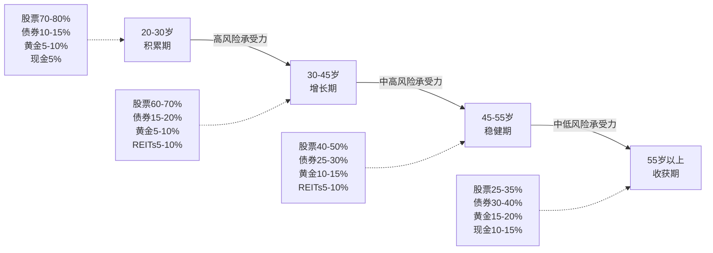

## 三、全球资产配置策略

上一节我们解决了"怎么出去"的问题——通过什么渠道把钱投到海外。但知道渠道只是第一步，更关键的问题是：**出去之后，各个篮子里分别放多少鸡蛋？** 这就是资产配置策略要回答的问题。

诺贝尔经济学奖得主威廉·夏普说过一句话："资产配置是投资收益差异的主要来源。"研究表明，投资组合长期回报的90%以上由资产配置决定，而非个股选择或择时。全球资产配置的核心，是通过在不同国家、不同资产类别之间合理分配资金，在可承受的风险水平下获取最优回报。

本节将系统讲解三件事：**用什么框架配置（核心-卫星法）、具体配什么比例（按资产规模分层方案）、配好之后怎么维护（再平衡策略）。**

***

### 一、为什么"配比例"比"选标的"更重要

在深入策略之前，先理解一个反直觉的事实：**很多投资者花90%的时间在研究"买什么股票"上，但实际上配比例对最终收益的影响远大于选股。**

#### 1.1 Brinson研究的结论

1986年，Gary Brinson等人对美国91只大型养老基金进行了实证研究，发现投资组合回报差异的**93.6%**可以由资产配置政策来解释，而非选股或择时。后续1991年的跟进研究将样本扩大到82只基金，结论一致。

这意味着什么？假设你有100万资金：
- **方案A**：花大量时间精选个股，但A股和美股比例8:2
- **方案B**：直接买宽基指数ETF，但A股和美股比例4:3，加上债券和黄金3成

长期来看，方案B的风险调整后收益大概率优于方案A。因为方案A把80%的鸡蛋放在了单一市场，一次A股系统性下跌（如2022年沪深300下跌21.6%）就会造成巨大损失；方案B通过地域分散，在A股下跌时美股和黄金可能对冲部分损失。

#### 1.2 全球配置的数学优势

从数学角度看，全球资产配置的收益来自**相关性不等于1**这一基本事实。当两个市场的相关系数小于1时，分散投资可以在不降低预期收益的前提下降低波动率。

**不同市场相关系数（基于近20年数据）：**

| 市场对 | 相关系数 | 分散效果 |
|--------|---------|---------|
| A股 vs 美股 | 0.25-0.35 | **好** — 关联度低，分散效果显著 |
| A股 vs 港股 | 0.60-0.75 | 一般 — 港股受内地经济影响较大 |
| A股 vs 日股 | 0.15-0.25 | **很好** — 相关性极低 |
| A股 vs 黄金 | -0.05~0.10 | **极好** — 几乎零相关甚至负相关 |
| 美股 vs 欧股 | 0.70-0.85 | 一般 — 发达市场同步性较高 |
| 美股 vs 新兴市场 | 0.40-0.55 | 中等 — 比发达市场更有独立性 |
| 股票 vs 债券 | -0.20~0.20 | **好** — 经典的对冲组合 |

**关键洞察：** A股与日股、黄金的相关性最低，这意味着它们是A股投资者最好的分散工具。A股和港股的相关性偏高，光买港股并不能显著降低整体组合的波动。

***

### 二、核心-卫星配置法：最实用的配置框架

在众多资产配置方法中，**核心-卫星法（Core-Satellite Strategy）** 是最适合个人投资者的框架。它由先锋基金（Vanguard）创始人约翰·博格推广，被全球无数专业投资者和机构使用。

#### 2.1 什么是核心-卫星法

核心-卫星法将投资组合分为两个部分：

- **核心（Core）**：占总资金的60%-70%，投资于低成本、宽基、被动指数基金，目标是获取市场平均收益（Beta收益）
- **卫星（Satellite）**：占总资金的30%-40%，投资于行业主题ETF、个股、另类资产等，目标是获取超额收益（Alpha收益）

```text
                  ┌─────────────────────────────────────┐
                  │          你的投资组合（100%）          │
                  │                                     │
                  │  ┌──────────────────────────────┐   │
                  │  │     核心 Core（60%-70%）       │   │
                  │  │  宽基指数ETF，被动持有          │   │
                  │  │  目标：获取全球市场平均收益       │   │
                  │  │  换手率低，费率低               │   │
                  │  └──────────────────────────────┘   │
                  │                                     │
                  │  ┌─────────┐ ┌─────────┐ ┌────────┐│
                  │  │卫星1     │ │卫星2     │ │卫星3    ││
                  │  │行业/主题 │ │个股/另类 │ │机会型  ││
                  │  │10%-15%  │ │10%-15%  │ │5%-10% ││
                  │  └─────────┘ └─────────┘ └────────┘│
                  └─────────────────────────────────────┘
```

#### 2.2 为什么核心-卫星法适合中国投资者

**理由一：解决了"选什么"的决策焦虑。** 大多数投资者面临的最大问题不是"要不要投资海外"，而是"投什么"。核心-卫星法告诉你：60%-70%的钱不用选，直接买宽基指数就行。你只需要在30%-40%的卫星部分做决策，大幅降低了决策难度。

**理由二：平衡了收益与成本。** 核心部分用被动指数基金，费率通常在0.03%-0.50%之间，远低于主动基金的1%-2%。卫星部分虽然可能费率较高，但占比小，对整体成本影响有限。

**理由三：容错性高。** 即使卫星部分的个别投资判断失误，只要核心部分稳健，整体组合就不会出大问题。卫星部分的亏损被核心部分的稳定表现所缓冲。

**理由四：操作简单，适合长期执行。** 核心部分买入后长期持有，只需定期再平衡。投资者可以将精力集中在卫星部分的研究上，这比同时研究整个组合的所有标的要轻松得多。

#### 2.3 核心-卫星法与其他配置方法的对比

| 方法 | 核心思路 | 优势 | 劣势 | 适合人群 |
|------|---------|------|------|---------|
| **核心-卫星法** | 60-70%被动+30-40%主动 | 平衡成本与收益，容错高 | 卫星部分仍需研究能力 | **大部分个人投资者** |
| 全被动指数法 | 100%被动指数基金 | 成本最低，最省心 | 放弃超额收益可能 | 极度懒人/纯长期投资者 |
| 全主动管理法 | 100%主动选股/择时 | 超额收益潜力最大 | 成本高、对能力要求极高 | 专业投资者/基金经理 |
| 全天候策略 | 25%股票+25%债券+25%商品+25%黄金 | 极度分散，穿越牛熊 | 收益上限偏低 | 极度保守/大资金 |
| 风险平价法 | 按风险贡献而非资金比例配置 | 更科学的风险管理 | 实操复杂度高 | 机构投资者 |

***

### 三、全球资产配置的具体方案

理论讲完了，接下来是"抄作业"时间。以下是按资产规模分层的具体配置方案，每一套都可以直接执行。

#### 3.1 方案一：入门级配置（可投资资金5万-30万人民币）

适合刚开始做全球配置的投资者。核心目标：**用最低门槛建立全球分散的框架。**

**全部用QDII基金+国内平台即可实现，无需开海外账户。**

| 配置层 | 资产类别 | 具体标的 | 配比 | 说明 |
|--------|---------|---------|------|------|
| 核心 | 美国市场 | 标普500指数基金（如博时标普500ETF联接） | 30% | 全球最大最成熟的市场 |
| 核心 | 中国市场 | 沪深300指数基金 | 20% | 本土市场，了解最深 |
| 核心 | 全球市场 | 全球精选指数基金 | 10% | 覆盖欧洲、日本等发达市场 |
| 卫星 | 科技主题 | 纳斯达克100指数基金 | 10% | 科技成长的卫星配置 |
| 卫星 | 债券 | 全球债券基金 | 15% | 降低组合波动的稳定器 |
| 卫星 | 黄金 | 黄金ETF | 10% | 对冲极端风险的避风港 |
| 卫星 | 新兴市场 | 新兴市场指数基金 | 5% | 小比例参与高增长市场 |

**购买渠道：** 支付宝→基金→搜索上述基金名称，或天天基金、蛋卷基金等平台。100元起投，定投频率建议按月。

**预期效果：** 年化波动率约12%-16%（相比纯A股的20%-25%显著降低），预期年化收益6%-10%（取决于全球宏观环境）。

**具体执行步骤：**

1. 在支付宝或天天基金开设基金账户（已有则跳过）
2. 搜索上述基金，确认基金代码和费率
3. 设置定投计划：每月固定日期，按上述比例自动扣款
4. 每季度查看一次组合表现，不需要每天盯盘
5. 每年做一次再平衡（详见第五节）

> **💡 新手提示：** 如果5万以下资金，可以先只配"美国+中国+黄金"三个标的，比例40%:40%:20%。等资金积累到5万以上再按完整方案执行。

***

#### 3.2 方案二：进阶级配置（可投资资金30万-200万人民币）

适合有一定投资经验、已开设港股或美股账户的投资者。核心目标：**在全球分散的基础上，追求更高的收益弹性。**

| 配置层 | 资产类别 | 具体标的 | 配比 | 说明 |
|--------|---------|---------|------|------|
| 核心 | 美国市场 | VOO（标普500ETF）或 VTI（全市场ETF） | 25% | 低成本，费率仅0.03% |
| 核心 | 中国市场 | 沪深300ETF（A股）+ 恒生科技ETF（港股） | 15%+5%=20% | A+H双市场覆盖 |
| 核心 | 发达国际 | VXUS（美国以外全球市场）或 EFA（欧洲远东） | 10% | 分散美国集中度风险 |
| 卫星 | 日本市场 | EWJ（日本ETF）或日经225ETF | 5% | 低相关性对冲 |
| 卫星 | 科技成长 | QQQ（纳斯达克100）+ 个股（如AAPL、MSFT） | 5%+5%=10% | 科技主题+精选龙头 |
| 卫星 | 新兴市场 | VWO（新兴市场ETF）或 EEM | 5% | 高增长潜力 |
| 卫星 | 债券 | BND（美国总债券）+ 国内纯债基金 | 8%+5%=13% | 中外债券双保险 |
| 卫星 | 黄金 | GLD（黄金ETF）或 AU9999 | 5% | 避险资产 |
| 卫星 | REITs | VNQ（美国REITs）或全球REITs基金 | 4% | 不动产收益+通胀对冲 |
| 卫星 | 现金/货币基金 | 美元货币基金 + 人民币余额宝 | 3% | 流动性储备 |

**预期效果：** 年化波动率约13%-17%，预期年化收益7%-12%。比入门方案多出REITs和个股配置，收益弹性更大，但需要更强的研究能力。

**海外账户开户建议：**

- **美股/全球ETF**：盈透证券（IB）是最专业的选择，支持全球150+市场，费率低。开户需护照，线上申请3-5个工作日通过
- **港股**：富途牛牛或老虎证券，中文界面，操作友好
- **入金**：每人每年5万美元便利化购汇额度，通过银行电汇到券商

> **⚠️ 重要提醒：** 海外投资收益需在国内申报个税。股票买卖差价暂免征收个人所得税（政策层面），但股息红利需按20%税率缴纳。港股通的股息红利按10%（H股）或20%（非H股）代扣代缴。

***

#### 3.3 方案三：高净值配置（可投资资金200万-1000万人民币）

适合资产规模较大、需要系统化管理的投资者。核心目标：**在收益、风险、税务三个维度同时优化。**

| 配置层 | 资产类别 | 具体标的 | 配比 | 说明 |
|--------|---------|---------|------|------|
| 核心 | 美国大盘 | VTI（全市场）+ VOO（标普500） | 20% | 美国市场双覆盖 |
| 核心 | 亚太市场 | 沪深300 + 恒生指数 + 日经225 | 8%+5%+4%=17% | 亚太三市场分散 |
| 核心 | 欧洲市场 | VGK（欧洲ETF） | 5% | 成熟市场补充 |
| 卫星 | 科技主题 | QQQ + 精选个股（5-8只） | 5%+8%=13% | 主动选股追求Alpha |
| 卫星 | 新兴市场 | VWO + 印度ETF (INDA) | 3%+2%=5% | 高增长配置 |
| 卫星 | 债券 | BND + TIPS（通胀保护债券）+ 国内债券 | 5%+3%+5%=13% | 多层次债券配置 |
| 卫星 | 黄金+大宗商品 | GLD + DJP（商品指数） | 5%+2%=7% | 通胀对冲+避险 |
| 卫星 | 全球REITs | VNQ（美国）+ VNQI（国际） | 3%+3%=6% | 不动产全球化配置 |
| 卫星 | 另类投资 | 私募基金/对冲基金/加密资产 | 5% | 高净值专属配置 |
| 卫星 | 现金 | 美元货币基金 + 人民币 + 港币 | 4% | 多币种流动性 |

**200万以上资金的额外考量：**

1. **税务架构设计**：是否需要考虑税务身份？是否利用香港的属地征税制度？这部分建议咨询专业税务顾问（费用通常在5000-20000元/次），但合法节税的收益远超顾问费用
2. **离岸账户配置**：考虑开设香港银行账户（如汇丰、渣打），持有部分资金在离岸账户，方便全球调配
3. **保险配置**：通过香港保险持有部分海外资产，兼具保障和投资功能
4. **家族信托**：500万以上资金可考虑设立家族信托，实现资产隔离和代际传承

***

#### 3.4 方案四：超高净值配置（可投资资金1000万人民币以上）

适合资产规模大、需要全球架构设计的投资者。核心目标：**多法人架构、多税务身份、多司法管辖区的系统化管理。**

这个层级的配置已经超越了简单的"买什么基金"，需要考虑的因素包括：

**（1）全球架构设计**

```text
                    ┌───────────────────────┐
                    │    家族控股公司         │
                    │   （如BVI/开曼）       │
                    └──────────┬────────────┘
                               │
            ┌──────────────────┼──────────────────┐
            │                  │                  │
     ┌──────┴──────┐   ┌──────┴──────┐   ┌──────┴──────┐
     │  投资公司A   │   │  投资公司B   │   │  投资公司C   │
     │ （香港）     │   │ （新加坡）   │   │ （美国）     │
     │ 股票/债券   │   │ 亚太房产     │   │ 美国资产     │
     └─────────────┘   └─────────────┘   └─────────────┘
```

**（2）资产配置比例参考**

| 资产大类 | 配比 | 细分 |
|---------|------|------|
| 全球股票 | 35%-40% | 美国15%、亚太10%、欧洲5%、新兴市场5-10% |
| 固定收益 | 20%-25% | 投资级债券10%、高收益5%、通胀保护5%、新兴市场债5% |
| 另类投资 | 15%-20% | 私募股权5%、对冲基金5%、REITs5%、加密资产0-5% |
| 实物资产 | 10%-15% | 海外房产5-10%、大宗商品3-5%、黄金3-5% |
| 现金等价物 | 5%-10% | 多币种现金管理 |

**（3）必须聘请的专业团队**

- 全球税务顾问（精通CRS、FATCA和主要国家税法）
- 离岸架构律师（设计BVI/开曼/新加坡架构）
- 家族办公室或独立资管（管理日常投资执行）
- 保险经纪人（大额保单、海外保险配置）

**费用预估：** 专业顾问年费通常在资产规模的0.5%-1%，即1000万资产每年5-10万。但一个好的税务架构每年合法节税的金额可能是顾问费的5-10倍。

***

### 四、资产配置的四大核心原则

无论你采用哪套方案，以下四条原则是全球资产配置的"铁律"，违反任何一条都可能导致严重后果。

#### 4.1 原则一：地域分散是第一优先级

**为什么？** 同一个国家的资产之间相关性太高。2015年A股千股跌停时，你持有的所有A股——无论大盘蓝筹还是中小创——几乎全部下跌。但如果你同时持有美股、黄金、日本市场，这些资产在A股暴跌时可能上涨或跌幅有限。

**具体执行：**
- 任何单一国家的配置不超过总资金的40%
- 至少覆盖3个以上不同国家/地区的市场
- 优先选择相关性低的市场组合（参见第一节的相关系数表）

**常见错误：** "我已经买了港股和A股，算两个市场了。"——港股（尤其是H股）与A股高度相关，这不算真正的地域分散。真正有效的分散是A股+美股/日股/欧洲市场。

#### 4.2 原则二：资产类别分散是第二优先级

**为什么？** 即使在同一个国家，不同资产类别的表现也差异巨大。2022年美股大跌时，美国国债虽然也跌了，但跌幅远小于股票；黄金在2022年表现平平，但在2008年金融危机和2020年疫情期间大涨。

**五大资产类别及其作用：**

| 资产类别 | 经济繁荣 | 经济衰退 | 通胀上升 | 通缩/危机 | 在组合中的角色 |
|---------|---------|---------|---------|----------|-------------|
| 股票 | ★★★★★ | ★★ | ★★★ | ★ | 增长引擎 |
| 债券 | ★★★ | ★★★★ | ★★ | ★★★★ | 稳定器 |
| 黄金 | ★★ | ★★★★ | ★★★★★ | ★★★★★ | 避风港 |
| 大宗商品 | ★★★★ | ★★ | ★★★★★ | ★ | 通胀对冲 |
| REITs | ★★★★ | ★★ | ★★★ | ★★ | 现金流+通胀保护 |

**具体执行：** 至少配置3种以上不同资产类别。最简单的组合是"股票+债券+黄金"三件套，已经能覆盖大多数经济环境。

#### 4.3 原则三：不要把所有外汇风险集中在一种货币

**为什么？** 如果你的资产100%以人民币计价，人民币贬值时你的购买力下降；如果100%以美元计价，人民币升值时你又吃亏。最佳策略是持有多种货币计价的资产，自然对冲汇率风险。

**具体执行：**
- 人民币资产占总配置的30%-50%（本土优势+消费货币）
- 美元资产占总配置的30%-40%（全球储备货币+投资货币）
- 其他货币资产占10%-20%（日元、欧元、港币等）

> **💡 实操提示：** 很多人纠结"人民币贬值还是升值"，试图择时换汇。事实是，即使是专业外汇交易员也很难持续预测汇率走势。**分散持有多种货币**本身就是最有效的汇率风险管理策略，不需要预测。

#### 4.4 原则四：配置比例一旦确定，不要频繁调整

**为什么？** 频繁调整配置比例会带来两个问题：一是增加交易成本（尤其是海外交易的手续费和汇率成本）；二是容易被短期市场波动影响判断，做出错误决策。

**具体执行：**
- 配置方案确定后，至少坚持6个月以上不做大调整
- 只在以下三种情况考虑调整配置比例：（1）人生阶段发生重大变化（如结婚、生子、换工作）；（2）资产规模变化超过50%；（3）市场发生系统性危机（如全球性金融危机）
- 日常波动不需要理会——2023年AI概念股大涨，不需要因此大幅提高科技股比例

***

### 五、再平衡策略：配好之后怎么维护

资产配置不是"配一次就不管了"。随着时间推移，不同资产的涨跌会导致实际配置比例偏离目标比例。**再平衡（Rebalancing）** 就是定期将配置比例拉回目标值的操作。

#### 5.1 为什么需要再平衡

假设你的目标配置是：美国50%、中国30%、黄金20%。

经过一年，美国大涨20%，中国持平，黄金涨了5%。你的实际配置变成了：
- 美国：50% × 1.20 = 60 → 占比 60/110 = 54.5%
- 中国：30% × 1.00 = 30 → 占比 30/110 = 27.3%
- 黄金：20% × 1.05 = 21 → 占比 21/110 = 18.2%

美国的占比从50%升到了54.5%——你不知不觉中承担了更多的美国市场风险。如果不做再平衡，几年后你的组合可能70%都在美国市场，完全丧失了分散的意义。

**再平衡的双重好处：**
1. **控制风险**：确保组合风险水平始终符合你的承受能力
2. **天然的"高抛低吸"**：卖出涨多了的（美国），买入跌多了的（中国），强制执行"逆向投资"

#### 5.2 三种再平衡策略

**策略一：定期再平衡（推荐新手）**

固定时间间隔（如每季度或每年）检查一次配置比例，偏离超过阈值就调仓。

| 参数 | 建议设置 | 说明 |
|------|---------|------|
| 频率 | 每年1-2次 | 频率太高增加成本，太低失去再平衡意义 |
| 触发阈值 | 偏离目标比例±5% | 如目标50%，实际45%或55%时触发 |
| 调整方式 | 卖高买低 | 卖出超配资产，买入低配资产 |
| 优先用新资金 | 是 | 如果有新增投资资金，优先投入到低配资产中，避免卖出产生的交易成本 |

**具体操作流程（以年度再平衡为例）：**

```text
步骤1：记录当前各资产的实际市值
       美国ETF: 54.5万, 中国ETF: 27.3万, 黄金: 18.2万
       总计: 100万

步骤2：计算实际比例
       美国: 54.5%, 中国: 27.3%, 黄金: 18.2%

步骤3：与目标比例对比
       美国: +4.5% (54.5%-50%), 中国: -2.7% (30%-27.3%), 黄金: -1.8%

步骤4：判断是否触发
       美国偏离4.5% < 5%阈值 → 本次不触发再平衡
       （如果美国涨到56%则触发）

步骤5：如触发，计算调整金额
       目标: 美国50万, 中国30万, 黄金20万
       需卖出美国: 54.5-50=4.5万
       需买入中国: 30-27.3=2.7万
       需买入黄金: 20-18.2=1.8万

步骤6：执行交易（同一天完成，避免价格波动）
```

**策略二：阈值触发再平衡（推荐进阶投资者）**

不看时间，只看偏离度。当任何资产的配置比例偏离目标超过设定阈值（如±5%或±10%）时，立即触发再平衡。

- **优势：** 只在真正需要时才调仓，减少不必要的交易
- **劣势：** 需要经常监控组合，适合有时间和精力的投资者
- **实操：** 在Excel或Google Sheet中设置公式自动监控，偏离超阈值时邮件/微信提醒

**策略三：现金流再平衡（推荐持续定投的投资者）**

不做卖出操作，只通过调整新增资金的投向来实现再平衡。这是成本最低、操作最简单的策略。

- **操作方式：** 每月定投时，多投低配资产，少投或不投超配资产
- **优势：** 零卖出成本，无资本利得税
- **劣势：** 如果偏离度大而新增资金少，再平衡速度较慢
- **适用条件：** 新增资金占总组合比例较高时效果最好（如每年新增资金占总组合20%以上）

**三种策略的对比选择：**

| 策略 | 操作复杂度 | 交易成本 | 再平衡精度 | 适合场景 |
|------|-----------|---------|-----------|---------|
| 定期再平衡 | 低 | 中 | 中 | 大部分投资者，尤其是新手 |
| 阈值触发 | 中 | 低 | 高 | 有精力监控组合的进阶投资者 |
| 现金流再平衡 | 最低 | 最低 | 低 | 持续定投、新增资金占比高的投资者 |

**我的建议：** 对于大多数投资者，采用"年度定期再平衡 + 日常现金流再平衡"的组合策略最佳。每年年底花半小时检查一次组合比例，平时定投时根据偏离度调整各标的的投入比例。操作简单，效果不差。

#### 5.3 再平衡中的实操注意事项

**（1）尽量避免卖出，优先用新资金调整**

卖出海外资产涉及手续费、汇率成本（换回人民币再换出）、可能的税务影响。如果能通过调整新增投资的方向来实现再平衡，成本最低。

**（2）海外交易的时间差**

美股交易时间是中国的晚上到凌晨，港股交易时间与A股部分重叠。再平衡时注意：
- 先确认各市场的开盘时间
- 避免在市场剧烈波动时执行大额交易
- 使用限价单（Limit Order）而非市价单（Market Order），避免滑点

**（3）汇率因素的纳入**

再平衡时不仅要看资产价格的变化，还要考虑汇率变化。例如美股ETF涨了10%，但美元兑人民币贬值了5%，实际人民币计价的收益只有约5%。在做再平衡决策时，应以人民币计价的实际市值为基准。

**（4）税务友好的再平衡顺序**

如果同时持有应税账户和免税账户（如个人养老金），再平衡时优先在免税账户内操作，减少应税事件。例如在A股账户中卖出超配的沪深300ETF，在个人养老金账户中买入低配的债券基金——两边都不产生额外税负。

***

### 六、不同人生阶段的配置策略调整

资产配置不是一成不变的。随着年龄增长、收入变化、家庭责任增加，配置策略也需要动态调整。

#### 6.1 生命周期配置框架



**20-30岁（积累期）：** 时间是最大的优势。即使短期亏损，还有几十年时间等待恢复。因此可以承受更高的波动，股票配比最高。全球配置重点放在美股科技+中国成长股。

**30-45岁（增长期）：** 收入增长期，但家庭责任也在增加（房贷、子女教育）。股票配比略降，增加债券和REITs。全球配置开始考虑子女教育基金的海外投资。

**45-55岁（稳健期）：** 接近退休年龄，风险承受力下降。大幅提高债券和黄金配比，减少高波动资产。全球配置开始考虑海外退休规划（如东南亚低成本生活）。

**55岁以上（收获期）：** 资产保值优先于增值。债券和现金成为主力，股票只保留分红型蓝筹。全球配置重点在于税务优化和遗产规划。

#### 6.2 配置策略的动态调整清单

| 触发事件 | 调整方向 | 原因 |
|---------|---------|------|
| 结婚 | 降低高波动资产比例5%-10% | 财务责任从个人变双人 |
| 生子 | 增加债券+教育储蓄 | 短期支出增加，长期有教育金需求 |
| 买房 | 现金比例提高至10%-15% | 可能需要大额首付 |
| 换工作/失业 | 现金比例提高至6个月开支 | 应对收入中断风险 |
| 获得大额收入（如年终奖/继承） | 一次性投入到低配资产 | 利用现金流再平衡 |
| 市场暴跌超过30% | 审视是否需要提高股票比例 | 危机往往是长期布局的好时机 |
| 临近退休（5年内） | 逐步降低股票至目标比例 | 减少退休时遭遇大额亏损的风险 |

***

### 七、实战案例：一个具体的配置调整过程

为了让上述理论更加具体，这里展示一个完整的配置调整案例。

**背景：** 张先生，35岁，互联网公司产品经理，年收入50万，已有投资资产80万（全部在A股），已婚，有一个3岁孩子。

**第一步：评估当前状况**

当前配置：A股100%（沪深300ETF 40万 + 行业基金30万 + 个股10万）。问题：单一市场风险集中，没有海外配置，没有债券和黄金。

**第二步：确定目标配置（采用进阶级方案）**

| 资产类别 | 目标比例 | 目标金额 |
|---------|---------|---------|
| A股（沪深300） | 25% | 20万 |
| 港股（恒生科技） | 5% | 4万 |
| 美股（VOO） | 20% | 16万 |
| 发达国际（VXUS） | 10% | 8万 |
| 日本（EWJ） | 5% | 4万 |
| 债券（BND+国内纯债） | 15% | 12万 |
| 黄金（GLD） | 10% | 8万 |
| REITs（VNQ） | 5% | 4万 |
| 现金 | 5% | 4万 |

**第三步：制定过渡计划（分3个月执行，避免一次性大调仓）**

第1个月：
- 卖出A股个股10万 → 买入黄金ETF 8万 + 现金货币基金2万
- 新增定投：标普500QDII基金 1万/月

第2个月：
- 卖出A股行业基金15万 → 通过港股通买入恒生科技ETF 4万 + 开通盈透证券
- 盈透证券入金：使用本年度换汇额度，购汇5万美元（约35万人民币），实际入金12万
- 买入VOO 16万（但首次只入金12万，下月补足）

第3个月：
- 盈透证券补足入金：使用配偶换汇额度购汇
- 买入VXUS 8万 + EWJ 4万 + VNQ 4万
- 调整国内基金：卖出部分沪深300，买入纯债基金
- 最终组合达到目标配置

**第四步：后续维护**

- 每月定投：VOO 3000元 + 沪深300 2000元 + 纯债基金 1500元（利用现金流再平衡）
- 每年12月底做一次全面再平衡
- 每3年根据人生阶段调整一次目标配置比例

***

### 八、常见问题与误区

#### Q1：我只有5万块钱，有必要做全球配置吗？

**有必要，而且越早越好。** 5万块用QDII基金就能实现"美股30%+中国30%+黄金20%+债券20%"的全球配置。金额小不是不做分散的借口——100%亏损和30%亏损的区别，对5万和500万是一样痛苦的。更重要的是，从5万开始建立配置习惯，等资金到50万、500万时，你已经有了成熟的框架和经验。

#### Q2：全球配置收益是不是比全买美股低？

短期看可能如此，尤其是美股大牛市时期（如2023-2024年AI行情）。但全球配置的优势在于**风险调整后收益更优**。2022年美股标普500下跌19.4%，而全球分散组合通常只跌8%-12%。长期来看（20年以上），全球配置的夏普比率（每单位风险获得的收益）通常比单一市场高20%-40%。

#### Q3：再平衡时卖出赚钱的资产，不是在"截断盈利"吗？

这是最常见的误解。再平衡的本质是**风险控制**，而非"截断盈利"。你卖出的超配资产确实在赚钱，但你也同时买入了低配资产——这些资产更便宜，未来上涨的空间更大。研究表明，系统性再平衡的组合在长期（10年以上）通常跑赢不做再平衡的组合1-2个百分点。

#### Q4：QDII基金费率太高（1%-1.5%），值得买吗？

QDII基金的费率确实比直接买海外ETF高。但这笔"额外成本"换来的是：不需要开设海外账户、不需要处理外汇兑换、不需要担心资金安全、不需要自己做税务申报。对于入门级投资者（5万-30万），QDII基金的便利性远超费率差异带来的影响。当资金规模超过50万，且你已经熟悉海外市场操作时，可以逐步转向直接购买海外ETF（费率低至0.03%-0.20%）。

#### Q5：我应该一次配到位，还是分批建仓？

**建议分批建仓。** 如果你一次性将所有资金投入，恰好遇到市场下跌，心理压力会很大。分3-6个月逐步建仓，既能摊平成本，又能给自己适应新配置的时间。但也不要拖延太久——研究表明，对于长期投资（10年以上），分批建仓和一次性建仓的最终收益差异很小，最大的风险是"一直等下去不开始"。

#### Q6：配置比例能不能抄别人的作业？

**可以参考，但不要照搬。** 本节给出的方案是通用参考，你需要根据自己的风险承受能力、收入稳定性、家庭责任、投资期限进行微调。最简单的方法是：先按推荐方案执行一年，观察自己在市场波动中的心理反应。如果市场下跌10%时你焦虑得睡不着觉，说明股票配比过高，下次再平衡时降低5%-10%股票比例。如果市场下跌20%你依然淡定，可以考虑适当提高股票比例。

***

### 九、本节核心要点

1. **资产配置决定90%以上的长期回报差异**——配比例比选标的更重要
2. **核心-卫星法是最实用的配置框架**——60%-70%被动核心+30%-40%主动卫星
3. **具体方案按资产规模分四档**——5万起步用QDII，50万以上开海外账户，200万以上考虑税务架构，1000万以上需要全球架构设计
4. **四条铁律**：地域分散优先、资产类别分散、多币种持有、不频繁调整
5. **再平衡是配好之后的关键维护**——年度定期+现金流调整是最优组合策略
6. **配置随人生阶段动态调整**——年轻时多股票，年长时多债券和黄金
7. **100元QDII基金就是全球配置的第一步**——不要等"有钱了"再开始
