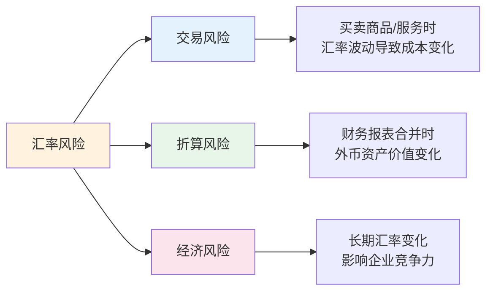
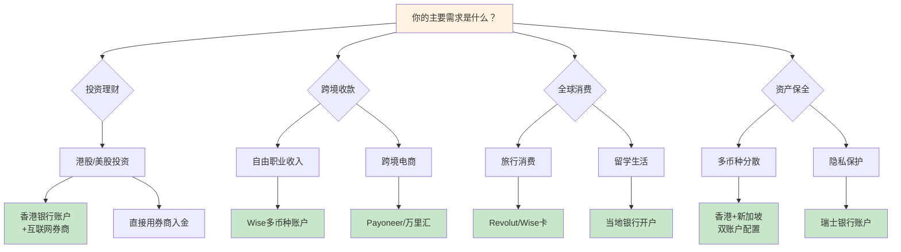
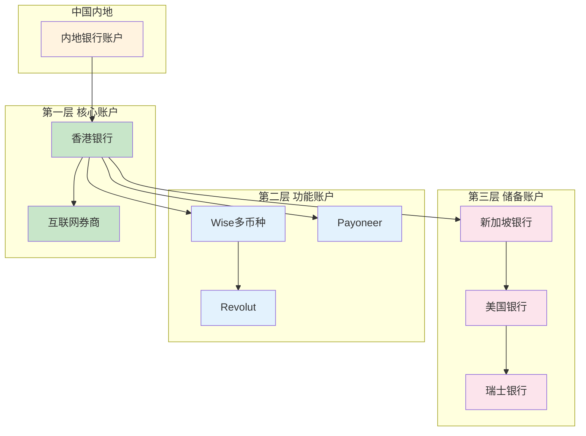

## 四、海外银行开户与外汇管理

### 4.1 为什么你需要一个海外银行账户

很多人认为海外银行账户是"有钱人才需要的东西"，这是一个严重的认知误区。在以下场景中，一个海外银行账户几乎是刚需：

| 场景 | 没有海外账户的困境 | 有海外账户的便利 |
|------|-------------------|-----------------|
| 接收海外自由职业收入 | 走PayPal→提现损失3%-5%汇率差 | 客户直接电汇，零中间费 |
| 海外券商入金 | 每次电汇200-400元手续费 | 本地转账免费或极低成本 |
| 海外电商收款 | 依赖第三方结汇，有额度限制 | 直接收外币，自主换汇 |
| 出国旅行/留学 | 现金携带限制，刷卡汇率不透明 | 本地卡消费，汇率最优 |
| 应对政策风险 | 单一法币资产，受单一司法管辖区管辖 | 多币种资产，风险分散 |

**核心逻辑：** 海外银行账户的本质不是"把钱转出去"，而是获得一个**多币种的资金中转站**。它让你能够在全球范围内灵活调度资金，降低交易成本，同时提供一层资产保护。

---

### 4.2 主流海外银行开户地对比

选择在哪里开户，需要综合考虑开户门槛、账户维护成本、银行稳定性、隐私保护和实际用途。以下是主流选择的详细对比：

#### 4.2.1 香港银行账户（首选推荐）

香港是中国大陆居民最容易开立的离岸银行账户，也是全球搞钱的第一步。

**主流银行对比：**

| 银行 | 最低存款要求 | 开户方式 | 特色优势 | 年费/管理费 |
|------|------------|---------|---------|------------|
| 汇丰银行（HSBC） | 无最低要求（普通账户） | 赴港面签 | 全球网点最多，卓越理财可全球互转免费 | 日均余额<5000港币收50港币/月 |
| 中国银行（香港） | 无最低要求 | 赴港面签 | 与内地中行同名转账免费 | 免管理费 |
| 渣打银行 | 无最低要求（优先理财需100万港币） | 赴港面签 | 多币种账户，全球ATM取款免费 | 日均余额<1万港币收100港币/月 |
| 招商银行（香港） | 无最低要求 | 赴港面签 | 与内地招行互转极方便 | 免管理费 |
| 众安银行（ZA Bank） | 无 | 纯线上开户 | 虚拟银行，零门槛 | 免管理费 |
| 富融银行（Fusion Bank） | 无 | 纯线上开户 | 腾讯系虚拟银行 | 免管理费 |

**开户实操流程（以汇丰为例）：**

1. **预约：** 提前在汇丰官网预约开户时间，选择离你最近的香港分行
2. **准备材料：**
   - 有效期内的港澳通行证（或护照）
   - 身份证原件
   - 近3个月的住址证明（水电煤账单、银行对账单、信用卡账单，任选其一）
   - 内地手机号码
   - 入境小票（入境香港时保留）
3. **面签当天：**
   - 按预约时间到分行，填写开户申请表
   - 银行经理会询问开户目的（如实回答：投资、收款、旅行消费等）
   - 签署相关协议，设置网银密码
   - 当场拿到账户号码，实体卡通常1-2周寄到内地地址
4. **激活账户：** 收到卡后通过网银或ATM激活，首次存入一笔资金（建议至少1000港币）

**虚拟银行（众安、富融等）开户流程更简单：**

1. 下载银行App
2. 用内地身份证+港澳通行证在线验证身份
3. 人脸识别
4. 开户完成，全程无需赴港

> **注意：** 虚拟银行功能相对有限，适合日常小额消费和收款。如果你需要大额转账、投资理财、信用贷款等功能，建议开立传统银行账户。

#### 4.2.2 新加坡银行账户

新加坡是亚洲金融中心，银行体系成熟稳定，隐私保护好，适合中高净值人群。

| 银行 | 最低存款 | 开户方式 | 特色 |
|------|---------|---------|------|
| DBS星展银行 | 1000新币 | 远程视频开户 | 东南亚最大银行，网银体验好 |
| OCBC华侨银行 | 1000新币 | 赴新加坡面签 | 华人银行，中文服务好 |
| UOB大华银行 | 1000新币 | 赴新加坡面签 | 与微信支付打通 |

**新加坡开户特点：**
- 部分银行支持远程视频开户（需提前预约并准备材料）
- 账户多为多币种，支持美元、欧元、英镑、日元等主流货币
- 新加坡元（SGD）是亚洲重要避险货币之一
- 开户后可以绑定新加坡股票交易账户，投资东南亚市场

#### 4.2.3 美国银行账户

美国银行账户主要用于美股投资和美元收款，但对非居民开户门槛较高。

| 银行 | 开户方式 | 最低存款 | 特色 |
|------|---------|---------|------|
| 华美银行（East West Bank） | 赴美面签 | 1500美元 | 华人银行，中文服务 |
| 国泰银行（Cathay Bank） | 赴美面签 | 1000美元 | 华人银行，加州网点多 |
| Chase摩根大通 | 赴美面签 | 无 | 全美最大银行之一 |
| Mercury | 纯线上（需美国公司） | 无 | 创业者首选，纯数字银行 |

**美国开户的关键前提：**
- 通常需要一个美国地址（可以使用邮寄代理服务，如iPostal1，月费约10-20美元）
- 需要美国手机号（Google Voice或Tello等虚拟号码即可）
- 部分银行需要SSN/ITIN（个人纳税识别号），申请ITIN需填写W-7表格并邮寄至IRS
- 华美银行和国泰银行对中国大陆居民相对友好，支持护照开户

#### 4.2.4 其他热门选择

**瑞士银行账户：**
- 传统避险天堂，隐私保护全球顶级
- 开户门槛高（通常要求最低存款5万-100万瑞士法郎）
- 推荐：瑞银（UBS）、瑞士信贷（已被UBS收购）、Julius Baer

**迪拜银行账户：**
- 零税率，无外汇管制
- 开户相对容易，护照+签证即可
- 推荐：Emirates NBD、Mashreq Bank

**英国银行账户：**
- 金融体系成熟，全球通用
- 部分数字银行支持非居民开户
- 推荐：Wise（多币种账户）、Monzo、Revolut

---

### 4.3 多币种账户与国际支付工具

除了传统银行，还有一些金融科技工具可以替代或辅助银行账户的功能：

#### 4.3.1 Wise（原TransferWise）

Wise 是目前最受欢迎的跨境支付工具之一，核心优势是**真实汇率+低手续费**。

**核心功能：**
- **多币种账户：** 持有40+种货币，包括美元、欧元、英镑、港币、日元等
- **虚拟银行账号：** 获取美国、英国、欧元区、澳大利亚等地区的本地银行账号，直接接收当地货币转账
- **换汇：** 使用真实中间市场汇率，手续费仅0.35%-1.5%
- **Wise借记卡：** 全球消费，自动以最优汇率扣款

**费用结构：**

| 服务 | 费用 |
|------|------|
| 开户 | 免费 |
| 换汇手续费 | 约0.35%-1.5%（取决于币种） |
| 接收美元/欧元/英镑 | 免费 |
| 发送国际转账 | 约0.6%（取决于币种和金额） |
| ATM取款 | 每月前200英镑免费，超出1.75% |
| 实体卡 | 一次性约7英镑 |

**Wise 对比传统银行电汇：**

| 对比项 | Wise | 传统银行电汇 |
|--------|------|------------|
| 汇率 | 真实中间汇率 | 银行加点0.5%-3% |
| 手续费 | 约0.5%-1% | 固定200-400元/笔 |
| 到账时间 | 1-2个工作日 | 3-5个工作日 |
| 透明度 | 费用全部预知 | 中间行扣费不可控 |

#### 4.3.2 Revolut

Revolut 是欧洲最大的数字银行之一，适合在欧洲活动的人群。

**核心功能：**
- 支持30+种货币即时换汇
- 虚拟卡和实体卡（一次性虚拟卡号，安全性极高）
- 加密货币买卖
- 股票和商品交易
- 每月前1000美元免手续费换汇（标准版）

**账户等级：**
- Standard（免费）：基础功能
- Plus（月费约33元人民币）：更多免费换汇额度、旅行保险
- Premium（月费约55元）：无限免费换汇、VPN、高级分析
- Metal（月费约110元）：最高权益，含返现

#### 4.3.3 其他实用工具

| 工具 | 核心功能 | 最适合场景 |
|------|---------|-----------|
| Payoneer（派安盈） | 跨境收款，亚马逊/Fiverr等平台收款 | 跨境电商卖家、自由职业者 |
| WorldFirst（万里汇） | 跨境收款，费率低至0.3% | 跨境电商卖家 |
| PingPong | 跨境收款，中国团队 | 中国跨境电商卖家 |
| Airwallex（空中云汇） | 多币种企业账户 | 跨境企业、创业者 |
| OFX | 大额换汇，费率优惠 | 大额换汇（5万美元以上） |

---

### 4.4 中国外汇管制：规则与应对

#### 4.4.1 个人外汇管理的基本规则

中国的外汇管制是所有跨境资金操作必须了解的底层规则。以下是关键要点：

**个人年度便利化额度：**
- 每人每年等值**5万美元**的购汇和结汇额度
- 用途必须真实，不能用于境外买房、证券投资、购买人寿保险等资本项目
- 银行会要求填写《个人购汇申请书》并声明用途

**合法资金出境渠道：**

| 渠道 | 限额 | 适用场景 | 注意事项 |
|------|------|---------|---------|
| 个人年度便利化额度 | 5万美元/年 | 留学、旅游、就医 | 不能用于资本项下 |
| 个人财产对外转移 | 无上限 | 移民后资产转移 | 需提供移民证明，审批严格 |
| 留学购汇 | 凭录取通知书和学费证明 | 留学学费和生活费 | 超5万美元需额外审批 |
| 境外就医购汇 | 凭就医证明 | 医疗费用 | 需提供医院费用证明 |
| 工资收入结汇 | 凭劳动合同和完税证明 | 外资企业工资收入 | 无金额限制 |

**违规操作的严重后果：**
- **蚂蚁搬家**（多人分拆购汇汇给同一境外账户）：被列入"关注名单"，取消2年便利化额度
- **虚构交易背景**：涉嫌逃汇罪，可处30%以上罚款，情节严重者追究刑事责任
- **地下钱庄**：涉嫌非法经营罪，最高可判15年有期徒刑

> **底线提醒：** 外汇管理是法律红线，任何操作都必须在合法框架内进行。5万美元的年度额度看似限制，但对于大多数个人投资者来说已经足够——真正需要突破额度的场景，应该通过合法渠道（如QDII基金、港股通等）实现。

#### 4.4.2 常见合法操作场景详解

**场景一：向海外券商入金**

1. 通过银行购汇（选择"旅游"或"其他服务"用途）
2. 通过银行电汇至券商指定的托管银行账户
3. 单笔汇款建议不超过3万美元，避免触发额外审核
4. 保留好汇款凭证和入金确认

**场景二：接收海外自由职业收入**

1. 客户通过银行电汇至你的香港银行账户
2. 资金到达香港账户后，可以留在港币或换为美元
3. 需要时通过合法渠道将资金调回内地
4. 注意：这类收入需要在中国申报个人所得税

**场景三：跨境电商收款**

1. 使用Payoneer、万里汇等平台收款
2. 平台提供虚拟海外银行账号（美元、欧元、英镑等）
3. 在平台内可以换汇，也可以提现至内地银行
4. 单笔提现金额建议在5万美元以内

#### 4.4.3 资金回流的合法路径

资金出去容易回来难——这是很多人忽视的问题。以下是合法的资金回流方式：

| 方式 | 适用场景 | 到账时间 | 费用 |
|------|---------|---------|------|
| 香港银行账户→同名内地账户 | 大额资金调回 | 1-3个工作日 | 汇款手续费约100-200港币 |
| Wise跨境转账 | 中小额资金 | 1-2个工作日 | 约0.5%-1% |
| 西联汇款 | 紧急小额 | 即时到数小时 | 固定费用+汇率差 |
| 支付宝/微信跨境收款 | 小额个人收款 | 即时 | 汇率差约0.5%-1% |

---

### 4.5 外汇风险管理

持有外币资产必然面临汇率风险。2022年美元对人民币从6.3升至7.3，持有美元资产的人浮盈超过15%；反之，2023年人民币走强时，持有美元的人面临账面缩水。

#### 4.5.1 汇率风险的三种类型

对于个人投资者，主要关注的是**交易风险**——即你在持有外币资产期间，汇率变化带来的损益。

#### 4.5.2 外汇对冲策略

**策略一：自然对冲（推荐入门者）**

- 将资产分散在多种货币中：美元40%、欧元20%、港币20%、日元10%、人民币10%
- 不同货币的汇率波动会相互抵消
- 最简单的对冲方式，无需额外成本

**策略二：定期定额换汇**

- 每月固定日期、固定金额换汇
- 利用时间分散，平滑汇率波动
- 类似于基金定投的"成本平均"效应

**策略三：利用远期合约（进阶）**

- 与银行签订远期外汇合约，锁定未来某日的汇率
- 适合已知金额和日期的大额支出（如学费、购房款）
- 需要缴纳保证金，通常为合约金额的3%-5%

**策略四：货币期权（高阶）**

- 购买货币看涨/看跌期权，获得汇率保护
- 成本为期权费（通常为合约金额的1%-3%）
- 适合大额资产配置，上限损失可控

#### 4.5.3 实用汇率监控工具

| 工具 | 类型 | 核心功能 |
|------|------|---------|
| XE.com | 网站/App | 实时汇率、汇率提醒、历史图表 |
| Wise汇率监控 | App | 实时汇率、价格提醒、换汇计算器 |
| Investing.com | 网站/App | 专业金融数据、技术分析 |
| 中国银行牌价 | 网站/App | 官方汇率、购汇/结汇价差 |
| 极简汇率 | 微信小程序 | 快速查汇率，无需安装App |

---

### 4.6 反洗钱与合规：每个跨境操作者的必修课

#### 4.6.1 了解KYC（了解你的客户）

所有正规银行和金融机构都执行KYC政策，这意味着：

- **开户时：** 需要提供身份证明、地址证明、资金来源说明
- **交易时：** 大额交易（通常单笔超过1万美元）会触发额外审核
- **定期更新：** 银行可能要求定期更新身份信息和资金来源说明

**如何顺利通过KYC：**
1. 保持个人信息（地址、职业、联系方式）的一致性
2. 如实申报收入来源和开户目的
3. 保留所有交易凭证和合同
4. 避免频繁的大额不明来源资金进出

#### 4.6.2 CRS（共同申报准则）的影响

CRS 是全球税务信息自动交换机制，目前已有100多个国家和地区加入。这意味着：

- 你在中国以外的银行账户信息（余额、利息、股息等）会自动报送给中国税务机关
- 你在海外的收入在中国也需要纳税
- 试图通过海外账户避税已经不再可行

**CRS覆盖的主要信息：**
- 账户持有人的身份信息
- 账户余额和年度变动
- 利息、股息、保险收益等收入
- 金融资产出售所得

#### 4.6.3 税务合规的实操建议

1. **保留完整的资金流水记录：** 包括入金、出金、交易记录、收入凭证
2. **了解双边税收协定：** 中国与多个国家签有避免双重征税协定，可以减少重复纳税
3. **区分资本利得和收入：** 不同类型的收入适用不同税率和申报规则
4. **咨询专业税务师：** 当海外收入超过一定规模时，专业税务筹划可以节省大量税款
5. **主动申报：** 主动合规远比被查处后补缴要划算得多

---

### 4.7 开户决策图：选择最适合你的方案

不同需求对应不同的开户策略。根据你的情况选择路径：

---

### 4.8 账户安全管理

海外银行账户一旦开通，安全维护比开通更重要。

#### 4.8.1 基本安全措施

1. **密码管理：** 每个银行使用不同密码，建议使用1Password或Bitwarden等密码管理器
2. **双因素认证（2FA）：** 必须开启，优先使用硬件密钥（如YubiKey）或Authenticator App，避免使用短信验证码
3. **交易提醒：** 开启所有交易的即时短信/App推送通知
4. **定期登录：** 至少每月登录一次，避免账户因长期不活跃被冻结
5. **紧急联系：** 记录银行的24小时客服电话，存好国际区号

#### 4.8.2 常见风险及应对

| 风险 | 表现 | 预防措施 |
|------|------|---------|
| 账户冻结 | 长期不活跃触发冻结 | 定期登录和小额交易 |
| 网络钓鱼 | 收到伪造银行邮件 | 不点击邮件中的链接，直接输入网址登录 |
| 汇率损失 | 换汇时机不佳 | 定期定额换汇，避免择时 |
| 政策变化 | 开户门槛突然提高 | 尽早开户，未雨绸缪 |
| 卡片盗刷 | 海外刷卡信息泄露 | 使用一次性虚拟卡号，设置消费限额 |

#### 4.8.3 账户维护成本控制

海外银行账户的隐性成本往往被忽视。以下是控制成本的实用建议：

- **管理费：** 选择免管理费的银行（如虚拟银行），或维持最低存款要求
- **汇款手续费：** 优先使用Wise等低成本渠道，避免银行电汇
- **汇率差价：** 避免在ATM上选择"以人民币结算"（DCC），永远选择当地货币结算
- **取款手续费：** 使用Wise卡或Revolut卡在海外ATM取款，手续费远低于传统银行
- **跨境转账费：** 香港银行之间的转账（FPS转数快）通常免费

---

### 4.9 常见误区与纠正

**误区一：海外开户就是转移资产、洗钱**

纠正：海外开户是完全合法的行为。只要资金来源合法、如实申报、遵守外汇管理规定，开设海外银行账户没有任何法律风险。全球数以亿计的人都拥有海外银行账户。

**误区二：5万美元额度完全不够用**

纠正：5万美元（约35万人民币）的年度额度对大多数个人投资者来说足够。更重要的是，海外投资可以通过QDII基金、港股通等合规渠道突破额度限制。5万美元限制的是直接购汇，不是投资总额。

**误区三：有了海外账户就可以避税**

纠正：在CRS框架下，全球税务信息已经透明化。海外账户不能、也不应该用于避税。正确的做法是合法节税——利用双边税收协定、合理的税务结构来减少不必要的税负。

**误区四：虚拟银行不安全**

纠正：虚拟银行同样受到当地金融监管机构的严格监管。例如香港的虚拟银行需获得香港金管局颁发的银行牌照，存款同样受存款保障计划保护（每人最高50万港币）。

**误区五：开户之后就万事大吉**

纠正：开户只是第一步。账户维护（定期登录、信息更新、安全管理）才是长期工作。很多人的海外账户因为长期不活跃被冻结，重新激活的流程远比开户复杂。

---

### 4.10 进阶：构建你的全球银行账户体系

对于认真搞全球化搞钱的人，建议构建一个**三层账户体系**：

**第一层：核心账户（必开）**
- 香港银行账户（中银香港或汇丰）：资金中转站，连接内地与全球
- 互联网券商账户（富途/盈透）：全球投资入口

**第二层：功能账户（按需开立）**
- Wise多币种账户：低成本跨境收款和换汇
- Payoneer：跨境电商收款专用
- Revolut：欧洲消费和换汇

**第三层：储备账户（高净值配置）**
- 新加坡银行账户：亚洲资产配置中心
- 美国银行账户：美元资产配置
- 瑞士银行账户：终极资产保全

**构建顺序建议：**
1. 先开香港银行账户（门槛最低、最实用）
2. 开互联网券商账户（开始全球投资）
3. 开Wise账户（低成本跨境收款）
4. 根据需要逐步扩展第二、三层账户

**维护成本控制：** 核心账户保持足够的最低存款以免除管理费；功能账户选择免费版本即可满足大多数需求；储备账户只在有明确需求时再开立，避免不必要的维护成本。

---

### 4.11 本节核心要点回顾

1. **海外银行账户是全球化搞钱的基础设施**，不是奢侈品，早开比晚开好
2. **香港账户是首选**，门槛最低、与内地连接最方便
3. **Wise等金融科技工具是传统银行的有效补充**，费率更低、操作更便捷
4. **中国外汇管制是法律红线**，5万美元年度额度内操作即可，不要触碰地下钱庄
5. **CRS已实现全球税务透明**，合法合规是唯一正确选择
6. **账户安全和维护成本**是开户后需要持续关注的重点
7. **三层账户体系**是长期目标，初期只需第一层即可满足大部分需求
